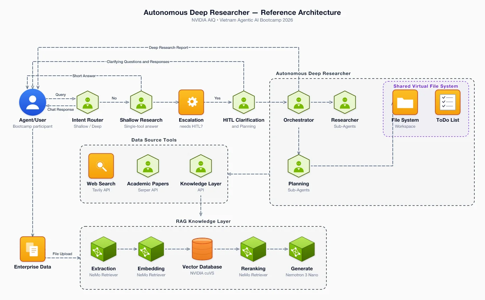

<h1 align="center">kymo</h1>

<p align="center">
  <a href="https://kymostudio.github.io/kymostudio/app/">Live Editor</a>
  <span>|</span>
  <a href="https://kymostudio.github.io/kymostudio/">Website</a>
  <span>|</span>
  <a href="./docs/guide/getting-started.md">Documentation</a>
</p>

<p align="center">
  <a href="https://pypi.org/project/kymostudio/"></a>
  <a href="https://www.npmjs.com/package/kymostudio"></a>
  <a href="https://crates.io/crates/kymostudio"></a>
  <a href="https://marketplace.visualstudio.com/items?itemName=kymostudio.kymostudio-vscode"></a>
  <a href="https://github.com/kymostudio/kymostudio/actions/workflows/test.yml"></a>
  <a href="./LICENSE"></a>
</p>

> **Type it. See it appear. Watch it animate.**

Kymostudio is a collection of libraries and tools to turn diagram-as-code source into animated SVG and related formats such as PNG, WebP, Figma and Excalidraw.



## ✨ Features

- **Draws what you actually need**  
  Software architecture, process flows and standard BPMN, all rendered faithfully.
- **Starts from any source**  
  Author in the `.kymo` DSL, or feed it BPMN, JSON or Python.
- **Write once, export anywhere**  
  One source compiles to SVG, PNG, WebP, Figma and Excalidraw.
- **Diagrams as code**  
  Describe your diagram in a clean, line-oriented `.kymo` syntax — no dragging boxes around.
- **Animated by default**  
  Edges come alive with built-in flowing animation, straight to a self-contained SVG.
- **Smart auto-layout**  
  Frames, anchoring, edge routing and canvas sizing are figured out for you.
- **A rich icon library**  
  2,460 icons spanning AWS, Azure, GCP, Kubernetes, on-prem and more.

## Install

```bash
pip install kymostudio        # Python
npm install kymostudio        # JavaScript
cargo install kymostudio      # Rust
```

## Usage

### 1. Render a diagram

```bash
kymo sample.kymo              # → sample.svg
kymo sample.kymo --animate    # → sample-animated.svg
kymo sample.kymo --figma      # → sample.figma.js
kymo sample.kymo --excalidraw # → sample.excalidraw
```

### 2. Import BPMN

```bash
kymo process.bpmn             # → process.svg
kymo lint process.bpmn        # check for issues
```

### 3. Convert SVG to PNG

Render any `.svg` to a PNG image — no headless browser required.

```bash
kymo diagram.svg out.png      # SVG → PNG
```

### 4. Browse the icon catalogue

Explore the bundled icons right from the CLI.

```bash
kymo icons list                         # list every icon set
kymo icons list aws                     # list icons in one provider
kymo icons search database              # find icons by keyword
kymo icons describe aws:compute-ec2     # show details for one icon
kymo icons download aws:compute-ec2     # save the icon to a file
```
