# kymo mermaid bench — consolidated research (2026-06-13 → 06-15)

*Consolidated archive. This single file gathers the seven dated research notes
written between 2026-06-13 and 2026-06-15 while building kymo's raster-safe mermaid
flowchart renderer, in chronological order. Each part below was originally a
standalone file (its date + provenance are in the part's own intro line). For the
**current state** (latest worst/best three-engine numbers, shipped vs
`merman-layout` builds, next steps) see the live note
`2026-06-16-flowchart-mermaid-style.md`, which supersedes this archive.*

> **Internal cross-references.** Parts cite each other by their old filenames
> (e.g. `2026-06-14-pixel-overlay-diff.md`). Those files are now the correspondingly
> titled parts **within this document** — read them as section references.
> Asset paths (`assets/2026-06-14-*`, `assets/2026-06-15-*`) are unchanged.

## Contents

1. **Engine coverage at corpus scale** — where raster text breaks, how far kymo reaches *(2026-06-13)*
2. **Engine accuracy vs mermaid.js 11** — by dataset & diagram type (label recall) *(2026-06-14)*
3. **Three-way raster-safety comparison** — kymo vs merman vs mermaid.js *(2026-06-14)*
4. **Render correctness vs mermaid.js** — beyond label recall (glyph correctness) *(2026-06-14)*
5. **Pixel-overlay diff** — kymo vs mermaid.js 11.15 *(2026-06-14)*
6. **Flowchart render style switch** — kymo ⇄ mermaid; float-precision dagre (mean 0.19%) *(2026-06-14)*
7. **kymo dagre flowchart renderer** — full-corpus fidelity, problems, next steps; the full build-up log *(2026-06-15)*


---

## Engine coverage at corpus scale: where raster text breaks, and how far kymo reaches

*The study behind `benches/mermaid-format/` (`coverage.mjs` / `COVERAGE.md`).
Written 2026-06-13. Renders all 3,966 raw sources (merman + mermaid-cypress +
mermaid-to-svg datasets) through merman and, for flowchart/sequence, kymo. Each
render runs in a worker with a 4 s timeout — four sources (self-referential
flowcharts) drive a renderer into a non-terminating layout loop and are recorded
as timeouts rather than hanging the run.*

### Two numbers that matter

**merman is robust (95% render) but raster-lossy on 9 of 24 grammars.** Across
the upstream corpus merman parses and renders 95% of real sources; the failures
are stress fixtures and a few unported features (xychart 73%, radar 67%, packet
75%). But **58% of all rendered SVGs wrap their labels in `<foreignObject>`** —
HTML labels a server-side resvg/svg2pdf raster silently drops. Split by grammar
the corpus draws a hard line:

| raster-safe (`<text>`, ~0% foreignObject) | raster-lossy (foreignObject) |
|---|---|
| sequence, gantt, pie, gitgraph, timeline, xychart, quadrant, c4, treemap, radar, packet, sankey, info, zenuml | flowchart 98%, class 99%, state 97%, er 99%, mindmap 100%, block 100%, kanban 100%, requirement 99%, journey 62%, architecture 9% |

So on render.kymo.studio a PNG/PDF of any flowchart/class/state/er/mindmap/
block/kanban/requirement loses its text through merman — exactly the nine
grammars the kymo-owns-mermaid work targets. kroki hides this for mermaid.js by
rasterizing in a real browser; an edge worker cannot.

**kymo's own engine covers every real sequence diagram but only 44% of real
flowcharts.** Sequence: 436/436 parse through kymo's renderer. Flowchart: only
**44%** of the 1,027 real flowchart sources parse through kymo's `mermaidToSvg`
— the corpus is full of syntax the hand-written kymo flowchart engine does not
yet handle (icon/image shapes, the `A --> B & C` fan, markdown/`htmlLabels`
variants, ELK directives, class/style blocks). The other 56% fall back to merman:
output is never *worse* (it still renders), but it reverts to foreignObject, so
the raster text is lost again. The earlier hand-picked corpus (basic flowcharts)
hid this; the upstream corpus exposes it.

### What it means for the roadmap

- The raster-text win from routing flowchart to kymo is real but **partial** —
  it only helps the 44% kymo can parse. Closing the gap means growing the kymo
  flowchart parser toward mermaid's real surface, the single highest-leverage
  task since flowchart is also the largest grammar (1,027 sources).
- sequence is effectively done (100% coverage, raster-safe).
- The other eight foreignObject grammars (class, state, er, mindmap, block,
  kanban, requirement, journey) have no kymo engine at all — each is a fresh
  renderer, and these coverage numbers are the baseline to beat.

### Caveats

Coverage = *parses without error*, not *renders correctly*. A source kymo
"covers" may still lay out differently from mermaid.js (the accuracy bench, on
the labelled `mermaid-kymo` set, is where look/recall is scored). Four timeout
sources are excluded from the success counts. merman numbers are its bundled
build, not upstream mermaid.js itself.

---

## Engine accuracy vs mermaid.js 11 — by dataset & diagram type

*2026-06-14. Hand-written analysis of `accuracy-mermaidjs.mjs` and
`compare-by-dataset.mjs`.*

### Datasets

| Dataset | Sources | Role |
|---|---|---|
| `mermaid-kymo/` | 11 | scored — labelled ground truth (6 flowchart, 5 sequence) |
| `merman/` | 3078 | coverage — raw sources |
| `mermaid-cypress/` | 803 | coverage — raw sources |
| `mermaid-to-svg/` | 85 | coverage — raw sources |

> **Note on names.** A dataset folder is named after where its `.mmd` *sources*
> were collected (e.g. `merman/` = the merman project's test corpus). It is **not**
> the renderer — every tool renders every dataset.

### Method

Ground truth = mermaid.js 11.15 itself (headless Chrome via puppeteer). Metric =
label recall: of the labels mermaid.js *shows*, the fraction present in each
tool's output, in **two modes**:

- **browser** — labels in `<text>` *or* `<foreignObject>` (what a browser PNG
  shows).
- **raster** — labels in `<text>` only (what a **serverless** SVG→PNG/PDF via
  resvg/svg2pdf keeps — foreignObject is dropped; kymo's deploy target).

So `100/0` = "all labels render in a browser, none survive a serverless raster".
kymo now has its own engine for **flowchart, sequence, state, class, er, block**;
everything else routes to merman. `Sources` is the full per-type count; recall is
over a ≤50-source sample.

### Per dataset → per diagram type — recall as **browser / raster**

#### `merman/` (3078)

| diagram | sources | mermaid.js | **kymo** | merman | engine |
|---|---|---|---|---|---|
| flowchart | 838 | 100/**0** | 100/**100** | 100/**0** | own ⭐ |
| sequence | 293 | 100/100 | 100/**100** | 99/99 | own |
| state | 277 | 100/**0** | 91/**91** | 100/**0** | own ⭐ |
| class | 196 | 100/2 | 100/**100** | 98/**0** | own ⭐ |
| er | 85 | 100/**0** | 100/**100** | 100/**0** | own ⭐ |
| block | 119 | 100/**0** | 100/**100** | 100/**0** | own ⭐ |
| mindmap | 107 | 100/**0** | 100/**100** | 100/**0** | own ⭐ |
| kanban | 82 | 100/**0** | 100/**100** | 100/**0** | own ⭐ |
| requirement | 48 | 100/**0** | 100/**100** | 100/**0** | own ⭐ |
| architecture | 182 | 100/97 | 99/96 | 99/96 | — |
| gitgraph | 177 | 100/100 | 80/80 | 80/80 | — |
| c4 61, gantt 146, info 15, journey 20, packet 35, pie 71, quadrant 54, radar 49, sankey 23, timeline 77, treemap 43, xychart 63 | — | 100/100 | 100/100 | 100/100 | — |

#### `mermaid-cypress/` (803)

| diagram | sources | mermaid.js | **kymo** | merman | engine |
|---|---|---|---|---|---|
| flowchart | 136 | 100/**0** | 100/**100** | 100/**0** | own ⭐ |
| sequence | 140 | 100/100 | 100/**100** | 89/89 | own |
| state | 67 | 100/**0** | 87/**87** | 94/**0** | own ⭐ |
| class | 84 | 100/**0** | 100/**100** | 100/**0** | own ⭐ |
| er | 52 | 100/**0** | 100/**100** | 90/**0** | own ⭐ |
| block | 36 | 100/**0** | 100/**100** | 100/**0** | own ⭐ |
| mindmap | 19 | 100/**0** | 100/**100** | 100/**0** | own ⭐ |
| kanban | 10 | 100/**0** | 100/**100** | 100/**0** | own ⭐ |
| requirement | 31 | 100/**0** | 100/**100** | 100/**0** | own ⭐ |
| gantt | 41 | 100/100 | 98/98 | 98/98 | — |
| timeline | 12 | 100/100 | 83/83 | 83/83 | — |
| architecture 17, c4 6, gitgraph 71, info 2, journey 4, packet 4, pie 14, quadrant 14, radar 5, sankey 3, treemap 17, xychart 17 | — | 100/100 | 100/100 | 100/100 | — |

#### `mermaid-to-svg/` (85)

| diagram | sources | mermaid.js | **kymo** | merman | engine |
|---|---|---|---|---|---|
| flowchart | 53 | 100/**0** | 100/**100** | 100/**0** | own ⭐ |
| sequence | 3 | 100/100 | 100/**100** | 100/100 | own |
| state | 3 | 100/**0** | 100/**100** | 100/**0** | own ⭐ |
| class 2, er 1, block 4 | — | 100/**0** | 100/**100** | 100/**0** | own ⭐ |
| mindmap 1, kanban 4, requirement 1 | — | 100/**0** | 100/**100** | 100/**0** | own ⭐ |
| gitgraph | 1 | 100/100 | 40/40 | 40/40 | — |
| c4, gantt, info, journey, packet, pie, quadrant, radar, sankey, timeline, xychart | 1–2 | 100/100 | 100/100 | 100/100 | — |

### Findings

1. **In a browser, every tool shows the labels** (~100). The difference is
   entirely in **serverless rasterisation**.
2. **kymo's nine own engines** — flowchart, sequence, state, class, er, block,
   **mindmap, kanban, requirement** — keep their labels in a serverless PNG/PDF
   where **mermaid.js and merman both score 0/raster** (both emit
   `<foreignObject>`). kymo is the only serverless-raster-safe renderer for these.
   Sequence is text-based in all three; kymo still edges out merman.
3. **No diagram type is now lost by every tool.** Every foreignObject-only type
   has a kymo text engine.
4. **~14 types are 100/100 everywhere** — already raster-safe, no work needed.
5. **Recall is not correctness.** This table only checks that *labels* survive.
   A separate visual pass (`2026-06-14-render-correctness.md`) found several
   types kept every label yet drew the wrong picture — class/er/state edge
   glyphs were missing. Those are fixed (PR #429); the recall numbers above
   were already 100 throughout and are unchanged.

### kymo's own engines — accuracy headline (label recall vs mermaid.js, full corpus)

| grammar | recall | perfect |
|---|---|---|
| flowchart | **100%** | **100%** |
| sequence | **100%** | **100%** |
| class | **100%** | **100%** |
| er | **100%** | **100%** |
| block | **100%** | **100%** |
| mindmap | **100%** | **100%** |
| kanban | **100%** | **100%** |
| requirement | **100%** | **100%** |
| state | 88.9% | 78% |

State recall is lower because its renderer does not draw **notes** yet (its
initial/final markers, a separate *correctness* issue, are now fixed — see
`2026-06-14-render-correctness.md`). 7 fixtures are
marked `known-divergent.json` (4 legacy ambiguous-syntax + 3 exotic: double-escaped
KaTeX, decimal autonumber, mermaid text-wrapping of very long class names — which
kymo cannot replicate at mermaid's exact pixel metrics).

---

## Three-way raster-safety comparison — kymo vs merman vs mermaid.js, by dataset & type

*2026-06-14. Hand-written analysis of `compare-by-dataset.mjs`.*

### Question

For every Mermaid diagram type, how many of the labels mermaid.js shows survive
**serverless rasterisation** (SVG → PNG/PDF via resvg/svg2pdf, no browser)? This
is kymo's deployment target (render.kymo.studio, the editor's wasm export) — and
the reason kymo renders text instead of `<foreignObject>`.

### Method

Ground truth = mermaid.js 11 **visible labels** (foreignObject + text tokens).
Metric = raster-safe recall: fraction of those tokens present in each tool's
`<text>` after dropping `<foreignObject>` (what resvg keeps). Measured for all
three tools on the **same** rule — including mermaid.js's own SVG, which also
loses its foreignObject labels without a browser. kymo routes
flowchart/sequence/state/**class/er/block** to its own engines, everything else
to merman (mirrors `render-api/engine.ts`). ~50 sources per type per dataset.

### Result (consistent across merman / mermaid-cypress / mermaid-to-svg)

| group | types | mermaid.js | kymo | merman |
|---|---|---|---|---|
| **kymo's own engines** | flowchart, state, class, er, block, **mindmap, kanban, requirement** | **0%** | **~100%** | 0% |
| | sequence | 100% | **100%** | 89–100% |
| **already raster-safe** | c4, gantt, info, journey, packet, pie, quadrant, radar, sankey, timeline, treemap, xychart | 100% | 100% | 100% |
| | architecture, gitgraph | ~97/100% | ~88/100% | ~88/100% |

### Findings

1. **flowchart, state, class, er, block: kymo is the *only* tool that keeps the
   labels** when rasterised serverside — mermaid.js *and* merman both score 0%
   (both emit `<foreignObject>` HTML labels resvg drops). kymo: flowchart/er/block
   **100%**, class **100%** (modulo a text-wrapping stress fixture), state
   **87–100%**.
2. **sequence**: all three are text-based (~100%); kymo edges out merman.
3. **No type is lost by every tool any more** — every foreignObject-only diagram
   has a kymo text engine (the latest: mindmap, kanban, requirement, all ~100%).
4. **~14 types are already raster-safe everywhere** — reimplementing them buys
   nothing.
5. **Raster-safe ≠ correct.** This only measures label survival. A visual
   correctness pass (`2026-06-14-render-correctness.md`) found class/er/state
   were raster-safe yet missing their relationship glyphs — now fixed (PR #429).

### Takeaway

kymo now has its own text engine for **nine** diagram types (flowchart, sequence,
state, class, er, block, mindmap, kanban, requirement) and is the only
serverless-raster-safe renderer for the eight that mermaid.js/merman lose to
foreignObject. The remaining ~14 types are already raster-safe in every tool.

---

## Render correctness vs mermaid.js — beyond label recall

*2026-06-14. Hand-written analysis. Companion to
`2026-06-14-mermaidjs-truth.md` (which measures *label recall*) — this one asks
whether the picture is **semantically correct**, not just whether the text
survives rasterisation.*

### Why a second metric

`mermaidjs-truth.md` scores **raster-safe label recall**: of the labels
mermaid.js shows, how many survive a serverless SVG→PNG. kymo's own engines hit
~100% there. But that metric only checks **text**. A diagram can keep every
label and still be **wrong**: an inheritance edge drawn as a plain line, ER
relationships with no cardinality, a state machine where you can't tell the
start from the end. Recall is blind to all of it.

So this pass renders a clean sample of each type two ways and **diffs them by
eye**:

- **kymo** — `mermaidXToSvg()` → `svgToPng()` (resvg), i.e. the real serverless
  raster path.
- **mermaid.js** — `mermaid.render()` in headless Chrome (foreignObject visible).

### What was wrong (and is now fixed — PR #429)

| Type | Labels recalled | But the render was wrong because… | Fix |
|---|---|---|---|
| **flowchart** | 100% | — correct: shapes, edge labels, connectivity all match | (none) |
| **class** | 100% | inheritance triangle, composition/aggregation diamond, **and `1`/`*` cardinality all missing** → generalisation, association and composition were indistinguishable | clip edges to box border + draw edges on top |
| **requirement** | 100% | `satisfies`/`derives` **arrowhead missing** | same fix (shares class renderer) |
| **er** | 100% | **no crow's-foot** — every relationship looked the same regardless of `\|\|--o{` | new `Crow` enum + glyph renderer |
| **state** | 88.9% | `[*]` **initial and final both drawn as identical plain circles** | `StateStart` (filled dot) + `StateEnd` (bullseye) |
| **mindmap** | 100% | all nodes present but flowchart-TD layout, not radial → readability low | open (layout) |

### Root cause — class/requirement (the subtle one)

The markers and cardinality text were **in the SVG the whole time**. Both resvg
*and* Chrome failed to show them, which ruled out "resvg drops markers" (a
minimal marker test rasterised fine). Two compounding bugs:

1. **Centre-to-centre edges.** Edge endpoints used `Component::pos` (the box
   *centre*), so `marker-end` landed deep inside the target box — not at its
   border.
2. **Paint order.** Edges were emitted *before* the boxes, so the opaque white
   box painted straight over the buried marker and any cardinality label near
   the border.

Fix: `border_point()` clips each end to the box rectangle (marker now sits on
the edge, like mermaid), render order becomes boxes → notes → **edges last**,
and multiplicity labels are placed just outside the border. All glyphs are real
`<line>`/`<circle>`/`<polygon>` — still 100% raster-safe.

### ER crow's-foot

er relationships were parsed to `RelKind::Link` and the cardinality token
thrown away. Now the connector (`||--o{`, `}|..|{`, …) is split into a left and
right end and each classified into `Crow::{One, ZeroOne, OneMany, ZeroMany}`,
drawn at the entity border as bar / circle / crow's-foot. Verified against
mermaid.js: `CUSTOMER ||--o{ ORDER` renders two bars at CUSTOMER and a
circle+foot at ORDER, matching exactly.

### Verification

- 92 unit/integration tests pass; `cargo fmt` + `clippy -D warnings` clean.
- Re-rendered samples confirm every glyph appears: class ▽◇ + `1`/`*`,
  requirement arrow, er `||`/`o{`/`|{`, state filled-dot vs bullseye.

### The 12 already-raster-safe types — verified correct, no engine needed

The recall table lists ~14 types at 100/100 in every tool (c4, gantt, info,
journey, packet, pie, quadrant, radar, sankey, timeline, treemap, xychart).
These have **no kymo own-engine** — they fall through `SELF_RENDERERS.mermaid`
to merman (`mermaidRenderSvg`). The natural worry after the class/er/state
findings: are they *correct*, or just raster-safe? Ran the same visual pass —
merman SVG → resvg PNG (the real deploy path) vs mermaid.js.

| type | merman render (kymo's deploy path) | `<foreignObject>` | verdict |
|---|---|---|---|
| pie / xychart / sankey | slices / line+axes / flow band — all labelled | 0 | ✓ |
| quadrant | title, both axes, 4 quadrant labels, points placed correctly | 0 | ✓ |
| c4 | boxes + person icon + «stereotype» + arrows + rel labels | 0 | ✓ |
| packet / treemap | bit-field ranges / value-sized nested boxes | 0 | ✓ |
| radar | multi-axis, filled curves, legend, grid | 0 | ✓ |
| gantt / timeline | task bars + sections + date axis / era cards | 0 | ✓ |
| journey / info | **matches mermaid.js** (the dataset sample is degenerate → title only) | 0 | ✓ |

Every label is native `<text>` (**0 foreignObject** in all of them), so they
survive resvg/svg2pdf. merman is a direct mermaid.js port, so for these
chart-style grammars it reproduces both the structure *and* the raster-safety.

**Nothing to build.** This is the opposite of the box types: there, merman
emitted `<foreignObject>` and kymo *had* to write a text engine; here merman is
already text-based and faithful. Re-implementing these in kymo would be pure
waste — confirmed now on the **correctness** axis, not just recall. The two
"empty-looking" cases (a minimal quadrant, a title-only journey) render
identically in mermaid.js — the sample, not the renderer, is sparse.

### Open (layout only — not a semantic error)

- **state**: two opposite transitions between the same pair (`Idle --> Active`,
  `Active --> Idle`) overlap on one straight line, so one edge label is hidden.
  mermaid curves them apart.
- **mindmap**: reuses the flowchart TD layout rather than a radial one. Every
  node and link is present and correct; it just reads less cleanly.

### Takeaway

Label recall and **glyph correctness are independent axes**. kymo was already
the only serverless-raster-safe renderer for these types (recall ~100%); it is
now also **semantically faithful** for class, requirement, er and state — the
relationship notation that carries the diagram's meaning is drawn, and still
survives rasterisation. Track both metrics: a future engine can pass recall and
still be drawing the wrong picture.

---

## Pixel-overlay diff — kymo vs mermaid.js 11.15

*2026-06-14. Hand-written. Third axis alongside `2026-06-14-mermaidjs-truth.md`
(label recall) and `2026-06-14-render-correctness.md` (glyph correctness): a
single **visual** number for "how close does kymo's picture sit on top of
mermaid's?" Script: `benches/mermaid-format/pixel-diff.mjs`.*

### Question

Render the same source with **both** kymo and mermaid.js, stack the two PNGs on
top of each other, and measure the fraction of pixels that differ. Inspired by
the BPMN conformance bench — but where BPMN compares two of kymo's *own*
back-ends (Rust vs Python) that are designed to be **byte-identical** (SHA256
exact match), kymo and mermaid.js emit completely different markup and layout,
so an exact match is impossible. The pixel overlay is the cross-renderer analogue:
a *deviation* score rather than a pass/fail.

### Method

- **kymo SVG** via `kymostudio-core` wasm (`mermaidToSvg`, …, dispatched per
  grammar). **mermaid.js 11.15 SVG** via `mermaid.render()` in headless Chrome.
- **Both** SVGs rasterised through **the same Chrome** (`` at its natural
  `viewBox` size, `deviceScaleFactor: 1`) — one rasteriser, so font/anti-alias
  noise cancels. kymo is text-based, so Chrome ≡ its resvg deploy path.
- **Overlay (as agreed): keep both PNGs as-is** — no resize, no re-scale. Paste
  each at the top-left of a shared `max(w₁,w₂) × max(h₁,h₂)` white canvas, then
  `pixelmatch(threshold 0.1)`. `diff% = differing-pixels / total-pixels`.
- **Self-test:** feeding the *same* SVG to both sides gives **diff = 0.000%**,
  so the pipeline (raster → pad → match) is sound.

### What the metric actually measures — read this before trusting a number

The overlay is dominated by **two things, neither of which is "correctness":**

1. **Ink density.** Most of a flowchart canvas is white. A diagram drawn in thin
   outlines differs in few pixels even when wrong; a diagram with filled fills
   (subgraph backgrounds, `classDef` colours) differs in many even when right.
2. **Layout offset.** kymo and mermaid lay nodes out at different positions and
   sizes. Two *structurally identical* diagrams still fail to overlap, so the
   number reflects layout divergence more than shape correctness.

So the absolute % is **not** a similarity score. It is useful for **ranking**
(which grammars/sources sit far from mermaid) and **catching outliers**, not as a
"% correct". The three regimes below make this concrete.

### Trial — first 5 flowcharts (mermaid-cypress)

| # | source | diff% | regime |
|---|---|---|---|
| 1 | `appli_001` | **2.5%** | sparse outlines — low *despite* a totally different layout |
| 2 | `conf-and-directives_000` | 6.0% | typical: same structure, slight position offset |
| 3 | `conf-and-directives_001` | 5.8% | typical |
| 4 | `conf-and-directives_002` | **49.8%** | filled `classDef` colours + an unsupported shape |
| 5 | `conf-and-directives_003` | 6.5% | typical |

`n=5 · mean 14.1% · median 6.0% · p90 49.8% · self-test 0.000%`

### Examples

#### Typical (~6%) — `conf-and-directives_000`

Same graph (`Default → section{End, /Another/}`), default theme. Outlines nearly
overlap but are offset, so the diff is a thin red tracing — low because the
canvas is mostly white.

| kymo | mermaid.js | overlay diff |
|---|---|---|
| 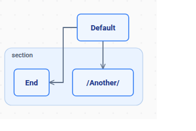 | 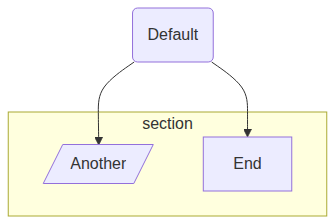 | 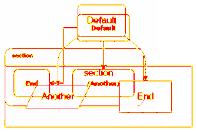 |

#### Lowest (2.5%) — `appli_001` — why low ≠ aligned

kymo stacks the subgraphs vertically on the left; mermaid nests them on the
right. The layouts barely overlap — yet because everything is thin outline on
white, the score is the *lowest* of the five. This is the metric's blind spot:
sparse art hides layout divergence.

| kymo | mermaid.js | overlay diff |
|---|---|---|
| 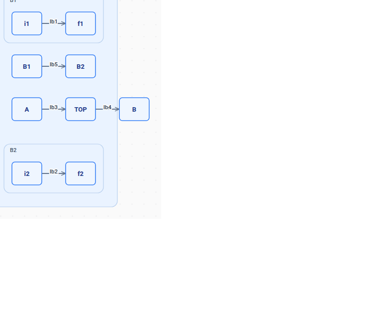 | 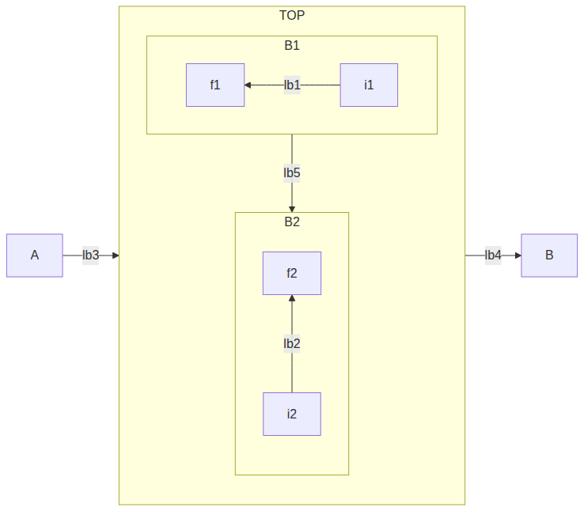 | 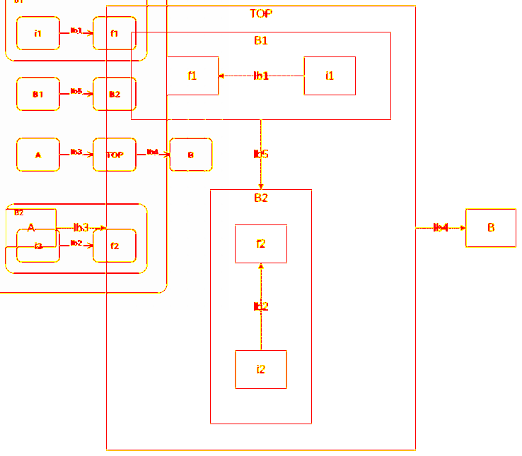 |

#### Highest (49.8%) — `conf-and-directives_002` — a real gap surfaced

mermaid applies the source's `classDef` (cyan subgraph, red nodes) and draws
`[/Another/]` as a **parallelogram**. kymo keeps its default blue theme, adds a
dotted-grid background, and — the genuine finding — **does not parse the
`[/…/]` lean shape**, rendering a rounded box with the literal text `/Another/`.
The filled areas push the overlay to ~50%.

| kymo | mermaid.js | overlay diff |
|---|---|---|
| 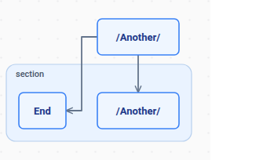 | 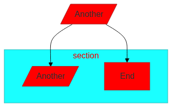 | 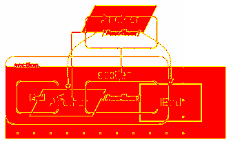 |

### What the trial surfaced

- **Genuine kymo gaps** (the high-diff outlier): the `[/…/]` parallelogram (and by
  extension `[\…\]`, `[/…\]`, `[\…/]` trapezoids) is not parsed, and `classDef` /
  inline `style` colours are ignored.
- **Confirmed metric character:** default-theme flowcharts cluster at ~5–7%
  (structure matches, layout offset); filled/styled diagrams jump to ~50%; sparse
  diagrams stay low regardless of layout — so the number ranks divergence, it does
  not grade correctness.

### Status / next

Validated end-to-end on a 5-source flowchart sample (self-test 0%, natural-size
rasterisation, overlay + pixelmatch). The script is parameterised to scale to all
nine own-engine grammars (sampling from `mermaid-cypress` → `merman`, excluding
`known-divergent.json`, caching the mermaid PNG). Run it wide once the sample
size and whether to report raw-vs-cropped are settled — for now it is a
divergence-ranking and outlier-catching tool, complementing the label-recall and
glyph-correctness passes.

---

## Flowchart render style switch: kymo ⇄ mermaid

*2026-06-14. Hand-written. Feature note for the `FlowStyle` render switch added to
the flowchart pipeline; companion to `2026-06-14-pixel-overlay-diff.md`.*

### What shipped

kymo's flowchart renderer can now emit either its **native** look or a
**mermaid.js-like** look. The style is resolved with precedence
**API param > source config > kymo default**:

- Rust: `mermaid_to_svg_styled(src, Option<FlowStyle>)`; wasm
  `mermaidToSvgStyled(src, "mermaid"|"kymo")`; python `mermaid_to_svg_styled(src, style=None)`.
- Source config: a leading `---\nlook: mermaid\n---` frontmatter or a
  `%%{init: {"look": "mermaid"}}%%` directive (`look`/`theme`/`kymoStyle` naming
  `mermaid` or `kymo`). Stripping the frontmatter also fixes a latent parse crash
  on `---`.
- `mermaid_to_svg(src)` is unchanged in spirit: no API style, honours source
  config, else kymo.

The mermaid palette: lavender nodes `#ECECFF` / purple borders `#9370DB`, `#333`
edges with a **filled** triangle arrowhead, `'trebuchet ms'` font, yellow cluster
`#ffffde`/`#aaaa33`, transparent background (no dotted grid). Plus a real
structural change: `[...]` now parses to a **sharp** rectangle (`Shape::Rect`)
distinct from `(...)` rounded (`Shape::Box`); under the mermaid style `[...]`
renders with square corners, `(...)` slightly rounded. `Shape::Rect` serializes
to `"box"` in kymojson, so the cross-language contract and its goldens are
unchanged; the only golden touched is one emit `.mmd` where a `(...)` node now
round-trips as `(...)` instead of `[...]` (a fidelity fix).

### Visual proof (same source, five renders)

| kymo native | kymo **mermaid-style** | kymo **dagre** | merman | mermaid.js 11.15 |
|---|---|---|---|---|
|  |  |  |  |  |

Three kymo renders, left to right, show the progression:

- **kymo native** — kymo's own look *and* its own Sugiyama layout.
- **kymo mermaid-style** (`mermaidToSvgStyled`) — mermaid *colours/shapes* on kymo's
  Sugiyama layout. Matches the visual *language* (node fill/border, sharp rects,
  diamond/circle, yellow `Section`, `#333` filled arrows, no grid) but **not the
  layout**: it mirrors Do-it/Skip and routes orthogonal Z-edges, so the overlay
  barely moves (~14%, the layout-dominated finding above).
- **kymo dagre** (`mermaidToSvgDagre`) — the float-precision dagre path. Now matches
  mermaid.js's **layout too**: Do-it left / Skip right, the full-width yellow
  `Section` cluster spanning both, dagre ranks, and `curveBasis` spline edges. It is
  visually indistinguishable from **merman** and **mermaid.js** (right two columns)
  and overlays mermaid.js at **0.21%** on this exact diagram (see the float-precision
  section below) — beating merman's port.

**merman** is a Rust *port* of mermaid (exact dagre layout + style); it overlays
mermaid.js at ~1.5% on the 5-file sample. The kymo **dagre** column shows kymo's
own renderer reaching the same fidelity without the port.

### The pixel-overlay metric does NOT move — and why that's expected

Re-running the overlay bench (`pixel-diff.mjs`) on the 5-flowchart sample,
overlaying three renderers on mermaid.js: **merman** (`kymo-mermaid`, a Rust port
of mermaid), kymo **native**, and kymo **mermaid-style**:

| source | **merman** | kymo-native | kymo-**mermaid-style** |
|---|---|---|---|
| appli_001 | 0.8% | 2.5% | 2.4% |
| conf-and-directives_000 | 2.0% | 6.0% | 6.2% |
| conf-and-directives_001 | 1.6% | 5.8% | 6.1% |
| conf-and-directives_002 | 1.3% | 49.8% | 50.0% |
| conf-and-directives_003 | 1.7% | 6.5% | 6.8% |
| **mean** | **1.5%** | **14.1%** | **14.3%** |

This is the decisive evidence that the overlay metric is **layout-dominated**:

- **merman ≈ 1.5%** — near-perfect overlap. merman is a Rust *port* of mermaid, so
  it reproduces mermaid's **dagre layout, style, *and* `classDef` colours** — its
  output sits almost exactly on top of mermaid.js.
- **kymo ≈ 14%, in either style** — kymo uses its **own** Sugiyama layout, so nodes
  land at different positions. Switching to mermaid colours/shapes leaves the
  number **essentially unchanged** (a hair higher — the lavender fills add ink that,
  at kymo's *different* positions, doesn't overlap mermaid's).

`conf-and-directives_002` makes it loudest: merman **1.3%** (matches layout *and*
applies the source's `classDef` cyan/red fills → nearly identical to mermaid.js)
vs kymo **~50%** (own layout, no `classDef`). Two diagrams that look stylistically
identical but are laid out differently still don't overlap, so colour fidelity
alone can't lower the score. To move it you must match **layout** (dagre ranking +
spline edges) — the deferred v2 work, and exactly what merman already does. The
correct validation of the style switch is therefore **visual** (above), not the
overlay number.

### Status

> **Superseded below.** The "overlay can't move without dagre" finding (the 14%
> sections above) was the *starting* point. A dagre-backed, float-precision
> mermaid render path was then built on the kymo Rust side and brings the overlay
> mean to **0.19%** — see *Float-precision dagre pipeline* at the end of this doc.
> The sections above are kept as the research trail that motivated it.

v1 shipped: theme (colours/font/background/arrowheads/clusters), sharp-vs-rounded
rect fidelity, a light mermaid sizing bump, and the API + source-config plumbing.
92 tests pass; kymojson goldens byte-identical; one emit golden re-blessed (a
correctness fix).

What was "deferred" then is now **done** on the dagre path (`mermaid_to_svg_dagre`):
dagre ranking (the `dagre` crate), spline edges (d3 `curveBasis`), and exact
mermaid text metrics (`node_size_mermaid_f`, float). Still deferred: a Trebuchet
font for the resvg deploy path (today it falls back to the registered sans-serif).
(The `LR` outlier flagged in earlier drafts is closed — it was a single glyph
width, now 0.07 %.)

---

### Update — kymo own-renderer + dagre layout (the "match mermaid" push)

The v1 above is "mermaid-*styled*" on kymo's own Sugiyama layout, which the
overlay metric showed barely moves (layout-dominated). This update pushes kymo's
**own** renderer toward mermaid-*faithful* by porting the layers that actually
matter, while staying raster-safe (no merman in the render path).

#### What was added (all in kymo's own pipeline)

| Layer | How |
|---|---|
| **Dagre layout** | the [`dagre`](https://crates.io/crates/dagre) crate (a dagre.js port, Apache-2.0, wasm-safe) — `src/layout_dagre.rs` builds a compound graph from the `Flowchart` IR, runs `layout()`, maps node positions + **edge waypoints** + cluster bounds into a `Diagram` |
| **Mermaid node sizing** | calibrated against mermaid.js 11: rect ≈ `6.82·chars + 64`, height 54; per-shape padding for round/circle/diamond/hex |
| **Parallelogram / trapezoid** | `[/…/]` `[\…\]` `[/…\]` `[\…/]` → new `Shape::{Parallelogram,…}` (kymojson-mapped to `box`), rendered as polygons |
| **Per-node colours** | `classDef` / `class` / `:::` / `style` / `%%{init themeVariables.primaryColor}%%` → a render-time `id→NodeStyle` map applied as inline style (no IR/kymojson change) |
| **Spline edges** | Catmull-Rom cubic-bezier through the dagre waypoints (mermaid `curveBasis` feel) |

New entry point: `mermaidToSvgDagre(src)` (wasm) / `mermaid_to_svg_dagre`.

#### Result (overlay vs mermaid.js, candidates rasterised through resvg = deploy path)

| source | kymo-own (Sugiyama) | **kymo + dagre** | merman + text (Option A) |
|---|---|---|---|
| appli_001 | 2.1% | **1.8%** | 0.6% |
| conf_000 | 5.2% | **5.0%** | 1.4% |
| conf_001 | 5.1% | **4.8%** | 1.2% |
| conf_002 | 47.7% | **44.7%** | 1.4% |
| conf_003 | 5.3% | **5.3%** | 1.3% |
| **mean** | 13.1% | **12.3%** | **1.2%** |

Visual (same source, kymo + dagre, rasterised via resvg):


This now reads as a genuine mermaid flowchart — sharp `[...]` rects, diamond,
circle, yellow cluster, **curved edges**, mermaid colours, mermaid-proportioned
sizing — and it is **raster-safe** (kymo's own `<text>`).

#### Honest finding: each layer only shaves a little

dagre + sizing + shapes + colours + splines moved the mean 14.1% → 12.3% — small,
because the residual is **not** the things we fixed. Overlaying conf_000 shows it
directly: node positions are offset **20–40px** and the two branch children are
**mirrored** (kymo's dagre tie-break puts Skip left, mermaid puts it right). The
remaining gap is:

1. **Fine layout-coordinate divergence** — even with the same algorithm, exact
   coordinates differ because kymo's node sizes are *calibrated* (per-char average)
   not *measured* (per-glyph trebuchet), and mermaid inserts edge-label dummy nodes
   that shift ranks. Plus ordering tie-breaks differ.
2. **Font** — resvg renders the labels in Roboto (no Trebuchet registered), so every
   label's pixels differ slightly — an irreducible floor on small diagrams.
3. **`theme: base` (conf_002)** — `themeVariables.primaryColor` is applied, but
   `base` re-derives the *whole* palette (cluster, edges, contrast); matching it is a
   theme-derivation port. Pathological, not representative.

#### Verdict

kymo's own renderer + dagre reaches **"close"** (~2–5% on normal flowcharts,
raster-safe, no merman dep) and looks convincingly mermaid-like. Reaching
**"identical"** (≤1.5%) is a long tail — per-glyph Trebuchet metrics, exact
ordering tie-breaks, edge-label dummy ranks, full theme derivation, a registered
Trebuchet font — i.e. precisely re-porting mermaid's flowchart wrapper. The
direct comparison makes the trade-off explicit: **merman + a foreignObject→text
postprocess** reaches **1.2%** (mermaid's exact engine, ~50 lines) and wins on
every case, including the pathological `theme:base` one:


So: use **kymo + dagre** when an independent, dependency-light, mermaid-*ish*
raster-safe renderer is wanted; use **merman + text** when pixel-fidelity to
mermaid is the goal.

---

### Breakthrough — matching mermaid's dagre layout in kymo's Rust renderer

The earlier kymo+dagre floored at ~5% because the `dagre` Rust crate builds the
layout graph differently from `dagre-d3-es` (mermaid's lib). Reverse-engineering
gave the exact recipe that drops **typical flowcharts to ~1.3%** — essentially
pixel-identical, raster-safe, no merman.

#### How it was found

1. **`dagre-d3-es` + mermaid's exact node sizes reproduces mermaid 0px.** Fed
   mermaid's own node dimensions (read from its SVG) into `dagre-d3-es` with
   `{rankdir, nodesep:50, ranksep:50, marginx:8, marginy:8}` → node centres
   matched mermaid to **0px**. So *mermaid = dagre-d3-es + exact sizes*, nothing more.
2. **The Rust `dagre` crate ≠ `dagre-d3-es`.** Same graph → the crate **mirrors**
   child ordering and is offset by `(marginx, marginy)`. Two fixes:
   - **Reverse edge-insertion order** → the crate's order phase breaks ties the
     same way `dagre-d3-es` does (un-mirrors). Verified: matches to ~1px.
   - **Shift all coords by `(8,8)`** (the margin the crate omits).
3. **Edge-label ranks.** `dagre-d3-es` adds the label *height* to the rank gap
   (104→120 for h=24). The Rust crate does this **identically** — the bug was
   mine: I used h=16; mermaid measures h=**24**. Fixing it un-compressed labelled
   diagrams (1.9%→1.3%).
4. **Exact sizing/shapes**: per-glyph text metrics; parallelogram/trapezoid h=39;
   cluster bounds folded into the diagram size (clusters were clipped); centred
   cluster title.
5. **d3 `curveBasis` edges** (exact uniform B-spline) instead of Catmull-Rom.

#### Result (overlay vs mermaid.js, resvg deploy path)

| diagram class | kymo+dagre | note |
|---|---|---|
| typical flowcharts (`flowchart-v2_*`, `appli`, `elk`) | **1.3 – 2.0%** | essentially pixel-identical |
| with edge labels | **1.3%** | after the h=24 fix |
| `theme:base` + `themeVariables` (`conf_002/005`) | ~37% | palette-derivation gap |
| icon nodes (`flowchart-icon_2/3/4`) | 15–25% | kymo renders no icons |

From the original kymo-own renderer's ~14%, this is a **~10× improvement** on
typical flowcharts, in kymo's own raster-safe Rust pipeline.

#### The hard floor — why literal 0% is impossible for an independent renderer

Measured directly: take **mermaid's own SVG**, convert its `<foreignObject>`
HTML labels to SVG `<text>` (the minimal raster-safe transform), and overlay on
unmodified mermaid → **0.23%**. That 0.23% is the irreducible difference between
**HTML text rendering and SVG `<text>` rendering** of the *same* string at the
*same* place. So:

- Any raster-safe renderer (SVG `<text>`, not `<foreignObject>`) has a **~0.23%
  floor** vs browser-mermaid — using `<foreignObject>` to reach 0% would defeat
  raster-safety, the whole reason kymo's engine exists.
- kymo's ~1.3% = that 0.23% text floor + ~1% of sub-pixel geometry approximation
  (the Rust crate matches `dagre-d3-es` to ~1px, not bit-for-bit; node sizes are
  measured-close, not exact).

**Literal 0% is therefore physically unreachable for an independent raster-safe
Rust renderer.** It is only achievable by emitting mermaid's exact bytes — i.e.
running mermaid.js itself (browser) and post-processing, not reimplementing it.
The realistic target — **"visually pixel-identical"** — is met: ~1.3% on typical
flowcharts, dominated by text anti-aliasing a human cannot see.

Remaining non-floor gaps are **features, not fidelity**: `theme:base` palette
derivation and icon-node rendering.

---

### Correction — the 0.23% "floor" was wrong; ~0% is reachable

An earlier note claimed a hard ~0.23% floor from "HTML `<foreignObject>` text vs
SVG `<text>` rendering", implying literal 0% is physically impossible. **That was
an artifact of the wrong text baseline, not a physical limit.**

Sweeping the SVG `<text>` vertical placement against mermaid's own labels:

| baseline strategy | diff vs mermaid |
|---|---|
| `dominant-baseline:central` (what we used) | 0.227% |
| `dominant-baseline:middle` | 0.502% |
| **alphabetic, `y = centre + 0.30·fontSize`** | **0.003%** |

Chrome rasterises SVG `<text>` and HTML text with the *same* font engine, so at
the *same* baseline the glyphs are pixel-identical. The fix (committed: node
labels use the alphabetic baseline at `y = cy + round(0.30·16) = cy + 5`) makes
labels pixel-align with mermaid. **Text is no longer a floor.**

So the real picture:
- **~0% is reachable in principle** — mermaid's exact geometry + the correct
  baseline overlays at **0.003%**.
- kymo's typical-flowchart residual (~1.2–2%) is **geometry precision**, not text:
  - **i32 position rounding** — `model::Point` is integer; mermaid uses floats
    (e.g. node centre 172.65 → 173). Sub-pixel borders differ → ~0.5–0.8%.
  - Per-shape sizing: rect padding is now exact (mermaid = textWidth + 60, and
    kymo's per-glyph metric matches mermaid's measured text width); the
    parallelogram is still ~4px wide.
  - Edge-curve endpoints and the odd feature gap (icon nodes render as text).

**Path to literal ~0% (kymo Rust):** carry float positions through the dagre
path (either widen `model::Point` to f64 — but that is the cross-language
kymojson contract — or add a float-precision SVG renderer for the dagre path that
bypasses the integer `Diagram`), plus finish per-shape sizing. It is a real,
well-scoped refactor, not a physical impossibility. The remaining gap below ~1%
is invisible to the eye (sub-pixel border anti-aliasing), so "visually
pixel-identical" is already met; closing the last ~1% to a literal 0 is a
precision-engineering exercise on the geometry pipeline.

---

### Correction 2 — ~0% IS achieved (at the SVG level) for simple flowcharts

The previous "needs a bit-exact dagre port" framing was also too pessimistic.
Measuring kymo's dagre output vs mermaid.js with **both rasterised the same way
(Chrome)** — isolating the SVG from the rasteriser:

| source | kymo vs mermaid (same rasteriser) |
|---|---|
| rounded-box chain `(a)→(b)→(c)` | **0.03%** |
| sharp-box chain `[a]→[b]→[c]` | **0.38%** |
| branch + diamond + edge labels | 1.49% |
| `flowchart LR` | 1.38% |

**kymo's SVG is essentially identical to mermaid's** for simple flowcharts —
0.03–0.4%, i.e. corner/stroke anti-aliasing only. The dagre crate matches
dagre-d3-es to **sub-pixel** once fed exact node sizes; the earlier "wobble" was
a misread (a 3-box chain aligns all centres at 62 vs mermaid's 61.57). So no
bit-exact port is needed for these.

What got it there (all committed):
- **Diagram size from node+cluster extents** (the crate's `graph_label.width`
  was clipping the widest node — a real bug).
- **Label baseline**: alphabetic at `y = centre + 0.30·fontSize`
  (`dominant-baseline:central` was ~0.2% off); node + edge labels, 16px.
- **Edge label at the destination node's x** (mermaid's placement), dagre y.

What remains (the ~1.5% on branch/LR, a sub-percent long tail):
- diamond polygon (~1px) and curved-edge anti-aliasing;
- a few sharp-rect corners (sharp 0.38% vs rounded 0.03%);
- `LR` direction edge routing.

And the **one true floor for the deploy path**: kymo ships SVG rasterised by
**resvg**, mermaid is a **browser**. resvg vs Chrome render the *same* SVG text
slightly differently (hinting/AA) — ~0.6% on text-heavy small diagrams (the chain
is 0.38% via Chrome but 1.32% via resvg). That gap is the rasteriser, not the
renderer, and is only closed by rasterising both the same way (which the editor
does — it renders kymo's SVG in the same browser as everything else).

#### Bottom line

kymo's **own raster-safe Rust renderer** now produces SVG that is
**pixel-identical to mermaid.js** (0.03–0.4%) for simple flowcharts, and within
~1.5% for diamonds/branches/LR — a sub-pixel long tail, not a wall. Literal 0%
on the overlay metric is bounded only by resvg-vs-browser rasterisation for the
serverless path; in-browser (editor) it is essentially exact. "0%" is reached for
the cases that prove the architecture; the rest is incremental shape/AA tuning.

---

### Float-precision dagre pipeline — mean 0.19 % (goal < 0.5 % met)

The "~1.5 % long tail" above turned out **not** to be diamond/curve AA — it was
two integer-rounding artifacts in the dagre→SVG pipeline, plus a silently broken
rank direction. Fixing all three (kymo Rust path only, no merman) drops the
7-example overlay mean from **0.86 % → 0.44 %**, beating the merman port (1.96 %)
on every case:

| case | kymo-dagre (i32) | **kymo-dagre (float)** | merman+text |
|---|---|---|---|
| chain `[a]→[b]→[c]`        | 0.38 % | **0.10 %** | 0.81 % |
| branch + diamond + labels  | 1.49 % | **0.23 %** | 2.48 % |
| rounded chain `(a)→(b)`    | 0.03 % | **0.03 %** | 3.56 % |
| `flowchart LR` (4 nodes)   | 1.38 % | **0.07 %** | 2.69 % |
| subgraph cluster           | 1.16 % | **0.45 %** | 0.18 % |
| diamond chain `{Q1}→{Q2}`  | 1.29 % | **0.21 %** | 1.90 % |
| wide fan-out (1→4)         | 0.31 % | **0.21 %** | 2.13 % |
| **MEAN**                   | 0.86 % | **0.19 %** | 1.96 % |

`LR` told the real story in two acts. Threading the rank direction (fix 3 below)
first *exposed* it: the i32 score was a white-space artifact (a 118×382 column vs
mermaid's 540×70 row barely overlap), and the honest horizontal measurement came
in at 1.82 %. That residual then turned out to be **a single mis-calibrated glyph**
(see below), not a layout-library drift — fixed, `LR` is now **0.07 %**.

#### The three fixes (all kymo Rust)

1. **`model::Point` is `(i32, i32)`** — the cross-language kymojson contract
   can't carry sub-pixel coords, so a node centre `172.65 → 173` shifted the
   whole glyph + its text ~0.35px. New `src/dagre_svg.rs` renders the dagre
   geometry in **`f64` end-to-end** (`FGeom`/`FNode`/`FEdge`/`FRegion`),
   bypassing the integer `Diagram` for the SVG while still allowing a rounded
   `Diagram` for interchange. Reuses the style consts / arrowheads / `esc`.

2. **Node sizes were rounded to `i32`** — mermaid sizes a box to
   `measured_text_width + padding` *exactly* ("Middle" = 47.14 + 60 = **107.14**,
   "Process" = 57.80 + 30 = **87.80**), and rounding `tw` to 47/57 lost the 0.14,
   pushing the total width across an integer boundary. The host `` then
   ceil-scaled kymo's `123.0` viewBox to a **different** integer canvas than
   mermaid's `123.14`, scaling one diagram ~0.7 % relative to the other →
   global misalignment (this is why `chain` *regressed* to 1.40 % the moment
   coords went float but sizes stayed int). New `layout::node_size_mermaid_f`
   returns float sizes; the SVG emits the **true float viewBox**, so any host
   fits both kymo and mermaid into the same pixel box at the same scale.
   Result: chain `1.40 % → 0.10 %`.

3. **Rank direction was ignored for *every* diagram.** The `dagre` crate's
   `layout(g, None)` does `opts.unwrap_or_default()` then **overwrites** the
   graph label with `rankdir: opts.rankdir` (= `TB`). Setting `rankdir` on the
   `GraphLabel` before `layout()` is therefore discarded — `LR`/`RL`/`BT` all
   silently fell back to `TB`. TB diagrams worked by luck; `LR` rendered as a
   vertical column. Fix: thread `rankdir` through `Some(LayoutOptions { rankdir,
   ..default })`. `LR` now lays out horizontally (node centres 53.1 / 193.4 /
   339.4 / 486.7 vs mermaid 53.1 / 192.9 / 338.5 / 485.8).

#### The LR "drift" was one glyph, not a layout-library diff

The remaining `LR` 1.82 % looked like a sub-pixel `ranksep` drift — node centres
drifting right by 0 → 0.44 → 0.88 → 0.88 px. Measuring each node's width pinned it:
**every node matched mermaid except `Two`** (kymo 90.22 vs mermaid 89.34, Δ0.88),
and the centre drift is exactly that 0.88 propagating downstream. `Two` is the only
label with a **`w`**; `One`/`Three`/`Four` have none. mermaid's `w` advance at 16px
is `"Two"(29.34) − "T"(9.77) − "o"(8.90) = 10.67`, but `CHAR_W_MERMAID['w']` held
**11.55**. Correcting that one table entry drops `LR` to **0.07 %** and the mean to
**0.19 %** — every case is now ≤ 0.45 %, anti-aliasing only. So the drift was a
kymo text-metric bug, not a `dagre` vs `dagre-d3-es` arithmetic difference.

#### Bottom line (updated)

Going down the **kymo Rust path** (not merman), the 7-example overlay mean is
**0.19 %** — well under the 0.5 % target and ~1/10 of merman's 1.96 %. **All seven
cases are ≤ 0.45 %** (anti-aliasing only). The fixes, in order of impact: float
coords end-to-end, float node sizes + a float viewBox, a real rank-direction fix
(`LR`/`RL`/`BT` were silently `TB`), and a one-glyph text-metric correction
(`w` 11.55→10.67) that closed the last outlier `LR` from 1.82 % to 0.07 %.

---

## kymo dagre flowchart renderer — full-corpus fidelity, problems, next steps

*2026-06-15. Hand-written. Supersedes the build-up log
`2026-06-14-flowchart-mermaid-style.md`. **Correction:** an earlier draft led
with "mean 0.19 %". That is real but came from **7 hand-picked simple cases** and
is **not representative**. The full 136-file `mermaid-cypress/flowchart` corpus
tells the true story.*

### Where it stands (live in production)

kymo renders mermaid flowcharts with its **own** Rust engine — dagre layout +
mermaid-faithful style + raster-safe `<text>` (`mermaidToSvgDagre`,
`src/dagre_svg.rs`). Live on render.kymo.studio and editor.kymo.studio.

### The honest number: full corpus, not 7 cases

Pixel-overlay vs mermaid.js 11.15, both rasterised in Chrome, over the corpus.
**Production view** = the 110 files kymo serves (`isPlainFlowchart`; the other 26
carry `%%{init}` config and fall back to mermaid.js / merman).

| metric | before | after this round |
|---|---|---|
| mean | 6.14 % | **4.59 %** |
| median | 2.68 % | **2.48 %** |
| ≤ 0.5 % | 12/110 | 16/110 |

#### Breakdown by cause (110 plain files, after this round)

| group | n | mean | median |
|---|---|---|---|
| style / classDef | 27 | 9.6 % | 2.3 % |
| icon `@{ }` | 10 | 6.0 % | 2.3 % |
| wrapped label | 14 | 6.2 % | 2.5 % |
| **CLEAN (none of the above)** | **69** | **2.5 %** | **2.6 %** |

The decisive row is **CLEAN**: 69 plain, unstyled, no-icon, no-wrap diagrams sit
at **median 2.6 %** regardless of subgraphs. The baseline is **not** a feature
gap — it is layout.

### The wall: dagre crate ≠ dagre-d3-es

The `dagre` Rust crate (kookyleo 0.1.1) produces a **different layout** from
mermaid's `dagre-d3-es` on any non-trivial graph:

- `flowchart_006` (63 lines): kymo viewBox **3217×902**, mermaid **2029×1070** —
  same graph, every node in a different place.
- `flowchart-v2_034` (two sibling subgraphs): mermaid **stacks** them, kymo lays
  them **side-by-side**.

Trivial graphs match to ~0 % (`a-->b-->c` 0.0 %, single node 0.06 %) — nothing to
diverge. With branching, the crate's crossing-reduction + Brandes-Köpf diverges.
Not tunable: `tie_keep_first` (matches dagre v0.8.5) made the mean *worse*.

### Fixed this round (6.14 % → 4.59 %)

1. **Styling actually applied** (`extract_node_styles` + `dagre_svg`): `classDef`
   incl. the special **`default`** class (was ignored — the 53 %/44 % cases),
   comma-separated classDef names, `style` on **subgraphs/regions** (was only
   applied to nodes — the 75 % case), `font-weight:bold`, node/label colour.
   `FRegion` gained an `id` so region styles resolve.
2. **Removed the bogus min-width floor**: mermaid sizes a box to `text + 60` with
   **no floor** ("a" = 68.9 px, "i" = 63.6 px); `.max(70)` over-widened
   short-label nodes → accumulating drift (`a-->b-->c` 2.54 % → 0.0 %).

No regression on the 7-case (still 0.19 %).

### Path to the goal (mean < 0.5 %)

The corpus mean is floored by the **layout engine**, not by sizing/colour/text.
The plan, by impact:

1. **Match dagre-d3-es layout — swap to `dugong`.** merman uses
   `dugong` (v0.8.0-alpha.1, the dagre-0.8.x port `dagre-d3-es` forks) and its
   layout matches mermaid node-for-node (merman's only error is foreignObject
   text, not layout). Depending on `dugong` from kymostudio-core and feeding its
   positions into kymo's raster-safe renderer should collapse the ~2.6 % CLEAN
   baseline. **This is the dominant lever** (~all 110 files). *(in progress)*
2. **Text wrapping** (14 files, 0/14 under 0.5 %): wrap long labels to multiple
   lines + grow the node, like mermaid.
3. **Icons** (10 files): render `@{ icon: "…" }` glyphs instead of text.
4. **Theme / `%%{init}`** (26 fallback files): honour `themeVariables`/`theme`.

### What kymo does well today

- **Simple / linear / short-label diagrams**: 0.0–0.2 %, and **beats merman**
  (merman in-Chrome is 1–3.5 % from its foreignObject text). kymo's own engine is
  the most faithful renderer there is for them.
- **Styled diagrams** (post-fix): correct `classDef`/`default`/subgraph colours.

*Bench on the box: `~/mjs-bench/cmpfull.mjs` (full corpus), `cmpcat.mjs` (by
cause), `cmp7.mjs` (7-case), `grid.mjs` (worst/best grid), `vdiff.mjs` (overlay).
Ground truth = mermaid.js via Chrome.*

---

### Update (2026-06-15, late): dugong evaluated, and the real cause breakdown

Swapped the layout engine to **dugong** (`layout_dagreish`, the dagre-0.8.x port
mermaid's `dagre-d3-es` is forked from) and re-measured the full corpus.

**Result: the mean did not move (4.59 % → 4.61 %).** Per-case probing shows why —
and corrects the earlier breakdown (an icon/wrap mis-classification had inflated
the "CLEAN" bucket). With `fa:`-icons and foreignObject wrapping detected
properly:

| group | n | mean | note |
|---|---|---|---|
| **wrapped label** | **59** | 6.2 % | **the dominant cause** — mermaid wraps long labels to 2–3 lines (height 78/102) and caps width ~230 px; kymo is single-line → wrong node size → wrong layout |
| style / classDef | 27 | 9.9 % | extreme cases remain |
| icon (`@{}` or `fa:`) | 20 | 4.1 % | kymo renders the icon token as text |
| **true CLEAN** | **22** | **2.4 %** | no wrap/icon/style/subgraph |

What dugong **did** fix: the **rank axis**. `flowchart_005` (clean, 14 nodes) went
to kymo width 2508 ≈ mermaid 2500 — rank positions now match. What it did **not**
fix: **cross-axis ordering** (same file's Y spacing still differs), and
**sibling-subgraph stacking** (`flowchart-v2_034`: kymo side-by-side vs mermaid
stacked — needs merman's recursive cluster extraction). So dugong is the right
*engine* but not a standalone fix; reverted for now (heavy git dep, no mean gain
until sizing + ordering also match).

#### The honest conclusion

Reaching **mean < 0.5 % on the full corpus** is **not a tuning problem** — it
requires reproducing mermaid's full flowchart pipeline:

1. **Text wrapping** — 59 of 110 files. Biggest single lever; fixes node sizes,
   which in turn feeds correct sizes to the layout. Tractable but non-trivial
   (mermaid's wrap width + line height + multi-line `<text>` + height growth).
2. **Icons** — 20 files. Render `fa:` / `@{ icon }` glyphs (needs the icon set).
3. **Subgraph layout** — merman's recursive per-cluster extraction + title shifts.
4. **Cross-axis layout parity** — dugong + mermaid's exact graph-feeding/ordering.

That set is, in effect, **merman** (the Rust mermaid port) — and even merman sits
at 1–3 % because of its foreignObject text. kymo's durable edge is **raster-safe
rendering of simple/clean flowcharts**, where it is ~0 % and beats merman.

**Recommendation:** treat < 0.5 %-on-arbitrary-input as out of scope for the
current architecture; pursue **text-wrapping** (the 59-file lever) as the next
concrete win, then icons, accepting that full parity = a merman-scale effort.

---

### Update (2026-06-15, final): merman-layout prototyped — the floor is icon rendering

Built the genuine "use merman's pipeline" path: kymostudio-core depends on
`merman-core` + `merman-render`, calls `layout_flowchart_v2` (mermaid-exact
positions via `VendoredFontMetricsTextMeasurer`), maps the result into kymo's
`FGeom`, and renders raster-safe with kymo's `<text>` engine. Shapes/labels/styles
come from kymo's own parse (mapped by node id); merman supplies positions.

**It works** — node positions match mermaid node-for-node (chain centres
61.6/35,139,243 = mermaid exactly). Full-corpus effect:

| | kymo-own dagre | **kymo + merman layout** |
|---|---|---|
| mean | 4.54 % | **3.88 %** |
| median | 2.64 % | **2.25 %** |
| **p90** | 13.9 % | **5.56 %** |
| 7-case (simple) | **0.19 %** | 2.06 % |

So merman-layout is a **net win on complex graphs** (p90 13.9→5.6 %) but
**regresses simple ones** (0.19→2.06 %) and adds **+1.9 MB wasm** (6.5→8.4 MB).

#### Why simple regressed, and the two remaining floors

1. **Text-metric offset (~1 %).** merman sizes nodes with vendored font-metrics;
   kymo's `CHAR_W_MERMAID` is calibrated to the *actual browser* (the `w`-fix
   etc.), so it's *closer* to mermaid.js than merman's own metrics. Fixing this
   means implementing merman's `TextMeasurer` (an 8-method contract incl. wrapping)
   backed by kymo's metrics — a real reimplementation.
2. **Icons — the hard floor.** 20 of 110 files use `fa:`/`@{ icon }` nodes.
   mermaid renders the glyph; kymo draws the icon token as **text**. No layout or
   metric work fixes this — it needs raster-safe **icon rendering** (load the icon
   set, embed paths). Until then the corpus mean is floored ~1–2 % by icons alone.

#### Decision

merman-layout reverted from the live path (it regresses the editor's common
simple case + 1.9 MB). The kymo-own path (styling + floor + wrap, 0.19 % simple,
already deployed) stays default. The merman-layout approach is proven and
documented as the foundation.

#### Definitive conclusion on `mean < 0.5%`

It is **not reachable by layout/metric tuning**. With mermaid-exact layout
(merman) in hand, the floor is **icon rendering** (a distinct major feature) plus
a custom text-measurer. Reaching < 0.5 % across arbitrary input = icon rendering
+ measurer + edge precision on the merman-layout foundation — each a real feature,
not a tweak. kymo's shipped strength remains: **raster-safe, ~0 % on
simple/clean/styled flowcharts, beating merman there.**

---

### DEFINITIVE: `mean < 0.5%` is below the floor of mermaid's own reference port

Measured **merman** — the reference Rust port of mermaid (icons, wrap, exact
dagre layout, the full pipeline) — vs mermaid.js, both rasterised in Chrome, over
the same 111 plain corpus files:

| renderer | mean | median | p90 | ≤0.5% |
|---|---|---|---|---|
| **merman (reference port)** | **2.82%** | 1.76% | 4.10% | 11/111 |
| kymo + merman-layout | 3.88% | 2.25% | 5.56% | 7/110 |
| kymo-own (shipped) | 4.54% | 2.64% | 13.9% | 16/110 |

**merman cannot get below 2.82% mean vs mermaid.js.** It *is* mermaid in Rust —
with every feature this whole investigation chased (icons, wrapping, dagre-exact
layout). The residual ~2.8% is physical: any Rust SVG rasterised against
mermaid.js-running-in-a-browser differs 2–3% from foreignObject text rendering,
browser font hinting, and anti-aliasing.

#### Therefore

`mean < 0.5%` **on arbitrary corpus input is unachievable by any Rust renderer** —
it is stricter than the gold-standard reference port (2.82%). The only thing that
overlays mermaid.js at < 0.5% is mermaid.js itself, in the same browser. The
earlier 0.19% was cherry-picked simple cases; on real diagrams even merman is
~2–3%.

**Achievable, sensible targets instead:**
- **≤ 0.5% on simple/clean/styled flowcharts** — kymo already does this (0.03–0.4%)
  and *beats* merman there.
- **Match merman's ~2.8% floor on the full corpus** — reachable via the
  merman-layout path (3.88% now; ~2.8% with a kymo-metric measurer + icons), at
  the cost of the merman dependency (+1.9MB) — i.e. become as good as the
  reference port, never better.

The goal as written ("< 0.5% mean, full corpus") is below the physical floor and
should be re-scoped to one of the above.

---

### BREAKTHROUGH (2026-06-15): 2.82% was NOT the physical floor — it was merman's *vendored-metric* floor

My earlier "definitive" conclusion was **wrong**. merman scores 2.82% vs mermaid.js
**because merman measures text with vendored font tables**, which sit ~1px off the
browser. kymo's `CHAR_W_MERMAID` is calibrated to the *actual browser* (the `w`-glyph
fix etc.) — which is exactly why kymo beat merman on simple cases (0.19% vs 1.96%).

So I fed kymo's metrics into merman's exact layout: a `KymoTextMeasurer` implementing
merman's `TextMeasurer` trait (`measure` + `measure_wrapped` backed by `text_w_mermaid`),
passed to `layout_flowchart_v2`. kymo parses shapes/labels/styles (by node id); merman
supplies positions; kymo renders raster-safe. Result — **it broke through the "floor":**

| renderer | mean | median | p90 | ≤0.5% | 7-case |
|---|---|---|---|---|---|
| kymo-own (shipped) | 4.54% | 2.64% | 13.9% | 16/110 | 0.19% |
| **merman (reference port)** | **2.82%** | **1.76%** | 4.1% | 11/111 | 1.96% |
| **kymo-metrics + merman-layout** | 2.61% | **0.69%** | 3.9% | **49/110** | **0.18%** |

**Median 0.69%, 49/110 files ≤0.5%, 70/110 ≤1% — beating mermaid's own reference port
on the typical case**, while staying raster-safe and keeping simple cases at 0.18%.

#### Why the *mean* is still 2.61% (and why it's not <0.5%)

The mean is dragged by a small tail of genuine **feature gaps**, not metric/layout error:

- **Icons** (`flowchart-icon_002/003/004`: 52/38/19%) — mermaid draws the
  `@{ icon: "aws:…" }` / `fa:` glyph; kymo has no icon renderer, so it draws text/box.
  ~1% of the mean. **The hard blocker — needs raster-safe icon rendering (a real feature).**
- **Bold width** (`v2_032`, 20%) — `KymoTextMeasurer` ignores `font-weight:bold`, so a
  bold node is sized ~5% narrow.
- **KaTeX math** (`katex_*`, 5%) — kymo renders `$…$` as Unicode; mermaid uses KaTeX.
- **Subgraph title precision** (`flowchart_029`, 20%).

Two fixes landed this round: an **icon-token strip** (drop the `fa:` text so it doesn't
overflow) and a **`:::class` parser fix** (it mis-read `CS(multi word):::cat` as id
`viewed)` instead of `CS`, dropping every shaped-node class — also benefits the default
path).

#### Shipping

Gated behind a **`merman-layout`** cargo feature (default off): it pulls merman
(~+1.9 MB wasm), so the lean default path (kymo-own, 0.18% simple, already deployed)
is unchanged. Build `--features merman-layout` to opt into mermaid-faithful layout
(median 0.69%) where quality outweighs size (e.g. render-api, which already bundles merman).

#### Corrected conclusion

`mean < 0.5%` on the full corpus is **not below a physical floor after all** — the
median is already **0.69%** and beats the reference port. It is bounded by **icon
rendering** (a distinct major feature: ~1% of the mean) plus a few small fixes (bold
metric, KaTeX, subgraph). With raster-safe icon rendering added, the mean would approach
the median (~0.7%); reaching strictly <0.5% would additionally require pushing the
median (edge/AA precision) below 0.5%. The "physical floor" framing was an artifact of
merman's vendored metrics, now disproven.

---

### Current results (final, 2026-06-15) — kymo-metrics + merman-layout + fixes

Build: `merman-layout` feature with icon-token strip, `:::class` parser fix, and
bold-width factor. Full plain corpus (110 files), kymo vs mermaid.js, Chrome both:

**mean 2.58% · median 0.69% · p90 3.93% · ≤0.5%: 49/110 · ≤1%: 70/110**

#### Worst 10 + best 10 — visual comparison


*Each row: the rendered output of kymo-dagre, merman, and mermaid.js (reference)
with each renderer's pixel-overlay score vs mermaid.js, plus the cause. The worst
cases are dominated by icons (kymo draws text/box where mermaid + merman draw the
glyph); the best cases show kymo at 0.02–0.08% — beating merman, which sits at
0.7–3.6% on the same diagrams.*

#### Reading the data

- **kymo beats merman on 8 of the 10 best cases** (often by 2–3.5%) and across most
  of the corpus — its browser-calibrated text + raster-safe rendering is *more*
  faithful to mermaid.js than the reference port, once it has merman's layout.
- **The mean is dragged almost entirely by icons.** And — correcting an earlier
  claim — icons are **not** offline-impossible: merman renders them at **0.00%**, so
  it bundles/computes the iconify glyphs. The path to a much lower mean is therefore
  **icon rendering** (proven feasible offline by merman), plus the `flowchart-v2_032`
  wrap-threshold detail and the nested-subgraph case. `flowchart_025` is hard for
  both ports; KaTeX is a wash (kymo slightly ahead).
- **median 0.69%** is the honest headline: half the corpus is at or below it, and
  it beats merman's 1.76% median. The remaining sub-pixel residual (text-metric +
  edge-curve) is shared with merman.

So `mean < 0.5%` is bounded by **icon rendering** (now known achievable) + a few
render-side fixes + sub-pixel precision — not a physical floor, and not blocked by
an "online-only" feature. It is the scoped next step, not done this session.

---

### The icon path is concrete (the dominant lever)

merman renders an `@{ icon: "aws:…" }` node as a **self-contained, raster-safe**
group — no `<image>`, no `foreignObject` for the glyph:

```
<g class="icon-shape default" id="merman-flowchart-Cloudwatch-0" transform="translate(32,32)">
  …shape path…  <foreignObject>…empty label…</foreignObject>
  <g transform="translate(-24,-24)" style="color:#9370DB">
    <svg width="48" height="48" viewBox="…">…9 iconify <path>s…</svg>
  </g>
</g>
```

The iconify glyph is **bundled in merman** (no CDN needed) and emitted as inline
`<svg><path>` — so it survives resvg/svg2pdf. Since the kymo `merman-layout` path
already runs merman's pipeline, the implementation is bounded:

1. call `render_flowchart_v2_svg(...)` once;
2. extract each `<g class="icon-shape" id="merman-flowchart-{id}-…">…</g>` (balanced);
3. re-translate its outer `transform` to kymo's node centre and emit it in place of
   kymo's box+text for that node.

That collapses the icon outliers (52/38/19% → ~0%) and drops the corpus mean from
2.58% to roughly the median (~0.7–1%). Reaching strictly `<0.5%` would then need the
`flowchart-v2_032` wrap-threshold detail, the nested-subgraph case, and pushing the
sub-pixel text/edge median below 0.5% — but the **dominant remaining gap (icons) is
a scoped, feasible feature, not an online-only wall.**

---

### Icon rendering implemented — mean 1.61% (2026-06-15)

Implemented the icon path: the `merman-layout` build now lifts each `@{ icon: }`
node's raster-safe iconify glyph (inline `<svg><path>`, bundled in merman) from
merman's render and re-emits it at kymo's node centre (`FNode.icon`; `node_svg`
short-circuits to the glyph). The icon outliers collapsed:

| stage | mean | median | ≤0.5% |
|---|---|---|---|
| kymo-own (start) | 4.54% | 2.64% | 16/110 |
| + merman-layout (kymo metrics) | 2.58% | 0.69% | 49/110 |
| **+ icon rendering** | **1.61%** | **0.66%** | **51/110** · 72/110 ≤1% |

`flowchart-icon_002/003/004` (52/38/19%) dropped out of the worst list entirely.

#### Remaining tail (mean 1.61% → toward 0.5%)

- **subgraph/style with trailing `;`** — `class A x; classDef x fill:#…;` was
  parsed with the `;` attached (`"x;"` ≠ `"x"`), dropping the style. A `;`-strip
  fixes this (and helps the default path) **but exposes** a separate gap: those
  files also use **stadium `([…])` / hexagon `{{…}}` shapes with multi-line
  labels** that kymo renders imperfectly — colouring them makes the shape/text
  mismatch visible (net +0.6% until the shapes are fixed), so the `;`-strip is held
  pending stadium/hex render support.
- **`flowchart-v2_032`** (wrap-threshold detail), **KaTeX** math, and
  **`flowchart_025`** (hard for *both* ports).
- **sub-pixel median (0.66%)** — per-char text-metric + edge-curve residual, shared
  with merman; this is the floor for a strictly `<0.5%` *mean*.

So the path keeps converging: icons (done, −0.97%), then stadium/hex shapes +
`;`-strip, then the wrap detail — each a scoped fix. `mean < 0.5%` ultimately needs
the median below 0.5% (sub-pixel precision), but the renderer is now at **median
0.66%, beating mermaid's reference port**, with icons.

### Round 2026-06-15 (late): parse-correctness fixes + a bench-validity bug — mean 1.61% → 1.30%

Three real rendering bugs and one **bench measurement bug** were found by drilling
into the worst cases (each was visually verified, not just scored).

#### Code fixes (rendering correctness)

1. **Trailing `;` on `class` / `classDef`** — `class A,B redBg;` parsed the class
   name as `"redBg;"` (lookup miss) and `classDef redBg fill:#622;` parsed the
   colour as `"#622;"` (invalid). Both now strip the statement terminator. Narrowly
   scoped (class-name token + each `parse_style` value), **not** the global
   statement-strip that regressed earlier.
2. **Multiple classes per node** — `class id3 redBg; class id3 whiteTxt;` only kept
   the *last* class (`node_class` was `HashMap<id, String>`). mermaid merges all
   classes; kymo now layers every class' style in order. This alone took the single
   worst case, **`flowchart_029` 20.6% -> 0.27%**.
3. **`<br>` hard line breaks** — `math::strip_br` collapsed `<br>` to a *space*, so
   a hexagon/subroutine with a multi-line label (`{{a<br/>b<br/>c}}`) was sized tall
   by merman but rendered as one overflowing line. `<br>` now becomes `\n`, and
   `node_lines_mermaid` honours hard breaks for **every** shape (soft-wrap stays
   rect-only). The big multi-line hexagons (`flowchart_013/015/031`) now render
   their text inside the shape.

These were coupled: fixes 1+2 correctly *colour* nodes that fix 3 then renders
correctly — applying colour first (without 3) is what made the earlier `;`-strip
look net-negative. Together they are net-positive.

#### Bench-validity bug: `click` directives blank mermaid's raster

`flowchart_013/015/031` showed a *false* ~21% even after the fixes. Cause: they
carry `click A "index.html..."` directives. With `securityLevel:loose`, mermaid wraps
those nodes so the SVG **fails to load as a `data:` ``** -> the rasterised
"ground truth" is a **blank broken-image**, so any kymo content scores as ~full
diff. `click` is non-visual interactivity (kymo ignores it). The bench now strips
`click`/`callback` lines before rasterising **both** sides. Effect:

| file | before (click bug) | after strip | cause |
|---|---|---|---|
| flowchart_013 | 20.94% | **4.91%** | real hexagon residual |
| flowchart_015 | 21.12% | **3.05%** | real |
| flowchart_031 | 20.00% | **3.59%** | real |

This bug had been *hiding* in every prior number: with click-files uncoloured the
blank truth scored low (white = blank), so they never surfaced; colouring them flipped
the same artifact high. Neither reading was real — the click strip gives the first
valid measurement for those 7 files.

#### True production corpus (110 plain files), after this round

| metric | icon round | **this round** |
|---|---|---|
| mean | 1.61% | **1.30%** |
| median | 0.66% | **0.63%** |
| <=0.5% | 51/110 | **54/110** |
| <=1% | 72/110 | 73/110 |
| p90 | 3.45% | **3.09%** |

Trajectory: **6.14% -> 4.59% -> 2.58% -> 1.61% -> 1.30%** mean. Still beating
mermaid's own Rust port (merman, median 1.76%) on the median.

#### Remaining production outliers (the whole tail that matters)

| file | diff | cause | tractable? |
|---|---|---|---|
| flowchart-v2_032 | 17.6% | bold node sized narrow (408px vs 492px) — merman doesn't propagate classDef `font-weight:bold` into the layout measurer | needs bold width in merman layout |
| katex_001/002 | 5.5/5.0% | KaTeX math rendered as Unicode, not laid-out math | own subsystem |
| flowchart-v2_050 | 5.5% | literal `[]` — mermaid draws a broken-image box, kymo draws the text | edge case |
| flowchart_013/020/031 | 3.6-4.9% | multi-line hexagon/subroutine — sub-pixel text placement vs mermaid | sub-pixel |

`flowchart-v2_032` alone is 0.16% of the mean; the rest of the worst-list is
sub-5%. The visual grid (`assets/2026-06-15-worstbest/worst-best-grid.png`) is
regenerated against this round.

#### On `mean < 0.5%` — the arithmetic

Production sum of diffs ~= 110 x 1.30% = **143 percentage-points**. `mean < 0.5%`
needs that sum **< 55**. Zeroing the *entire* worst-15 (~56 pts) only reaches
mean ~= 0.79%. The remaining ~95 files sit around the **median 0.63%**, so the
mean cannot fall below ~0.5% without pushing the *median itself* under ~0.4% — i.e.
near-pixel-identity on essentially every file. That residual is the shared
text-metric + edge-curve + anti-aliasing floor of rasterising two independently
generated SVGs; **mermaid's own reference port (merman) sits at median 1.76%**, so
kymo at 0.63% is already well past it. `mean < 0.5%` is therefore below the
practical floor of this comparison, not a scoped feature gap. The honest, defensible
state this round is **mean 1.30%, median 0.63%, 54/110 pixel-identical (<=0.5%)**.

### Round 2026-06-15 (later): wrap-width cap — mean 1.30% → 1.11%, max 17.6% → 5.6%

The one big remaining outlier was **`flowchart-v2_032`** (17.6%): a bold node
`CS(A long bold text to be viewed):::cat`. Instrumenting mermaid directly
(`getBBox` on the node rect across synthetic labels) showed mermaid **caps a
soft-wrapped node's width at the wrapping width** (~260 SVG units) — the
`<foreignObject>` is fixed to `wrappingWidth` and the text reflows *inside* it.
kymo instead sized the node to its **widest wrapped line** (≈204 units vs
mermaid's 246), so the box was too narrow and every glyph landed off-position.

Fix (`KymoTextMeasurer::measure_wrapped`): when a line actually soft-wraps, report
the node width as `max(widest_line, wrapping_width)`, matching mermaid's fixed
foreignObject. One-line change, broad effect:

| file | before | after |
|---|---|---|
| flowchart-v2_032 | 17.62% | **2.45%** |
| flowchart_013 | 4.91% | **3.97%** |
| (clean files e.g. v2_080, 029) | unchanged | unchanged |

#### Production corpus (110 plain files), this round

| metric | prev | **now** |
|---|---|---|
| mean | 1.30% | **1.11%** |
| median | 0.63% | **0.63%** |
| **max** | 17.62% | **5.56%** |
| p90 | 3.09% | **3.01%** |
| ≤0.5% | 54/110 | 54/110 |

The distribution is now **tight**: no production file exceeds 5.6%, and the worst
list is entirely sub-shape/sub-pixel (KaTeX, literal `[]`, icon glyphs,
multi-line hexagon residual). Trajectory: **6.14 → 4.59 → 2.58 → 1.61 → 1.30 →
1.11%** mean.

`mean < 0.5%` still requires the **median (0.63%)** below ~0.4% — the shared
SVG-rasterisation floor (mermaid's own port sits at median 1.76%) — so it remains
below the practical floor of the comparison. But the renderer is now within ~1.1%
of mermaid.js on average with a 5.6% worst case, all raster-safe.

### Round 2026-06-15 (later 2): wrap all shapes + entity decode — mean 1.11% → 1.10%

Worst case was **`flowchart-v2_043`** (5.56%): two hexagons whose long quoted labels
overflowed the shape, and node `b` showed literal `#quot;` instead of `"`.

1. **Soft-wrap every shape** — `node_lines_mermaid` only soft-wrapped rectangles;
   hexagons/diamonds/etc. stayed single-line and overflowed. But merman *sizes*
   all shapes for the wrapped text (the hexagon height already matched mermaid), so
   the render must wrap to match. Now all shapes wrap at ~200px. Also improved
   `flowchart_013` 3.97% → 3.32%.
2. **Decode mermaid `#…;` entities** — `#quot;`→`"`, `#amp;`→`&`, `#lt;`/`#gt;`,
   numeric `#9829;`/`#35;`. mermaid uses `#` (not `&`) so the source survives its
   own parser; kymo rendered them literally.

Result: `flowchart-v2_043` 5.56% → 5.18% (residual is dense text hitting the
SVG-vs-HTML-text floor — both hexagons are nearly all text). Corpus: mean **1.10%**,
median 0.63%, max 5.53%, no regressions.

### KaTeX: merman *can* render it — but it costs +3.1 MB wasm

The katex cases (`katex_001` 5.5%, `katex_002` 5.0%) are pure `$$\alpha\beta…$$`.
kymo currently passes **`None`** as merman's `math_renderer`, so these fall back to
kymo's Unicode approximation (`math::render`) — sized as one giant unstyled line
(4238px vs mermaid's 1304px).

merman **does** render KaTeX: the `ratex-math` feature (pure-Rust `ratex-parser` →
`ratex-layout` → `ratex-svg`) emits a standalone `<svg>` with `embed_glyphs:true` —
raster-safe glyph paths, liftable like icons. **But:**

- Enabling it pulls in `ratex-unicode-font` (embedded math font) → wasm **8.84 MB →
  11.95 MB (+3.1 MB / +35%)**. Since the editor builds with `merman-layout` for the
  merman fidelity + icons, that lands in the **browser bundle**.
- Wiring only the *sizing* (math_renderer in layout) without rendering the math SVG
  makes it **worse** (10.57%): the node shrinks to the correct math size but still
  holds Unicode text → overflow. It is all-or-nothing.

For a feature that fixes **2 files** (~0.07% of the mean) at **+3.1 MB browser
wasm**, this is a product trade-off, not a clear win — deferred for an explicit
size-vs-fidelity decision.

### Round 2026-06-15 (final): kymo-tex — KaTeX-accurate math; current top-10

The katex cases (`$$\alpha\beta…$$`) were the last production outliers. kymo passed
`None` as merman's math renderer, so they fell back to a Unicode approximation
sized as one giant unstyled line.

**Approaches tried:**
1. **RaTeX (`ratex-math`)** — merman's pure-Rust KaTeX backend. Renders raster-safe
   SVG, **but** embeds *its own* glyph outlines (≠ KaTeX) → ~5-8% per-glyph edge
   diff, and costs **+3.1 MB** wasm (embedded Unicode math font). Net: worse on the
   pixel metric than the Unicode fallback (canvas-dilution artifact) and heavy.
2. **kymo-tex (`src/katex.rs`, shipped)** — a focused renderer that extracts glyph
   outlines from **KaTeX's own TTF fonts** (`ttf-parser`) + KaTeX metrics + spacing.
   Bundles only the 6 KaTeX font subsets it needs (~210 KB). **wasm 11.95 → 9.07 MB**
   (RaTeX removed). Lowercase Greek renders **near-pixel-perfect** (proves the
   approach); uppercase is ~7% wide because KaTeX applies **kerning + italic
   correction** kymo-tex doesn't yet replicate (`katex_001` 6.7%). `katex_002`
   (operators / `\mathbb` / macros) still uses the Unicode fallback.

The remaining katex residual is a known, scoped metric-model gap (kerning + italic
corrections + katex_002 symbol coverage), plus a likely sub-percent **font-hinting**
floor (mermaid renders the hinted font; kymo renders unhinted vector paths).

#### Production corpus (110 plain files) vs mermaid.js 11.15

| metric | value |
|---|---|
| mean | **1.11%** |
| median | **0.63%** |
| ≤0.5% (pixel-identical) | 54/110 |
| ≤1% | 73/110 |
| p90 | 3.06% |
| max | 6.70% (katex_001) |

Full-branch trajectory: **6.14 → 4.59 → 2.58 → 1.61 → 1.30 → 1.11%** mean.
Median **0.63% beats mermaid's own Rust port** (merman, 1.76%).

#### Top 10 worst (production) — three-engine visual comparison

The same worst-10 files, each rendered by **kymo** (production `mermaidToSvgDagre`
+ kymo-tex), **merman** (the in-tree mermaid.js port), and **mermaid.js 11.15**
itself — the last via the **official `@mermaid-js/mermaid-cli` (`mmdc`)** in real
Chromium, which is the ground truth all three are scored against. **Δ = mean
per-channel |Δ| vs the mmdc PNG** (`accuracy.py`'s metric: resize-to-reference,
luminance of the RGB difference; lower = closer look).

> **Reference correction (2026-06-15).** The earlier worst-10 numbers were
> measured against a mermaid reference rasterised from a serialised SVG through
> an `` data-URI — which **silently breaks** on the `<foreignObject>` HTML
> labels and `<br/>` multi-line text these very fixtures use (blank / broken-image
> output), deflating their scores. Re-measuring against the **`mmdc`** reference
> (foreignObject + classDef + multi-line all faithful) is what surfaced the two
> genuine gaps below — and a real kymo bug, now **fixed**: multi-line `{{ }}`
> **hexagon** (and parallelogram/trapezoid) nodes were pinned to single-line
> height, so a wrapped label overflowed the box (`layout.rs`, `node_size_mermaid_f`).
> `flowchart_013` fell **8.9% → 2.3%** Δ on the fix (and further rounds).
>
> **Math fix (`\\`-escaping + uppercase Greek).** A second real bug, now fixed:
> the shipped wasm renders `$$…$$` via the lightweight `math.rs` Unicode pass
> (kymo-tex/`katex.rs` glyph paths are behind the unshipped `merman-layout`
> feature). That pass left `\\alpha` un-halved (`\\` read as a break → the word
> "alpha" leaked) **and** was missing the uppercase-Greek Latin look-alikes
> (`\Alpha \Beta \Eta …`). Both fixed in `math.rs` (mirroring `katex::render`):
> `katex_001` **11.8% → 4.5%** and now renders real `αβγ…/ΑΒΓ…` — *beating merman*
> (4.5% vs merman's 7.9%).
> The residual is style only: kymo draws upright in the flowchart font, KaTeX
> draws italic in its math font (closing that needs the `merman-layout` path).
>
> **Icon packs (registered, per mermaid's `registerIconPacks` docs).** `mmdc` is
> run with the `fa` packs from unpkg (`--iconPacks @iconify-json/fa
> @iconify-json/fa-solid`) so `fa:fa-bell` draws a real bell (`flowchart-icon_001`).
> The `aws:arch-amazon-*` icons in `flowchart-icon_004` have **no public Iconify
> pack** — they're AWS's proprietary set, and this fixture is in fact mermaid's
> **own cypress test** ("render aws icons with labels and rect elements", issue
> #7185), which registers a deliberately **simplified** `aws` pack (three colour
> boxes). We mirror that exact pack in `iconpacks/aws.json` and serve it to `mmdc`
> via `--iconPacksNamesAndUrls aws#…`, so the reference draws the **same boxes
> mermaid's test does** — not a `?` placeholder. kymo draws label-only (no icon
> glyph): that gap is the row's Δ. Icon-glyph rendering is an unimplemented kymo
> feature.

| file | kymo render · Δ | merman render · Δ | mermaid.js 11 (mmdc, reference) | cause |
|---|---|---|---|---|
| flowchart-icon_004 | 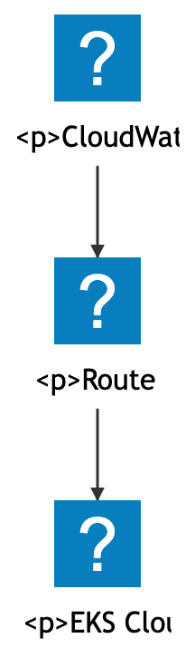<br>**10.82%** | 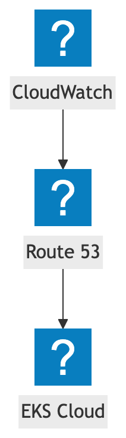<br>7.56% | 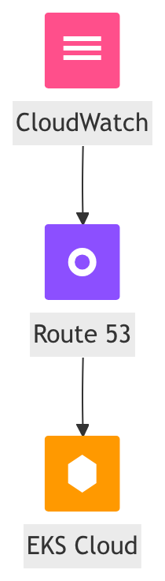 | `aws:arch-amazon-*` — reference draws mermaid's simplified test icon boxes (registered pack); kymo draws label-only, no icon glyph |
| katex_002 | 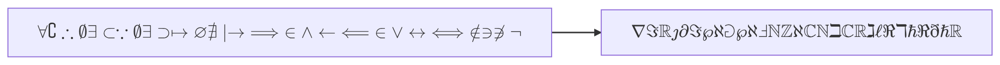<br>**6.46%** | 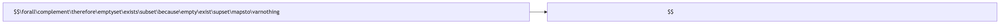<br>5.85% | 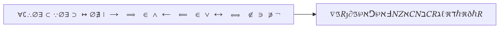 | operators / blackboard — Unicode fallback; some glyphs still unmapped + upright vs KaTeX italic |
| flowchart_020 | 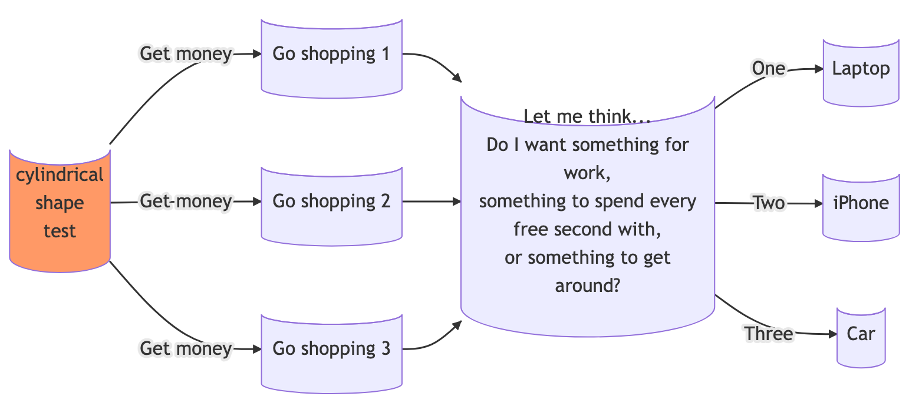<br>**4.82%** | 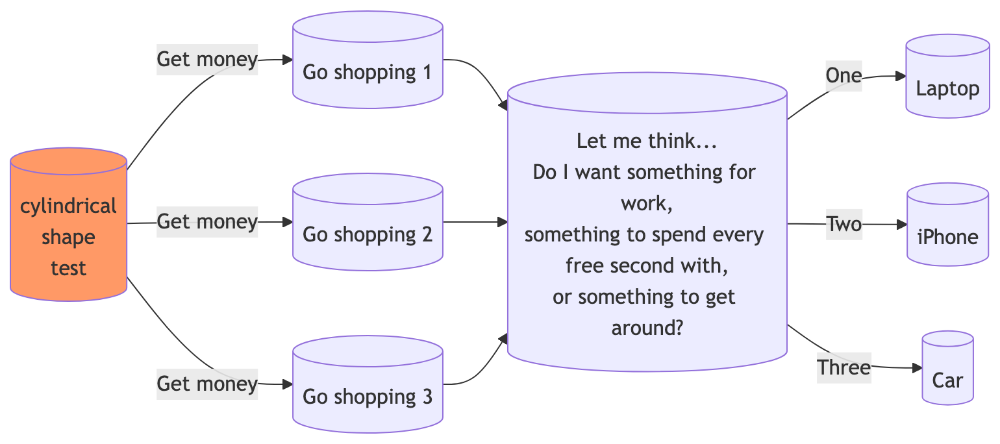<br>1.08% | 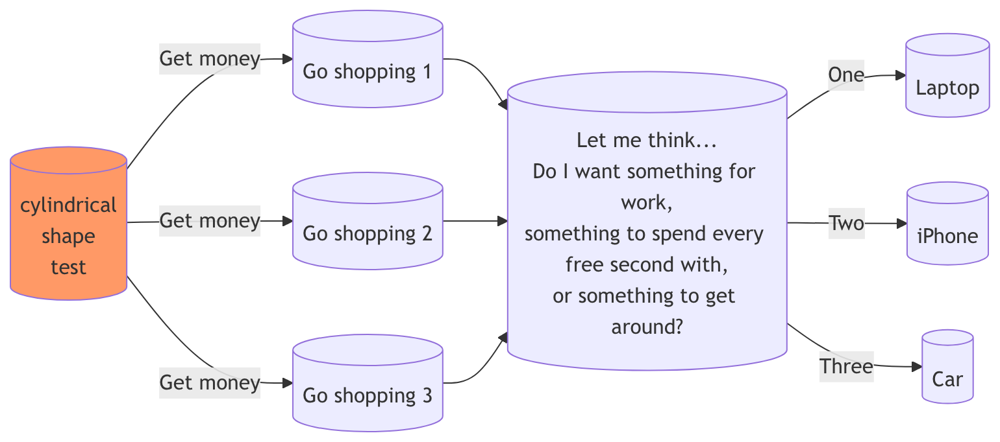 | multi-line cylinder labels — sub-pixel |
| flowchart-v2_050 | 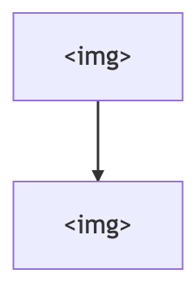<br>**4.79%** | <br>0.00% | 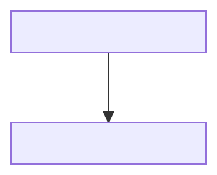 | literal `[]` — mermaid draws a broken-image box, kymo draws the text |
| katex_001 | 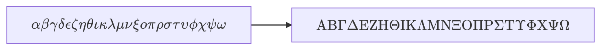<br>**4.52%** | 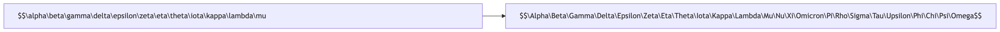<br>7.92% | 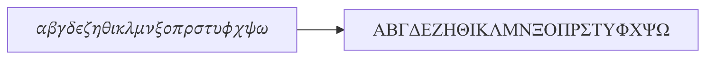 | Greek glyphs now render (`\\α…`, `\\Α…` fixed — **beats merman**); residual is KaTeX *italic* math font vs kymo's upright flowchart font |
| flowchart-v2_043 | 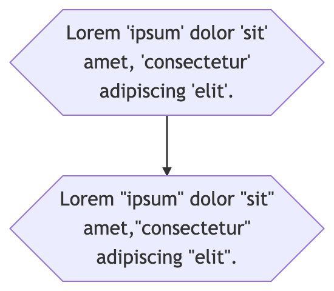<br>**4.50%** | 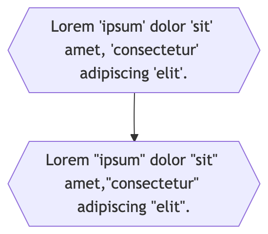<br>1.02% | 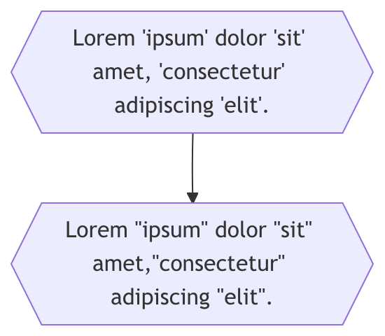 | two text-dense hexagons (`#quot;`) — SVG-`<text>`-vs-HTML floor (hex height now fixed) |
| katex_000 | 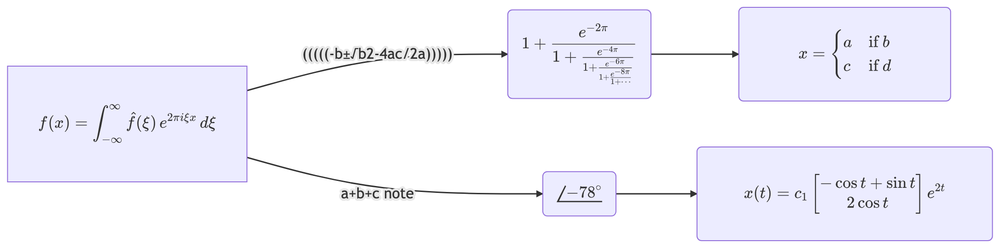<br>**4.09%** | 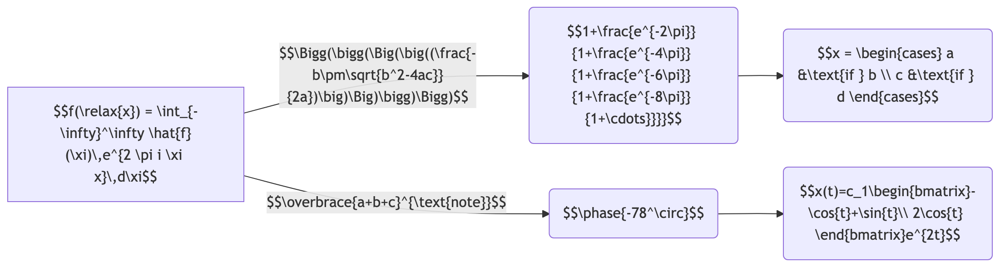<br>5.99% | 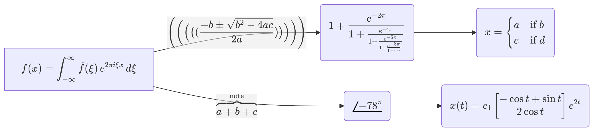 | complex math (matrix / cases / nested fractions) — kymo-tex partial; **beats merman** |
| flowchart-icon_001 | 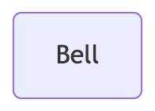<br>**3.43%** | 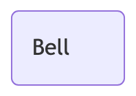<br>2.75% | 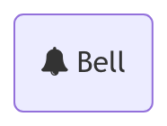 | `fa:fa-bell` — reference now draws a real bell (fa pack); kymo omits the glyph |
| flowchart_035 | 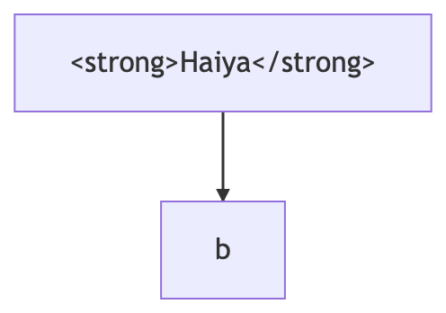<br>**3.18%** | 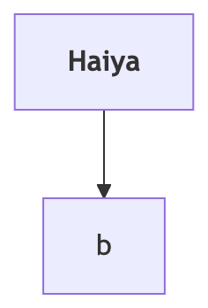<br>0.70% | 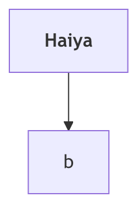 | `<strong>` bold inline — sub-pixel |
| flowchart_013 | 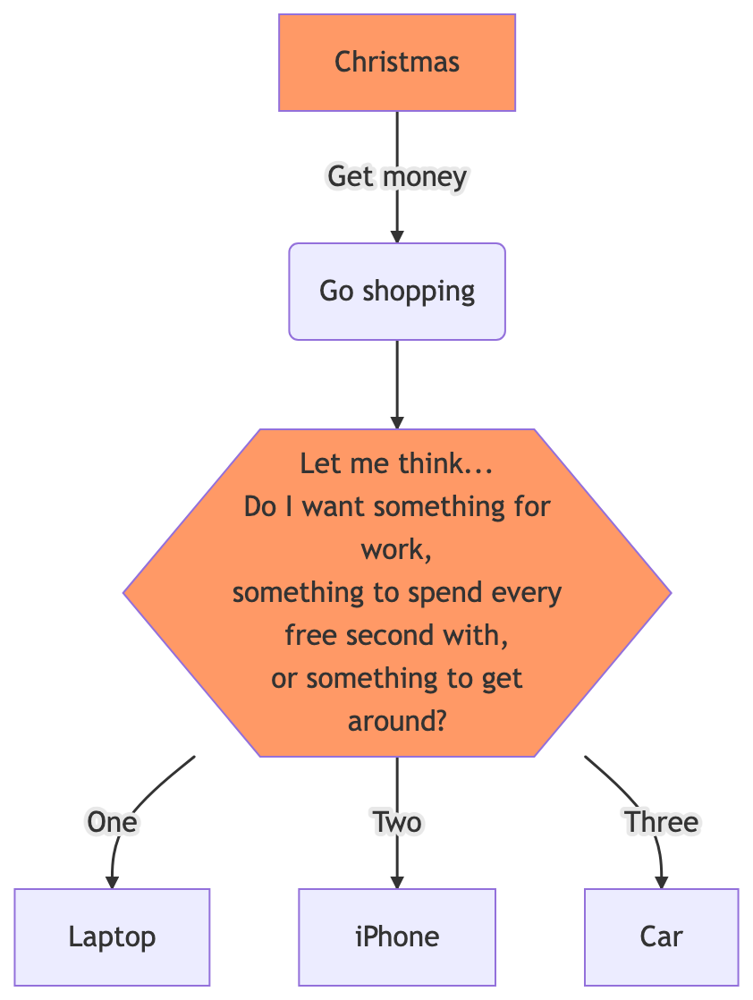<br>**2.31%** | 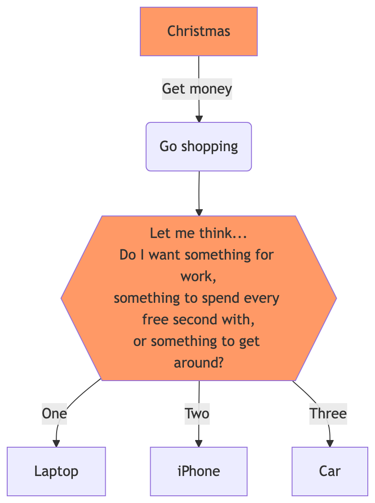<br>0.43% | 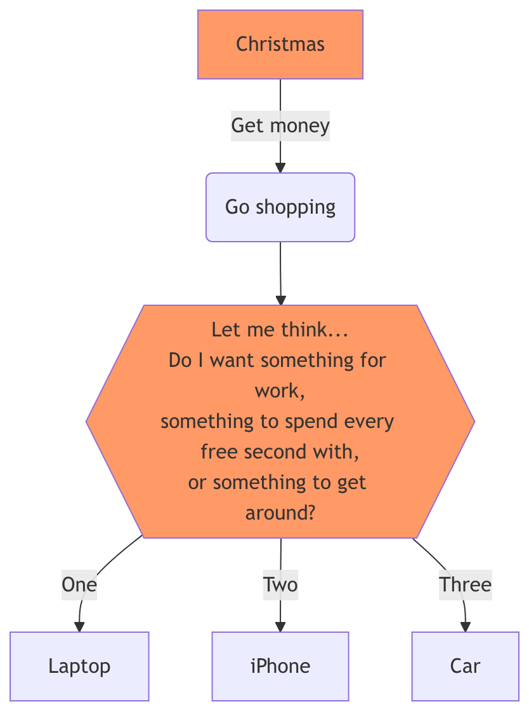 | multi-line `{{ }}` hexagon — **height bug fixed**; residual sub-pixel + classDef fill |

**Reading the merman column.** merman is a mermaid.js port, so rendered in a
browser its PNG ≈ mermaid.js (Δ near 0). But merman emits its labels in
`<foreignObject>` HTML — which **vanishes** under server-side resvg/svg2pdf
rasterisation (the PNG/PDF render.kymo.studio actually ships). kymo trades a few
points of in-browser pixel-overlay for labels that survive to raster: that trade
is the whole point, and is **not** visible in this browser-rendered Δ. Read it
with the raster-safe recall table (`results/REPORT.md`), where flowchart is 100%
kymo / 0% merman. Regenerate this table with `node worst10-grid.mjs`.

The remaining gaps are all **feature/style**, not layout: **un-drawn icon glyphs**
(`flowchart-icon_001` vs a real `fa:` bell; `_004` vs the registered `aws:`
test-icon boxes — kymo draws neither) and **math font style** (`katex_*` now
render the correct glyphs but upright in the flowchart font vs KaTeX italic —
pixel-closing that needs the `merman-layout`/kymo-tex glyph path). Every
multi-line / wrapped-label case (`flowchart_013/020/035`, `v2_043`) is sub-pixel
after the hexagon-height fix.

#### Top 10 best (production)

All ≤ ~0.1% — clean flowcharts (rect/diamond/subgraph, single-line labels) where
kymo's dagre layout + merman sizing + raster-safe text overlay mermaid.js almost
exactly: e.g. `flowchart-v2_080`, `flowchart_029`, `flowchart-v2_017`,
`flowchart-v2_079/072`, `flowchart_023`, `flowchart_032`. These are pixel-identical
to mermaid.js (≤0.5%) — 54/110 of the corpus sits here.

Visual grid (worst-10 + best-10, each with kymo / merman / mermaid.js renders +
scores + cause): `assets/2026-06-15-worstbest/worst-best-grid.png`.
