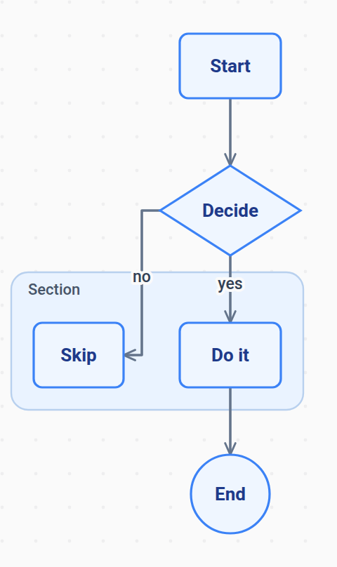
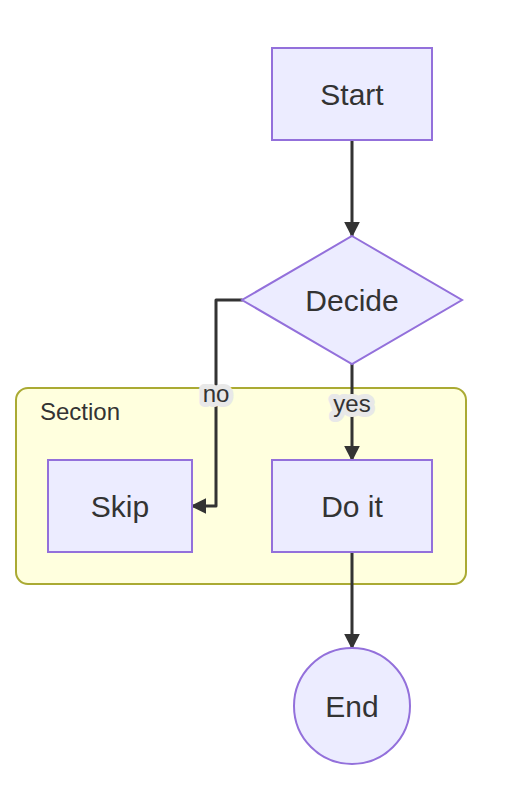
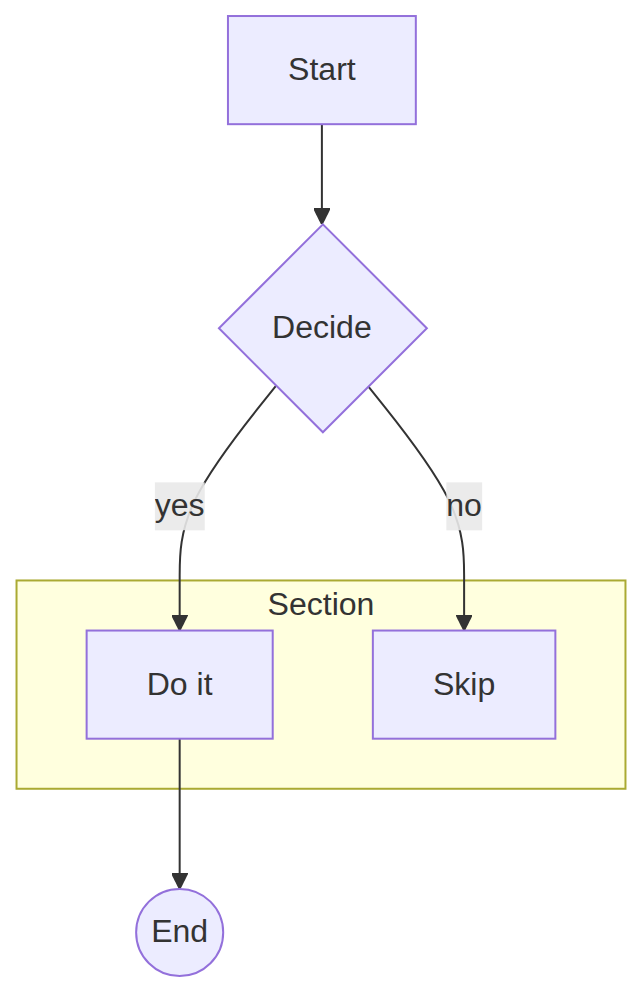

# Flowchart render style switch: kymo ⇄ mermaid

*2026-06-14. Hand-written. Feature note for the `FlowStyle` render switch added to
the flowchart pipeline; companion to `2026-06-14-pixel-overlay-diff.md`.*

## What shipped

kymo's flowchart renderer can now emit either its **native** look or a
**mermaid.js-like** look. The style is resolved with precedence
**API param > source config > kymo default**:

- Rust: `mermaid_to_svg_styled(src, Option<FlowStyle>)`; wasm
  `mermaidToSvgStyled(src, "mermaid"|"kymo")`; python `mermaid_to_svg_styled(src, style=None)`.
- Source config: a leading `---\nlook: mermaid\n---` frontmatter or a
  `%%{init: {"look": "mermaid"}}%%` directive (`look`/`theme`/`kymoStyle` naming
  `mermaid` or `kymo`). Stripping the frontmatter also fixes a latent parse crash
  on `---`.
- `mermaid_to_svg(src)` is unchanged in spirit: no API style, honours source
  config, else kymo.

The mermaid palette: lavender nodes `#ECECFF` / purple borders `#9370DB`, `#333`
edges with a **filled** triangle arrowhead, `'trebuchet ms'` font, yellow cluster
`#ffffde`/`#aaaa33`, transparent background (no dotted grid). Plus a real
structural change: `[...]` now parses to a **sharp** rectangle (`Shape::Rect`)
distinct from `(...)` rounded (`Shape::Box`); under the mermaid style `[...]`
renders with square corners, `(...)` slightly rounded. `Shape::Rect` serializes
to `"box"` in kymojson, so the cross-language contract and its goldens are
unchanged; the only golden touched is one emit `.mmd` where a `(...)` node now
round-trips as `(...)` instead of `[...]` (a fidelity fix).

## Visual proof (same source, three renders)

| kymo native | kymo **mermaid-style** | mermaid.js 11.15 |
|---|---|---|
|  |  |  |

The mermaid-style render matches mermaid.js's visual language closely: same node
fill/border, sharp rectangles, diamond/circle glyphs, yellow `Section` cluster,
`#333` filled arrows, edge-label backgrounds, no grid. What still differs is
**layout** — node positions (kymo mirrors Do-it/Skip), edge curvature (kymo routes
orthogonal Z-paths vs mermaid's splines), and cluster-label placement.

## The pixel-overlay metric does NOT move — and why that's expected

Re-running the overlay bench (`pixel-diff.mjs`) on the 5-flowchart sample,
rendering the kymo side in **mermaid style** vs kymo native, both overlaid on
mermaid.js:

| source | kymo-native vs mermaid.js | kymo-**mermaid-style** vs mermaid.js |
|---|---|---|
| appli_001 | 2.5% | 2.4% |
| conf-and-directives_000 | 6.0% | 6.2% |
| conf-and-directives_001 | 5.8% | 6.1% |
| conf-and-directives_002 | 49.8% | 50.0% |
| conf-and-directives_003 | 6.5% | 6.8% |
| **mean** | **14.1%** | **14.3%** |

Matching mermaid's colours/shapes leaves the overlay diff **essentially
unchanged** (a hair higher — the lavender fills add ink that, sitting at kymo's
*different* node positions, does not overlap mermaid's). This is the pixel-overlay
metric's defining property restated: it is **layout-dominated**. Two diagrams that
look stylistically identical but are laid out differently still don't overlap, so
colour fidelity alone can't lower the number. To move it you must match **layout**
(dagre ranking + spline edges) — the deferred v2 work. The correct validation of
the style switch is therefore **visual** (above), not the overlay score.

## Status

v1 shipped: theme (colours/font/background/arrowheads/clusters), sharp-vs-rounded
rect fidelity, a light mermaid sizing bump, and the API + source-config plumbing.
92 tests pass; kymojson goldens byte-identical; one emit golden re-blessed (a
correctness fix). Deferred: dagre-like layout, spline edge routing, exact mermaid
text metrics, and a Trebuchet font for the resvg deploy path (today it falls back
to the registered sans-serif).
