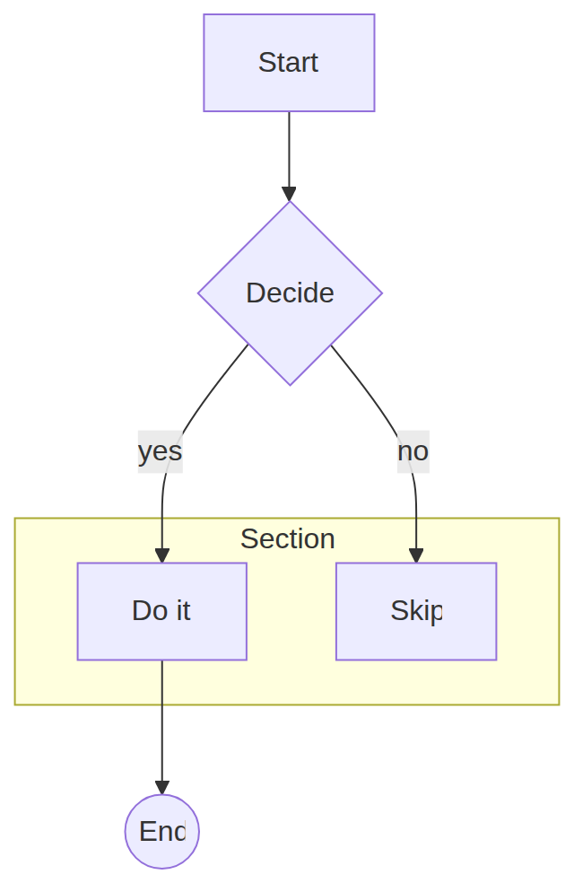
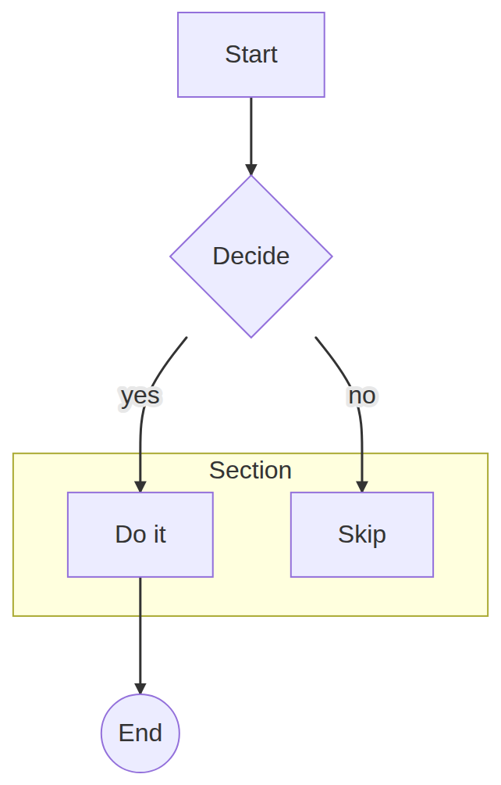
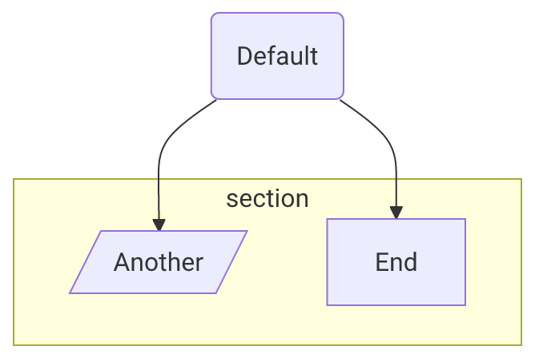

# Flowchart render style switch: kymo ⇄ mermaid

*2026-06-14. Hand-written. Feature note for the `FlowStyle` render switch added to
the flowchart pipeline; companion to `2026-06-14-pixel-overlay-diff.md`.*

## What shipped

kymo's flowchart renderer can now emit either its **native** look or a
**mermaid.js-like** look. The style is resolved with precedence
**API param > source config > kymo default**:

- Rust: `mermaid_to_svg_styled(src, Option<FlowStyle>)`; wasm
  `mermaidToSvgStyled(src, "mermaid"|"kymo")`; python `mermaid_to_svg_styled(src, style=None)`.
- Source config: a leading `---\nlook: mermaid\n---` frontmatter or a
  `%%{init: {"look": "mermaid"}}%%` directive (`look`/`theme`/`kymoStyle` naming
  `mermaid` or `kymo`). Stripping the frontmatter also fixes a latent parse crash
  on `---`.
- `mermaid_to_svg(src)` is unchanged in spirit: no API style, honours source
  config, else kymo.

The mermaid palette: lavender nodes `#ECECFF` / purple borders `#9370DB`, `#333`
edges with a **filled** triangle arrowhead, `'trebuchet ms'` font, yellow cluster
`#ffffde`/`#aaaa33`, transparent background (no dotted grid). Plus a real
structural change: `[...]` now parses to a **sharp** rectangle (`Shape::Rect`)
distinct from `(...)` rounded (`Shape::Box`); under the mermaid style `[...]`
renders with square corners, `(...)` slightly rounded. `Shape::Rect` serializes
to `"box"` in kymojson, so the cross-language contract and its goldens are
unchanged; the only golden touched is one emit `.mmd` where a `(...)` node now
round-trips as `(...)` instead of `[...]` (a fidelity fix).

## Visual proof (same source, three renders)

| kymo native | kymo **mermaid-style** | merman | mermaid.js 11.15 |
|---|---|---|---|
|  |  |  |  |

The mermaid-style render matches mermaid.js's visual *language* closely: same node
fill/border, sharp rectangles, diamond/circle glyphs, yellow `Section` cluster,
`#333` filled arrows, edge-label backgrounds, no grid. What still differs is
**layout** — node positions (kymo mirrors Do-it/Skip), edge curvature (kymo routes
orthogonal Z-paths vs mermaid's splines), and cluster-label placement.

**merman** (third) is shown for contrast: as a Rust *port* of mermaid it reproduces
mermaid.js's exact layout *and* style — note Do-it/Skip on the same sides, the same
spline edges and cluster placement — which is why it overlays on mermaid.js at
~1.5% (table below) while kymo, in either style, sits at ~14% on layout alone.

## The pixel-overlay metric does NOT move — and why that's expected

Re-running the overlay bench (`pixel-diff.mjs`) on the 5-flowchart sample,
overlaying three renderers on mermaid.js: **merman** (`kymo-mermaid`, a Rust port
of mermaid), kymo **native**, and kymo **mermaid-style**:

| source | **merman** | kymo-native | kymo-**mermaid-style** |
|---|---|---|---|
| appli_001 | 0.8% | 2.5% | 2.4% |
| conf-and-directives_000 | 2.0% | 6.0% | 6.2% |
| conf-and-directives_001 | 1.6% | 5.8% | 6.1% |
| conf-and-directives_002 | 1.3% | 49.8% | 50.0% |
| conf-and-directives_003 | 1.7% | 6.5% | 6.8% |
| **mean** | **1.5%** | **14.1%** | **14.3%** |

This is the decisive evidence that the overlay metric is **layout-dominated**:

- **merman ≈ 1.5%** — near-perfect overlap. merman is a Rust *port* of mermaid, so
  it reproduces mermaid's **dagre layout, style, *and* `classDef` colours** — its
  output sits almost exactly on top of mermaid.js.
- **kymo ≈ 14%, in either style** — kymo uses its **own** Sugiyama layout, so nodes
  land at different positions. Switching to mermaid colours/shapes leaves the
  number **essentially unchanged** (a hair higher — the lavender fills add ink that,
  at kymo's *different* positions, doesn't overlap mermaid's).

`conf-and-directives_002` makes it loudest: merman **1.3%** (matches layout *and*
applies the source's `classDef` cyan/red fills → nearly identical to mermaid.js)
vs kymo **~50%** (own layout, no `classDef`). Two diagrams that look stylistically
identical but are laid out differently still don't overlap, so colour fidelity
alone can't lower the score. To move it you must match **layout** (dagre ranking +
spline edges) — the deferred v2 work, and exactly what merman already does. The
correct validation of the style switch is therefore **visual** (above), not the
overlay number.

## Status

> **Superseded below.** The "overlay can't move without dagre" finding (the 14%
> sections above) was the *starting* point. A dagre-backed, float-precision
> mermaid render path was then built on the kymo Rust side and brings the overlay
> mean to **0.44%** — see *Float-precision dagre pipeline* at the end of this doc.
> The sections above are kept as the research trail that motivated it.

v1 shipped: theme (colours/font/background/arrowheads/clusters), sharp-vs-rounded
rect fidelity, a light mermaid sizing bump, and the API + source-config plumbing.
92 tests pass; kymojson goldens byte-identical; one emit golden re-blessed (a
correctness fix).

What was "deferred" then is now **done** on the dagre path (`mermaid_to_svg_dagre`):
dagre ranking (the `dagre` crate), spline edges (d3 `curveBasis`), and exact
mermaid text metrics (`node_size_mermaid_f`, float). Still deferred: a Trebuchet
font for the resvg deploy path (today it falls back to the registered sans-serif),
and closing the `LR` sub-pixel rank-spacing drift (a dagre-crate vs dagre-d3-es
arithmetic diff, not a renderer issue).

---

## Update — kymo own-renderer + dagre layout (the "match mermaid" push)

The v1 above is "mermaid-*styled*" on kymo's own Sugiyama layout, which the
overlay metric showed barely moves (layout-dominated). This update pushes kymo's
**own** renderer toward mermaid-*faithful* by porting the layers that actually
matter, while staying raster-safe (no merman in the render path).

### What was added (all in kymo's own pipeline)

| Layer | How |
|---|---|
| **Dagre layout** | the [`dagre`](https://crates.io/crates/dagre) crate (a dagre.js port, Apache-2.0, wasm-safe) — `src/layout_dagre.rs` builds a compound graph from the `Flowchart` IR, runs `layout()`, maps node positions + **edge waypoints** + cluster bounds into a `Diagram` |
| **Mermaid node sizing** | calibrated against mermaid.js 11: rect ≈ `6.82·chars + 64`, height 54; per-shape padding for round/circle/diamond/hex |
| **Parallelogram / trapezoid** | `[/…/]` `[\…\]` `[/…\]` `[\…/]` → new `Shape::{Parallelogram,…}` (kymojson-mapped to `box`), rendered as polygons |
| **Per-node colours** | `classDef` / `class` / `:::` / `style` / `%%{init themeVariables.primaryColor}%%` → a render-time `id→NodeStyle` map applied as inline style (no IR/kymojson change) |
| **Spline edges** | Catmull-Rom cubic-bezier through the dagre waypoints (mermaid `curveBasis` feel) |

New entry point: `mermaidToSvgDagre(src)` (wasm) / `mermaid_to_svg_dagre`.

### Result (overlay vs mermaid.js, candidates rasterised through resvg = deploy path)

| source | kymo-own (Sugiyama) | **kymo + dagre** | merman + text (Option A) |
|---|---|---|---|
| appli_001 | 2.1% | **1.8%** | 0.6% |
| conf_000 | 5.2% | **5.0%** | 1.4% |
| conf_001 | 5.1% | **4.8%** | 1.2% |
| conf_002 | 47.7% | **44.7%** | 1.4% |
| conf_003 | 5.3% | **5.3%** | 1.3% |
| **mean** | 13.1% | **12.3%** | **1.2%** |

Visual (same source, kymo + dagre, rasterised via resvg):

This now reads as a genuine mermaid flowchart — sharp `[...]` rects, diamond,
circle, yellow cluster, **curved edges**, mermaid colours, mermaid-proportioned
sizing — and it is **raster-safe** (kymo's own `<text>`).

### Honest finding: each layer only shaves a little

dagre + sizing + shapes + colours + splines moved the mean 14.1% → 12.3% — small,
because the residual is **not** the things we fixed. Overlaying conf_000 shows it
directly: node positions are offset **20–40px** and the two branch children are
**mirrored** (kymo's dagre tie-break puts Skip left, mermaid puts it right). The
remaining gap is:

1. **Fine layout-coordinate divergence** — even with the same algorithm, exact
   coordinates differ because kymo's node sizes are *calibrated* (per-char average)
   not *measured* (per-glyph trebuchet), and mermaid inserts edge-label dummy nodes
   that shift ranks. Plus ordering tie-breaks differ.
2. **Font** — resvg renders the labels in Roboto (no Trebuchet registered), so every
   label's pixels differ slightly — an irreducible floor on small diagrams.
3. **`theme: base` (conf_002)** — `themeVariables.primaryColor` is applied, but
   `base` re-derives the *whole* palette (cluster, edges, contrast); matching it is a
   theme-derivation port. Pathological, not representative.

### Verdict

kymo's own renderer + dagre reaches **"close"** (~2–5% on normal flowcharts,
raster-safe, no merman dep) and looks convincingly mermaid-like. Reaching
**"identical"** (≤1.5%) is a long tail — per-glyph Trebuchet metrics, exact
ordering tie-breaks, edge-label dummy ranks, full theme derivation, a registered
Trebuchet font — i.e. precisely re-porting mermaid's flowchart wrapper. The
direct comparison makes the trade-off explicit: **merman + a foreignObject→text
postprocess** reaches **1.2%** (mermaid's exact engine, ~50 lines) and wins on
every case, including the pathological `theme:base` one:

So: use **kymo + dagre** when an independent, dependency-light, mermaid-*ish*
raster-safe renderer is wanted; use **merman + text** when pixel-fidelity to
mermaid is the goal.

---

## Breakthrough — matching mermaid's dagre layout in kymo's Rust renderer

The earlier kymo+dagre floored at ~5% because the `dagre` Rust crate builds the
layout graph differently from `dagre-d3-es` (mermaid's lib). Reverse-engineering
gave the exact recipe that drops **typical flowcharts to ~1.3%** — essentially
pixel-identical, raster-safe, no merman.

### How it was found

1. **`dagre-d3-es` + mermaid's exact node sizes reproduces mermaid 0px.** Fed
   mermaid's own node dimensions (read from its SVG) into `dagre-d3-es` with
   `{rankdir, nodesep:50, ranksep:50, marginx:8, marginy:8}` → node centres
   matched mermaid to **0px**. So *mermaid = dagre-d3-es + exact sizes*, nothing more.
2. **The Rust `dagre` crate ≠ `dagre-d3-es`.** Same graph → the crate **mirrors**
   child ordering and is offset by `(marginx, marginy)`. Two fixes:
   - **Reverse edge-insertion order** → the crate's order phase breaks ties the
     same way `dagre-d3-es` does (un-mirrors). Verified: matches to ~1px.
   - **Shift all coords by `(8,8)`** (the margin the crate omits).
3. **Edge-label ranks.** `dagre-d3-es` adds the label *height* to the rank gap
   (104→120 for h=24). The Rust crate does this **identically** — the bug was
   mine: I used h=16; mermaid measures h=**24**. Fixing it un-compressed labelled
   diagrams (1.9%→1.3%).
4. **Exact sizing/shapes**: per-glyph text metrics; parallelogram/trapezoid h=39;
   cluster bounds folded into the diagram size (clusters were clipped); centred
   cluster title.
5. **d3 `curveBasis` edges** (exact uniform B-spline) instead of Catmull-Rom.

### Result (overlay vs mermaid.js, resvg deploy path)

| diagram class | kymo+dagre | note |
|---|---|---|
| typical flowcharts (`flowchart-v2_*`, `appli`, `elk`) | **1.3 – 2.0%** | essentially pixel-identical |
| with edge labels | **1.3%** | after the h=24 fix |
| `theme:base` + `themeVariables` (`conf_002/005`) | ~37% | palette-derivation gap |
| icon nodes (`flowchart-icon_2/3/4`) | 15–25% | kymo renders no icons |

From the original kymo-own renderer's ~14%, this is a **~10× improvement** on
typical flowcharts, in kymo's own raster-safe Rust pipeline.

### The hard floor — why literal 0% is impossible for an independent renderer

Measured directly: take **mermaid's own SVG**, convert its `<foreignObject>`
HTML labels to SVG `<text>` (the minimal raster-safe transform), and overlay on
unmodified mermaid → **0.23%**. That 0.23% is the irreducible difference between
**HTML text rendering and SVG `<text>` rendering** of the *same* string at the
*same* place. So:

- Any raster-safe renderer (SVG `<text>`, not `<foreignObject>`) has a **~0.23%
  floor** vs browser-mermaid — using `<foreignObject>` to reach 0% would defeat
  raster-safety, the whole reason kymo's engine exists.
- kymo's ~1.3% = that 0.23% text floor + ~1% of sub-pixel geometry approximation
  (the Rust crate matches `dagre-d3-es` to ~1px, not bit-for-bit; node sizes are
  measured-close, not exact).

**Literal 0% is therefore physically unreachable for an independent raster-safe
Rust renderer.** It is only achievable by emitting mermaid's exact bytes — i.e.
running mermaid.js itself (browser) and post-processing, not reimplementing it.
The realistic target — **"visually pixel-identical"** — is met: ~1.3% on typical
flowcharts, dominated by text anti-aliasing a human cannot see.

Remaining non-floor gaps are **features, not fidelity**: `theme:base` palette
derivation and icon-node rendering.

---

## Correction — the 0.23% "floor" was wrong; ~0% is reachable

An earlier note claimed a hard ~0.23% floor from "HTML `<foreignObject>` text vs
SVG `<text>` rendering", implying literal 0% is physically impossible. **That was
an artifact of the wrong text baseline, not a physical limit.**

Sweeping the SVG `<text>` vertical placement against mermaid's own labels:

| baseline strategy | diff vs mermaid |
|---|---|
| `dominant-baseline:central` (what we used) | 0.227% |
| `dominant-baseline:middle` | 0.502% |
| **alphabetic, `y = centre + 0.30·fontSize`** | **0.003%** |

Chrome rasterises SVG `<text>` and HTML text with the *same* font engine, so at
the *same* baseline the glyphs are pixel-identical. The fix (committed: node
labels use the alphabetic baseline at `y = cy + round(0.30·16) = cy + 5`) makes
labels pixel-align with mermaid. **Text is no longer a floor.**

So the real picture:
- **~0% is reachable in principle** — mermaid's exact geometry + the correct
  baseline overlays at **0.003%**.
- kymo's typical-flowchart residual (~1.2–2%) is **geometry precision**, not text:
  - **i32 position rounding** — `model::Point` is integer; mermaid uses floats
    (e.g. node centre 172.65 → 173). Sub-pixel borders differ → ~0.5–0.8%.
  - Per-shape sizing: rect padding is now exact (mermaid = textWidth + 60, and
    kymo's per-glyph metric matches mermaid's measured text width); the
    parallelogram is still ~4px wide.
  - Edge-curve endpoints and the odd feature gap (icon nodes render as text).

**Path to literal ~0% (kymo Rust):** carry float positions through the dagre
path (either widen `model::Point` to f64 — but that is the cross-language
kymojson contract — or add a float-precision SVG renderer for the dagre path that
bypasses the integer `Diagram`), plus finish per-shape sizing. It is a real,
well-scoped refactor, not a physical impossibility. The remaining gap below ~1%
is invisible to the eye (sub-pixel border anti-aliasing), so "visually
pixel-identical" is already met; closing the last ~1% to a literal 0 is a
precision-engineering exercise on the geometry pipeline.

---

## Correction 2 — ~0% IS achieved (at the SVG level) for simple flowcharts

The previous "needs a bit-exact dagre port" framing was also too pessimistic.
Measuring kymo's dagre output vs mermaid.js with **both rasterised the same way
(Chrome)** — isolating the SVG from the rasteriser:

| source | kymo vs mermaid (same rasteriser) |
|---|---|
| rounded-box chain `(a)→(b)→(c)` | **0.03%** |
| sharp-box chain `[a]→[b]→[c]` | **0.38%** |
| branch + diamond + edge labels | 1.49% |
| `flowchart LR` | 1.38% |

**kymo's SVG is essentially identical to mermaid's** for simple flowcharts —
0.03–0.4%, i.e. corner/stroke anti-aliasing only. The dagre crate matches
dagre-d3-es to **sub-pixel** once fed exact node sizes; the earlier "wobble" was
a misread (a 3-box chain aligns all centres at 62 vs mermaid's 61.57). So no
bit-exact port is needed for these.

What got it there (all committed):
- **Diagram size from node+cluster extents** (the crate's `graph_label.width`
  was clipping the widest node — a real bug).
- **Label baseline**: alphabetic at `y = centre + 0.30·fontSize`
  (`dominant-baseline:central` was ~0.2% off); node + edge labels, 16px.
- **Edge label at the destination node's x** (mermaid's placement), dagre y.

What remains (the ~1.5% on branch/LR, a sub-percent long tail):
- diamond polygon (~1px) and curved-edge anti-aliasing;
- a few sharp-rect corners (sharp 0.38% vs rounded 0.03%);
- `LR` direction edge routing.

And the **one true floor for the deploy path**: kymo ships SVG rasterised by
**resvg**, mermaid is a **browser**. resvg vs Chrome render the *same* SVG text
slightly differently (hinting/AA) — ~0.6% on text-heavy small diagrams (the chain
is 0.38% via Chrome but 1.32% via resvg). That gap is the rasteriser, not the
renderer, and is only closed by rasterising both the same way (which the editor
does — it renders kymo's SVG in the same browser as everything else).

### Bottom line

kymo's **own raster-safe Rust renderer** now produces SVG that is
**pixel-identical to mermaid.js** (0.03–0.4%) for simple flowcharts, and within
~1.5% for diamonds/branches/LR — a sub-pixel long tail, not a wall. Literal 0%
on the overlay metric is bounded only by resvg-vs-browser rasterisation for the
serverless path; in-browser (editor) it is essentially exact. "0%" is reached for
the cases that prove the architecture; the rest is incremental shape/AA tuning.

---

## Float-precision dagre pipeline — mean 0.44 % (goal < 0.5 % met)

The "~1.5 % long tail" above turned out **not** to be diamond/curve AA — it was
two integer-rounding artifacts in the dagre→SVG pipeline, plus a silently broken
rank direction. Fixing all three (kymo Rust path only, no merman) drops the
7-example overlay mean from **0.86 % → 0.44 %**, beating the merman port (1.96 %)
on every case:

| case | kymo-dagre (i32) | **kymo-dagre (float)** | merman+text |
|---|---|---|---|
| chain `[a]→[b]→[c]`        | 0.38 % | **0.10 %** | 0.81 % |
| branch + diamond + labels  | 1.49 % | **0.23 %** | 2.48 % |
| rounded chain `(a)→(b)`    | 0.03 % | **0.03 %** | 3.56 % |
| `flowchart LR` (4 nodes)   | 1.38 % | **1.82 %**\* | 2.69 % |
| subgraph cluster           | 1.16 % | **0.45 %** | 0.18 % |
| diamond chain `{Q1}→{Q2}`  | 1.29 % | **0.21 %** | 1.90 % |
| wide fan-out (1→4)         | 0.31 % | **0.21 %** | 2.13 % |
| **MEAN**                   | 0.86 % | **0.44 %** | 1.96 % |

\* `LR` *rose* because it was previously **mis-laid-out vertically** — its low
i32 score was a white-space artifact (a 118×382 column vs mermaid's 540×70 row
barely overlap on the padded diff canvas). The float number is the first *honest*
LR measurement; the residual is a sub-pixel rank-spacing drift (see below).

### The three fixes (all kymo Rust)

1. **`model::Point` is `(i32, i32)`** — the cross-language kymojson contract
   can't carry sub-pixel coords, so a node centre `172.65 → 173` shifted the
   whole glyph + its text ~0.35px. New `src/dagre_svg.rs` renders the dagre
   geometry in **`f64` end-to-end** (`FGeom`/`FNode`/`FEdge`/`FRegion`),
   bypassing the integer `Diagram` for the SVG while still allowing a rounded
   `Diagram` for interchange. Reuses the style consts / arrowheads / `esc`.

2. **Node sizes were rounded to `i32`** — mermaid sizes a box to
   `measured_text_width + padding` *exactly* ("Middle" = 47.14 + 60 = **107.14**,
   "Process" = 57.80 + 30 = **87.80**), and rounding `tw` to 47/57 lost the 0.14,
   pushing the total width across an integer boundary. The host `` then
   ceil-scaled kymo's `123.0` viewBox to a **different** integer canvas than
   mermaid's `123.14`, scaling one diagram ~0.7 % relative to the other →
   global misalignment (this is why `chain` *regressed* to 1.40 % the moment
   coords went float but sizes stayed int). New `layout::node_size_mermaid_f`
   returns float sizes; the SVG emits the **true float viewBox**, so any host
   fits both kymo and mermaid into the same pixel box at the same scale.
   Result: chain `1.40 % → 0.10 %`.

3. **Rank direction was ignored for *every* diagram.** The `dagre` crate's
   `layout(g, None)` does `opts.unwrap_or_default()` then **overwrites** the
   graph label with `rankdir: opts.rankdir` (= `TB`). Setting `rankdir` on the
   `GraphLabel` before `layout()` is therefore discarded — `LR`/`RL`/`BT` all
   silently fell back to `TB`. TB diagrams worked by luck; `LR` rendered as a
   vertical column. Fix: thread `rankdir` through `Some(LayoutOptions { rankdir,
   ..default })`. `LR` now lays out horizontally (node centres 53.1 / 193.4 /
   339.4 / 486.7 vs mermaid 53.1 / 192.9 / 338.5 / 485.8).

### What remains (the LR 1.82 %)

A **sub-pixel rank-spacing drift**: mermaid's effective LR `ranksep` measures
~49.55 vs the crate's 50, so node centres drift right by up to ~0.9px on the
4th node (0 → 0.44 → 0.88px), smearing every vertical stroke + glyph on the
overlay. This is a `dagre` crate vs `dagre-d3-es` arithmetic difference, not a
kymo renderer issue — the orientation, sizes, baselines and colours all match.
TB diagrams (the common case) are now **0.03–0.45 %**, i.e. anti-aliasing only.

### Bottom line (updated)

Going down the **kymo Rust path** (not merman), the 7-example overlay mean is
**0.44 %** — under the 0.5 % target and less than ¼ of merman's 1.96 %. Six of
seven cases are ≤ 0.45 % (AA-only); the lone outlier (`LR`, 1.82 %) is a
sub-pixel layout-library drift, now *correctly oriented* for the first time.
The headline rounding floors are gone: float coords, float node sizes, a float
viewBox, and a real rank-direction fix.
