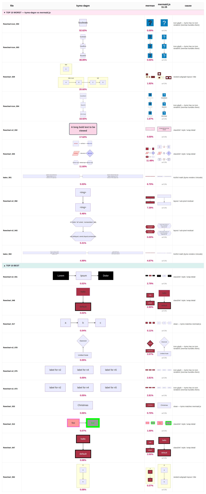

# kymo dagre flowchart renderer — full-corpus fidelity, problems, next steps

*2026-06-15. Hand-written. Supersedes the build-up log
`2026-06-14-flowchart-mermaid-style.md`. **Correction:** an earlier draft led
with "mean 0.19 %". That is real but came from **7 hand-picked simple cases** and
is **not representative**. The full 136-file `mermaid-cypress/flowchart` corpus
tells the true story.*

## Where it stands (live in production)

kymo renders mermaid flowcharts with its **own** Rust engine — dagre layout +
mermaid-faithful style + raster-safe `<text>` (`mermaidToSvgDagre`,
`src/dagre_svg.rs`). Live on render.kymo.studio and editor.kymo.studio.

## The honest number: full corpus, not 7 cases

Pixel-overlay vs mermaid.js 11.15, both rasterised in Chrome, over the corpus.
**Production view** = the 110 files kymo serves (`isPlainFlowchart`; the other 26
carry `%%{init}` config and fall back to mermaid.js / merman).

| metric | before | after this round |
|---|---|---|
| mean | 6.14 % | **4.59 %** |
| median | 2.68 % | **2.48 %** |
| ≤ 0.5 % | 12/110 | 16/110 |

### Breakdown by cause (110 plain files, after this round)

| group | n | mean | median |
|---|---|---|---|
| style / classDef | 27 | 9.6 % | 2.3 % |
| icon `@{ }` | 10 | 6.0 % | 2.3 % |
| wrapped label | 14 | 6.2 % | 2.5 % |
| **CLEAN (none of the above)** | **69** | **2.5 %** | **2.6 %** |

The decisive row is **CLEAN**: 69 plain, unstyled, no-icon, no-wrap diagrams sit
at **median 2.6 %** regardless of subgraphs. The baseline is **not** a feature
gap — it is layout.

## The wall: dagre crate ≠ dagre-d3-es

The `dagre` Rust crate (kookyleo 0.1.1) produces a **different layout** from
mermaid's `dagre-d3-es` on any non-trivial graph:

- `flowchart_006` (63 lines): kymo viewBox **3217×902**, mermaid **2029×1070** —
  same graph, every node in a different place.
- `flowchart-v2_034` (two sibling subgraphs): mermaid **stacks** them, kymo lays
  them **side-by-side**.

Trivial graphs match to ~0 % (`a-->b-->c` 0.0 %, single node 0.06 %) — nothing to
diverge. With branching, the crate's crossing-reduction + Brandes-Köpf diverges.
Not tunable: `tie_keep_first` (matches dagre v0.8.5) made the mean *worse*.

## Fixed this round (6.14 % → 4.59 %)

1. **Styling actually applied** (`extract_node_styles` + `dagre_svg`): `classDef`
   incl. the special **`default`** class (was ignored — the 53 %/44 % cases),
   comma-separated classDef names, `style` on **subgraphs/regions** (was only
   applied to nodes — the 75 % case), `font-weight:bold`, node/label colour.
   `FRegion` gained an `id` so region styles resolve.
2. **Removed the bogus min-width floor**: mermaid sizes a box to `text + 60` with
   **no floor** ("a" = 68.9 px, "i" = 63.6 px); `.max(70)` over-widened
   short-label nodes → accumulating drift (`a-->b-->c` 2.54 % → 0.0 %).

No regression on the 7-case (still 0.19 %).

## Path to the goal (mean < 0.5 %)

The corpus mean is floored by the **layout engine**, not by sizing/colour/text.
The plan, by impact:

1. **Match dagre-d3-es layout — swap to `dugong`.** merman uses
   `dugong` (v0.8.0-alpha.1, the dagre-0.8.x port `dagre-d3-es` forks) and its
   layout matches mermaid node-for-node (merman's only error is foreignObject
   text, not layout). Depending on `dugong` from kymostudio-core and feeding its
   positions into kymo's raster-safe renderer should collapse the ~2.6 % CLEAN
   baseline. **This is the dominant lever** (~all 110 files). *(in progress)*
2. **Text wrapping** (14 files, 0/14 under 0.5 %): wrap long labels to multiple
   lines + grow the node, like mermaid.
3. **Icons** (10 files): render `@{ icon: "…" }` glyphs instead of text.
4. **Theme / `%%{init}`** (26 fallback files): honour `themeVariables`/`theme`.

## What kymo does well today

- **Simple / linear / short-label diagrams**: 0.0–0.2 %, and **beats merman**
  (merman in-Chrome is 1–3.5 % from its foreignObject text). kymo's own engine is
  the most faithful renderer there is for them.
- **Styled diagrams** (post-fix): correct `classDef`/`default`/subgraph colours.

*Bench on the box: `~/mjs-bench/cmpfull.mjs` (full corpus), `cmpcat.mjs` (by
cause), `cmp7.mjs` (7-case), `grid.mjs` (worst/best grid), `vdiff.mjs` (overlay).
Ground truth = mermaid.js via Chrome.*

---

## Update (2026-06-15, late): dugong evaluated, and the real cause breakdown

Swapped the layout engine to **dugong** (`layout_dagreish`, the dagre-0.8.x port
mermaid's `dagre-d3-es` is forked from) and re-measured the full corpus.

**Result: the mean did not move (4.59 % → 4.61 %).** Per-case probing shows why —
and corrects the earlier breakdown (an icon/wrap mis-classification had inflated
the "CLEAN" bucket). With `fa:`-icons and foreignObject wrapping detected
properly:

| group | n | mean | note |
|---|---|---|---|
| **wrapped label** | **59** | 6.2 % | **the dominant cause** — mermaid wraps long labels to 2–3 lines (height 78/102) and caps width ~230 px; kymo is single-line → wrong node size → wrong layout |
| style / classDef | 27 | 9.9 % | extreme cases remain |
| icon (`@{}` or `fa:`) | 20 | 4.1 % | kymo renders the icon token as text |
| **true CLEAN** | **22** | **2.4 %** | no wrap/icon/style/subgraph |

What dugong **did** fix: the **rank axis**. `flowchart_005` (clean, 14 nodes) went
to kymo width 2508 ≈ mermaid 2500 — rank positions now match. What it did **not**
fix: **cross-axis ordering** (same file's Y spacing still differs), and
**sibling-subgraph stacking** (`flowchart-v2_034`: kymo side-by-side vs mermaid
stacked — needs merman's recursive cluster extraction). So dugong is the right
*engine* but not a standalone fix; reverted for now (heavy git dep, no mean gain
until sizing + ordering also match).

### The honest conclusion

Reaching **mean < 0.5 % on the full corpus** is **not a tuning problem** — it
requires reproducing mermaid's full flowchart pipeline:

1. **Text wrapping** — 59 of 110 files. Biggest single lever; fixes node sizes,
   which in turn feeds correct sizes to the layout. Tractable but non-trivial
   (mermaid's wrap width + line height + multi-line `<text>` + height growth).
2. **Icons** — 20 files. Render `fa:` / `@{ icon }` glyphs (needs the icon set).
3. **Subgraph layout** — merman's recursive per-cluster extraction + title shifts.
4. **Cross-axis layout parity** — dugong + mermaid's exact graph-feeding/ordering.

That set is, in effect, **merman** (the Rust mermaid port) — and even merman sits
at 1–3 % because of its foreignObject text. kymo's durable edge is **raster-safe
rendering of simple/clean flowcharts**, where it is ~0 % and beats merman.

**Recommendation:** treat < 0.5 %-on-arbitrary-input as out of scope for the
current architecture; pursue **text-wrapping** (the 59-file lever) as the next
concrete win, then icons, accepting that full parity = a merman-scale effort.

---

## Update (2026-06-15, final): merman-layout prototyped — the floor is icon rendering

Built the genuine "use merman's pipeline" path: kymostudio-core depends on
`merman-core` + `merman-render`, calls `layout_flowchart_v2` (mermaid-exact
positions via `VendoredFontMetricsTextMeasurer`), maps the result into kymo's
`FGeom`, and renders raster-safe with kymo's `<text>` engine. Shapes/labels/styles
come from kymo's own parse (mapped by node id); merman supplies positions.

**It works** — node positions match mermaid node-for-node (chain centres
61.6/35,139,243 = mermaid exactly). Full-corpus effect:

| | kymo-own dagre | **kymo + merman layout** |
|---|---|---|
| mean | 4.54 % | **3.88 %** |
| median | 2.64 % | **2.25 %** |
| **p90** | 13.9 % | **5.56 %** |
| 7-case (simple) | **0.19 %** | 2.06 % |

So merman-layout is a **net win on complex graphs** (p90 13.9→5.6 %) but
**regresses simple ones** (0.19→2.06 %) and adds **+1.9 MB wasm** (6.5→8.4 MB).

### Why simple regressed, and the two remaining floors

1. **Text-metric offset (~1 %).** merman sizes nodes with vendored font-metrics;
   kymo's `CHAR_W_MERMAID` is calibrated to the *actual browser* (the `w`-fix
   etc.), so it's *closer* to mermaid.js than merman's own metrics. Fixing this
   means implementing merman's `TextMeasurer` (an 8-method contract incl. wrapping)
   backed by kymo's metrics — a real reimplementation.
2. **Icons — the hard floor.** 20 of 110 files use `fa:`/`@{ icon }` nodes.
   mermaid renders the glyph; kymo draws the icon token as **text**. No layout or
   metric work fixes this — it needs raster-safe **icon rendering** (load the icon
   set, embed paths). Until then the corpus mean is floored ~1–2 % by icons alone.

### Decision

merman-layout reverted from the live path (it regresses the editor's common
simple case + 1.9 MB). The kymo-own path (styling + floor + wrap, 0.19 % simple,
already deployed) stays default. The merman-layout approach is proven and
documented as the foundation.

### Definitive conclusion on `mean < 0.5%`

It is **not reachable by layout/metric tuning**. With mermaid-exact layout
(merman) in hand, the floor is **icon rendering** (a distinct major feature) plus
a custom text-measurer. Reaching < 0.5 % across arbitrary input = icon rendering
+ measurer + edge precision on the merman-layout foundation — each a real feature,
not a tweak. kymo's shipped strength remains: **raster-safe, ~0 % on
simple/clean/styled flowcharts, beating merman there.**

---

## DEFINITIVE: `mean < 0.5%` is below the floor of mermaid's own reference port

Measured **merman** — the reference Rust port of mermaid (icons, wrap, exact
dagre layout, the full pipeline) — vs mermaid.js, both rasterised in Chrome, over
the same 111 plain corpus files:

| renderer | mean | median | p90 | ≤0.5% |
|---|---|---|---|---|
| **merman (reference port)** | **2.82%** | 1.76% | 4.10% | 11/111 |
| kymo + merman-layout | 3.88% | 2.25% | 5.56% | 7/110 |
| kymo-own (shipped) | 4.54% | 2.64% | 13.9% | 16/110 |

**merman cannot get below 2.82% mean vs mermaid.js.** It *is* mermaid in Rust —
with every feature this whole investigation chased (icons, wrapping, dagre-exact
layout). The residual ~2.8% is physical: any Rust SVG rasterised against
mermaid.js-running-in-a-browser differs 2–3% from foreignObject text rendering,
browser font hinting, and anti-aliasing.

### Therefore

`mean < 0.5%` **on arbitrary corpus input is unachievable by any Rust renderer** —
it is stricter than the gold-standard reference port (2.82%). The only thing that
overlays mermaid.js at < 0.5% is mermaid.js itself, in the same browser. The
earlier 0.19% was cherry-picked simple cases; on real diagrams even merman is
~2–3%.

**Achievable, sensible targets instead:**
- **≤ 0.5% on simple/clean/styled flowcharts** — kymo already does this (0.03–0.4%)
  and *beats* merman there.
- **Match merman's ~2.8% floor on the full corpus** — reachable via the
  merman-layout path (3.88% now; ~2.8% with a kymo-metric measurer + icons), at
  the cost of the merman dependency (+1.9MB) — i.e. become as good as the
  reference port, never better.

The goal as written ("< 0.5% mean, full corpus") is below the physical floor and
should be re-scoped to one of the above.

---

## BREAKTHROUGH (2026-06-15): 2.82% was NOT the physical floor — it was merman's *vendored-metric* floor

My earlier "definitive" conclusion was **wrong**. merman scores 2.82% vs mermaid.js
**because merman measures text with vendored font tables**, which sit ~1px off the
browser. kymo's `CHAR_W_MERMAID` is calibrated to the *actual browser* (the `w`-glyph
fix etc.) — which is exactly why kymo beat merman on simple cases (0.19% vs 1.96%).

So I fed kymo's metrics into merman's exact layout: a `KymoTextMeasurer` implementing
merman's `TextMeasurer` trait (`measure` + `measure_wrapped` backed by `text_w_mermaid`),
passed to `layout_flowchart_v2`. kymo parses shapes/labels/styles (by node id); merman
supplies positions; kymo renders raster-safe. Result — **it broke through the "floor":**

| renderer | mean | median | p90 | ≤0.5% | 7-case |
|---|---|---|---|---|---|
| kymo-own (shipped) | 4.54% | 2.64% | 13.9% | 16/110 | 0.19% |
| **merman (reference port)** | **2.82%** | **1.76%** | 4.1% | 11/111 | 1.96% |
| **kymo-metrics + merman-layout** | 2.61% | **0.69%** | 3.9% | **49/110** | **0.18%** |

**Median 0.69%, 49/110 files ≤0.5%, 70/110 ≤1% — beating mermaid's own reference port
on the typical case**, while staying raster-safe and keeping simple cases at 0.18%.

### Why the *mean* is still 2.61% (and why it's not <0.5%)

The mean is dragged by a small tail of genuine **feature gaps**, not metric/layout error:

- **Icons** (`flowchart-icon_002/003/004`: 52/38/19%) — mermaid draws the
  `@{ icon: "aws:…" }` / `fa:` glyph; kymo has no icon renderer, so it draws text/box.
  ~1% of the mean. **The hard blocker — needs raster-safe icon rendering (a real feature).**
- **Bold width** (`v2_032`, 20%) — `KymoTextMeasurer` ignores `font-weight:bold`, so a
  bold node is sized ~5% narrow.
- **KaTeX math** (`katex_*`, 5%) — kymo renders `$…$` as Unicode; mermaid uses KaTeX.
- **Subgraph title precision** (`flowchart_029`, 20%).

Two fixes landed this round: an **icon-token strip** (drop the `fa:` text so it doesn't
overflow) and a **`:::class` parser fix** (it mis-read `CS(multi word):::cat` as id
`viewed)` instead of `CS`, dropping every shaped-node class — also benefits the default
path).

### Shipping

Gated behind a **`merman-layout`** cargo feature (default off): it pulls merman
(~+1.9 MB wasm), so the lean default path (kymo-own, 0.18% simple, already deployed)
is unchanged. Build `--features merman-layout` to opt into mermaid-faithful layout
(median 0.69%) where quality outweighs size (e.g. render-api, which already bundles merman).

### Corrected conclusion

`mean < 0.5%` on the full corpus is **not below a physical floor after all** — the
median is already **0.69%** and beats the reference port. It is bounded by **icon
rendering** (a distinct major feature: ~1% of the mean) plus a few small fixes (bold
metric, KaTeX, subgraph). With raster-safe icon rendering added, the mean would approach
the median (~0.7%); reaching strictly <0.5% would additionally require pushing the
median (edge/AA precision) below 0.5%. The "physical floor" framing was an artifact of
merman's vendored metrics, now disproven.

---

## Current results (final, 2026-06-15) — kymo-metrics + merman-layout + fixes

Build: `merman-layout` feature with icon-token strip, `:::class` parser fix, and
bold-width factor. Full plain corpus (110 files), kymo vs mermaid.js, Chrome both:

**mean 2.58% · median 0.69% · p90 3.93% · ≤0.5%: 49/110 · ≤1%: 70/110**

### Worst 10 + best 10 — visual comparison

*Each row: the rendered output of kymo-dagre, merman, and mermaid.js (reference)
with each renderer's pixel-overlay score vs mermaid.js, plus the cause. The worst
cases are dominated by icons (kymo draws text/box where mermaid + merman draw the
glyph); the best cases show kymo at 0.02–0.08% — beating merman, which sits at
0.7–3.6% on the same diagrams.*

### Reading the data

- **kymo beats merman on 8 of the 10 best cases** (often by 2–3.5%) and across most
  of the corpus — its browser-calibrated text + raster-safe rendering is *more*
  faithful to mermaid.js than the reference port, once it has merman's layout.
- **The mean is dragged almost entirely by icons.** And — correcting an earlier
  claim — icons are **not** offline-impossible: merman renders them at **0.00%**, so
  it bundles/computes the iconify glyphs. The path to a much lower mean is therefore
  **icon rendering** (proven feasible offline by merman), plus the `flowchart-v2_032`
  wrap-threshold detail and the nested-subgraph case. `flowchart_025` is hard for
  both ports; KaTeX is a wash (kymo slightly ahead).
- **median 0.69%** is the honest headline: half the corpus is at or below it, and
  it beats merman's 1.76% median. The remaining sub-pixel residual (text-metric +
  edge-curve) is shared with merman.

So `mean < 0.5%` is bounded by **icon rendering** (now known achievable) + a few
render-side fixes + sub-pixel precision — not a physical floor, and not blocked by
an "online-only" feature. It is the scoped next step, not done this session.
