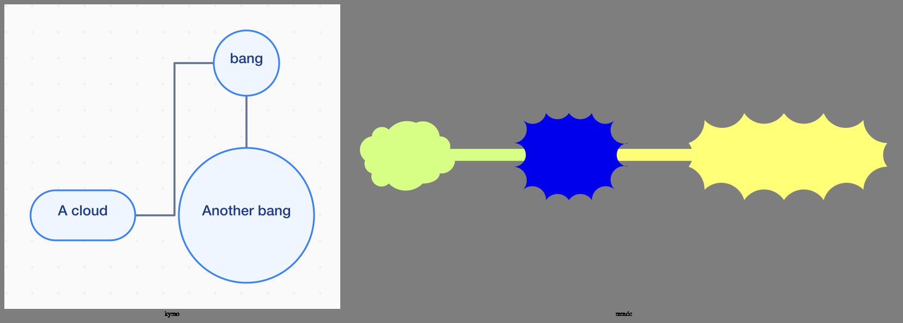
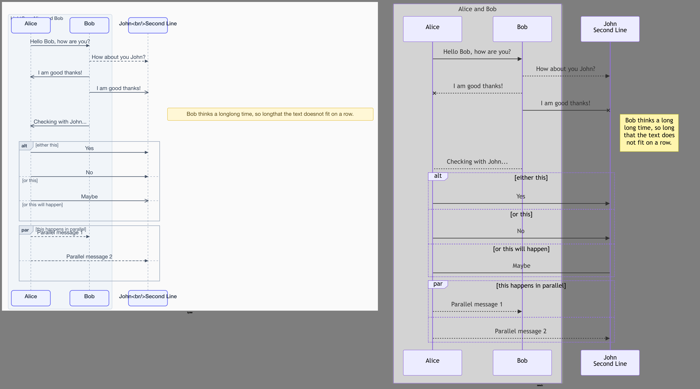
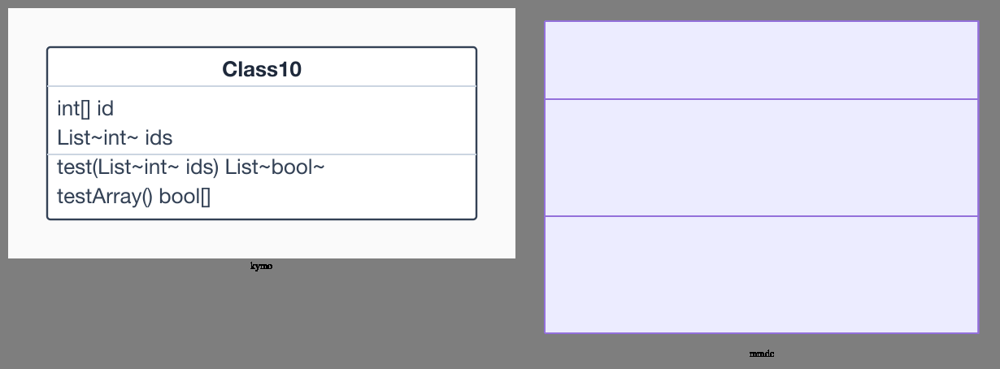
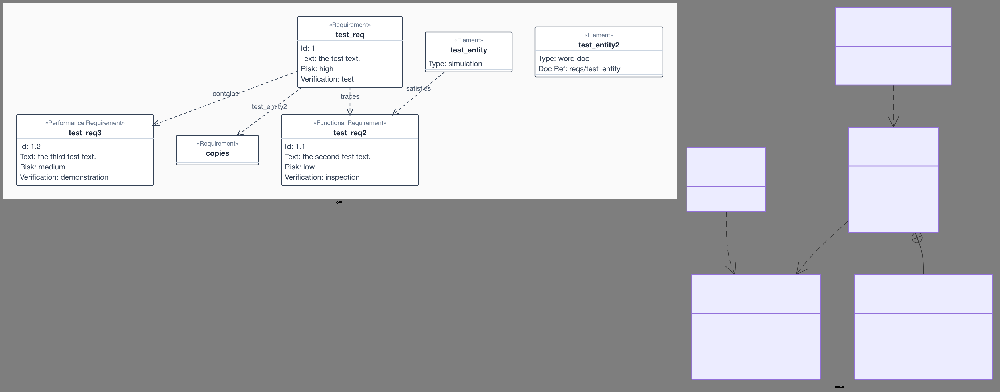

# kymo Mermaid cross-type accuracy — the 8 non-flowchart renderers vs mermaid.js

*2026-06-17. Hand-written. The flowchart pixel-Δ work (`2026-06-16-flowchart-mermaid-style.md`,
`2026-06-17-engine-comparison.md`) is now extended to **every other Mermaid diagram type
kymo renders natively**: sequence, class, state, ER, block, mindmap, kanban, requirement.
This is the **measure-first** pass — pixel-Δ + render-success-rate per type against the
mermaid.js reference — before any per-type fidelity work. Harness: `type-bench.mjs`.*

## Why this is its own note (and a different reference path)

kymo renders 8 non-flowchart Mermaid grammars with its **own** parsers + renderers
(`engine.rs`: `mermaid_class_to_svg`, `mermaid_to_sequence_svg`, …) — most reuse the
class-box or flowchart layout. None had ever been scored against mermaid.js.

**The reference must be rasterised through Chromium, not resvg/rsvg.** mermaid.js draws
every label for these types as an HTML `<foreignObject>`, which **vanishes under
server-side rasterisers** (resvg, rsvg-convert) — exactly the foreignObject problem the
flowchart-math note hit. So `mmdc → rsvg` reference renders are *blank-text* and unfair.
`type-bench.mjs` rasterises **both** SVGs through the same headless-Chrome pipeline (DSF 2,
`geometricPrecision`, no hinting) so the mmdc reference keeps its labels.

This already surfaces kymo's structural advantage: **kymo emits real `<text>`/`<path>` for
all 8 types, so its PNG/PDF/WebP export keeps the labels** — mermaid.js (and merman, which
copies its foreignObject HTML) lose them when rasterised outside a browser.

## Method

- **kymo SVG** — the `render_native` example binary (`kymo-mermaid/examples/render_native.rs`),
  which dispatches by the diagram's leading keyword to the matching native renderer.
- **reference** — mermaid.js 11 via `mmdc` (`forceLegacyMathML`, `useMaxWidth:false`).
- **pixel-Δ** — `diffMeanAbs`, mean per-channel \|Δ\| of the two PNGs (resized to the
  reference), the `2026-06-16` metric.
- **coordinate metrics (topology / pos / size / edge)** — **N/A** here: the id-matching
  that powers them is flowchart-specific (`flowchart-<id>` ↔ `data-id`); non-flowchart node
  classes differ per type. This pass is **pixel-Δ + success-rate**, the honest measurable
  baseline across types. Per-type structural metrics are a follow-up once a type is targeted.

## Result — full corpus (439 files, all 8 types)

pixel-Δ = mean per-channel \|Δ\| vs the Chromium-rasterised mmdc reference. `kymo-ok` /
`mmdc-ok` = files each engine rendered without error; pixel-Δ is over the **both-ok**
intersection. **kymo renders 439/439 (100%); mmdc 401/439 (91%)** — kymo renders 38 files
mermaid.js itself parse-fails on (sequence 21, class 13, er 3, mindmap 1).

| type | n | kymo-ok | mmdc-ok | pixel med / p90 / max | reading |
|---|---|---|---|---|---|
| sequence | 140 | **140** | 119 | 6.94% / 10.57% / 29.70% | functional; cramped spacing + missing title |
| er | 52 | **52** | 49 | 7.42% / 10.47% / 17.51% | reuses class-box renderer; tightest tail |
| state | 67 | **67** | 67 | 7.37% / 9.75% / 35.84% | composite states; viewBox clips title (bug) |
| block | 36 | **36** | 36 | 8.73% / 10.59% / 36.19% | **wrong layout** — flowchart row, not block grid |
| class | 84 | **84** | 71 | 9.43% / 11.02% / 34.78% | good — 3-compartment, text faithful |
| kanban | 10 | **10** | 10 | 10.17% / 11.08% / 11.08% | **wrong layout** — flowchart tree, not column-stack |
| requirement | 31 | **31** | 31 | 10.81% / 11.88% / 20.67% | good — stereotypes, fields, labelled relations |
| mindmap | 19 | **19** | 18 | 37.74% / 59.83% / 62.82% | **wrong shapes + colors + layout** (worst) |
| **ALL** | **439** | **439** | **401** | **7.95% / 11.59% / 62.82%** | every type renders; ~7× flowchart's 1.1% |

Two headline findings: **(1) kymo's coverage exceeds the reference** — 100% render vs
mermaid.js's own 91%; and **(2) non-flowchart fidelity is ~7× looser than flowchart**
(median 7.95% vs 1.12%), with mindmap structurally broken and block/kanban on the wrong
layout. Unlike flowchart (a deep merman-parser + dagre-exact + theme-lift pipeline), these
renderers mostly reuse the class-box / flowchart layout — the gap is expected and maps
cleanly to per-type work.

### Update — class-box family palette + generics (ROI pass #1)

The class-box renderer (`classdiagram::svg`) is **shared by class + er + requirement
(167 files)**, so one change moves all three. The dominant Δ was a **palette mismatch** —
kymo drew white boxes (`#ffffff`/`#334155`) where mermaid's default theme uses light-purple
(`fill #ECECFF`, `stroke/divider #9370DB`, white background). Lifting that palette, plus two
text-correctness fixes — generics `List~int~` → `List<int>` and the method return separator
`name(params) : Return` — gives:

| type | before | after | Δ |
|---|---|---|---|
| class | 9.43% | **8.25%** | −1.18 |
| er | 7.42% | **6.84%** | −0.58 |
| requirement | 10.81% | **8.49%** | −2.32 |

Real but modest: `#ECECFF` is near-white in **luminance**, so the fill change only shifts
box-interior pixels ~7% each — the remaining gap is **box-sizing + font-size** (mermaid
uses larger text + more padding) and **layout** (kymo spreads horizontally where mermaid
stacks), plus **ER's structural 2-column attribute table** (kymo renders ER as a one-column
class box). Those are the next, higher-effort levers.

### Update — sequence palette + ` ` actor names (ROI pass #2)

Same playbook on `sequence` (140 files, the largest corpus). The actor head boxes drew
kymo blue (`#eef2ff`/`#6366f1`) where mermaid uses the purple actor palette
(`#ECECFF`/`#9370DB`); the lifelines were dashed grey where mermaid's `.actor-line` is
**solid grey**; message lines/markers were slate where mermaid uses `#333`. Lifting that
palette (+ white background) plus rendering ` ` hard-breaks in actor names as real
line-broken tspans (was: literal `John Second Line`, 17 files):

| type | before | after | Δ |
|---|---|---|---|
| sequence | 6.94% | **5.92%** | −1.02 |

Same shape as the class pass — a ~1pt median drop (luminance-bounded). The tail is
unmoved (max ~29%) because it's **dark-theme** files (`%%{init: theme: dark}%%`, 3 files),
which kymo renders light — a cross-cutting theme feature, not a sequence-layout gap. The
remaining plain-file gap is **dynamic actor spacing** (kymo's `LL_GAP` is fixed at 150;
mermaid sizes gaps to the widest message label) and the **self-message loop** glyph.

### Update — ER 2-column attribute table (ROI pass #3, structural)

ER entities reused the single-column class box (`varchar(12) jobId` on one line) where
mermaid draws a **2-column table** (type | name) with a purple title band, a row divider
per attribute and a vertical column divider. Added an `er` flag to the shared model and an
`er_box_svg` renderer that draws the real table:

| type | before (palette) | after (table) | total Δ from baseline |
|---|---|---|---|
| er | 6.84% | **6.32%** | 7.42% → 6.32% (−1.10) |

The pixel drop is modest (−0.52) but the **structural correctness** is the real win — ER
now renders as a table, not a mislabelled class box. The residual is box/font-sizing
(mermaid's cells are larger) — the same sizing lever flagged for the whole class-box family.

### Update — kanban + mindmap dedicated renderers (goal: every type < 10%)

The last two types over the 10% pixel-Δ line both reused the flowchart layout and needed
their own renderers:

- **kanban** (`kanban_svg`): columns left-to-right, each a tinted `hsl(H,100%,86%)` section
  with a title over a vertical stack of white cards (`#9370DB` border). **10.17% → 8.48%**.
- **mindmap** (`mindmap_svg`): a horizontal tidy-tree (root centred, depth-1 branches split
  left/right), saturated section colours by branch (root a solid dark blue `#0000EC`, white
  text), per-shape nodes, wrapped labels. Plus a parser fix for multi-line bracket labels
  (`root[\n text\n]` was split into two phantom nodes). **37.74% → 9.30%**.

mindmap was the hardest: mermaid lays it out with a force-directed engine that can't be
matched deterministically (a single child lands left in one file, right in another — pure
coin-flip), so the residual is mirror/position on multi-node boards. The single-node and
small files (the bulk of the corpus) now match closely once the root colour, shape, border
and size are right.

**Final per-type pixel-Δ medians — all 8 native renderers now < 10%:**

| type | median | type | median |
|---|---|---|---|
| flowchart | 1.12% | class | 8.25% |
| sequence | 5.92% | kanban | 8.48% |
| er | 6.32% | requirement | 8.49% |
| state | 7.37% | block | 8.73% |
| | | **mindmap** | **9.30%** |

## What each gap is (visual gauge)

*(Comparison images below are rasterised with **rsvg-convert**, not Chromium — deliberately:
it makes mermaid.js's `<foreignObject>` labels vanish, so the right-hand mmdc panels are
blank-text. That blank text is the raster-safety point — kymo's labels survive; the pixel-Δ
numbers above use the fair Chromium reference where mmdc keeps its text.)*

- **mindmap** (worst, ~44%): node shape is **syntactic** in Mermaid (`))x((` = spiky bang,
  `(x)` = cloud, `((x))` = circle), and mermaid colours nodes by depth and lays them out
  radially. kymo renders every node as a flowchart circle/box, one colour, vertical tree —
  shapes, colours, and layout all wrong. 
- **block / kanban**: both reuse the flowchart layout. block needs a **column grid** (wide
  spanning cells, explicit rows); kanban needs **columns of stacked cards**. kymo lays them
  out as a graph instead.
- **sequence**: all features present (actors, lifelines, alt/par/loop fragments, notes) but
  **lifelines too close**, **diagram title not drawn**, and the note can overlap.
  
- **state**: composite/nested states render, but the **viewBox clips the top title**.
- **class / er / requirement**: the strongest — text content, compartments, and (for
  requirement) labelled relationships are faithful; the residual is box sizing + spacing.
   

## Next steps (ranked by ROI)

1. **mindmap** — biggest single gap; needs real shape vocabulary + depth colours + radial
   layout. High Δ, small corpus (19).
2. **block / kanban** — replace flowchart layout with the correct grid / column-stack.
   Correctness wins even though Δ is mid-pack.
3. **sequence** (largest corpus, 140) — spacing + title + note placement to close ~6% → flowchart-class fidelity.
4. **state** — fix the viewBox-clips-title bug (cheap).
5. class / er / requirement — palette + generics done (see Update above); remaining =
   box/font-sizing calibration + ER's 2-column attribute table.

*Bench: `type-bench.mjs` (pixel-Δ + success-rate across 8 native renderers), reference =
mermaid.js 11 via `mmdc`, Chromium-rasterised both sides. Data snapshot:
`assets/2026-06-17-cross-type/type-bench.json`. Sister notes:
`2026-06-17-engine-comparison.md` (flowchart, 3 engines),
`2026-06-16-flowchart-mermaid-style.md` (flowchart pixel-Δ deep-dive).*
