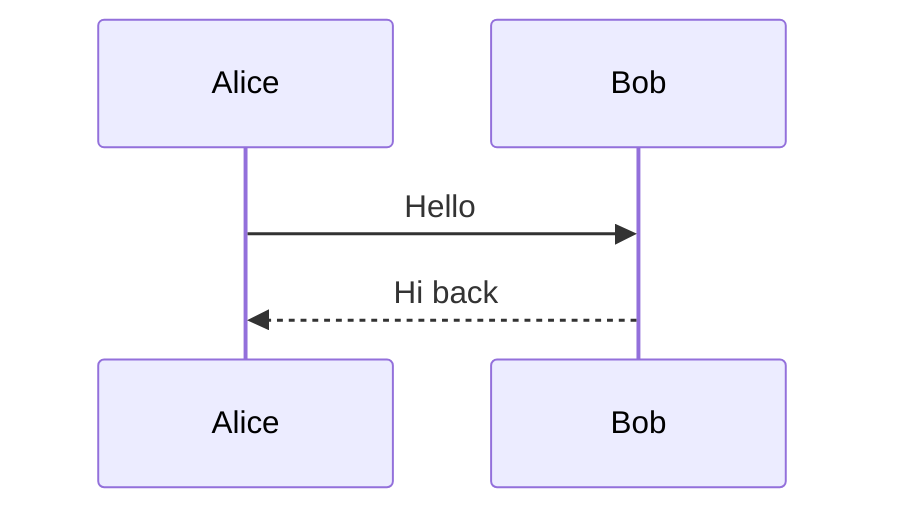
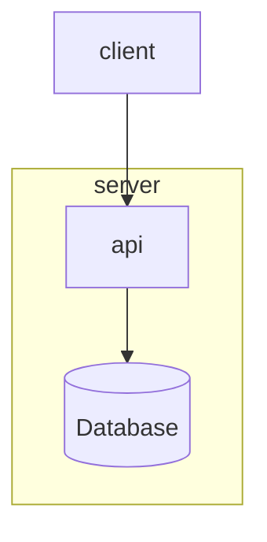

# Mermaid vs. D2 — Language Comparison (Research)

| Field             | Value                                                                                       |
|-------------------|---------------------------------------------------------------------------------------------|
| Document ID       | RES-MERMAID-D2-001                                                                           |
| Version           | 1.0                                                                                         |
| Issue Date        | 2026-05-23                                                                                  |
| Status            | Released                                                                                    |
| Classification    | Internal                                                                                    |
| Owner             | `diagrams/` project                                                                         |
| Audience          | Engineers evolving the `kymo` DSL, layout, or render pipeline                                |
| Subjects          | [`mermaid-js/mermaid`](https://github.com/mermaid-js/mermaid) · [`terrastruct/d2`](https://github.com/terrastruct/d2) |
| Licenses          | MIT (Mermaid) · MPL-2.0 (D2)                                                                 |
| Versions Reviewed | Mermaid 11.x (2026-05-23) · D2 0.7.1 (2026-05-18)                                            |
| Related Documents | `RES-LANG-EVAL-001`, `REF-D2-001`, `REF-D2-CMP-001`, `DSL-LANG-001`, `BPD-DGM-001` |

This is a **research note on two pieces of prior art**, not a specification of kymo. It compares Mermaid and D2 *against each other* — the two most widely used text-to-diagram languages — so the team can borrow the right ideas when evolving kymo's DSL, layout, and render pipeline. The opinionated *D2-vs-kymo* scoring lives separately in `REF-D2-CMP-001`; this document does **not** re-score against kymo (it ties back only in §11). No code or behaviour in this repository depends on either tool.

## 1. Overview

| | **Mermaid** | **D2** |
|---|---|---|
| First release | 2014 | 2022 |
| Author / steward | Knut Sveidqvist + community | Terrastruct (Alan Tai et al.) |
| Implementation | JavaScript / TypeScript | Go |
| License | MIT | MPL-2.0 |
| Distribution | npm library, runs in-browser; `@mermaid-js/mermaid-cli` (Puppeteer) for files | Single Go binary (CLI-first); Go library + community SDKs |
| GitHub stars (access date) | ≈ 75k+ | ≈ 23.7k |
| Native rendering on GitHub / GitLab / Notion / Obsidian | **Yes** | No (must self-render) |
| Online editor | <https://mermaid.live/> | <https://play.d2lang.com/> |

The headline difference in positioning: **Mermaid optimises for ubiquity** (it renders where developers already write Markdown), while **D2 optimises for output quality and language design** (pluggable layout, modern styling, one coherent grammar). Both occupy the same problem space as Graphviz and PlantUML — declarative text in, diagram out.

## 2. Design philosophy — the central divergence

**Mermaid is many small DSLs in one package.** Each diagram family (`flowchart`, `sequenceDiagram`, `classDiagram`, `stateDiagram`, `erDiagram`, `gantt`, …) is its own grammar with its own keywords, parsed by its own grammar module. The first token of a Mermaid document selects the diagram type and therefore the sub-language:

```mermaid
flowchart LR
  A[Start] --> B{Decision}
  B -->|Yes| C[OK]
  B -->|No|  D[Stop]
```



Note the syntax is **not shared** between those two snippets beyond superficial arrow glyphs — `flowchart` and `sequenceDiagram` are effectively different languages. Breadth comes from adding more grammars.

**D2 is one general language.** A single model — objects, connections (`->`), dot-nested containers, and a `shape:` attribute — expresses every diagram. Specialised families are reached by *overloading* `shape:` (`shape: sequence_diagram`, `class`, `sql_table`, `grid`) rather than by switching grammars:

```d2
Start -> Decision
Decision -> OK: Yes
Decision -> Stop: No
Decision.shape: diamond
```

```d2
shape: sequence_diagram
alice -> bob: Hello
bob -> alice: Hi back
```

**Consequence.** Learning Mermaid means learning each diagram type separately; learning D2 means learning one grammar and a shape vocabulary. Mermaid wins on *out-of-the-box diagram variety*; D2 wins on *conceptual consistency and composability* (variables, imports, globs all work uniformly because there is only one grammar to apply them to).

## 3. Syntax at a glance — same diagram, both languages

Containers / grouping:



```d2
# D2 — implicit container via dot path
server: {
  api
  db: { shape: cylinder }
}
server.api -> server.db
client -> server.api
```

Notable syntactic contrasts:

| Aspect | Mermaid | D2 |
|---|---|---|
| Comments | `%% ...` | `# ...` |
| Edge | `-->`, `---`, `-.->`, `==>` (typed glyphs) | `->`, `--`, `<-`, `<->` |
| Edge label | `A -->|label| B` | `A -> B: label` |
| Container | `subgraph name ... end` (per-type keyword) | `name: { ... }` or dot-path `name.child` |
| Node shape | type-specific bracket syntax (`[ ]`, `{ }`, `(( ))`, `[( )]`) | `x.shape: cylinder` attribute |
| Styling | `classDef`, `class`, `style`, `:::` operator, directives | `style.fill`, nested `style: { }`, `vars`, globs |
| Reuse / variables | none in core grammar (templating done externally) | `vars: { }`, `...@import`, wildcard globs |

D2's shape-as-attribute model is more uniform; Mermaid's bracket glyphs are terser per-node but type-specific and harder to memorise across families.

## 4. Diagram-type coverage

This is **Mermaid's clearest lead.** As a "bag of grammars," it accumulates many first-class diagram types:

- **Mermaid (broad):** flowchart, sequence, class, state, entity-relationship (ER), user-journey, gantt, pie, quadrant, requirement, gitgraph, C4 (experimental), mindmap, timeline, sankey, xychart, block, packet, kanban, architecture, radar, treemap, ZenUML, …
- **D2 (focused):** general block/graph diagrams, plus `shape:`-overloaded sequence diagrams, UML classes, SQL tables (ERD), grid layouts, and code/text/image nodes.

Mermaid covers many *charting* and *project-management* artefacts (gantt, pie, xychart, timeline, kanban) that D2 deliberately does not. D2 covers the structural-diagram core with more polish and a single grammar. If the requirement is "draw a gantt chart from text," Mermaid is the only one of the two that does it natively.

## 5. Layout

| | Mermaid | D2 |
|---|---|---|
| Default engine | **dagre** (layered) | **dagre** (layered) |
| Alternative engines | **ELK** renderer (opt-in for flowchart/state via `layout: elk` config) | **ELK** and **TALA** (Terrastruct's proprietary engine) selectable per-render |
| Engine selection | Per-diagram config / front-matter | CLI flag `--layout=` |
| Reputation | Adequate; dense flowcharts can get cramped or produce awkward crossings | Generally cleaner; **TALA** is purpose-built for software-architecture aesthetics |

Both started on dagre and both added ELK. The practical difference is that **D2 treats layout as a first-class, swappable strategy** decoupled from the language, and its TALA engine is tuned specifically for the look architecture diagrams want. Mermaid's ELK support is real but more of a per-type opt-in than a unified abstraction. For large/dense graphs, D2 (especially via ELK/TALA) tends to produce more legible results.

## 6. Styling & theming

**Mermaid:**

- Built-in themes: `default`, `neutral`, `dark`, `forest`, `base`.
- `themeVariables` for fine-grained colour overrides; `classDef` + `class`/`:::` for reusable node styles; init directives (`%%{init: ...}%%`) and YAML front-matter for per-diagram config.
- Theming is mature but the mechanisms are several overlapping systems (directives vs front-matter vs classDef).

**D2:**

- Many numbered built-in themes (e.g. *Grape soda*, *Vanilla nitro cola*, *Terminal*) plus adaptive **dark mode** (`--dark-theme`).
- **Sketch mode** (`--sketch` / `style.sketch: true`) renders a hand-drawn look in core — a distinctive feature Mermaid has no built-in equivalent for.
- `vars` and wildcard globs make bulk restyling (`(** -> **)[*].style.stroke: red`) trivial.

Both are competent; D2's sketch mode and uniform `style.*`/glob model are the differentiators, while Mermaid's theme ecosystem is broader simply through age and adoption.

## 7. Output formats & animation

| | Mermaid | D2 |
|---|---|---|
| SVG | ✓ (primary; browser-rendered) | ✓ |
| PNG / PDF | ✓ via `mermaid-cli` (headless Chromium) | ✓ (native in the Go binary) |
| Animated output | ✗ (no native animation model) | ✓ **animated SVG** via `style.animated` and multi-board `steps`/`scenarios` |
| Multi-board / narrative | ✗ (one diagram per source) | ✓ `layers` / `scenarios` / `steps` become navigable boards / animation frames |
| Interactivity | `click` callbacks/links; tooltips | `tooltip:` and `link:` per object |

D2's **animation and multi-board composition** are a meaningful capability gap over Mermaid. Note for kymo's purposes (see `REF-D2-001` §10): D2's animation is element-level SMIL/CSS in a single SVG, whereas kymo additionally synthesises an animated **WebP** for environments where SVG animation is unreliable — a path *neither* Mermaid nor D2 takes.

## 8. Embedding & ecosystem

**Mermaid's decisive advantage is reach.** It renders natively inside GitHub Markdown, GitLab, Notion, Obsidian, Azure DevOps, many static-site generators, and countless docs tools — *no build step*. Combined with ≈ 75k+ stars and a decade of adoption, that ubiquity is its moat: you write a fenced ` ```mermaid ` block and it just renders.

**D2's ecosystem is younger but credible:** a fast Go binary, a Go library plus community Python/JS/C# SDKs, a VS Code extension, the hosted playground, and an Obsidian plugin. Named production adopters include Elasticsearch, Sourcegraph, Temporal, and Tauri. What it lacks is Mermaid's *zero-config native rendering inside the tools developers already use*.

## 9. At-a-glance matrix

| Axis | Mermaid | D2 |
|------|---------|-----|
| Language model | Many per-type grammars | One unified grammar |
| Implementation | JS/TS (browser-first) | Go (CLI-first) |
| License | MIT | MPL-2.0 (TALA engine proprietary) |
| Diagram-type breadth | **Very broad** (gantt, pie, mindmap, gitgraph, …) | Focused (block + sequence/class/SQL/grid) |
| Conceptual consistency | Lower (type-specific syntax) | **Higher** (one grammar) |
| Reuse (vars/imports/globs) | None in core | **Yes** |
| Layout engines | dagre; ELK (opt-in) | dagre / ELK / **TALA** (pluggable) |
| Layout quality (dense graphs) | Adequate | **Generally better** |
| Theming | Mature (themes, classDef, themeVariables) | Numbered themes + **sketch mode** + dark mode |
| Animation | None | **Animated SVG** |
| Multi-board composition | None | **layers / scenarios / steps** |
| Output | SVG (+ PNG/PDF via CLI) | SVG / PNG / PDF / animated SVG |
| Native embedding (GitHub etc.) | **Yes — ubiquitous** | No (self-render) |
| Ecosystem maturity | **Very large** (~10 yrs) | Growing (since 2022) |
| Best when | You want it to render *everywhere* with zero setup, or need chart/PM diagram types | You want the *best-looking* structural diagrams and a clean, composable language |

## 10. Head-to-head scoring (Mermaid vs D2)

Scored against the unified rubric in `RES-LANG-EVAL-001` (same 1–10 scale as `REF-D2-CMP-001` §3); the six categories below are its §5.1 diagram-as-code categories collapsed for brevity. This grades the two tools **against each other**, not against kymo. Categories are weighted equally; the **Why** column is load-bearing — do not strip it.

**Scale (per cell, out of 10):** 9–10 industry-leading · 7–8 good · 5–6 adequate · 3–4 limited · 1–2 absent/unusable.

| # | Criterion | Mermaid | D2 | Why |
|---|-----------|:------:|:--:|-----|
| A | DSL ergonomics & consistency | 6 | 8 | Mermaid's terse per-type brackets are quick but fragmented across families; D2's one grammar + `vars`/imports/globs is more consistent and composable. |
| B | Diagram-type breadth | 9 | 6 | Mermaid ships gantt/pie/mindmap/gitgraph/timeline/xychart and many more; D2 focuses on structural diagrams (block/sequence/class/SQL/grid). |
| C | Layout quality | 6 | 8 | Both default to dagre; D2 adds first-class ELK/TALA selection and TALA is tuned for architecture aesthetics; Mermaid's ELK is a per-type opt-in. |
| D | Styling & theming | 7 | 8 | Both mature; D2's sketch mode, dark mode, and glob-based bulk styling edge out Mermaid's overlapping classDef/directive/themeVariables systems. |
| E | Output & animation | 6 | 8 | Mermaid is static SVG (+PNG/PDF via headless Chromium); D2 adds native animated SVG and multi-board scenarios/steps. |
| F | Embedding & ecosystem | 10 | 7 | Mermaid renders natively in GitHub/GitLab/Notion/Obsidian with zero setup and has ~10 yrs of adoption; D2 is credible but must be self-rendered. |
| | **Total / 60** | **44** | **45** | Effectively **a tie** — they win on opposite axes. |

**Read it this way.** The near-equal totals are the point: **Mermaid wins on breadth + ubiquity (B, F); D2 wins on language design, layout, and output (A, C, E).** Choose Mermaid when the diagram must render *everywhere* with no toolchain or when you need chart/PM types; choose D2 when you want the *best-looking* structural diagrams and a clean, reusable source language. The scores are intentionally coarse — treat the per-criterion *Why* as the real content, not the arithmetic.

## 11. Lessons for kymo

kymo is closer to D2 in spirit (an owned text→SVG pipeline with a tight, opinionated look) than to Mermaid. Borrowable observations, in priority order:

1. **Resist Mermaid's "bag of grammars" model.** Mermaid's breadth comes at the cost of conceptual consistency — each diagram type is its own language. kymo's single declarative grammar (`region`/`component`/`→`) is a strength worth protecting; add depth in the architecture-diagram niche rather than chasing gantt/pie/mindmap breadth.
2. **D2-style reuse (`vars`/imports/globs) is the high-value borrow.** This is the same gap flagged in `REF-D2-CMP-001` §3.1 (criterion A3) — kymo has no variable/import/repeat construct. It would cut duplication across `samples/` and is grammar-uniform, unlike Mermaid's external templating.
3. **Layout-as-strategy is D2's, not Mermaid's, idea — and the better one.** Mermaid bolts ELK on per-type; D2 abstracts the engine behind a single flag. If kymo ever pluginises `packages/python/src/kymo/layout.py`, follow D2's clean abstraction, not Mermaid's per-type opt-in.
4. **Animation is kymo's moat against *both*.** Neither Mermaid (no animation) nor D2 (single animated SVG only) synthesises a rasterised animated WebP. kymo's dual animated-SVG + WebP path (`REF-D2-001` §10) is a genuine differentiator — keep investing there.
5. **Ubiquity is Mermaid's moat kymo cannot cheaply copy.** Native GitHub/Markdown rendering is a decade of integration work. kymo should not try to out-ubiquity Mermaid; its play is *output quality + animation* in a focused domain, where a self-rendered SVG/WebP is acceptable.

## 12. References

Mermaid (accessed 2026-05-23):

- Repository — <https://github.com/mermaid-js/mermaid>
- Documentation — <https://mermaid.js.org/>
- Live editor — <https://mermaid.live/>
- Diagram syntax index — <https://mermaid.js.org/intro/syntax-reference.html>
- License (MIT) — <https://github.com/mermaid-js/mermaid/blob/develop/LICENSE>

D2 (accessed 2026-05-18; see `REF-D2-001` for the full reference):

- Repository — <https://github.com/terrastruct/d2>
- Language site & tour — <https://d2lang.com/> · <https://d2lang.com/tour/intro>
- Playground — <https://play.d2lang.com/>
- TALA layout engine — <https://github.com/terrastruct/TALA>
- License (MPL-2.0) — <https://github.com/terrastruct/d2/blob/master/LICENSE>

---

*Maintenance: re-review on a major release of either tool (Mermaid v12, D2 1.0) or annually. Restate tradeoffs, not just conclusions — a future reader needs the* why *to judge whether the verdict still holds.*
