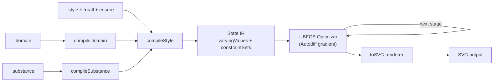
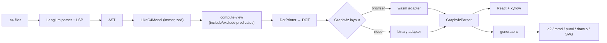
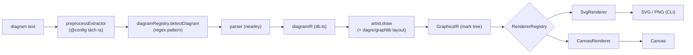
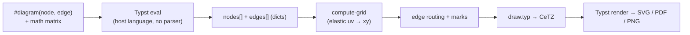

# Weekly Scan — Diagram-as-Code & Visual Tooling

**Ngày quét:** 2026-05-24 · **Cửa sổ:** `pushed:>2026-05-17` (7 ngày) · **Scout cho:** kymostudio

> **Nguồn dữ liệu:** GitHub REST API (`search/repositories`) qua `curl` không xác thực.
> Vì GitHub không cho `OR` giữa các qualifier `topic:`, mình chạy từng query topic riêng
> (`diagram-as-code`, `dsl`, `svg-animation`, `graph-visualization`, `layout-algorithm`,
> `diagrams`, `graphviz`, `mermaid`) với `stars:>50` rồi gộp + dedupe. Đã loại chart libs,
> markdown editor chung, awesome-lists, MCP servers, desktop toys theo bộ lọc exclusion.
> Deep-dive đọc source thật từ shallow-clone (`git clone --depth 1`).

---

## Executive summary (3 điểm)

- **Hai trường phái layout rõ rệt trong tuần này.** `penrose` đại diện cho *constraint/optimization*
  (mô tả quan hệ, để L-BFGS + autodiff giải vị trí), còn `likec4`/`pintora` theo *graph layout cổ điển*
  (Graphviz dot / dagre-Sugiyama). Đây chính là quyết định kiến trúc lớn nhất kymostudio phải chốt.
- **"Semantic model tách khỏi presentation" là pattern lặp lại đáng học.** `likec4` (1 model → nhiều
  view qua predicate include/exclude) và `pintora` (2 tầng IR: diagramIR domain-specific → GraphicsIR
  mark-tree backend-agnostic) đều tách rõ — cho phép multi-view và multi-backend render từ một nguồn.
- **DSL không nhất thiết phải tự viết parser.** `fletcher` nhúng DSL thẳng trong Typst (host language eval,
  không có text parser riêng); `likec4` dùng Langium để có parser + LSP + validation gần như miễn phí.
  Cả hai là đối trọng với cách `penrose`/`pintora` tự viết grammar `.ne` (nearley).

---

## Shortlist (10 ứng viên trong cửa sổ)

| # | Repo | ★ | Vì sao lọt / để dành |
|---|------|----|----------------------|
| 1 | **penrose/penrose** | 7.9k | ★ Deep-dive — constraint-based layout qua autodiff + L-BFGS, DSL bộ ba |
| 2 | **likec4/likec4** | 3.2k | ★ Deep-dive — architecture-as-code, Langium + Graphviz, 1 model → N views, export đa định dạng |
| 3 | **hikerpig/pintora** | 1.3k | ★ Deep-dive — text-to-diagram pluggable, 2 tầng IR, render SVG/Canvas |
| 4 | **Jollywatt/typst-fletcher** | 1.0k | ★ Deep-dive — embedded DSL trong Typst, elastic grid layout, mark system |
| 5 | kieler/elkjs | 2.6k | Layout algorithm thuần (layered/Sugiyama) nhưng JS sinh từ Java (GWT) → khó đọc; glance |
| 6 | goadesign/model | 461 | C4 architecture-as-code bằng Go DSL — trùng domain với likec4, đối chiếu hay |
| 7 | eclipse-sprotty/sprotty | 871 | Diagramming framework web (SVG) — tham khảo render layer |
| 8 | eclipse-langium/langium | 1.0k | DSL engine likec4 đang dùng — đọc khi cần hiểu parser/LSP toolkit |
| 9 | discopy/discopy | 421 | String diagrams (category theory) — adjacent text-to-visual, niche |
| 10 | StoneCypher/jssm | 367 | FSM DSL + visualization qua graphviz — tham khảo state-machine DSL |

> Loại tiêu biểu: `apertureless/vue-chartjs` (chart ≠ diagram), `OlaProeis/Ferrite` & `purocean/yn`
> (markdown/editor chung), `J0rgeSerran0/Useful-Free-Online-Tools` (awesome-list),
> `rullerzhou/clawd-on-desk` (desktop toy), `DeusData/codebase-memory-mcp` (MCP).

### Mục lục deep-dive

1. [penrose/penrose](#1-penrosepenrose)
2. [likec4/likec4](#2-likec4likec4)
3. [hikerpig/pintora](#3-hikerpigpintora)
4. [Jollywatt/typst-fletcher](#4-jollywatttypst-fletcher)

---

## 1. penrose/penrose

### §1 — Quick context

- **Pitch:** Vẽ diagram toán học đẹp bằng cách *gõ ký hiệu*; khác mọi tool ở chỗ layout không phải
  heuristic mà là **bài toán tối ưu số** — vị trí là biến tự do, solver L-BFGS giải.
- **Tech stack:** TypeScript monorepo (lerna + nx). Deps lõi: `nearley` + `moo` (parser/lexer),
  `mathjax-full` (render công thức label), `ml-matrix`, `rose`/autodiff nội bộ, `immutable`. Output: **SVG**.
- **Repo health:** 7.9k★, MIT, CI đầy đủ (`build.yml`, `bench.yml`, `release.yml`), test phủ rộng (`*.test.ts`).
  `@penrose/core` v3.3.0.
- **Distribution:** npm (`@penrose/core`, `@penrose/components`, `@penrose/bloom`), CLI `roger`, web editor.

### §2 — Architecture deep-dive

**A. Component inventory**
- `Domain compiler` (`packages/core/src/compiler/Domain.ts`) — định nghĩa hệ kiểu (types, predicates).
- `Substance compiler` (`compiler/Substance.ts`) — nội dung/instance cụ thể (`Circle c1, c2`).
- `Style compiler` (`compiler/Style.ts` + `StyleTypeChecker.ts` + `StyleFunctionCaller.ts`) — selector
  `forall` + khai báo shape + constraint `ensure`/`encourage`.
- `Parsers` (`parser/Domain.ne`, `Style.ne`, `Substance.ne`, `macros.ne`) — grammar nearley + lexer moo.
- `Optimizer` (`engine/Optimizer.ts`), `Lbfgs` (`engine/Lbfgs.ts`), `Autodiff` (`engine/Autodiff.ts`),
  `Builtins` (`engine/Builtins.ts` — thư viện constraint/objective như `touching`, `contains`).
- `Renderer` (`renderer/Renderer.ts` → `toSVG`) + emitter từng shape (`renderer/Circle.ts`, `Path.ts`, `Equation.ts`…).
- `State/IR` (`types/state.ts`): `varyingValues`, `inputs`, `constraintSets`, `optStages`, `gradient`.

**B. Pipeline (happy path)**
1. User cung cấp bộ ba `.domain` + `.substance` + `.style`.
2. `compileDomain` → `compileSubstance` dựng instances → `compileStyle` match `forall` selector, sinh shapes
   và thu thập constraints (`ensure lessThan(100, c.r)`, `ensure touching(...)`).
3. Các giá trị `(?, ?)` trong Style trở thành **sampled inputs** → khởi tạo `State` với `varyingValues`.
4. `start()` rồi `stepUntil()` (`index.ts:50`) chạy L-BFGS, tối thiểu hoá tổng penalty của constraint set
   ở từng `optStage`.
5. Khi hội tụ, `nextStage()` chuyển stage; hết stage thì dừng.
6. `toSVG()` duyệt shapes (đã có toạ độ tối ưu) → emit SVG; MathJax render label công thức.

**C. Data model / IR**
`State` là object kiểu functional — mỗi step `step()` spread copy (`{...state, varyingValues, params}`),
không mutate tại chỗ. `varyingValues` là `Float64Array`; `gradient` là closure tính ∂φ/∂x. Có khái niệm
**multi-stage** (`optStages`/`constraintSets` theo từng stage) — gần với "compile xuống nhiều lớp constraint".

**D. Input language**
Parser: **nearley** (grammar formal `.ne`) + lexer `moo`. Ba ngôn ngữ tách bạch theo triết lý Domain/Substance/Style.
Error reporting: monadic `Result<_, PenroseError>` + `showError`.

**E. Layout algorithm**
**Constraint-based / numerical optimization** — không có graph layout. Vị trí là biến `?` được sampler khởi tạo
ngẫu nhiên (seed `variation`), rồi L-BFGS gradient-descent giảm penalty của `ensure` (hard) / `encourage` (soft).
Edge routing không phải khái niệm riêng — đường nối cũng là shape chịu constraint. Không crossing-minimization.

**F. Rendering**
Single backend **SVG**, emitter theo từng shape (`renderer/*.ts`). MathJax cho equation. Không animation built-in.

**G. Extensibility**
Thêm shape = thêm file `shapes/*` + `renderer/*`; thêm constraint/objective = thêm vào `engine/Builtins.ts`;
hàm Style gọi qua `StyleFunctionCaller`. Theme/style hoàn toàn nằm trong ngôn ngữ Style.

**H. Dev experience**
Web editor (`packages/editor`), VS Code extension (`packages/vscode`), CLI `roger`, registry ví dụ phong phú
(`packages/examples`). Có `layer above/below` để kiểm soát z-order trong DSL.

### §3 — Architecture diagram

### §4 — Verdict

Điểm vàng cho kymostudio: **layout-as-optimization**. Nếu kymo muốn user "khai báo quan hệ" (chạm nhau, chứa nhau,
khoảng cách tối thiểu) thay vì gõ toạ độ cứng, mô hình `(?, ?)` sampled + `ensure`/`encourage` + autodiff là tham khảo
trực tiếp nhất tuần này. DSL bộ ba (kiểu / nội dung / style) cũng là cách tách concern sạch. **Red flag:** optimization
chậm, không tất định (phụ thuộc seed `variation`), bundle nặng (MathJax + autodiff); diagram lớn có thể không hội tụ
đẹp. **Open question:** đa stage constraint set hoạt động ra sao khi scale node lớn? **Verdict: study deeper** — đặc biệt
phần `engine/` và triết lý constraint.

---

## 2. likec4/likec4

### §1 — Quick context

- **Pitch:** Mô tả kiến trúc phần mềm bằng *một* `model{}` rồi sinh nhiều **view** C4 với auto-layout; khác ở chỗ
  "single source of truth → N diagrams" + export sang d2/drawio/mermaid/plantuml.
- **Tech stack:** TypeScript monorepo (pnpm + turbo). `Langium` (grammar/LSP), `Graphviz` (layout, cả **wasm** lẫn
  **binary**), `React` + `xyflow` (render tương tác), `immer` + `zod` (core model). Output: React interactive, SVG/PNG, generators.
- **Repo health:** 3.2k★, MIT, CI nặng (`checks.yaml`, `ci-pr.yaml`, `e2e`, `codeql`, `docker`), e2e + examples. `@likec4/core` v1.57.0.
- **Distribution:** npm (CLI `likec4`, `@likec4/core`, VS Code ext, `vite-plugin`, `react`), Docker image.

### §2 — Architecture deep-dive

**A. Component inventory**
- `Grammar` (`packages/language-server/src/like-c4.langium`) — grammar Langium (kiểu EBNF khai báo).
- `Language services` (`language-server/src/{validation,references,views,model-change,formatting,lsp}`) — LSP, validate, format.
- `Core model / IR` (`core/src/model`, `core/src/compute-view`, `core/src/types`, `core/src/geometry`).
- `Layout` (`layouts/src/graphviz/*`): `DotPrinter.ts` (model → DOT), `GraphvizWasmAdapter.ts` /
  `GraphvizBinaryAdapter.ts` (chạy graphviz), `GraphvizParser.ts` (đọc lại toạ độ), `QueueGraphvizLayoter.ts`;
  layout sequence riêng (`layouts/src/sequence`).
- `Renderer` (`packages/diagram/src/LikeC4Diagram.tsx`, React + xyflow).
- `Generators / cross-format` (`packages/generators/src/{d2,drawio,mmd,puml,react}`).
- `CLI/entry` (`packages/likec4/src/{cli,LikeC4.ts}`).

**B. Pipeline (happy path)**
1. User chạy `likec4` trên các file `.c4` (`model{}` + `views{}`).
2. Langium parse → AST; build **LikeC4Model** (core model, immer-immutable).
3. Mỗi `view` chạy `compute-view`: predicate `include *` / `exclude` / `group` resolve ra subset element + relation.
4. `DotPrinter` emit DOT cho subset → `GraphvizWasmAdapter` (browser) hoặc `GraphvizBinaryAdapter` (node) layout.
5. `GraphvizParser` đọc lại toạ độ/spline → diagram model.
6. Render React/xyflow (interactive) **hoặc** `generators` xuất `.d2`/`.mmd`/`.puml`/`.drawio`/SVG/PNG.

**C. Data model / IR**
`LikeC4Model` immutable (immer), typed bằng `zod`. View được **compute lazily** từ model — tức "lower" từ model
tổng quát xuống diagram cụ thể theo predicate. Đây là tầng IR trung gian rõ ràng (model ≠ view ≠ laid-out diagram).

**D. Input language**
**Langium** → có parser + LSP + validation + formatter "gần như free". Grammar formal nằm ở `like-c4.langium`
(có `specification{}` cho user tự định nghĩa element kind/tag/color). Error reporting chuẩn LSP.

**E. Layout algorithm**
**Auto** qua Graphviz `dot` (hierarchical). Edge routing = spline/ortho của Graphviz. DSL có directive `autoLayout TopBottom/BottomTop`.
Crossing-minimization do Graphviz đảm nhiệm. Dynamic/sequence view có layouter riêng.

**F. Rendering**
Đa backend: React + xyflow (tương tác, chính), SVG/PNG tĩnh, và **pluggable generators** xuất nhiều text format khác.

**G. Extensibility**
Thêm format export = thêm thư mục trong `generators/src`. DSL-level: `specification{}` cho phép user định nghĩa
element kinds, tags, colors, deployment node kinds. Có icon lib + styles preset.

**H. Dev experience**
Tốt bậc nhất nhóm này: LSP, VS Code extension + `vscode-preview`, `vite-plugin` (HMR/hot reload), playground app,
gói MCP, CLI. Watch + browser preview đầy đủ.

### §3 — Architecture diagram

### §4 — Verdict

Điểm vàng: **"1 semantic model → nhiều view qua predicate include/exclude"** — tách model khỏi presentation là kiến trúc
kymostudio nên cân nhắc nếu muốn nhiều góc nhìn từ một mô tả. Việc dùng **Langium** để khỏi tự viết parser/LSP/validation
là đòn bẩy DX cực lớn. **Graphviz dual-adapter** (wasm browser / binary node) là cách hay để layout chạy mọi runtime.
Pattern `generators/` là mẫu cross-format gọn. **Red flag:** phụ thuộc Graphviz là "hộp đen" — khó kiểm soát layout tinh
vi; monorepo rất lớn, learning curve cao. **Open question:** compute-view có cache/incremental khi model đổi không?
**Verdict: study deeper** — ưu tiên `compute-view` + quyết định chọn Langium.

---

## 3. hikerpig/pintora

### §1 — Quick context

- **Pitch:** Thư viện text-to-diagram kiểu Mermaid chạy *cả browser lẫn Node*, kiến trúc **pluggable** (registry
  diagram + renderer); khác Mermaid ở **2 tầng IR** và **render đa backend** (SVG/Canvas).
- **Tech stack:** TypeScript monorepo (pnpm + turbo). `@hikerpig/nearley` + `@hikerpig/moo` (fork parser),
  `@pintora/dagre` + `@pintora/graphlib` (layout), `d3-shape/scale` (đường cong), `@antv/*`. Output: **SVG + Canvas**; CLI → PNG/SVG.
- **Repo health:** 1.3k★, MIT, CI (`ci-check.yml`), jest tests + visual `harness/`. `@pintora/core` v0.8.1.
- **Distribution:** npm (`@pintora/standalone`, `@pintora/cli`, `@pintora/core`).

### §2 — Architecture deep-dive

**A. Component inventory**
- `Core orchestrator` (`pintora-core/src/index.ts` → `parseAndDraw`).
- `DiagramRegistry` (`pintora-core/src/diagram-registry.ts` → `registerDiagram`), `symbol-registry`,
  `themes`, `config-engine`, `pre` (preprocessor).
- `Diagrams` (`pintora-diagrams/src/{sequence,activity,mindmap,gantt,class,component,er,dot}`), mỗi loại gồm:
  `parser/*.ne` (nearley), `db.ts` (dựng diagramIR), `artist.ts` (diagramIR → graphicIR), `config.ts`.
- `Renderer` (`pintora-renderer/src/renderers/{SvgRenderer,CanvasRenderer}.ts` + `RendererRegistry`).
- `CLI` (`pintora-cli/src/{render,sameprocess-render,subprocess-render}.ts` → `renderToSvg`/`renderToImage`).

**B. Pipeline (happy path)** — theo `parseAndDraw` (`index.ts:27`)
1. User truyền text (vd `sequenceDiagram\n User->>Pintora: ...`).
2. `preprocessExtractor.parse` tách `@config` preblock khỏi nội dung.
3. `diagramRegistry.detectDiagram` match bằng regex `pattern` (vd `/^\s*sequenceDiagram/`).
4. `diagram.parser.parse` (nearley) → **diagramIR** (dựng trong `db.ts`).
5. `diagram.artist.draw(diagramIR)` → **graphicIR** (`GraphicsIR` — cây mark generic: rect/text/path/group).
6. `renderer.render(graphicIR)` chọn `SvgRenderer` hoặc `CanvasRenderer` → DOM/string; CLI dùng headless browser cho PNG.

**C. Data model / IR**
**Hai tầng IR** — điểm kiến trúc đắt giá: (1) `diagramIR` domain-specific từng loại (dựng ở `db.ts`); (2) `GraphicsIR`
generic backend-agnostic (mark tree). Tách semantics khỏi vẽ → đổi backend không đụng parser. `db` là **mutable** và
`clear()` mỗi lần parse (qua `IDiagram.clear`).

**D. Input language**
Parser: **nearley** (`.ne`) + lexer moo cho từng diagram, cộng một grammar preprocessor chung cho `@config`/style override.
Grammar formal có. Phát hiện loại diagram bằng regex prefix (`detectDiagram`).

**E. Layout algorithm**
Theo từng `artist`: diagram dạng graph (`er`, `dot`, `class`, `activity`) dùng `@pintora/dagre` (Sugiyama hierarchical) +
`@pintora/graphlib`; `sequence`/`gantt` layout thủ công bằng toạ độ trong artist. `d3-shape` lo đường cong edge.

**F. Rendering**
**Pluggable emitter** — `SvgRenderer` + `CanvasRenderer` cùng kế thừa `BaseRenderer`, chọn lúc render; `GraphicsIR`
độc lập backend nên thêm backend mới chỉ cần renderer mới. CLI render PNG qua subprocess headless browser. Không animation.

**G. Extensibility**
Mạnh: `registerDiagram(name, IDiagram{pattern, parser, artist, configKey, eventRecognizer, clear})` thêm nguyên một loại
diagram; `symbolRegistry` cho symbol tuỳ biến; `themeRegistry`; `RendererRegistry` thêm backend.

**H. Dev experience**
Có live-editor demo, bản standalone bundle, CLI. Config qua `@config` preblock trong chính DSL. Không có LSP.

### §3 — Architecture diagram

### §4 — Verdict

Đây là **tham khảo sạch nhất về cách cấu trúc một engine đa-diagram**. Nếu kymostudio định hỗ trợ nhiều loại diagram +
nhiều output backend, copy đúng hình dạng này: interface `IDiagram` + `DiagramRegistry` + **2 tầng IR** (semantic
`diagramIR` → generic `GraphicsIR`) + renderer pluggable. `GraphicsIR` (mark tree backend-agnostic) là ý tưởng then chốt
để tách "ý nghĩa" khỏi "vẽ". **Red flag:** mỗi diagram một grammar nearley = nhiều boilerplate; `db` global mutable +
`clear()` mỗi parse khá mong manh với concurrency/đa luồng. **Open question:** GraphicsIR có đủ giàu cho hiệu ứng tương tác
nâng cao không? **Verdict: study deeper** — model hoá theo IDiagram + 2-tier IR là thứ áp dụng được ngay.

---

## 4. Jollywatt/typst-fletcher

### §1 — Quick context

- **Pitch:** Package Typst vẽ diagram **node + arrow** (commutative, flowchart, FSM) bằng cú pháp math-mode matrix +
  edge tương đối; khác standalone tool ở chỗ là **DSL nhúng** trong hệ typesetting Typst.
- **Tech stack:** ngôn ngữ Typst (`.typ`), dựng trên **CeTZ** (`cetz:0.3.4`) cho vector drawing. Output: bất cứ gì Typst
  xuất — **SVG / PNG / PDF**.
- **Repo health:** 1.0k★, MIT, CI (`ci.yaml`), nhiều thư mục test (`tests/{diagram,edge,mark,label,gallery,issues}`). v0.5.9.
- **Distribution:** Typst Universe package (`@preview/fletcher`).

### §2 — Architecture deep-dive

**A. Component inventory** (`src/*.typ`)
- `diagram.typ` — `diagram()` entry + thuật toán grid (`interpret-axes`, `compute-grid`, `compute-cell-sizes`,
  `compute-cell-centers`).
- `node.typ` — `node()` + định nghĩa node.
- `edge.typ` (43KB, `edge()` tại dòng 807) — routing, bends, gắn marks.
- `marks.typ` + `default-marks.typ` — hệ arrowhead/mark.
- `shapes.typ` — hình dạng node.
- `coords.typ` — giải toạ độ (uv elastic ↔ xy physical).
- `draw.typ` — emit sang CeTZ.
- `exports.typ` — public API; `deps.typ` import CeTZ.

**B. Pipeline (happy path)**
1. User viết trong tài liệu Typst: `#diagram(node(...), edge(...))`, hoặc dùng math matrix `$ A & B \ C & D $`.
2. Typst **eval** code (không có text parser riêng) → thu được mảng nodes + mảng edges (Typst dictionaries).
3. `compute-grid` suy ra lưới toạ độ: cell-sizes từ kích thước nội dung + spacing, rồi `compute-cell-centers`.
4. Map **uv (logic)** → **xy (physical)**; edge resolve route tương đối (vd `"d,ll,u"` = xuống, trái-trái, lên) + bends.
5. `draw.typ` emit primitives sang **CeTZ**.
6. Typst compiler render ra SVG/PDF/PNG.

**C. Data model / IR**
IR là **plain Typst dictionaries** (nodes array, edges array, grid dict gồm `axes`/`cell-sizes`/`centers`/`origin`).
Functional, không mutate qua pass. Không có "lower to IR" kiểu compiler — host language chính là IR runtime.

**D. Input language**
**Không có parser riêng** — DSL **embedded** trong Typst, dùng chính cú pháp + eval của host. "Grammar" = chữ ký hàm
`diagram`/`node`/`edge`. Math-mode matrix tự thành lưới node. Đây là đối cực với cách tự viết grammar.

**E. Layout algorithm**
**Elastic coordinate grid** (user-directed, không solver): node nằm trên lưới suy từ kích thước content + spacing;
toạ độ uv co giãn được. Edge routing: bước tương đối (u/d/l/r + chéo) + bends, tự bám biên node. Không crossing-minimization.

**F. Rendering**
Backend = **CeTZ → Typst vector**, ra SVG/PDF/PNG. Hệ **marks/arrowheads** rất chi tiết (`marks.typ`, `default-marks.typ`).
Không animation.

**G. Extensibility**
Mark tuỳ biến (mark dict), node shape mới (mẫu trong `shapes.typ`), styling qua tham số Typst/theme. Vì là Typst package,
extend = viết Typst code.

**H. Dev experience**
Nằm trong hệ Typst: `typst watch` + web preview; LSP dùng chung tinymist/Typst LSP (không riêng). Render nhanh nhờ Typst.

### §3 — Architecture diagram

### §4 — Verdict

Bài học cho kymostudio: **embedded DSL** — thay vì viết parser, nhúng DSL trong host language (kymo hoàn toàn có thể nhúng
trong JS/TS), miễn phí toàn bộ tooling của host. **Elastic uv↔xy grid** từ math matrix là ý tưởng layout đẹp khi không
muốn solver — đặt node theo lưới content-driven. Hệ **mark/arrowhead** rất craft, đáng study riêng cho phần render edge.
**Red flag:** phụ thuộc runtime Typst (khó tách khỏi hệ sinh thái); edge với toạ độ tương đối khó kiểm soát ở diagram lớn;
không crossing-minimization nên không hợp graph tự sinh. **Open question:** grid co giãn xử lý multi-span/merge cell ra sao?
**Verdict: glance only** — học `edge.typ` (marks + routing) và grid layout, không phải toàn bộ kiến trúc.

---

## Ghi chú phương pháp & caveat

- Stars/topic/pushed lấy từ `search/repositories`; **release tag và contributor count không lấy được** do chạm
  rate-limit của GitHub API không xác thực (search dùng hết budget). Version dưới đây thay thế: penrose `@penrose/core` 3.3.0,
  likec4 `@likec4/core` 1.57.0, pintora `@pintora/core` 0.8.1, fletcher 0.5.9 (đọc trực tiếp từ manifest đã clone).
- Mọi dimension trong §2 đều có evidence file-path từ shallow-clone; phần nào không kiểm chứng được đã ghi rõ.
- Lần sau nên dùng token xác thực để lấy đủ release/contributor và nâng rate-limit search.
