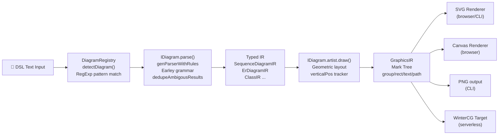
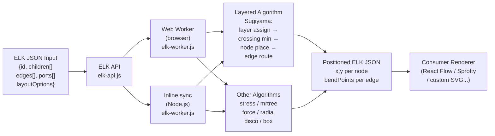
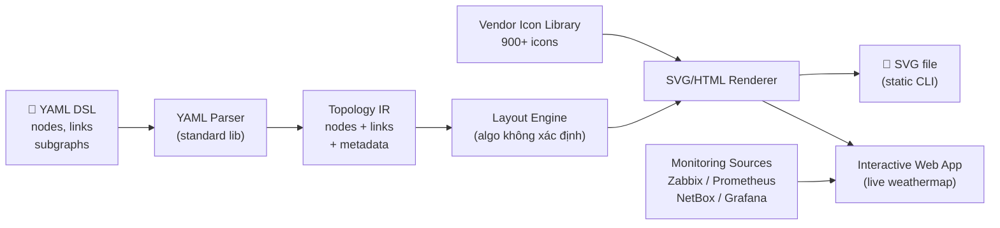
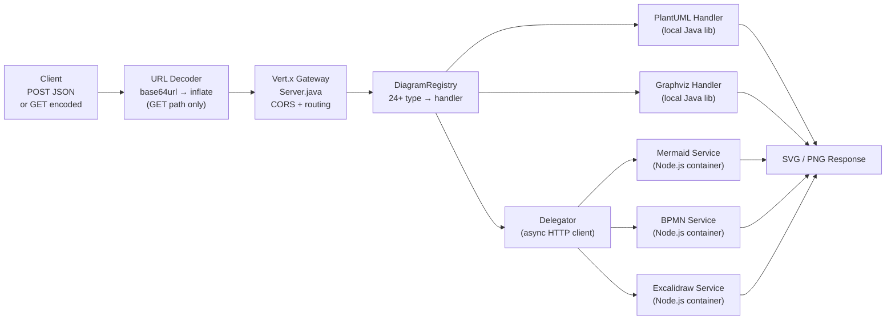

# Weekly Scan: Diagram-as-Code & Visual Tooling
**Ngày:** 2026-05-25 | **Scope:** repos pushed/updated 2026-05-18 → 2026-05-25

---

## Executive Summary

- **9 repos active** trong domain 7 ngày qua, phân thành 3 cluster: _text-DSL engines_ (mermaid, plantuml, pintora), _layout libraries_ (elkjs), và _infra-specific diagram tools_ (shumoku, mingrammer/diagrams, goadesign/model, kroki-gateway, codegraph).
- **Điểm nổi bật tuần này:** `shumoku` (YAML network topology + live weathermap real-time, ra mắt Jan 2026, đang tăng trưởng), `pintora` (extensible IDiagram plugin architecture sạch nhất hiện tại), `elkjs` (ELK Sugiyama layered + orthogonal routing, GWT-compiled từ Java).
- **Cho kymostudio cụ thể:** Pintora's `IDiagram` interface (pattern + parse + artist) là plugin contract đáng copy; elkjs có thể embed trực tiếp cho hierarchical layout + orthogonal edge routing; Kroki's deflate-base64 URL encoding scheme và DiagramRegistry pattern có thể adopt nguyên si.

---

## Table of Contents

1. [Candidate Shortlist (9 repos)](#candidate-shortlist)
2. [Deep Dive 1 — hikerpig/pintora](#deep-dive-1--hikerpigpintora)
3. [Deep Dive 2 — kieler/elkjs](#deep-dive-2--kielerélkjs)
4. [Deep Dive 3 — konoe-akitoshi/shumoku](#deep-dive-3--konoe-akitoshishumoku)
5. [Deep Dive 4 — yuzutech/kroki](#deep-dive-4--yuzutechkroki)

---

## Candidate Shortlist

| # | Repo | Stars | Pushed | Lý do relevant |
|---|------|-------|--------|----------------|
| 1 | mermaid-js/mermaid | ★88K | 2026-05-24 | Gold standard text-to-diagram, benchmark |
| 2 | mingrammer/diagrams | ★42K | 2026-05-19 | Python diagram-as-code via Graphviz, cloud arch |
| 3 | plantuml/plantuml | ★13K | 2026-05-25 | Classic UML DSL, Java, multi-format output |
| 4 | yuzutech/kroki | ★4.1K | 2026-05-23 | **DEEP DIVE** — multi-backend gateway pattern |
| 5 | kieler/elkjs | ★2.6K | 2026-05-23 | **DEEP DIVE** — ELK layout algorithms in JS |
| 6 | hikerpig/pintora | ★1.3K | 2026-05-23 | **DEEP DIVE** — extensible text-to-diagram TS |
| 7 | xnuinside/codegraph | ★475 | 2026-05-19 | Python static dep-graph → interactive HTML |
| 8 | goadesign/model | ★461 | 2026-05-20 | C4 architecture DSL in pure Go |
| 9 | konoe-akitoshi/shumoku | ★124 | 2026-05-24 | **DEEP DIVE** — YAML network topology + weathermap |

**Excluded (và lý do):** `graphistry/pygraphistry` (GPU data analytics, không phải diagram-as-code), `networkx/networkx` (graph algorithms lib, không có rendering), `mermaid.ink` (render proxy duy nhất, không có own architecture), `Tiledesk/design-studio` (chatbot builder, không phải diagram tool), `ThisIs-Developer/Markdown-Viewer` (markdown editor wrapper).

---

## Deep Dive 1 — hikerpig/pintora

### §1 — Quick Context

**One-line pitch:** Text-to-diagram TypeScript library hỗ trợ browser lẫn Node.js với plugin architecture thực sự — mỗi diagram type là một `IDiagram` object đăng ký độc lập, không cần fork repo để thêm loại diagram mới (khác mermaid cốt lõi monolithic).

- **Tech stack:** TypeScript, Earley/LALR grammar qua `genParserWithRules`, SVG/Canvas (browser), PNG/SVG (Node.js), WinterCG runtime target
- **Health:** ★1282, 1 main contributor (hikerpig), 37 open issues, Vitest tests, npm distribution
- **Distribution:** npm — `@pintora/standalone` (browser), `@pintora/cli` (Node.js), `@pintora/core` (library)

---

### §2 — Architecture Deep-Dive

#### A. Component Inventory

| Module | Path | Vai trò |
|--------|------|---------|
| `pintora-core` | `packages/pintora-core/src/` | Registry hub: `diagramRegistry`, `themeRegistry`, `symbolRegistry`, `configApi`, `configEngine`, entry point `parseAndDraw()` |
| `pintora-diagrams` | `packages/pintora-diagrams/src/` | 8 built-in diagram implementations: sequence, ER, component, activity, mindmap, Gantt, DOT, class |
| `pintora-renderer` | `packages/pintora-renderer/` | Converts `GraphicsIR` mark tree → actual SVG string / Canvas draw calls |
| `pintora-cli` | `packages/pintora-cli/` | CLI entry point; Node.js PNG/SVG output |
| `pintora-standalone` | `packages/pintora-standalone/` | Browser bundle |
| `pintora-target-wintercg` | `packages/pintora-target-wintercg/` | WinterCG target (Cloudflare Workers, Deno) |
| `pintora-harness` | `packages/pintora-harness/` | Test harness (inferred từ name) |

#### B. Pipeline / Control Flow

1. User gọi `parseAndDraw(text, opts)` từ `pintora-core`
2. `diagramRegistry.detectDiagram(text)` tests input string với `pattern: RegExp` của từng registered `IDiagram` → trả về `IDiagram` đầu tiên match
3. `IDiagram.parse(text)` chạy `genParserWithRules(grammar, { dedupeAmbigousResults: true })` → produce typed IR (e.g. `SequenceDiagramIR`)
4. `IDiagram.artist.draw(ir, opts)` thực hiện geometric layout → produce `GraphicsIR` (mark tree)
5. `pintora-renderer` nhận `GraphicsIR` + backend target → emit SVG string hoặc Canvas draw calls
6. Output: file SVG (CLI), PNG (CLI via canvas), inline SVG (browser)

#### C. Data Model / Intermediate Representation

- **`BaseDiagramIR`** — TypeScript interface, extended per diagram type
- **`SequenceDiagramIR`** chứa:
  - `actors: Record<string, Actor>` — mỗi actor có `name`, `itemId`, `description`, `prevActorId`, `nextActorId`, `boxId`
  - `messages: Message[]` — `from`, `to`, `text`, `type: LINETYPE`, `placement`
  - `notes: Note[]`, `actorOrder: string[]`, `participantBoxes: Record<string, ParticipantBox>`
  - `title: string`, `showSequenceNumbers: boolean`
- **IR immutable** giữa parse và artist pass — artist reads, không mutate
- **Second IR level:** `GraphicsIR` = mark tree `{type: 'group', children: [rect, line, text, path, ...]}` — tách layout logic khỏi render logic
- **Không có** "compile to lower IR" step (không có TALA equivalent)

#### D. Input Language Design

- **Parser approach:** Earley/LALR grammar qua internal `genParserWithRules(grammar, opts)` utility. Flag `dedupeAmbigousResults: true` xác nhận đây là Earley parser — handle ambiguous grammars bằng cách deduplicate parse trees, không fail
- Mỗi diagram type define grammar object riêng, registered độc lập
- Grammar được `setYY()` kết nối với database context trước khi parser chạy
- **Error reporting:** Không xác định — không tìm được evidence từ code đọc được
- **Formal BNF/EBNF spec:** Không có file grammar formal, grammar inline trong TypeScript

#### E. Layout Algorithm

- **Sequence diagram:** manual geometric calculation — `verticalPos` tracker tăng dần khi add mỗi element; actor horizontal spacing = `max(actor_width, max_message_width) + actorMargin` (từ config)
- **Model class** track cumulative bounds `{startx, stopx, starty, stopy}` via `insert()` method
- Loops/boxes: stack-based (push khi open, pop khi close); activations: stack horizontally cho nested calls to same actor
- **ER/Class/Component diagrams:** không xác định — có thể dùng dagre/elkjs (không tìm được evidence)
- **Edge routing:** straight lines (sequence diagram); không xác định cho other types
- **Crossing minimization:** không xác định

#### F. Rendering / Output Strategy

- Mark tree IR (`group/rect/text/line/path`) tách render logic hoàn toàn khỏi layout logic — **pluggable emitter pattern** ✓
- **Browser:** SVG (string) hoặc Canvas
- **Node.js:** PNG/JPG/SVG via `pintora-cli`
- **WinterCG:** headless rendering cho serverless runtimes (Cloudflare Workers, Deno)
- Scaling: `useMaxWidth` flag apply matrix transform cho container-width scaling

#### G. Extensibility

- **Plugin contract** — `IDiagram` interface:
  - `pattern: RegExp` — detect diagram type từ input text
  - `parse(text): IR` — parse DSL → typed IR
  - `artist.draw(ir, opts): GraphicsIR` — layout → mark tree
  - Optional: `eventRecognizer` để handle diagram events
- **Registration:** `diagramRegistry.registerDiagram(name, diagram)` tại runtime
- `themeRegistry`, `symbolRegistry` — extensibility cho themes và symbols
- All code-driven, không có plugin config file

#### H. Dev Experience

- **CLI:** `pintora render -i input.pintora -o output.svg`
- **Browser playground:** pintorajs.vercel.app
- **VS Code extension:** không xác định
- **Watch mode:** không xác định
- **TypeScript types:** đầy đủ (exported interfaces cho tất cả IR types)

---

### §3 — Architecture Diagram

---

### §4 — Verdict

**Điểm đáng học cho kymostudio:**
- `IDiagram` interface (pattern + parse + artist) là **minimal plugin contract rất sạch** — kymo có thể adopt nguyên pattern này để allow users/plugins add custom diagram types
- **Mark tree IR** (GraphicsIR) là elegant abstraction: layout code chỉ produce geometry structs, renderer handle actual drawing — tách concern triệt để, dễ test và dễ thêm backend mới
- **WinterCG target** cho serverless rendering là idea hay nếu kymo cần server-side render không muốn spin up headless browser

**Red flags:**
- Single contributor — bus factor = 1
- `dedupeAmbigousResults: true` suggest grammar có ambiguity chưa resolve proper → khả năng có edge-case parse failures
- Không có formal grammar spec, hard to know full syntax từ code đọc

**Open questions:** Sequence diagram manual calc sẽ không scale cho large diagrams — có plan integrate elkjs/dagre cho auto-layout không?

**Verdict: Study deeper** — IDiagram plugin pattern và mark tree IR pattern đáng extract và adopt.

---

## Deep Dive 2 — kieler/elkjs

### §1 — Quick Context

**One-line pitch:** Eclipse Layout Kernel (Java) port sang JavaScript qua GWT transpilation — khác các layout libs JS thuần ở chỗ implement Sugiyama hierarchical layering chính thức với orthogonal edge routing và port-based connections từ research-grade Java codebase.

- **Tech stack:** Java (core algorithms) → GWT transpilation → JavaScript, Web Worker API, npm
- **Health:** ★2582, Eclipse/Kieler organization, Mocha tests (Chai), EPL-2.0 license, 100 open issues
- **Distribution:** npm (`elkjs`), Gradle build (requires Java toolchain)

---

### §2 — Architecture Deep-Dive

#### A. Component Inventory

| Module | File | Vai trò |
|--------|------|---------|
| `elk-api.js` | `src/elk-api.js` | Public `ELK` class API, Web Worker lifecycle management |
| `elk-worker.js` | `src/elk-worker.js` | Layout computation engine — GWT-compiled Java code |
| `elk.bundled.js` | bundle | Browser `<script>` bundle (api + worker inlined) |
| `lib/main.js` | `lib/main.js` | Node.js CJS entry — synchronous, no Web Worker |

#### B. Pipeline / Control Flow

1. User construct ELK JSON graph: `{ id, children: [{id, width, height, ports: [...]}, ...], edges: [{sources, targets}] }`
2. `elk.layout(graph, options)` → serializes graph to JSON message
3. **Browser:** message posted tới Web Worker (`elk-worker.js`) — non-blocking; **Node.js:** inline synchronous call
4. GWT-compiled Java algorithms trong worker: (a) layer assignment → (b) crossing minimization → (c) node placement → (d) edge routing
5. Worker trả positioned graph: mỗi node có `x, y`; mỗi edge có `sections[].bendPoints[]`
6. `Promise` resolves với positioned ELK JSON

#### C. Data Model / Intermediate Representation

- **ELK JSON format:** flat structure `{id, width, height, x, y, children, edges, ports, labels}`
- **Mutable:** output JSON overwrites input JSON — layout coords được ghi đè trực tiếp
- Không có separate IR compilation step — single pass qua Java core
- `layoutOptions`: `Record<string, string>` attached tới bất kỳ node/edge nào

#### D. Input Language Design

- **Không có text DSL** — input là JavaScript object / ELK JSON
- Layout options: string key-value pairs như `"org.eclipse.elk.algorithm": "layered"` hoặc shortened form `"algorithm": "layered"`
- Shortened key mapping built-in (e.g., `"algorithm"` → `"org.eclipse.elk.algorithm"`)
- **Error reporting:** Java exceptions propagated qua Web Worker `error` events

#### E. Layout Algorithm

| Algorithm | Approach | Best for |
|-----------|----------|---------|
| **Layered** (default) | Sugiyama — network simplex layer assignment, barycentric crossing minimization, Brandes-Köpf node placement | DAGs, flowcharts, hierarchy |
| **Stress** | Minimize weighted stress function | Undirected graphs, force-like |
| **Mrtree** | Compact tree layout | Trees, org charts |
| **Radial** | Circular tree layout | Radial hierarchies |
| **Force** | Fruchterman-Reingold spring-force | Free-form undirected |
| **Disco** | Disconnected components handler | Graphs với multiple components |
| **Box** | Pack nodes without edges into rows | Node arrangement |

- **Edge routing:** Orthogonal (default cho layered) — bend points trong `edge.sections[].bendPoints`; spline/polyline options có
- **Crossing minimization:** Barycentric heuristic (Sugiyama phase 3) ✓
- **Port constraints:** nodes có thể declare port positions, edges routed respect ports

#### F. Rendering / Output Strategy

- **Không render** — ELK chỉ compute layout (positions + bend points), consumer tự render
- Output là positioned ELK JSON — compatible với React Flow, Sprotty, Eclipse GLSP, custom SVG

#### G. Extensibility

- Layout algorithm selection qua `algorithm` option
- Algorithm-specific properties qua `layoutOptions`
- GWT-compiled core không extensible tại runtime — phải modify Java source và recompile

#### H. Dev Experience

- **Build pipeline:** `./gradlew lib` (Java/Gradle) → `npm run js` (Babel + Browserify) — requires Java 11+ toolchain, complex để reproduce
- **npm install:** dễ dàng (`npm install elkjs`)
- **TypeScript types:** `ELK`, `ElkNode`, `ElkEdge`, `ElkPort`, `ElkLabel` interfaces
- **No CLI, no watch mode**
- Web Worker isolation: layout không block UI thread ✓

---

### §3 — Architecture Diagram

---

### §4 — Verdict

**Điểm đáng học cho kymostudio:**
- **Layered (Sugiyama) là gold standard** cho hierarchical diagram layout — nghiên cứu ELK JSON format để understand ports và bend points, có thể adopt ELK JSON làm kymo's layout IR format
- **Orthogonal edge routing với bend points** là exact problem kymo cần nếu làm flowchart/diagram editor — elkjs solve điều này trong single `elk.layout()` call
- **Web Worker isolation** cho layout computation là critical pattern cho responsive editor — copy nguyên design: layout chạy off main thread, UI không block
- ELK JSON format là interoperable — diagrams lưu trong format này compatible với React Flow, Eclipse GLSP, và các tools khác

**Red flags:**
- **EPL-2.0 license:** copyleft có điều kiện — cần legal review trước khi embed vào commercial kymo SaaS product
- Build pipeline Java → GWT → JS rất fragile — hard to contribute upstream, phải track Java source changes
- 100 open issues, nhiều về layout correctness trong edge cases (port overlapping, large graphs)

**Open questions:** Có WASM port đang develop không (sẽ replace brittle GWT approach)? Elkjs version có tương thích với latest ELK Java 3.x không?

**Verdict: Study deeper** — Embed `elkjs` cho hierarchical/orthogonal layout; adopt ELK JSON format làm layout IR trong kymo.

---

## Deep Dive 3 — konoe-akitoshi/shumoku

### §1 — Quick Context

**One-line pitch:** Platform tạo network topology diagram từ YAML với live weathermap (màu link theo traffic utilization real-time) — khác `mingrammer/diagrams` ở chỗ không chỉ static rendering mà integrate trực tiếp với Zabbix, Prometheus, NetBox để auto-discover và live-update topology.

- **Tech stack:** TypeScript, Bun 1.3.4, Turbo monorepo, SVG/HTML output, AGPL-3.0
- **Health:** ★124, 1 main contributor, Vitest CI, 55 open issues (tỉ lệ issue/star cao), npm + Docker
- **Distribution:** `npx shumoku render` (CLI), Docker Compose (server mode)

---

### §2 — Architecture Deep-Dive

#### A. Component Inventory

Inferred từ `package.json` workspaces config (`libs/**, libs/plugins/*, apps/*, apps/server/api, apps/server/web`):

| Module | Path (inferred) | Vai trò |
|--------|----------------|---------|
| `@shumoku/core` | `libs/core/` | Core YAML parsing, topology IR, static rendering |
| Plugin packages | `libs/plugins/*/` | Monitoring integrations (Zabbix, Prometheus, NetBox, Grafana) |
| API server | `apps/server/api/` | Backend serving topology data + monitoring aggregation |
| Web frontend | `apps/server/web/` | Interactive live weathermap web app |

*(Note: source files 404 trên nhiều paths — monorepo structure còn chưa stable trong npm publish)*

#### B. Pipeline / Control Flow

**Static path (CLI):**
1. `npx shumoku render network.yaml -o diagram.svg`
2. YAML parsed → topology IR (nodes, links, subgraphs)
3. Vendor icon library resolved (900+ icons, aspect ratio preserved)
4. Layout computed (algorithm không xác định từ code)
5. SVG file output

**Live path (server mode):**
1. `docker compose up` khởi động API server + web frontend
2. API server polls monitoring sources (Zabbix/Prometheus/NetBox/Grafana) theo interval
3. Link utilization data updates IR overlay
4. Web frontend renders interactive HTML — link colors = weathermap (gradient theo % utilization)
5. Alerts overlay trực tiếp trên topology view

#### C. Data Model / Intermediate Representation

- YAML input format: nodes (name, icon vendor, optional position), links (from, to, bandwidth capacity?), subgraphs/layers
- Live mode: two-layer IR — static topology + dynamic monitoring overlay
- **Không xác định** internal IR types (source files không load được)

#### D. Input Language Design

- **YAML DSL** — không phải custom grammar, sử dụng standard YAML parser
- Quyết định đáng chú ý: YAML thay vì custom text DSL giảm đáng kể learning curve
- Error reporting: YAML parser errors (standard)

#### E. Layout Algorithm

- **Không xác định** từ code — source files 404
- Theo convention của network topology tools: likely hierarchical (core → distribution → access layer) hoặc manual position per node
- "Subgraph" concept trong YAML suggests hierarchical grouping support

#### F. Rendering / Output Strategy

- **Static:** SVG file output
- **Interactive:** HTML với pan/zoom
- **Live:** web app với real-time link coloring
- 900+ vendor icons với aspect ratio preservation — vendor icon library là differentiator lớn

#### G. Extensibility

- Plugin architecture inferred từ workspace `libs/plugins/*`
- Custom topology sources qua API
- Custom monitoring sources qua API
- Không có documentation về plugin interface

#### H. Dev Experience

- **CLI:** `npx shumoku render network.yaml -o diagram.svg`
- **Live view:** Docker Compose + web app
- **Shareable links:** token-authenticated public links (read-only, no login)
- **Build:** Bun + Turbo (nhanh) + Biome formatter

---

### §3 — Architecture Diagram

---

### §4 — Verdict

**Điểm đáng học cho kymostudio:**
- **Weathermap pattern:** color-code links/edges theo real-time data là idea rất applicable cho kymo nếu muốn animated/data-driven diagrams — technique: map numeric value → color gradient → apply to edge stroke
- **YAML-over-custom-DSL decision:** giảm đáng kể learning curve user; tradeoff là mất khả năng inline comment và expression trong DSL — quyết định đúng cho network operator audience
- **Vendor icon library (900+ icons, aspect ratio preserved):** UX detail quan trọng — nếu kymo làm architecture diagram với company logos, đây là approach đúng

**Red flags:**
- Single contributor, 55 open issues / ★124 = tỉ lệ issue/star rất cao
- **AGPL-3.0:** license restrictive — embed trong kymo SaaS yêu cầu commercial license hoặc full AGPL compliance
- Source files 404 nhiều paths → npm package chưa fully published, monorepo structure unstable
- Evidence kiến trúc thin — layout algorithm không xác định được

**Open questions:** Layout algorithm cụ thể là gì? Vendor icon library có extensible không (add custom icons)? Enterprise pricing như thế nào?

**Verdict: Glance only** — Weathermap UX pattern thú vị nhưng source quá thin để study deep, AGPL-3.0 là blocker cho kymo SaaS.

---

## Deep Dive 4 — yuzutech/kroki

### §1 — Quick Context

**One-line pitch:** HTTP API gateway thống nhất cho 24+ diagram engines — thay vì embed từng thư viện riêng lẻ, kymo gọi một POST endpoint và nhận SVG back bất kể diagram type là PlantUML, Mermaid, D2, hay Excalidraw.

- **Tech stack:** Java 17 + Vert.x (gateway), Node.js (companion services), Docker Compose orchestration
- **Health:** ★4146, active Yuzutech org, Maven CI, MIT license, 154 open issues
- **Distribution:** Docker Hub image, hosted service tại kroki.io

---

### §2 — Architecture Deep-Dive

#### A. Component Inventory

| Component | File / Path | Vai trò |
|-----------|-------------|---------|
| `Server.java` | `server/src/main/java/io/kroki/server/` | Vert.x HTTP server: CORS, routing, health, metrics |
| `DiagramRegistry` | `server/.../service/` | Maps 24+ diagram type strings → handler implementations |
| PlantUML handler | local Java | Synchronous Java lib invocation |
| Graphviz handler | local Java | Synchronous Graphviz binding |
| `Delegator` | `server/.../service/` | Async HTTP client cho companion services |
| Mermaid service | Node.js container | `micro`-powered Node.js web server |
| BPMN service | Node.js container | `micro`-powered Node.js web server |
| Excalidraw service | Node.js container | `micro`-powered Node.js web server |
| Node.js CLIs | containers | Nomnoml, Vega, Bytefield, Wavedrom, WireViz |

#### B. Pipeline / Control Flow

**POST JSON path:**
1. Client POSTs `{"diagram_source": "...", "diagram_type": "plantuml", "output_format": "svg"}`
2. Vert.x router dispatches tới `DiagramRegistry.lookup(type)`
3. **Local engine** (PlantUML, Graphviz, Ditaa): handler calls native Java lib synchronously → returns SVG bytes
4. **Companion service** (Mermaid, BPMN, Excalidraw): `Delegator` sends HTTP request tới companion container → awaits response asynchronously
5. SVG/PNG bytes trả về client với appropriate Content-Type header

**GET encoded path:**
1. Client GETs `/plantuml/svg/SyfFKj2rKt3CoKnELR1Io4ZDoSa70000`
2. Server decodes: `base64url → inflate → diagram source string`
3. Same pipeline từ bước 3 ở trên

#### C. Data Model / Intermediate Representation

- **Không có shared IR** — Kroki là pass-through gateway, không parse diagram source
- Mỗi engine xử lý source string format riêng của nó
- Output: raw bytes — SVG string hoặc PNG binary

#### D. Input Language Design

- **Không có own DSL** — accepts native syntax của từng tool
- **URL encoding scheme cho GET requests:** `deflate(source_utf8) → base64url` — simple, stateless, shareable
- No server-side state — mỗi request fully self-contained

#### E. Layout Algorithm

- **Hoàn toàn delegated** tới underlying engines
- Kroki không có own layout logic

#### F. Rendering / Output Strategy

- **SVG và PNG** outputs (tùy engine support — PlantUML, Graphviz, Mermaid support cả hai; BPMN chỉ SVG)
- **Pluggable handler pattern:** `DiagramRegistry` register 24+ type → handler mappings — thêm engine mới = implement handler + register
- **Delegator pattern:** tách async companion services tránh block Vert.x event loop — critical cho throughput

#### G. Extensibility

- **Thêm local engine:** implement `DiagramHandler`, register trong `DiagramRegistry`
- **Thêm companion service:** implement Node.js HTTP server, set env var `KROKI_<TYPE>_HOST=hostname`
- **Không có plugin API cho end users** — extensibility ở operator level (deploy thêm container)

#### H. Dev Experience

- **Self-host:** `docker compose up` (single command)
- **API:** 3 request formats (GET encoded, POST JSON, POST plaintext với Content-Type/Accept headers)
- **Health:** `/health`, `/v1/health`, `/healthz` — compatible với Kubernetes liveness probes
- **Metrics:** `/metrics` endpoint (Prometheus-compatible)
- **No CLI**

---

### §3 — Architecture Diagram

---

### §4 — Verdict

**Điểm đáng học cho kymostudio:**
- **DiagramRegistry pattern:** simple `Map<String, Handler>` thay vì switch/case — clean, testable, extensible. Kymo nên adopt pattern này cho diagram type routing
- **Delegator pattern cho mixed sync/async renderers:** nếu kymo có cả inline (fast) và external (slow) renderers, Delegator tách chúng rõ ràng và giữ event loop clean
- **`deflate + base64url` URL encoding** cho shareable diagram links — copy nguyên scheme này, stateless và reversible, khỏi implement storage
- **3-format API** (GET encoded, POST JSON, POST plaintext): progressive complexity — users đơn giản dùng GET, integrations dùng POST JSON

**Red flags:**
- 154 open issues, nhiều về engine-specific behavior không nhất quán giữa versions
- Java + Node.js stack: 2 runtimes tăng operational complexity đáng kể
- Kroki không cache outputs — mỗi request re-render, không có CDN layer mặc định

**Open questions:** Có WebAssembly-compiled version nào của companion services đang develop không? Rate limiting mechanism là gì trong production deployment?

**Verdict: Study deeper** — DiagramRegistry + Delegator pattern và deflate-base64 URL scheme có thể copy trực tiếp vào kymo architecture.

---

*Scan generated: 2026-05-25 | Next scan: 2026-06-01*
