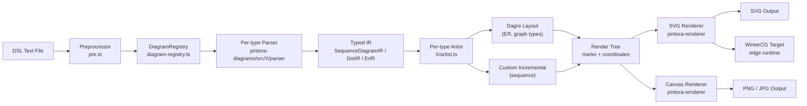
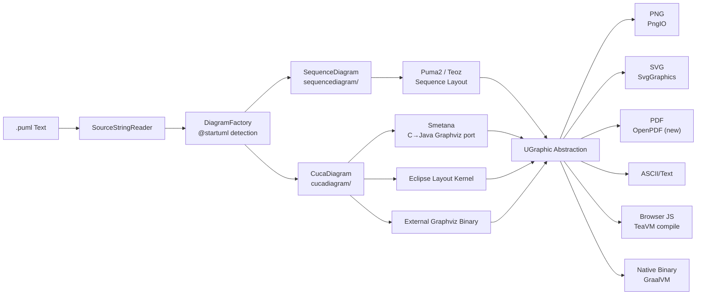
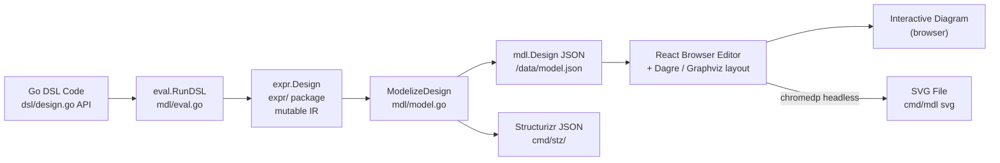
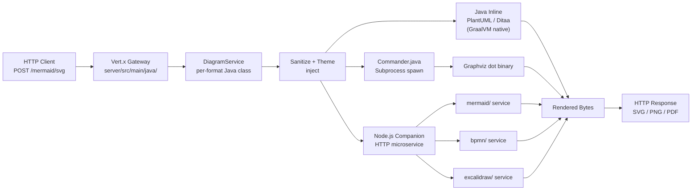

# Weekly Diagram Tooling Scan — 2026-05-26

> Scout scope: diagram-as-code, layout algorithms, visual DSL tooling  
> Data window: repos pushed sau 2026-05-19, stars > 50

---

## Executive Summary

- **pintora** (TypeScript) là repo đáng nghiên cứu nhất tuần này: plugin registry pattern cho phép add diagram type mới mà không sửa core, Dagre integration cho graph layout sạch và portable.
- **plantuml** vừa hoàn thành hai thay đổi architectural lớn: thay Batik bằng OpenPDF và ship native binary qua GraalVM — hai decision này mang pattern distribution đáng học cho bất kỳ tool nào cần multi-platform release.
- **goadesign/model** dùng Go type system làm DSL thay vì parser riêng — approach độc đáo nhưng headless Chrome render là trade-off đáng cân nhắc kỹ trước khi follow.

---

## Table of Contents

1. [hikerpig/pintora](#1-hikerpigpintora) — TypeScript extensible text-to-diagram monorepo
2. [plantuml/plantuml](#2-plantumlplantuml) — Java diagram engine với Smetana layout port
3. [goadesign/model](#3-goadesignmodel) — Go DSL cho C4 architecture diagrams
4. [yuzutech/kroki](#4-yuzutech-kroki) — Unified API gateway cho 20+ diagram backends

---

## 1. hikerpig/pintora

**Repo:** https://github.com/hikerpig/pintora | **Pushed:** 2026-05-23

### §1 — Quick Context

Text-to-diagram library với **plugin registry** cho phép developer đăng ký diagram type mới mà không fork core, khác Mermaid.js ở chỗ extensibility là first-class citizen thay vì afterthought.

- **Stack:** TypeScript, pnpm monorepo (Turborepo), AntV matrix-util, Dagre (layout), `@antv/event-emitter`
- **Output:** SVG + Canvas (browser); PNG, JPG, SVG (Node.js); WinterCG edge runtime
- **Health:** 1,282 ★, ~15 contributors, last push 2026-05-23, CI qua GitHub Actions ✓
- **Distribution:** npm (`@pintora/standalone`, `@pintora/cli`)

---

### §2 — Architecture Deep-Dive

#### A. Component Inventory

| Module | Path | Vai trò |
|---|---|---|
| `PreProcessor` | `packages/pintora-core/src/pre.ts` | Resolve includes/macros trước khi parse |
| `DiagramRegistry` | `packages/pintora-core/src/diagram-registry.ts` | Đăng ký và lookup diagram type từ prefix pattern |
| `ConfigEngine` | `packages/pintora-core/src/config-engine.ts` | Merge global + per-diagram config |
| `SymbolRegistry` | `packages/pintora-core/src/symbol-registry.ts` | Icon/sprite lookup |
| `DiagramPackage` (per type) | `packages/pintora-diagrams/src/{sequence,er,class,component,dot,gantt,mindmap,activity}/` | Parser + IR + Artist cho từng diagram type |
| `RendererRegistry` | `packages/pintora-renderer/src/index.ts` | Pluggable render backend (SVG / Canvas) |
| `pintora-cli` | `packages/pintora-cli/` | Node.js CLI entry (`render`, `preview`) |
| `pintora-standalone` | `packages/pintora-standalone/` | Browser-bundled distribution |
| `pintora-target-wintercg` | `packages/pintora-target-wintercg/` | Edge runtime (Cloudflare Workers, Deno) |

#### B. Pipeline / Control Flow

```
1. User chạy: pintora render diagram.pintora -o output.svg
2. CLI đọc file → passes text tới @pintora/core preprocessor (pre.ts)
3. Preprocessor giải quyết includes → text sạch chuyển tới DiagramRegistry
4. Registry match prefix (vd. /^\s*sequenceDiagram/) → chọn đúng DiagramPackage
5. Parser của package đó parse text → tạo typed IR (vd. SequenceDiagramIR)
6. Artist nhận IR → compute layout (Dagre hoặc custom incremental)
7. Artist xuất render tree (marks/shapes với tọa độ đã tính)
8. RendererRegistry dispatch tới SVG backend → sinh SVG string
9. File được ghi ra disk
```

#### C. Data Model / Intermediate Representation

Mỗi diagram type có IR riêng, extend `BaseDiagramIR`. Ví dụ `SequenceDiagramIR`:

```typescript
interface SequenceDiagramIR extends BaseDiagramIR {
  messages: Message[]         // signals giữa actors
  notes: Note[]               // annotations
  actors: Record<string, Actor>
  actorOrder: string[]        // thứ tự hiển thị
  participantBoxes: Record<string, ParticipantBox>
  title: string
  showSequenceNumbers: boolean
  configParams: ConfigParam[]
}
```

IR là **immutable sau parsing** — Artist nhận IR rồi tạo rendering structures riêng. Không có "compile to lower IR" như D2/TALA.

#### D. Input Language Design

- **Parser approach:** Custom parser per diagram type. Sequence diagram dùng pattern matching với `ParserWithPreprocessor` wrapper. DOT diagram import từ `./parser` local module. Khả năng cao là **jison-generated** (common ở các Mermaid-inspired projects) nhưng không xác nhận được — parser JS files bị 404.
- **Grammar formal:** Không tìm thấy BNF/EBNF public.
- **Error reporting:** Không xác định từ code fetched.

#### E. Layout Algorithm

- **ER diagrams:** **Dagre** confirmed — `new DagreWrapper(g)`, nodes khởi tạo ở (0,0) với đúng dimensions → Dagre tính center coords → artist apply SVG transform matrix `translate + offset`.
- **Sequence diagrams:** Custom **incremental vertical layout** — `Model.bumpVerticalPos()` tăng dần theo từng phần tử, `calculateActorMargins()` compute actor spacing từ max message width, `calculateLoopBounds()` pre-pass tính loop box.
- **Edge routing:** Straight lines (sequence), Dagre-determined (ER và graph-based types).
- Các diagram type khác (class, component) — không xác định đủ evidence.

#### F. Rendering / Output Strategy

- **SVG:** primary output, self-contained (không pollute global styles)
- **Canvas:** browser alternative
- **PNG/JPG:** Node.js chỉ, qua canvas → image conversion
- **WinterCG:** edge runtime target (package riêng)
- **Pattern:** Pluggable emitter — `RendererRegistry` → `makeRenderer(ir, opts.renderer)` → backend-specific render. Có thể add custom renderer.
- **Animation:** Không.

#### G. Extensibility

- `DiagramRegistry.registerDiagram(name, { parser, artist, configKey })` — add diagram type mới không cần sửa core
- Theme system trong `packages/pintora-core/src/themes/`
- Config override per diagram type qua `configParams` trong IR

#### H. Dev Experience

- VS Code extension: có
- Observable notebook support, Obsidian plugin, Gatsby plugin
- `pintora-harness` package: testing framework cho diagram developers
- `pintora-target-wintercg`: edge runtime (mới, experimental)
- Watch mode / hot reload: không xác định

---

### §3 — Architecture Diagram



---

### §4 — Verdict

**Đáng học cho kymo:**
- `DiagramRegistry` pattern: một `Map<regex, DiagramDef>` để route text vào đúng parser+artist. Rất gọn, kymo có thể copy y chang nếu cần multi-format support.
- Dagre integration pattern: pre-compute node dimensions → `DagreWrapper.layout()` → apply transform matrix. Three-step này portable sang bất kỳ layout lib nào.
- `ParserWithPreprocessor` wrapper: tách preprocessing (includes, macros) ra khỏi grammar — clean boundary.

**Red flags:** Parser approach không documented, likely jison-generated files sẽ khó debug khi grammar cần thay đổi. Open issues: 37, nhiều stale.

**Open questions:** WinterCG target có production users chưa? Tại sao dùng AntV matrix-util thay vì native browser Transform?

**Verdict:** **Study deeper** — plugin registry và Dagre integration pattern là hai technique trực tiếp applicable cho kymo.

---

## 2. plantuml/plantuml

**Repo:** https://github.com/plantuml/plantuml | **Pushed:** 2026-05-25

### §1 — Quick Context

Java diagram engine nổi tiếng, tuần này notable vì **thay Batik bằng OpenPDF** và **ship GraalVM native binary** cho macOS/Windows/Linux — hai architectural shift đồng thời trong 7 ngày.

- **Stack:** Java (99.4%), Gradle/Ant build, TeaVM (→JS), GraalVM (→native), Smetana (C→Java Graphviz port)
- **Output:** PNG, SVG, PDF, ASCII/Unicode, LaTeX, HTML imagemap; browser via TeaVM
- **Health:** 13,038 ★, org-maintained (plantuml org), push 2026-05-25 daily, CI ✓
- **Distribution:** JAR, Docker, GraalVM native binary (new!), npm (TeaVM compiled), Maven/Gradle dependency

---

### §2 — Architecture Deep-Dive

#### A. Component Inventory

| Module | Path | Vai trò |
|---|---|---|
| `Run` | `src/.../plantuml/Run.java` | CLI entry point |
| `Pipe` | `src/.../plantuml/Pipe.java` | Stdin/stdout streaming mode |
| `SourceStringReader` | `src/.../` | Parse input, detect `@start`/`@end` blocks |
| `DiagramFactory` (per type) | `src/.../sequencediagram/`, `classdiagram/`, etc. | Type-specific parsing + model creation |
| `CucaDiagram` | `src/.../cucadiagram/` | Base class cho class/component/deployment diagrams |
| `SequenceDiagram` | `src/.../sequencediagram/` | Sequence diagram model |
| `Smetana` | `src/.../sdot/` | Java port của Graphviz C code (hierarchical layout) |
| `Puma2 / Teoz` | `src/.../sequencediagram/` | Specialized layout engines cho sequence |
| `FileMaker` (per type) | `src/.../` | Coordinate layout + dispatch render |
| `UGraphic` | `src/.../ugraphic/` | Backend-agnostic rendering abstraction |
| Output backends | `src/.../png/`, `svg/`, `pdf/` | PngIO, SvgGraphics, OpenPDF (new) |

#### B. Pipeline / Control Flow

```
1. User chạy: java -jar plantuml.jar diagram.puml
2. Run.java đọc file → tạo SourceStringReader
3. @startuml/@enduml markers detected → DiagramFactory phù hợp được instantiated
4. Factory parse từng line của DSL → build diagram model (SequenceDiagram / CucaDiagram)
5. FileMaker được gọi với format option (PNG/SVG/PDF)
6. FileMaker chọn layout engine: Smetana | Graphviz external | ELK | Puma2/Teoz
7. Layout engine tính positions → coordinates stored
8. UGraphic abstraction nhận draw calls (box, line, text)
9. UGraphic backend cụ thể (PngIO, SvgGraphics, OpenPDF) render ra bytes
10. Bytes ghi ra file hoặc stdout
```

#### C. Data Model / Intermediate Representation

- **Không có unified IR** — mỗi diagram type có model riêng
- Sequence: `SequenceDiagram` chứa participants, messages, dividers
- Graph-based (class, component, deployment): `CucaDiagram` base + `CucaGraph` edges
- Smetana có internal graph structures từ C transpile (AGEdge, AGNode)
- **Mutable** trong suốt quá trình parse và layout — không phân tách rõ parse phase vs layout phase

#### D. Input Language Design

- **Parser:** Custom line-by-line processing với regex matching — không phải PEG, không phải ANTLR. Mỗi diagram type implement `DiagramFactory` riêng.
- **Grammar formal:** Không có public BNF/EBNF.
- **Error reporting:** Lỗi được embed trực tiếp vào output diagram dưới dạng text box đỏ — unique approach.
- Delimiter: `@startuml ... @enduml`; các loại khác có `@startmindmap`, `@startwbs`, etc.

#### E. Layout Algorithm

- **Sequence diagrams:** Puma2 và Teoz — hai engine chuyên biệt cho sequence layout, built-in Java
- **Class/Component/Deployment:** Graphviz external binary (default) hoặc **Smetana** (Java port của Graphviz `dot` algorithm → Sugiyama hierarchical)
- **ELK:** Eclipse Layout Kernel — optional, user-selectable
- **User selectable:** `!pragma layout smetana` | `graphviz` | `elk` | `circo` | etc.
- Thread safety cho Smetana: `ReentrantLock` bảo vệ global state từ C code transpile

#### F. Rendering / Output Strategy

- **Backends:** PNG (PngIO), SVG (SvgGraphics), PDF (**OpenPDF** từ 2026-05-19, thay thế Apache Batik), ASCII (TextSkinParam), Unicode, LaTeX, HTML imagemap
- **TeaVM:** Compile toàn bộ Java codebase sang JavaScript → chạy browser không cần server
- **GraalVM native:** Compile sang native binary cho macOS, Windows, Linux (major push May 22-23)
- **UGraphic abstraction:** Single rendering interface, multiple backend emitters — pluggable emitter pattern
- **Animation:** Không

#### G. Extensibility

- Sprites/icon system: `src/main/resources/sprites/` — add custom sprites
- Skin/theme files: `src/main/resources/skin/plantuml.skin`
- `!include` directives cho reuse
- Preprocessor với variables, loops, conditions (`!for`, `!if`)
- Không có runtime plugin system

#### H. Dev Experience

- CLI: mature, well-documented, nhiều flags hữu ích
- Server mode: Java servlet (`-picoweb` hoặc `-gui`)
- VS Code extension: PlantUML extension phổ biến
- Gradle build: `./gradlew run`, `./gradlew npmPackage` (mới, 2026-05-22)
- No watch mode built-in (delegated tới IDE extensions)

---

### §3 — Architecture Diagram



---

### §4 — Verdict

**Đáng học cho kymo:**
- **UGraphic abstraction pattern:** Một rendering interface duy nhất, nhiều emitter backends. Nếu kymo cần support SVG + PDF + PNG, pattern này giúp tránh duplicate rendering logic.
- **Batik → OpenPDF migration:** Commit `💥 Replace Batik-based PDF backend` (May 19) là case study về swap PDF backend không break API. Đáng đọc diff.
- **GraalVM native binary distribution:** Pattern cho CLI tools cần ship self-contained binary không require JVM.
- **Smetana:** Nếu kymo cần Java/JVM-native graph layout mà không depend vào Graphviz binary — Smetana là reference implementation đã tested.

**Red flags:** Codebase khổng lồ (99% Java), không có module boundaries rõ, mutable model state xuyên suốt pipeline gây khó test và extend.

**Open questions:** TeaVM compilation size? ELK quality so với Smetana cho real-world diagrams?

**Verdict:** **Glance only** cho codebase tổng thể; **study deeper** hai commits cụ thể: Batik→OpenPDF swap và GraalVM build pipeline.

---

## 3. goadesign/model

**Repo:** https://github.com/goadesign/model | **Pushed:** 2026-05-20

### §1 — Quick Context

Go type-safe DSL cho C4 architecture diagrams — **Go functions là DSL** (không có parser riêng), diagram được render qua headless Chrome thay vì built-in renderer, với live web editor.

- **Stack:** Go, chromedp (headless Chrome), chi HTTP router, lrserver (live reload), Goa framework, fsnotify
- **Output:** SVG (via Chrome export), JSON (model), Structurizr JSON
- **Health:** 461 ★, chủ yếu 1 maintainer, push 2026-05-20, CI ✓ (`.github/`)
- **Distribution:** `go install goa.design/model/cmd/mdl@latest`

---

### §2 — Architecture Deep-Dive

#### A. Component Inventory

| Module | Path | Vai trò |
|---|---|---|
| `DSL Functions` | `dsl/design.go`, `dsl/elements.go`, `dsl/views.go`, `dsl/styles.go` | User-facing API: `Design()`, `SoftwareSystem()`, `Container()`, etc. |
| `Expression Types` | `expr/` | Runtime IR: `expr.Design`, `expr.Person`, `expr.SoftwareSystem`, `expr.Relationship` |
| `Evaluator` | `mdl/eval.go` | `RunDSL()` — execute Go package, build expr.Design |
| `Serializer` | `mdl/model.go`, `mdl/views.go` | `ModelizeDesign()` — transform expr.Design → JSON-ready structs |
| `CLI` | `cmd/mdl/main.go` | `serve`, `gen`, `svg`, `version` commands |
| `Structurizr Export` | `cmd/stz/` | Export tới Structurizr cloud service |
| `Codegen` | `codegen/` | Code generation utilities |
| `Plugin` | `plugin/` | Extension points |

#### B. Pipeline / Control Flow

```
1. User viết model.go: import goa.design/model/dsl, call Design{ SoftwareSystem(...) }
2. User chạy: mdl serve ./mymodel
3. cmd/mdl/main.go gọi eval.RunDSL() → execute Go package như một program
4. DSL functions chạy với eval.Current() context → populate expr.Design IR
5. ModelizeDesign() transform expr.Design → mdl.Design (JSON-serializable)
6. chi HTTP server serve /data/model.json + static React editor assets
7. Browser render interactive diagram (Dagre/Graphviz layout client-side)
8. [SVG export] User chạy: mdl svg
9. chromedp launch headless Chrome → navigate tới editor URL với ?autoLayout&save flags
10. chromedp wait cho SVG element xuất hiện → fsnotify detect SVG file được ghi
```

#### C. Data Model / Intermediate Representation

**Two-layer IR:**
- Layer 1: `expr.Design` (runtime, mutable) — built bởi DSL function calls, chứa Go pointers
- Layer 2: `mdl.Design` (serializable, immutable) — JSON output của `ModelizeDesign()`

```go
// Layer 2 (mdl package) — JSON-ready
type ElementView struct {
  ID string
  X  *int   // optional explicit position
  Y  *int
}
type Vertex struct {
  X int    // edge bend point
  Y int
}
```

Views store explicit X/Y coordinates — layout algorithm chạy client-side trong browser rồi kết quả được save vào file.

**Element merging:** Hai models cùng define `SoftwareSystem("PaymentService")` → properties merge, không duplicate.

#### D. Input Language Design

- **Không có parser** — Go functions IS the DSL
- Pattern: evaluation context stack (`eval.Current()` returns active element) + Go closures
- ```go
  Design(func() {
    SoftwareSystem("MySystem", func() {
      Container("API", "Go", "REST API")
    })
  })
  ```
- **Type safety:** Compiler bắt invalid combinations (vd. `Container()` ngoài `SoftwareSystem()` context)
- **Error reporting:** Go compilation errors — tốt hơn runtime errors nhưng messages đôi khi cryptic

#### E. Layout Algorithm

- **Auto-layout:** Dagre hoặc Graphviz — chọn per-view qua `ImplementationKind` enum (`Dagre` | `Graphviz`)
- **Layout runs in browser** (JavaScript) sau khi model JSON được serve
- **Manual positioning:** X/Y integers trên `ElementView` — override auto-layout
- **Edge routing:** `Vertex` bend points; `RankSep`, `NodeSep`, `EdgeSep` spacing controls
- **Rank direction:** TopBottom / LeftRight / BottomTop / RightLeft

#### F. Rendering / Output Strategy

- **SVG:** Rendered bởi browser (React app) → export qua **chromedp** headless Chrome automation
  - chromedp flags: `--no-sandbox`, `--disable-gpu` (CI-friendly)
  - Wait strategy: poll cho SVG DOM element, sau đó fsnotify detect file write
- **JSON:** `mdl gen` → `expr.Design` serialized, dùng bởi external tools
- **Structurizr JSON:** `stz` command export tới Structurizr cloud
- **No built-in SVG renderer** — 100% delegate tới browser

#### G. Extensibility

- DSL reuse via Go modules: import shared model package như Go dependency
- Element merging cho distributed ownership (multiple teams define partial models)
- `plugin/` cho extension points (details không xác định từ code fetched)

#### H. Dev Experience

- `mdl serve`: live-reload web editor với lrserver + fsnotify watching
- `mdl svg`: CI-friendly headless rendering (dù cần Chrome installed)
- No LSP/IDE extension riêng — dùng Go tooling (gopls)
- `DSL.md` file: documented DSL reference (có tài liệu tốt hơn pintora)

---

### §3 — Architecture Diagram



---

### §4 — Verdict

**Đáng học cho kymo:**
- **Go-as-DSL pattern:** Dùng host language type system thay vì viết parser riêng — zero parsing overhead, free IDE support (autocomplete, refactor). Áp dụng cho kymo nếu target Go users hoặc muốn type-safe config API.
- **Evaluation context pattern:** `eval.Current()` stack là cách elegant để implement nested DSL trong Go mà không dùng builder chaining.
- **Element merging:** Pattern cho distributed model ownership — relevant nếu kymo cần multiple teams contribute vào shared architecture model.
- **`DSL.md` as spec:** Có file DSL spec riêng là good practice — kymo nên có tương tự.

**Red flags:** Single maintainer, 32 open issues. Chromedp dependency là heavy operational burden (Chrome cần installed trong CI) — anti-pattern so với tự-contained renderer. `mdl svg` là fragile (race condition giữa chromedp wait và fsnotify).

**Open questions:** Có Docker image sẵn với Chrome không để dễ CI? Layout algorithm chạy trong browser có deterministic không (same input → same positions)?

**Verdict:** **Study deeper pattern** — Go DSL evaluation context; **ignore** chromedp rendering approach cho kymo.

---

## 4. yuzutech/kroki

**Repo:** https://github.com/yuzutech/kroki | **Pushed:** 2026-05-23

### §1 — Quick Context

**Unified API gateway** routing 20+ diagram formats qua một HTTP endpoint — khác tất cả tools khác ở chỗ không implement diagram rendering mà orchestrate các engines hiện có, cho phép docs pipelines gọi một endpoint thay vì setup nhiều tools.

- **Stack:** Java (Vert.x gateway, 6.3%), JavaScript (Node.js microservices per format, 92.5%), Docker Compose orchestration, GraalVM native (PlantUML/Ditaa)
- **Output:** SVG, PNG, PDF, BASE64 — tất cả formats backends support
- **Health:** 4,148 ★, org-maintained (yuzutech), push 2026-05-23, CI ✓
- **Distribution:** Docker images (`yuzutech/kroki`, per-format companion images), `kroki.io` public instance

---

### §2 — Architecture Deep-Dive

#### A. Component Inventory

| Module | Path | Vai trò |
|---|---|---|
| `Vert.x Gateway` | `server/src/main/java/io/kroki/server/` | HTTP router, request dispatch, response handling |
| `DiagramService` (per type) | `server/src/.../service/Plantuml.java`, etc. | Per-format input sanitization + delegation |
| `Commander` | `server/src/.../action/Commander.java` | Subprocess execution (ProcessBuilder wrapper với timeout) |
| `Node.js Microservices` | `mermaid/`, `bpmn/`, `excalidraw/`, `nomnoml/`, `wavedrom/`, `vega/`, `bytefield/` | Lightweight HTTP servers wrapping JS diagram libs |
| `docker-compose.yml` | root | Orchestration của tất cả services |
| `Companion Dockerfiles` | `mermaid/Dockerfile`, etc. | Per-format container |

#### B. Pipeline / Control Flow

```
1. Client POST /mermaid/svg với body = diagram source text
2. Vert.x router match path → instantiate Mermaid DiagramService
3. Service.sanitize() filter unsafe content, inject theme directive
4. Service check diagram type:
   a. PlantUML / Ditaa → Java inline (GraalVM native binary embedded)
   b. Graphviz/DOT → Commander.execute() → spawn dot subprocess
   c. Mermaid / BPMN / Excalidraw → HTTP call tới Node.js companion service
5. Backend renders → trả về bytes (SVG/PNG/PDF)
6. Vert.x response với Content-Type phù hợp + bytes body
```

#### C. Data Model / Intermediate Representation

- **Không có unified IR** — gateway là thin routing layer
- Input: raw diagram source text (string)
- Output: rendered bytes (opaque byte array)
- Không có AST, không có transformation giữa formats
- Mỗi backend xử lý parsing + layout + rendering internally

#### D. Input Language Design

- **Không có custom DSL** — pass-through tới backend engines
- **Input routing:** URL path `/mermaid/svg`, `/plantuml/png`, `/d2/svg` → xác định format
- **Three input methods:**
  - GET: source text URL-encoded trong path
  - POST JSON: `{"diagram_source": "...", "diagram_type": "mermaid", "output_format": "svg"}`
  - POST plain text với format trong URL
- **Sanitization:** Per-backend, vd. Plantuml.java check `!include` directives against whitelist

#### E. Layout Algorithm

- Không applicable ở gateway level — delegate hoàn toàn tới từng backend
- PlantUML → Smetana/Graphviz; Mermaid → Dagre/ELK; D2 → TALA; Graphviz → dot
- Kroki không control layout decisions

#### F. Rendering / Output Strategy

- **Multi-backend fan-out:** Same source text, khác output format = khác URL (`/svg` vs `/png`)
- **Format support:** SVG, PNG, PDF, BASE64, TXT (ASCII art) — tùy backend
- **Vertx.executeBlocking():** CPU-intensive rendering chạy async trên worker thread pool
- **No animation** — static output only (Excalidraw exported static)
- **Companion services:** Optional — Mermaid, BPMN, Excalidraw, diagrams.net cần companion container

#### G. Extensibility

- Add new format = viết Node.js HTTP microservice + Java `DiagramService` class + Docker image
- Per-service versioning: mỗi backend có Dockerfile riêng, upgrade độc lập
- `Commander` reusable cho bất kỳ CLI-based renderer nào
- Optional companion: run Kroki minimal (chỉ core) hoặc full (tất cả formats)

#### H. Dev Experience

- **DX cho người dùng:** Một endpoint thay vì setup 20+ tools — rất lớn cho docs pipelines
- `kroki.io`: public instance để test không cần self-host
- Docker Compose: `docker-compose up` để chạy full stack locally
- **DX cho contributors:** Cần biết cả Java (gateway) và Node.js (per-format) — context switch cost cao

---

### §3 — Architecture Diagram



---

### §4 — Verdict

**Đáng học cho kymo:**
- **`Commander.java` pattern:** ProcessBuilder với configurable timeout + stdin/stdout pipe — reusable pattern cho bất kỳ CLI-based renderer nào kymo cần wrap (vd. Graphviz, Inkscape, etc.).
- **Microservice-per-renderer:** Nếu kymo plan support nhiều output backends, pattern "thin Java gateway + per-format Node.js service" cho phép upgrade từng backend độc lập không restart toàn bộ system.
- **Per-backend sanitization:** `Plantuml.java` có whitelist-based include filtering — model tốt cho security khi nhận user-provided diagram source.
- **URL-based format routing:** `/plantuml/svg` vs `/plantuml/png` — clean REST design cho multi-format API.

**Red flags:** 154 open issues. Security surface area lớn: Excalidraw service chạy arbitrary JS từ user input. Operational complexity cao — production deployment cần 5+ Docker containers.

**Open questions:** Các Node.js companion services có rate limiting không? Cách handle Mermaid version upgrades (breaking syntax changes) mà không affect existing clients?

**Verdict:** **Study deeper** `Commander.java` implementation và gateway routing; **glance only** overall architecture (quá heavy để follow cho kymo ở giai đoạn hiện tại).

---

*Generated: 2026-05-26 | Scout: claude-sonnet-4-6 | Branch: claude/adoring-wozniak-nfzFt*

Sources:
- [PlantUML Core Architecture — DeepWiki](https://deepwiki.com/plantuml/plantuml/2-core-architecture)
- [Porting Graphviz To Java (Smetana)](https://plantuml.com/smetana02)
- [PlantUML Layout Engines](https://plantuml.com/layout-engines)
- [hikerpig/pintora](https://github.com/hikerpig/pintora)
- [goadesign/model](https://github.com/goadesign/model)
- [yuzutech/kroki](https://github.com/yuzutech/kroki)
- [plantuml/plantuml](https://github.com/plantuml/plantuml)
