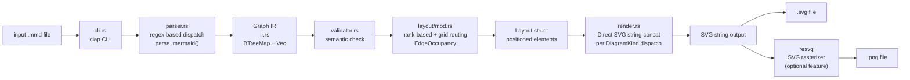
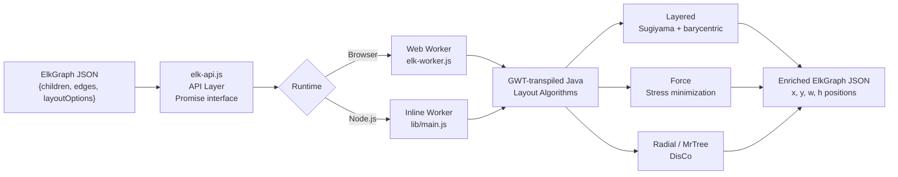
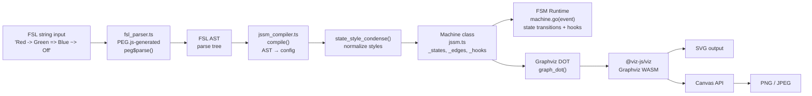

```mermaid
flowchart LR
    A["Terraform .tf files\n(working directory)"] --> B["cmd/root.go\nCobra CLI runCmd"]
    B --> C["internal/parse.go\nParseterraform()\nterraform-exec"]
    C --> D["terraform init\n+ terraform graph\nsubprocess"]
    D --> E["DOT string output\nGraphviz format"]
    E --> F["gographviz.Analyse()\nDOT parser"]
    F --> G["gographviz.Graph\nIR: nodes + edges"]
    G --> H["internal/flowchart.go\nGenerateMermaidFlowchart()"]
    H --> I["pkg/utils/CleanID()\nID sanitizer"]
    I --> J["Mermaid flowchart\nstring output"]
    J --> K[".md file / stdout"]
```

# Weekly Diagram Tooling Scan — 2026-05-27

> **Scout:** Claude Code agent — kymostudio side project  
> **Domain:** Diagram-as-code, layout algorithms, rendering craft  
> **Window:** repos pushed/updated 2026-05-20 → 2026-05-27

---

## Executive Summary

- **Rendering breakthrough:** `mermaid-rs-renderer` (Rust) chứng minh rằng parser + layout + SVG rendering hoàn toàn native (không browser) là khả thi với tốc độ 500–1400× nhanh hơn — đây là signal rõ ràng về hướng đi cho server-side diagram rendering trong kymo.
- **Layout phân tách:** `elkjs` minh họa pattern tách biệt hoàn toàn layout engine khỏi rendering — input JSON graph, output JSON positions — được cả ReactFlow lẫn Sprotty dùng chung; pattern này đáng extract thành kymo layout service riêng.
- **DSL innovation:** `jssm` dùng PEG.js với 3 loại arrow có semantic khác nhau (`->` legal, `=>` main-path, `~>` forced) — cách encode semantic trực tiếp vào syntax level là design decision đáng học cho kymo's own DSL.

---

## Table of Contents

1. [mermaid-rs-renderer](#1-mermaid-rs-renderer--1jehuangmermaid-rs-renderer) — Rust native renderer, 1.4k ⭐
2. [elkjs](#2-elkjs--kielerelkjs) — ELK layout algorithms for JS, 2.6k ⭐
3. [jssm](#3-jssm--stonecypherjssm) — FSM với custom PEG DSL, 367 ⭐
4. [Terramaid](#4-terramaid--rosesecurityterramaid) — Terraform → Mermaid converter, 545 ⭐

---

## 1. mermaid-rs-renderer — `1jehuang/mermaid-rs-renderer`

> <https://github.com/1jehuang/mermaid-rs-renderer>  
> Pushed: 2026-05-24 · Stars: 1.4k · Language: Rust

### §1 — Quick Context

**One-line pitch:** Rust renderer cho Mermaid không cần browser — tự implement toàn bộ parser + layout + SVG string-builder, đạt tốc độ 500–1400× nhanh hơn `mermaid-cli`.

- **Tech stack:** Rust (82%), Python (benchmarks/scripts), deps: `fontdb`, `ttf-parser`, `regex`, `once_cell`, `serde`; optional `resvg`/`usvg` cho PNG
- **Output formats:** SVG (primary), PNG via resvg rasterization
- **Repo health:** 1.4k stars, 441 commits, 60 forks, MIT license; CI benchmark suite có criterion; marked "active early development"
- **Distribution:** `cargo install mermaid-rs-renderer`, Homebrew, AUR (Arch), Scoop (Windows)

---

### §2 — Architecture Deep-Dive

#### A. Component Inventory

| Module | File | Vai trò |
|--------|------|---------|
| `Parser` | `src/parser.rs` | Regex-based, detect diagram kind, tokenize, produce `Graph` IR |
| `IR` | `src/ir.rs` | `Graph`, `Node`, `Edge`, `Subgraph` — mutable BTreeMap/Vec structs |
| `Validator` | `src/validator.rs` | Validate IR trước khi layout (semantic check) |
| `Layout Engine` | `src/layout/mod.rs` | Rank-based placement, grid-based edge routing, EdgeOccupancy |
| `Text Metrics` | `src/text_metrics.rs` | Font measurement via `fontdb` + `ttf-parser` — critical cho layout |
| `Renderer` | `src/render.rs` | Direct SVG string-concat, dispatch per diagram kind |
| `Theme` | `src/theme.rs` | Color + styling struct injection |
| `Config` | `src/config.rs` | `RenderOptions`, `LayoutConfig`, `RenderConfig` |
| `CLI` | `src/cli.rs` | `clap`-based CLI, entry point |
| `Edge Geometry` | `src/edge_geometry.rs` | Path math: `points_to_path()`, `basis_curve_path()` (B-spline cho mindmap) |

#### B. Pipeline / Control Flow

```
1. User chạy `mmdr foo.mmd`
2. cli.rs đọc file → tạo RenderOptions từ flags
3. parser.rs::parse_mermaid() — regex detect diagram kind, dispatch sang per-type parser → Graph IR
4. validator.rs validate Graph IR (semantic constraints)
5. layout/mod.rs::compute_layout() — rank assignment → node placement → grid-based edge routing → Layout struct
6. render.rs::render_svg_with_dimensions() — dispatch theo DiagramKind, concat SVG string
7. Output: ghi .svg file; nếu feature "png" bật → resvg rasterizes SVG → .png
```

#### C. Data Model / Intermediate Representation

```rust
struct Graph {
    kind: DiagramKind,             // enum: Flowchart, Sequence, Class, State, ER, ...
    direction: Direction,          // TD, LR, BT, RL
    nodes: BTreeMap<String, Node>, // node_id → Node
    edges: Vec<Edge>,
    subgraphs: Vec<Subgraph>,
    // diagram-specific fields:
    sequence_participants, pie_slices, gantt_tasks, c4, mindmap, xychart, timeline, block
}

struct Node { id, label, shape: NodeShape, value, icon }
struct Edge { from, to, label, start_label, end_label,
              style: EdgeStyle,              // Solid/Dotted/Thick
              arrow_start_kind, arrow_end_kind,
              start_decoration, end_decoration }  // crow's foot notation
struct Subgraph { id, label, nodes: Vec<String>, direction, icon }
```

- **Mutability:** `Graph` mutable giữa các pass; `Layout` struct là output riêng của layout pass
- **No "lower IR":** một Graph duy nhất đi qua parser → validator → layout → renderer
- **DiagramKind enum** có 23 variants — mỗi variant có parser và renderer riêng

#### D. Input Language Design

- **Không phải DSL của riêng tool** — đọc Mermaid syntax trực tiếp
- **Parser approach:** regex-based line scanning; các pattern tĩnh (`HEADER_RE`, `ARROW_RE`, `LABEL_ARROW_RE`, `PIPE_LABEL_RE`) compile once via `once_cell::Lazy<Regex>`
- **Không có formal grammar** (BNF/EBNF) — parser là hand-written per-diagram regex dispatch
- **Error reporting:** `thiserror` + `anyhow` chain — có file/line info nhưng không có Mermaid-aware diagnostics

#### E. Layout Algorithm

- **Node placement:** rank-based hierarchical (Sugiyama-influenced nhưng simplified) — `assign_ranks()` → place trong rank order, preserve input sequence
- **Edge routing:** grid-based obstacle-avoidance pathfinding — chia canvas thành cell grid, route edges quanh blocked cells; retry với coarser grid nếu cần
- **Lane management:** `EdgeOccupancy` struct track occupied lanes, apply offset ratio cho multiple parallel edges
- **Label-aware routing:** edges route qua preferred label centers, hoặc tránh "reserved label corridors" với clearance distance
- **Whitespace compaction:** compact large whitespace regions trong dense flowcharts
- **Subgraph containment:** constraint-based — member nodes phải nằm trong subgraph bounds
- **Crossing minimization:** không có dedicated crossing minimization pass (khác ELK/Sugiyama full)

#### F. Rendering / Output Strategy

- **Single SVG backend** — không pluggable emitter
- **PNG backend:** optional via `resvg` (rasterize SVG → PNG, dùng `usvg` cho normalization)
- **Rendering mechanism:** direct `String` buffer concat — không có DOM tree intermediate
- **Dispatch pattern:** `render_svg_with_dimensions()` → match `DiagramKind` → per-type function: `render_c4()`, `render_sankey()`, `render_architecture()`, etc.
- **Edge geometry:** `points_to_path()` cho linear segments; `basis_curve_path()` cho B-spline curves (mindmap)
- **Animation:** không có — output là static SVG

#### G. Extensibility

- Thêm diagram type mới: phải add parser case + renderer case (tight coupling)
- Theme via struct injection (`RenderOptions` carries `Theme`)
- Không có plugin system
- Feature flags: `cli` và `png` giảm crate graph từ ~123 xuống ~71

#### H. Dev Experience

- `cargo install` one-liner; package manager support (Homebrew/AUR/Scoop) tốt
- `criterion` benchmark suite — có thể measure regression
- Không có IDE integration, LSP, watch mode, hay browser preview
- Hot path benchmark: flowchart 4.49ms vs mermaid-cli 1971ms (439×)

---

### §3 — Architecture Diagram



---

### §4 — Verdict

**Điểm đáng học cho kymostudio:**
- **Grid-based edge routing + EdgeOccupancy:** concept "lane reservation" này trực tiếp áp dụng được vào kymo nếu cần tránh edge overlap trong auto-layout
- **Feature flag architecture:** `cli`/`png` features cắt dependency graph đáng kể — kymo nên làm tương tự cho các output backend (WASM vs native vs server)
- **Text metrics trước layout:** `text_metrics.rs` đo font trước khi compute layout → node sizing accurate; đây là critical step thường bị bỏ qua

**Red flags:**
- Regex-based parser cho Mermaid syntax thiếu formal grammar → brittle, khó extend khi Mermaid syntax thay đổi
- Không có crossing minimization riêng → complex graphs trông kém hơn ELK

**Open questions:** Khi nào "visual fidelity gap" so với mermaid-cli được close? Roadmap không rõ.

**Verdict: 🟢 Study deeper** — đặc biệt `layout/mod.rs` (grid routing + EdgeOccupancy) và feature flag pattern

---

## 2. elkjs — `kieler/elkjs`

> <https://github.com/kieler/elkjs>  
> Pushed: 2026-05-25 · Stars: 2.6k · Latest release: 0.11.1 (Mar 2026)

### §1 — Quick Context

**One-line pitch:** JavaScript wrapper cho Eclipse Layout Kernel — multiple layout algorithms (Sugiyama layered, force, radial, tree) chạy via GWT-transpiled Java trong Web Worker, không render gì — chỉ tính positions.

- **Tech stack:** Java (core algorithms) → GWT transpile → JS; npm package; Web Worker support; TypeScript typings
- **Output:** ElkGraph JSON enriched với `x`, `y`, `width`, `height` — **không render**, caller tự render
- **Repo health:** 2.6k stars, 117 forks, release 0.11.1 tháng 3/2026, 92 open issues, EPL-2.0 license
- **Distribution:** npm (`@kieler/elkjs`)

---

### §2 — Architecture Deep-Dive

#### A. Component Inventory

| Module | File | Vai trò |
|--------|------|---------|
| `API Layer` | `src/js/elk-api.js` | Promisified JS interface, worker management |
| `Layout Worker` | `elk-worker.js` (built) | GWT-transpiled Java algorithms, runs in Web Worker |
| `Browser Bundle` | `elk.bundled.js` (built) | API + Worker combined cho browser inline use |
| `Node.js Entry` | `lib/main.js` (built) | Node.js entry point, inline execution |
| `Java Core` | `src/java/org/eclipse/elk/` | ELK Java layout algorithms (layered, stress, force, etc.) |
| `TypeScript Types` | `typings/` | Type definitions cho ElkGraph và layout options |
| `Extra Java` | `src/java-additional/` | ELK extensions và utilities |

#### B. Pipeline / Control Flow

```
1. User gọi elk.layout(elkGraphJson) từ JS code
2. elk-api.js validate graph, gửi message đến Web Worker
3. Web Worker spawn (browser) HOẶC inline execution (Node.js)
4. GWT-transpiled Java code run layout algorithm được chọn qua layoutOptions.algorithm
5. Algorithm pass: cycle removal → layer assignment → crossing minimization → node placement → edge routing
6. Trả về enriched ElkGraph JSON với x, y, width, height cho mỗi node và edge bend points
7. Caller dùng positions để render (SVG, Canvas, WebGL, v.v.)
```

#### C. Data Model / Intermediate Representation

```json
// Input ElkGraph
{
  "id": "root",
  "layoutOptions": { "elk.algorithm": "layered", "elk.direction": "DOWN" },
  "children": [
    { "id": "n1", "width": 30, "height": 30,
      "ports": [{"id": "p1", "width": 10, "height": 10}],
      "labels": [{"text": "Node 1", "width": 50, "height": 10}] }
  ],
  "edges": [
    { "id": "e1", "sources": ["n1.p1"], "targets": ["n2.p2"] }
  ]
}

// Output: same structure + positions
{ "id": "n1", "x": 10, "y": 20, "width": 30, "height": 30, ... }
```

- **Immutable input model** — output là new enriched object, input không bị mutate
- `layoutOptions` là string key-value map — không type-safe nhưng flexible
- **Không có lower IR** trong JS layer — Java core có internal ELK model nhưng không exposed

#### D. Input Language Design

- **Không có DSL** — JSON graph description
- Layout parameters qua `layoutOptions` map (string→string), documented tại ELK website
- Error reporting: Promise rejection với Java exception message — không user-friendly

#### E. Layout Algorithm

- **Layered (Sugiyama):** flagship algorithm
  - Phase 1: **Cycle removal** (reverse feedback edges)
  - Phase 2: **Layer assignment** (longest path / network simplex)
  - Phase 3: **Crossing minimization** — **barycentric method** (heuristic, iterative sweep)
  - Phase 4: **Node placement** (Brandes-Köpf algorithm variant)
  - Phase 5: **Edge routing** — orthogonal routing với bend minimization
- **Stress minimization (force):** minimize stress function cho non-hierarchical graphs
- **Mrtree:** dedicated tree layout
- **Radial:** circular placement quanh center
- **Disco:** disconnected components layout (handle multiple components independently)
- **Edge routing:** orthogonal (default) hoặc spline, configurable per algorithm
- **Crossing minimization:** Yes — barycentric method trong layered algorithm

#### F. Rendering / Output Strategy

- **Không render gì** — pure layout engine
- Output JSON positions được dùng bởi: ReactFlow, Sprotty (Eclipse IDE diagrams), Cytoscape, Vega Editor, draw.io
- **Decoupled từ rendering** = composable với bất kỳ renderer nào

#### G. Extensibility

- Algorithm selection qua `layoutOptions["elk.algorithm"]`
- Custom algorithms possible nhưng cần viết Java + rebuild GWT transpile
- Web Worker pattern isolate computation — không block main thread

#### H. Dev Experience

- `npm install elkjs` — simple
- Web Worker integration có sẵn pattern
- Được dùng bởi major frameworks (ReactFlow v12+)
- Không có VSCode extension hay live preview riêng
- Debug khó vì GWT-transpiled code obfuscated

---

### §3 — Architecture Diagram



---

### §4 — Verdict

**Điểm đáng học cho kymostudio:**
- **Separation of concerns:** layout engine không biết gì về rendering — kymo nên tách layout service thành module độc lập nhận graph JSON và trả về positions, decoupled từ SVG/Canvas renderer
- **Barycentric crossing minimization:** nếu kymo làm hierarchical diagrams (org charts, class diagrams), implement Sugiyama pipeline với barycentric sweep là baseline tốt
- **Web Worker pattern:** non-blocking layout computation = good UX khi diagram lớn trong browser

**Red flags:**
- GWT transpilation → JS khó debug và khó contribute; Java dependency chain phức tạp
- ElkGraph JSON format không type-safe ở `layoutOptions` — runtime errors khi typo parameter name

**Open questions:** Liệu có thể replace Java core bằng Rust/WASM implementation giữ nguyên ElkGraph JSON API không? (Vài project đang thử)

**Verdict: 🟢 Study deeper** — đặc biệt Sugiyama layered algorithm phases và ElkGraph JSON format

---

## 3. jssm — `StoneCypher/jssm`

> <https://github.com/StoneCypher/jssm>  
> Pushed: 2026-05-26 · Stars: 367 · 233 releases

### §1 — Quick Context

**One-line pitch:** FSM runtime library với custom DSL (FSL — Finite State Language) dùng PEG.js parser — 3 loại arrow encode semantic transition type trực tiếp vào syntax, thay vì cấu hình JSON dài dòng.

- **Tech stack:** TypeScript, PEG.js-generated parser (18k LOC), `@viz-js/viz` (Graphviz WebAssembly), Rollup build, Vitest/Jest tests
- **Output:** FSM runtime object (interactive state transitions) + SVG/PNG visualization via Graphviz
- **Repo health:** 367 stars, 233 releases, 100% line coverage (6,151 tests + 513 fuzz tests), MIT, production use since 2017
- **Distribution:** npm (`jssm`)

---

### §2 — Architecture Deep-Dive

#### A. Component Inventory

| Module | File | Vai trò |
|--------|------|---------|
| `FSL Parser` | `src/ts/fsl_parser.ts` | PEG.js-generated parser (18,293 lines) — FSL string → AST |
| `Compiler` | `src/ts/jssm_compiler.ts` | AST → machine configuration object |
| `Machine Runtime` | `src/ts/jssm.ts` | `Machine<mDT>` class — core FSM runtime |
| `Types` | `src/ts/jssm_types.ts` | Type definitions: `JssmStateConfig`, `JssmTransition`, `HookHandler` |
| `FSL Tools` | `src/fsl.tools/` | FSL language utilities |
| `Web Component` | `src/ts/` | Lit-based Web Component cho embedding |
| `CLI Tool` | `tools/` | CLI cho rendering FSL files |
| `Example Machines` | `src/machines/` | FSL machine definitions làm examples |

#### B. Pipeline / Control Flow

```
1. User viết FSL string: `"Red -> Yellow => Green ~> Off;"`
2. fsl_parser.ts::peg$parse() — PEG.js recursive descent → FSL AST
3. jssm_compiler.ts::compile() — AST → machine config (states, transitions, hooks, styling)
4. state_style_condense() — normalize styles (kebab-case → camelCase)
5. new Machine(config) — instantiate với _states Map, _edges Array, _edge_map Map
6. Runtime: machine.go("event") — state transitions, hook callbacks
7. Visualization: machine.graph_svg() → Graphviz DOT string → @viz-js/viz → SVG
```

#### C. Data Model / Intermediate Representation

```typescript
// Machine class internals
class Machine<mDT> {
    _states:    Map<string, JssmStateConfig>    // tên state → config
    _edges:     JssmTransition[]               // ordered list of all transitions
    _edge_map:  Map<string, number>            // "from-to" → edge index (fast lookup)
    _actions:   Map<string, JssmTransitionList> // action name → transitions from current states
    _history:   circular_buffer               // state change history (configurable length)
    _hooks:     Map<string, HookHandler>       // named event handlers
    _current_state: string                     // mutable current state
}
```

- **Mutable runtime state** (`_current_state` thay đổi theo transitions)
- **2-pass compilation:** PEG AST → machine config (compile pass) → Machine instance
- Generics: `Machine<mDT>` cho typed machine data storage

#### D. Input Language Design

**FSL (Finite State Language)** — custom DSL, đây là phần thú vị nhất của project:

```fsl
// 3 loại arrow với semantic khác nhau:
Red    -> Yellow;          // Legal transition (có thể đi)
Yellow => Green;           // Main path transition (primary flow)  
Green  ~> Off;             // Forced transition (emergency, không thể ngăn)

// Array notation collapse:
[Disconnected Waiting] -> Connected;  // thay cho 2 dòng riêng

// State config block:
Green { color: "green"; shape: circle };

// Timing annotation:
Waiting -> Active after 5s;

// Probability annotation:
Retry -> Success 70%;
Retry -> Failure 30%;
```

- **Parser approach:** **PEG.js 0.10.0** generated — recursive descent + ordered choice; `peg$parse()` entry point
- **Grammar:** embedded trong PEG.js rules (không có standalone BNF/EBNF document)
- **Error reporting:** PEG.js standard — position info (line/col) nhưng không có custom error messages

#### E. Layout Algorithm

- **Delegates hoàn toàn cho Graphviz** via `@viz-js/viz` (WASM build của Graphviz)
- Không có custom layout algorithm
- Edge routing: Graphviz default (spline routing)
- Kymo note: đây là gap của jssm nếu muốn control layout

#### F. Rendering / Output Strategy

- **SVG:** via Graphviz DOT → SVG pipeline (`@viz-js/viz` WASM)
- **PNG/JPEG:** via browser Canvas API (render SVG vào Canvas rồi export)
- **Web Component (Lit):** `<jssm-viz>` element cho embedding trong HTML
- **Animation:** không có — static SVG output
- **Runtime visualization:** có thể re-render khi state thay đổi (highlight current state)

#### G. Extensibility

- Per-state styling trong FSL config blocks
- 10+ theme presets: `default`, `ocean`, `modern`, `plain`, `bold`
- Hook system: `machine.hooks.on("enter_Green", handler)`
- Named actions map tới external functions
- Multilingual support: 10+ languages tested trong test suite

#### H. Dev Experience

- `npm install jssm` — simple
- CLI tool: `jssm-cli foo.fsl --output foo.svg`
- Web Components cho embedding không cần framework
- 100% line coverage — unusual cho visualization library
- Không có LSP, VS Code extension

---

### §3 — Architecture Diagram



---

### §4 — Verdict

**Điểm đáng học cho kymostudio:**
- **3 arrow types với semantic khác nhau:** `->` / `=>` / `~>` encode business meaning ngay trong syntax — đây là DSL design lesson: semantic differentiation không cần keyword verbosity, chỉ cần ký hiệu có ý nghĩa rõ ràng. Kymo nên áp dụng principle này nếu có diagram type với nhiều loại relationship.
- **PEG.js cho grammar:** maintainable hơn hand-written regex parser; có thể viết tests cho grammar riêng; ordered choice giúp handle ambiguity rõ ràng
- **Array notation collapse:** `[A B C] -> D` thay cho 3 dòng — reduce verbosity trong DSL rất elegantly

**Red flags:**
- `fsl_parser.ts` với 18,293 lines là single-file generated parser — cực kỳ khó đọc, không thể edit thủ công
- Graphviz WASM (~2MB) cho rendering là overkill nếu chỉ cần visualize FSM đơn giản

**Open questions:** Tại sao không viết custom FSM layout thay vì Graphviz (force-directed không ideal cho state machines)?

**Verdict: 🟢 Study deeper** — focus vào FSL arrow semantics và PEG grammar design; bỏ qua Graphviz integration

---

## 4. Terramaid — `RoseSecurity/Terramaid`

> <https://github.com/RoseSecurity/Terramaid>  
> Pushed: 2026-05-26 · Stars: 545 · Latest: v2.14.0 (Apr 2026)

### §1 — Quick Context

**One-line pitch:** Go CLI gọi `terraform graph` lấy DOT output, parse bằng gographviz, emit sang Mermaid flowchart — bridge từ IaC world sang diagram-as-code mà không cần re-implement Terraform graph logic.

- **Tech stack:** Go (25.9%), HCL test fixtures (71.2%), deps: `terraform-exec`, `gographviz`, `cobra` CLI
- **Output:** Mermaid flowchart code block (text) — không render SVG/PNG
- **Repo health:** 545 stars, 21 forks, v2.14.0 (Apr 2026), Apache-2.0 license, GitHub Actions CI
- **Distribution:** Homebrew, `go install`, nix, apt, Docker

---

### §2 — Architecture Deep-Dive

#### A. Component Inventory

| Module | File | Vai trò |
|--------|------|---------|
| `CLI Entry` | `cmd/root.go` | Cobra CLI — subcommands: `run`, `docs`, `version`; `--verbose` flag |
| `Parser` | `internal/parse.go` | Runs `terraform init` + `terraform graph` via terraform-exec, parse DOT |
| `Flowchart Generator` | `internal/flowchart.go` | gographviz Graph → Mermaid flowchart string |
| `Errors` | `internal/errors.go` | Custom error types |
| `ID Sanitizer` | `pkg/utils/` | `CleanID()` — remove special chars, replace dots/slashes với underscores |
| `TUI Utils` | `internal/tui/utils/` | Terminal output utilities cho `--verbose` mode |

#### B. Pipeline / Control Flow

```
1. User chạy `terramaid run --working-dir ./infra --direction LR`
2. cmd/root.go → runCmd dispatch
3. internal/parse.go::ParseTerraform():
   a. Tạo terraform executor (terraform-exec) tại working-dir
   b. Chạy `terraform init --upgrade`
   c. Chạy `terraform graph` (optional: với plan file)
   d. Capture DOT output string
   e. gographviz.Analyse() parse DOT → Graph IR
4. internal/flowchart.go::GenerateMermaidFlowchart(graph, direction, filters):
   a. Validate direction (TB/TD/BT/RL/LR)
   b. Iterate nodes → apply filters (resource type, provider, module)
   c. CleanID() sanitize node identifiers
   d. Build Mermaid node declarations + edge connections
   e. Wrap trong Mermaid code block với subgraphs nếu cần
5. Output: ghi Mermaid code ra file .md hoặc stdout
```

#### C. Data Model / Intermediate Representation

```
DOT string (from terraform graph)
    ↓  gographviz.Analyse()
gographviz.Graph {
    Nodes: map[string]*gographviz.Node  // name → attrs (label, shape, etc.)
    Edges: []*gographviz.Edge           // src, dst, attrs
    SubGraphs: *gographviz.SubGraphs    // module groupings
}
    ↓  GenerateMermaidFlowchart()
Mermaid string (text output)
```

- **IR:** gographviz `Graph` — đây là DOT graph representation, không phải custom IR
- **Single pass:** DOT → Mermaid (không có multi-pass optimization)
- **Mutable:** graph traversal đọc graph structure trong flowchart generator

#### D. Input Language Design

- **Không có DSL** — nhận Terraform HCL thông qua `terraform graph` subprocess
- **Input format thực sự:** Graphviz DOT (output của terraform)
- **DOT parser:** `gographviz` library — không tự write parser
- **Error handling:** terraform-exec errors (init fail, graph fail) + custom error types

#### E. Layout Algorithm

- **Không có custom layout** — pass Mermaid `direction` flag (TB/LR/etc.) và để Mermaid tự layout
- Không có edge routing logic riêng

#### F. Rendering / Output Strategy

- **Mermaid text output only** — không render SVG/PNG
- Downstream rendering hoàn toàn do Mermaid toolchain (mermaid-cli, GitHub rendering, etc.)
- Không có animation

#### G. Extensibility

- `--type` flag (planned) cho chart types khác
- `--plan-file` cho plan-based diagrams
- GitHub Actions integration built-in
- Filter flags: theo resource type, provider, module

#### H. Dev Experience

- Multiple package managers: tốt
- CI/CD-first design: GitHub Actions integration documented
- `--verbose` flag hữu ích cho debugging
- Không có local preview, không có IDE integration

---

### §3 — Architecture Diagram



---

### §4 — Verdict

**Điểm đáng học cho kymostudio:**
- **"Shell out + re-emit" pattern:** khi cần cross-format converter nhanh, pattern này (dùng existing tool để parse, mình chỉ re-emit format khác) rất pragmatic — không cần implement HCL parser từ đầu
- **CleanID sanitization:** bất kỳ converter nào cũng cần bước clean identifier cho target format; pattern `CleanID()` đơn giản nhưng cần thiết — kymo nên có tương tự khi import từ external sources
- **Filter-at-emit stage:** filtering nodes/edges ở bước generate thay vì lúc parse = cleaner separation

**Red flags:**
- Hard dependency vào `terraform` binary trong PATH — nếu user không có terraform → fail ngay; không có fallback
- DOT format là IR trung gian không stable — terraform có thể thay đổi DOT output format giữa versions
- 71% code là HCL test fixtures — signal rằng codebase Go thực sự rất thin (~few hundred LOC)

**Open questions:** Có thể dùng `hclwrite` hoặc `hcl/v2` để parse Terraform trực tiếp thay vì qua subprocess không? Sẽ loại bỏ dependency vào terraform binary.

**Verdict: 🟡 Glance only** — cross-format conversion pattern thú vị nhưng kiến trúc đơn giản; không có kỹ thuật layout/rendering nào sâu để học

---

## Appendix: Repos Loại Trừ Tuần Này

| Repo | Lý do loại |
|------|------------|
| `plantuml/plantuml` | Đã biết well, Java monolith 10+ năm; không có kiến trúc mới |
| `mermaid-js/mermaid-live-editor` | UI wrapper cho Mermaid, không phải diagram engine |
| `aws/graph-explorer` | Database graph explorer, không phải diagram-as-code tool |
| `graphistry/pygraphistry` | GPU graph visualization — khác domain, data analytics focus |
| `networkx/networkx` | Graph algorithm library, không có rendering |
| `KarnerTh/mermerd` | DB schema → Mermaid ERD; đơn giản, architecture tương tự Terramaid |

---

*Scan này được tạo bởi Claude Code agent cho kymostudio — 2026-05-27*
