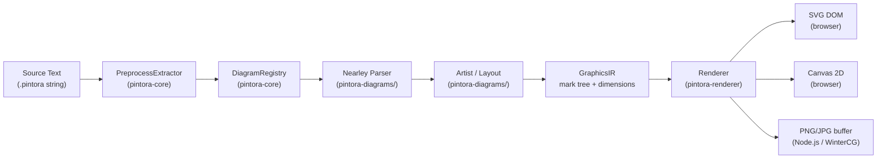
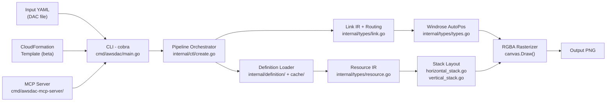
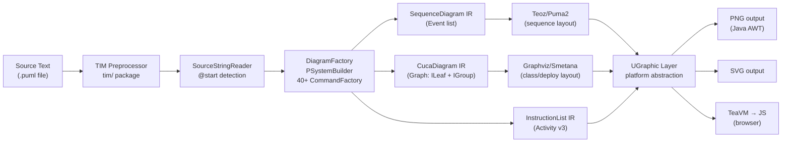
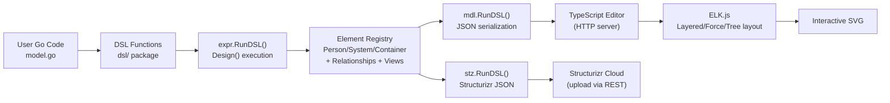

# Weekly Diagram Tooling Scan — 2026-05-28

## Executive Summary

- **Hai repo trong 7 ngày qua** (`plantuml/plantuml` v1.2026.5 và `hikerpig/pintora`) và hai repo ecosystem nổi bật (`awslabs/diagram-as-code` v0.23, `goadesign/model` v1.14) cho thấy xu hướng rõ: plugin registry architecture đang thay thế monolithic renderer, orthogonal routing tự động đang trưởng thành, và Go DSL dùng package system của ngôn ngữ như module graph — cả ba đều trực tiếp áp dụng được cho kymostudio.
- **Nearley grammar** (pintora) và **convergent orthogonal routing** (awslabs) là hai kỹ thuật có evidence code rõ nhất tuần này — cả hai đáng prototype ngay.
- **PlantUML** vẫn là reference benchmark cho multi-diagram command registry; `goadesign/model` chứng minh rằng host-language DSL (Go) cho phép versioning và sharing miễn phí bằng module system.

---

## Table of Contents

1. [hikerpig/pintora](#1-hikerpigpintora) — TypeScript, Nearley parser, extensible registry
2. [awslabs/diagram-as-code](#2-awslabsdiagram-as-code) — Go, YAML DSL, convergent orthogonal routing
3. [plantuml/plantuml](#3-plantumlplantuml) — Java, command registry, multi-diagram reference
4. [goadesign/model](#4-goadesignmodel) — Go DSL, C4 model, ELK.js integration

---

## Candidate Pool (8 repos đã evaluate)

| Repo | Stars | Updated | Kết quả |
|------|-------|---------|---------|
| plantuml/plantuml | 13k | May 27 (7d ✓) | **Selected** |
| hikerpig/pintora | 1.3k | May 27 (7d ✓) | **Selected** |
| awslabs/diagram-as-code | 1.5k | Apr 2026 | **Selected** (orthogonal routing) |
| goadesign/model | 461 | Dec 2025 | **Selected** (Go DSL pattern) |
| tt-a1i/archify | 536 | May 26 | Excluded — HTML wrapper, không có parser/layout riêng |
| kieler/elkjs | 2.6k | Mar 2026 | Excluded — library dependency, không phải diagram tool |
| codedstructure/svgdx | 15 | 2026 | Excluded — <100 stars, pre-v1.0 |
| powsybl/powsybl-diagram | 114 | Apr 2026 | Excluded — domain-specific (electrical network) |

---

## 1. hikerpig/pintora

### §1 — Quick Context

**One-line pitch:** Library text-to-diagram TypeScript mở rộng qua plugin registry — khác mermaid ở chỗ diagram type là citizen thực sự, không hardcode trong core.

- **Tech stack:** TypeScript 74%, Nearley 6.6%, JavaScript 11.6%; output SVG / Canvas / PNG
- **Repo health:** 1,283 ⭐ · 37 contributors · v0.8.2 (Feb 2026) · CI: Jest + ESLint + Turbo monorepo
- **Distribution:** npm (packages riêng: `@pintora/core`, `@pintora/diagrams`, `@pintora/cli`, `@pintora/standalone`)

---

### §2 — Architecture Deep-Dive

#### A. Component Inventory

| Module | Path | Vai trò |
|--------|------|---------|
| `Core` | `packages/pintora-core/src/index.ts` | Orchestrator: registry, parseAndDraw, configEngine |
| `Diagrams` | `packages/pintora-diagrams/src/` | 8 diagram type implementations (sequence, ER, class, activity, mindmap, Gantt, DOT, component) |
| `Renderer` | `packages/pintora-renderer/src/` | Output emitter, nhận GraphicsIR và target platform |
| `CLI` | `packages/pintora-cli/src/` | Node.js entry point, file I/O, PNG/SVG write |
| `Standalone` | `packages/pintora-standalone/src/` | Self-contained bundle cho browser script tag |
| `WinterCG Target` | `packages/pintora-target-wintercg/` | Edge runtime compatibility (Cloudflare Workers, Deno) |
| `Development Kit` | `packages/development-kit/` | Scaffolding cho diagram plugin mới |
| `Harness` | `packages/pintora-harness/` | Snapshot testing framework cho diagram output |

#### B. Pipeline / Control Flow

```
1. User gọi pintora.renderTo(code, { container, renderer: 'svg' })
2. Core: preprocessExtractor.parse(code) → extract config directives
3. Core: diagramRegistry.detectDiagram(code) → identify diagram type
4. DiagramType.parser.parse(code) → raw parse tree (Nearley grammar)
5. DiagramType.artist.draw(parseResult, config) → GraphicsIR { mark, width, height }
6. Renderer.render(graphicsIR, target) → SVG element / Canvas draw calls / PNG buffer
```

#### C. Data Model / Intermediate Representation

GraphicsIR là immutable value object:
```typescript
interface GraphicsIR {
  mark: Group;   // root mark, chứa tất cả primitive marks
  width: number;
  height: number;
}
```
Marks là union type: `Group | Rect | Line | Path | Text | Marker`. Mỗi mark có `attrs` (x, y, width, height, fill, stroke, fontFamily). Root Group áp dụng `mat3` transformation matrix cho scaling/padding. **Không có mutable layout pass** — artist tính toán toàn bộ geometry khi draw.

#### D. Input Language Design

- **Parser approach:** Nearley grammar (`.ne` files, 6.6% codebase) — parser combinator style, context-free grammar, compile ra parser JS
- **Grammar formal:** Có EBNF-equivalent trong `.ne` files, mỗi diagram type có grammar riêng trong `src/[type]/parser/[type]Diagram.ne`
- **Error reporting:** `dedupeAmbigousResults` xử lý ambiguous parse; lỗi propagate qua optional `onError` callback trong `parseAndDraw()`

#### E. Layout Algorithm

- **Approach:** Manual geometry — artist tự tính position, **không có global auto-layout**
- **Sequence diagram:** Vertical stack cursor (`model.verticalPos`, `bumpVerticalPos()`); horizontal spacing từ `calculateActorMargins()` dựa trên message text width
- **Edge routing:** Lines/paths vẽ trực tiếp giữa calculated endpoints — không có crossing minimization
- **Tradeoff:** Deterministic, fast, nhưng complex diagrams (class with many edges) phải dùng Graphviz DOT backend riêng

#### F. Rendering / Output Strategy

- **Pluggable emitter:** pintora-renderer nhận GraphicsIR và render target. Browser: SVG DOM hoặc Canvas 2D. Node.js: `@napi-rs/canvas` cho PNG/JPG
- **Animation:** Không có
- **WinterCG target:** pintora-target-wintercg compile artist + renderer cho edge runtime, WASM-compatible

#### G. Extensibility

- `diagramRegistry.register(diagramType)` — add diagram type mới với parser + artist + config schema
- `symbolRegistry` — add custom shapes (dùng trong ER diagram cho relationship notation)
- `themeRegistry` — add theme (token-based, trên `PintoraConfig`)
- `development-kit` package có CLI scaffold để tạo diagram plugin mới

#### H. Dev Experience

- CLI: `pintora render -i input.pintora -o output.svg` — clean interface
- Harness package: snapshot testing cho visual regression
- Browser preview: pintorajs.vercel.app live editor
- Không có VS Code extension hay LSP được evidenced

---

### §3 — Architecture Diagram



---

### §4 — Verdict

**Đáng học cho kymostudio:**
- **Nearley grammar** là approach sạch nhất cho diagram DSL có syntax phức tạp hơn regex handle được — kymo nên xem `.ne` files trong `pintora-diagrams/src/sequence/` như template
- **Registry pattern** (diagramRegistry + symbolRegistry + themeRegistry) cho phép extend mà không sửa core — kymo nên copy pattern này cho diagram type extensibility
- **GraphicsIR mark tree** — cách tách layout geometry khỏi rendering target rất clean, áp dụng trực tiếp

**Red flags:** Artist tự layout thủ công → class diagrams/complex graph types khó handle. Nearley grammar có compilation step phức tạp trong monorepo setup.

**Open questions:** Pintora có plan dùng auto-layout (ELK/dagre) cho complex graph types không?

**Verdict: study deeper** — đặc biệt grammar files và registry pattern.

---

## 2. awslabs/diagram-as-code

### §1 — Quick Context

**One-line pitch:** CLI Go tạo AWS architecture diagram từ YAML — khác diagrams-python ở chỗ có orthogonal routing tự động với windrose 16-direction auto-positioning.

- **Tech stack:** Go 99.5%; output PNG (RGBA rasterization); CloudFormation YAML → DAC YAML conversion (beta)
- **Repo health:** 1,500 ⭐ · ~319 commits · v0.23 (Apr 8, 2026) · CI: GitHub Actions với integration tests
- **Distribution:** Binary release + Docker image + Go library + MCP Server

---

### §2 — Architecture Deep-Dive

#### A. Component Inventory

| Module | Path | Vai trò |
|--------|------|---------|
| `CLI` | `cmd/awsdac/main.go` | Cobra CLI, flag parsing, route to handlers |
| `MCP Server` | `cmd/awsdac-mcp-server/` | AI assistant integration endpoint |
| `Control` | `internal/ctl/create.go` | Pipeline orchestrator, 5-stage flow |
| `DAC File Handler` | `internal/ctl/dacfile.go` | YAML parse, DefinitionFiles/Resources/Links loading |
| `CFN Handler` | `internal/ctl/cfntemplate.go` | CloudFormation template → DAC YAML conversion (beta) |
| `Types/Resource` | `internal/types/resource.go` | Resource struct, Draw() rasterization |
| `Types/Link` | `internal/types/link.go` | Link struct, convergent orthogonal routing algorithm |
| `Types/Stacks` | `internal/types/horizontal_stack.go`, `vertical_stack.go` | Layout containers |
| `Types/Windrose` | `internal/types/types.go` | 16-direction enum + calcPosition() |
| `Definition` | `internal/definition/` | AWS resource definition files (icon, bounds, children) |
| `Vector` | `internal/vector/` | Vector math primitives |
| `Font` | `internal/font/` | Font embedding và text measurement |
| `Cache` | `internal/cache/` | Definition file caching (URL + local) |

#### B. Pipeline / Control Flow

```
1. User chạy: awsdac alb-asg.yaml -o diagram.png
2. CLI (cobra): validate input exists, set log level
3. ctl.CreateDiagram(): đọc YAML → loadDefinitionFiles() → fetch icon/bounds từ cache
4. loadResources(): instantiate Resource/VerticalStack/HorizontalStack objects
5. associateChildren(): build hierarchy (parent → children → borderChildren → spanOverlays)
6. loadLinks(): create Link objects với styling (color, arrowhead, labels)
7. canvas.Scale() + canvas.ZeroAdjust(): calculate bounds, normalize coordinates
8. link.ResolveAutoPositions(): windrose auto-select endpoints (least congested direction)
9. canvas.Draw(): rasterize resources to RGBA image buffer
10. resource.DrawOverlay(): render SpanResources phủ lên nhiều parents
11. png.Encode() → ghi file output.png
```

#### C. Data Model / Intermediate Representation

IR là mutable Go struct map:
```go
resources map[string]*types.Resource
links     []*types.Link
```
`Resource` có `children []Resource`, `borderChildren []Resource`, `spanOverlays []Resource` — hierarchy tree. `Link` có `Source/Target *Resource`, `Windrose` endpoints, `Type` (straight/orthogonal), styling fields. IR **mutable** giữa các pass (associateChildren rồi mới loadLinks rồi mới Scale).

#### D. Input Language Design

- **Parser approach:** YAML (Go `encoding/yaml` với strict validation). Không có grammar formal — schema được enforce bởi Go struct tags
- **Template layer:** Optional Go `text/template` preprocessing nếu dùng flag `-t` (cho dynamic diagram generation)
- **YAML schema** (từ dacfile.go):
  ```yaml
  DefinitionFiles:
    - Type: URL | LocalFile
      Url: "https://..."
  Resources:
    WebTier:
      Type: AWS::ElasticLoadBalancing::LoadBalancer
      Children: [AppTier]
      Direction: vertical
  Links:
    - Source: WebTier
      SourcePosition: E
      Target: AppTier
      TargetPosition: W
      Label: "HTTPS"
  ```
- **Error reporting:** checkUnusedResources() warn về orphan resources; YAML decode strict mode báo unknown fields

#### E. Layout Algorithm

- **Approach:** Không có global force-directed / hierarchical layout. User kiểm soát layout qua HorizontalStack / VerticalStack grouping.
- **Auto-positioning:** `ResolveAutoPositions()` sau khi resources đã positioned — chọn windrose direction ít links nhất cho mỗi endpoint
- **Edge routing — Convergent Orthogonal Algorithm:**
  1. Source và target "converge" từng bước xen kẽ theo X rồi Y
  2. LCA (Lowest Common Ancestor) trong resource hierarchy xác định midpoint region
  3. Penetration detection: nếu path đi ngược chiều intended → "detour" perpendicular ≥52px
  4. Control points alternating X/Y axes, generate polyline path
  5. Link grouping offset: N links cùng pair → distribute perpendicular (spacing N×δ)
  6. Label auto-placement trên longest horizontal segment; acute angle detection cho AutoRight/AutoLeft

#### F. Rendering / Output Strategy

- **Backend:** Direct RGBA pixel rasterization qua Go image library — không dùng SVG intermediate
- **Resource rendering:** Load PNG icon từ definition files, composite vào RGBA buffer
- **Text:** Font embedding (`internal/font/`) để render labels
- **Link rendering:** Draw polyline segments trên RGBA buffer
- **Resize:** CatmullRom interpolation nếu `--width`/`--height` specified
- **Animation:** Không có
- **Output format:** PNG only (JPEG/SVG không được support)

#### G. Extensibility

- **Custom definitions:** `--override-def-file` flag để dùng definition file ngoài AWS
- **Definition schema:** YAML file mô tả resource type, icon URL, default bounds, allowed children
- **Plugin system:** Không có formal plugin API; extensibility qua definition files
- **Theme:** Styling qua YAML fields (lineColor, arrowHead type) — không có theme system

#### H. Dev Experience

- CLI flags rõ ràng (cobra), có `--verbose` logging
- MCP Server: AI assistant có thể generate DAC YAML và invoke awsdac
- Không có watch mode hay IDE integration được evidenced
- Integration tests trong `test/` directory

---

### §3 — Architecture Diagram



---

### §4 — Verdict

**Đáng học cho kymostudio:**
- **Convergent orthogonal routing** với LCA-based midpoints là approach thực dụng hơn full grid-based routing (ít memory hơn, không cần visibility graph). Kymo nên prototype thuật toán này cho edge routing.
- **Windrose 16-direction system** (calcPosition mapping direction enum → coordinate) là clean abstraction cho connection point management.
- **Link grouping offset** (N links cùng pair → distribute perpendicular) giải quyết edge bundling đơn giản và hiệu quả.
- **SpanResources** (overlay across multiple parents) — concept hay cho kymo khi cần annotate một region phủ nhiều nodes.

**Red flags:** PNG-only output không có SVG intermediate — không thể add interactivity hay animation. Global auto-layout hoàn toàn không có; user phải hand-arrange groups.

**Open questions:** Convergent algorithm có handle crossing minimization không? Performance trên diagrams >50 nodes?

**Verdict: study deeper** — đặc biệt `internal/types/link.go` routing algorithm.

---

## 3. plantuml/plantuml

### §1 — Quick Context

**One-line pitch:** Java tool sinh diagram từ text với 40+ diagram types — khác mermaid ở chỗ có TIM macro preprocessor và command registry cho phép mở rộng syntax mà không viết lại parser core.

- **Tech stack:** Java 99.4%; output PNG, SVG, PDF, LaTeX, ASCII art; GraphViz/Smetana cho class/deployment layout; Teoz/Puma2 cho sequence
- **Repo health:** 13,046 ⭐ · 2,925 commits · v1.2026.5 (May 27, 2026) · CI: GitHub Actions + SonarQube + JaCoCo coverage
- **Distribution:** JAR (standalone), Maven, npm wrapper, Docker

---

### §2 — Architecture Deep-Dive

#### A. Component Inventory

| Module | Path | Vai trò |
|--------|------|---------|
| `CLI Entry` | `src/net/sourceforge/plantuml/Run.java` | CLI + streaming pipe mode |
| `TIM Preprocessor` | `src/net/sourceforge/plantuml/tim/` | Macro language: variables, functions, conditionals, includes |
| `Source Reader` | `SourceStringReader` | @start/@end block detection, route to factory |
| `Command Registry` | `PSystemBuilder` | 40+ CommandFactory subclasses, regex-based dispatch |
| `Sequence Model` | `src/.../sequencediagram/` | SequenceDiagram model + Teoz/Puma2 layout |
| `Class/Deployment` | `src/.../cucadiagram/` | CucaDiagram model, Graphviz/Smetana integration |
| `Activity v3` | `src/.../activitydiagram3/` | Activity diagram với Instruction layer IR |
| `UGraphic Layer` | `src/.../ugraph/` | Platform-agnostic graphics abstraction |
| `PNG Renderer` | `src/.../png/` | Color quantization, metadata embedding |
| `SVG Renderer` | `src/.../svg/` | SVG element generation |
| `TeaVM Build` | `src/.../teoz/` | Browser JavaScript compilation target |

#### B. Pipeline / Control Flow

```
1. User chạy: java -jar plantuml.jar diagram.puml
2. Run.main(): parse CLI args, detect multiple files/directories
3. SourceStringReader: scan input, detect @startuml/@startjson/@startgantt etc.
4. TIM preprocessor: resolve !include, !define, !function, conditionals
5. DiagramFactory: route to type-specific factory (SequenceDiagramFactory, etc.)
6. Command Registry: PSystemBuilder iterates lines, match regex → execute Command
7. Diagram model built: participant/message/style objects populated
8. Layout engine: Teoz (sequence) hoặc Graphviz/Smetana (class, deployment)
9. UGraphic.draw(): platform-agnostic drawing calls
10. Format writer (PngIO / SvgGraphic): serialize to output file
```

#### C. Data Model / Intermediate Representation

IR là mutable Java object model per diagram type:
- **Sequence:** `SequenceDiagram` với `Participant` list và `Event` list (message, note, divider)
- **Class/Deployment:** `CucaDiagram` với `ILeaf` (node) và `IGroup` (cluster) — graph IR
- **Activity v3:** `InstructionList` — instruction layer giống bytecode
- **Chuyển đổi:** Factory tạo diagram-specific IR, không có shared "universal IR"

#### D. Input Language Design

- **Parser approach:** Regex line-based qua Command pattern — `PSystemBuilder` duy trì list 40+ `PSystemCommandFactory`, mỗi factory register một hoặc nhiều `Command<T>` với regex. Mỗi line được match tuần tự.
- **Grammar formal:** Không có BNF/EBNF public; grammar "implicit" trong regex patterns của từng Command class
- **TIM macro system:** Full Turing-complete preprocessing với functions, recursion, loops — chạy trước regex parsing
- **Error reporting:** Command không match → `UnsupportedCommand` với line number

#### E. Layout Algorithm

- **Sequence diagrams:** Teoz (mới) hoặc Puma2 — proprietary layout với strict vertical ordering, activation boxes, horizontal spacing
- **Class/Component/Deployment:** Tích hợp Graphviz (external binary) hoặc Smetana (pure Java Graphviz port) — dot algorithm (hierarchical/Sugiyama)
- **Activity v3:** Custom swimlane layout
- **Edge routing:** Straight lines với orthogonal detours cho class diagrams (Graphviz-managed)

#### F. Rendering / Output Strategy

- **UGraphic abstraction:** Core graphics layer — caller không biết backend, chỉ gọi drawLine/drawRect/drawText
- **Backends:** PNG (Java AWT image), SVG (custom XML builder), LaTeX/TikZ, ASCII art, PDF (via iText)
- **TeaVM:** Compile Java → JavaScript để chạy trong browser — full engine compilation
- **Animation:** Không có

#### G. Extensibility

- Thêm diagram type: implement PSystemCommandFactory + Command classes, register trong PSystemBuilder
- Stdlib included: JSON, YAML, Gantt, MindMap, Network diagrams đều implement theo pattern này
- Theme/styling: skinparam system (flat config injection)
- Không có external plugin API

#### H. Dev Experience

- Comprehensive CLI với `-tsvg`, `-tpng`, `-Tpdf` flags, `-pipe` mode cho stdin/stdout
- VS Code: PlantUML extension (không phải official)
- Watch mode: Không có native; third-party tools
- Online editor: plantuml.com/plantuml/

---

### §3 — Architecture Diagram



---

### §4 — Verdict

**Đáng học cho kymostudio:**
- **TIM macro preprocessor** trước parsing — pattern cực hay cho kymo nếu muốn support `!include`, variables trong DSL mà không làm phức tạp grammar
- **Command Registry pattern** (PSystemBuilder + CommandFactory) cho phép add syntax mới hoàn toàn độc lập — kymo có thể áp dụng cho "diagram extensions" mà người dùng define
- **UGraphic abstraction** separates drawing calls từ output format — clean interface có thể copy cho kymo renderer

**Red flags:** Regex line-based parsing không handle multi-line constructs tốt; không có formal grammar; 40+ factory classes → testing rất heavy. TIM là full macro language — có thể exploit vector (template injection qua `!include`).

**Open questions:** Plantuml có plan migrate parser từ regex → grammar-based không? TeaVM browser build có được maintain tốt không?

**Verdict: glance only** — patterns hay nhưng codebase quá lớn và legacy để study sâu; học pattern level, không đọc code level.

---

## 4. goadesign/model

### §1 — Quick Context

**One-line pitch:** Go DSL cho C4 architecture diagram — khác Structurizr DSL ở chỗ dùng Go packages làm module system, cho phép version và share model components như library thông thường.

- **Tech stack:** Go 70.4% + TypeScript 26.5%; output SVG (interactive editor), JSON, Structurizr workspace JSON
- **Repo health:** 461 ⭐ · v1.14.1 (Dec 2025) · MIT license · CI: golangci-lint
- **Distribution:** `go get goa.design/model` — binary + library; web editor served via `mdl` command

---

### §2 — Architecture Deep-Dive

#### A. Component Inventory

| Module | Path | Vai trò |
|--------|------|---------|
| `DSL` | `dsl/` | Go functions: Design(), SoftwareSystem(), Container(), Views() etc. |
| `Expression Eval` | `expr/` | RunDSL() — executes user's Go DSL, produces data structures |
| `Model` | `mdl/` | RunDSL + HTTP server serving interactive SVG editor |
| `Structurizr` | `stz/` | RunDSL → Structurizr JSON, client lib cho Structurizr cloud API |
| `Code Gen` | `codegen/` | Generate Goa plugin code từ model |
| `CLI mdl` | `cmd/mdl/` | `mdl serve` — launch editor, `mdl gen` — generate outputs |
| `CLI stz` | `cmd/stz/` | Upload design to Structurizr cloud |
| `Plugin` | `plugin/` | Goa API design plugin integration |

#### B. Pipeline / Control Flow

```
1. User viết model.go trong Go package, import "goa.design/model/dsl"
2. User chạy: go generate (hoặc mdl serve)
3. expr.RunDSL(): execute Design() function → populate in-memory element registry
4. Element registry: Person, SoftwareSystem, Container, Component structs + Views
5. mdl.RunDSL(): serialize views → JSON { elements, relationships, positions }
6. HTTP server (mdl): serve TypeScript editor, editor load JSON, render interactive SVG
7. Editor: user drag-drop → Coord() updates, Routing() choices
8. ELK.js (in editor): AutoLayout() → compute element positions via layered/force algorithm
9. stz.RunDSL(): serialize → Structurizr workspace JSON → upload via REST API
```

#### C. Data Model / Intermediate Representation

IR là Go struct hierarchy:
```go
type Person struct {
    ID           string
    Name         string
    Description  string
    Tags         []string
    Properties   map[string]string
    Relationships []*Relationship
    Location     LocationKind // Internal | External
}
// SoftwareSystem embeds Person's fields + Containers []*Container
// Container adds Technology string + Components []*Component
// Component adds Technology string (leaf node)
```
IR **mutable** trong design execution phase, sau đó frozen khi serialize sang JSON. Relationships là first-class objects với source/dest references.

#### D. Input Language Design

- **Parser approach:** Không có parser — DSL là **Go code thuần túy**. User gọi functions `SoftwareSystem("name", "desc", func() { Container(...) })`. `parseElementArgs` helper xử lý variadic argument patterns.
- **Grammar formal:** Không có EBNF; "grammar" là Go type system + function signatures
- **Advantage:** Versioning miễn phí qua Go modules; IDE support miễn phí (GoDoc, autocomplete); share components qua `import`
- **Error reporting:** Go compile-time errors cho syntax; runtime panics từ DSL validation (element chưa exist, v.v.)

#### E. Layout Algorithm

- **In editor:** ELK.js với algorithms: Layered (Sugiyama), Force, Tree, Radial — user chọn per-view
- **In DSL:** `AutoLayout(RankTopBottom)` / `AutoLayout(RankLeftRight)` hint cho editor; explicit `Coord(x, y)` override
- **Edge routing:** DSL function `Routing(direct | orthogonal | curved)` — set per-view, executed trong ELK.js
- **Crossing minimization:** ELK Layered algorithm có Sugiyama-based barycentric heuristic

#### F. Rendering / Output Strategy

- **Interactive SVG editor:** TypeScript frontend render interactive SVG, ELK.js layout, drag-drop positioning
- **Static SVG:** Export từ editor sau khi positioned
- **Structurizr JSON:** Portable format cho Structurizr cloud renderer
- **Animation:** Không có; Dynamic View type mô tả flow sequence nhưng không animate

#### G. Extensibility

- Go package system = plugin system: user import custom functions, override design decisions
- Style qua `Tag`-based CSS-like styling trong `Add()` calls
- Goa plugin: sync architecture model với Goa API design (bidirectional)

#### H. Dev Experience

- `mdl serve`: live editor với hot-reload khi edit model.go và re-run
- Go tooling: `gopls` autocomplete, compile-time validation
- Không có VS Code extension riêng (dùng standard Go extension)
- Structurizr upload: CI-friendly via `stz push`

---

### §3 — Architecture Diagram



---

### §4 — Verdict

**Đáng học cho kymostudio:**
- **Host-language DSL pattern** (Go code là DSL) — kymo có thể offer TypeScript DSL hoặc Python DSL tương tự: user import, type-safe, zero parse step. Cực hay nếu kymo target developer audience
- **`parseElementArgs` variadic pattern** — cho phép flexible syntax (`System("name")` vs `System("name", "desc")` vs `System("name", func(){...})`) mà không cần overloads. Áp dụng được vào kymo's API design
- **ELK.js integration** là template tốt cho kymo tích hợp layout engine — cách giao tiếp ELK algorithm selection per-view đáng copy
- **View/Model separation** — model là immutable truth, views là projections với layout hints. Pattern sạch.

**Red flags:** Go-only DSL → không accessible cho non-Go users. Dec 2025 release → development pace chậm. Structurizr dependency tạo lock-in risk.

**Open questions:** Có plan support DSL bằng text file (không chỉ Go code) không? ELK.js version nào đang dùng?

**Verdict: study deeper** — đặc biệt `parseElementArgs` pattern và ELK.js integration code.

---

*Generated by kymostudio weekly research scout · 2026-05-28*
