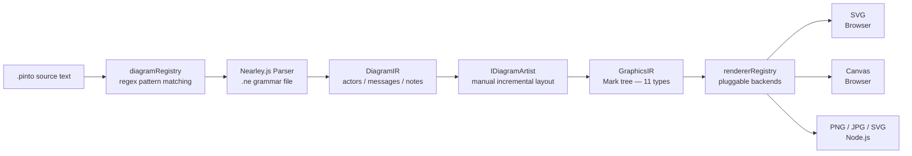
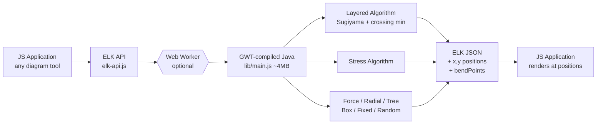
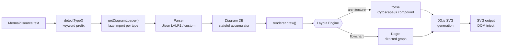
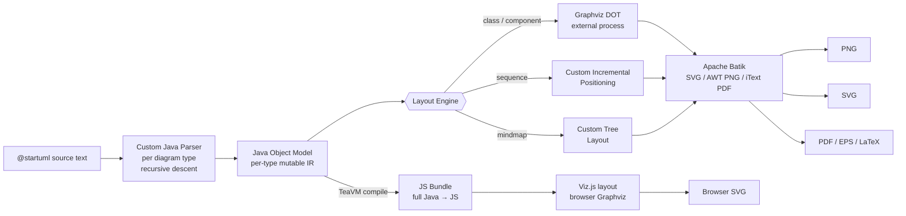

# Weekly Diagram Tooling Scan — 2026-05-29

## Executive Summary

- **Pintora** (`hikerpig/pintora`) nổi bật nhất tuần này: plugin system chuẩn nhất trong domain, two-level IR (DiagramIR → GraphicsIR marks), Nearley.js grammar — ba pattern đều áp dụng được trực tiếp cho kymostudio.
- **ELK.js** (`kieler/elkjs`) là layout engine duy nhất trong scan có Sugiyama layered + crossing minimization sẵn, compiled từ Java qua GWT — không nên re-implement, nên integrate as dependency nếu kymo cần auto-layout.
- **Mermaid v11.15.0** vừa thêm Event Modeling và Wardley Maps trong 4 tuần qua; architecture diagram dùng fcose (Cytoscape.js) + D3.js cho compound layout + SVG — lazy loading per diagram type là pattern đáng học nhất.
- **PlantUML v1.2026.5** vừa nâng cấp TeaVM 0.14.1 (Java→JS compiler), expand `%load_json` API; monolith Java nhưng TeaVM compilation story thú vị nếu kymo cần port JVM code sang browser.

## Table of Contents

1. [hikerpig/pintora](#1-hikerpigpintora)
2. [kieler/elkjs](#2-kielerelkjs)
3. [mermaid-js/mermaid v11.15.0](#3-mermaid-jsmermaid-v11150)
4. [plantuml/plantuml v1.2026.5](#4-plantumlplantuml-v120265)

---

## 1. hikerpig/pintora

### §1 — Quick Context

**One-line pitch:** Thư viện text-to-diagrams TypeScript mở rộng được bằng plugin system chuẩn — developer viết diagram type riêng và distribute như npm package, khác Mermaid ở chỗ extensibility là first-class citizen chứ không phải afterthought.

- **Tech stack:** TypeScript 6.0, Nearley.js (parser generator), esbuild/SWC (build), pnpm monorepo, Turbo 2.0
- **Output formats:** SVG, Canvas (browser); PNG, JPG, SVG (Node.js)
- **Repo health:** ★1,283 · 37 forks · last push 2026-05-28 · CI có (Jest 30 + Codecov) · pnpm 9 workspace
- **Distribution:** npm (`@pintora/standalone`, `@pintora/core`, `@pintora/diagrams`, `@pintora/cli`) · VSCode extension · Obsidian plugin · Gatsby plugin

### §2 — Architecture Deep-Dive

#### A. Component Inventory

- `@pintora/core` (`packages/pintora-core/src/`) — type definitions, `diagramRegistry`, `rendererRegistry`, `themeRegistry`, `symbolRegistry`, event system, `configApi`
- `@pintora/diagrams` (`packages/pintora-diagrams/src/`) — 8 built-in diagram implementations, mỗi type có thư mục con riêng (`sequence/`, `er/`, `component/`, `activity/`, `mindmap/`, `gantt/`, `dot/`, `class/`)
- `@pintora/renderer` (`packages/pintora-renderer/src/`) — SVG và Canvas renderer backends, đăng ký vào `rendererRegistry`
- `@pintora/standalone` (`packages/pintora-standalone/src/`) — browser/Node.js entry point, `initBrowser()` + `renderTo()` + `renderContentOf()`
- `@pintora/cli` (`packages/pintora-cli/src/`) — CLI wrapper, `renderInCurrentProcess` / `renderInSubprocess`
- `diagramRegistry` (trong `@pintora/core`) — global registry, detect + dispatch per diagram type
- `IDiagramArtist` interface (trong `@pintora/core`) — contract để diagram type implement layout + IR transform

#### B. Pipeline / Control Flow

1. User chạy `pintora render diagram.pinto` hoặc gọi `pintoraStandalone.renderTo(code, opts)`
2. `diagramRegistry` test từng `pattern` regex (e.g., `/^\s*sequenceDiagram/`) trên input text để detect diagram type
3. Nearley.js parser (`.ne` grammar file, một file per diagram type) parse text → **DiagramIR** (e.g., `SequenceDiagramIR`: actors, messages, notes, participantBoxes, actorOrder)
4. `IDiagramArtist.draw(diagramIR)` tính toán layout thủ công (incremental positioning) → **GraphicsIR** (tree of marks)
5. `rendererRegistry` chọn backend đúng (SVG/Canvas theo `opts.renderer`), renderer nhận `GraphicsIR`, duyệt mark tree và emit output
6. Browser: SVG inject vào DOM; Node.js: `renderToImage()` hoặc `renderToSvg()` ghi file ra disk

#### C. Data Model / Intermediate Representation

Pintora dùng **two-level IR**:

- **DiagramIR** (domain-specific): mutable, accumulated bởi `SequenceDB` qua `apply(action)` method. `getDiagramIR()` snapshot ra object cuối cùng. VD: `{ messages[], actors{}, actorOrder[], participantBoxes{}, notes[], title }`
- **GraphicsIR** (graphics): immutable tree của 11 Mark types — `Group`, `Rect`, `Circle`, `Ellipse`, `Text`, `Line`, `PolyLine`, `Polygon`, `Marker`, `Path`, `GSymbol`. Mỗi mark có `attrs` (styles), `matrix` (transform), `transformPolicies` (stretch/fixed/scale per axis), `itemId`

Không có "compile to lower IR" concept — pipeline dừng ở GraphicsIR trước khi đến renderer.

#### D. Input Language Design

- **Parser approach:** Nearley.js (parser combinator/generator, `.ne` files, EBNF-like syntax). Mỗi diagram type có grammar file riêng.
- **Grammar style:** Keyword-based entry point (e.g., `"sequenceDiagram" document`), EBNF rules cho từng statement type. VD sequence grammar định nghĩa `signal -> actor signaltype actor textWithColon`, `loop -> ("loop"|"opt"|"par"|"alt") %WS words %NL document "end"`
- **Formal grammar:** Có — `.ne` files là formal specification readable (Nearley EBNF format)
- **Error reporting:** Không xác định từ code đọc được; Nearley default error messages

#### E. Layout Algorithm

- **Sequence diagram:** Manual incremental positioning — không dùng auto-layout library
  - Horizontal: `nextActorX` tăng dần theo actor width + margin
  - Vertical: `verticalPos` + `bumpVerticalPos(bump)` increment downward
  - Nested structures (loop/alt/opt/par): stack-based approach, push khi group start, pop khi end, mỗi group track `minWidth`
  - Crossing minimization: **không có**
- **Edge routing:** Straight lines cho messages; không có orthogonal routing
- **Các diagram type khác:** Không xác định từ data thu thập được

#### F. Rendering / Output Strategy

- **Backends:** SVG (browser), Canvas (browser), PNG/JPG/SVG (Node.js qua subprocess)
- **Pattern:** Pluggable emitter — `rendererRegistry` cho phép đăng ký renderer backend mới
- **Animation:** Không có — Mark types không có time-based fields
- **SVG generation:** Renderer duyệt mark tree và tạo SVG elements tương ứng từng mark type

#### G. Extensibility

Plugin system via `IDiagram` interface với 6 fields: `pattern` (RegExp), `parser` (`IDiagramParser`), `artist` (`IDiagramArtist`), `eventRecognizer` (optional), `configKey` (optional), `clear()`. Register qua `diagramRegistry.registerDiagram(name, diagram)`. Distribute như npm package — đây là differentiator lớn nhất so với Mermaid.

Additional extensibility: `themeRegistry` (themes), `symbolRegistry` (custom shapes), `configApi` (namespaced config per diagram type).

#### H. Dev Experience

- VSCode extension (`pintora-vscode`)
- Web preview tại demo site
- CLI với subprocess isolation
- Watch mode qua Turbo (`turbo watch`)
- Browser: `initBrowser()` auto-discovers `.pintora` CSS class elements

### §3 — Architecture Diagram



### §4 — Verdict

**Áp dụng cho kymostudio:**
- `IDiagram` plugin interface là blueprint cho kymo nếu muốn support nhiều diagram format — 6-field contract (pattern, parser, artist, config, eventRecognizer, clear) cực kỳ clean.
- Nearley.js grammar (`.ne` files) rõ ràng hơn regex-based parsing và dễ maintain — xem xét dùng cho bất kỳ DSL nào kymo định build.
- Two-level IR (DiagramIR → GraphicsIR) giữ diagram semantics tách biệt với rendering — pattern này nên là default cho kymo.

**Red flags:** Layout hoàn toàn manual per diagram type → code mỗi diagram tự invent positioning logic, khó tái dùng, không hưởng lợi từ research-grade auto-layout.

**Open questions:** Tại sao không dùng ELK/dagre cho ER/class diagrams? Nearley.js performance vs Chevrotain/Ohm cho grammar lớn?

**Verdict: study deeper** — plugin architecture + two-level IR + Nearley grammar đều directly relevant.

---

## 2. kieler/elkjs

### §1 — Quick Context

**One-line pitch:** Layout engine research-grade (Sugiyama layered, crossing minimization, orthogonal routing) compiled từ Java sang JS qua GWT — không phải diagram library mà là positioning service, cung cấp x/y coordinates cho upstream tool.

- **Tech stack:** Java (nguồn) → GWT (Java-to-JS compiler) → JavaScript bundle; JSON in/out; EPL-2.0
- **Output formats:** JSON graph augmented với computed positions (không phải SVG/PNG)
- **Repo health:** ★2,591 · 117 forks · v0.12.0 · last pushed 2026-05-25 · CI có (Mocha tests)
- **Distribution:** npm (`elkjs`) · CDN (unpkg) · TypeScript definitions có

### §2 — Architecture Deep-Dive

#### A. Component Inventory

- `src/elk-api.js` — JS API wrapper, `ELK` class, Web Worker management, promise-based interface
- `lib/main.js` — GWT-compiled output (Java → JS, ~4MB monolith, non-readable)
- `lib/elk-worker.js` — Web Worker variant của compiled output
- `lib/main.d.ts` — TypeScript type definitions
- `build` scripts — Gradle (compile Java) → Babel (transpile API) → Browserify (bundle)

#### B. Pipeline / Control Flow

1. User tạo `const elk = new ELK({ workerUrl: './elk-worker.min.js' })` (optional Web Worker)
2. Chuẩn bị **ELK JSON graph**: `{ id, layoutOptions: {'elk.algorithm': 'layered'}, children: [{id, width, height}], edges: [{id, sources, targets}] }`
3. Gọi `elk.layout(graph)` — trả về `Promise<ElkNode>` (async)
4. Nếu dùng Web Worker: message được `postMessage()` sang worker thread để tránh block UI thread
5. GWT-compiled Java code thực thi thuật toán layout đã chọn (layered/stress/force/etc.)
6. Kết quả: cùng JSON graph structure nhưng mỗi node có thêm `x, y` fields; edges có `bendPoints[]` cho routing

#### C. Data Model / Intermediate Representation

Duy nhất 1 format: **ELK JSON**. Input và output là cùng schema — output = input + thêm position data:

```json
{ "id": "n1", "width": 30, "height": 30, "x": 12, "y": 45 }
```

Hierarchical (nested `children`), port-aware (edges connect từ port đến port). Stateless per call — không có mutable state giữa các `layout()` calls. Không có "lower IR" compile step.

#### D. Input Language Design

ELK không có DSL — input là **JSON object** trực tiếp. Layout options dùng string keys: shortform (`algorithm`, `spacing.nodeNode`) hoặc full form (`org.eclipse.elk.algorithm`). Không có formal grammar file.

#### E. Layout Algorithm

- **Layered (flagship):** Sugiyama et al. algorithm — hierarchical, layer assignment, crossing minimization (barycentric method), orthogonal edge routing
- **Stress:** force-based, tối ưu pairwise distances
- **Radial:** circular/radial layout
- **Force, Disco:** physics simulation
- **MrTree:** tree layouts với hierarchical structure
- **Box, Fixed, Random:** simple positioners
- **Crossing minimization:** Có — barycentric method trong layered algorithm
- **Edge routing:** Orthogonal (layered), polyline, spline

#### F. Rendering / Output Strategy

ELK **không render** — chỉ tính positions. Output JSON được consume bởi upstream tool (Sprotty, Eclipse Theia, Mermaid, etc.) để tự render. Không có SVG output, không có animation.

#### G. Extensibility

Layout options configurable per node/edge/graph qua `layoutOptions`. Custom layout algorithms phải implement trong Java ELK core (không phải JS side) — barrier cao. Không có JS-side plugin system.

#### H. Dev Experience

- API surface nhỏ và rõ ràng: `layout()`, `knownLayoutOptions()`, `knownLayoutAlgorithms()`, `terminateWorker()`
- Web Worker support built-in — quan trọng cho non-blocking UX với large graphs
- TypeScript definitions đầy đủ
- Không có CLI, không có IDE integration (pure library)

### §3 — Architecture Diagram



### §4 — Verdict

**Áp dụng cho kymostudio:**
- API shape cực đơn giản (`layout(graph) → Promise`) là pattern kymo nên học cho bất kỳ layout engine nào — separation rõ: positioning service ≠ rendering.
- Sugiyama layered algorithm có sẵn và ổn định — nếu kymo cần hierarchical layout cho flowchart/class diagrams, integrate ELK thay vì tự implement crossing minimization.
- Web Worker pattern là must-have cho heavy layout computation — bất kỳ auto-layout nào trong kymo cũng nên offload sang worker.

**Red flags:** GWT compilation → JS monolith ~4MB không readable → debug layout bugs cực khó; thêm custom algorithm phải biết Java ELK core.

**Open questions:** WASM compilation (thay GWT) có khả thi không cho ELK core? ELK vs fcose (Cytoscape) performance/quality cho compound graphs?

**Verdict: glance only** để integrate — dùng như dependency cho auto-layout, study API design; không cần đọc GWT output.

---

## 3. mermaid-js/mermaid v11.15.0

### §1 — Quick Context

**One-line pitch:** Library diagram-as-code phổ biến nhất vừa release Event Modeling diagram type + Wardley Maps trong 4 tuần (v11.14-15), đặc biệt architecture diagram dùng compound force-directed layout (fcose) + D3.js SVG — khác tools khác ở lazy-loading per diagram type.

- **Tech stack:** TypeScript, Jison (LALR(1) parser), D3.js (SVG render), Cytoscape.js + fcose (architecture layout), Dagre (flowchart layout)
- **Output formats:** SVG (primary, DOM inject); PNG via CLI
- **Repo health:** ★~70k · large OSS community · v11.15.0 (2026-05-11) · CI/CD · active releases
- **Distribution:** npm (`mermaid`) · CDN · Mermaid Live Editor · `@mermaid-js/mermaid-cli`

### §2 — Architecture Deep-Dive

#### A. Component Inventory

- `Diagram.ts` (`packages/mermaid/src/`) — core class: text → parsed diagram, lazy-loads diagram modules
- `diagrams/*/` — one directory per diagram type; mỗi type có `*Db.ts`, `*Parser.jison`, `*Renderer.ts`
- `architectureDb.ts` (`diagrams/architecture/`) — IR/database cho architecture diagram type
- `architectureRenderer.ts` (`diagrams/architecture/`) — fcose + Cytoscape.js layout, D3.js SVG generation
- `svgDraw.ts` (`diagrams/architecture/`) — low-level SVG element helpers
- `diagramAPI` — registry + lazy loader với `detectType()` + `getDiagramLoader()`

#### B. Pipeline / Control Flow

1. User embed `mermaid.render(id, code)` hoặc nhúng Mermaid code block vào HTML/Markdown
2. `detectType()` detect diagram type từ keyword prefix (e.g., `architecture-beta`)
3. `getDiagramLoader()` **lazy-import** diagram module (code splitting — không load all diagrams at start)
4. `db.clear()` reset state; `parser.parse(text)` parse text vào stateful database
5. `renderer.draw(text, svgId, version, diagramContext)` được gọi
6. Architecture diagram: Cytoscape.js instance được tạo, nodes/edges được add, **fcose** layout plugin tính positions với constraints (alignment directives → relative placement constraints via BFS)
7. D3.js render SVG elements: services, junctions, groups, edges (straight hoặc segmented)
8. SVG output inject vào DOM

#### C. Data Model / Intermediate Representation

Architecture diagram IR trong `architectureDb.ts`:
- **Services:** `{ id, type: 'service', icon, iconText, title, edges[], in }` — leaf nodes
- **Junctions:** `{ id, type: 'junction', edges[], in }` — transparent routing nodes
- **Groups:** `{ id, icon, title, in }` — containers (lồng nhau được)
- **Edges:** `{ lhsId, rhsId, lhsDir, rhsDir (L/R/T/B), lhsInto, rhsInto, lhsGroup, rhsGroup, title }`

Derived structures sau parse: adjacency list, **spatial maps** (BFS traversal → coordinate grid), **group alignments** (parallel/perpendicular/bend). Mutable trong parse phase, snapshot khi render.

#### D. Input Language Design

- **Architecture diagram:** Custom keyword-based DSL (`architecture-beta` prefix), hand-written parser
- **Flowchart / sequence / etc.:** Jison (LALR(1) parser generator, `.jison` grammar files)
- Mỗi diagram type có parser riêng, không có shared grammar framework
- **Error reporting:** Jison tạo ra basic parse error messages

#### E. Layout Algorithm

- **Architecture diagram:** **fcose** (Force-directed COmpound graphS, Cytoscape.js plugin)
  - Constraint-based: user `align row|column` directives → relative placement constraints
  - BFS traversal tạo spatial maps → group alignment detection (parallel/perpendicular/bend)
  - `randomize: false` (mặc định từ v11.14.0) cho deterministic layout
- **Flowchart:** Dagre (directed graph, Sugiyama-based)
- **Edge routing:** Straight (same-axis connections) hoặc Segmented/90-degree bends (cross-axis, tính từ endpoint directions L/R/T/B)
- **Crossing minimization:** Via Dagre (flowchart); fcose không dùng barycentric method

#### F. Rendering / Output Strategy

- **Primary backend:** SVG via D3.js — programmatic `svg.append('g')` pattern
- **Icon embedding:** `innerHTML = '<g>' + getIconSVG(...) + '</g>'` — SVG injection với wrap group
- **Text:** `dominant-baseline: middle`, `text-anchor: middle`
- **Pattern:** Mỗi diagram type có renderer riêng — không có shared GraphicsIR (khác pintora)
- **Animation:** Không có cho static SVG; Neo look styling thêm CSS drop shadows
- **CLI output:** PNG qua `@mermaid-js/mermaid-cli` (headless browser)

#### G. Extensibility

- External diagram registration có
- **Icon pack system:** `registerIconPacks([{ name, icons }])` — icons dùng `{prefix}:{iconName}` syntax
- **Theme/styling:** Config object + CSS variables + Neo look per diagram type
- **Neo look:** Drop shadows + enhanced styling được add per-diagram qua config flag

#### H. Dev Experience

- **Mermaid Live Editor** (web preview, real-time)
- VSCode extension
- **Lazy loading** diagram modules (code splitting) — giảm initial bundle size đáng kể
- CLI: `mmdc -i diagram.mmd -o diagram.svg`
- Watch mode: không built-in (dùng external file watcher)

### §3 — Architecture Diagram



### §4 — Verdict

**Áp dụng cho kymostudio:**
- **Lazy loading per diagram type** là pattern kymo bắt buộc phải áp dụng nếu support nhiều diagram formats — tránh bloat initial bundle với code của các diagram types không dùng đến.
- **fcose cho compound layout** (group-aware, nested containers) hay hơn force-directed đơn giản — nếu kymo cần nested group rendering (service trong cluster, etc.), fcose là candidate tốt hơn dagre.
- **Icon pack registration** (`name:icon` string syntax) là UX pattern clean cho icon system.

**Red flags:** Mỗi diagram type có renderer riêng → không có shared GraphicsIR → styling inconsistency giữa các diagram types; Jison LALR(1) complex hơn cần thiết, parse error messages không friendly.

**Open questions:** Event Modeling diagram DSL syntax trông như thế nào? Architecture diagram có support non-rectangular edge routing chưa?

**Verdict: glance + selective study** — học lazy loading pattern + fcose integration + icon pack system; tránh Jison pattern.

---

## 4. plantuml/plantuml v1.2026.5

### §1 — Quick Context

**One-line pitch:** Java monolith diagram-as-code với 20+ diagram types, vừa nâng cấp TeaVM 0.14.1 cho browser compilation — toàn bộ Java engine compile sang JS và chạy trực tiếp trong trình duyệt không cần server, khác mọi tool khác ở chỗ không có JS rewrite.

- **Tech stack:** Java (core), TeaVM (Java→JS ahead-of-time compiler), Graphviz/DOT (class/component layout), Gradle/Ant build
- **Output formats:** PNG, SVG, EPS, PDF, LaTeX, ASCII art
- **Repo health:** ★13,047 · 1,194 forks · v1.2026.5 (2026-05-27) · 1 maintainer chính · CI có
- **Distribution:** JAR standalone, Docker, Maven Central, npm wrapper, web server (plantuml.com)

### §2 — Architecture Deep-Dive

#### A. Component Inventory

- `src/net/sourceforge/plantuml/` — main Java package, chia nhỏ theo diagram type
- `sequencediagram/` — custom sequence diagram engine (không dùng Graphviz)
- `classdiagram/` — class diagram engine, dùng Graphviz DOT layout
- `mindmap/` — custom tree layout engine
- Graphviz/Dot integration — external process call cho layout
- Apache Batik — SVG rendering library
- TeaVM compilation pipeline — toàn bộ Java source → JS bundle cho browser

#### B. Pipeline / Control Flow

1. User viết text trong `@startuml ... @enduml` block
2. `SourceStringReader` (Java class) nhận text, detect diagram type từ opening keyword (`@startuml`, `@startjson`, etc.)
3. Diagram-specific parser (hand-written Java, recursive descent) accumulate statements vào Java object model
4. Layout phase: với class/component — call Graphviz DOT external process; với sequence — custom incremental positioning; với mindmap — custom tree layout
5. Rendering qua Apache Batik (SVG) hoặc AWT (PNG), iText (PDF)
6. **Browser path:** TeaVM compiles toàn bộ Java codebase → JS bundle, run in browser, không cần Graphviz (dùng Viz.js thay thế)

#### C. Data Model / Intermediate Representation

Java object model per diagram type — không có shared IR:
- Sequence: Java objects cho participants, messages, notes, groupings (mutable, incremental)
- Class: Java objects cho classes, interfaces, relationships
- Mỗi diagram type tự define model của mình; không có unified IR cross-diagram

Không xác định thêm chi tiết từ source code đọc được (Java files trả về 404 qua raw GitHub).

#### D. Input Language Design

- **Parser approach:** Custom hand-written Java parser per diagram type (recursive descent/line-based) — không dùng parser generator
- **Keyword-based:** `@startuml` opens block, diagram type detected từ first statement keyword
- **Preprocessing:** `!include`, `!define`, `!if`/`!else`, macro expansion — feature đặc trưng của PlantUML
- **Formal grammar:** Không có — pure Java code, không có `.g4`/`.jison`/`.ne` grammar file
- **Error reporting:** Hand-crafted error messages trong Java

#### E. Layout Algorithm

- **Class/component/usecase diagrams:** Graphviz DOT (external process, Sugiyama-based)
- **Sequence diagrams:** Custom incremental positioning (tương tự pintora — vertical bump + horizontal actor spacing)
- **Mindmap/WBS:** Custom tree layout
- **Browser:** Viz.js thay Graphviz DOT cho layout khi chạy qua TeaVM
- **Edge routing:** Graphviz dot routing (spline/orthogonal) cho các diagram dùng DOT; custom straight/angled cho sequence

#### F. Rendering / Output Strategy

- **Output:** PNG (default, AWT), SVG (Apache Batik), EPS, PDF (iText), LaTeX, ASCII art
- **Browser:** TeaVM-compiled Java + Viz.js, output SVG trực tiếp
- **Pattern:** Monolithic per-diagram renderer — không pluggable
- **Animation:** Không có

#### G. Extensibility

- `skinparam` system: extensive per-element styling (color, font, border, shadow per element type)
- Standard library: built-in include files (tuần này vừa được update với JSON data)
- `%load_json` function: mới thêm cho TeaVM để load external JSON data trong diagrams
- Không có official plugin system; extensibility qua preprocessing macros

#### H. Dev Experience

- JAR standalone — `java -jar plantuml.jar diagram.puml` (không cần install gì thêm)
- Plugin cho IntelliJ, VSCode, Eclipse, Vim
- Online server (plantuml.com, kroki.io)
- Không có hot reload; external file watchers (inotifywait, etc.)

### §3 — Architecture Diagram



### §4 — Verdict

**Áp dụng cho kymostudio:**
- **TeaVM approach** (compile toàn bộ Java → JS) là ý tưởng đáng nghiên cứu nếu kymo muốn port một JVM-based layout engine hoặc parser sang browser — không cần JS rewrite, chỉ cần compile. Tuy nhiên bundle size sẽ lớn.
- **Preprocessing system** (`!include`, `!define`, macros) là feature hữu ích cho diagram reuse và templatizing — xem xét nếu kymo muốn support diagram libraries/snippets.
- `skinparam` design: per-element-type styling (không phải CSS class based) — alternative approach cho diagram theming.

**Red flags:** 1 maintainer chính (arnaudroques) = bus factor 1 cho 13k star repo; không có formal grammar = parser bugs khó reproduce; per-diagram renderer = code duplication lớn; monolith cực khó fork hoặc embed selective.

**Open questions:** TeaVM bundle size thực tế là bao nhiêu MB? teavm 0.14.1 có cải thiện tree-shaking không? Có roadmap chuyển sang WASM không?

**Verdict: glance only** — đọc TeaVM compilation story (`teavm.org`); không đi sâu Java codebase; tham khảo `skinparam` design cho kymo config API.

---

*Generated by kymostudio research scout · 2026-05-29 · Branch: `claude/adoring-wozniak-79fA7`*
