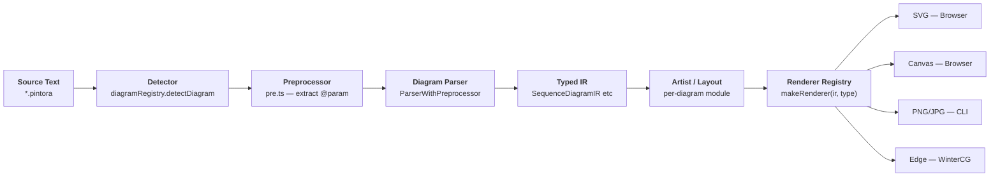
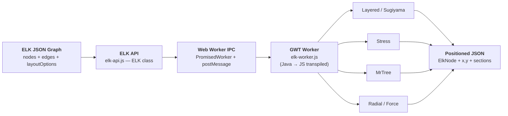
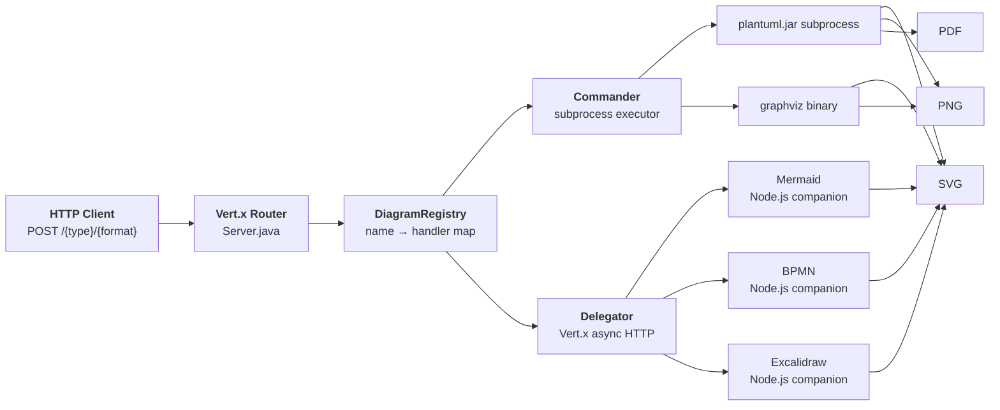

```mermaid
flowchart LR
    SRC["`**Source Text**
    foo.md / string`"]
    PRE["`**Preprocessor**
    mermaidAPI.ts`"]
    DET["`**Type Detector**
    detectType.ts + detectors`"]
    LOAD["`**Dynamic Loader**
    loadDiagram.ts`"]
    PARSER["`**Diagram Parser**
    Jison / TypeScript`"]
    DB["`**State DB**
    FlowDB / SequenceDB`"]
    LAYOUT["`**Layout Engine**
    dagre-wrapper`"]
    DAGRE[dagre-d3-es]
    ELK_OPT[ELK optional]
    RENDER["`**SVG Renderer**
    render.ts + D3`"]
    SANITIZE[DOMPurify]
    OUT_SVG[SVG Output]

    SRC --> PRE
    PRE --> DET
    DET --> LOAD
    LOAD --> PARSER
    PARSER --> DB
    DB --> LAYOUT
    LAYOUT --> DAGRE
    LAYOUT -.->|includeLargeFeatures| ELK_OPT
    DAGRE --> RENDER
    ELK_OPT --> RENDER
    RENDER --> SANITIZE
    SANITIZE --> OUT_SVG
```

# Weekly Diagram Tooling Scan — 2026-05-30

## Executive Summary

- **Mermaid v11.15.0** vẫn là tool thống trị với 70k+ stars, nhưng đang giữa migration từ JISON sang TypeScript parser — architectural debt lớn, cần quan sát khi muốn học parser design
- **Pintora 0.8.1** nổi bật với `pintora-target-wintercg` package: diagram rendering trên Cloudflare Workers / Deno Deploy, technique extensibility qua `IDiagram<IR, Conf>` interface rất clean và áp dụng thẳng vào kymo
- **ELKjs 0.12.0** là gold standard cho layout algorithm research — GWT-transpiled Sugiyama với crossing minimization từ JVM ELK, async qua Web Worker, dùng trực tiếp trong browser không cần server
- **Kroki** (4.1k stars, pushed 2026-05-29) là pattern hay nhất để study microservice gateway cho diagram rendering: Commander/Delegator dispatch, 30+ format, Docker Compose orchestration

## Table of Contents

1. [mermaid-js/mermaid](#1-mermaid-jsmermaid)
2. [hikerpig/pintora](#2-hikerpigpintora)
3. [kieler/elkjs](#3-kielerelkjs)
4. [yuzutech/kroki](#4-yuzutechkroki)

---

## 1. mermaid-js/mermaid

**Repo:** https://github.com/mermaid-js/mermaid  
**Pushed:** 2026-05-29 | **Stars:** ~70k | **Lang:** TypeScript

### §1 — Quick Context

**One-line pitch:** Diagram-as-code engine thống trị documentation space, tích hợp native vào GitHub/GitLab/Notion, generate 20+ loại diagram từ Markdown-inspired syntax không cần build step.

- **Tech stack:** TypeScript, D3 v7, dagre-d3-es (layout), Jison v0.4.18 (grammar gen, legacy), Cytoscape (cose-bilkent layout), RoughJS (hand-drawn style), DOMPurify (sanitizer)
- **Repo health:** 70k stars, 100+ contributors, v11.15.0, CI qua GitHub Actions, test suite với jsdom + Vitest
- **Distribution:** npm `mermaid`, CDN jsDelivr, separate `@mermaid-js/mermaid-cli`

### §2 — Architecture Deep-Dive

#### A. Component Inventory

- `mermaidAPI.ts` (`packages/mermaid/src/mermaidAPI.ts`) — Public API entry point; điều phối toàn bộ pipeline parse → render → sanitize
- `diagram-orchestration.ts` (`src/diagram-api/diagram-orchestration.ts`) — Lazy-load orchestrator; guard pattern `hasLoadedDiagrams`; đăng ký tất cả diagram detector theo priority order
- `detectType.ts` (`src/diagram-api/detectType.ts`) — Type detection; test input sequentially against registered detectors
- `loadDiagram.ts` (`src/diagram-api/loadDiagram.ts`) — Dynamic import của diagram module theo detected type
- `flowDiagram.ts` (`src/diagrams/flowchart/flowDiagram.ts`) — Typical diagram module: exports `{parser, db, renderer, styles, init()}`
- `flowDb.ts` (`src/diagrams/flowchart/flowDb.ts`, 34KB) — Mutable state DB cho flowchart; stores nodes, edges, subgraphs
- `dagre-wrapper/index.js` (`src/dagre-wrapper/index.js`) — Layout wrapper; gọi `dagreLayout(graph)`, xử lý cluster-aware edge routing
- `rendering-util/render.ts` (`src/rendering-util/render.ts`) — SVG finalizer; algorithm selector (dagre default, cose-bilkent optional); DOM ID namespacing

#### B. Pipeline / Control Flow

1. User gọi `mermaid.render(id, text)` → `mermaidAPI.ts`
2. `preprocessDiagram(text)` strips `%%{init: ...}%%` config directives, returns clean source
3. `Diagram.fromText(code)` → `detectType()` tests registered detectors theo order → dynamic import của diagram module
4. Diagram-specific parser (Jison-generated hoặc TypeScript) runs → mutates `db` (stores parsed nodes/edges)
5. `renderer.draw(text, id, version, diagObj)` → dagre-wrapper builds graph → `dagreLayout(graph)` assigns positions
6. D3 renders nodes + edges as SVG DOM → `DOMPurify.sanitize()` → SVG string returned

#### C. Data Model / Intermediate Representation

- **Không có shared IR struct** — mỗi diagram type có riêng `db` (FlowDB, SequenceDB, ClassDB...)
- `db` là **mutable** object, được populate trong quá trình parsing (side-effectful)
- `LayoutData` interface flow từ diagram sang renderer: `{layoutAlgorithm, diagramId, nodes[], config: {theme, themeVariables}}`
- Không có "compile to lower IR" step — direct từ parser state sang renderer

#### D. Input Language Design

- **Parser approach:** Lịch sử là JISON (`.jison` grammar files), đang migrate sang TypeScript parsers. Jison v0.4.18 vẫn là dependency — có thể thấy cả hai pattern trong codebase
- **Grammar format:** Không còn formal grammar file cho các diagram mới — TypeScript hand-written
- **Detection strategy:** Sequential priority list, first detector match wins. Diagram mới register detector riêng (e.g. `flowDetector.ts`)
- **Error reporting:** Basic — không có source position/span info trong error messages (điểm yếu)

#### E. Layout Algorithm

- **Default:** Dagre (Sugiyama-based, layered/hierarchical) qua `dagre-d3-es` library
- **Optional (large features):** Cose-bilkent (force-based constraint layout) qua Cytoscape, lazy-loaded
- **ELK:** Flowchart có subdirectory `elk/` — ELK integration tồn tại cho một số diagram types
- **Edge routing:** Dagre default (polyline), không có explicit orthogonal routing config
- **Crossing minimization:** Delegated hoàn toàn cho Dagre/ELK

#### F. Rendering / Output Strategy

- **Single backend:** SVG rendered vào browser DOM
- **Hand-drawn style:** RoughJS integration (opt-in qua theme)
- **Security:** DOMPurify sanitize SVG output; optional `securityLevel: 'sandbox'` render trong iframe
- **No animation** support built-in

#### G. Extensibility

- `mermaid.registerDiagram(name, diagram)` — add custom diagram types runtime
- Mỗi diagram phải implement: `{parser, db, renderer, styles, detector}`
- Theme system: `themeVariables` object với CSS custom properties
- `registerLayoutLoaders()` để add custom layout algorithm

#### H. Dev Experience

- **CLI:** `@mermaid-js/mermaid-cli` (mmdc), Node.js rendering qua Puppeteer
- **Live editor:** mermaid.live (playground với real-time preview)
- **IDE:** VSCode extensions (multiple community ones)
- **Watch mode:** Vite dev server trong repo
- **Browser preview:** mermaid.live

### §3 — Architecture Diagram



### §4 — Verdict

**Đáng học cho kymostudio:**
- **Lazy-load detector pattern** (`diagram-orchestration.ts` + priority detector list) là technique hay để giữ bundle nhỏ khi có nhiều diagram types — áp dụng thẳng nếu kymo sẽ có nhiều loại node/edge type
- **RoughJS theming** — hand-drawn aesthetic có thể match visual style của kymo
- **LayoutData struct** là clean interface boundary giữa parse và render — nên adopt concept này

**Red flags:**
- Migration JISON → TypeScript parser đang dở dang — code không nhất quán, khó học từ parser design
- Mutable `db` pattern là anti-pattern cho testing và parallel rendering
- Error messages không có source positions — UX xấu cho diagram authors

**Open questions:** ELK integration trong flowchart đã mature chưa hay vẫn experimental?

**Verdict: Glance only** — architecture có too nhiều legacy debt. Study specific techniques (lazy-load, theming) rồi move on.

---

## 2. hikerpig/pintora

**Repo:** https://github.com/hikerpig/pintora  
**Pushed:** 2026-05-28 | **Stars:** 1.2k | **Lang:** TypeScript

### §1 — Quick Context

**One-line pitch:** Text-to-diagram library extensible qua plugin system — thêm diagram type hoàn toàn mới không cần fork core, chạy browser + Node.js + **edge runtime** (WinterCG/Cloudflare Workers).

- **Tech stack:** TypeScript monorepo (pnpm workspaces), @antv/event-emitter, @antv/matrix-util, Rollup/Vite build
- **Repo health:** 1.2k stars, solo maintainer (hikerpig), v0.8.1, CI: có, VSCode extension tách riêng
- **Distribution:** npm `@pintora/standalone` (browser), `@pintora/cli` (Node.js), `pintora-target-wintercg` (edge)

### §2 — Architecture Deep-Dive

#### A. Component Inventory

- `diagram-registry.ts` (`packages/pintora-core/src/diagram-registry.ts`) — Singleton `DiagramRegistry`; `registerDiagram(name, IDiagram)`; `detectDiagram(text)` bằng regex pattern matching
- `config-engine.ts` (`packages/pintora-core/src/config-engine.ts`) — Config management, merge strategy
- `diagram-event.ts` (`packages/pintora-core/src/diagram-event.ts`) — Event system cho click/hover trên diagram elements (4KB)
- `pre.ts` (`packages/pintora-core/src/pre.ts`) — Preprocessing: extract `@param` config blocks từ diagram text trước khi parse
- `pintora-diagrams/src/sequence/` — Sequence diagram: parser, artist (renderer), DB, types
- `pintora-renderer/src/index.ts` — `rendererRegistry`, `makeRenderer(ir, type)`, `IRenderer` interface
- `pintora-cli/` — Node.js CLI, PNG/JPG/SVG output
- `pintora-standalone/` — Browser bundle
- `pintora-target-wintercg/` — Edge runtime target (Cloudflare Workers, Deno Deploy, Node.js Edge)

#### B. Pipeline / Control Flow

1. User gọi `pintora.renderTo(text, {container, renderer})` qua `@pintora/standalone`
2. `diagramRegistry.detectDiagram(text)` — regex match `pattern` của từng registered diagram
3. `new ParserWithPreprocessor(db, parseFn)` — `pre.ts` extracts `@param key value` config blocks, rồi gọi diagram parser
4. Parser populates typed IR (e.g. `SequenceDiagramIR`) — có vẻ immutable sau khi build xong
5. Diagram's "artist" module nhận IR → tính toán layout (per-diagram, không shared layout engine)
6. `makeRenderer(ir, opts.renderer).setContainer(container).render()` → SVG (browser) hoặc PNG/JPG (Node.js)

#### C. Data Model / Intermediate Representation

- **Typed IR per diagram:** `SequenceDiagramIR`, `ERDiagramIR`, `ComponentDiagramIR` — TypeScript interfaces
- Appears **immutable** sau construction — passed to artist/renderer as readonly data
- Không có "lower IR" compilation step — single IR level, IR đi thẳng vào renderer
- @antv/matrix-util dep gợi ý matrix transform dùng trong positioning

#### D. Input Language Design

- **ParserWithPreprocessor pattern:** tách preprocessing (extract `@param` directives) khỏi grammar parsing — clean separation
- **Type detection:** regex pattern trong `IDiagram` interface (e.g. `/^\s*sequenceDiagram/`)
- **Default fallback:** sequenceDiagram nếu không match
- **Parser approach:** không confirm được từ source available — likely nearley hoặc custom recursive descent (cần verify)
- **Error reporting:** không xác định từ available code

#### E. Layout Algorithm

- **Per-diagram layout:** không có shared layout engine như dagre/elk
- @antv/matrix-util cho matrix transforms trong positioning calculations
- Sequence diagrams: manually computed (typical cho sequence: linear top-down)
- ER/Component: không rõ algorithm — không xác định từ available code

#### F. Rendering / Output Strategy

- **Pluggable backends** qua `rendererRegistry`:
  - Browser: SVG (primary), Canvas
  - Node.js (CLI): PNG, JPG, SVG
  - WinterCG: edge-compatible rendering (unique feature)
- `IRenderer` interface: `setContainer(el)`, `render()`, optional `onRender` hook
- Clean pattern: `makeRenderer(ir, type).setContainer(el).render()`

#### G. Extensibility

- `diagramRegistry.registerDiagram(name, diagram)` — add hoàn toàn mới diagram type
- `IDiagram<IR, Conf>` interface requirements: `{pattern, parser, artist, configKey, clear(), eventRecognizer?}`
- No global namespace pollution (explicit design goal từ README)
- Config system: per-diagram config key + global merge

#### H. Dev Experience

- **CLI:** `@pintora/cli` — `pintora render -i input.pintora -o output.svg`
- **Live editor:** pintorajs.vercel.app
- **VSCode extension:** `pintora-vscode` (tách repo)
- **WinterCG target:** unique — có thể call pintora từ Cloudflare Worker
- **Watch mode:** không rõ

### §3 — Architecture Diagram



### §4 — Verdict

**Đáng học cho kymostudio:**
- **`IDiagram<IR, Conf>` interface** là pattern rất clean — kymo nên adopt y chang: typed IR, immutable sau parse, artist module tách biệt khỏi parser
- **ParserWithPreprocessor wrapper** — technique tách config-extraction ra khỏi grammar parsing; tránh pollute grammar với meta-directives
- **WinterCG target** — nếu kymo muốn offer server-side rendering trên edge, đây là blueprint
- **`rendererRegistry` pattern** với `makeRenderer(ir, type)` — clean emitter pattern, pluggable backends

**Red flags:**
- Solo maintainer, v0.8.x — không đảm bảo long-term maintenance
- Layout algorithm per-diagram (không shared) → inconsistency giữa các diagram types
- Parser approach không confirmed trong available code — cần dig sâu hơn

**Open questions:** Parser thực sự là nearley hay custom? Layout cho ER/Component diagram implement thế nào?

**Verdict: Study deeper** — IDiagram interface và ParserWithPreprocessor pattern là concrete techniques áp dụng được ngay.

---

## 3. kieler/elkjs

**Repo:** https://github.com/kieler/elkjs  
**Pushed:** 2026-05-25 | **Stars:** 2.5k | **Lang:** Java → JavaScript (GWT)

### §1 — Quick Context

**One-line pitch:** ELK layout engine học thuật (Sugiyama hierarchical, stress, force) được transpile từ Java sang JavaScript qua GWT, cung cấp serious graph layout trực tiếp trong browser không cần server.

- **Tech stack:** Java source (ELK algorithms), GWT transpilation, JavaScript output, Gradle + Babel + Browserify build chain
- **Repo health:** 2.5k stars, Kieler team (Eclipse), v0.12.0, CI: có, test qua Mocha + Chai
- **Distribution:** npm `elkjs`, UMD bundle, Web Worker module, TypeScript definitions

### §2 — Architecture Deep-Dive

#### A. Component Inventory

- `src/java/` — Java source của ELK layout algorithms (Sugiyama, force, tree, etc.)
- `src/java-additional/` — Java bridge code cho GWT compilation
- `src/js/elk-api.js` — Public JavaScript API class `ELK`; wraps `PromisedWorker`
- `src/js/main-api.js` — Entry point; instantiates `ELK` với default options
- `src/js/main-node.js` — Node.js-specific wrapper (CommonJS module)
- `elk-worker.js` (build output) — GWT-transpiled Java layout algorithms; runs trong Web Worker
- `typings/main.d.ts` — TypeScript type declarations
- `test/` — Mocha test suite với real graph examples

#### B. Pipeline / Control Flow

1. User gọi `new ELK().layout(graphJSON)` — returns `Promise<ElkNode>`
2. `layout()` validates graph presence, merges `layoutOptions` với instance defaults
3. JSON message `{id, graph, layoutOptions, logging, measureExecutionTime}` sent tới Web Worker qua `postMessage`
4. `elk-worker.js` (GWT Java) nhận message, chạy algorithm (layered/stress/mrtree/radial/force)
5. Positioned graph JSON returned qua `postMessage` với matching `id`
6. `PromisedWorker.resolve(id, result)` resolves Promise với positioned graph
7. User nhận `ElkNode` với `x`, `y` trên tất cả nodes + `sections` (bend points) trên edges

#### C. Data Model / Intermediate Representation

- **Input/Output:** Plain JSON — cùng một `ElkNode` struct, thêm vào position properties:
  ```json
  {
    "id": "root",
    "layoutOptions": {"elk.algorithm": "layered", "elk.direction": "RIGHT"},
    "children": [{"id": "n1", "width": 30, "height": 30}],
    "edges": [{"id": "e1", "sources": ["n1"], "targets": ["n2"]}]
  }
  ```
- Hierarchical: `children[]` cho compound/nested graphs
- **Mutable** — output là input object với thêm `x`, `y`, `sections`
- Không có khái niệm "compile to lower IR" — single pass

#### D. Input Language Design

- **Không có text DSL** — input là pure JSON (ELK JSON format)
- Layout options là key-value strings: `{"elk.algorithm": "layered", "elk.spacing.nodeNode": "20"}`
- Toàn bộ 200+ layout options documented tại elk.rtsys.uni-kiel.de
- Không phải text-to-diagram tool — pure layout computation library

#### E. Layout Algorithm

- **Layered (Sugiyama):** phase-based: cycle removal → layer assignment → crossing minimization (barycentric heuristic) → node placement → edge routing
- **Stress:** force-based với stress minimization objective function
- **MrTree:** tree-specific hierarchical, optimized cho trees
- **Radial:** nodes xếp trên concentric circles theo distance từ root
- **Force:** simple spring-electrical force-directed
- **Disco:** xử lý disconnected components
- **Crossing minimization:** yes — barycentric heuristic trong layered algorithm
- **Edge routing:** orthogonal (default trong layered), spline/polyline options có

#### F. Rendering / Output Strategy

- **Không render** — chỉ output positioned JSON
- Consumer (mermaid, sprotty, xyflow, custom code) tự render SVG
- Web Worker pattern: không block UI thread trong khi layout chạy
- Node.js: sync wrapper available (`main-node.js`)

#### G. Extensibility

- Layout options per-node/edge qua JSON `layoutOptions`
- Algorithm selection: `"elk.algorithm": "layered|stress|mrtree|radial|force|disco"`
- Không có diagram plugin system — single-purpose layout library

#### H. Dev Experience

- **API:** Clean Promise-based, `async/await` friendly
- **TypeScript:** Declarations included, typed `ElkNode`, `ElkEdge`, etc.
- **Web Worker:** Non-blocking — critical cho UI performance
- **Debugging:** `logging: true` + `measureExecutionTime: true` options
- **Không có** IDE integration, LSP, watch mode — pure library

### §3 — Architecture Diagram



### §4 — Verdict

**Đáng học cho kymostudio:**
- **ELK JSON graph format** là interface contract rất clean — `{id, children[], edges[], layoutOptions}` — nếu kymo cần serious layout, đây là format để adopt
- **Layered algorithm với orthogonal edge routing** — nếu kymo làm flowchart/architecture diagram, ELK layered cho kết quả đẹp hơn dagre đáng kể
- **Web Worker pattern cho layout** — nếu kymo có graph lớn, phải async layout để không block UI
- **PromisedWorker pattern** — wrapping Web Worker trong Promise với ID-based resolver là pattern sạch, copy-paste được

**Red flags:**
- GWT transpiled code trong `elk-worker.js` rất khó debug khi có layout bug
- Java dependency cho build — nếu muốn contribute upstream algorithm, cần JVM
- Bundle size: `elk.bundled.js` có thể lớn do tất cả algorithms

**Open questions:** Edge routing orthogonal trong elkjs có đẹp hơn dagre's polyline như thế nào? Benchmark với large graphs?

**Verdict: Study deeper** — Layout algorithm knowledge từ elkjs là foundational. ELK JSON format design và Web Worker async pattern áp dụng trực tiếp vào kymo nếu cần layout engine.

---

## 4. yuzutech/kroki

**Repo:** https://github.com/yuzutech/kroki  
**Pushed:** 2026-05-29 | **Stars:** 4.1k | **Lang:** Java (Vert.x) + JavaScript

### §1 — Quick Context

**One-line pitch:** Gateway API thống nhất convert 30+ diagram formats (PlantUML, Mermaid, D2, Graphviz, BPMN, Excalidraw...) thành SVG/PNG/PDF qua một REST endpoint, deploy bằng Docker Compose.

- **Tech stack:** Java 17 + Vert.x (gateway), Node.js companion microservices (Mermaid/BPMN/Excalidraw), Maven, Docker
- **Repo health:** 4.1k stars, yuzutech team, active CI (GitHub Actions + Renovate), Docker Hub official images
- **Distribution:** Docker Hub (`yuzutech/kroki`), self-hosted Docker Compose, Helm chart

### §2 — Architecture Deep-Dive

#### A. Component Inventory

- `server/` — Vert.x Java gateway core; `Main.java`, `Server.java`, `DiagramRegistry.java`, `DiagramRest.java`
- `server/.../service/Plantuml.java` — PlantUML handler: subprocess Commander, 6 output formats
- `server/.../service/Graphviz.java` — Graphviz handler: Commander subprocess
- `server/.../service/Mermaid.java` (inferred) — Delegator to companion Node.js service
- `mermaid/` — Node.js companion service cho Mermaid rendering
- `bpmn/` — Node.js companion service cho BPMN (bpmn-js)
- `excalidraw/` — Node.js companion service cho Excalidraw
- `diagrams.net/` — diagrams.net companion service
- `nomnoml/`, `bytefield/`, `dbml/`, `vega/`, `wavedrom/`, `tikz/` — Format-specific modules

#### B. Pipeline / Control Flow

1. Client gửi `POST /{diagram-type}/{output-format}` với diagram source trong HTTP body
2. Vert.x router → `DiagramRest.create()` → `DiagramRegistry` lookup theo diagram-type string
3. Registry trả về appropriate handler (Plantuml, Graphviz, Mermaid, BPMN...)
4. Handler sanitizes input (whitelist check cho includes, PlantUML delimiter wrapping)
5a. **Commander path:** `vertx.executeBlocking()` → spawns subprocess (`plantuml.jar`, `dot` binary) → captures stdout bytes
5b. **Delegator path:** HTTP request tới companion Node.js service → receives rendered bytes
6. Binary response (SVG/PNG/PDF) streamed trực tiếp về client với appropriate Content-Type

#### C. Data Model / Intermediate Representation

- **Không có shared IR** — Kroki là transparent gateway, không parse hay transform diagram source
- Mỗi diagram format giữ nguyên IR/AST của tool đó (PlantUML IR trong JVM, Mermaid IR trong Node.js companion)
- Input có 3 encodings: plain text body, URL-encoded `/{format}/{output}/{base64-deflate}`, JSON `{"diagram_source": "..."}`
- Base64+deflate encoding cho shareable URLs là design hay

#### D. Input Language Design

- **Không thiết kế language** — wraps 30+ existing DSLs as-is
- Unified URL scheme: `/{format}/{output-format}` — một URL pattern cho tất cả formats
- Input sanitization: PlantUML includes whitelist, security policy check
- Không expose parser internals

#### E. Layout Algorithm

- **Delegated hoàn toàn** tới underlying tools:
  - GraphViz: dot/neato/fdp/circo/twopi
  - Mermaid: Dagre (default), ELK (optional)
  - diagrams.net: ELK
  - PlantUML: custom layout engine
- Kroki gateway: layout-agnostic

#### F. Rendering / Output Strategy

- **Multi-format fan-out** per diagram type:
  - PlantUML: PNG, SVG, PDF, BASE64, TXT, UTXT
  - Graphviz: PNG, SVG, PDF
  - Mermaid: SVG
- **Two dispatch patterns:**
  - Commander: subprocess (fast, stateless, synchronous per request)
  - Delegator: companion service (async Vert.x, cho tools cần Node.js runtime)
- CORS support configurable qua environment variables
- OpenTelemetry distributed tracing built-in

#### G. Extensibility

- **Thêm diagram type mới:** implement Java service class → đăng ký trong `DiagramRegistry`
- **Companion service:** Docker container riêng, communicate qua HTTP
- Format-specific modules trong own directories (e.g. `mermaid/`, `bpmn/`)
- Docker Compose orchestration cho toàn bộ ecosystem

#### H. Dev Experience

- **REST API:** OpenAPI spec available
- **Kubernetes-ready:** `/healthz` endpoint (k8s liveness probe), `/metrics` (Prometheus)
- **OpenTelemetry:** distributed tracing cho production debugging
- **Docker Compose:** local setup với tất cả companions
- **Không có** browser playground in-repo (kroki.io là hosted version)

### §3 — Architecture Diagram



### §4 — Verdict

**Đáng học cho kymostudio:**
- **Commander/Delegator dispatch pattern** — hai strategy cho subprocess vs async service, clean abstraction. Nếu kymo cần server-side rendering với nhiều backends, pattern này scale tốt
- **Base64+deflate URL encoding** — technique hay cho shareable diagram URLs không cần database. Direct steal cho kymo's share feature
- **DiagramRegistry.register(service, "name", "alias")** — alias mapping cho format variants (e.g. "graphviz" và "dot" → cùng handler) là UX win
- **OpenTelemetry + /healthz** — production-grade observability pattern từ đầu

**Red flags:**
- Java + Maven build environment nặng — contribution barrier cao
- Companion services Docker dependency — local dev cần Docker knowledge
- No browser preview in-repo — testing requires docker-compose up

**Open questions:** Performance của Commander (subprocess spawn per request) vs Delegator (persistent companion service) ở high load thế nào?

**Verdict: Glance only** (architecture) nhưng **steal techniques** cụ thể: base64+deflate URL scheme và Commander/Delegator abstraction là hai thứ áp dụng được ngay cho kymo.

---

*Generated by weekly-scout @ 2026-05-30. Next scan: 2026-06-06.*
