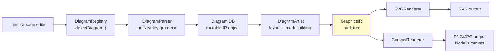
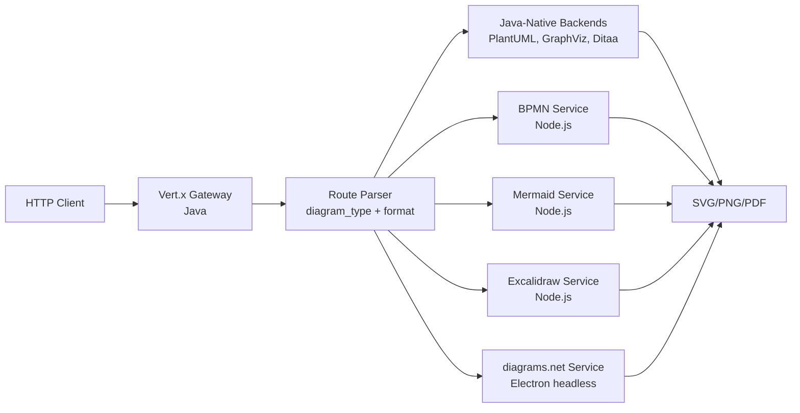
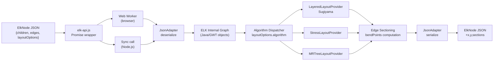
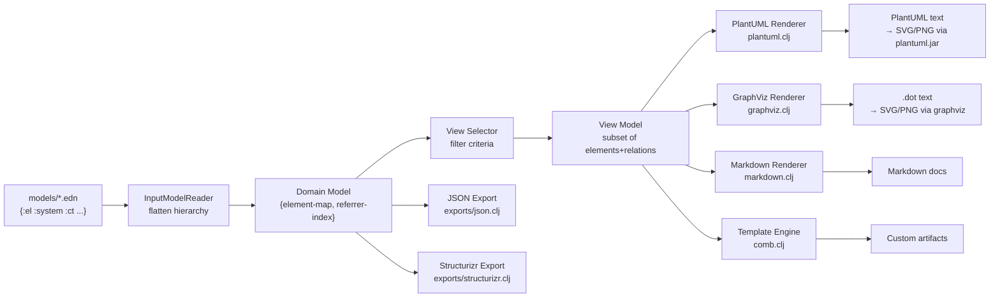

# Weekly Diagram Tooling Scan — 2026-05-31

## Executive Summary

- **Pintora** là blueprint đáng nghiên cứu nhất tuần này: IDiagram plugin contract + Nearley grammar + mark-tree GraphicsIR là pattern sạch nhất trong diagram-as-code TypeScript ecosystem, hoàn toàn tái sử dụng được cho kymo.
- **ELKjs** cung cấp ElkEdgeSection (startPoint/endPoint/bendPoints array) — data model chuẩn nhất cho orthogonal edge routing, nên adopt nguyên cho kymo's IR thay vì tự thiết kế.
- **Kroki + Overarch** cho thấy hai chiến lược đối lập: Kroki là hub-and-dispatch (Java core + polyglot backends), Overarch là data-first (không có DSL parser — dùng EDN trực tiếp); cả hai đều có lesson về separation of concerns cho rendering pipeline.

## Table of Contents

1. [Pintora — Extensible TS diagram-as-code với Nearley grammar](#repo-1-pintora)
2. [Kroki — Multi-backend diagram gateway (20+ renderers)](#repo-2-kroki)
3. [ELKjs — Layout algorithms từ Java ELK compile sang JS](#repo-3-elkjs)
4. [Overarch — Data-driven C4/UML modeling với EDN](#repo-4-overarch)

---

## Repo 1: Pintora

> `hikerpig/pintora` · 1,283★ · TypeScript · MIT · pushed 2026-05-28
> https://github.com/hikerpig/pintora

### §1 — Quick Context

**Pitch:** Thư viện diagram-as-code TypeScript duy nhất có plugin contract chính thức cho phép dev cộng đồng ship diagram type riêng — không phải fork, không hardcode — chạy đồng nhất trên browser và Node.js.

- **Stack:** TypeScript (monorepo), Nearley grammar, `@pintora/pintora-core`, outputs SVG/Canvas (browser) và PNG/JPG/SVG (Node.js)
- **Health:** 1,283★, 37 forks, 38 open issues, CI có, active commits
- **Distribution:** npm (`@pintora/core`, `@pintora/diagrams`, `@pintora/cli`)

### §2 — Architecture Deep-Dive

#### A. Component Inventory

| Component | File path | Vai trò |
|---|---|---|
| `DiagramRegistry` | `packages/pintora-core/src/diagram-registry.ts` | Đăng ký + dispatch diagram type qua regex |
| `IDiagram<D,Config>` | `packages/pintora-core/src/type.ts` | Plugin contract: pattern + parser + artist |
| `SequenceParser` | `packages/pintora-diagrams/src/sequence/parser.ts` | Nearley parse → DB apply |
| `SequenceGrammar` | `packages/pintora-diagrams/src/sequence/parser/sequenceDiagram.ne` | Nearley grammar file |
| `SequenceArtist` | `packages/pintora-diagrams/src/sequence/artist.ts` | IR → GraphicsIR mark tree |
| `ThemeRegistry` | `packages/pintora-core/src/themes/index.ts` | 4 themes: default, dark, lark-light, lark-dark |
| `SymbolRegistry` | `packages/pintora-core/src/symbol-registry.ts` | Reusable shape definitions |
| `pintora-cli` | `packages/pintora-cli/src/cli.ts` | CLI entry point |

#### B. Pipeline / Control Flow

```
1. User chạy `pintora render foo.pintora -o foo.svg`
2. CLI đọc file, gọi pintora.parseAndDraw(text, options)
3. DiagramRegistry.detectDiagram(text) — iterate qua registered patterns, regex match → trả về tên diagram type
4. Diagram's parser.parse(text, context) — Nearley engine + yy=db → post-process vào IR database
5. Diagram's artist.draw(ir, options) → tính layout (manual incremental cho sequence, v.d. verticalPos bump), build GraphicsIR mark tree {root: Group{children: [rect, line, text, path, marker...]}}
6. Renderer nhận GraphicsIR → emit SVG elements / Canvas draw calls → file output
```

#### C. Data Model / Intermediate Representation

- **IR per diagram** là một `db` object (plain mutable class), populated bởi Nearley grammar semantic actions qua `yy` binding
- **GraphicsIR** (shared across all diagrams): `{ root: MarkNode, width, height }` — immutable mark tree được trả từ Artist
- Mark types: `rect`, `line`, `text`, `path`, `group`, `marker` — flat union của graphic primitives
- Không có "compile to lower IR": Artist emit thẳng GraphicsIR, không qua intermediate layout pass riêng biệt
- Matrix transformation (`mat3`) được apply cuối Artist để centering + scaling

#### D. Input Language Design

- **Parser approach:** Nearley grammar (`.ne` files), generate parser tại build time qua `nearleyc`
- **Grammar structure:** Lexer dùng `moo` với multiple states — `main`, `line`, `configStatement`, `noteState` — để handle context-dependent tokenization (ví dụ: nội dung note vs. signal text)
- **Formal grammar:** Có `.ne` file cho mỗi diagram type — không phải EBNF viết tay, nhưng là Nearley's BNF-like notation
- **Error reporting:** Không xác định rõ — Nearley default error messages, không thấy custom diagnostic layer
- **Ambiguity resolution:** Dùng `dedupeAmbigousResults: true` để suppress Nearley ambiguous parses

#### E. Layout Algorithm

- **Sequence diagram:** Manual incremental layout — không dùng constraint solver hay force-directed. `verticalPos` là một counter tăng dần; horizontal spacing tính từ `getMaxMessageWidthPerActor()`
- **Lý do manual layout hoạt động cho sequence:** Sequence diagram có structure cố định (top-to-bottom, left-to-right per actor) nên không cần general graph layout
- **Edge routing:** Straight lines (signals), self-loop dùng `path` với bezier/arc
- **Crossing minimization:** Không áp dụng — sequence diagram không có crossing problem

#### F. Rendering / Output Strategy

- **Output backends:** SVG (browser + Node.js) và Canvas (browser), PNG/JPG qua Node.js + canvas library
- **Architecture:** Single render interface `IRenderer`, multiple implementations (SVGRenderer, CanvasRenderer)
- **Animation:** Không thấy trong source
- **Pluggable emitter:** Có — renderer là một injectable dependency

#### G. Extensibility

- **Plugin system:** Chính thức qua `IDiagram` interface — community có thể ship npm package implement IDiagram và `pintora.registerDiagram(name, diagramImpl)`
- **New shape/icon:** Qua `SymbolRegistry` — define `SymbolDef` với SVG path
- **Theme:** `ThemeRegistry` — 4 built-in themes, có thể register custom themes với `ITheme` interface
- **New output format:** Implement `IRenderer` interface

#### H. Dev Experience

- CLI với watch mode: `pintora render --watch`
- VSCode extension cho syntax highlighting
- Obsidian plugin, Gatsby plugin
- Browser live demo tại https://pintorajs.vercel.app
- Web components library (`pintora-stencil`)

### §3 — Architecture Diagram



### §4 — Verdict

**Đáng học cho kymostudio:**
- `IDiagram<D, Config>` plugin contract là mẫu thiết kế sạch nhất để kymo support multiple diagram types — copy pattern này, đặc biệt là tách biệt `parser` và `artist`
- Nearley `.ne` grammar files cho phép grammar phát triển độc lập với runtime, đọc/viết tốt hơn PEG parser combinations — xem xét nếu kymo cần formal grammar
- `GraphicsIR` mark tree (rect/line/text/group) là abstraction layer tốt giữa layout logic và actual rendering backend

**Red flags:**
- Layout cho non-sequence diagrams không rõ — có thể mỗi diagram tự layout thủ công, thiếu shared layout engine
- Nearley `dedupeAmbigousResults` là workaround cho grammar ambiguity chứ không phải fix
- 38 open issues, 1 maintainer chính

**Open questions:** Có dùng shared layout cho mindmap/component diagram không? Hay mỗi artist tự layout?

**Verdict: Study deeper** — pintora-core architecture là reference implementation cho kymo's diagram plugin system.

---

## Repo 2: Kroki

> `yuzutech/kroki` · 4,159★ · Java + JavaScript · MIT · pushed 2026-05-30
> https://github.com/yuzutech/kroki

### §1 — Quick Context

**Pitch:** Diagram hub thống nhất — một HTTP endpoint duy nhất cho 20+ diagram backends (PlantUML, Mermaid, D2, Excalidraw, BPMN...) với URL-encoding protocol mà mọi client chỉ cần implement một lần.

- **Stack:** Java (Vert.x core gateway), Node.js (companion services cho Mermaid/BPMN/Excalidraw/diagrams.net), Maven build
- **Health:** 4,159★, 296 forks, 148 open issues, CI với smoke tests
- **Distribution:** Docker image `yuzutech/kroki`, self-hostable

### §2 — Architecture Deep-Dive

#### A. Component Inventory

| Component | File path | Vai trò |
|---|---|---|
| `Kroki Server` | `server/src/main/java/io/kroki/server/` | Vert.x HTTP gateway — route + dispatch |
| `BPMN Service` | `bpmn/index.js` | Node.js companion cho BPMN.js rendering |
| `Bytefield Service` | `bytefield/index.js` | Node.js companion cho bytefield diagrams |
| `DBML Service` | `dbml/index.js` | Node.js companion cho database markup |
| `diagrams.net Service` | `diagrams.net/` | Headless Electron companion |
| `CI Smoke Tests` | `ci/tests/smoke.js` | Integration tests cho mỗi diagram type |
| `Docker Compose` | root `docker-compose.yml` | Orchestrate core + companions |

#### B. Pipeline / Control Flow

```
1. Client gửi POST /diagram-type/output-format với body = diagram source text
   (hoặc GET /diagram-type/output-format/{base64-deflate-encoded-source})
2. Vert.x router parse URL → xác định diagram_type + output_format
3. Handler dispatch: nếu diagram_type là Java-native (PlantUML, GraphViz, Ditaa...) → xử lý trong-process
4. Nếu diagram_type là Node.js companion (Mermaid, BPMN, Excalidraw...) → HTTP call nội bộ đến companion service
5. Companion service nhận source text → render → trả về SVG/PNG bytes
6. Vert.x gateway trả response với content-type phù hợp
```

#### C. Data Model / Intermediate Representation

- Không có shared IR giữa backends — mỗi backend tự xử lý từ source text đến output bytes
- Kroki là **thin routing layer**: không parse, không transform — chỉ route và proxy
- Diagram source được truyền qua dưới dạng raw text string hoặc URL-encoded string
- URL encoding protocol: `deflate(utf8(source)) → base64url` — protocol này đủ nhỏ để fit trong URL

#### D. Input Language Design

- Kroki không define input language — delegate hoàn toàn cho từng backend
- **URL encoding** là contribution DSL duy nhất: encode/decode spec được document rõ ràng
- Mỗi diagram type có `diagram_type` identifier cố định (string slugs: "plantuml", "mermaid", "d2"...)

#### E. Layout Algorithm

- Không có layout algorithm riêng — Kroki là gateway, không compute layout
- Layout được delegate cho từng backend (PlantUML dùng layout riêng, Graphviz dùng dot/neato/fdp...)

#### F. Rendering / Output Strategy

- **Output formats:** SVG, PNG, PDF, Base64 — tùy theo backend capability
- **Multiple backends:** Java-native (PlantUML, GraphViz, Ditaa, Pikchr) + Node.js companions (Mermaid, BPMN, Excalidraw, diagrams.net)
- **Companion pattern:** Separate Docker container, communicate qua HTTP — loosely coupled
- **Fallback:** Nếu companion không available, Kroki trả HTTP 503

#### G. Extensibility

- **Add new backend:** Implement Java service class + register route, hoặc thêm Node.js companion service + wire vào docker-compose
- **Plugin system:** Không — hardcoded routes per diagram type
- **Contribution:** GitHub, add diagram type qua PR

#### H. Dev Experience

- Self-hosted với Docker Compose: `docker-compose up` → endpoint sẵn sàng
- Public demo tại https://kroki.io
- SDK/client wrappers cho nhiều ngôn ngữ (community-made)
- VS Code: plugin embed diagrams trong markdown

### §3 — Architecture Diagram



### §4 — Verdict

**Đáng học cho kymostudio:**
- **URL encoding protocol** (deflate + base64url) là cách share diagram state trong URL mà không cần backend — kymo nên implement y chang cái này cho shareable links
- **Companion service pattern** cho thấy cách isolate heavy renderers (headless Electron) trong separate process — useful nếu kymo muốn support Excalidraw/diagrams.net output
- Smoke test approach: một test file đơn test mỗi diagram type với representative input → minimal nhưng đủ coverage cho regression

**Red flags:**
- 148 open issues — nhiều diagram types thiếu maintenance
- Headless Electron cho diagrams.net là tech debt nặng
- No plugin API — adding new backend requires touching core routing code

**Open questions:** Cơ chế nào handle timeout khi companion service chậm? Có circuit breaker không?

**Verdict: Glance only** — URL encoding protocol là artifact duy nhất đáng copy trực tiếp.

---

## Repo 3: ELKjs

> `kieler/elkjs` · 2,593★ · Java → JavaScript (GWT) · EPL-2.0 · pushed 2026-05-29
> https://github.com/kieler/elkjs

### §1 — Quick Context

**Pitch:** Eclipse Layout Kernel — bộ layout algorithms mạnh nhất (Sugiyama layered, force-directed, tree, radial...) được compile từ Java sang JavaScript qua GWT để chạy trên browser và Node.js mà không cần Java runtime.

- **Stack:** Java source (algorithm impl), GWT compile → JavaScript, TypeScript typings, Web Worker async
- **Health:** 2,593★, 117 forks, 99 open issues, CI với mocha tests
- **Distribution:** npm `elkjs`

### §2 — Architecture Deep-Dive

#### A. Component Inventory

| Component | File path | Vai trò |
|---|---|---|
| `ELK Java core` | `src/java/org/eclipse/elk/js/ElkJs.java` | GWT entry point cho compilation |
| `JsonAdapter` | `src/java-additional/org/eclipse/elk/graph/json/JsonAdapter.xtend` | Convert JSON graph ↔ ELK internal graph model |
| `elk-api.js` | `src/js/elk-api.js` | Promise-based JS wrapper, Worker management |
| `main-node.js` | `src/js/main-node.js` | Node.js entry point (no Worker needed) |
| `NodeJsModuleLinker` | `src/java/...linker/NodeJsModuleLinker.java` | GWT linker để output CommonJS module |
| `TypeScript Defs` | `typings/elk-api.d.ts` | ElkNode, ElkEdge, ElkPort, ElkEdgeSection types |

#### B. Pipeline / Control Flow

```
1. User gọi elk.layout(graph) với graph là JSON object (ElkNode với children, edges)
2. elk-api.js serialize graph → post message đến Web Worker (browser) hoặc call sync (Node.js)
3. Worker: JsonAdapter.deserialize(json) → ELK internal graph model (Java objects via GWT)
4. Algorithm dispatcher: đọc layoutOptions["algorithm"] → select layout algorithm class
5. Layout algorithm (e.g., LayeredLayoutProvider) compute positions: x, y cho mỗi node; route edges
6. Edge sections tính: startPoint, endPoint, bendPoints array cho mỗi ElkEdgeSection
7. JsonAdapter.serialize(result) → JSON → Worker post back → Promise resolve
8. User nhận graph với x/y/width/height populated trên mọi node/edge/port
```

#### C. Data Model / Intermediate Representation

- **Đầu vào:** `ElkNode` (hierarchical) — `id`, `width`, `height`, `children[]`, `ports[]`, `edges[]`, `layoutOptions{}`
- **Đầu ra:** Cùng cấu trúc nhưng với `x`, `y` populated; edges có `sections[]` với `ElkEdgeSection`
- **`ElkEdgeSection`** là key type: `{ id, startPoint{x,y}, endPoint{x,y}, bendPoints[]?{x,y}, incomingShape?, outgoingShape? }` — đây là data model chuẩn cho orthogonal edge routing
- **LayoutOptions** là `{[key: string]: string}` map — loosely typed nhưng discoverable qua `knownLayoutOptions()`
- Không có "lower IR" — Java ELK có internal graph model nhưng không expose ra JS API

#### D. Input Language Design

- Không có DSL — input là JSON graph object
- ELK JSON format là de-facto standard cho programmatic diagram layout
- `layoutOptions` strings follow `org.eclipse.elk.xxx` namespace convention

#### E. Layout Algorithm

- **Layered (Sugiyama method):** Hierarchical layout với direction setting — best cho DAGs, flowcharts, architecture diagrams. Crossing minimization built-in.
- **Stress:** Force-directed với stress majorization — smoother convergence hơn Fruchterman-Reingold
- **MRTree:** Modified Reingold-Tilford tree layout — cho rooted trees
- **Radial:** Circular radial layout
- **Force:** Traditional force-directed (spring-electrical model)
- **Disco:** Connected components placement
- **SporeOverlap / SporeCompaction:** Node overlap removal
- **RectPacking:** Bin-packing cho nodes không có edges
- **Edge routing:** Orthogonal routing built-in — `bendPoints` array encode polyline; spline approximation available

#### F. Rendering / Output Strategy

- ELKjs **không render** — chỉ compute positions
- Output là JSON với coordinates → consumer tự render (SVG, Canvas, WebGL, etc.)
- Backend agnostic hoàn toàn: ELKjs chỉ làm layout

#### G. Extensibility

- Layout algorithm có thể register thêm nếu implement Java ELK interface (build time)
- Không có runtime plugin system trong JS API
- `algorithms` array trong constructor cho phép load subset để giảm bundle size

#### H. Dev Experience

- Promise-based API: `elk.layout(graph).then(layouted => ...)` hoặc `await elk.layout(graph)`
- TypeScript typings đầy đủ
- Không có CLI, không có IDE integration riêng
- Bundle size là concern: full build ~2.5MB (GWT output), có thể tree-shake bằng chọn algorithms

### §3 — Architecture Diagram



### §4 — Verdict

**Đáng học cho kymostudio:**
- **`ElkEdgeSection` data model** — `{startPoint, endPoint, bendPoints[]}` — là exactly cái kymo cần cho orthogonal edge routing IR. Adopt nguyên không cần reinvent.
- **Algorithm selection qua `layoutOptions` string map** là cách clean để expose layout variants cho user (có thể làm `kymo-config: layout: layered` tương tự)
- **Layered (Sugiyama)** là algorithm đáng nhất để study cho architecture diagrams — handle ports, crossing minimization, direction options

**Red flags:**
- GWT compilation tạo ra JavaScript khó debug và bundle size lớn
- 99 open issues — many về GWT modularization problems
- Web Worker required cho browser — thêm complexity nếu kymo muốn embed

**Open questions:** Có thể thay GWT bằng Kotlin/Native + WASM không để reduce bundle size? Có open issue/PR về điều này không?

**Verdict: Study deeper** — ElkEdgeSection type definitions và algorithm API design là reference để thiết kế kymo's layout IR.

---

## Repo 4: Overarch

> `soulspace-org/overarch` · 291★ · Clojure · EPL-2.0 · pushed 2026-05-29
> https://github.com/soulspace-org/overarch

### §1 — Quick Context

**Pitch:** Tool C4/UML modeling bỏ hoàn toàn custom DSL parser — dùng EDN (data notation của Clojure) làm input format, tách biệt hoàn toàn "model" (what exists) khỏi "view" (what to show), generate PlantUML/Graphviz từ data.

- **Stack:** Clojure (JVM), EDN/JSON input, outputs PlantUML + GraphViz + Markdown + Structurizr
- **Health:** 291★, 8 forks, 1 open issue, CI có, stable
- **Distribution:** JAR binary, Homebrew, Docker

### §2 — Architecture Deep-Dive

#### A. Component Inventory

| Component | File path | Vai trò |
|---|---|---|
| `Element domain` | `src/.../domain/element.clj` | Element types, predicates, hierarchy |
| `Model domain` | `src/.../domain/model.clj` | Flat graph: element-map + relation-indexes |
| `View domain` | `src/.../domain/view.clj` | View abstraction: filtering logic |
| `View types` | `src/.../domain/views/` | C4 views (context, container, component, deployment, dynamic, state-machine) |
| `InputModelReader` | `src/.../adapter/reader/input_model_reader.clj` | Load + merge EDN files |
| `PlantUML renderer` | `src/.../adapter/render/plantuml.clj` | Model+view → PlantUML text |
| `GraphViz renderer` | `src/.../adapter/render/graphviz.clj` | Model+view → .dot text |
| `Template engine` | `src/.../adapter/template/comb.clj` | Comb template → arbitrary output |
| `CLI` | `src/.../ui/cli.clj` | Command-line entry point |
| `JSON export` | `src/.../exports/json.clj` | Model → JSON |
| `Structurizr export` | `src/.../exports/structurizr.clj` | Model → Structurizr DSL |

#### B. Pipeline / Control Flow

```
1. User chạy `overarch --render-format plantuml --output-dir out/ --model-dir models/`
2. CLI scan models/ → load tất cả .edn files → merge thành unified raw model
3. InputModelReader transform: flatten nested :ct hierarchy thành flat graph 
   {element-map {id → element}, referrer-index {id → [relations]}, referred-index {id → [relations]}}
4. View definitions trong views.edn xác định: diagram type + filter criteria (e.g., ":include :related-to :banking/api-application")
5. Cho mỗi view: View selector chạy criteria → lấy subset elements + relations
6. Format-specific renderer (plantuml.clj, graphviz.clj) generate text output
7. PlantUML/GraphViz nhận text → render SVG/PNG (subprocess call)
```

#### C. Data Model / Intermediate Representation

- **Input format:** EDN — không cần parser vì EDN là built-in Clojure reader syntax
- **Internal IR (domain model):** `{:element-map {id→elem}, :referrer-index {id→[rels]}, :referred-index {id→[rels]}, :containment-rels [...]}` — pure immutable Clojure maps
- **Dual representation design:** Input là hierarchical (`:ct` nested), internal là flat graph — transformation xảy ra một lần khi load
- **Synthetic relations:** `:contains` relation tự động tạo từ `:ct` nesting — uniform query pattern
- **View là filter function** trên domain model, không phải separate data store
- **Namespace-qualified IDs:** `:banking.internet-banking/api-application` — tránh collision, naturally scoped

#### D. Input Language Design

- **Không có custom parser** — EDN là Clojure's data syntax (like JSON nhưng richer: keywords, sets, tagged literals)
- **Schema validation** qua Clojure Spec (`src/.../domain/spec.clj`) — validate data structure chứ không phải text
- **Error reporting** qua Clojure Spec explain — structured errors với path info
- **Trade-off:** EDN không thân thiện với non-Clojure devs; JSON alternative có sẵn

#### E. Layout Algorithm

- Không có layout riêng — delegate hoàn toàn cho PlantUML (dùng Graphviz/Smetana) và GraphViz
- **Hierarchy** giúp layout tốt hơn: PlantUML C4 diagrams biết system boundaries → group nodes tự động

#### F. Rendering / Output Strategy

- **Overarch không render hình ảnh trực tiếp** — generate text format (PlantUML DSL, .dot) rồi delegate
- **Pluggable renderers:** `plantuml.clj`, `graphviz.clj`, `markdown.clj` là separate namespaces
- **Template rendering:** Comb engine cho arbitrary output format (documentation, code generation, infrastructure specs)
- **Multiple consumers từ single model** là key value prop

#### G. Extensibility

- **New renderer:** Implement Clojure protocol/namespace, register trong CLI dispatch
- **New element type:** Thêm vào `element.clj` spec, update relevant renderers
- **Template-based:** Comb templates cho custom output mà không cần code Clojure
- **Open schema:** Namespaced EDN keys prevent collision với extensions

#### H. Dev Experience

- CLI với multiple render targets trong một lần chạy: `--render-format plantuml,graphviz,markdown`
- Editor integration: VS Code với Clojure extension, Calva, Emacs
- REPL-driven development (Clojure)
- Không có watch mode hoặc browser preview built-in

### §3 — Architecture Diagram



### §4 — Verdict

**Đáng học cho kymostudio:**
- **Model vs. View separation** là pattern sạch nhất tuần này: kymo nên có khái niệm "diagram model" (elements + relations, persistent) tách khỏi "diagram view" (what's visible, transient) — enables multiple views of same model
- **Namespace-qualified IDs** (`:banking.internet-banking/api-application`) là cách scale element identification mà không collision — dùng cho kymo's element ID scheme
- **Clojure Spec cho data validation thay vì parser errors** — inspirational: kymo có thể validate IR object schema thay vì chỉ rely on parser để catch errors

**Red flags:**
- EDN là barrier to entry nếu target audience không phải Clojure devs
- Delegate rendering cho PlantUML/GraphViz là không kiểm soát được visual output quality
- 1 maintainer chính, 8 forks — nhỏ nhưng stable

**Open questions:** Template engine Comb có đủ expressive để generate arbitrary DSL formats không? Có support Mermaid output không?

**Verdict: Glance only** — Model/View separation pattern và namespace-qualified ID scheme là 2 ideas cụ thể đáng đưa vào kymo design; phần còn lại là Clojure-specific.

---

*Generated by Claude Code on 2026-05-31 | kymostudio weekly research scout*
