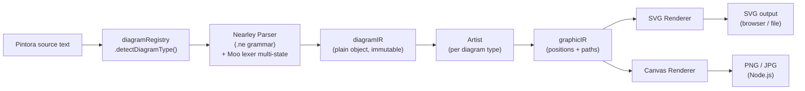
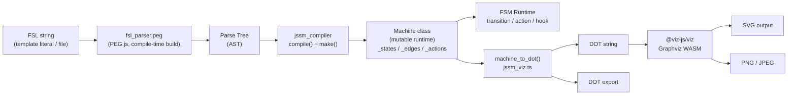
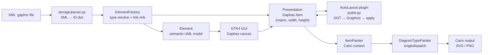
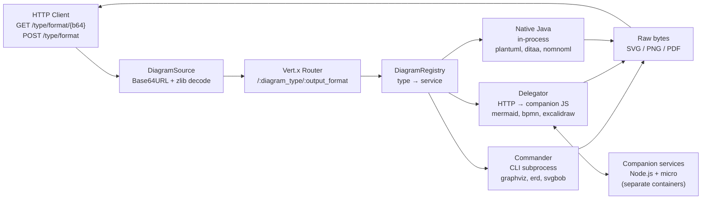

# Diagram Tooling Weekly Scan — 2026-06-01

## Executive Summary

- **Pintora** (TS, Nearley+Moo) và **jssm** (TS, PEG.js+Graphviz WASM) đại diện hai triết lý DSL khác nhau:
  Pintora dùng grammar multi-state cho nhiều diagram type với two-layer IR (semantic → graphic);
  jssm đảm bảo diagram không diverge khỏi runtime bằng cách dùng cùng FSL string cho cả hai.
- **Gaphor** (Python 3.12, Cairo) là reference implementation hiếm của dual Presentation/Element model —
  tách semantic UML model khỏi visual layer — với auto-layout via Graphviz plugin.
- **Kroki** (Java/Vert.x) là gateway pattern đáng tham khảo: 3 executor types
  (Commander/Delegator/Native) thống nhất 25+ format sau 1 HTTP API mà không reimplements rendering.

## Table of Contents

1. [hikerpig/pintora](#1-hikerpigpintora) — plugin-based text-to-diagram, Nearley grammar, two-layer IR
2. [StoneCypher/jssm](#2-stonecypherjssm) — FSM viz với custom FSL DSL, PEG.js, Graphviz WASM
3. [gaphor/gaphor](#3-gaphorgaphor) — UML/SysML modeling tool, dual model, Cairo rendering
4. [yuzutech/kroki](#4-yuzutechkroki) — multi-format diagram gateway, 3 executor types

---

## Candidate Pool — 8 repos đã scan (2026-05-25 → 2026-06-01)

| Repo | Stars | Lang | Pushed | Điểm nổi bật |
|------|------:|------|--------|--------------|
| plantuml/plantuml | 13 053 | Java | 2026-06-01 | Established leader, commit hàng ngày |
| **hikerpig/pintora** | 1 283 | TypeScript | 2026-05-28 | Plugin arch, 2-layer IR, Nearley grammar |
| **StoneCypher/jssm** | 367 | TypeScript | 2026-05-30 | FSL DSL + PEG.js + Graphviz WASM |
| **gaphor/gaphor** | 2 240 | Python | 2026-06-01 | Full UML metamodel, dual model, Cairo |
| **yuzutech/kroki** | 4 161 | Java | 2026-05-31 | 25+ format gateway, 3 executor types |
| ajstarks/decksh | 88 | Go | 2026-05-31 | DSL scripting cho presentation viz |
| le5le-com/meta2d.js | 1 197 | TypeScript | 2026-06-01 | 2D engine real-time SCADA/IoT diagram |
| cisco-open/network-sketcher | 361 | Python | 2026-06-01 | AI-ready network design tool + MCP |

*Loại trừ*: reaviz/reagraph (WebGL graph, không phải diagram-as-code DSL);
DeusData/codebase-memory-mcp (code intelligence MCP, không diagram tool).

---

## 1. hikerpig/pintora

### §1 — Quick Context

**One-line pitch**: Library text-to-diagram extensible qua plugin — tách parser và renderer thành 2 component độc lập, swap renderer (SVG/Canvas) mà không đụng đến parser.

- **Tech stack**: TypeScript 6.0, monorepo pnpm 9 + Turbo 2, Nearley + Moo tokenizer, Jest 30, SWC compiler
- **Output formats**: SVG hoặc Canvas (browser); PNG / JPG / SVG (Node.js)
- **Repo health**: 1 283 ⭐, active CI, VS Code extension có syntax highlight + live preview
  — recent commits: TypeScript 6 upgrade, rollupdown bundler, pintora-harness test framework (2026-05)
- **Distribution**: npm (`@pintora/core`, `@pintora/diagrams`, `@pintora/cli`, `@pintora/standalone`)

### §2 — Architecture Deep-Dive

#### A. Component Inventory

| Module | Path | Vai trò |
|--------|------|---------|
| `diagramRegistry` | `packages/pintora-core/src/index.ts` | Registry trung tâm: đăng ký diagram type với parser + artist |
| `configEngine` / `configApi` | `packages/pintora-core/src/` | Config management, per-diagram defaults |
| `themeRegistry` | `packages/pintora-core/src/` | CSS-like theming per diagram type |
| `symbolRegistry` | `packages/pintora-core/src/` | Custom shape / icon definitions |
| Nearley grammar `.ne` | `packages/pintora-diagrams/src/*/parser/*.ne` | Grammar definition cho từng diagram type |
| Artist implementations | `packages/pintora-diagrams/src/*/artist.ts` | Convert `diagramIR` → `graphicIR` |
| `@pintora/cli` | `packages/pintora-cli/` | Node.js CLI entry point |
| `@pintora/standalone` | `packages/pintora-standalone/` | Browser-ready single bundle |

#### B. Pipeline / Control Flow

1. User chạy `pintora -i foo.pintora -o foo.svg`
2. CLI đọc file text, gọi `parseAndDraw(text, options)` trong `pintora-core`
3. `diagramRegistry.detectDiagramType(text)` khớp header token với registered type
4. Nearley parser của diagram type (`.ne` grammar + Moo lexer) chạy → produce `diagramIR`
5. Artist của diagram type nhận `diagramIR` → tính layout → produce `graphicIR`
6. Renderer (SVG hoặc Canvas) nhận `graphicIR` → serialize ra bytes
7. File output ghi ra disk

#### C. Data Model / Intermediate Representation

Kiến trúc **hai lớp IR** — điểm đặc trưng của pintora:

- **`diagramIR`**: Semantic IR — actors, signals, entities tùy diagram type. Plain object, **immutable** sau parsing. Ví dụ sequence diagram: `[{type:'addActor', actor:'Alice'}, {type:'addSignal', from:'Alice', to:'Bob', msg:'Hello'}]`.
- **`graphicIR`**: Graphic IR — positions, sizes, bezier paths sau layout computation. Output của Artist.

Không có multi-pass compilation. Artist transform `diagramIR → graphicIR` trong một pass đơn. Không có lower-level IR (khác D2/TALA).

#### D. Input Language Design

- **Parser approach**: Nearley PEG-like grammar (`.ne` files) + **Moo lexer multi-state**
- Moo lexer có 4 state: `main`, `line`, `configStatement`, `noteState` — switch state theo context token
- Grammar output: array semantic action objects với field `type` — approach "interpreter" không phải AST tree
- Mỗi diagram type có grammar riêng biệt, không shared grammar
- **Error reporting**: không xác định — Nearley có built-in recovery nhưng pintora chưa document error surface ra user

#### E. Layout Algorithm

- Không xác định từ code đọc được trực tiếp
- Sequence diagram: rất có thể manual layout (dọc time axis) — không cần graph layout
- ER / Component diagram: có thể dùng dagre hoặc tương tự (evidence chưa confirm)

#### F. Rendering / Output Strategy

- **Backends**: SVG (browser native API), Canvas 2D (browser), PNG/JPG (Node.js via `canvas` package)
- **Animation**: không có evidence
- **Pattern**: pluggable renderer — renderer được chọn qua `options.renderer`, Artist không biết renderer cụ thể nào

#### G. Extensibility

- Plugin = 1 parser + 1 artist, đăng ký qua `diagramRegistry.register(type, {parser, artist})`
- `symbolRegistry` cho custom shapes / icons
- `themeRegistry` cho custom themes với CSS-like config syntax
- Plugin có thể phân phối như npm package độc lập

#### H. Dev Experience

- VS Code extension: syntax highlighting + live preview
- `@pintora/cli` CLI
- Hot-reload / watch mode: không xác định
- Browser REPL qua website/demo

### §3 — Architecture Diagram

### §4 — Verdict

**Đáng học cho kymostudio**:
- **Two-layer IR (diagramIR → graphicIR)**: tách semantic parsing khỏi layout — nếu kymo muốn support nhiều layout engine, pattern này cần thiết
- **Multi-state Moo lexer**: elegant solution cho DSL có context-sensitive tokens (e.g., `config {}` block vs diagram content)
- **Plugin registration contract** (parser + artist pair): minimal interface — áp dụng ngay cho kymo plugin system nếu có
- **Nearley grammar per diagram type**: mỗi diagram type tự manage grammar của mình — good separation of concerns

**Red flags**: Layout algorithm trong Artist không transparent — có thể tạo debt nếu Artist vừa layout vừa render. Error surface chưa rõ.

**Open questions**: Pintora dùng layout library nào cho ER/Component diagram? Artist có stateless không?

**Verdict**: **Study deeper** — đặc biệt là plugin registration pattern, two-layer IR design, và Moo multi-state lexer implementation.

---

## 2. StoneCypher/jssm

### §1 — Quick Context

**One-line pitch**: FSM library với PEG grammar tự xây (FSL) — cùng 1 string vừa là runtime definition vừa là diagram source, không thể diverge.

- **Tech stack**: TypeScript, PEG.js (compile-time parser gen), `@viz-js/viz` (Graphviz WASM), Lit (Web Components), Vitest
- **Output formats**: SVG, PNG, JPEG, DOT
- **Repo health**: 367 ⭐, v5.141.0, 6 450 tests @ 100% line coverage, pushed 2026-05-30
  — recent activity: Web Component layer mới (machine-to-DOM binding, declarative hooks, viz-parent-binding)
- **Distribution**: npm multi-export (`jssm`, `jssm/viz`, `jssm/wc`), CDN IIFE bundle, Deno

### §2 — Architecture Deep-Dive

#### A. Component Inventory

| Module | Path | Vai trò |
|--------|------|---------|
| `fsl_parser.peg` | `src/ts/fsl_parser.peg` | PEG grammar 400+ rules cho FSL DSL |
| `jssm.ts` | `src/ts/jssm.ts` | Machine class: runtime FSM engine |
| `jssm_viz.ts` | `src/ts/jssm_viz.ts` | Visualization: Machine → DOT → SVG |
| `jssm_types.ts` | `src/ts/jssm_types.ts` | TypeScript type definitions |
| `jssm_theme.ts` | `src/ts/jssm_theme.ts` | Theme system |
| `jssm_arrow.ts` | `src/ts/jssm_arrow.ts` | Arrow type handling (3 kinds) |
| `jssm_viz_wc.ts` | `src/ts/wc/jssm_viz_wc.ts` | Lit Web Component `<jssm-viz>` / `<fsl-viz>` |
| `jssm_bind_wc.ts` | `src/ts/wc/jssm_bind_wc.ts` | Machine-to-DOM projection binding |
| `dispatcher.ts` | `src/ts/cli/dispatcher.ts` | CLI plugin dispatcher |
| `fsl-render.ts` | `src/ts/cli/fsl-render.ts` | CLI binary: `fsl-render` |

#### B. Pipeline / Control Flow

1. User viết `` sm`Red -> Green -> Yellow -> Red;` `` hoặc `fsl-render foo.fsl`
2. `sm` template tag gọi `parse(fslString)` từ `fsl_parser.js` (PEG-generated tại build time)
3. PEG parser trả AST → `compile(ast)` tạo `Machine` instance
4. `Machine` lưu: `_states: Map`, `_edges: JssmTransition[]`, `_actions: Map`
5. Để visualize: `machine_to_dot(machine)` → Graphviz DOT string
6. `dot_to_svg(dotString, vizInstance)` gọi `@viz-js/viz` (Graphviz compiled to WASM)
7. SVG string trả về — inject vào DOM hoặc save file

#### C. Data Model / Intermediate Representation

- **Runtime IR**: `Machine` class — **mutable** (state thay đổi khi transition)
  - `_states: Map<StateType, JssmState>` — state configs, styling, completeness flags
  - `_edges: JssmTransition[]` — từng transition với from/to/action/arrow-type
  - `_actions: Map<string, number[]>` — action name → edge indices
  - Hooks infrastructure: nested Maps để tránh string concat overhead
- **Viz IR**: DOT string (intermediate) — không có separate graphic IR; Graphviz tự xử lý layout
- Không có compile-to-lower-IR step (Graphviz là layout engine duy nhất)

#### D. Input Language Design

- **Parser approach**: **PEG.js** (compile-time) — `fsl_parser.peg` được compile thành `fsl_parser.js` lúc build, không parse tại runtime
- **Grammar complexity**: Moderate-to-high — 400+ rules:
  - 3 arrow types: `->` (legal), `=>` (main path), `~>` (forced) + reverse + unicode aliases
  - SVG color palette terminals, hex/binary/octal numeric formats, time unit terminals
  - State declarations với styled properties, configuration blocks
- **Error reporting**: Duplicate decoration detection với `error()` kèm location info — limited nhưng present

#### E. Layout Algorithm

- **Hoàn toàn delegate cho Graphviz** via `@viz-js/viz` (Graphviz compiled to WASM)
- Control từ jssm: `rankdir` (flow direction), `rank=same/min/max` (subgraph ranking)
- Edge routing: Graphviz default spline — không có custom routing
- **Bidirectional edge folding**: `A -> B` và `B -> A` được gộp thành edge `dir=both` — tránh double edge
- Không có custom layout algorithm nào trong codebase

#### F. Rendering / Output Strategy

- **Backend**: `@viz-js/viz` = Graphviz compiled to WebAssembly — chạy trong browser và Node.js
- **Output formats**: SVG (native Graphviz SVG), PNG/JPEG (via canvas), DOT (raw export)
- **Animation**: không có
- **Web Component**: `<jssm-viz>` Lit element — reactive khi FSL string thay đổi, `<jssm-bind>` cho DOM projection

#### G. Extensibility

- Theme system qua `jssm_theme.ts` — per-state và global theming
- CLI plugin dispatcher: thêm render target mới = thêm plugin subcommand
- Chỉ có 1 diagram type (state machine) — không có diagram type plugin system

#### H. Dev Experience

- CLI `fsl` / `fsl-render` với plugin-based dispatch
- Web Component `<jssm-viz>` ready-to-embed
- 100% test coverage là safety net mạnh
- Deno support, CDN bundle
- Watch mode: không xác định

### §3 — Architecture Diagram

### §4 — Verdict

**Đáng học cho kymostudio**:
- **"Same string as runtime and diagram"** design principle — nếu kymo có state diagram feature, enforce constraint này ngay từ đầu
- **PEG.js compile-time parser**: type-safe, fast runtime, grammar versioned cùng code — tốt hơn regex parsing
- **Graphviz WASM pattern** (`@viz-js/viz`): layout quality của Graphviz chạy trong browser, không cần server — copy pattern này nếu kymo cần auto-layout
- **Bidirectional edge folding**: implementation detail trong `jssm_viz.ts` đáng đọc kỹ — xử lý elegant cho graph không có multi-edge
- **Lit Web Component layer**: pattern decouples visualization từ framework — `<jssm-viz>` works trong React/Vue/Svelte

**Red flags**: Graphviz WASM ~2-3MB gzip — heavy cho web bundle. Chỉ 1 diagram type = limited scope.

**Open questions**: PEG.js grammar có thể extend thêm diagram type không, hay phải fork? `@viz-js/viz` version pinning strategy?

**Verdict**: **Study deeper** — đặc biệt là FSL grammar design (3 arrow types), PEG compile-time approach, và Graphviz WASM integration.

---

## 3. gaphor/gaphor

### §1 — Quick Context

**One-line pitch**: Modeling tool Python với full UML 2 metamodel — không chỉ draw, mà model-aware: relationship traversal, constraint validation, multi-diagram consistency.

- **Tech stack**: Python 3.12+, Gaphas ≥5.1 (diagram canvas), PyCairo ≥1.22 (rendering), PyGObject ≥3.56 (GTK4), pydot (auto-layout via Graphviz)
- **Output formats**: Không xác định rõ (likely SVG/PNG qua Cairo export)
- **Repo health**: 2 240 ⭐, v3.3.2, pytest + mypy + ruff, pushed 2026-06-01 (active)
- **Distribution**: Flatpak (Flathub), PyPI, macOS native installer, Windows installer

### §2 — Architecture Deep-Dive

#### A. Component Inventory

| Module | Path | Vai trò |
|--------|------|---------|
| `base.py` | `gaphor/core/modeling/base.py` | Base element với property system |
| `element.py` | `gaphor/core/modeling/element.py` | Semantic model node (UML Element) |
| `presentation.py` | `gaphor/core/modeling/presentation.py` | Visual layer node (Gaphas Item) |
| `diagram.py` | `gaphor/core/modeling/diagram.py` | Diagram container (owns Presentations) |
| `elementfactory.py` | `gaphor/core/modeling/elementfactory.py` | Factory: create + ID management |
| `elementdispatcher.py` | `gaphor/core/modeling/elementdispatcher.py` | Property change event dispatch |
| `painter.py` | `gaphor/diagram/painter.py` | ItemPainter + DiagramTypePainter (Cairo) |
| `shapes.py` | `gaphor/diagram/shapes.py` | Shape primitives với Layout text class |
| `text.py` | `gaphor/diagram/text.py` | Text layout (PangoCairo text sizing) |
| `pydot.py` | `gaphor/plugins/autolayout/pydot.py` | AutoLayout: DOT → Graphviz → apply positions |
| `parser.py` | `gaphor/storage/parser.py` | XML file format loader (`.gaphor` files) |
| `UML/`, `SysML/`, `C4Model/` | `gaphor/UML/`, etc. | Metamodel implementations |
| `ipython.py` | `gaphor/extensions/ipython.py` | Jupyter notebook API |

#### B. Pipeline / Control Flow

1. User mở Gaphor → tạo diagram mới hoặc load `.gaphor` XML file
2. `parser.py` parse XML → dict `{id: ElementObject}` với `values` + `references`
3. `ElementFactory.create()` instantiate typed Elements + Presentations, link references
4. User drag-drop shapes lên Gaphas canvas → tạo Presentation items linked to Elements
5. *(Optional)* User trigger Auto Layout → `AutoLayout.layout(diagram)`:
   a. `diagram_as_pydot()` traverse Presentations → Graphviz DOT
   b. Chạy `dot` subprocess → parse output positions (bounding boxes, edge paths)
   c. `apply_layout()` update `matrix`, `width`, `height`, `handle.pos` của từng Presentation
6. Gaphas triggers redraw → `ItemPainter.paint()` với Cairo context
7. Mỗi item vẽ qua `item.draw(DrawContext)` — DrawContext chứa Cairo ctx + computed style + selection state

#### C. Data Model / Intermediate Representation

**Dual model** — thiết kế cốt lõi của gaphor:

- **`Element`** (`gaphor/core/modeling/element.py`): Semantic node — `UML.Class`, `UML.Association`, etc. Theo UML 2 metamodel. Quan hệ được typed (not free-form).
- **`Presentation`** (`gaphor/core/modeling/presentation.py`): Visual node — `ClassItem`, `AssociationItem`, etc. Subclass Gaphas `Item`. Có `matrix` (2D transform), `width`, `height`.
- Hai layer **mutable** và **độc lập** — 1 Element có thể có nhiều Presentations (diagram views)

**Storage IR**: XML `.gaphor` files, namespace `https://gaphor.org/`. Load thành `{id: ElementObject}` dict với:
- `values: {name: str}` — primitive attributes
- `references: {name: id | [id]}` — relationships (resolved sau load)

**Auto-layout IR**: Graphviz DOT string (trung gian) — không có persistent graphic IR.

#### D. Input Language Design

- **Không có text DSL** — Gaphor là GUI/visual tool, không diagram-as-code
- Input qua: GTK4 GUI drag-drop, hoặc Python API (Jupyter): `element_factory.create(UML.Class)`
- File format: XML với UML/SysML metamodel — schema version "3.0" và "4"
- Load: XML → parse → typed Element/Presentation instances

#### E. Layout Algorithm

- **Auto-layout**: Graphviz `dot` program qua pydot — **optional plugin** (`gaphor/plugins/autolayout/`)
- Algorithm: Graphviz `dot` (hierarchical ranking, Sugiyama-style)
- Edge routing: `polyline` (default) hoặc `ortho` (orthogonal strict H/V lines)
- Positions từ Graphviz → `apply_layout()` với coordinate matrix transform để handle parent-child relationships
- `segment.split_segment()` / `merge_segment()` để adjust edge handle count theo path points
- Manual positioning là chính — auto-layout là optional

#### F. Rendering / Output Strategy

- **Backend**: PyCairo exclusive — không có pluggable renderer
- **Painter pattern**: `ItemPainter` cho generic items; `DiagramTypePainter` dùng Python `singledispatch` cho type-specific rendering adornments
- `DrawContext` object: Cairo context + computed style (CSS-like) + selection flags (selected/focused/hovered/dropzone)
- Text layout: `Layout` class trong `text.py` dùng PangoCairo cho text sizing và wrapping
- **Animation**: không có
- **Export**: không xác định rõ từ code đọc được

#### G. Extensibility

- Plugin service architecture (`gaphor/plugins/`) — auto-layout là service plugin
- Thêm metamodel: subclass `Diagram`, define new `Element` subclasses
- Thêm visual items: implement `Presentation` subclasses
- CSS-like styling qua `StyleSheet` service
- Python `singledispatch` cho render dispatch — easy to extend per element type

#### H. Dev Experience

- GUI application — không phải CLI tool
- Jupyter notebook integration qua `ipython.py` extension
- pytest + mypy + ruff — chặt
- Platform: Linux (GTK), macOS, Windows (Flatpak/native)

### §3 — Architecture Diagram

### §4 — Verdict

**Đáng học cho kymostudio**:
- **Dual Element/Presentation model**: nếu kymo diagram có business logic (e.g., validate connections, check cardinality), pattern tách semantic từ visual là cần thiết — đừng lưu business data trong visual node
- **`singledispatch` DiagramTypePainter**: elegant pattern cho type-based render dispatch, áp dụng trong TypeScript bằng discriminated unions + switch
- **`apply_layout()` + coordinate matrix**: chi tiết implementation convert Graphviz node bounding boxes → canvas coordinates, đặc biệt phần xử lý parent-child transform, đáng đọc trực tiếp trong `pydot.py`
- **Auto-layout as optional plugin**: tốt hơn hardcode — user không muốn bị forced layout khi họ đã arrange thủ công

**Red flags**: PyCairo exclusive → không portable sang web. Không có text DSL → limited relevance cho diagram-as-code workflow của kymostudio. GUI app overhead.

**Open questions**: Gaphor export SVG qua Cairo như thế nào? Có maintain aspect ratio không khi auto-layout?

**Verdict**: **Glance only** — đọc `pydot.py` (auto-layout apply), `painter.py` (singledispatch pattern), skip GTK/Cairo specifics.

---

## 4. yuzutech/kroki

### §1 — Quick Context

**One-line pitch**: HTTP gateway thống nhất 25+ diagram format sau 1 API — tích hợp diagram rendering mà không cần embed library, chỉ cần HTTP call.

- **Tech stack**: Java 11+ / Vert.x (async event-driven), Maven; companion JavaScript microservices (Node.js + `micro` framework); Docker / Docker Compose
- **Output formats**: tuỳ backend — SVG, PNG, PDF, Base64, TXT, UTXT
- **Repo health**: 4 161 ⭐, pushed 2026-05-31, MIT license, CI via GitHub Actions
- **Distribution**: Docker images (`yuzutech/kroki` + optional companion containers), self-hosted

### §2 — Architecture Deep-Dive

#### A. Component Inventory

| Module | Path | Vai trò |
|--------|------|---------|
| `Server.java` | `server/src/.../Server.java` | Vert.x main verticle, HTTP router + lifecycle |
| `DiagramRegistry` | `server/src/.../` | Map diagram_type → service implementation |
| `DiagramSource.java` | `server/src/.../decode/DiagramSource.java` | Decode Base64URL + zlib → plain text |
| `Plantuml.java` | `server/src/.../service/Plantuml.java` | PlantUML service (native Java) |
| `Graphviz.java` | `server/src/.../service/Graphviz.java` | Graphviz service (Commander CLI) |
| `companion/mermaid/` | `companion/mermaid/` | Node.js microservice wrap Mermaid.js |
| `companion/bpmn/` | `companion/bpmn/` | Node.js microservice wrap bpmn-io |
| `companion/excalidraw/` | `companion/excalidraw/` | Node.js microservice wrap Excalidraw |
| `companion/vega/` | `companion/vega/` | Node.js microservice wrap Vega/Vega-Lite |

#### B. Pipeline / Control Flow

1. Client gửi `POST https://kroki.io/mermaid/svg` với body là Mermaid source text
   HOẶC `GET https://kroki.io/mermaid/svg/{base64url_zlib_encoded_source}`
2. `DiagramSource.decode()`: URL-safe Base64 decode → zlib decompress → plain text source
   (PlantUML: có riêng PlantUML transcoder + fallback Base64+zlib)
3. `Server` router match `/:diagram_type/:output_format` → dispatch đến service class tương ứng
4. Service thực thi theo executor type:
   - **Commander**: spawn `graphviz -Tsvg` subprocess, capture stdout
   - **Delegator**: HTTP call đến companion Node.js service (port cố định), await response
   - **Native Java**: gọi PlantUML / Ditaa / Nomnoml Java library in-process
5. PlantUML service: sanitize `!include` directives → wrap `@startuml..@enduml` nếu thiếu → `vertx.executeBlocking()`
6. Raw bytes kết quả → HTTP response với Content-Type header đúng

#### C. Data Model / Intermediate Representation

- **Không có shared IR** — mỗi backend xử lý format input/output riêng của mình
- Request: `{diagram_type, output_format, source_text}` — pass-through
- Response: raw bytes với MIME type
- **Encoding scheme**: GET → URL-safe Base64 + zlib deflate; POST JSON → `{diagram_source, diagram_type, output_format}`; POST plain text → Content-Type + Accept headers

#### D. Input Language Design

- **Không có DSL riêng** — Kroki pass-through nguyên source text đến từng backend
- Encoding layer (Base64+zlib) để embed diagram source trong URL — compact + shareable
- PlantUML decode phức tạp: riêng PlantUML transcoder + fallback về Base64+zlib nếu fail

#### E. Layout Algorithm

- **Hoàn toàn delegate** cho từng backend — Kroki không có layout code
- Graphviz layout → Graphviz `dot` CLI; Mermaid layout → Mermaid.js (companion); PlantUML → PlantUML Java lib

#### F. Rendering / Output Strategy

- **Multi-backend fan-out**: 3 executor patterns
  1. **Commander** (CLI subprocess): graphviz, erd, svgbob, umlet, blockdiag family — blocking, isolates process
  2. **Delegator** (async HTTP → companion): mermaid, bpmn, excalidraw, diagramsnet, vega — non-blocking, isolates JS runtime
  3. **Native Java** (in-process): plantuml, ditaa, structurizr, nomnoml, symbolator — fastest, no subprocess
- Vert.x `executeBlocking()` cho blocking operations (Commander, Native) — không block event loop
- PlantUML: `!include` whitelist sanitization, detect embedded Ditaa blocks, delegate accordingly

#### G. Extensibility

- Thêm format mới: implement `DiagramService` interface, đăng ký trong `DiagramRegistry`
- Thêm JS library: tạo companion Node.js service mới, expose HTTP; Kroki Delegator gọi qua HTTP
- Docker Compose: companion services optional, enable via env var

#### H. Dev Experience

- API rất đơn giản: URL encodes diagram, output format là path segment
- Health check: `/health`, `/healthz`
- Metrics: `/metrics`
- Docker-based local dev
- Không có SDK — pure HTTP API

### §3 — Architecture Diagram

### §4 — Verdict

**Đáng học cho kymostudio**:
- **3-executor pattern (Commander / Delegator / Native)**: nếu kymo muốn support nhiều rendering backend (WASM, CLI, in-process), pattern này scale tốt và tách isolation concern ra khỏi business logic
- **Base64URL + zlib URL encoding**: elegant cho shareable diagram link — kymo có thể dùng cùng scheme cho share-by-URL feature, client-side encode với pako.js
- **Companion microservice pattern**: cách isolate JS diagram lib (Mermaid, Excalidraw) khỏi main server process — áp dụng ngược: isolate heavy WASM rendering khỏi main Node.js event loop của kymo
- **`DiagramService` interface**: minimal contract (source + format → bytes) — good boundary cho abstraction layer

**Red flags**: Pass-through architecture → Kroki không understand nội dung diagram, không validate, không transform. Security: `!include` whitelist fragile — potential bypass vectors. Companion microservice thêm ops complexity.

**Open questions**: Latency profile của Delegator (HTTP round-trip) so với Commander (subprocess spawn)? Có cache rendered diagram không?

**Verdict**: **Glance only** — study Base64+zlib URL encoding scheme và 3-executor pattern, bỏ qua Java/Vert.x specifics.

---

*Generated: 2026-06-01 | Scope: pushed ≥ 2026-05-25, stars ≥ 50 | By: kymostudio research scout*
