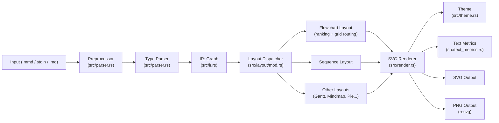
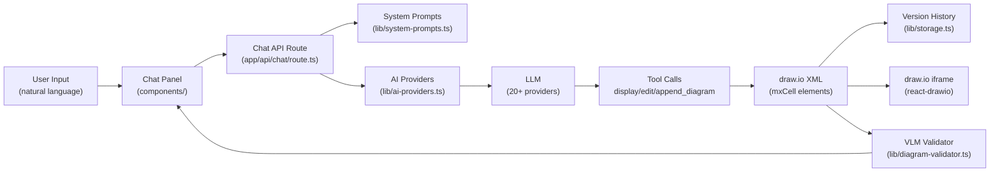
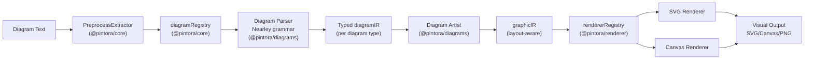
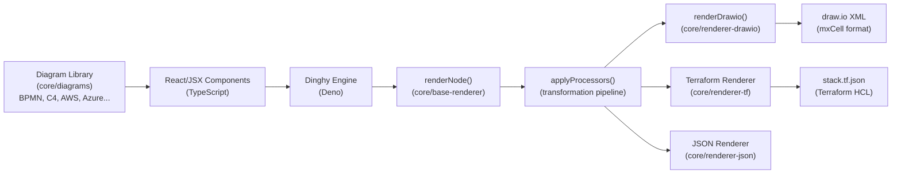

# Weekly Diagram Tooling Research — 2026-06-02

## Executive Summary

- **Xu huong hot nhất tuần này**: Rust đang thay thế browser-based Mermaid rendering — `mermaid-rs-renderer` đạt tốc độ 439–1600x so với mermaid-cli bằng cách implement toàn bộ parse → IR → layout → SVG pipeline trong native Rust, loại bỏ hoàn toàn Chromium/Node.js overhead.
- **Hướng mới đáng chú ý**: LLM-first diagram creation đang mature hoá — `next-ai-draw-io` (30k stars) đã giải quyết bài toán streaming XML generation, multi-step tool call, và VLM-based validation; pattern này có thể áp dụng trực tiếp vào kymostudio nếu muốn tích hợp AI generation.
- **Recommendation cho kymostudio**: Nghiên cứu kỹ `dinghy` (React-as-DSL → draw.io XML) và `pintora` (extensible plugin-based diagram library với Nearley grammar) — cả hai đều giải quyết bài toán extensibility và multi-format output mà kymostudio sẽ cần khi mở rộng beyond BPMN.

## Table of Contents

1. [mermaid-rs-renderer — 1jehuang/mermaid-rs-renderer](#mmdr)
2. [next-ai-draw-io — DayuanJiang/next-ai-draw-io](#nextaidrawio)
3. [Pintora — hikerpig/pintora](#pintora)
4. [Dinghy — dinghydev/dinghy](#dinghy)

---

## 1. mermaid-rs-renderer (mmdr) — 1jehuang/mermaid-rs-renderer {#mmdr}

### §1 — Quick Context

Thư viện và CLI viết bằng Rust, reimplementing toàn bộ Mermaid rendering pipeline mà không dùng browser, Node.js, hay Puppeteer. Đây là dự án kỹ thuật thuần túy nhắm vào performance bottleneck của mermaid-cli.

- **One-line pitch**: Rust-native Mermaid renderer loại bỏ 2-3 giây browser startup — từ 1971ms xuống còn 4ms cho một flowchart.
- **Tech stack**: Rust 82%, Python (benchmark scripts); output: SVG + PNG (`resvg`/`usvg`); phân phối qua Cargo, Homebrew, Scoop, AUR.
- **Repo health**: 1.4k stars, 64 forks, 24 open issues, release v0.2.2 (April 23 2026), commit gần nhất May 7 2026. CI/tests: criterion benchmarks.
- **Distribution**: Binary (`mmdr` CLI), Rust crate (`mermaid-rs-renderer`), optional features `cli` và `png`.

### §2 — Architecture Deep-Dive

**A. Component Inventory**

- `Parser` (`src/parser.rs`) — recursive descent + regex tokenizer, nhận raw Mermaid text, output `ParseOutput` chứa typed IR.
- `IR` (`src/ir.rs`) — intermediate representation trung tâm: `Graph` struct chứa nodes, edges, subgraphs và diagram-specific data (24 `DiagramKind` variants).
- `Layout` (`src/layout/mod.rs`) — dispatcher: chọn layout algorithm theo `DiagramKind`, gồm `compute_flowchart_layout()`, `compute_sequence_layout()`, `compute_gantt_layout()`, `compute_mindmap_layout()`, v.v.
- `Renderer` (`src/render.rs`) — SVG string generator, nhận `Layout` + `Theme`, xuất SVG markup.
- `Theme` (`src/theme.rs`) — 33-field struct, preset `mermaid_default()` và `modern()`, hỗ trợ dynamic color adjustment qua HSL.
- `TextMetrics` (`src/text_metrics.rs`) — font measurement module; hỗ trợ `--fastText` mode cho ASCII fallback.
- `UnicodeWidth` (`src/unicode_width.rs`) — CJK và emoji width estimation.
- `CLI` (`src/cli.rs`) — clap-based argument parser; hỗ trợ stdin, file, markdown extraction.
- `Config` (`src/config.rs`) — JSON/JSON5 config loader cho `themeVariables`.
- `Validator` (`src/validator.rs`) — validation trước render.
- `EdgeGeometry` (`src/edge_geometry.rs`) — coordinate math cho edge routing.

**B. Pipeline / Control Flow**

1. User gọi `mmdr -i diagram.mmd -o output.svg`
2. `cli.rs` parse args, đọc input (file, stdin, hoặc extract từ Markdown fence blocks)
3. `parser.rs` xác định diagram type qua header regex (`/^\s*flowchart/`, etc.), gọi type-specific sub-parser, output `ParseOutput` (IR `Graph`)
4. `layout/mod.rs` dispatch đến algorithm phù hợp (ví dụ `compute_flowchart_layout()` cho flowchart)
5. `render.rs` nhận `Layout` struct, generate SVG string; nếu output PNG thì pipe qua `resvg`
6. Write SVG/PNG ra file hoặc stdout

**C. Data Model / Intermediate Representation**

`Graph` struct là IR duy nhất, immutable sau parse, mutable trong layout pass. Fields:
- `nodes: Vec<Node>` — id, label, shape (17 variants: `Rect`, `Round`, `Diamond`, etc.), value, icon
- `edges: Vec<Edge>` — from, to, label, style, arrowhead type
- `subgraphs: Vec<Subgraph>` — grouping với nested direction
- `diagram_data: DiagramData` enum — variant per diagram type (SequenceFrame, GanttTask, PieSlice, C4Shape, MindmapNode, GitGraphCommit, XYChartData, ...)
- `direction: Direction` — TD/BT/LR/RL

Không có "compile to lower IR" — layout pass thêm position data vào một `Layout` struct riêng (không mutate `Graph`).

**D. Input Language Design**

- **Parser approach**: Recursive descent với Lazy-compiled regex patterns (`once_cell::Lazy`). Không dùng parser generator.
- **Formal grammar**: Không có BNF/EBNF formal — pattern matching trực tiếp trên lines.
- **Preprocessing**: `preprocess_input()` strip comments, YAML frontmatter, `%%{init:...}%%` directives trước parse.
- **Error reporting**: `anyhow::Result` — errors như "unknown or missing Mermaid diagram header", "invalid flowchart edge syntax", "invalid Mermaid init directive: could not parse JSON/JSON5". Errors reported sớm, tại preprocessing và validation phases.

**E. Layout Algorithm**

- **Flowchart/Class/State/ER**: Ranking-based hierarchical layout (`assign_positions()`), edge routing với grid-based pathfinding (`build_routing_grid()`), obstacle avoidance, `EdgeOccupancy` cho multi-edge offset.
- **Sequence**: Timeline-based (`compute_sequence_layout()`).
- **Mindmap**: Tree layout với cubic B-spline edges (d3 basis curve algorithm).
- **Gantt/Kanban/Treemap**: Specialized algorithms per type.
- **Edge routing**: Orthogonal grid routing với collision detection, "reserved label corridors".
- **Crossing minimization**: Không rõ có hay không — không xác định.
- **Aspect ratio**: Iterative scaling up to 6 passes.

**F. Rendering / Output Strategy**

- **Backends**: SVG (primary, string generation), PNG (qua `resvg 0.47`/`usvg 0.47`).
- **SVG approach**: Direct string generation — `points_to_path()` (M/L commands), `basis_curve_path()` (B-spline), `arrowhead_svg()`, `edge_decoration_svg()`.
- **Animation**: Không có.
- **Shape sorting**: Treemaps by area, others by insertion order.
- **Marker definitions**: Pre-generated SVG markers cho arrowhead variants (sequence, state, class diagrams).
- **Pluggable emitter**: Không — single render path per diagram type.

**G. Extensibility**

- Thêm diagram type mới: cần modify `DiagramKind` enum, thêm sub-parser, thêm layout function, thêm render path — không có plugin system.
- Theme: Customizable qua JSON config (`themeVariables`), hoặc subclass `Theme` struct.
- Không có icon system hay shape plugin.

**H. Dev Experience**

- CLI với stdin support, markdown block extraction, `--dumpLayout` (JSON debug), `--timing` (per-stage perf metrics).
- Watch mode: Không có.
- IDE integration: Không có.
- Browser preview: Không có.
- Benchmark: `criterion` crate cho performance regression testing.

### §3 — Architecture Diagram

### §4 — Verdict

**Điểm đáng học cho kymostudio**:
- Kiến trúc parse → typed IR → dispatch-by-kind → render là pattern sạch, dễ mở rộng khi thêm diagram type mới.
- `--dumpLayout` (export layout JSON) là kỹ thuật debugging xuất sắc — nên áp dụng cho kymostudio để debug layout engine.
- Grid-based edge routing với `EdgeOccupancy` cho orthogonal paths là implementation đáng đọc source.
- `--timing` flag cho per-stage performance measurement — good practice cho production tooling.

**Red flags**: Không có formal grammar → parser sẽ khó maintain khi thêm syntax phức tạp. Không có plugin system → mỗi diagram type mới cần fork code. Đang ở v0.2.x, còn "early stage".

**Open questions**: Crossing minimization có được implement không? Hierarchy vs force-directed có thể swap không?

**Verdict**: **Study deeper** — đặc biệt phần layout và grid routing cho edge drawing. Source code Rust rất readable.

---

## 2. next-ai-draw-io — DayuanJiang/next-ai-draw-io {#nextaidrawio}

### §1 — Quick Context

Web application tích hợp LLM với draw.io, cho phép người dùng tạo và chỉnh sửa diagram thông qua natural language. Đây là implementation production-grade nhất trong không gian AI-assisted diagram creation.

- **One-line pitch**: LLM sinh draw.io XML qua streaming tool calls với VLM validation — 13+ providers, hỗ trợ cloud architecture diagram chuyên biệt.
- **Tech stack**: Next.js 16, React 19, TypeScript; Vercel AI SDK; react-drawio (iframe embedding); Langfuse (observability); Biome (linting); Vitest + Playwright (test).
- **Repo health**: 30.6k stars, 3.2k forks, 126 open issues, v0.4.16 (May 21 2026), commit gần nhất May 21 2026. CI: Playwright e2e + Vitest unit tests.
- **Distribution**: Vercel deploy, Cloudflare Workers, Docker, Electron desktop app.

### §2 — Architecture Deep-Dive

**A. Component Inventory**

- `ChatPanel` (`components/chat-panel.tsx`) — UI chat interface, input/output.
- `ChatAPI Route` (`app/api/chat/route.ts`) — Next.js API route, streaming AI handler với tool execution.
- `AIProviders` (`lib/ai-providers.ts`) — unified provider adapter, hỗ trợ 20+ LLM providers qua Vercel AI SDK.
- `SystemPrompts` (`lib/system-prompts.ts`) — prompt engineering module, 2 tier (standard ~1900 tokens, extended ~4400 tokens cho Opus/Haiku).
- `DiagramValidator` (`lib/diagram-validator.ts`) — VLM-based validation, format feedback thành 3 tiers: Critical/Warnings/Suggestions.
- `DrawioThemes` (`lib/drawio-themes.ts`) — theme management cho draw.io.
- `ServerModelConfig` (`lib/server-model-config.ts`) — model capability registry.
- `Storage` (`lib/storage.ts`) — diagram version history.
- `SSRFProtection` (`lib/ssrf-protection.ts`) — security: block private/internal URLs.
- `EdgeFunctions` (`edge-functions/`) — Cloudflare Workers / EdgeOne Pages adapters.
- `Electron` (`electron/`) — desktop app wrapper.

**B. Pipeline / Control Flow**

1. User gõ natural language request vào `ChatPanel`
2. Request POST đến `/api/chat/route.ts` kèm conversation history và current diagram XML
3. Route validate access code, check quota, build messages với system prompt và XML context
4. Gọi `streamText()` với `stopWhen: stepCountIs(5)` — giới hạn 5 tool-call steps
5. LLM stream response, thực thi một trong 3 tools: `display_diagram` (replace toàn bộ), `edit_diagram` (add/update/delete cells), `append_diagram` (tiếp tục XML bị truncate)
6. `experimental_repairToolCall` fix JSON bị truncate bằng `jsonrepair`
7. Frontend nhận diagram XML, forward vào draw.io iframe qua `react-drawio`
8. VLM validation chạy asynchronously, feedback được inject vào conversation

**C. Data Model / Intermediate Representation**

Không có custom IR — diagram được biểu diễn trực tiếp bằng draw.io XML (`mxCell` elements). LLM output là raw XML fragments. Framework add structural wrappers (`mxGraphModel`, `root`). Version history lưu raw XML strings. Không có typed graph model ở server-side.

**D. Input Language Design**

- Không có DSL — input là natural language.
- LLM được hướng dẫn output `mxCell` elements only (không wrapper tags).
- Validation constraints: unique IDs starting từ "2", proper parent attributes, no nested elements.
- Edge routing rules: 7 rules explicit trong system prompt ("NEVER let multiple edges share the same path", routing edges around shapes).
- Output format hoàn toàn controlled bởi prompt engineering, không phải parser.

**E. Layout Algorithm**

- Không có custom layout engine — layout được determined bởi LLM dựa trên system prompt constraints.
- Prompt enforce: "fit within single viewport (0-800px horizontal, 0-600px vertical)".
- Edge routing rules trong prompt: avoid overlap, route around intermediate shapes.
- draw.io's built-in auto-layout có thể được trigger qua UI nhưng không phải core pipeline.

**F. Rendering / Output Strategy**

- **Backend**: draw.io (diagrams.net) embedded qua iframe (`react-drawio`).
- **Output formats**: Bất kỳ format nào draw.io hỗ trợ (SVG, PNG, PDF, XML).
- **Animation**: Animated connector elements support.
- **Streaming**: SSE streaming cho LLM tokens, progressive diagram update.
- **Pluggable**: Provider-agnostic qua Vercel AI SDK abstraction.

**G. Extensibility**

- Thêm LLM provider: implement adapter trong `ai-providers.ts`.
- Custom diagram types: thông qua draw.io XML, không có typed extension point.
- Theme: `drawio-themes.ts` + draw.io native themes.
- MCP server integration được document.

**H. Dev Experience**

- Turbopack dev server (`next dev --turbopack --port 6002`).
- Langfuse observability wrapping toàn bộ AI calls.
- OpenTelemetry tracing.
- Playwright e2e tests + Vitest unit tests.
- Husky pre-commit hooks với Biome linting.
- Electron packaging cho desktop distribution.
- `--fastText` flag không có — không liên quan.

### §3 — Architecture Diagram

### §4 — Verdict

**Điểm đáng học cho kymostudio**:
- Pattern `display_diagram` / `edit_diagram` / `append_diagram` tool triad rất clean — tách biệt "replace", "patch", "continue" operations.
- `experimental_repairToolCall` + `jsonrepair` cho truncated JSON là production-hardened technique.
- `stopWhen: stepCountIs(5)` guard ngăn LLM loop vô tận — important safety measure.
- VLM validation với 3-tier feedback (Critical/Warnings/Suggestions) thay vì XML schema validation — sáng tạo, nhưng nondeterministic.
- Tiered system prompt (standard vs extended) theo model capability — optimization token cost.

**Red flags**: Không có custom IR — toàn bộ "model" là raw XML string, khó test logic riêng. Layout hoàn toàn phụ thuộc LLM + prompt engineering, không có deterministic layout guarantee. 30k stars nhưng 126 open issues cho thấy maintenance pressure cao.

**Open questions**: Làm sao handle BPMN-specific constraints (sequence flow, gateway rules) qua prompt engineering thuần túy? VLM validation có reliable không với complex diagrams?

**Verdict**: **Glance only** cho kymostudio nếu chưa build AI feature. **Study deeper** nếu kymostudio muốn implement LLM-assisted BPMN generation — đặc biệt phần tool call design và streaming architecture.

---

## 3. Pintora — hikerpig/pintora {#pintora}

### §1 — Quick Context

Text-to-diagram TypeScript library extensible qua plugin system, chạy được cả browser và Node.js. Inspired bởi Mermaid.js và PlantUML nhưng thiết kế với focus vào extensibility và isolation.

- **One-line pitch**: Plugin-first text-to-diagram library với clean 3-stage pipeline (text → IR → graphicIR → render), không pollute global styles, hỗ trợ SVG + Canvas + PNG.
- **Tech stack**: TypeScript 74%, Nearley 6.6% (grammar), JavaScript 11%; output: SVG/Canvas (browser), PNG/JPG/SVG (Node.js); monorepo với 9 packages.
- **Repo health**: 1.3k stars, 37 forks, release v0.8.2 (Feb 13 2026), commit gần nhất May 20 2026. Tests: Jest per-package, integration harness.
- **Distribution**: npm packages (`@pintora/standalone`, `@pintora/cli`, `@pintora/core`, v.v.), VSCode extension, Obsidian plugin, web component.

### §2 — Architecture Deep-Dive

**A. Component Inventory**

- `@pintora/core` (`packages/pintora-core/`) — engine trung tâm: `diagramRegistry`, `themeRegistry`, `symbolRegistry`, `diagramEventManager`; định nghĩa `DrawOptions`, `PintoraConfig`, `ITheme`.
- `@pintora/diagrams` (`packages/pintora-diagrams/`) — 8 diagram types: Sequence, ER, Component, Activity, Mindmap, Gantt, DOT, Class. Mỗi type có `parser`, `artist`, `db` (state), `ir.ts`.
- `@pintora/renderer` (`packages/pintora-renderer/`) — `rendererRegistry`, `makeRenderer()`, `IRenderer`, `BaseRenderer`; hỗ trợ SVG và Canvas backends.
- `@pintora/standalone` (`packages/pintora-standalone/`) — browser-optimized bundle; export `renderTo()`, `initBrowser()`, `renderContentOf()`, `parseAndDraw()`.
- `@pintora/cli` (`packages/pintora-cli/`) — Node.js CLI; `renderToImage()`, `renderToSvg()`, `renderInSubprocess()`.
- `@pintora/harness` (`packages/pintora-harness/`) — testing framework; `capture-browser` CLI cho screenshot-based regression.
- `pintora-target-wintercg` (`packages/pintora-target-wintercg/`) — WinterCG runtime target (Cloudflare Workers, etc.).
- `test-shared` (`packages/test-shared/`) — shared test fixtures.

**B. Pipeline / Control Flow**

1. User gọi `renderTo(code, { container })` hoặc CLI `pintora render -i diagram.pintora -o output.svg`
2. `preprocessExtractor.parse()` extract content, handle pre-blocks
3. `diagramRegistry.detectDiagram(code)` match pattern (ví dụ `/^\s*sequenceDiagram/`)
4. Diagram's parser convert text → `diagramIR` (typed per diagram type, ví dụ `SequenceDiagramIR`, `ErDiagramIR`)
5. Diagram's artist transform `diagramIR` → `graphicIR` (layout-aware graphic representation)
6. `rendererRegistry` instantiate renderer (SVG hoặc Canvas), gọi `render(graphicIR, container)`
7. `onRender()` callback; event listeners attach

**C. Data Model / Intermediate Representation**

2 tầng IR:
1. **`diagramIR`** — typed per diagram (ví dụ `SequenceDiagramIR`, `ActivityDiagramIR`). Capture semantic của diagram, immutable sau parse.
2. **`graphicIR`** — layout-aware graphic intermediate. Artist transform diagramIR sang graphicIR có positions, sizes. Đây là "compile to lower IR".

Pattern: `Parser` → `diagramIR` → `Artist` → `graphicIR` → `Renderer` → output. Mỗi diagram type implement đầy đủ cả hai transforms.

**D. Input Language Design**

- **Parser approach**: Nearley grammar (6.6% của codebase) — context-free grammar parser generator. Mỗi diagram có grammar file riêng.
- Wrapper `ParserWithPreprocessor<T>` combine preprocessing với Nearley parse.
- **Error reporting**: Không xác định rõ từ code fetched.
- Pattern matching qua regex để detect diagram type trước khi gọi Nearley parser.

**E. Layout Algorithm**

- Không xác định rõ layout engine cụ thể từ code fetched.
- Artist module per diagram type tự handle layout (mỗi diagram type có `artist.ts` riêng).
- Sequence: timeline-based (common approach).
- DOT diagram: có thể dùng Graphviz-compatible layout.
- **Layout library**: Không xác định — có thể là custom implementation per type.

**F. Rendering / Output Strategy**

- **Browser**: SVG hoặc Canvas renderer, qua `rendererRegistry`.
- **Node.js**: PNG, JPG, SVG via `@pintora/cli`.
- **WinterCG**: Edge runtime target.
- Self-contained output — không pollute global CSS/styles.
- Pluggable renderer: `rendererRegistry` + `IRenderer` interface → có thể add backend mới.
- Animation: Không có.

**G. Extensibility**

- **Plugin system**: Diagram developers implement `IDiagram<IR, Conf>` interface (gồm pattern, parser, artist, configKey, clear()).
- Register via `diagramRegistry.registDiagram(name, diagram)`.
- Custom themes qua `themeRegistry`.
- Custom symbols qua `symbolRegistry`.
- VSCode extension: `pintora-vscode`.
- Observable integration, Gatsby plugin, web component, Obsidian plugin — ecosystem rộng.

**H. Dev Experience**

- Monorepo với 9 packages.
- `pintora-harness`: `capture-browser` CLI cho visual regression testing.
- `rollupdown` bundle (migrate từ rollup + esbuild, May 14 2026).
- TypeScript 6 (migrate May 15 2026).
- jsdom v29 cho test environment.
- Watch mode: per-package `compile:watch`.
- VSCode extension cho editor integration.
- Không có LSP.

### §3 — Architecture Diagram

### §4 — Verdict

**Điểm đáng học cho kymostudio**:
- 2-tầng IR pattern (`diagramIR` → `graphicIR`) là thiết kế đúng đắn: tách semantic model khỏi visual/layout model. Kymostudio nên áp dụng pattern này cho BPMN IR.
- Nearley grammar cho text parsing — formalisable, maintainable hơn regex. Nếu kymostudio muốn support DSL text input, đây là approach tốt.
- `IDiagram` interface chuẩn hoá contract giữa parser/artist/config — tốt cho plugin ecosystem.
- Visual regression testing với `capture-browser` harness — cần thiết cho diagram renderer.

**Red flags**: Last major release v0.8.2 là Feb 2026 — không có feature release mới trong 3+ tháng (chỉ có dependency updates và build tooling). Layout algorithm details không được document tốt. Không có BPMN support.

**Open questions**: Layout engine cụ thể là gì cho từng diagram type? Có crossing minimization không?

**Verdict**: **Study deeper** — đặc biệt pattern 2-tầng IR và Nearley grammar integration. Codebase clean, well-structured. Phù hợp để kymostudio học architecture cho extensible diagram engine.

---

## 4. Dinghy — dinghydev/dinghy {#dinghy}

### §1 — Quick Context

Framework cho phép định nghĩa diagram và cloud infrastructure bằng React components, render ra draw.io XML và Terraform JSON. Concept là "React as DSL" — dùng JSX composition thay vì text DSL hay YAML.

- **One-line pitch**: React component tree → draw.io XML + Terraform HCL — một source of truth cho cả diagram và infrastructure với 100+ cloud icons (AWS, Azure, GCP, Kubernetes, v.v.).
- **Tech stack**: TypeScript 95%, Deno runtime (engine), MDX (docs); render targets: draw.io XML, Terraform JSON, JSON. Monorepo: `cli/`, `core/`, `engine/`, `docker/`.
- **Repo health**: 4 stars, 5 forks, v0.1.352 (May 31 2026), 83 releases, commit gần nhất May 31 2026. Dự án early-stage nhưng cực kỳ active.
- **Distribution**: `dinghy` CLI (Deno-based), npm-compatible packages, Docker.

### §2 — Architecture Deep-Dive

**A. Component Inventory**

- `base-components` (`core/base-components/`) — primitive React components cho diagram elements (Container, Node, Edge, Icon, v.v.).
- `base-renderer` (`core/base-renderer/`) — abstract renderer với `renderNode()` function, `HostContainer` type, `Output` type.
- `renderer-drawio` (`core/renderer-drawio/`) — concrete renderer: `renderDrawio()` function, `DrawioNodeTree` type, `Point` type. Converts React component tree → draw.io XML (`mxCell`).
- `renderer-json` (`core/renderer-json/`) — JSON output renderer.
- `renderer-tf` (`core/renderer-tf/`) — Terraform JSON (`stack.tf.json`) output renderer.
- `diagrams` (`core/diagrams/`) — diagram type library: BPMN2, C4, Entity-Relation, UML, Threat Modeling, và cloud icons (AWS, Azure, GCP, IBM, Alibaba, SAP, Salesforce, Kubernetes, Cisco, Citrix).
- `tf-aws` (`core/tf-aws/`) — AWS Terraform resource components.
- `tf-common` (`core/tf-common/`) — shared Terraform utilities.
- `cli` (`cli/`) — Deno CLI: commands `info`, `devcontainer`, `metadata`; `dinghy add` cho engine packages.
- `engine` (`engine/`) — Deno-based execution engine: commands/, services/, utils/.

**B. Pipeline / Control Flow**

1. Developer viết React components như `<Cloud><PublicSubnet><LoadBalancer /></PublicSubnet></Cloud>`
2. Dinghy engine (Deno) execute TypeScript file
3. `renderNode()` trong `base-renderer` traverse React component tree
4. `applyProcessors()` transform component hierarchy
5. Dispatch đến target renderer: `renderDrawio()` cho draw.io XML, hoặc `renderer-tf` cho Terraform JSON
6. `toDrawioXml()` serialize `DrawioNodeTree` → mxCell XML
7. Output file được write ra (diagram.drawio, stack.tf.json, v.v.)

**C. Data Model / Intermediate Representation**

- React component tree là "IR" đầu vào — JSX trực tiếp, không parse text DSL.
- `DrawioNodeTree` là IR trung gian sau `applyProcessors()`.
- `HostContainer` orchestrate rendering options và callback.
- `RootNode` wrap toàn bộ tree.
- Multi-target: cùng một React tree có thể render ra draw.io XML hoặc Terraform JSON — đây là điểm mạnh nhất.

**D. Input Language Design**

- **Không có text DSL** — input là TypeScript/JSX code.
- "DSL" ở đây là React component API: props như `id`, `label`, `style`, v.v.
- Grammar: TypeScript type system làm constraint.
- Error reporting: TypeScript type errors tại compile time — rất sớm.
- Diagram types dưới dạng React component libraries: import `{ EC2, LoadBalancer } from '@dinghy/diagrams/aws'`.

**E. Layout Algorithm**

- **Không có auto-layout engine** — layout được define bởi component hierarchy (parent/child → spatial containment) và explicit `Point` coordinates.
- draw.io's native layout có thể áp dụng sau khi XML được generate.
- Không xác định ordering/crossing minimization.

**F. Rendering / Output Strategy**

- **draw.io XML** (`renderer-drawio`): production-ready, hỗ trợ mxCell format.
- **Terraform JSON** (`renderer-tf`): novel — diagram và infrastructure từ cùng một source.
- **JSON** (`renderer-json`): generic output.
- Không có SVG direct renderer — dùng draw.io làm intermediate.
- Animation: Không có.
- Icon library: 100+ icons từ AWS, Azure, GCP, IBM, Kubernetes, Cisco, Citrix, enterprise software.

**G. Extensibility**

- Thêm diagram type mới: implement React component library, register vào `diagrams/` module.
- Thêm renderer mới: implement `base-renderer` interface.
- Thêm cloud provider: implement component library + optional tf-* package.
- `dinghy add` command cho installing engine packages.
- Plugin system: Deno module system (URL-based imports).

**H. Dev Experience**

- Deno runtime — no node_modules, URL imports, native TypeScript.
- `dinghy add` command quản lý packages.
- Devcontainer support.
- Docs tại dinghy.dev (Docusaurus).
- 83 releases trong ~1 năm → release cadence cao, nhưng version `0.1.x` → API chưa stable.
- Blog post "Diagram as Code with draw.io" published May 25 2026.
- Không có IDE extension, không có LSP.

### §3 — Architecture Diagram

### §4 — Verdict

**Điểm đáng học cho kymostudio**:
- **Multi-target rendering** từ single source (React tree → draw.io XML → Terraform JSON) là architectural insight quan trọng. Kymostudio có thể học pattern này để support multiple output formats (BPMN XML, SVG, PNG) từ cùng một model.
- **React-as-DSL** eliminates parser complexity — type safety từ TypeScript, familiar tooling, excellent IDE support. Nếu kymostudio target developer audience, đây là approach rất compelling.
- Icon library scope: 100+ icons từ AWS, Azure, GCP, Kubernetes — đây là asset kymostudio nên xem để estimate scope cho cloud architecture diagram support.
- `HostContainer` + `renderNode` + `applyProcessors` pattern cho pluggable rendering rất clean.

**Red flags**: 4 stars → community rất nhỏ, documentation sparse. Không có auto-layout → developer phải manually position elements. API `0.1.x` → breaking changes expected. Dependency on Deno có thể limit adoption.

**Open questions**: `applyProcessors()` cụ thể làm gì? Có position calculation nào không, hay hoàn toàn manual? BPMN2 support đã production-ready chưa?

**Verdict**: **Study deeper** — đặc biệt `renderer-drawio` source cho kỹ thuật generate draw.io XML từ structured data, và `diagrams/` module cho scope của cloud icon/diagram type library. Ignore nếu kymostudio cần auto-layout.
