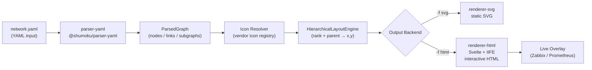
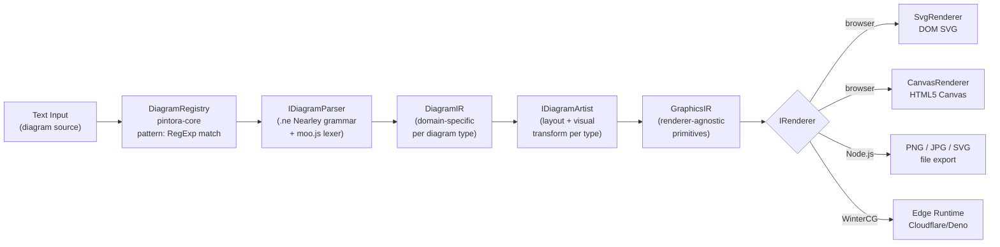
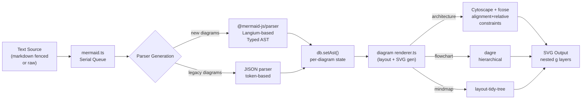
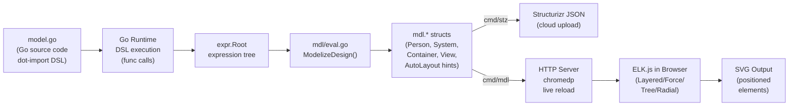

# Weekly Diagram Tooling Scan — 2026-06-03

## Executive Summary

- **Shumoku** mở ra một hướng thú vị: YAML là DSL đủ dùng cho network diagrams khi domain đủ hẹp — không cần parser phức tạp, schema validation thay thế grammar formal, 900+ icon vendor tích hợp sẵn là competitive advantage rõ ràng.
- **Pintora** là case study sạch nhất về extensible diagram engine trong JS/TS: tầng `IDiagram<D>` interface với parser + artist hoàn toàn tách biệt, Nearley grammar cho Mermaid-compatible syntax nhưng pluggable — đây là reference architecture đáng học nhất trong tuần.
- **Mermaid v11.15.0** vừa ship Event Modeling diagram type và "architecture layout tuning" — architecture diagram dùng fcose (force-directed + constraints) thay dagre, edge routing với 90° bend bằng BFS spatial mapping, đáng study vì khác pattern cũ hoàn toàn.
- **goadesign/model** minh hoạ "code IS the DSL" với Go dot-import pattern cho C4: không có text parser, model được eval bằng Go runtime rồi serialize qua ELK.js layout — approach đặc biệt phù hợp cho teams muốn type-safe architecture descriptions.

## Table of Contents

1. [konoe-akitoshi/shumoku](#1-konoe-akitoshishumoku) — Network topology từ YAML, 900+ icons
2. [hikerpig/pintora](#2-hikerpigpintora) — Extensible text-to-diagram, Nearley grammar, plugin model
3. [mermaid-js/mermaid v11.15](#3-mermaid-jsmermaid-v1115) — Architecture diagram mới, fcose layout, Event Modeling
4. [goadesign/model](#4-goadesignmodel) — Go-native C4 DSL, ELK.js layout, code-as-architecture

---

## 1. konoe-akitoshi/shumoku

### §1 — Quick Context

**One-line pitch**: Biến YAML thành interactive network topology diagram với 900+ vendor icon và live monitoring overlay — không cần biết graph layout.

- **Tech stack**: TypeScript (64.8%) + Svelte (28.1%), Node.js/Bun runtime, Turbo monorepo, Vitest tests
- **Key deps**: `@shumoku/core`, `@shumoku/renderer-html`, `@shumoku/renderer-svg`, `@shumoku/parser-yaml`, `@shumoku/netbox`; Zabbix/Prometheus integration
- **Output**: SVG (static), HTML (interactive pan/zoom), programmatic API
- **Repo health**: 125 ⭐, pushed **2026-06-03** (today), AGPL-3.0 + commercial dual license, CI với Vitest
- **Distribution**: npm + Docker/systemd server deployment

---

### §2 — Architecture Deep-Dive

#### A. Component Inventory

- **`@shumoku/parser-yaml`** (`libs/@shumoku/parser-yaml/`) — đọc YAML topology file, validate schema, emit parsed graph object
- **`@shumoku/core`** (`libs/shumoku/src/index.ts`) — re-export hub cho models, parser, plugin-types; xác định public API
- **`@shumoku/renderer-svg`** (`libs/@shumoku/renderer-svg/`) — xuất SVG tĩnh, export function `svg()`
- **`@shumoku/renderer-html`** (`libs/@shumoku/renderer-html/`) — interactive HTML output; export `renderGraphToHtmlHierarchical()`, `initInteractive()`, `renderHierarchical()`
- **`apps/server/`** — server Node.js phục vụ web dashboard với Svelte frontend
- **`libs/plugins/`** — third-party plugin directory; sample-plugin example có trong repo

#### B. Pipeline / Control Flow

1. User chạy `npx shumoku render network.yaml -o diagram.svg`
2. `@shumoku/parser-yaml` đọc YAML, validate schema (nodes/links/subgraphs/settings), emit `ParsedGraph` object
3. `@shumoku/core` nhận `ParsedGraph`, resolve icon references từ vendor icon registry (900+ icons)
4. `HierarchicalLayoutEngine` tính toán vị trí node dựa trên `rank`, `parent`, và `settings.direction` (TB/LR)
5. `@shumoku/renderer-svg` hoặc `@shumoku/renderer-html` consume positioned graph, render output
6. File SVG/HTML xuất hiện ở output path; HTML mode thêm interactive JavaScript cho pan/zoom

#### C. Data Model / Intermediate Representation

YAML schema định nghĩa IR trực tiếp:

```yaml
nodes: [{id, label, type, vendor, model, parent, rank, style}]
links: [{from: {node, port, ip}, to: {node, port, ip}, bandwidth, vlan, type}]
subgraphs: [{id, label, parent, style}]
settings: {direction, theme, legend}
```

IR là plain object (không phải class), **mutable** giữa parse và layout pass. Không có "compile to lower IR" — YAML schema = model schema = render input. Đơn giản nhưng tight coupling.

#### D. Input Language Design

- **Parser approach**: Không có text parser — YAML là DSL. Schema validation (YAML schema/JSON Schema) thay thế grammar formal.
- **Formal grammar**: Không có BNF/EBNF — YAML structure IS the grammar
- **Error reporting**: Phụ thuộc YAML parser errors + schema validation messages; không có custom error recovery

Quyết định này trade-off: zero learning curve với YAML users, nhưng không extensible cho syntax mới (ví dụ: nested references, expressions trong label).

#### E. Layout Algorithm

- `HierarchicalLayoutEngine` dựa trên `rank` field (0–4) và `parent` grouping
- `settings.direction: TB` → top-bottom; hỗ trợ LR (không xác định đầy đủ từ docs)
- Edge routing: không xác định rõ — có thể straight edges (SVG `<line>`)
- Crossing minimization: không có evidence

#### F. Rendering / Output Strategy

- **SVG backend**: `renderer-svg/` xuất SVG vector với vendor icons embed
- **HTML backend**: `renderer-html/` với Svelte-compiled JS cho interactivity, IIFE pattern (`getIIFE`, `setIIFE`) cho browser embedding
- **Animation**: Không có static export; HTML mode có real-time traffic color overlay từ monitoring data (Zabbix/Prometheus)
- Pattern: dual-backend với shared graph model

#### G. Extensibility

- Plugin system có (`libs/plugins/`, `sample-plugin` example)
- Icon có thể thêm qua plugin; vendor/model metadata extensible
- Không có evidence về custom shape hay edge type plugins

#### H. Dev Experience

- CLI: `npx shumoku render <file> -f [svg|html] -o <output>` — clean
- IDE integration: Không có evidence về VS Code extension hay LSP
- Watch mode: `dev` script qua Turbo, nhưng diagram-specific watch mode không xác định
- Browser preview: HTML output có thể mở trực tiếp

---

### §3 — Architecture Diagram



---

### §4 — Verdict

**Đáng học cho kymostudio**:
- YAML schema-as-DSL approach: khi domain diagram đủ hẹp và có semantics riêng (network nodes có `type`, `vendor`, `rank`), YAML với JSON Schema validation là DSL đủ dùng — không cần custom parser. Kymo có thể áp dụng tương tự cho các diagram domain-specific.
- Dual-backend SVG/HTML pattern với shared IR rất clean — tách rendering concern hoàn toàn.
- `rank` field để hint layout là ý tưởng đơn giản nhưng hiệu quả cho hierarchical network.

**Red flags**: AGPL-3.0 nghĩa là commercial use cần license riêng. Tight coupling giữa YAML schema và IR model — refactor sẽ đau. 125 stars và YAML "loading error" trên GitHub pages suggests còn alpha-stage.

**Open questions**: HierarchicalLayoutEngine implementation cụ thể như thế nào — có handle edge crossing không? Plugin authoring docs có completeness thế nào?

**Verdict**: **study deeper** — icon registry approach + YAML DSL pattern đáng học; layout engine cần đọc source trực tiếp.

---

## 2. hikerpig/pintora

### §1 — Quick Context

**One-line pitch**: Library text-to-diagram mở rộng được cho cả browser lẫn Node.js — mỗi diagram type là plugin độc lập implement interface `IDiagram<D>`.

- **Tech stack**: TypeScript (74.3%), Nearley grammar (6.6%), moo.js tokenizer, pnpm monorepo, Turbo build
- **Key packages**: `pintora-core` (plugin registry), `pintora-diagrams` (8 built-in types), `pintora-renderer` (CanvasRenderer + SvgRenderer), `pintora-cli`, `pintora-standalone`, `pintora-target-wintercg`
- **Output**: SVG, Canvas (browser); PNG, JPG, SVG (Node.js)
- **Repo health**: 1,283 ⭐, pushed 2026-06-01, MIT license, CI với test suite
- **Distribution**: npm packages

---

### §2 — Architecture Deep-Dive

#### A. Component Inventory

- **`pintora-core`** (`packages/pintora-core/src/`) — `diagram-registry.ts`: đăng ký/lookup diagram types; `config-engine.ts`: config management; `type.ts`: tất cả interface definitions (IDiagram, IDiagramParser, IDiagramArtist, GraphicsIR)
- **`pintora-diagrams`** (`packages/pintora-diagrams/src/`) — 8 diagram implementations: `sequence/`, `er/`, `component/`, `activity/`, `mindmap/`, `gantt/`, `dot/`, `class/`; mỗi folder có `parser.ts` + `artist.ts` + `db.ts` + `config.ts`
- **`pintora-renderer`** (`packages/pintora-renderer/src/`) — `renderers/SvgRenderer.ts`, `renderers/CanvasRenderer.ts`, `renderers/base.ts`; `IRenderer` interface
- **`pintora-cli`** (`packages/pintora-cli/`) — CLI wrapper cho Node.js PNG/JPG/SVG export
- **`pintora-standalone`** — bundled version cho browser CDN usage
- **`pintora-target-wintercg`** — WinterCG runtime target (Cloudflare Workers, Deno)

#### B. Pipeline / Control Flow

1. User viết text: `sequenceDiagram / Alice -> Bob: Hello`
2. `pintora.renderContentOf(text)` gọi `diagram-registry` tìm diagram type khớp với `pattern: RegExp`
3. `IDiagramParser.parse(text)` — Nearley grammar tokenize (moo.js) + parse → `DiagramIR` object
4. `IDiagramArtist.draw(diagramIR, config)` → tính toán layout, emit `GraphicsIR` (graphics primitives)
5. `IRenderer.render(graphicsIR)` — `SvgRenderer` hoặc `CanvasRenderer` materialize primitives thành DOM/SVG
6. Output SVG element hoặc PNG buffer tùy runtime

#### C. Data Model / Intermediate Representation

Có **hai tầng IR** rõ ràng:

1. **DiagramIR** (`D` type parameter): domain-specific per diagram type — ví dụ sequence có participants[], messages[], notes[]; class có classes[], relationships[]. Mutable trong parser pass.
2. **GraphicsIR**: layout-computed, renderer-agnostic graphics primitives — shapes, paths, text positions. Immutable sau khi `artist.draw()` emit.

Đây là kiến trúc two-pass rất sạch: DiagramIR = semantic model, GraphicsIR = visual model. Artist = layout + visual transform. Renderer = materialization.

#### D. Input Language Design

- **Parser approach**: **Nearley grammar** (`.ne` files) + **moo.js** tokenizer (state machine lexer)
- Sequence grammar dùng moo.js `states` để handle multi-line notes (`noteState`)
- **Formal grammar**: Có — `sequenceDiagram.ne` là EBNF-like Nearley grammar, compiled thành JS parser
- **Syntax**: Mermaid-inspired nhưng với extensions — `participant [<type>] Actor as "desc"`, `@start_note`/`@end_note` cho multi-line notes
- **Error reporting**: Nearley/moo.js error messages; không có custom recovery evidence

#### E. Layout Algorithm

- Không có centralized layout engine — mỗi `artist` tự implement layout logic riêng
- Sequence: linear vertical layout (messages top-to-bottom theo order)
- Mindmap: tree layout từ center
- DOT: delegate sang `graphviz` (evidence từ dep name)
- Edge routing: straight lines (sequence), tree edges — không có orthogonal routing evidence
- Crossing minimization: không có evidence

#### F. Rendering / Output Strategy

- **Dual backend**: `SvgRenderer` (DOM/XML SVG) và `CanvasRenderer` (HTML5 Canvas)
- **Pattern**: Pluggable emitter — `IRenderer` interface; đăng ký renderer mới possible
- **WinterCG target**: `pintora-target-wintercg` — serverless edge runtime support (điểm đặc biệt)
- Animation: không có evidence

#### G. Extensibility

- **Plugin system**: `IDiagram<D>` interface = full plugin contract — bên ngoài implement pattern detection, parser, artist, event recognizer
- Có docs "Tutorial for writing custom diagram"
- Theme/styling: `pintora-core/src/themes/` — theme objects per diagram

#### H. Dev Experience

- CLI: `pintora-cli` với file input → PNG/JPG/SVG
- IDE integration: không có evidence về VS Code extension
- Browser: `pintora-standalone` cho CDN; live demo tại pintorajs.vercel.app
- WinterCG support là differentiator đáng chú ý

---

### §3 — Architecture Diagram



---

### §4 — Verdict

**Đáng học cho kymostudio**:
- **Two-level IR pattern** (DiagramIR → GraphicsIR) là reference design tốt nhất trong tuần: buộc tách semantic parsing khỏi visual computation, cho phép thêm renderer mới mà không touch parser.
- **`IDiagram<D>` plugin contract** rất gọn — 4 methods (pattern, parser, artist, clear) đủ để register một diagram type mới. Kymo nên xem xét implement interface tương tự.
- **Nearley + moo.js** là stack có thể dùng ngay cho Kymo nếu cần custom DSL: Nearley viết grammar declarative, moo.js handle lexer state (quan trọng cho multi-line constructs).
- WinterCG target cho thấy architecture đủ sạch để port sang serverless.

**Red flags**: Artist-per-diagram tự implement layout → không có consistency về edge routing giữa các diagram types. 1283 stars nhưng issue backlog có 38 open issues từ 2022–2024 suggesting maintenance priority thấp.

**Open questions**: `pintora-core/src/pre.ts` làm gì (preprocessing step trước parse)?

**Verdict**: **study deeper** — IDiagram interface + two-level IR là pattern đáng copy trực tiếp vào Kymo architecture.

---

## 3. mermaid-js/mermaid v11.15

### §1 — Quick Context

**One-line pitch**: Text-to-diagram tiêu chuẩn trong Markdown — v11.15 vừa add Event Modeling, architecture layout tuning và 33 diagram types; điểm khác biệt so với các tool khác là depth của ecosystem (VS Code, Notion, GitHub native).

- **Tech stack**: TypeScript, D3.js (rendering primitives), Cytoscape.js + fcose (architecture diagram layout), `@mermaid-js/parser` (Langium-based), Vitest, pnpm monorepo
- **Output**: SVG (primary), sandboxed iframe HTML
- **Repo health**: 88,399 ⭐, pushed 2026-06-02, MIT, CI với Vitest + Argos visual regression
- **Distribution**: npm, jsDelivr CDN, VS Code extension, GitHub native rendering

---

### §2 — Architecture Deep-Dive

#### A. Component Inventory

- **`packages/mermaid/src/mermaid.ts`** — public API entry point: `render()`, `parse()`, `run()`, `initialize()`, `registerExternalDiagrams()`
- **`packages/mermaid/src/diagrams/`** — 33 diagram type implementations; mỗi type có `parser.ts`, `renderer.ts`, `db.ts`, `types.ts`, `styles.js`
- **`packages/@mermaid-js/parser`** — external Langium-based parser package; consumed bởi các diagram types mới (eventmodeling, architecture)
- **`packages/mermaid/src/diagrams/architecture/`** — diagram type mới nhất; `architectureRenderer.ts` dùng Cytoscape + fcose, `architectureTypes.ts` định nghĩa ArchitectureService/Junction/Group/Edge
- **`packages/@mermaid-js/layout-tidy-tree`** — mindmap layout dùng tidy-tree algorithm
- **`packages/mermaid/src/diagrams/globalStyles.ts`** — global CSS injection

#### B. Pipeline / Control Flow

1. User gọi `mermaid.render('id', 'flowchart LR\nA --> B')`
2. **Serial execution queue** serialize tất cả render calls (tránh race condition)
3. `parse(text)` gọi `@mermaid-js/parser` detect diagram type từ first-line keyword
4. Diagram-specific `db.ts` nhận AST từ parser, populate state store
5. Diagram-specific `renderer.ts` đọc state từ db, compute layout, generate SVG
6. SVG string trả về với optional bound functions cho interactivity; `data-processed` attribute set trên container element

#### C. Data Model / Intermediate Representation

Mỗi diagram type có db riêng (module-level mutable state). Không có centralized IR — đây là legacy pattern từ early Mermaid. Các diagram mới (architecture, eventmodeling) dùng `@mermaid-js/parser` emit typed AST, lưu qua `db.setAst(ast)`. Không có "compile to lower IR" — db state được renderer consume trực tiếp.

#### D. Input Language Design

- **Parser approach**: Hai generation tồn tại song song:
  - **Legacy**: JISON-generated parsers (flowchart, sequence cũ) — token-based
  - **New**: `@mermaid-js/parser` dùng **Langium** (Language Engineering framework cho VS Code Language Server Protocol) — grammar files generate TypeScript parser + LSP
- `@mermaid-js/parser@1.1.1` bundle langium/chevrotain để isolate deps
- **Error reporting**: `handleError()` → `DetailedError` format với `parseError` callback

#### E. Layout Algorithm

**Architecture diagram** (mới nhất, v11.x):
- **fcose** (force-directed với constraints) via **Cytoscape.js**
- Alignment constraints: `getAlignments()` tạo horizontal/vertical groups từ `ArchitectureLayoutHint`
- Relative placement: `getRelativeConstraints()` dùng BFS trên spatial map để emit sequential constraints
- Seeded randomization (`withSeededRandom()`) cho reproducible layouts
- Config: nodeSeparation, iterationCount, edgeElasticity (khác nhau khi cross-group)

**Flowchart / Sequence**: vẫn dùng **dagre** (hierarchical, Sugiyama-inspired)

**Mindmap**: `@mermaid-js/layout-tidy-tree` (tidy-tree algorithm)

#### F. Rendering / Output Strategy

- **Single SVG backend** — không pluggable (khác Pintora)
- SVG dùng nested `<g>` layer: `architecture-edges`, `architecture-services`, `architecture-groups`
- Edge routing trong architecture diagram: straight hoặc segmented 90° bends
  - `getSegmentWeights()` compute bend points bằng perpendicular distance formula
  - Direction pair determines routing (ví dụ L→R = straight, T→R = bend)
- Sandboxed iframe option cho untrusted user content

#### G. Extensibility

- `registerExternalDiagrams(diagrams, {lazyLoad: true})` — lazy-load custom types
- Langium grammar cho diagram types mới = LSP support miễn phí

#### H. Dev Experience

- VS Code extension (native rendering trong preview)
- Live editor: mermaid.live
- GitHub, Notion, Confluence native support
- `mermaid.parse()` cho validation trước render
- `data-processed` attribute cho idempotent `run()`

---

### §3 — Architecture Diagram



---

### §4 — Verdict

**Đáng học cho kymostudio**:
- **fcose constraint-based layout** trong architecture diagram là cách tiếp cận mới nhất — không phải pure force-directed mà hybrid: BFS spatial map → relative constraints → fcose solve. Kymo nên implement tương tự nếu cần layout với user hints (ví dụ "node A phải nằm trên node B").
- **90° bend edge routing** với perpendicular distance formula trong `getSegmentWeights()` là technique đáng borrow trực tiếp.
- **Langium grammar → LSP** là path miễn phí từ grammar definition sang VS Code autocomplete/validation. Nếu Kymo muốn IDE support, đây là shortest path.
- Serial execution queue pattern đơn giản nhưng critical cho concurrent render.

**Red flags**: Legacy JISON parsers và Langium parsers tồn tại song song = inconsistent error messages. Module-level mutable state trong `db.ts` của mỗi diagram type là anti-pattern rõ ràng (impossible to parallelize).

**Open questions**: Khi nào Mermaid sẽ migrate toàn bộ diagrams sang Langium? `@mermaid-js/layout-tidy-tree` có plan cho non-mindmap diagrams không?

**Verdict**: **study deeper** — fcose layout constraints + Langium path đáng implement tham khảo; legacy JISON code nên bỏ qua.

---

## 4. goadesign/model

### §1 — Quick Context

**One-line pitch**: Dùng Go code làm C4 architecture DSL — không có text parser, model được eval bằng Go runtime, layout qua ELK.js, render qua Chrome headless.

- **Tech stack**: Go 1.26, chromedp (Chrome DevTools Protocol), ELK.js (via browser), gorilla/websocket, chi HTTP router; output SVG hoặc JSON (Structurizr)
- **Key packages**: `dsl/`, `mdl/`, `stz/`, `cmd/mdl`, `cmd/stz`, `expr/`, `plugin/`
- **Repo health**: 461 ⭐, pushed 2026-06-02, MIT license; có CI
- **Distribution**: Go binary (`go install`)

---

### §2 — Architecture Deep-Dive

#### A. Component Inventory

- **`dsl/`** (`dsl/doc.go`) — public DSL functions: `Design()`, `SoftwareSystem()`, `Container()`, `Person()`, `SystemContextView()`, v.v. — Go functions dùng dot-import pattern
- **`expr/`** — expression tree: `expr.Root` accumulate DSL calls thành tree structure
- **`mdl/eval.go`** — `RunDSL()` execute DSL, `ModelizeDesign(expr.Root)` convert expression tree → `mdl.*` Go structs (serializable model)
- **`mdl/elements.go`** — element types: Person, SoftwareSystem, Container, Component, DeploymentNode; `mdl/views.go` — view types
- **`mdl/model.go`** — top-level model struct
- **`stz/`** — Structurizr serialization: convert `mdl.*` → Structurizr JSON workspace format
- **`cmd/mdl/`** — interactive graphical editor: local HTTP server + chromedp + live reload (`fsnotify`)
- **`codegen/`** — code generation utilities (diagram code generation từ model)

#### B. Pipeline / Control Flow

1. User viết `model.go` với Go dot-import: `import . "goa.design/model/dsl"` và gọi `Design(func() { SoftwareSystem(...) })`
2. User chạy `mdl gen` — Go runtime execute `model.go` file, DSL functions populate `expr.Root` expression tree
3. `eval.RunDSL()` gọi `ModelizeDesign(expr.Root)` — traverse expression tree, emit `mdl.*` structs (Person, SoftwareSystem, Container, View, AutoLayout)
4. `AutoLayout` struct (RankDirection, RankSep, NodeSep, EdgeSep) được serialize sang JSON
5. `cmd/mdl` khởi HTTP server, mở Chrome qua chromedp, load ELK.js in browser
6. ELK.js nhận JSON model, compute layout (Layered/Force/Tree/Radial), return positioned coordinates
7. SVG render trong browser, chromedp capture → SVG file output

#### C. Data Model / Intermediate Representation

Có **hai tầng IR**:
1. **`expr.*`** — expression tree, mutable trong DSL execution phase
2. **`mdl.*`** — finalized model structs, immutable sau `ModelizeDesign()` call; JSON-serializable

`AutoLayout` struct trong `mdl/`: `{Implementation string, RankDirection string, RankSep, NodeSep, EdgeSep int, Vertices []Vertex}` — layout hints, không phải computed positions.

Không có "compile to lower IR" trong Go — layout computation xảy ra ở ELK.js (JavaScript) trong browser, separated từ Go model entirely.

#### D. Input Language Design

- **Parser approach**: **Không có text parser** — Go code IS the DSL. "Parsing" = Go compilation.
- **Grammar**: Go syntax + function call nesting (anonymous funcs as scope). Dot-import pattern loại bỏ package prefix.
- **Formal grammar**: Go grammar (EBNF) — compiler-enforced, không cần custom grammar
- **Error reporting**: Go compiler errors + runtime panics từ DSL validation

Đây là "internal DSL" pattern — trade-off: type-safe, IDE support miễn phí (Go tooling), nhưng non-Go users bị loại trừ.

#### E. Layout Algorithm

- **ELK.js** (Eclipse Layout Kernel) chạy trong Chrome browser (chromedp)
- Algorithms: Layered (Sugiyama), Force, Tree, Radial — configurable per view qua `AutoLayout` struct
- `mdl` interactive editor thêm auto-layout, undo/redo, keyboard shortcuts, snap-to-grid
- Edge routing: ELK.js handles (orthogonal/spline tùy algorithm)

#### F. Rendering / Output Strategy

- **Chrome headless** via chromedp — không có native SVG generator trong Go
- ELK.js layout → positioned JSON → SVG template rendering in browser
- `cmd/mdl`: local HTTP server + WebSocket + file watcher (`fsnotify`) = live preview
- `cmd/stz`: upload JSON workspace lên Structurizr cloud service
- Output: SVG (local), JSON (Structurizr)

#### G. Extensibility

- Goa plugin (`plugin/`) cho microservice framework integration
- Shared architecture components qua Go packages — `import` model pieces từ repo khác
- Không có diagram type plugin system; limited to C4 model

#### H. Dev Experience

- `mdl` tool: interactive editor với browser preview, auto-layout, snap-to-grid
- `stz` tool: Structurizr cloud integration
- Go tooling: type checking, autocomplete, go vet — IDE support tốt nhất trong 4 repos
- `fsnotify` watch mode: file change → browser hot reload

---

### §3 — Architecture Diagram



---

### §4 — Verdict

**Đáng học cho kymostudio**:
- **expr → mdl two-pass pattern** rất sạch: expression tree accumulation (runtime) → finalized struct serialization. Kymo có thể áp dụng tương tự cho internal model pipeline khi cần decouple "model definition time" khỏi "layout time".
- **ELK.js integration** cho thấy cách delegate layout sang mature library mà không cần reimplement — nhất là ELK.js support Sugiyama layered (điều dagre không làm tốt cho hierarchical C4).
- **Code-as-DSL** approach với dot-import là cực đoan nhưng thú vị: zero parser code, Go compiler làm error checking. Áp dụng được nếu Kymo có Go runtime và muốn type-safe diagram definitions.

**Red flags**: chromedp dependency = Chrome process required → heavy, không serverless-friendly. Structurizr integration = vendor dependency. Stars thấp (461) so với feature depth.

**Open questions**: ELK.js layout có chạy được offline (bundled) hay cần browser + CDN? `codegen/` package làm gì cụ thể?

**Verdict**: **study deeper** — ELK.js layout strategy và two-pass expr→mdl pattern đáng tham khảo; chromedp rendering approach nên tránh cho Kymo (quá heavy).
