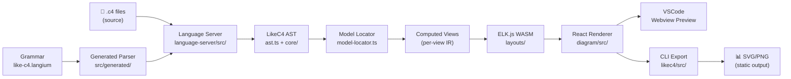
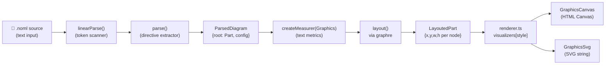
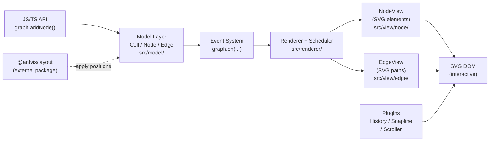
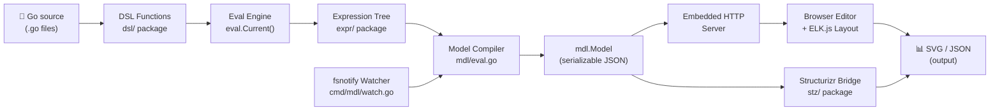

# Weekly Diagram Tooling Research — 2026-06-04

## Executive Summary

- **likec4/likec4** nổi bật nhất tuần này: Langium-based LSP + ELK layout + React renderer cho C4 architecture — đây là "living document" pattern thực sự scalable nhất trong domain.
- **skanaar/nomnoml** là case study lý tưởng về *minimal viable diagram DSL*: toàn bộ pipeline (parse → layout → render) được giữ trong ~6 file TypeScript, không framework, dual-backend elegantly.
- **antvis/X6** và **goadesign/model** bổ sung hai góc nhìn trái chiều: X6 là framework-for-building-tools (renderer-first, no layout), goadesign/model là code-as-DSL (Go functions thay vì text).

## Table of Contents

1. [likec4/likec4](#1-likec4likec4) — TypeScript C4 architecture-as-code với Langium LSP
2. [skanaar/nomnoml](#2-skaanaarnomnoml) — Minimal UML DSL renderer, dual Canvas/SVG backend
3. [antvis/X6](#3-antvisx6) — SVG+HTML graph editing engine (AntV ecosystem)
4. [goadesign/model](#4-goadesignmodel) — Go code-as-C4-diagram DSL với ELK layout

---

## 1. likec4/likec4

> **GitHub:** https://github.com/likec4/likec4  
> **Stars:** 3 342 ⭐ · **Pushed:** 2026-06-03 · **License:** MIT

### §1 — Quick Context

**One-line pitch:** DSL kiến trúc C4 với LSP đầy đủ — diagram tự động cập nhật theo code, không cần vẽ tay.

| Dimension | Giá trị |
|-----------|---------|
| Tech stack core | TypeScript (pnpm monorepo), Langium, React, ELK |
| Output formats | SVG, embedded HTML, React components, PNG |
| Stars / Contributors | 3 342⭐ / 50+ contributors |
| Last push | 2026-06-03 |
| CI/Tests | ✅ Có (GitHub Actions + Vitest) |
| Distribution | `npx likec4`, VSCode extension (Marketplace + OpenVSX), npm packages |

---

### §2 — Architecture Deep-Dive

#### A. Component Inventory

| Module | File path | Vai trò |
|--------|-----------|---------|
| `Language Server` | `packages/language-server/src/` | LSP server full-featured (hover, completion, diagnostics, format) |
| `Grammar` | `packages/language-server/src/like-c4.langium` | Langium grammar định nghĩa toàn bộ syntax LikeC4 |
| `Generated Parser` | `packages/language-server/src/generated/` | ANTLR-style parser sinh tự động từ grammar — **không edit thủ công** |
| `AST + Type Builder` | `packages/language-server/src/ast.ts` | Chuyển Langium AST → typed LikeC4 model |
| `Model Locator` | `packages/language-server/src/model/model-locator.ts` | Resolve FQN references, cross-file navigation |
| `Core Types` | `packages/core/src/` | Shared IR types dùng bởi tất cả packages |
| `Layout Engine` | `packages/layouts/` | Wrapper gọi ELK.js với WASM |
| `Diagram Renderer` | `packages/diagram/src/` | React components render interactive diagram |
| `CLI` | `packages/likec4/src/` | Entry point: `npx likec4 start/build/export` |
| `VSCode Extension` | `packages/vscode/src/` | Extension với embedded LSP + webview preview |
| `Playground App` | `apps/playground/` | Browser-based live editor |

#### B. Pipeline / Control Flow

```
1. User viết `views/system.c4` trong VSCode
2. VSCode extension kích hoạt language server (LSP)
3. Language server parse file qua Langium-generated parser → Langium CST
4. ast.ts chuyển CST → typed LikeC4 AST (Element, Relation, View, Deployment...)
5. Model locator resolve cross-file FQN references
6. ELK.js (WASM) tính toán layout → node positions, edge routes
7. React components trong diagram package render vào SVG/HTML
8. VSCode webview nhận React bundle, hiển thị live preview
9. CLI `likec4 export` → xuất PNG/SVG tĩnh
```

#### C. Data Model / IR

LikeC4 có **3 lớp IR**:

1. **Langium CST** (Concrete Syntax Tree) — raw parse tree, mutable trong validation pass
2. **LikeC4 AST** (`packages/core`) — typed domain model: `Element`, `Relation`, `View`, `Deployment`, `Specification` — immutable sau khi build
3. **Computed View** — IR sau khi apply filters/predicates của từng view, trước khi layout

Concept "compile to lower IR" tồn tại: Langium document → `LikeC4LangiumDocument` → `ComputedView` → ELK input graph.

#### D. Input Language Design

**Parser approach:** Langium — một Xtext-inspired parser framework sinh ra ANTLR-like LL(k) parser từ grammar file `.langium`. Không viết parser thủ công.

**Grammar highlights** (từ `like-c4.langium`):

```langium
// Specification block — khai báo "schema" cho model
SpecificationRule:
  elements+=SpecificationElementKind
  tags+=SpecificationTag
  relationships+=SpecificationRelationshipKind

// Element có thể viết theo 2 cách:
Element:
  (kind=[ElementKind] name=Id | name=Id Eq kind=[ElementKind])
  (props+=String)*  // title, description, technology là positional
  body=ElementBody?

// Relation với 3 syntax alternatives:
Relation<isExplicit>:
  source=FqnRef ('->' | '-[' kind=RelationKind ']->' | kind=RelationKindDotRef)
  target=FqnRef

// Views được khai báo tách biệt khỏi model
ElementView: 'view' key=Id? ('of' element=FqnRef)?
DeploymentView: 'deployment view' key=Id?
DynamicView: 'dynamic view' key=Id?
```

**Keyword reserving**: Langium cần `Id` accept cả reserved words (bắt buộc comment trong grammar): `// We need to add all the possible terminal values to Id, so that the parser can accept them as "Id" (not a bug and not a feature of Langium)`.

**Error reporting:** Langium tích hợp LSP diagnostics — compile-time errors hiện trong VSCode như code errors.

**Formal grammar:** Có — `.langium` file là EBNF-compatible specification.

#### E. Layout Algorithm

**Engine:** ELK.js (Eclipse Layout Kernel) qua WASM.

**Syntax trong DSL:**
```
autoLayout LeftRight 92 78  // direction, nodeSep, rankSep
```

ELK hỗ trợ nhiều algorithms (Layered, Force, Tree, Radial) — LikeC4 expose `direction` (LR, RL, TB, BT) và spacing params. Crossing minimization: ELK Layered dùng Sugiyama framework với barycentric heuristic.

**Edge routing:** ELK Layered dùng orthogonal routing mặc định.

#### F. Rendering / Output Strategy

**React-based renderer** trong `packages/diagram/src/`:
- Nodes được render như React components với foreign object hoặc SVG
- Animation: CSS transitions cho smooth layout changes
- Multiple outputs: interactive web view, static SVG export, PNG via headless Chromium

#### G. Extensibility

- **Shapes:** Thêm shape mới qua `packages/language-server/.agents/skills/add-new-element-shape/` — có AI skill document hóa quy trình
- **Element kinds:** Khai báo trong `specification { }` block của DSL
- **Icons:** `packages/language-server/src/generated-lib/` — icon registry (aws, azure, gcp, bootstrap, tech)
- **Styling:** CSS-based theme với `@likec4/styles`

#### H. Dev Experience

- VSCode extension với hover, completion, format, diagnostics, inline preview ✅
- `npx likec4 start` — watch mode + browser HMR ✅
- LSP protocol → IDE-agnostic (có thể integrate Neovim, Emacs) ✅
- Playground tại `apps/playground/` ✅
- AI-assisted layout: `likec4.semantic-layout-with-ai` command trong VSCode ✅

---

### §3 — Architecture Diagram



---

### §4 — Verdict

**Điểm đáng học cho kymostudio:**
- **Langium approach**: Viết grammar → auto-generate LSP-aware parser là pattern cực kỳ productive. Nếu kymo muốn custom DSL có IDE support, Langium tiết kiệm ~80% effort so với viết thủ công.
- **Specification block**: Cơ chế khai báo schema trong DSL (loại element, loại relation) trước khi dùng rất hay — có thể validate trước khi render.
- **AI-assisted layout command**: `likec4.semantic-layout-with-ai` — tích hợp AI vào layout decision là hướng thú vị.
- **3-tier IR**: CST → AST → Computed View là pattern sạch cho multi-view systems.

**Red flags:**
- 164 open issues — development tích cực nhưng bugs tích tụ
- Grammar phải chấp nhận reserved words là Id (comment rõ "not a bug and not a feature") — parser phức tạp hơn expected
- ELK WASM ~2MB payload — có thể gây load time issues trên browser

**Open questions:**
- Layout persistence mechanism là gì khi user drag node? (thấy encoded binary trong model file)
- How does multi-project model merging work (packages/language-server/src/model/model-locator.ts)?

**Verdict: `STUDY DEEPER`** — đây là repo quan trọng nhất tuần. DSL + LSP + ELK combination đáng nghiên cứu kỹ cho kymo.

---

## 2. skanaar/nomnoml

> **GitHub:** https://github.com/skanaar/nomnoml  
> **Stars:** 2 828 ⭐ · **Pushed:** 2026-05-30 · **License:** MIT

### §1 — Quick Context

**One-line pitch:** UML renderer DSL đơn giản nhất hiện tại — syntax gần giống ASCII art, không cần tool, không cần install.

| Dimension | Giá trị |
|-----------|---------|
| Tech stack core | TypeScript, graphre (layout), vanilla TS (no framework) |
| Output formats | SVG (server/browser), HTML Canvas (browser) |
| Stars / Contributors | 2 828⭐ / 30+ contributors |
| Last push | 2026-05-30 |
| CI/Tests | ✅ Có |
| Distribution | `npm install nomnoml`, `npx nomnoml`, CDN, nomnoml.com web editor |

---

### §2 — Architecture Deep-Dive

#### A. Component Inventory

| Module | File path | Vai trò |
|--------|-----------|---------|
| `Public API` | `src/nomnoml.ts` | `draw()`, `renderSvg()`, `processImports()`, `compileFile()` |
| `Parser` | `src/parser.ts` | Two-phase: `linearParse()` + directive extraction → `ParsedDiagram` |
| `Domain Types` | `src/domain.ts` | `Config`, `Measurer`, `Node`, `Part`, `Association` |
| `Layouter` | `src/layouter.ts` | graphre integration → `LayoutedPart`, `LayoutedNode`, `LayoutedAssoc` |
| `Renderer` | `src/renderer.ts` | Recursive render via `visualizers[style]` lookup |
| `Canvas Backend` | `src/GraphicsCanvas.ts` | Implements `Graphics` interface cho HTML Canvas |
| `SVG Backend` | `src/GraphicsSvg.ts` | Implements `Graphics` interface → SVG string |
| `Graphics Interface` | `src/Graphics.ts` | Abstraction layer: `path()`, `rect()`, `arcTo()`, `setFont()` |

**Total codebase:** ~2 000 LOC TypeScript — remarkably small.

#### B. Pipeline / Control Flow

```
1. User gọi renderSvg("[Customer]->[API Server]")
2. linearParse(code) → tokens, chuỗi ký tự → Part hierarchy
3. parse() extract directives (direction=, fill=, ...) → ParsedDiagram {root, directives, config}
4. createMeasurer(Graphics) → wraps Graphics để đo text metrics
5. layout(diagram, measurer) → graphre.Graph built; grapheLayout(g) called → LayoutedPart
6. render(layouted, config, graphics) → recursive: renderCompartment → renderNode → renderRelation
7. graphics.serialize() → SVG string hoặc Canvas draw calls
```

#### C. Data Model / IR

```typescript
// Parse output
ParsedDiagram {
  root: Part         // hierarchical: Part chứa Node[] và Association[]
  directives: Directive[]  // raw [key, value] pairs
  config: Config     // typed config: arrowSize, bendSize, zoom, padding...
}

// Layout output  
LayoutedPart {
  nodes: LayoutedNode[]    // extends Node + {x, y, width, height}
  assocs: LayoutedAssoc[]  // extends Association + {path: Vec[], label: {x,y}}
  width: number
  height: number
  offset: Vec
}
```

IR **mutable** trong layout pass — graphre writes coordinates back vào `LayoutedNode` objects.

#### D. Input Language Design

**Parser approach:** Two-phase custom parser — không có formal grammar file.

Phase 1 (`linearParse`): Token-based lexer, nhận diện `[]`, `()`, `->`, `-->`, `-:>` etc. qua character-by-character scan. Không dùng regex cho primary parsing.

Phase 2 (`parse`): Regex extraction của directives từ comment-like syntax.

**DSL examples:**
```nomnoml
[Customer|
  id: string
  name: string
]
[API Server|<abstract>Interface|-method()]
[Customer] -> [API Server]
[<database>DB]
#direction: LR
#fill: #eee8d5
```

Classifier types qua `<type>` syntax trong `[<database>Name]`.

**Error handling:** Minimal — `ParseError` exported nhưng defaults/fallbacks cho hầu hết edge cases. Philosophy: lenient parsing hơn là strict errors.

#### E. Layout Algorithm

**Engine:** `graphre` — fork/reimplementation của `dagre` (rank-based DAG layout).

**Algorithm:** Sugiyama-style hierarchical layout:
1. Cycle removal (`acyclicer` option)
2. Layer assignment (`ranker` option: `network-simplex`, `tight-tree`, `longest-path`)
3. Crossing minimization (barycentric)
4. Coordinate assignment

**Edge routing:** Polyline (không phải spline) — `edge.points` là array of intermediate vertices từ graphre; path = `[start, ...edge.points, end]`.

**Label placement:** `adjustQuadrant()` — đặt label ở quadrant nào không bị chồng lên đường.

**Configurable via DSL:**
```nomnoml
#ranker: longest-path
#acyclicer: greedy
#direction: right
```

#### F. Rendering / Output Strategy

**Dual-backend via `Graphics` interface:**

```typescript
interface Graphics {
  fillStyle(color: string): void
  strokeStyle(color: string): void
  path(points: Vec[]): void
  rect(x, y, w, h): void
  setFont(font: string, bold: boolean, italic: boolean): void
  setData(key: string, value: string): void
  // ...
}
```

- `GraphicsCanvas`: delegates to `CanvasRenderingContext2D`
- `GraphicsSvg`: accumulates SVG element strings → serialize()

**Shape system:** `visualizers` object — key là style name (`class`, `database`, `note`, `package`, `state`, etc.), value là render function. Thêm shape mới = thêm entry vào object.

**Animation:** Không có — static render.

**SVG data attributes:** `g.setData('name', id)` → `data-name` attributes trên SVG elements cho interactivity trong web editor.

#### G. Extensibility

- Thêm shape: extend `visualizers` object
- Thêm backend: implement `Graphics` interface
- Import system: `#import: other.noml` (với depth limit)
- Configuration directives tự động applied từ DSL

#### H. Dev Experience

- `npx nomnoml input.noml` → xuất SVG ra stdout ✅
- nomnoml.com — live web editor với instant preview ✅
- CDN embed — không cần build step ✅
- Không có IDE extension ❌
- Không có LSP ❌

---

### §3 — Architecture Diagram



---

### §4 — Verdict

**Điểm đáng học cho kymostudio:**
- **`Graphics` interface pattern**: Một abstraction layer đơn giản cho phép dual Canvas/SVG backend — zero duplication. Kymo nên adopt pattern này ngay nếu cần multiple render targets.
- **`visualizers` lookup table**: Shape registry bằng plain object — rất dễ extend, không cần inheritance. Pattern tốt hơn class hierarchy cho shape customization.
- **`linearParse` approach**: Two-phase parsing (scan → config extract) giữ parser nhỏ và testable. Phù hợp nếu kymo muốn viết parser nhanh mà không cần Langium/ANTLR.
- **Pipeline clarity**: 6 file, mỗi file một responsibility. Dễ đọc, dễ fork.

**Red flags:**
- `graphre` ít được maintain — nếu cần layout sophisticated hơn (orthogonal routing, compound graphs) thì phải switch sang ELK/dagre
- Không có formal grammar → khó extend syntax mà không break existing files
- Error messages kém — lenient parsing ẩn bugs

**Open questions:**
- `graphre` vs `dagre` — có gì khác biệt architecture? Tại sao fork?
- Có plan thêm LSP support không?

**Verdict: `GLANCE ONLY`** — đọc source làm tham khảo pattern (Graphics interface, visualizers table), nhưng không cần deep dive technology stack.

---

## 3. antvis/X6

> **GitHub:** https://github.com/antvis/X6  
> **Stars:** 6 576 ⭐ · **Pushed:** 2026-06-01 · **License:** MIT

### §1 — Quick Context

**One-line pitch:** Framework để *xây dựng* diagram tools — SVG+HTML rendering engine MVC, không phải diagram tool end-user.

| Dimension | Giá trị |
|-----------|---------|
| Tech stack core | TypeScript, SVG + HTML (dual rendering per cell) |
| Output formats | SVG, HTML (interactive), không export tĩnh built-in |
| Stars / Contributors | 6 576⭐ / 100+ contributors |
| Last push | 2026-06-01 |
| CI/Tests | ✅ Có (Vitest) |
| Distribution | `npm install @antvis/x6`, monorepo các plugins riêng |

---

### §2 — Architecture Deep-Dive

#### A. Component Inventory

| Module | File path | Vai trò |
|--------|-----------|---------|
| `Graph` | `src/graph/` | Main entry point — orchestrates model, view, renderer |
| `Model` | `src/model/cell.ts`, `model.ts` | Data layer: Cell (base), Node, Edge |
| `View` | `src/view/cell/`, `node/`, `edge/` | SVG/HTML render views per cell type |
| `Renderer` | `src/renderer/renderer.ts` | Scheduler-based async render queue |
| `Geometry` | `src/geometry/` | Point, Rectangle, Line primitives |
| `Plugin System` | `src/plugin/` | `GraphPlugin` interface: History, Snapline, Scroller |
| `Tool Registry` | `src/registry/tool/` | Editing tools: Anchor, Arrowhead, Editor, Segments |
| `Algorithm` | `src/common/algorithm/` | dijkstra + graph utilities |

#### B. Pipeline / Control Flow

```
1. Developer tạo `new Graph({ container })` với config options
2. `graph.addNode({ shape, x, y, ... })` → Model layer tạo Cell object
3. Model fires change events → Renderer.requestViewUpdate(view, flag)
4. Scheduler batches pending updates → RAF (requestAnimationFrame)
5. NodeView hoặc EdgeView.render() → ghi vào SVG DOM (với `isSvgElement` flag)
6. Optionally: `graph.getPlugin('scroller')` etc. lấy plugin behavior
7. Không có built-in layout — dev gọi `@antvis/layout` riêng → apply positions
```

#### C. Data Model / IR

**MVC pattern rõ ràng:**

```typescript
// Model layer
class Cell<Properties> {
  attrs: Record<string, any>  // visual attributes
  zIndex: number
  // ...
}
class Node extends Cell { ... }
class Edge extends Cell { source, target: Port | Node }

// View layer
class CellView { cell: Cell; graph: Graph; render(): this }
class NodeView extends CellView { isSvgElement: boolean }
class EdgeView extends CellView { ... }

// Renderer
class Renderer extends Base {
  schedule: Scheduler   // RAF-based batch updates
  requestViewUpdate(view: CellView, flag: number): void
}
```

IR không có compile stages — Cell object là source of truth, View reads directly.

#### D. Input Language Design

X6 không có text DSL — input là JavaScript/TypeScript API calls. Không có parser.

**Config object** là "language":
```typescript
graph.addNode({
  shape: 'custom-node',
  x: 100, y: 200,
  attrs: { label: { text: 'Hello' } }
})
```

#### E. Layout Algorithm

**Không có built-in layout.** X6 là rendering engine thuần.

Layout được delegate tới `@antvis/layout` (package riêng) implement:
- Dagre (hierarchical)
- Force-directed
- Circular
- Concentric
- Radial
- Grid

Developer phải manually apply layout results:
```typescript
const layout = new DagreLayout({ rankdir: 'TB' })
const model = layout.layout(data)
graph.fromJSON(model)
```

#### F. Rendering / Output Strategy

**Dual rendering mode per cell:**
- `isSvgElement: true` → SVG `<g>` elements
- `isSvgElement: false` → HTML `<div>` với foreignObject wrapper

Cho phép mix: SVG shapes với HTML content trong cùng diagram.

**Scheduler pattern** trong `Renderer`:
- Không render synchronously — accumulate update requests
- RAF (requestAnimationFrame) flush pending renders
- `flag` bitmask quyết định loại update (geometry, attrs, zIndex...)

**Plugin rendering:** Snapline, minimap, scroller là separate SVG overlays.

**Animation:** CSS transitions trên SVG attributes — không built-in animation API.

#### G. Extensibility

- **Custom shapes:** Register vào `Graph.registerNode('name', NodeClass)` 
- **Plugins:** Implement `GraphPlugin` interface → `graph.use(new MyPlugin())`
- **Tools:** Extend `ToolItem` class → gắn vào EdgeView/NodeView
- **Event system:** `graph.on('node:click', handler)` — comprehensive event coverage

#### H. Dev Experience

- Không có CLI ❌
- Không có web editor ❌ (là framework, không là tool)
- React/Vue/Angular adapters có (`@antvis/x6-react-components`) ✅
- TypeScript types đầy đủ ✅
- Docs tại x6.antv.vision ✅

---

### §3 — Architecture Diagram



---

### §4 — Verdict

**Điểm đáng học cho kymostudio:**
- **Scheduler + RAF batch pattern** (`src/renderer/renderer.ts`): Không render synchronously khi model change — batch qua requestAnimationFrame. Pattern quan trọng cho performance khi diagram large.
- **`flag` bitmask cho update types**: Phân biệt geometry update vs attribute update vs z-order update → tránh full re-render. Kymo nên adopt nếu có complex diagram editor.
- **`isSvgElement` flag**: Cho phép HTML-in-SVG — useful khi node content cần rich formatting (table, image gallery) mà SVG text không handle tốt.
- **Plugin interface pattern**: `GraphPlugin` là clean extension point — kymo có thể học để design plugin API cho kymo's rendering engine.

**Red flags:**
- Không có built-in layout — dev phải integrate riêng với `@antvis/layout` (extra dependency, extra setup)
- API surface rất lớn — learning curve cao
- Documentation chủ yếu bằng Chinese, English docs lagging

**Open questions:**
- Scheduler flush strategy — `cancelAnimationFrame` + re-schedule hay accumulate then flush?
- Server-side rendering support — dùng JSDOM hay có native SSR?

**Verdict: `GLANCE ONLY`** — Architecture patterns (Scheduler, Plugin, dual-render) đáng học, nhưng X6 quá lớn để adopt toàn bộ. Học từ patterns, không adopt framework.

---

## 4. goadesign/model

> **GitHub:** https://github.com/goadesign/model  
> **Stars:** 461 ⭐ · **Pushed:** 2026-06-03 · **License:** MIT

### §1 — Quick Context

**One-line pitch:** C4 architecture diagram bằng Go code thuần — không có text DSL, Go functions *là* DSL, diagram live-reload khi code change.

| Dimension | Giá trị |
|-----------|---------|
| Tech stack core | Go (v1.23+), ELK.js (layout), browser-based editor |
| Output formats | SVG, JSON, Structurizr JSON schema |
| Stars / Contributors | 461⭐ / 15+ contributors |
| Last push | 2026-06-03 |
| CI/Tests | ✅ Có (GitHub Actions) |
| Distribution | `go install goa.design/model/cmd/mdl@latest`, Go package import |

---

### §2 — Architecture Deep-Dive

#### A. Component Inventory

| Module | File path | Vai trò |
|--------|-----------|---------|
| `DSL Functions` | `dsl/` | Public API: `Design()`, `SoftwareSystem()`, `Person()`, `Container()`, `Component()`, `Uses()`, `Views()`, `AutoLayout()` etc. |
| `Expression Tree` | `expr/` | IR types: `Design`, `SoftwareSystem`, `Container`, `Component`, `Person`, `Relationship`, `View`, `ViewProps`, `ElementView` |
| `Model Compiler` | `mdl/` | `eval.go`: evaluates expr tree → `mdl.Model`; `elements.go`: serializable structs |
| `Structurizr Bridge` | `stz/` | `layout.go`, `configuration.go`: sync với Structurizr service; serialize Workspace JSON |
| `CLI — mdl` | `cmd/mdl/` | `watch.go` (fsnotify hot-reload), `serve` command (embedded browser editor) |
| `Registry` | `expr/registry.go` | `Identify()` — deterministic ID generation (hash → base36) |

**Note:** `dsl/` có nhiều files nhỏ per concept: `elements.go`, `person.go`, `views.go`, `deployment.go`, `relationship.go`, `design.go`.

#### B. Pipeline / Control Flow

```
1. User viết Go file: `var _ = Design("name", func() { SoftwareSystem("API", ...) })`
2. `mdl serve ./model/...` — compile Go package → run as Go test (kiểu goa eval pattern)
3. Mỗi DSL function call `eval.Current()` để lấy parent context, push expr vào tree
4. Sau khi tất cả `var _ = ...` evaluated → `expr.Root()` trả về `*Design`
5. `mdl/eval.go` walk expr tree → build `mdl.Model` (JSON-serializable structs)
6. `mdl gen` → xuất JSON; `mdl serve` → gửi JSON tới browser editor
7. Browser editor render interactive diagram với ELK.js layout
8. User drag nodes → browser gửi positions về; `stz/layout.go` persist
9. `fsnotify` watcher detect Go file change → recompile → reload browser
```

#### C. Data Model / IR

**Hai lớp IR:**

1. **Expression Tree** (`expr/`) — Go structs mutable trong DSL evaluation phase:
```go
type Design struct {
  Model *Model
  Views *Views
  // ...
}
type SoftwareSystem struct {
  ID   string
  Name string
  Containers Containers
  Relationships Relationships
  // ...
}
```

2. **mdl.Model** (`mdl/`) — JSON-serializable output:
```go
type SoftwareSystem struct {
  ID         string     `json:"id"`
  Name       string     `json:"name"`
  Containers []*Container `json:"containers,omitempty"`
  // ...
}
```

Không có concept "lower IR" — Expression → mdl.Model là single-step transformation.

**ID generation:** `expr/registry.go` — deterministic: `hash(parentID + ":" + name)` → base36 encode. Ensures stable IDs cho diff và layout persistence.

#### D. Input Language Design

**Không có text parser — Go code là DSL.**

Approach: Goa framework's evaluation pattern.

```go
var _ = Design("My Architecture", "Description", func() {
    var Customer = Person("Customer", "A customer", func() {
        Tag("external")
    })
    var API = SoftwareSystem("API", "The API", func() {
        Container("Backend", "REST API", func() {
            Uses(Customer, "Calls", "HTTPS")
        })
        Tag("system")
    })
    Views(func() {
        SystemContextView(API, "api-context", "System context", func() {
            AddAll()
            AutoLayout(RankLeftRight)
        })
        Styles(func() {
            ElementStyle("system", func() {
                Background("#1168bd")
                Color("#ffffff")
            })
        })
    })
})
```

**Mechanism:** Mỗi DSL function (`SoftwareSystem`, `Person`, etc.) call `eval.Current()` để lấy parent expression từ goroutine-local context, tạo expression node, push vào parent. Nested functions được executed trong context của parent.

**Error reporting:** Go compile-time errors (không phải runtime DSL errors). Nếu DSL function called outside valid context → `eval.IncompatibleDSL()` panic với stack trace.

**Formal grammar:** Không có — Go syntax là grammar.

#### E. Layout Algorithm

**Engine:** ELK.js chạy trong browser.

**DSL interface:**
```go
AutoLayout(RankTopBottom)  // hoặc RankLeftRight, RankBottomTop, RankRightLeft
```

ELK algorithms được exposed qua `stz/layout.go` — Structurizr Workspace format carry layout information khi sync với Structurizr service.

**Position persistence:** Encoded binary blob trong model file (base64-encoded msgpack) — thấy trong `examples/multi-project/dyn-config/model.c4` chứa `autoLayout` với node positions.

**Edge routing:** ELK default (orthogonal cho Layered algorithm).

#### F. Rendering / Output Strategy

**Browser-based interactive editor** (`mdl serve`):
- Embedded HTTP server serve Go-generated JSON
- Browser render với ELK.js + D3/custom SVG renderer
- `watch.go` dùng `fsnotify.NewWatcher()` detect file changes → `lrserver` push live reload

**Static export:**
- `mdl gen` → JSON (machine-readable model)
- `stz` → Structurizr Workspace JSON → cloud service render SVG
- SVG từ browser editor có thể save

**Animation:** Không có — static diagram.

#### G. Extensibility

- Go packages là unit of sharing: `import "company/shared-model"` trong Design function
- Styles có thể extract thành Go functions và reuse: `styles.DefineAll()` pattern thấy trong examples
- `stz` package cho Structurizr integration là opt-in

#### H. Dev Experience

- `mdl serve` → browser editor với live reload ✅
- `mdl gen` → JSON export ✅
- Watch mode (`cmd/mdl/watch.go` + fsnotify) ✅
- Go type system = compile-time validation ✅
- Không có IDE extension ❌
- Browser-only live preview (không headless) ⚠️

---

### §3 — Architecture Diagram



---

### §4 — Verdict

**Điểm đáng học cho kymostudio:**
- **Go code-as-DSL pattern**: `eval.Current()` context mechanism cho phép nested function calls build expression tree — elegant alternative cho text DSL nếu target audience là developers. Kymo có thể implement tương tự cho TypeScript/Python.
- **Deterministic ID generation**: `hash(parentID + ":" + name)` → stable IDs across recompiles. Crucial cho layout persistence — kymo cần pattern này nếu auto-layout và user-adjusted positions cần merge.
- **Package-based model sharing**: Go import as reuse mechanism — không cần plugin system, chỉ cần module system của ngôn ngữ. Simple nhưng powerful.
- **`fsnotify` + lrserver hot reload**: Pattern cực gọn cho watch-mode diagram preview — 50 LOC trong `watch.go`.

**Red flags:**
- Browser-based rendering phụ thuộc vào external service (Structurizr) hoặc embedded browser — không portable
- 29 open issues với một số bugs lâu không fix (small team)
- ELK.js in browser = layout không deterministic serverside

**Open questions:**
- `stz/layout.go` sync logic — làm thế nào reconcile local vs remote positions khi model restructure?
- Có kế hoạch headless rendering (puppeteer/playwright) không?

**Verdict: `STUDY DEEPER`** — Đặc biệt phần `eval/` pattern và ID generation. Go code-as-DSL approach có thể inspire kymo's API design cho developer-facing features.

---

*Generated by kymostudio weekly-scout — 2026-06-04*
