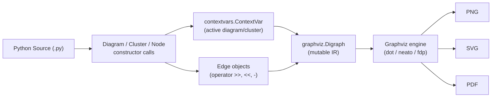
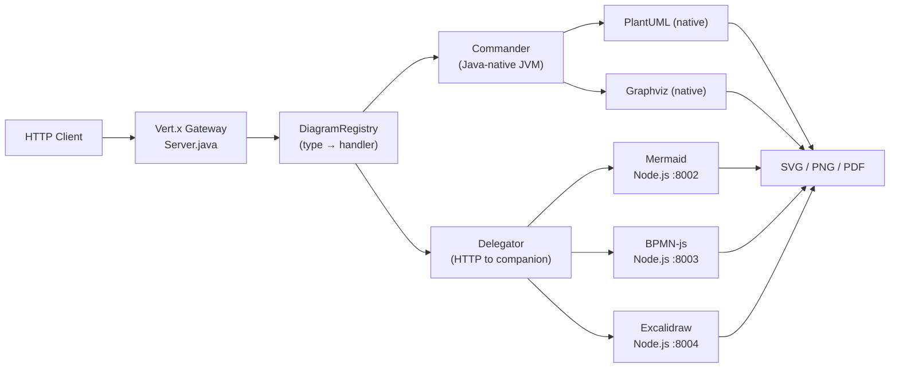
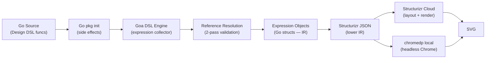
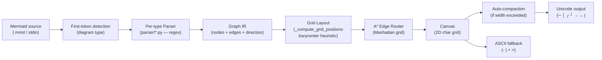

# Weekly Scan — Diagram Tooling (2026-06-05)

> **Ngày scan:** 2026-06-05 · **Nguồn:** GitHub topic search + keyword search (pushed ≥ 2026-05-29)

---

## Executive Summary

- **termaid** (fasouto/termaid) là highlight tuần này: pure-Python, zero-dependency Mermaid→terminal renderer với A\* edge routing trên grid — pattern trực tiếp applicable cho kymo nếu cần terminal output backend hoặc responsive SVG compaction logic.
- **kroki** (yuzutech/kroki) đưa ra DiagramRegistry + Commander/Delegator architecture cho multi-backend dispatch — mô hình này match chính xác với kymo's `--figma`/`--excalidraw`/`--animate` flags và có thể refactor thành một `EmitterRegistry` rõ ràng hơn.
- **mingrammer/diagrams** và **goadesign/model** đều dùng host-language (Python/Go) làm DSL — pattern không phù hợp với kymo's text-first approach, nhưng icon resolution pattern của `diagrams` và AutoLayout abstraction của `model` đáng ghi chú.

## Table of Contents

1. [mingrammer/diagrams](#1-mingrammerdiagrams) — Python-as-DSL cloud architecture, Graphviz backend
2. [yuzutech/kroki](#2-yuzutechkroki) — Multi-backend diagram rendering gateway
3. [goadesign/model](#3-goadesignmodel) — Go-as-DSL C4 model, Structurizr output
4. [fasouto/termaid](#4-fasoutotermaid) — Mermaid → terminal Unicode renderer

---

## 1. mingrammer/diagrams

### §1 — Quick Context

**Pitch:** Dùng Python code thuần (không phải text DSL) để khai báo cloud architecture diagram, với operator overloading (`>>`, `<<`, `-`) làm cú pháp kết nối — khác Mermaid/D2/kymo ở chỗ *không có parser*, Python runtime IS the DSL engine.

| | |
|---|---|
| **Tech stack** | Python 3.9+, `graphviz` 0.13–0.21, `jinja2`; output: PNG / SVG / PDF |
| **Stars / contributors** | 42,315 / 100+ |
| **Version / CI** | 0.25.1; GitHub Actions CI có; MIT license |
| **Distribution** | PyPI — `pip install diagrams` |

### §2 — Architecture Deep-Dive

#### A. Component inventory

| Module | File path | Vai trò |
|---|---|---|
| `Diagram` | `diagrams/__init__.py` | Context manager top-level; wrap `graphviz.Digraph` |
| `Cluster` | `diagrams/__init__.py` | Hierarchical subgraph container, depth-tracked cho nested coloring |
| `Node` | `diagrams/__init__.py` | Base node; operator overloads `>>`, `<<`, `-` gọi `connect()` |
| `Edge` | `diagrams/__init__.py` | Styled connection (color, label, style attrs) |
| `_Base` | `diagrams/base/__init__.py` | Abstract provider base; set `_type`, `_icon_dir` |
| Provider modules | `diagrams/aws/compute.py` (etc.) | Auto-generated service classes: chỉ define `_icon = "filename.png"` |
| `cli.py` | `diagrams/cli.py` | CLI entry point |

**Provider hierarchy (3 levels):**
```
_Base
  └─ _AWS  (_type="aws")
       └─ _Compute  (_icon_dir="resources/aws/compute")
             └─ Lambda  (_icon = "lambda.png")
```
Path resolution tự động: `{_icon_dir}/{_icon}`.

#### B. Pipeline — Happy Path

1. User `from diagrams.aws.compute import Lambda` — import service node class
2. `with Diagram("My System", show=False):` — tạo `graphviz.Digraph`, đặt vào `contextvars.ContextVar`
3. Node instantiation: `lb = ELB("Load Balancer")` — tự register vào current context
4. Operator: `lb >> Lambda("fn")` → gọi `Node.connect()`, append `Edge` vào Digraph
5. Context exit gọi `Diagram.render()` → invoke `graphviz.Digraph.render()`
6. Graphviz CLI (`dot`, `neato`…) chạy ngoài process → file PNG/SVG/PDF xuất hiện

#### C. Data model / IR

- **Không có textual IR riêng** — Python objects directly wrap Graphviz attrs
- `graphviz.Digraph` được mutate incrementally trong context lifetime
- `contextvars.ContextVar` track current active Diagram/Cluster (để Node tự register)
- Không có "compile to lower IR" — Graphviz attrs built in-place, mutable toàn bộ lifecycle

#### D. Input language design

- **Không có parser** — Python object API là DSL
- Type safety qua Python imports (sai tên class → `ImportError` rõ ràng)
- Không có grammar/BNF formal
- Error reporting: Python exceptions at runtime; không có custom error messages

#### E. Layout algorithm

- **Fully delegated** đến Graphviz engine (`dot`, `neato`, `fdp`, `sfdp`, `twopi`, `circo`)
- Không có internal layout code
- Edge routing: controlled by Graphviz (spline, orthogonal tùy engine)
- User chọn engine via `Diagram(graph_attr={"rankdir": "LR"})` hoặc `outformat=...`

#### F. Rendering / output

- **Single backend:** Graphviz (Python `graphviz` binding call → subprocess Graphviz CLI)
- Output: PNG, SVG, PDF — whatever Graphviz supports
- Icons embed vào Graphviz node shapes như `image` attribute
- **Không có animation**

#### G. Extensibility

- Thêm provider: tạo module với classes kế thừa từ provider base, define `_icon`, `_icon_dir`
- Custom nodes: subclass `Node` directly
- Không có plugin system — pure Python inheritance

#### H. Dev experience

- CLI có `--help`; `show=True` auto-opens output image
- Không có VS Code extension / LSP
- Không có watch mode / hot reload
- Không có browser preview

### §3 — Architecture Diagram



### §4 — Verdict

**Điểm đáng học cho kymo:**
- **Icon resolution pattern:** mỗi service class chỉ define `_icon = "filename.png"` và inherit `_icon_dir` từ category base — path được resolve tự động qua hierarchy. Kymo hiện dùng string keys như `aws-tile/aws-bedrock/green` trong DSL text; có thể học pattern này để build một `IconRegistry` lookup table tương tự (key = `"{provider}/{category}/{name}"`, value = resolved path).
- Operator overloading `>>` / `<<` / `-` cho edges là UX decision đáng note — kymo's `-->` arrow syntax trong `.kymo` files có cùng intuition nhưng trong text DSL thay vì code DSL.

**Red flags:**
- 390 open issues, maintainer response chậm — community-maintained thực tế
- Python-as-DSL approach: diagram "source" không diff-friendly, không portable ngoài Python ecosystem — trade-off kymo tránh được bằng text DSL

**Open questions:**
- Làm thế nào `diagrams` resolve user-custom icons vs bundled library icons? Có override mechanism không?

**Verdict: Glance only.** Architecture quá đơn giản (thin Graphviz wrapper). Icon management pattern (§E trong repo) là takeaway duy nhất đáng study 30 phút.

---

## 2. yuzutech/kroki

### §1 — Quick Context

**Pitch:** API gateway thống nhất expose một HTTP endpoint duy nhất cho 20+ diagram backends (PlantUML, Mermaid, D2, Graphviz, BPMN-js, Excalidraw, WaveDrom...) — khác ở chỗ nó *không phải* diagram tool mà là **rendering hub** với pluggable backend dispatch.

| | |
|---|---|
| **Tech stack** | Java (Vert.x) gateway + Node.js companion services; output: SVG / PNG / PDF (backend-dependent) |
| **Stars / contributors** | 4,170 / 80+; actively maintained |
| **Version / CI** | Continuous releases; GitHub Actions CI; MIT license |
| **Distribution** | Docker image; `docker run yuzutech/kroki` |

### §2 — Architecture Deep-Dive

#### A. Component inventory

| Module | Path | Vai trò |
|---|---|---|
| `Server` | `server/src/main/java/io/kroki/server/Server.java` | Vert.x HTTP gateway; CORS; route registration |
| `DiagramRegistry` | `server/.../DiagramRegistry` | Maps diagram type string → handler (Commander hoặc Delegator) |
| `Commander` | `server/...` | Executes native Java-based backends (PlantUML, Graphviz, UMLet) |
| `Delegator` | `server/...` | HTTP delegate đến companion service |
| `mermaid/` | Node.js service | Runs Mermaid CLI (Puppeteer-based) |
| `bpmn/` | Node.js service | Wraps bpmn-js |
| `excalidraw/` | Node.js service (experimental) | Wraps Excalidraw |
| `nomnoml/`, `vega/`, `wavedrom/` | Node.js CLIs | Standalone subprocess wrappers |
| `umlet/` | Java API wrapper | UMLet rendering natively |

#### B. Pipeline — Happy Path

1. Client POST `http://kroki:8000/mermaid/svg` với body = Mermaid source text
2. Vert.x Router matches `/{diagram-type}/{output-format}` route pattern
3. `DiagramRegistry.get("mermaid")` returns a `Delegator` handler
4. `Delegator` makes HTTP request đến Mermaid companion service (Node.js, port 8002)
5. Companion service chạy Mermaid CLI, render SVG
6. SVG bytes trả về Delegator → Vert.x response với `Content-Type: image/svg+xml`

Alternatively cho GET: `GET /mermaid/svg/{deflate+base64(source)}` — URL-encoded diagram.

#### C. Data model / IR

- **Không có internal IR** — Kroki là stateless pass-through
- Source text được forward nguyên vẹn đến backend
- Deflate+base64 URL encoding là "transport encoding" duy nhất — không phải IR
- Không có graph model, không có parse step ở Kroki layer

#### D. Input language design

- **Không parse source** — route dựa trên path parameter `{diagram-type}` duy nhất
- Không có grammar/BNF
- Validation: từng backend tự báo lỗi; Kroki relay error response

#### E. Layout algorithm

- **Không có** — fully delegated đến từng backend tool

#### F. Rendering / output

- **Pluggable emitter pattern:** `DiagramRegistry` + `Commander`/`Delegator` abstraction
- Native Java path (fast): PlantUML, Graphviz, UMLet chạy in-process
- Companion service path (flexible): Mermaid, BPMN, Excalidraw qua HTTP subprocess
- Supports SVG, PNG, PDF tùy backend capability
- Không có animation support

#### G. Extensibility

- Thêm backend: implement handler class, register trong `DiagramRegistry`
- Deploy companion service mới qua Docker Compose
- Không có user-facing plugin system — server-side configuration only

#### H. Dev experience

- REST API — consumable từ bất kỳ HTTP client
- URL-based sharing (base64 encoded diagram trong URL path)
- CORS, configurable headers, max body size

### §3 — Architecture Diagram



### §4 — Verdict

**Điểm đáng học cho kymo:**
- **EmitterRegistry pattern:** Kroki's `DiagramRegistry` + `Commander`/`Delegator` là model architecture rõ ràng cho kymo's multi-output pipeline. Hiện `kymo sample.kymo --animate --figma --excalidraw` xử lý các output modes thế nào? Nếu chưa có emitter abstraction, pattern này là refactor target: `EmitterRegistry { svg: SvgEmitter, animate: AnimatedSvgEmitter, figma: FigmaEmitter, excalidraw: ExcalidrawEmitter }` — add output backend mới không touch core pipeline.
- **Deflate+base64 URL encoding:** Kroki's shareable diagram URLs (`/mermaid/svg/{encoded}`) là pattern kymo.live có thể adopt cho share-diagram links — user get stable URL mà không cần server-side storage. Encoding đơn giản: `base64url(zlib.compress(source.encode()))`.
- **Native vs. delegate split:** Kroki phân biệt fast-path (Java native) và flexible-path (HTTP companion). Kymo có tương tự với Python vs. JS Canvas packages — architecture này suggest rõ khi nào nên in-process vs. subprocess.

**Red flags:**
- Operational overhead cao (Docker, multiple companion services) — không phải library, không thể embed
- Không suitable để kymo adopt directly; pure architectural reference

**Open questions:**
- Tại sao Vert.x thay vì simple Node.js Express? Có lẽ vì PlantUML/UMLet cần JVM in-process — interesting constraint về language choice.

**Verdict: Study deeper.** DiagramRegistry + emitter delegation pattern là concrete architectural idea cho kymo's multi-output backend. Đọc `DiagramRegistry.java` + `Delegator.java` — khoảng 200 dòng, worth 1h.

---

## 3. goadesign/model

### §1 — Quick Context

**Pitch:** Dùng Go source code làm DSL để define C4 Model software architecture, generate ra Structurizr JSON/DSL và SVG — khác ở chỗ type-safe Go functions (Goa DSL framework) thay vì text file, tích hợp live-reload browser preview.

| | |
|---|---|
| **Tech stack** | Go 1.26, Goa v3 (DSL engine), `chromedp` (headless Chrome), `fsnotify` (watch), `lrserver`; output: Structurizr JSON, SVG |
| **Stars / contributors** | 461 / ~15; single primary maintainer |
| **Version / CI** | Go module `goa.design/model`; CI có; MIT license |
| **Distribution** | Go binary — `go install goa.design/model/cmd/mdl@latest` |

### §2 — Architecture Deep-Dive

#### A. Component inventory

| Package | File path | Vai trò |
|---|---|---|
| `dsl` | `dsl/design.go`, `dsl/elements.go`, `dsl/views.go`, `dsl/relationship.go`, `dsl/styles.go`, `dsl/deployment.go` | Go DSL functions: `Design()`, `Person()`, `SoftwareSystem()`, `Container()`, `Views()`, `AutoLayout()`, `Styles()` |
| `mdl` | `mdl/` | Interactive editor: `mdl serve` (live reload), `mdl gen` (JSON export) |
| `stz` | `stz/` | Structurizr cloud API client |
| `cmd/mdl` | `cmd/mdl/` | Entry point cho `mdl` CLI tool |
| `cmd/stz` | `cmd/stz/` | Entry point cho `stz push` |

**DSL structure (Go closures):**
```go
var _ = Design(func() {
    Person("Customer")
    SoftwareSystem("Orders", func() {
        Container("API", func() {
            Tag("service")
        })
    })
    Views(func() {
        SystemContextView(OrdersSystem, func() {
            AutoLayout(RankLeftRight)
        })
    })
})
```

#### B. Pipeline — Happy Path

1. User viết Go file với `var _ = Design(func() { ... })` ở package level
2. `mdl gen` chạy `go run .` → package init thực thi DSL functions (side effects)
3. Goa DSL engine thu thập expression objects vào internal registry (pass 1)
4. Reference resolution pass (pass 2): validate inter-element references (Person → System, etc.)
5. `mdl gen` serialize model ra Structurizr JSON file
6. `mdl serve` chạy Structurizr Lite qua `chromedp` (headless Chrome) với live reload
7. SVG render bởi Structurizr trong browser — `chromedp` capture và export

#### C. Data model / IR

- **Expression objects** (Go structs) được populated bởi Goa DSL functions via side effects
- **Two-pass resolution:** pass 1 collect expressions, pass 2 resolve cross-references
- **Structurizr JSON** là lower IR / exchange format cho layout computation
- Layout xảy ra ở Structurizr (Dagre hoặc Graphviz) — không ở library này

#### D. Input language design

- **Không có text parser** — Go code IS the DSL (cùng approach với `diagrams`)
- Goa DSL framework validate arguments, report DSL errors với location info
- DSL functions accept variadic arguments: string, func(), hoặc domain objects
- Error reporting: Goa DSL errors at eval time với Go file/line info

#### E. Layout algorithm

- `AutoLayout()` DSL function chọn: `ImplementationDagre` (default) hoặc `ImplementationGraphviz`
- Rank directions: `RankTopBottom`, `RankBottomTop`, `RankLeftRight`, `RankRightLeft`
- Spacing defaults: rank=300px, node=600px, edge=200px
- Manual override: `Coord(x, y)` cho element position, `Vertices(...)` cho edge routing
- **Layout computation không xảy ra trong library** — delegated hoàn toàn cho Structurizr

#### F. Rendering / output

- Local preview: `chromedp` (headless Chrome) render Structurizr Lite → SVG capture
- Cloud: upload JSON lên Structurizr cloud qua `stz push`, render ở đó
- `fsnotify` watch mode + `lrserver` live reload khi file thay đổi
- **Không có animation**; không có PNG/PDF native (chỉ SVG qua browser)

#### G. Extensibility

- Thêm architecture elements: extend DSL functions theo Goa style
- `Styles()` DSL function: per-element và per-relationship styles
- Không có plugin system

#### H. Dev experience

- `mdl serve` = live reload browser preview (watch mode)
- headless Chrome dependency (chromedp) — nặng
- Không có VS Code extension / LSP
- Error messages từ Goa DSL framework: có file/line info

### §3 — Architecture Diagram



### §4 — Verdict

**Điểm đáng học cho kymo:**
- **Two-pass DSL validation:** Pattern "pass 1: collect declarations, pass 2: resolve cross-references" rất applicable cho kymo's parser nếu muốn validate edge references đến undefined nodes. Kymo hiện có thể parse `customerA --> unknownNode` mà không báo lỗi rõ — two-pass resolution fix điều này.
- **AutoLayout() abstraction:** `AutoLayout(RankLeftRight)` với pluggable engine (Dagre/Graphviz) và spacing params là interface design kymo nên copy nếu add optional auto-layout. Kymo's absolute `@` positions work great — nhưng một optional `auto-layout: dagre LR` directive sẽ onboard users nhanh hơn, và interface này clean.
- Goa DSL framework approach (Go functions as DSL) interesting nhưng không applicable cho kymo's text-DSL-first philosophy.

**Red flags:**
- Heavy dependency: `chromedp` = full headless Chrome (~120MB binary) chỉ cho local preview
- Tight coupling với Structurizr cloud cho layout — không self-contained nếu Structurizr service down
- 461 stars, 29 open issues, mostly C4-specific niche

**Open questions:**
- Goa DSL engine có thể dùng độc lập (không qua Structurizr) không? Có Go-native layout không?

**Verdict: Glance only.** AutoLayout() interface design (§E) và two-pass validation (§C) là hai takeaways cụ thể. Không có gì khác applicable cho kymo.

---

## 4. fasouto/termaid

### §1 — Quick Context

**Pitch:** Render Mermaid diagrams trực tiếp ra terminal bằng Unicode box-drawing characters, zero external dependencies — backend hoàn toàn mới (terminal thay vì SVG/browser) với A\* edge routing trên grid và barycenter layout.

| | |
|---|---|
| **Tech stack** | Python 3.9–3.13; zero deps (pure stdlib); optional: `rich` (màu), `textual` (TUI widget); output: Unicode terminal text |
| **Stars / contributors** | 304 / single maintainer (fasouto) |
| **Version / CI** | 0.6.1; GitHub Actions CI (`pytest-snapshot`); MIT license |
| **Distribution** | PyPI — `pip install termaid`; CLI `termaid` |

### §2 — Architecture Deep-Dive

#### A. Component inventory

| Module | File path | Vai trò |
|---|---|---|
| Public API | `src/termaid/__init__.py` | `parse(source) -> Graph`, `render(source) -> str` |
| CLI | `src/termaid/cli.py` | `termaid` command: `--theme`, `--width`, `--gap`, `--no-unicode`, `--tui` |
| Per-type parsers | `src/termaid/parser/flowchart.py`, `sequence.py`, `classdiagram.py`, `erdiagram.py`, `gitgraph.py`, `blockdiagram.py`, `piechart.py`, `quadrant.py`, `timeline.py`, `gantt.py`, `journey.py`, `xychart.py`, `packet.py`, `kanban.py`, `treemap.py`, `architecture.py` | 16 parser modules, một per diagram type |
| Graph IR | `src/termaid/model/` | `Graph` dataclass (nodes + edges + direction); sequence models |
| Renderer | `src/termaid/renderer/draw.py` | `Canvas` (2D char grid) → flatten to Unicode string |

**Layout detail từ `src/termaid/parser/architecture.py`:** `_compute_grid_positions()` export — grid-based barycenter heuristic cho node positioning.

#### B. Pipeline — Happy Path

1. User: `echo "flowchart LR\n  A --> B" | termaid` hoặc `termaid diagram.mmd`
2. `parse(source)`: detect diagram type từ first token (`flowchart`, `sequenceDiagram`, `classDiagram`…)
3. Dispatch đến parser module: `parse_flowchart(source) -> Graph`
4. Parser (line-based regex): tokenize lines, build `Graph(nodes, edges, direction)`
5. Layout pass: grid-based barycenter heuristic assign (row, col) positions cho nodes
6. Edge routing: A\* pathfinding trên grid (Manhattan), auto-expand gaps khi có crossings
7. `renderer/draw.py`: map (row, col) positions → `Canvas` 2D char grid, draw nodes và edges với Unicode box chars
8. Auto-compaction: nếu canvas width > terminal width, reduce spacing iteratively
9. Flatten `Canvas` → string; print (hoặc return cho Python API)

#### C. Data model / IR

- **`Graph` dataclass:** `nodes: dict[str, Node]`, `edges: list[Edge]`, `direction: Direction`
- **`Canvas` class:** mutable 2D character grid; cells track occupied/free state
- Layout và rendering là **hai passes riêng biệt**: layout tính positions, renderer paint canvas
- Không có lower IR — `Graph` là IR duy nhất, consumed trực tiếp bởi renderer

#### D. Input language design

- **Per-type parser approach** (giống Mermaid): first token chọn parser module
- **Line-based regex parsing** — không phải PEG/ANTLR; read line-by-line, match patterns
- Không có formal grammar/BNF published
- Error reporting: graceful degradation — invalid syntax → partial render hoặc empty canvas

#### E. Layout algorithm

- **Grid-based barycenter heuristic** (node positioning):
  - Nodes assigned vào grid cells `(row, col)`
  - Barycenter iteration: position node tại weighted average of neighbor positions
  - Iterative passes cho convergence (approximate, không guaranteed optimal)
- **A\* pathfinding** (edge routing):
  - Grid where cells = `OCCUPIED` hoặc `FREE`
  - A\* tìm shortest Manhattan path từ source node edge đến target node edge
  - Auto-expand khoảng cách giữa rows/cols khi edges cross (dynamic gap expansion)
  - Flow-aligned bias: prefer horizontal paths trong `LR` diagrams, vertical trong `TD`
- **Auto-compaction:** khi canvas width > `--width` hoặc terminal width → reduce `--gap`, re-layout

#### F. Rendering / output

- **Single backend:** terminal Unicode box-drawing characters
  - `─`, `│` cho horizontal/vertical lines
  - `╭`, `╮`, `╰`, `╯` cho corners
  - `→`, `←`, `↑`, `↓` cho arrowheads
- ASCII fallback mode (`--no-unicode`): dùng `-`, `|`, `+`, `>`
- Color via `rich` library (optional import)
- 6 color themes: `default`, `terra`, `neon`, `mono`, `amber`, `phosphor`
- TUI widget mode via `textual` (interactive diagram browser)
- **Không có SVG, không có PNG** — terminal only

#### G. Extensibility

- Thêm diagram type: create `src/termaid/parser/newtype.py`, register trong `__init__.py`
- Themes: CLI `--theme` flag; đơn giản là color palette swap
- Không có plugin system

#### H. Dev experience

- CLI với `--help`, `--theme`, `--width`, `--gap`, `--no-unicode`, `--tui`
- Pipe-friendly: stdin support
- Snapshot tests (`pytest-snapshot`) — test toàn bộ Unicode output string
- Không có watch mode / IDE integration

### §3 — Architecture Diagram



### §4 — Verdict

**Điểm đáng học cho kymo:**
- **A\* grid routing → responsive SVG compaction:** termaid's auto-compaction logic (shrink gap khi diagram quá rộng) là pattern applicable cho kymo's SVG output. Kymo hiện dùng absolute `@` coordinates — nếu canvas size không đủ (ví dụ: embed trong doc nhỏ), không có fallback. Một "compact pass" tương tự (scale positions down, re-route edges) sẽ handle responsive SVG cases.
- **Barycenter heuristic làm auto-layout bootstrap:** Nếu kymo cần optional auto-layout (cho users không muốn set `@` positions), barycenter heuristic là implementation đơn giản nhất — không cần ELK/Graphviz dependency. Clone `_compute_grid_positions()` từ `src/termaid/parser/architecture.py` làm starting point.
- **Grid-based edge routing model:** A\* trên grid với dynamic gap expansion elegant hơn hẳn simple straight-line edges. Đây là cách diagram tools thường handle edge crossings mà không cần full Sugiyama algorithm.
- **Zero-dependency terminal backend:** nếu kymo muốn thêm `kymo sample.kymo --terminal` output mode (e.g., cho CI logs hoặc quick preview), architecture của termaid (Graph IR → Canvas → Unicode) là blueprint sẵn có.

**Red flags:**
- 304 stars, single maintainer — bus factor 1
- Layout "approximate" per README — dense graphs vẫn có crossings; không có crossing minimization formal
- Line-based regex parser fragile với edge cases của Mermaid syntax (Mermaid grammar phức tạp)
- Snapshot tests tốt nhưng không có property-based tests cho layout correctness

**Open questions:**
- Tại sao không dùng ELK.js/dagre rendered ra Unicode? Zero-dependency constraint có phải lý do chính không?
- Auto-compaction có preserve edge routing topo không, hay chỉ scale positions?

**Verdict: Study deeper.** A\* grid routing và auto-compaction code là 2h đọc rất có giá trị. Clone repo, đọc `src/termaid/renderer/draw.py` (Canvas renderer) và `src/termaid/parser/architecture.py` (`_compute_grid_positions`). Pattern responsive compaction có thể apply trực tiếp cho kymo's SVG scaling story.

---

*Scan tiếp theo: 2026-06-12. Review lại khi có release mới từ mermaid-js/mermaid (v12.x) hoặc terrastruct/d2 (1.x).*
