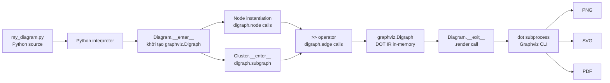

# Weekly Diagram Tooling Research — 2026-06-06

> Scan period: 2026-05-30 → 2026-06-06 | Scout: Claude Sonnet 4.6

---

## Executive Summary

- **Gateway aggregation** đang trở thành pattern phổ biến: kroki tập trung 23+ diagram engines sau một REST API duy nhất, tách rời rendering engine khỏi HTTP transport — đây là kiến trúc tham khảo trực tiếp cho kymo nếu cần support multi-format.
- **Host-language-as-DSL** (mingrammer/diagrams) cho thấy rằng không cần viết parser nếu Python operator overloading (`>>`, `-`, `<<`) đủ expressiveness — nhưng trade-off là mất portability (chỉ dùng được từ Python).
- **Layout algorithm** tiếp tục là bottleneck kỹ thuật: elkjs expose 6 algorithms (layered/Sugiyama là flagship) qua promise-based API với ELK JSON IR — đây là thư viện layout production-grade duy nhất có thể nhúng vào browser mà không cần native binary.

---

## Table of Contents

1. [yuzutech/kroki — Diagram Gateway tập trung 23+ engines](#1-yuzutechkroki)
2. [mingrammer/diagrams — Python operator overloading là DSL](#2-mingrammerdiagrams)
3. [kieler/elkjs — Sugiyama layout algorithm biên dịch từ Java sang JS](#3-kielerelkjs)
4. [plantuml/plantuml — Java DSL trưởng thành với 25+ diagram types](#4-plantumlplantuml)

---

## 1. yuzutech/kroki

**GitHub:** https://github.com/yuzutech/kroki | **Pushed:** 2026-06-05

---

### §1 — Quick Context

**One-line pitch:** Unified HTTP API nhận text source và trả image, aggregating 23+ diagram engines trong một gateway — thay vì integrate mỗi engine riêng lẻ.

**Tech stack:** Java (Vert.x) cho gateway core (92.5% JS, 6.3% Java), Node.js (micro framework) cho companion services (Mermaid, BPMN, Excalidraw). Output: SVG, PNG, PDF, Base64.

**Repo health:** ★4,171 | ~30 contributors | CI: GitHub Actions có build+test | Last push: 2026-06-05 | License: MIT.

**Distribution:** Docker Compose (multi-container) + jar + npm packages cho từng companion service.

---

### §2 — Architecture Deep-Dive

#### A. Component Inventory

- `Server.java` (`server/src/main/java/io/kroki/server/Server.java`) — Vert.x HTTP server setup, khởi tạo Router, BodyHandler, CorsHandler.
- `DiagramService` interface (`server/src/main/java/io/kroki/server/service/DiagramService.java`) — contract cho mọi diagram handler: `getSupportedFormats()`, `getSourceDecoder()`, `convert(source, serviceName, format, options): Future<Buffer>`.
- `DiagramRegistry` (`server/src/main/java/io/kroki/server/service/`) — map diagram type name → DiagramService implementation (xem bảng routing bên dưới).
- Companion services (`mermaid/`, `bpmn/`, `excalidraw/`, `nomnoml/`, `vega/`, `bytefield/`, `wavedrom/`) — Node.js micro HTTP servers, mỗi cái expose `/svg` và `/png` endpoints.
- `Main.java` — Application entry point, load config từ environment variables.

**Routing table** (trích từ DiagramRegistry):

| Diagram type(s) | Handler class |
|---|---|
| plantuml, c4plantuml | `Plantuml` |
| mermaid | `Mermaid` (proxies sang Node.js companion) |
| graphviz, dot | `Graphviz` |
| d2 | `D2` |
| bpmn | `Bpmn` (companion) |
| excalidraw | `Excalidraw` (companion) |
| structurizr | `Structurizr` |
| vega, vegalite | `Vega` (companion) |
| blockdiag, seqdiag, actdiag, nwdiag | `Blockdiag` |
| svgbob | `Svgbob` |
| pikchr | `Pikchr` |
| tikz | `TikZ` |
| wireviz | `Wireviz` |
| goat | `Goat` |
| ditaa, erd, umlet, nomnoml, symbolator, bytefield, wavedrom, dbml, diagramsnet | các handler tương ứng |

#### B. Pipeline / Control Flow

1. User gửi `POST /` với body là diagram source (plain text hoặc JSON `{"diagram_source": "..."}`) và header `Content-Type: text/plain; charset=utf-8` kèm path `/{diagram-type}/{output-format}`.
2. Vert.x Router match path → dispatch tới `DiagramRegistry`.
3. Registry lookup diagram type name → tìm `DiagramService` implementation.
4. `SourceDecoder` của service decode input (base64, deflate, plain text tùy loại).
5. `convert()` được gọi async — với engine native Java (PlantUML, Graphviz) thì xử lý in-process; với companion service (Mermaid, BPMN) thì proxy HTTP request sang Node.js container.
6. Buffer (SVG bytes hoặc PNG bytes) được trả về qua HTTP response với Content-Type phù hợp.

#### C. Data Model / Intermediate Representation

Kroki không có IR internal — nó là **transparent proxy**. Diagram source đi qua nguyên xi đến rendering engine. Java gateway chỉ làm: decode → route → re-encode response. Không có parse step ở tầng gateway. Mỗi engine tự quản lý IR của mình (PlantUML dùng `ISequenceDiagram`, Graphviz dùng DOT AST, v.v.).

#### D. Input Language Design

Không có parser riêng ở tầng gateway. Kroki accept **bất kỳ text format nào** mà underlying engine hiểu. Request encoding: URL-encoded (deflate + base64) cho GET, plain JSON/text cho POST. Error reporting: companion services trả về 3 mức lỗi — 408 TimeoutError, 400 SyntaxError, 500 GenericError — với JSON body kèm stack trace.

#### E. Layout Algorithm

Kroki không implement layout — hoàn toàn delegated cho từng engine. Graphviz dùng dot/neato/circo, ELK thông qua mermaid, v.v. Không có crossing minimization hay orthogonal routing ở tầng kroki.

#### F. Rendering / Output Strategy

Backend support: SVG, PNG, PDF (tùy engine). Animation: không có — kroki là static image service. Pattern: **pluggable emitter** — mỗi `DiagramService` implementation khai báo `getSupportedFormats()` và convert theo yêu cầu. Companion services render SVG bằng engine native (Mermaid dùng headless browser/Puppeteer-like, BPMN parse XML rồi generate SVG).

#### G. Extensibility

Thêm diagram type mới = implement `DiagramService` interface + register vào `DiagramRegistry`. Companion service pattern: viết Node.js HTTP server expose `/svg` và `/png`, cấu hình URL qua environment variable (`KROKI_MERMAID_HOST=mermaid`). Không có plugin API công khai — đây là internal extension pattern.

#### H. Dev Experience

- Docker Compose: `docker-compose up` là đủ để chạy full stack.
- Có `/health`, `/v1/health`, `/healthz` endpoints cho Kubernetes probes.
- Không có watch mode hay LSP.
- Web UI tại `kroki.io` để test diagram nhanh.
- CI: GitHub Actions build và test.

---

### §3 — Architecture Diagram

```mermaid
flowchart LR
    subgraph Client
        A[HTTP POST\n/{type}/{format}]
    end
    
    subgraph Gateway["Java Gateway (Vert.x)"]
        B[Router] --> C[DiagramRegistry]
        C --> D{Lookup\nDiagramService}
    end
    
    subgraph NativeEngines["Native Engines (in-process)"]
        E[PlantUML]
        F[Graphviz/dot]
        G[Svgbob]
        H[Pikchr / TikZ / GoAT]
    end
    
    subgraph Companions["Companion Services (Node.js HTTP)"]
        I[kroki-mermaid :8002]
        J[kroki-bpmn :8003]
        K[kroki-excalidraw :8004]
        L[kroki-vega :8005]
    end
    
    M[SVG / PNG / PDF Response]
    
    A --> B
    D --> E --> M
    D --> F --> M
    D --> G --> M
    D --> H --> M
    D -->|HTTP proxy| I --> M
    D -->|HTTP proxy| J --> M
    D -->|HTTP proxy| K --> M
    D -->|HTTP proxy| L --> M
```

---

### §4 — Verdict

**Điểm đáng học cho kymostudio:**
- Pattern `DiagramService` interface + registry là cách sạch nhất để support multi-format mà không làm phức tạp core pipeline. Kymo có thể adopt pattern tương tự nếu muốn support Mermaid output ngoài format native của mình.
- Companion service tách rời Node.js rendering khỏi Java gateway rất elegant — mỗi engine chạy trong process riêng, failure isolation tốt. Nhưng complexity của Docker Compose setup là real cost.
- Encoding scheme (deflate + base64 → URL-safe) là best practice để embed diagram trong URL — đáng copy cho kymo's share/embed feature.

**Red flags:**
- 151 open issues, backlog lớn, ít reviewer.
- Diagram type support uneven — một số engines (diagramsnet) vẫn "experimental".
- Không có official plugin API cho third-party engines.

**Open questions:** Kroki handle font embedding trong SVG không? Có thể self-host với một binary duy nhất không (không cần Docker)?

**Verdict: Study deeper** — architecture pattern trực tiếp applicable cho kymo's multi-format aspirations.

---

## 2. mingrammer/diagrams

**GitHub:** https://github.com/mingrammer/diagrams | **Pushed:** 2026-06-04

---

### §1 — Quick Context

**One-line pitch:** Python code trực tiếp là DSL — không cần viết parser, dùng `with` blocks cho groups và `>>` operator cho connections để generate cloud architecture diagrams.

**Tech stack:** Python 3.9+, Graphviz (`>=0.13.2`) là rendering backend duy nhất, Jinja2 cho icon path templating. Output: PNG (default), SVG, PDF, dot file.

**Repo health:** ★42,323 | ~150 contributors | CI: GitHub Actions | PyPI: `pip install diagrams` | Last push: 2026-06-04.

**Distribution:** PyPI package. Graphviz binary required separately (system-level).

---

### §2 — Architecture Deep-Dive

#### A. Component Inventory

- `Diagram` class (`diagrams/diagram.py`) — context manager top-level, wrap `graphviz.Digraph`, quản lý theme, output format, direction.
- `Node` class (`diagrams/diagram.py`) — base class cho tất cả cloud components, hold icon path và Graphviz node attributes.
- `Edge` class (`diagrams/diagram.py`) — connection giữa nodes, có label, color, style attributes.
- `Cluster` class (`diagrams/diagram.py`) — `with Cluster("name"):` tạo `subgraph` trong Graphviz dot với border và background color tự động.
- Provider modules (`diagrams/aws/`, `diagrams/gcp/`, `diagrams/azure/`, ...) — subclasses của Node với icon path pre-configured cho từng cloud service.
- `diagrams/cli.py` — minimal CLI wrapper (ít được dùng, chủ yếu users import Python API).

#### B. Pipeline / Control Flow

1. User chạy `python my_diagram.py` — file Python là input.
2. `with Diagram("Title", filename="output", show=True):` kích hoạt `__enter__()`, khởi tạo `graphviz.Digraph` instance, set theme attributes (background, node style, edge style).
3. Bên trong context: mỗi Node subclass instantiation thêm node vào Digraph. `>>` operator gọi `__rshift__`, tạo `Edge` và gọi `graphviz.Digraph.edge()`.
4. `with Cluster("name"):` tạo nested `graphviz.Digraph` subgraph với `cluster_` prefix (Graphviz convention).
5. `__exit__()` gọi `Diagram.render()` → delegate sang `graphviz.Digraph.render(format=..., view=show)`.
6. Graphviz CLI binary (`dot`) được spawned as subprocess → PNG/SVG/PDF file xuất hiện.

#### C. Data Model / Intermediate Representation

**Không có custom IR.** Graphviz `Digraph` object là IR duy nhất — mutable, built incrementally trong context. Nodes được add qua `digraph.node(id, label, image=icon_path, ...)`. Edges được add qua `digraph.edge(source_id, target_id, label=..., color=..., style=...)`. Clusters được add qua `digraph.subgraph()`.

Implication: diagrams hoàn toàn phụ thuộc vào Graphviz layout engine — không có custom layout pass. Auto-layout được thực hiện bởi `dot` binary (hierarchical), `neato` (spring force), tùy `graph_attr={'layout': 'neato'}`.

#### D. Input Language Design

**Không có parser.** Python itself là parser. Technique: operator overloading + context manager protocol.

Key DSL operators:
- `A >> B` → directed edge A→B (calls `A.__rshift__(B)`)
- `A << B` → directed edge B→A
- `A - B` → undirected edge (calls `A.__sub__(B)`)
- `A >> [B, C, D]` → fan-out: A connects to list of nodes
- `with Cluster("name"):` → subgraph grouping

Error reporting: Python runtime exceptions — nếu Graphviz binary không được install thì raise `graphviz.backend.ExecutableNotFound` với message có ích.

Formal grammar: không có. EBNF: không tồn tại.

#### E. Layout Algorithm

Hoàn toàn delegated cho Graphviz. Default: `dot` (Sugiyama-based hierarchical). User có thể override qua `graph_attr={'layout': 'neato'}` (force-directed), `'circo'` (circular), `'twopi'` (radial). Crossing minimization: Graphviz's barycentric method trong `dot`. Edge routing: orthogonal routing không có — Graphviz dùng B-spline curves.

Không có custom layout pass, không có port-based routing, không có constraint-based positioning.

#### F. Rendering / Output Strategy

Backend: **Graphviz subprocess** duy nhất (`dot` binary). Output formats: PNG, SVG, PDF, dot source. Animation: không có. Single backend — không pluggable.

SVG quality: reasonable nhưng font-dependent, icon rendering qua `image` attribute của Graphviz node (embedded PNG icons trong SVG). Text labels sử dụng Graphviz's default font (Helvetica/Arial).

#### G. Extensibility

Thêm provider mới = tạo submodule (`diagrams/mycorp/`) với subclass của Node:

```python
class MyService(Node):
    _icon = "resources/mycorp/myservice.png"
    _icon_dir = "diagrams/mycorp"
```

Custom icons: đặt PNG file vào đúng directory, không cần code change nào khác. Theme: pre-defined palette (neutral, pastel, blues, greens, orange) kiểm soát background, node border, edge color. Không có plugin system chính thức.

#### H. Dev Experience

- CLI: `python my_diagram.py` — không có `--watch` mode.
- IDE: không có LSP hay VS Code extension.
- Hot reload: không có.
- Browser preview: diagram có thể `show=True` để open file viewer sau khi render.
- Errors từ Graphviz subprocess đôi khi cryptic (raw dot error messages).

---

### §3 — Architecture Diagram



---

### §4 — Verdict

**Điểm đáng học cho kymostudio:**
- **Operator overloading as DSL** là pattern cực kỳ low-friction cho users quen Python — kymo có thể học cách thiết kế "code is the diagram" UX nếu target TypeScript/JavaScript audience (dùng method chaining thay operator overloading).
- **Cluster depth coloring** (Diagrams tự động tăng độ đậm màu nền theo nesting depth) là UX pattern hay cho grouped diagrams — đáng implement tương tự trong kymo's group feature.
- **Icon-per-node pattern**: mỗi node class có `_icon` path pre-set giúp users không cần nghĩ về styling — kymo có thể adopt pattern này cho domain-specific node types.

**Red flags:**
- 390 open issues — backlog lớn, maintainer bandwidth hạn chế.
- Lock-in vào Graphviz binary: không thể render in-browser, không thể export to formats khác Graphviz support.
- B-spline edge routing của Graphviz cho ra kết quả đôi khi xấu với dense graphs.

**Open questions:** Có cách nào thay thế Graphviz backend bằng ELK hay Dagre để improve edge routing không?

**Verdict: Study deeper** — operator-as-DSL pattern trực tiếp relevant cho kymo's API design, nhưng đừng copy Graphviz dependency.

---

## 3. kieler/elkjs

**GitHub:** https://github.com/kieler/elkjs | **Pushed:** 2026-05-25

---

### §1 — Quick Context

**One-line pitch:** Eclipse Layout Kernel biên dịch từ Java sang JavaScript qua GWT, expose 6 layout algorithms (Sugiyama layered là flagship) qua Promise-based API — library layout duy nhất production-grade chạy trong browser mà không cần native binary.

**Tech stack:** JavaScript (71.8%), Java nguồn (14.8%, GWT-compiled sang JS). Zero runtime dependencies. Node.js và browser đều supported. Build: Gradle + Babel + Browserify.

**Repo health:** ★2,602 | ~20 contributors | CI: có tests (Mocha/Chai) | npm: `@kieler/elkjs` | Last push: 2026-05-25 | Version: 0.12.0.

**Distribution:** npm package. `elk.bundled.js` cho browser script tag, `elk-api.js` + `elk-worker.js` cho Node.js / Web Worker setup.

---

### §2 — Architecture Deep-Dive

#### A. Component Inventory

- `elk-api.js` (`src/api/elk-api.js`) — JavaScript API layer: `ELK` class với `layout()` method, message passing với Web Worker.
- `elk-worker.js` (generated, không edit trực tiếp) — Layout engine implementation, GWT-compiled từ Java ELK codebase. Chạy trong Web Worker để không block UI thread.
- `elk.bundled.js` — Browserify bundle của cả hai, dùng được trong `<script>` tag.
- `main.js` — Node.js entry point, load `elk-api.js` với worker path.
- `typings/` — TypeScript type definitions cho `ELKNode`, `ELKEdge`, `LayoutOptions`.
- `build.gradle` — Gradle wrapper gọi GWT compilation từ Java ELK sources.

#### B. Pipeline / Control Flow

1. User khai báo graph dưới dạng ELK JSON: `{ id: "root", children: [{id: "n1", width: 100, height: 50}, ...], edges: [{id: "e1", sources: ["n1"], targets: ["n2"]}] }`.
2. `elk.layout(graph, {layoutOptions: {"elk.algorithm": "layered", "elk.direction": "RIGHT"}})` được gọi.
3. `ELK` class serialize graph thành message, gửi sang Web Worker (browser) hoặc child process (Node.js) qua `postMessage`.
4. `elk-worker.js` receive message, chạy GWT-compiled Java layout algorithm.
5. Layout algorithm tính toán `x`, `y`, `width`, `height` cho mỗi node; tính route sections (`startPoint`, `endPoint`, `bendPoints`) cho mỗi edge.
6. Worker gửi kết quả về qua `postMessage` — augmented ELK JSON với positions.
7. `ELK.layout()` Promise resolves với graph đã có positions đầy đủ.

#### C. Data Model / Intermediate Representation

**ELK JSON** là IR duy nhất — immutable sau khi truyền vào, output là deep copy augmented với positions.

Input ELK JSON structure:
```json
{
  "id": "root",
  "layoutOptions": { "elk.algorithm": "layered" },
  "children": [
    { "id": "n1", "width": 100, "height": 50, "labels": [{"text": "Node 1"}] }
  ],
  "edges": [
    { "id": "e1", "sources": ["n1"], "targets": ["n2"] }
  ]
}
```

Output augments với:
- `x`, `y` cho mỗi node (top-left corner)
- `sections[].startPoint`, `sections[].endPoint`, `sections[].bendPoints` cho edge routing
- `junctionPoints` cho hyperedge splits

Nodes có thể có `ports` (connection anchors), `children` (nested graphs), `labels`. Edge routing: `sections` array encode piecewise-linear path.

#### D. Input Language Design

Không có text DSL — ELK JSON là "language". JSON schema không chính thức nhưng TypeScript typings (`typings/`) đóng vai trò informal spec. Không có text parser. Error reporting: layout failures throw JavaScript exceptions với messages từ Java side (thường technical, ít helpful cho end users).

#### E. Layout Algorithm

6 algorithms mặc định:

| Algorithm | Use case |
|---|---|
| **layered** (Sugiyama) | Directed graphs, hierarchical, data flow — **flagship** |
| **stress** | Minimize stress function, general graphs |
| **mrtree** | Tree layouts (compact, radial tree) |
| **radial** | Circular/radial arrangement |
| **force** | Force-directed (spring model) |
| **disco** | Disconnected components layouter |
| **box**, **fixed**, **random** | Special cases, always included |

**Layered algorithm** (Sugiyama framework):
- Phase 1: Cycle removal (edge reversal)
- Phase 2: Layer assignment (Coffman-Graham hoặc longest path)
- Phase 3: Crossing minimization (barycentric method, multi-pass)
- Phase 4: Node placement (Brandes-Köpf algorithm)
- Phase 5: Edge routing (orthogonal splines với bend minimization)

Layout options: `elk.direction` (RIGHT, DOWN, LEFT, UP), `elk.spacing.nodeNode`, `elk.layered.crossingMinimization.strategy`, `elk.edgeRouting` (ORTHOGONAL, POLYLINE, SPLINES).

#### F. Rendering / Output Strategy

ELKjs chỉ tính layout — **không render gì cả**. Output là positioned ELK JSON. Rendering là responsibility của consumer (React, Svelte, raw SVG/Canvas). Không có animation mechanism. Không có emitter pattern — single output format (ELK JSON).

Typical integration: consumer nhận ELK JSON output, iterate qua nodes để draw rectangles, iterate qua edge sections để draw paths (SVG `<path d="...">` với bend points).

#### G. Extensibility

Layout options được set per-element (graph, node, port, edge) qua `layoutOptions` object — rất granular. Thêm algorithm mới cần modify Java ELK source và recompile qua GWT — không pluggable ở JavaScript level.

#### H. Dev Experience

- API surface nhỏ: chỉ cần biết `layout()` và ELK JSON schema.
- TypeScript typings: đầy đủ — IDE autocomplete hoạt động tốt.
- Web Worker setup: cần configure worker path, hơi boilerplate.
- 99 open issues, nhiều là feature requests cho new layout options.
- Không có visual debugger cho layout (phải render thủ công để debug).

---

### §3 — Architecture Diagram

```mermaid
flowchart LR
    A[ELK JSON Input\n{children, edges,\nlayoutOptions}] --> B[elk-api.js\nELK class]
    B --> C{Runtime}
    C -->|Browser| D[Web Worker\nelk-worker.js]
    C -->|Node.js| E[Worker thread\nelk-worker.js]
    D --> F[GWT-compiled\nJava Layout Engine]
    E --> F
    F --> G{Algorithm\nSelection}
    G --> H[layered / Sugiyama\nCycle removal → Layers\n→ Crossing min → Placement\n→ Edge routing]
    G --> I[force / stress /\nmrtree / radial / disco]
    H --> J[Augmented ELK JSON\nx,y,width,height\nedge sections+bendPoints]
    I --> J
    J --> K[Consumer renders\nSVG / Canvas / WebGL]
```

---

### §4 — Verdict

**Điểm đáng học cho kymostudio:**
- **ELK JSON format** là IR chuẩn cho layout-separate-from-render architecture — kymo nên adopt format tương tự (hoặc compat) để có thể swap layout engine sau này.
- **Web Worker isolation**: chạy layout computation trong worker thread là mandatory cho smooth UI — kymo nên làm tương tự nếu layout phức tạp. Worker message passing overhead nhỏ so với layout computation time.
- **Sugiyama phase breakdown** (5 phases riêng biệt) là template tốt để implement kymo's own hierarchical layout: có thể bắt đầu với layer assignment + basic crossing minimization, skip bend minimization về sau.
- **Port-based edge routing**: ELK có concept "port" (anchor point trên cạnh của node) cho phép edge attach vào specific point — critical cho professional diagram quality.

**Red flags:**
- GWT compilation là black box — debug layout bugs ở JavaScript level rất khó.
- `elk-worker.js` bundle nặng (~3MB minified) — startup time đáng kể cho browser.
- Update chậm: version 0.12.0, API ổn định nhưng tính năng mới hiếm.

**Open questions:** Có thể compile ELK thành WASM thay GWT để nhận được performance tốt hơn không? Benchmark so với Dagre ra sao với large graphs?

**Verdict: Study deeper** — ELK JSON format và Sugiyama phase model là reference implementation tốt nhất hiện có cho hierarchical layout trong browser.

---

## 4. plantuml/plantuml

**GitHub:** https://github.com/plantuml/plantuml | **Pushed:** 2026-06-05

---

### §1 — Quick Context

**One-line pitch:** DSL text-to-diagram trưởng thành nhất (15+ năm), support 25+ diagram types từ UML sequence đến Gantt/wireframe, Java với custom line-based parser không dùng formal grammar.

**Tech stack:** Java (toàn bộ), TeaVM để compile sang JavaScript cho browser, Graphviz (tùy chọn, cho class/component diagrams), Viz.js alternative. Output: PNG, SVG, PDF, EPS, ASCII art.

**Repo health:** ★13,067 | ~50 contributors | CI: Gradle build | Has discussions: yes | Last push: 2026-06-05.

**Distribution:** JAR binary (`plantuml.jar`), Docker image, Maven/Gradle dependency, npm (qua TeaVM compilation).

---

### §2 — Architecture Deep-Dive

#### A. Component Inventory

- `Run.java` (`src/main/java/net/sourceforge/plantuml/Run.java`) — CLI entry point, parse args qua `CliParser`, multi-threaded file processing qua `FileGroup` + thread pool.
- `CliParser` / `CliOptions` / `CliFlag` — argument parsing layer với enum-based flag handling.
- `BlockUml.java` (`src/main/java/net/sourceforge/plantuml/BlockUml.java`) — container cho preprocessed diagram source, delegate sang `PSystemBuilder` hoặc `PSystemBuilder2` để create diagram object.
- `TimLoader` — preprocessor pass: expand `!include`, `!define` macros trước khi parse.
- `PSystemBuilder` / `PSystemBuilder2` — core parse dispatch: detect diagram type từ `@start*` tag, create appropriate `AbstractPSystem` subclass.
- `AbstractPSystem` (và subclasses: `SequenceDiagram`, `ClassDiagram`, `StateDiagram`, ...) — IR cho từng diagram type.
- `FileFormat` / `FileFormatOption` enum — output format selection (PNG, SVG, PDF, PREPROC, OBFUSCATE, PIPEMAP).
- `SourceFileReader` — per-file reader với charset support.
- TeaVM module — compile Java bytecode sang JavaScript cho browser deployment.

#### B. Pipeline / Control Flow

1. User chạy `java -jar plantuml.jar diagram.puml` hoặc `java -jar plantuml.jar -tsvg diagram.puml`.
2. `Run.main()` gọi `CliParser.parse(args)` → `CliOptions` object.
3. `FileGroup` discovery: tìm tất cả `.puml`/`.pu`/`.txt` files matching patterns.
4. Thread pool (`processInParallel()`) xử lý từng file trong parallel.
5. Mỗi file: `SourceFileReader` đọc text → `TimLoader` preprocess macros → `BlockUml` nhận `StringLocated` list.
6. `PSystemBuilder.createPSystem()` đọc `@startuml` / `@startsequence` / `@startclass` etc. tag → dispatch sang appropriate diagram class.
7. Diagram class parse từng dòng text (line-based regex matching, không formal grammar).
8. Parse thành `AbstractPSystem` IR (immutable sau parse).
9. `AbstractPSystem.createImageBuilder()` → layout pass (Graphviz cho class/component, internal Sugiyama-like cho sequence, internal force-directed cho mindmap).
10. Render sang `FileFormat` target → file output.

#### C. Data Model / Intermediate Representation

Mỗi diagram type có IR riêng:
- **Sequence diagrams**: `SequenceDiagram` holds list of `Event` objects (Message, Note, Divider, etc.) — ordered list, không có graph structure.
- **Class diagrams**: graph của `Link` và `Leaf` objects với UML stereotypes.
- **State machines**: `StateSpot` nodes + transition edges.
- IR là mutable trong quá trình parse (được build incrementally), immutable sau parse hoàn tất (khi `createImageBuilder()` được gọi).

Không có "compile to lower IR" step như D2's TALA — mỗi diagram type có render pass riêng trực tiếp từ high-level IR.

#### D. Input Language Design

**Parser approach: line-based, custom regex matching.**

PlantUML không dùng formal grammar (không có ANTLR, không có PEG, không có recursive descent parser). Thay vào đó:
- Preprocessing: `TimLoader` expand `!include`, `!define` macros
- Line dispatch: mỗi dòng được match với regex patterns trong command dispatcher
- Diagram-specific parsing: mỗi diagram class có set of "command" objects, mỗi command có regex pattern để match và `execute()` method

Example cho sequence diagram:
```
Alice -> Bob: Hello
```
→ match pattern `(\w+)\s*(->>?|-->|<-|<--)\s*(\w+)\s*:\s*(.*)`

Không có formal BNF/EBNF spec được publish. Grammar là implicit trong command dispatcher code.

Error reporting: line-by-line errors với line number, nhưng messages đôi khi generic.

#### E. Layout Algorithm

Varies by diagram type:
- **Sequence diagrams**: không cần 2D layout — linear timeline, actors arranged horizontally, messages vertically. Internal implementation, không dùng Graphviz.
- **Class/Component diagrams**: delegated sang Graphviz `dot` binary (hoặc Viz.js ở browser), Sugiyama hierarchical.
- **Mind maps**: internal force-directed hoặc tree layout.
- **State machines**: Graphviz.
- **Gantt/Timing**: special timeline renderer, không dùng graph layout.

Edge routing: Graphviz cho các diagram type dùng Graphviz → B-spline. Sequence diagrams: horizontal arrows, no routing needed.

#### F. Rendering / Output Strategy

Backend: Java AWT/Graphics2D cho PNG, internal SVG writer cho SVG, Apache FOP cho PDF. Multiple backends nhưng không pluggable — hardcoded switch theo FileFormat enum.

TeaVM variant: compile Java → JS, dùng Viz.js thay Graphviz native binary, render SVG ở browser.

Animation: không có.

SVG output: decent quality nhưng verbose (không optimize, nhiều transform/translate nesting).

#### G. Extensibility

- Custom icon/sprite: `!include <tupadr3/...>` spritesheet system
- Custom themes: `!theme ...` command với Puml theme files
- Không có plugin API — monolithic codebase
- Custom diagram type: cần modify core Java codebase

#### H. Dev Experience

- CLI: `java -jar plantuml.jar --help` — đầy đủ, có nhiều flags
- VS Code extension: có (và IntelliJ plugin) — live preview
- Watch mode: không chính thức, nhưng có third-party watch wrappers
- Browser: TeaVM compilation cho phép dùng ở browser (plantuml.com/plantuml/svg/...)
- 610 open issues — backlog rất lớn

---

### §3 — Architecture Diagram

```mermaid
flowchart LR
    A[diagram.puml\ntext source] --> B[SourceFileReader\n+charset]
    B --> C[TimLoader\npreprocessor\n!include, !define]
    C --> D[BlockUml\n@start detection]
    D --> E{PSystemBuilder\ndiagram type dispatch}
    E --> F[SequenceDiagram\nEvent list IR]
    E --> G[ClassDiagram\nNode+Link graph IR]
    E --> H[StateDiagram\nState+Transition IR]
    E --> I[MindMap / Gantt\nspecialized IRs]
    F --> J[Internal sequence\nlayout + renderer]
    G --> K[Graphviz dot\nlayout]
    H --> K
    K --> L[AWT/SVG Renderer]
    J --> L
    I --> M[Timeline/Tree\nRenderer]
    L --> N[PNG]
    L --> O[SVG]
    L --> P[PDF via FOP]
    M --> N
```

---

### §4 — Verdict

**Điểm đáng học cho kymostudio:**
- **Multi-diagram-type dispatch pattern** (PSystemBuilder detect `@start*` tag → route sang specialized IR class) là cách clean nhất để support nhiều diagram types trong cùng một tool. Kymo có thể adopt `@startkymo` / `@startflow` / `@startstate` paradigm.
- **Line-based parser** không cần formal grammar vẫn đủ tốt cho user-facing DSL nếu diagram type đủ constrained — kymo không cần invest vào ANTLR grammar ngay từ đầu.
- **Sprite/icon include system** (`!include <aws/compute>`) là ý tưởng hay cho kymo's node icon library — user include icon pack theo namespace thay vì manually specify icon path.
- **TeaVM strategy** (compile Java → browser JS) là interesting nếu kymo ever muốn ship browser-native renderer từ server-side Java core.

**Red flags:**
- Codebase monolithic và legacy — 15 năm Java không refactor lớn, rất khó contribute.
- Không có formal grammar → parser behavior đôi khi unpredictable với edge cases.
- SVG output verbose, không optimized cho web.
- 610 issues, maintainer single-point-of-failure.

**Open questions:** PlantUML có plan cho WebAssembly native thay TeaVM không? Graphviz dependency có bao giờ được thay bằng pure-Java layout không?

**Verdict: Glance only** — architecture patterns hữu ích để study (multi-type dispatch, sprite system) nhưng codebase quá legacy để contribute hoặc fork. Study concepts, không study code.

---

*Generated by kymostudio research scout | 2026-06-06*
