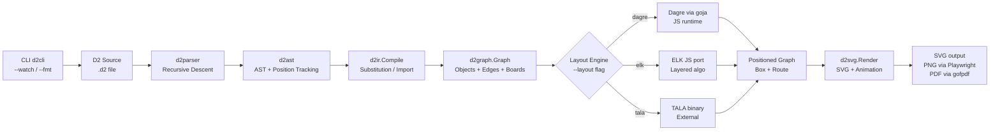
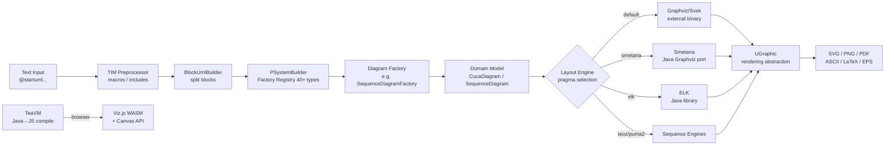
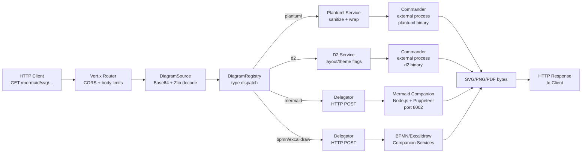

# Weekly Diagram Tooling Scan — 2026-06-07

## Executive Summary

- **Trend — Pluggable layout engines là tiêu chuẩn mới:** Ba trong bốn repo (D2, PlantUML, Kroki) đều hỗ trợ nhiều layout engine hoán đổi được (Dagre, ELK, Smetana, TALA), báo hiệu rằng "one-size-fits-all" layout đã lỗi thời — người dùng kỳ vọng chọn thuật toán phù hợp theo loại diagram.
- **Finding — Kiến trúc "unified gateway" của Kroki:** Pattern microservice gateway (Java Vert.x) + companion Node.js services (Puppeteer-driven) là blueprint mạnh cho kymo nếu cần hỗ trợ nhiều DSL mà không muốn re-implement renderer.
- **Kymo relevance:** Pintora là ứng viên "học trực tiếp" nhất — TypeScript, chạy browser+Node, nearley grammar, plugin system rõ ràng — kiến trúc phù hợp nhất với kymostudio stack (TS/JS, browser-first, extensible diagram types).

## Table of Contents

1. [terrastruct/d2](#1-terrastructd2) — DSL text-to-diagram Go với 3 layout engine hoán đổi và animated SVG
2. [hikerpig/pintora](#2-hikerpigpintora) — TypeScript text-to-diagram library browser+Node với nearley parser và plugin architecture
3. [plantuml/plantuml](#3-plantumlplantuml) — Java multi-engine UML renderer cổ điển, có Smetana (Java port of Graphviz) và TeaVM browser build
4. [yuzutech/kroki](#4-yuzutech-kroki) — Gateway microservice unifying 25+ diagram DSLs qua HTTP API, Java + Node.js companion

---

## 1. terrastruct/d2

### §1 — Quick Context

**Pitch:** D2 là DSL text-to-diagram viết bằng Go, nổi bật với 3 layout engine hoán đổi (Dagre/ELK/TALA), animated SVG boards, và sketch mode — khác Mermaid ở chỗ layout architecture đa dạng hơn và syntax phong phú hơn (containers, SQL tables, classes).

**Tech stack:** Go 1.25; goja (JS runtime để chạy Dagre/ELK JS bên trong Go); playwright-go cho PNG/PDF export; gofpdf cho PDF; freetype cho font rendering; fsnotify cho watch mode. Output: SVG, PNG, PDF.

**Repo health:** ~23.8k stars, ~1.2k forks; last push 2026-06-01; last release v0.7.1 (Aug 2024 — gap đáng chú ý); có CI/tests; license MPL-2.0.

**Distribution:** Binary (GitHub releases, Homebrew, npm wrapper); Go library; CLI; Docker.

---

### §2 — Architecture Deep-Dive

#### A. Component Inventory

- `Parser` (`d2parser/d2parser.go`) — hand-written recursive descent parser, tạo ra AST với Position tracking (UTF-8 + UTF-16 cho LSP compatibility).
- `AST` (`d2ast/d2ast.go`) — type-safe node hierarchy: Key, Edge, Map, Array, Scalar, Suspension, Import; BoxingSystem cho JSON serialization.
- `IR Compiler` (`d2compiler/compile.go`) — biến AST → `d2ir` (intermediate IR) → `d2graph.Graph` qua hàm `Compile()`; xử lý nesting, style, special shapes.
- `Graph IR` (`d2graph/d2graph.go`) — `Graph{Root, Objects, Edges, Layers, Scenarios, Steps}`; Object có `Box{x,y,w,h}`, Attributes, Children map; Edge có `Route []geo.Point`.
- `Layout Plugin System` (`d2layouts/d2layouts.go`) — strategy pattern: layout là function type `d2graph.LayoutGraph`; `LayoutNested()` nhận coreLayout function và tự dispatch grid/sequence/default.
- `Dagre Layout` (`d2layouts/d2dagrelayout/layout.go`) — chạy Dagre qua goja JS runtime; serialize graph → JS → chạy `dagre.layout(g)` → deserialize kết quả về Go.
- `ELK Layout` (`d2layouts/d2elklayout/layout.go`) — tương tự Dagre; dùng ELK JS port với algorithm "layered"; hỗ trợ port constraints cho SQL tables.
- `SVG Renderer` (`d2renderers/d2svg/d2svg.go`) — tạo SVG thuần; z-order qua draw order; CSS variables cho theming + dark mode; keyframe animation cho shapes ("shapeappear") và edges (stroke-dash); sketch mode delegate.
- `CLI` (`d2cli/main.go`) — `Run()` function; flags: `--layout`, `--theme`, `--sketch`, `--animate-interval`, `--watch`, `--fmt`, font flags; watch mode mở local dev server với WebSocket live-reload.

#### B. Pipeline / Control Flow

1. User chạy `d2 input.d2 output.svg` → CLI parse flags → đọc file source.
2. `d2parser.Parse(source)` → `d2ast.Map` (AST với source positions).
3. `d2ir.Compile(ast)` → intermediate IR (resolve substitutions, imports, macros).
4. `compileIR(ir)` → `d2graph.Graph` (typed Objects, Edges, Layers, style attributes).
5. Layout engine được chọn (Dagre/ELK/TALA) nhận Graph → compute positions → cập nhật `Box` và `Route []geo.Point` trên mỗi node/edge.
6. `d2svg.Render(graph)` → SVG string với embedded fonts, themes, animations → ghi file output.

#### C. Data Model / IR

Ba tầng IR:
1. **AST** (`d2ast`): cây parse thô với position tracking, BoxingSystem cho JSON.
2. **d2ir**: intermediate layer xử lý substitution (`${var}`), imports, và config merging.
3. **d2graph.Graph**: runtime IR — `Object{Box, Attributes, Children map, Shape}` và `Edge{Src, Dst, Route []geo.Point, SrcArrow, DstArrow}`. Graph cũng chứa `Layers []Graph`, `Scenarios []Graph`, `Steps []Graph` cho animated multi-board.

#### D. Input Language Design

Hand-written **recursive descent parser** (`d2parser`); không dùng parser generator. Hỗ trợ:
- Key-value syntax: `x: "label"`, `x.y: "nested"`
- Edge syntax: `a -> b: "label"`, `a <-> b`
- Container/nesting: `group { child1; child2 }`
- Special types: class/SQL table với `|` syntax
- Import: `...@other_file`
- Substitution: `${var}`

Error reporting dùng `Range{start, end Position}` với UTF-8 và UTF-16 indexing (LSP compatible). Autoformat built-in (`--fmt` flag).

#### E. Layout Algorithm

Ba engines hoán đổi qua `--layout` flag:
- **Dagre** (default, bundled): hierarchical/layered layout via JS runtime (goja); hỗ trợ `rankdir` (TB/LR/RL/BT); post-process: rank spacing, container padding, edge routing.
- **ELK** (bundled): Eclipse Layout Kernel JS port; algorithm "layered"; port constraints cho SQL tables; hỗ trợ nested containers.
- **TALA** (separate binary, commercial): Terrastruct's custom engine tối ưu cho software architecture diagrams.

Grid layout và sequence layout được xử lý riêng trước khi dispatch sang core engine. Edge routing dùng `DefaultRouter()` với center-to-center và curve adjustment.

#### F. Rendering / Output Strategy

- **SVG**: primary output; inline fonts (freetype); CSS variables cho dark/light theme; keyframe animation cho boards (`--animate-interval`); sketch mode qua d2sketch; ASCII art mode; legend generation.
- **PNG**: qua Playwright (headless browser screenshot).
- **PDF**: qua gofpdf.

Không có pluggable renderer interface — SVG renderer là monolithic nhưng có `UGraphic`-like abstraction thông qua các hàm `drawShape()`, `drawConnection()`.

#### G. Extensibility

- Layout engine: pluggable qua function type — add engine mới bằng cách implement `func(ctx, graph) error`.
- Không có shape plugin system chính thức; shapes hardcoded trong `d2graph`.
- Community plugins: 40+ bao gồm schema importers (Postgres, MongoDB, AsyncAPI), editor extensions (VSCode, Vim, Zed, Emacs), documentation tools (MkDocs, VitePress, Obsidian).
- Themes: built-in theme IDs + dark theme flag.

#### H. Dev Experience

- CLI mạnh: `--watch` với live-reload WebSocket server; `--fmt` autoformat; `--check` validation.
- IDE: VSCode extension, Vim, Emacs, Zed plugins (community).
- Playground: play.d2lang.com.
- Browser support: không native — hoàn toàn server-side; không có WASM/browser build chính thức.
- Docs: d2lang.com.

---

### §3 — Architecture Diagram



---

### §4 — Verdict

D2 đáng học sâu cho kymostudio vì ba điểm: (1) **layout plugin pattern** — function-type strategy cho phép swap engine không cần interface phức tạp, kymo có thể áp dụng; (2) **multi-board/animated diagram** via Layers/Scenarios/Steps — ý tưởng hay cho diagram "storytelling"; (3) **goja approach** — chạy JS layout libraries từ Go rất thực dụng nếu kymo cần dùng Dagre/ELK mà không port lại.

Red flag: release v0.7.1 là từ Aug 2024 — có gap ~18 tháng không release chính thức dù commits vẫn active; TALA engine không open-source. Không có browser/WASM build.

**Verdict: study deeper** — đặc biệt layout plugin pattern và animated multi-board concept.

---

## 2. hikerpig/pintora

### §1 — Quick Context

**Pitch:** Pintora là TypeScript text-to-diagram library chạy cả browser lẫn Node.js, dùng nearley parser generator, có plugin system rõ ràng cho diagram types mới — khác Mermaid ở chỗ cleanly extensible và không inject global styles.

**Tech stack:** TypeScript (74.3%), Nearley + Moo (lexer/parser generator), pnpm monorepo + Turborepo, @pintora/dagre + @pintora/graphlib (forked), D3 modules (d3-shape, d3-scale, d3-interpolate), dayjs. Output: SVG (browser + Node), PNG/JPG (Node), Canvas (browser).

**Repo health:** 1,300 stars, 37 forks, 25 releases; last release v0.8.2 (Feb 2025); last push 2026-06-03; 15 open issues; có CI; license MIT.

**Distribution:** npm packages (`@pintora/standalone`, `@pintora/cli`, `@pintora/diagrams`, etc.); CDN; VSCode extension; Obsidian plugin; Observable notebook.

---

### §2 — Architecture Deep-Dive

#### A. Component Inventory

- `pintora-core` (`packages/pintora-core/src/index.ts`) — engine trung tâm: `parseAndDraw()`, `diagramRegistry`, `themeRegistry`, `symbolRegistry`, `configApi`, `eventManager`.
- `pintora-diagrams` (`packages/pintora-diagrams/`) — bundle tất cả 8 diagram types; mỗi type export `IDiagram{pattern, parser, artist, configKey, eventRecognizer}`.
- `ER Diagram DB` (`packages/pintora-diagrams/src/er/db.ts`) — model `ErDiagramIR{entities: Record<string,Entity>, relationships, inheritances}`; `ErDb.apply()` cho state mutation.
- `Nearley Grammar` (`packages/pintora-diagrams/`) — 6.6% Nearley code; mỗi diagram type có `.ne` grammar file; build script `gen-parser` chạy `scripts/build-grammar.js` để compile grammar → JS parser.
- `pintora-standalone` (`packages/pintora-standalone/src/index.ts`) — entry point chính; wires diagram registration, renderer registry, config stack, event wiring; export `pintoraStandalone` object.
- `pintora-renderer-svg` — SVG renderer cho browser + Node (via canvas polyfill).
- `pintora-cli` — Node.js CLI tool cho file rendering.
- Layout (`@pintora/dagre`, `@pintora/graphlib`) — fork của Dagre/graphlib cho layout tự động.

#### B. Pipeline / Control Flow

1. User gọi `pintoraStandalone.renderTo(container, {code: "..."})`.
2. `diagramRegistry.detectDiagram(code)` — match `pattern` regex để xác định diagram type.
3. `parser.parse(code)` → `diagramIR` (type-specific intermediate representation, e.g. `ErDiagramIR`).
4. `artist.draw(diagramIR, config)` → `graphicIR` (list of graphic primitives: shapes, texts, lines).
5. Theme và config được apply từ `themeRegistry` và `configApi`.
6. `rendererRegistry.getRenderer(target)` → renderer (SVG/Canvas); renderer consume `graphicIR` → output DOM nodes / SVG string / PNG buffer.

#### C. Data Model / IR

Hai tầng IR rõ ràng:
1. **diagramIR**: per-diagram-type; ví dụ `ErDiagramIR{entities, relationships, inheritances}` hay sequence diagram IR với actors/messages. Được tạo bởi Artist/Parser của từng diagram.
2. **graphicIR**: generic graphic primitives (shapes, text, connectors) — target-agnostic; renderer downstream consume graphicIR để tạo SVG/Canvas output.

Config được quản lý qua config stack (push/pop) cho temporary overrides.

#### D. Input Language Design

**Nearley + Moo** (custom forks: `@hikerpig/nearley`, `@hikerpig/moo`):
- Moo: tokenizer/lexer — define token rules (keywords, identifiers, operators).
- Nearley: Earley parser generator — compile `.ne` grammar files → JavaScript parser.
- Build step: `scripts/build-grammar.js` pre-compile grammars vào JS bundles.
- `ParserWithPreprocessor` wrapper: combine preprocessing (comment stripping, directive extraction) với Nearley parser.
- Detection: mỗi diagram dùng `/^\s*sequenceDiagram/` style regex để identify.
- Error reporting: không xác định rõ ràng từ source fetched.

v0.8.0 giới thiệu `@pre` block và `@bindClass` cho universal style syntax.

#### E. Layout Algorithm

- Forked **Dagre** (`@pintora/dagre`) — layered/hierarchical graph layout.
- `@pintora/graphlib` — graph data structure library.
- Mỗi diagram type tự quyết định có dùng layout library không; sequence diagrams dùng manual positioning (timeline-based), ER/component diagrams dùng Dagre.
- D3-shape cho curve rendering của connectors.

#### F. Rendering / Output Strategy

- **SVG renderer** (`pintora-renderer-svg`): consume graphicIR → SVG DOM / string; self-contained output không inject global styles.
- **Canvas renderer** (`pintora-renderer-canvas`?): browser Canvas API.
- **Node.js**: dùng canvas polyfill (node-canvas) để render PNG/JPG/SVG files.
- `rendererRegistry.getRenderer(target)` — pluggable emitter pattern; target là `"svg"` hoặc `"canvas"`.
- Animation support: không xác định.

#### G. Extensibility

- **Diagram plugin system**: implement `IDiagram{pattern, parser, artist, configKey}` rồi register với `diagramRegistry` — đây là extension point chính.
- **Symbol registry**: custom symbols/shapes có thể register.
- **Theme registry**: custom themes register.
- **Renderer registry**: custom renderers register.
- **Event system**: `diagramEventManager` cho interactive elements.
- Config key per diagram type cho isolated configuration.

#### H. Dev Experience

- pnpm monorepo + Turborepo cho parallel builds.
- VSCode extension (`pintora-vscode`): syntax highlighting + live preview.
- Obsidian plugin, Gatsby plugin, Observable notebook integration.
- `pintora-cli` cho command-line rendering.
- Website/docs: pintora.js.org (có demo online).
- Browser-first: có CDN distribution cho embed trực tiếp.
- Không có watch mode rõ ràng trong CLI.

---

### §3 — Architecture Diagram

```mermaid
flowchart LR
    A[Diagram Text\nsequenceDiagram...] --> B[diagramRegistry\npattern regex detect]
    B --> C[ParserWithPreprocessor\nNearley + Moo grammar]
    C --> D[diagramIR\nper-type data model]
    D --> E[Artist.draw\nconfig + theme apply]
    E --> F[graphicIR\ngeneric primitives]
    F --> G{rendererRegistry\ntarget selector}
    G -->|svg| H[SVG Renderer\nbrowser / Node]
    G -->|canvas| I[Canvas Renderer\nbrowser]
    J[pintoraStandalone\norchestrator] --> B
    K[@pintora/dagre\nlayout engine] --> E
    L[themeRegistry\nsymbolRegistry\nconfigApi] --> E
```

---

### §4 — Verdict

Pintora là **repo đáng học nhất cho kymostudio**. Kiến trúc TypeScript monorepo với nearley grammar, hai-tầng IR (diagramIR → graphicIR), pluggable renderer và diagram plugin system gần như là blueprint lý tưởng cho kymo. Pattern `IDiagram{pattern, parser, artist}` cực kỳ sạch và có thể áp dụng trực tiếp.

Red flags: star count thấp (1.3k) so với Mermaid; last release Feb 2025 — release cadence chậm lại; Dagre fork thay vì upstream có thể gây tech debt. Nearley là Earley parser — đủ mạnh nhưng có thể chậm với grammars lớn.

Open question: graphicIR có đủ expressive cho custom shape kymo cần không?

**Verdict: study deeper** — đặc biệt `IDiagram` registration pattern và graphicIR schema.

---

## 3. plantuml/plantuml

### §1 — Quick Context

**Pitch:** PlantUML là Java UML generator cổ điển (13k stars), nổi bật với 5 layout engines (Graphviz, Smetana, ELK, Teoz, Puma2), TeaVM browser build, và licensing đa dạng — khác tools mới ở chỗ hỗ trợ 20+ diagram types và đã battle-tested hàng thập kỷ.

**Tech stack:** Java (primary); Gradle + Ant build system; Smetana (C-to-Java transpiled Graphviz); ELK (Eclipse Layout Kernel); TeaVM (Java-to-JS compiler cho browser build); Viz.js (Graphviz WASM cho browser); gofpdf (không — đây là Java). Output: PNG, SVG, PDF, EPS, LaTeX, ASCII art, Unicode art.

**Repo health:** 13.1k stars, 1.2k forks; last release v1.2026.5 (May 27, 2026); very active — monthly releases; license multi (GPL/LGPL/Apache/EPL/MIT variants); CI active.

**Distribution:** JAR file, Docker, npm (via TeaVM web build), IntelliJ plugin, VSCode extension, GitLab integration, Confluence plugin, nhiều tool khác.

---

### §2 — Architecture Deep-Dive

#### A. Component Inventory

- `TIM Preprocessor` (`src/net/sourceforge/plantuml/preproc/`) — macro language: variables, functions, conditionals, includes; chạy trước parsing.
- `BlockUmlBuilder` (`src/net/sourceforge/plantuml/`) — segment input thành diagram blocks (dựa vào `@startuml`/`@enduml`).
- `PSystemBuilder` (`src/net/sourceforge/plantuml/`) — registry của 40+ diagram factories; pattern matching để dispatch đúng factory.
- `Diagram Factories` (e.g., `SequenceDiagramFactory`, `ActivityDiagramFactory3`) — mỗi type đăng ký syntax commands; line-by-line parsing approach.
- `CucaDiagram` model (`src/net/sourceforge/plantuml/cucadiagram/`) — shared model cho class/component/state diagrams với `Entity` và `Link` classes.
- `Svek` (`src/net/sourceforge/plantuml/svek/`) — layout via external Graphviz binary; parse SVG output của Graphviz để extract coordinates.
- `Smetana` (embedded) — C-to-Java transpile của Graphviz; pure Java, không cần external binary; dùng `!pragma layout smetana`.
- `ELK integration` — Java ELK library; dùng layered algorithm; activate qua `!pragma layout elk`.
- `Teoz / Puma2` — hai sequence diagram layout engines; Teoz tốt hơn cho parallel messages.
- `UGraphic` interface (`src/net/sourceforge/plantuml/ugraphic/`) — format-agnostic drawing primitives; implementations: UGraphicSvg, UGraphicPng, UGraphicPdf, UGraphicTxt...
- `CucaDiagramFileMaker` hierarchy — common abstraction cho tất cả layout engines; `getNbPages()`, render methods.
- `TeaVM build` — compile toàn bộ PlantUML sang JavaScript cho browser; dùng Viz.js (WASM) cho layout + Canvas API cho text measurement.

#### B. Pipeline / Control Flow

1. Input text → `TIM Preprocessor` xử lý macros, includes, conditionals → clean text.
2. `BlockUmlBuilder.splitBlocks()` → list of diagram blocks.
3. `PSystemBuilder` match factory theo syntax → vd. `SequenceDiagramFactory`.
4. Factory parse line-by-line → build domain model (e.g. `SequenceDiagram`, `CucaDiagram{Entity, Link}`).
5. Layout engine selection (pragma/flag): Graphviz/Smetana/ELK/Teoz/Puma2 → compute positions.
6. `UGraphic` implementation được chọn theo output format → render → file/stream.

#### C. Data Model / IR

Không có unified IR — mỗi diagram type có domain model riêng:
- **Structural diagrams** (class, component, state): `CucaDiagram{Entity, Link}` shared model.
- **Sequence diagrams**: riêng biệt với events/messages model.
- **Layout data**: được embed trong domain model sau khi layout engine xử lý.
- `UGraphic` là rendering abstraction layer — không phải IR.

Đây là điểm yếu kiến trúc: không có unified IR layer, mỗi diagram type tightly coupled với layout và render logic.

#### D. Input Language Design

**Line-by-line command parser** — không dùng grammar generator:
- Mỗi diagram Factory đăng ký regex patterns cho từng syntax element.
- `PSystemBuilder` dispatch dựa trên `@startXXX` keyword.
- TIM preprocessor handles: `!define`, `!include`, `!if`, `!function`, `!variable`.
- Error reporting: `ErrorUml` được trả về khi parse fail.
- DSL rất phong phú: skinparam, style, creole formatting, emoji, icons (Tupadr3, Material, etc.).

#### E. Layout Algorithm

5 engines cho hai nhóm diagram:

**Structural diagrams:**
- **GraphViz/Svek** (default): gọi external `dot` binary, parse SVG output lấy coordinates; cần cài Graphviz.
- **Smetana**: C-to-Java transpile của Graphviz; pure JVM, không cần external deps; dùng ReentrantLock cho thread safety.
- **ELK**: Eclipse Layout Kernel Java library; layered algorithm.

**Sequence diagrams:**
- **Puma2** (default): vertical timeline-based.
- **Teoz**: cải thiện parallel messages + constraint solving.

**Browser (TeaVM):** không thể gọi external Graphviz → dùng Viz.js (Graphviz compiled to WebAssembly).

#### F. Rendering / Output Strategy

`UGraphic` interface là rendering abstraction cốt lõi:
- `UGraphicSvg` → SVG
- `UGraphicPng` → PNG (với color quantization: `Quantify555`, `QuantifyOKLab`)
- `UGraphicPdf` → PDF
- `UGraphicTxt` / `UGraphicUnicode` → ASCII/Unicode art
- `UGraphicEps` → EPS
- `UGraphicLatex` → LaTeX/TikZ

TeaVM browser build: compile toàn bộ Java → JS; Canvas API cho rendering + Viz.js cho layout.

#### G. Extensibility

- **Licensing modules**: plantuml-asl, plantuml-bsd, plantuml-epl, plantuml-gplv2, plantuml-lgpl, plantuml-mit, plantuml-mit-light, plantuml-natif — mỗi module chứa code đặc thù license.
- **Skinparam system**: extensive styling via text `skinparam backgroundColor #FFFF00`.
- **Style system** (newer): CSS-like `<style>` blocks.
- **Custom icons**: Tupadr3, Material Design, AWS icons via standard file.
- Plugin ecosystem: Confluence, GitLab, Jira, nhiều tool khác.
- Không có formal diagram type plugin system — diagram types hardcoded trong codebase Java.

#### H. Dev Experience

- Gradle/Ant build; JAR distribution.
- CLI: `java -jar plantuml.jar input.puml`.
- Browser preview: plantuml.com/plantuml/uml/ online server; self-hostable.
- IDE plugins: IntelliJ (official), VSCode, Eclipse, Emacs, Vim.
- Watch mode: không built-in; thường dùng qua IDE plugin.
- Testing: không xác định từ files fetched.
- Documentation: extensive at plantuml.com.

---

### §3 — Architecture Diagram



---

### §4 — Verdict

PlantUML đáng học theo góc độ **engineering decisions lịch sử** hơn là blueprint hiện đại. Smetana (C-to-Java transpile) là case study thú vị về cách embed layout engine mà không cần external deps — useful cho kymo nếu muốn bundle layout engine. TeaVM browser build cũng là cách tiếp cận độc đáo.

Red flags: kiến trúc Java monolith không có unified IR; diagram types hardcoded, khó extend; line-by-line parser approach kém flexible hơn grammar-based. Release gap từ phía architecture innovation chứ không phải maintenance.

Open question: Smetana có còn được maintain sau khi ELK tích hợp không?

**Verdict: glance only** — xem Smetana pattern và UGraphic abstraction là đủ cho kymo.

---

## 4. yuzutech/kroki

### §1 — Quick Context

**Pitch:** Kroki là unified HTTP gateway cho 25+ diagram DSLs (PlantUML, Mermaid, D2, Graphviz, v.v.) — khác các tools khác ở chỗ nó không implement renderer mà orchestrate nhiều specialized services qua microservice pattern.

**Tech stack:** Java + Vert.x (reactive gateway server); Node.js + Puppeteer (companion services cho Mermaid, BPMN, Excalidraw, Diagrams.net); external binaries (D2 CLI, PlantUML JAR); Docker Compose cho deployment. Primary language: JavaScript 92.5%, Java 6.3%. 

**Repo health:** 4.2k stars, 298 forks; last release v0.30.1 (Mar 2025); last push 2026-06-04; actively maintained; license Apache-2.0.

**Distribution:** Docker image (`yuzutech/kroki`); companion images; self-hosted; kroki.io public instance; Helm chart cho K8s.

---

### §2 — Architecture Deep-Dive

#### A. Component Inventory

- `Server` (`server/src/main/java/io/kroki/server/Server.java`) — Vert.x `AbstractVerticle`; HTTP Router với CORS, body handling, SSL/TLS; đăng ký 25+ diagram handlers.
- `DiagramRegistry` (`server/src/main/java/io/kroki/server/service/DiagramRegistry.java`) — registry của tất cả diagram services; dispatch dựa trên diagram type trong URL path.
- `DiagramSource` (`server/src/main/java/io/kroki/server/decode/DiagramSource.java`) — decode/encode: Zlib compression + Base64 URL-safe encoding; PlantUML special case với PlantUML-native transcoder.
- `Delegator` (`server/src/main/java/io/kroki/server/action/Delegator.java`) — HTTP POST delegation tới companion services; custom redirect handler cho POST redirects; error parsing từ JSON responses.
- `Commander` (`server/src/main/java/io/kroki/server/action/Commander.java`) — spawn external processes (D2 binary, PlantUML JAR); stdin/stdout piping.
- `Plantuml` service (`server/src/main/java/io/kroki/server/service/Plantuml.java`) — sanitize input (block unsafe includes); wrap với `@startuml`; delegate tới `PlantumlCommand`.
- `PlantumlCommand` — invoke PlantUML as external process via Commander.
- `D2` service (`server/src/main/java/io/kroki/server/service/D2.java`) — invoke D2 binary với layout/theme options qua Commander.
- Mermaid companion (`mermaid/src/index.js`) — Node.js HTTP server (port 8002); Puppeteer-based rendering; `/svg` và `/png` endpoints; Worker với `window.mermaid.render()` trong browser page.
- `ConfigRetriever` — async config từ env vars và external sources.
- Health/Metrics — `/health`, `/healthz`, `/v1/health` cho K8s; Prometheus `/metrics`.

#### B. Pipeline / Control Flow

1. Client gửi `GET /plantuml/svg/{encoded}` hoặc `POST /` với JSON `{diagram_source, output_format}`.
2. Router decode URL → extract diagram type (`plantuml`, `mermaid`, `d2`, ...) và format (`svg`, `png`, `pdf`).
3. `DiagramSource.decode(encoded)` → Base64 URL decode → Zlib decompress → raw diagram source string.
4. `DiagramRegistry` dispatch tới đúng service (vd. `Plantuml`, `D2`, hay companion via `Delegator`).
5. Service sanitize source → invoke renderer (external process via `Commander`, hoặc HTTP POST via `Delegator` tới Node.js companion).
6. Response bytes được return với correct `Content-Type` về client.

#### C. Data Model / IR

Kroki không có internal IR — nó là **pass-through gateway**:
- Input: encoded diagram source string.
- Processing: decode, sanitize, forward.
- Output: raw bytes từ upstream renderer.

State chủ yếu là configuration (service endpoints, binary paths, security settings). Không có diagram graph model hay AST.

#### D. Input Language Design

Kroki không parse diagram DSLs — nó **delegates parsing** hoàn toàn cho specialized renderers. Công việc của Kroki chỉ là:
- Decode (Zlib + Base64) input.
- Sanitize (block path traversal, unsafe includes) — đặc biệt cho PlantUML.
- Route đúng renderer.

API design: `/{diagram-type}/{output-format}/{encoded-source}` — RESTful, cacheable GET requests.

#### E. Layout Algorithm

Không implement layout algorithms — delegate hoàn toàn:
- PlantUML: Graphviz/Smetana/ELK qua PlantUML binary.
- Mermaid: Dagre/ELK qua Mermaid library trong Puppeteer.
- D2: Dagre/ELK/TALA qua D2 binary.
- Graphviz: native dot binary.

#### F. Rendering / Output Strategy

Multi-renderer architecture qua hai patterns:
1. **Commander pattern**: spawn external process (`d2 -`, `java -jar plantuml.jar -pipe`), pipe stdin/stdout.
2. **Delegator pattern**: HTTP POST tới Node.js companion service; companion dùng Puppeteer để render trong headless Chrome.

Companion services:
- `kroki-mermaid` (port 8002): Node.js + Puppeteer + `window.mermaid.render()`.
- `kroki-bpmn`: Node.js + BPMN.js.
- `kroki-excalidraw`: Node.js + Excalidraw library.
- `kroki-diagramsnet`: Node.js + diagrams.net (experimental).

Supported output formats per service: SVG, PNG, PDF, BASE64, TXT.

#### G. Extensibility

- **Add new diagram type**: implement service class, register trong `DiagramRegistry`, optionally add companion service.
- **Deployment**: Docker Compose; companion services độc lập — có thể enable/disable selective.
- **Security**: whitelist-based approach cho PlantUML includes; block path traversal.
- **Config**: env vars (`KROKI_MAX_BODY_SIZE`, SSL certs, CORS headers).
- **Cloud-native**: K8s health checks, Prometheus metrics, Unix socket support, IPv6.

#### H. Dev Experience

- HTTP API — language-agnostic; client libraries tồn tại cho nhiều languages.
- kroki.io: public hosted instance cho testing.
- Docker-first: `docker run yuzutech/kroki`.
- Kroki CLI (`yuzutech/kroki-cli`): command-line client.
- GitLab tích hợp built-in Kroki support.
- AsciiDoc/Asciidoctor plugin.
- IDE plugins: không xác định.
- Documentation: docs.kroki.io.

---

### §3 — Architecture Diagram



---

### §4 — Verdict

Kroki đáng học theo góc độ **system design pattern** hơn là diagram tooling thuần túy. Kiến trúc gateway + Commander + Delegator là blueprint cực kỳ thực dụng nếu kymo muốn build unified rendering service hỗ trợ nhiều DSLs mà không implement renderers from scratch. Pattern "thin gateway, fat companions" cho phép scale từng renderer độc lập.

Red flags: heavily Docker-dependent — không phù hợp nếu kymo cần browser-only solution; Puppeteer trong companion services có overhead lớn (headless Chrome); last release v0.30.1 từ Mar 2025 — có thể đang chậm lại. Stars thấp (4.2k) so với độ phức tạp.

Open question: Kroki có hỗ trợ streaming output (server-sent events) không — quan trọng cho large diagrams?

**Verdict: study deeper** — đặc biệt DiagramRegistry pattern và Commander/Delegator dual-strategy cho multi-renderer orchestration.

---

## Appendix: Candidate Selection Notes

### Repos Evaluated

| Repo | Stars | Lang | Last push | Decision |
|---|---|---|---|---|
| plantuml/plantuml | 13,069 | Java | 2026-06-06 | **Selected** — multi-engine, TeaVM browser build |
| mingrammer/diagrams | 42,326 | Python | 2026-06-04 | Excluded — Python-only, infra diagrams, không browser |
| hikerpig/pintora | 1,283 | TypeScript | 2026-06-03 | **Selected** — TypeScript, browser+Node, plugin system |
| goadesign/model | 461 | Go | 2026-06-03 | Excluded — Go-only DSL, C4 model focus, ít generic |
| tt-a1i/archify | 557 | HTML | 2026-05-26 | **Excluded** — Claude Skill HTML wrapper, không có novel architecture |
| terrastruct/d2 | ~23,800 | Go | 2026-06-01 | **Selected** — novel DSL, 3 pluggable layout engines |
| yuzutech/kroki | 4,200 | JS/Java | 2026-06-04 | **Selected** — unified gateway pattern, 25+ DSL support |

### Exclusion: tt-a1i/archify

Repo chứa `archify/` directory với assets/, examples/, renderers/, schemas/ và package.json — có cấu trúc hơn single-file nhưng về bản chất là một **Claude Agent Skill** (SKILL.md present) sinh HTML/Mermaid cho architecture diagrams, không phải diagram engine độc lập. Không có novel DSL design, layout algorithm, hay renderer architecture để học. Excluded per criteria.
