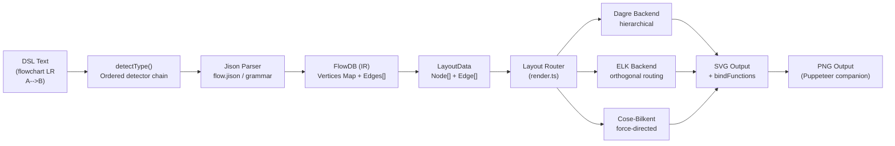
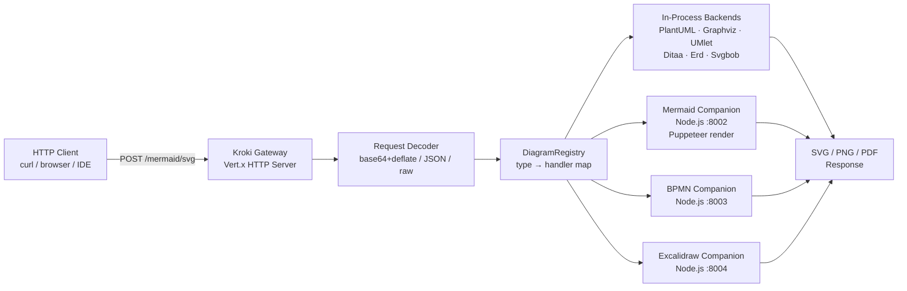
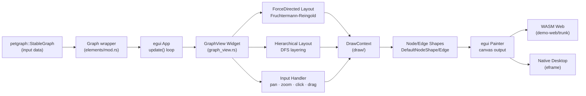
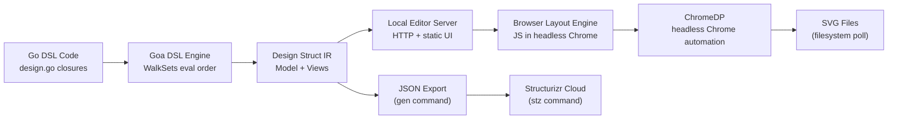

# Weekly Diagram Tooling Scan — 2026-06-08

> Nguồn: GitHub topic search + keyword search, window 7 ngày (2026-06-01 → 2026-06-08).  
> Phạm vi: diagram-as-code, graph-visualization, DSL/layout-algorithm.  
> 4 repos được chọn từ pool ~20 candidates sau khi loại trừ chart libraries, markdown renderers, personal editors.

---

## Executive Summary

- **mermaid-js/mermaid** đang trong chu kỳ refactor layout layer quan trọng: họ đang di chuyển từ dagre độc lập sang pluggable `LayoutAlgorithm` interface với ELK làm backend thứ hai — đây là cơ hội để học mô hình multi-backend layout mà kymo có thể áp dụng.
- **yuzutech/kroki** giải quyết bài toán "20+ diagram formats qua một API" bằng kiến trúc gateway + companion containers; cách họ chuẩn hóa I/O (base64+deflate URL, JSON POST) và route backends qua `DiagramRegistry` rất đáng tham khảo cho bất kỳ tool nào muốn support nhiều DSL.
- **blitzarx1/egui_graphs** cung cấp force-directed + hierarchical layout trong Rust/WASM với trait-based customization — code layout sạch nhất trong batch này, hierarchical implementation thực tế là bài học về tradeoff giữa đơn giản và chất lượng (không có crossing minimization).
- **goadesign/model** chọn một approach cực kỳ khác biệt: dùng Go code trực tiếp làm DSL (closures + eval engine), và render SVG thông qua ChromeDP headless Chrome — một architectural smell rõ ràng nhưng giải thích được về mặt tradeoff.

---

## Table of Contents

1. [mermaid-js/mermaid](#1-mermaid-jsmermaid)
2. [yuzutech/kroki](#2-yuzutechkroki)
3. [blitzarx1/egui_graphs](#3-blitzarx1egui_graphs)
4. [goadesign/model](#4-goadesignmodel)

---

## 1. mermaid-js/mermaid

**Repo:** https://github.com/mermaid-js/mermaid  
**Updated:** 2026-06-08 (pushed hôm nay)  
**Stars:** 88.5k | **Forks:** 14k

### §1 — Quick Context

DSL-to-SVG renderer phổ biến nhất hiện tại: từ một text block `flowchart LR / A --> B` đến SVG hoàn chỉnh trong browser, với 15+ diagram types và pluggable layout backend mới (ELK).

- **Stack:** TypeScript, Jison (parser generator), dagre-d3-es + ELK + Cose-Bilkent (layout), D3 v7 (rendering), RoughJS (sketch style), Cytoscape
- **Output:** SVG inline (DOM injection), PNG (qua CLI/companion service)
- **Health:** 88.5k stars, CI via GitHub Actions, npm `mermaid` package v11.x
- **Distribution:** npm, CDN, Mermaid Live Editor web app

### §2 — Architecture Deep-Dive

#### A. Component inventory

- `packages/mermaid/src/mermaid.ts` — Public API entry point: `render()`, `parse()`, `run()`, `initialize()`, `registerExternalDiagrams()`
- `packages/mermaid/src/mermaidAPI.ts` — Core rendering engine, nhận text → trả `{svg, bindFunctions}`
- `packages/mermaid/src/diagram-api/diagram-orchestration.ts` — Registration + detection pipeline, lazy-loads diagram types
- `packages/mermaid/src/diagram-api/detectType.ts` — Priority-ordered detector chain
- `packages/mermaid/src/diagrams/flowchart/parser/flow.jison` — Jison grammar cho flowchart DSL
- `packages/mermaid/src/diagrams/flowchart/flowDb.ts` — Flowchart IR (FlowDB): `Map<id, FlowVertex>`, `FlowEdge[]`, `FlowSubGraph[]`
- `packages/mermaid/src/rendering-util/render.ts` — Layout algorithm selector + SVG preparation
- `packages/mermaid/src/rendering-util/layout-algorithms/dagre/` — Dagre backend
- `packages/mermaid/src/rendering-util/layout-algorithms/elk/` — ELK backend (large feature, lazy-loaded)

#### B. Pipeline / Control Flow

1. User calls `mermaid.render('id', 'flowchart LR\n A --> B')` → enqueue để serial execution
2. `mermaidAPI.render()` gọi `detectType(text)` → quét regex-cleaned text qua ordered detector chain → trả về `"flowchart"`
3. Lazy-load diagram module (`flowchart` bundle) → khởi tạo Jison parser → parse text → populate `FlowDB` (vertices, edges, subgraphs)
4. `FlowDB.getData()` transform internal Map/Array → `Node[]` + `Edge[]` LayoutData IR
5. `render.ts` nhận LayoutData → kiểm tra `layoutAlgorithm` config → route sang dagre hoặc ELK hoặc cose-bilkent
6. Layout backend tính toán position cho mỗi node + edge routing → ghi kết quả vào SVG element
7. Trả `{svg: string, bindFunctions}` lên caller

#### C. Data Model / IR

`FlowDB` là mutable stateful object được Jison parser populate incrementally. Sau khi parse xong, `getData()` convert thành immutable `LayoutData` để truyền xuống layout layer. Đây là two-stage IR: mutable parse-time state → immutable layout-time data. Không có concept "lower IR" như D2's TALA.

#### D. Input Language Design

Parser approach: **Jison** (BNF-style grammar, context-sensitive lexer với lexical states). Grammar file `flow.jison` viết ra explicit EBNF-like rules. Token set: shape brackets `[`, `(`, `{`, `((`, `[(`, `[/`; edge connectors `--`, `==`, `-.`; keywords `subgraph`, `end`, `direction`. Error reporting: Jison throw với line/col.

#### E. Layout Algorithm

- **Dagre** (default): hierarchical Sugiyama-style, node positioning + edge routing
- **ELK** (opt-in, "large feature"): Eclipse Layout Kernel — industrial-strength hierarchical, orthogonal routing
- **Cose-Bilkent**: force-directed via Cytoscape plugin
- Edge routing: spline/curved (dagre default), orthogonal (ELK)
- Crossing minimization: dagre dùng barycentric heuristic; ELK dùng Sugiyama full pipeline

Layout selection là **pluggable** — validated qua registered `LayoutAlgorithm` interface, fallback về dagre nếu unknown.

#### F. Rendering / Output Strategy

Single primary backend: SVG injected vào DOM. `<defs>` chứa drop shadow filters, gradients. Interactive elements bind click handlers qua `bindFunctions` callback. PNG output delegate sang companion Node.js service dùng Puppeteer. RoughJS là opt-in alternate renderer tạo sketch look.

#### G. Extensibility

`registerExternalDiagrams(diagrams)` cho phép inject custom diagram types với: detector function, parser, DB, renderer. Icon packs qua `registerIconPacks()`. Theme/config qua `initialize({theme, themeVariables})`. Layout backends register qua `registerLayoutAlgorithm(name, implementation)` interface.

#### H. Dev Experience

- Mermaid Live Editor: real-time preview, URL sharing
- VS Code extension (cộng đồng)
- CLI: `@mermaid-js/mermaid-cli` (npx mmdc)
- `--help` trên CLI đầy đủ
- Watch mode: không built-in trong core, CLI có `-w` flag

### §3 — Architecture Diagram

### §4 — Verdict

**Điểm đáng học cho kymostudio:**
- **Pluggable layout interface** là pattern chín muồi: `LayoutAlgorithm` interface nhận LayoutData + SVG element, tự lo rendering. Kymo nên adopt pattern này thay vì hardcode một layout engine.
- **Detector priority chain** là cách đơn giản và elegant để support nhiều DSL trong cùng một parser entrypoint — có thể áp dụng nếu kymo muốn support nhiều syntax variants.
- **Two-stage IR** (mutable parse → immutable layout data) là good practice.

**Red flags:** Jison là tool cũ (2009), ít maintained. Flowchart grammar file rất lớn và monolithic. Mermaid companion dùng Puppeteer để render PNG — heavyweight dependency.

**Open questions:** Khi nào ELK sẽ trở thành default thay vì opt-in? Có plan migrate khỏi Jison sang parser combinator không?

**Verdict: study deeper** — đặc biệt layout plugin interface và IR design pattern.

---

## 2. yuzutech/kroki

**Repo:** https://github.com/yuzutech/kroki  
**Updated:** 2026-06-06  
**Stars:** 4.2k | **Forks:** 340

### §1 — Quick Context

Gateway duy nhất chuẩn hóa API cho 20+ diagram backends: một HTTP POST với diagram source → nhận SVG/PNG/PDF, mà không cần cài đặt từng tool riêng lẻ.

- **Stack:** Java 17 + Vert.x (gateway core), Node.js + micro (companion services: Mermaid, BPMN, Excalidraw), Docker Compose orchestration
- **Output:** SVG, PNG, PDF (per-backend support khác nhau)
- **Health:** 4.2k stars, CI via GitHub Actions, Docker Hub image, self-hostable
- **Distribution:** Docker image `yuzutech/kroki`, hosted service kroki.io

### §2 — Architecture Deep-Dive

#### A. Component inventory

- `server/src/main/java/io/kroki/server/Server.java` — Vert.x HTTP server, route registration, health/metrics endpoints
- `server/src/main/java/io/kroki/server/service/DiagramRegistry.java` — Backend registry: map `diagramType` → `DiagramHandler`
- `server/src/main/java/io/kroki/server/action/DiagramRest.java` — HTTP handler: decode request → dispatch → encode response
- `server/src/main/java/io/kroki/server/service/Plantuml.java` — PlantUML backend (subprocess invocation)
- `mermaid/src/index.js` — Mermaid companion microservice (Node.js/micro, port 8002)
- `bpmn/` — BPMN companion service
- `excalidraw/` — Excalidraw companion service

#### B. Pipeline / Control Flow

1. Client gửi `POST /flowchart/svg` với body là diagram source (hoặc `GET /flowchart/svg/{base64deflate}`)
2. `DiagramRest` handler decode request: plain text body, hoặc JSON `{diagram_source, output_format}`, hoặc URL-decoded base64+deflate string
3. `DiagramRegistry.lookup("flowchart")` → trả về `DiagramHandler` cho Graphviz
4. Handler validate output format (`svg` / `png` / `pdf`) cho backend đó
5. Backend service invoked: Java-in-process (Graphviz, PlantUML, UMlet) hoặc HTTP call đến companion container (Mermaid → port 8002)
6. Output bytes trả về client với Content-Type header phù hợp

#### C. Data Model / IR

Không có internal IR — Kroki là **passthrough aggregator**. Diagram source string đi thẳng từ HTTP request đến backend service. Transformation duy nhất là encoding/decoding (base64+deflate cho URL GET). Mỗi backend tự xử lý parse + layout + render.

#### D. Input Language Design

Kroki không parse diagram source — nó delegate 100% cho backend. Kroki định nghĩa một **meta-protocol** hai chiều:
- Request: `/{diagramType}/{outputFormat}` với body là diagram source
- Encoding: base64url(deflate(source)) cho GET; raw source cho POST

Không có grammar chung, không có shared IR. Điểm thú vị: Kroki support URL encoding giúp diagrams có thể share qua link mà không cần server-side storage.

#### E. Layout Algorithm

Không có — delegate 100% sang backends. PlantUML dùng internal layouter, Graphviz dùng dot/neato/fdp, Mermaid dùng dagre/ELK, v.v.

#### F. Rendering / Output Strategy

**Multi-backend pluggable emitter pattern** — chuẩn nhất trong batch này:
- Java backends (PlantUML, Graphviz, UMlet): in-process library call hoặc subprocess
- Node.js backends (Mermaid, BPMN, Excalidraw): companion HTTP microservices, communicate qua configurable host:port env vars
- Output format support là **per-backend**: PlantUML support PNG/SVG/PDF; Mermaid companion chỉ support SVG+PNG; validated tại `DiagramHandler.validate()`

#### G. Extensibility

Thêm backend mới: implement `DiagramService` interface + register trong `Server.java`. Companion service pattern cho backends nặng (Node.js/browser-dependent): spin up separate container, configure URL via env var. Docker Compose file làm glue layer.

#### H. Dev Experience

- HTTP API rất clean: URL pattern intuitive, curl-friendly
- Online playground tại kroki.io
- VS Code extension có kroki preview
- Không có watch mode (stateless HTTP server)
- Docker deployment dễ: `docker run -p 8000:8000 yuzutech/kroki`

### §3 — Architecture Diagram

### §4 — Verdict

**Điểm đáng học cho kymostudio:**
- **DiagramRegistry + handler pattern**: cách Kroki normalize output format validation (`handler.validate(name, outputFormat)`) là pattern clean để kymo support nhiều output type.
- **URL encoding scheme** (`base64url(deflate(source))`): nếu kymo muốn "shareable diagram links" mà không cần persistence layer, đây là approach đã proven.
- **Companion microservice pattern**: khi một diagram backend cần Node.js/browser runtime, spin up lightweight companion service và communicate qua HTTP. Tách concerns, dễ scale.

**Red flags:** Không có shared IR nghĩa là không thể làm cross-format conversion (chỉ route, không transform). Error messages từ backends không chuẩn hóa — mỗi backend throw khác nhau.

**Open questions:** Kroki có plan thêm diagram linting / validation layer không? Companion service có health-checked auto-restart không?

**Verdict: study deeper** — URL encoding + registry pattern áp dụng được ngay vào kymo pipeline.

---

## 3. blitzarx1/egui_graphs

**Repo:** https://github.com/blitzarx1/egui_graphs  
**Updated:** 2026-06-07  
**Stars:** 679 | **Forks:** 73

### §1 — Quick Context

Widget Rust/egui cho interactive graph visualization: plug petgraph data structure vào, nhận interactive canvas với force-directed/hierarchical layout, compile sang native hoặc WASM.

- **Stack:** Rust, egui (immediate-mode UI), petgraph (graph data), getrandom+web-time (WASM compat), trunk (WASM bundler)
- **Output:** egui canvas (immediate-mode render frame), WASM web demo
- **Health:** 679 stars, CI via GitHub Actions, crates.io published (`egui_graphs`), workspace crates: egui_graphs / demo-core / demo-web
- **Distribution:** crates.io, WASM static site (GitHub Pages demo)

### §2 — Architecture Deep-Dive

#### A. Component inventory

- `crates/egui_graphs/src/lib.rs` — Public API, re-exports từ 8 modules
- `crates/egui_graphs/src/graph.rs` — `Graph<N, E>` wrapper around petgraph `StableGraph`
- `crates/egui_graphs/src/graph_view.rs` — `GraphView` widget: egui `Widget` impl, top-level update loop
- `crates/egui_graphs/src/elements/` — `Node<N>` và `Edge<E>` với display state (position, size, selected, hovered)
- `crates/egui_graphs/src/layouts/force_directed/` — `LayoutForceDirected`, `FruchtermanReingold`, `FruchtermanReingoldExtras` (center gravity)
- `crates/egui_graphs/src/layouts/hierarchical/` — `LayoutHierarchical`, DFS-based layering
- `crates/egui_graphs/src/draw/` — `DrawContext`, `DefaultNodeShape`, `DefaultEdgeShape`, stroke hooks
- `crates/egui_graphs/src/settings.rs` — `SettingsStyle`, `SettingsInteraction`, `SettingsNavigation`
- `crates/demo-web/src/` — Trunk WASM entry point

#### B. Pipeline / Control Flow

1. User tạo `petgraph::StableGraph`, wrap thành `egui_graphs::Graph<N, E>`
2. Trong egui app update loop, call `ui.add(GraphView::new(&mut graph, &settings))`
3. `GraphView::ui()` (Widget impl) chạy mỗi frame:
   - Đọc user input (pan, zoom, click, drag)
   - Gọi layout step: `self.layout.step(&mut graph, ui.ctx().content_rect())`
   - Layout cập nhật `Node.pos` cho mỗi node (mutable, trong-frame)
   - Draw pass: iterate nodes + edges, gọi `DrawContext` với shape hooks
   - egui `Painter` vẽ circles/lines/labels lên canvas
4. Frame kết thúc, egui submit draw calls

#### C. Data Model / IR

`Graph<N, E>` là wrapper mutable quanh petgraph `StableGraph`. Node positions được store trực tiếp trong `Node` struct. Không có separate immutable IR — layout step mutate positions in-place mỗi frame. Đây là **immediate-mode model**: không có bake/compile step, layout converge dần qua nhiều frames.

#### D. Input Language Design

Không có DSL — input là trực tiếp Rust code / petgraph API. "Language" là Rust type system. Không có parser, không có grammar.

#### E. Layout Algorithm

**Force-directed (Fruchterman-Reingold):** trait `ForceAlgorithm` với method `step(graph, rect)`. Implementation `FruchtermanReingold` compute repulsive forces (pairwise, O(n²)) + attractive forces (per-edge). `FruchtermanReingoldExtras` thêm center gravity để tránh graph drift. Convergence: không explicit convergence check — simulation chạy liên tục mỗi frame, user tương tác làm perturbation.

**Hierarchical:** DFS từ root nodes (no in-edges), assign `row = depth`, `col = traversal_order`. Không có crossing minimization — nodes được place theo DFS encounter order. Fallback cho cycles: remaining unvisited nodes được layout tách biệt.

**Edge routing:** straight lines (không có orthogonal hoặc spline routing — egui `Painter` chỉ support line segments và bezier curves).

#### F. Rendering / Output Strategy

Rendering qua **egui immediate-mode painter**:
- `DefaultNodeShape`: circle + label
- `DefaultEdgeShape`: line segment + arrow head
- Customization qua trait `DisplayNode` / `DisplayEdge`: implement custom shapes
- Stroke hooks: closures nhận interaction state (hovered, selected) → trả về stroke params
- WASM: compile với `trunk build`, getrandom JS feature enable WASM RNG

Không có SVG output — chỉ render on-screen. Không có animation system — motion là side effect của force simulation.

#### G. Extensibility

- Custom node/edge shapes: implement `DisplayNode` / `DisplayEdge` traits
- Custom layouts: implement `Layout` trait với `step()` method
- Event system: `events` feature flag enable crossbeam channel, graph emits interaction events
- Settings: `SettingsStyle`, `SettingsInteraction`, `SettingsNavigation` structs

#### H. Dev Experience

- Không có CLI (library only)
- WASM demo tại GitHub Pages
- `trunk serve` cho local development của demo
- Không có watch mode cho library changes
- Cargo example crate `demo-core` làm integration test

### §3 — Architecture Diagram

### §4 — Verdict

**Điểm đáng học cho kymostudio:**
- **Trait-based layout interface** (`Layout::step(graph, rect)`) là minimal và clean — một frame-step function là đủ. Kymo có thể dùng pattern tương tự cho hot-swappable layout backends.
- **FruchtermanReingold "extras" composable pattern**: thêm center gravity như một compose-on top của base algorithm — tách base algorithm khỏi enhancements, không inheritance.
- **WASM story với getrandom JS**: pattern này (feature-flag WASM compat cho RNG) có thể cần trong kymo nếu compile sang browser.

**Red flags:** Hierarchical layout không có crossing minimization — sẽ tạo ra ugly diagrams với nhiều edges crossed. Force layout chạy liên tục O(n²) mỗi frame sẽ lag với graph lớn. Không có SVG export — limited use case cho diagram tooling.

**Open questions:** Có plan implement Sugiyama-style crossing minimization cho hierarchical layout không? Long-term, sẽ có Barnes-Hut O(n log n) thay cho O(n²) force?

**Verdict: study deeper** (layout traits pattern) / **glance only** (nếu kymo không dùng Rust) — bài học chính là architectural patterns, không phải library.

---

## 4. goadesign/model

**Repo:** https://github.com/goadesign/model  
**Updated:** 2026-06-03  
**Stars:** 461 | **Forks:** 21

### §1 — Quick Context

C4 architecture diagram tool dùng Go code trực tiếp làm DSL — không có separate grammar file, toàn bộ model được define bằng closures và function calls trong `.go` source.

- **Stack:** Go, Goa framework DSL engine (closure-based), ChromeDP (headless Chrome) cho SVG render, Structurizr API cho cloud upload
- **Output:** SVG (via ChromeDP), JSON (model export), Structurizr workspace (stz upload)
- **Health:** 461 stars, 21 forks, CI via GitHub Actions, 29 open issues, module path `goa.design/model`
- **Distribution:** `go install goa.design/model/cmd/mdl@latest` + `go install goa.design/model/cmd/stz@latest`

### §2 — Architecture Deep-Dive

#### A. Component inventory

- `dsl/` — DSL functions: `Design()`, `SoftwareSystem()`, `Container()`, `Component()`, `Person()`, `Uses()`, `Views()`, `AutoLayout()`, `Styles()`
- `expr/design.go` — IR root: `Design` struct (Metadata + Model + Views), eval engine với `WalkSets` ordering
- `expr/model.go` — `Model` struct: `People []Person`, `Systems []*SoftwareSystem`, hierarchical
- `expr/elements.go` — Element types: `Person`, `SoftwareSystem`, `Container`, `Component`, `DeploymentNode`
- `cmd/mdl/main.go` — CLI: `serve` / `gen` / `svg` commands, ChromeDP automation
- `cmd/stz/main.go` — Structurizr upload CLI
- `mdl/` — Local editor server (HTTP), serves interactive layout UI
- `stz/` — Structurizr client (JSON → cloud API)

#### B. Pipeline / Control Flow

1. User viết `design.go` với Go code dùng DSL functions: `var _ = Design(func() { ... })`
2. `mdl svg design.go` gọi `codegen.JSON(pkg)` → chạy Go AST analysis + eval engine để build `Design` struct → serialize thành JSON
3. JSON được unmarshal thành `mdl.Design` struct với Views + Elements
4. `mdl serve` khởi động local HTTP server serve editor UI (web app)
5. CLI launch **ChromeDP** (headless Chrome) → navigate đến `localhost:{port}/?auto=1&save=1`
6. Browser UI nhận design JSON → auto-layout bằng JavaScript layout engine trong browser
7. User browser tự render SVG (`svg#graph`) → save file khi `auto=1&save=1` params
8. ChromeDP poll filesystem đến khi SVG file xuất hiện → done

#### C. Data Model / IR

`Design` struct là root IR bất biến sau khi `WalkSets` eval hoàn tất. IR là typed Go structs: `Model` chứa `People` + `Systems`, `Systems` chứa `Containers`, v.v. — deeply hierarchical, không flat. Eval engine (Goa DSL engine) chạy theo dependency order: registry IDs trước, relationships sau.

Đặc biệt: IR không có position information — positions được tính by the browser-based layout engine, không bởi Go backend.

#### D. Input Language Design

Parser approach: **không có parser**. DSL là thuần Go code — functions với closures nhận `func()` arguments. Pattern: `Design(func() { SoftwareSystem("MyApp", "description", func() { Container("API", ...) }) })`. Đây là **embedded DSL** (eDSL) trong Go, tương tự Goa API definitions.

Goa DSL engine dùng global package-level `var _ = Design(...)` registration. `init()` function chains implicit. Không có grammar file, không có BNF. Error reporting: Go compile errors cho syntax; runtime validation errors cho semantic issues (unknown elements, circular refs).

Ưu điểm của approach này: IDE support, refactoring, type checking hoàn toàn free từ Go tooling. Nhược điểm: không accessible với non-Go users, không có separate DSL file format.

#### E. Layout Algorithm

**Không có layout trong Go backend** — layout 100% delegate sang browser-based JavaScript engine trong `mdl` local editor. Go chỉ compute `AutoLayout(RankLeftRight / RankTopBottom)` directive → truyền sang browser. Browser UI tự xử lý layout (không xác định được implementation details của browser layout engine từ code read).

#### F. Rendering / Output Strategy

**ChromeDP headless Chrome** — unusual choice:
- Pros: tận dụng full web rendering stack (D3, SVG, fonts, CSS)
- Cons: heavyweight dependency, fragile (polls filesystem), không reproducible (Chrome version dependent)
- SVG output là screenshot từ browser DOM, không phải programmatic SVG generation

JSON export (via `gen` command) là clean alternative cho toolchain integration.

#### G. Extensibility

- DSL mở rộng bằng cách thêm Go functions vào `dsl/` package
- Views system: `SystemContextView`, `ContainerView`, `ComponentView`, `DynamicView`, `DeploymentView`
- Styling: `Styles()` với `ElementStyle()` / `RelationshipStyle()`
- Không có plugin system ngoài Go package imports

#### H. Dev Experience

- `mdl serve` launch editor với live reload khi file change
- `mdl svg` để batch export
- Browser-based editor interactive: pan, zoom, drag nodes
- Go tooling integration rất tốt: autocomplete, go vet, go test
- ChromeDP dependency có thể gây issues trong CI/CD environments không có Chrome

### §3 — Architecture Diagram

### §4 — Verdict

**Điểm đáng học cho kymostudio:**
- **Go-as-DSL (eDSL) pattern với closures** là interesting alternative nếu kymo target developer audience nặng về một ngôn ngữ cụ thể: user get full IDE support, refactoring, type checking miễn phí. Đáng xem xét nếu kymo muốn cung cấp SDK-style API thay vì text DSL.
- **Eval engine với dependency-ordered WalkSets**: cách sequence evaluation để đảm bảo IDs registered trước relationships được build là pattern robust cho bất kỳ DSL engine nào.
- **View types** của C4 model (Context → Container → Component → Code) là hierarchy đáng tham khảo cho kymo nếu support architecture diagrams.

**Red flags:** ChromeDP cho SVG export là một architectural smell rõ ràng — fragile, heavyweight, non-reproducible trong CI. Layout không ở trong Go backend là missing separation of concerns. 29 open issues với chỉ 21 forks gợi ý maintainer bandwidth hạn chế.

**Open questions:** Có plan implement native Go layout engine để bỏ ChromeDP dependency không? DSL có plan thêm import từ OpenAPI/AsyncAPI specs không?

**Verdict: glance only** — Go eDSL pattern đáng study, nhưng ChromeDP rendering là dealbreaker cho production tooling. Follow từ xa.

---

*Scan thực hiện: 2026-06-08. Next scan: 2026-06-15.*
