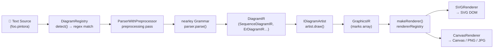
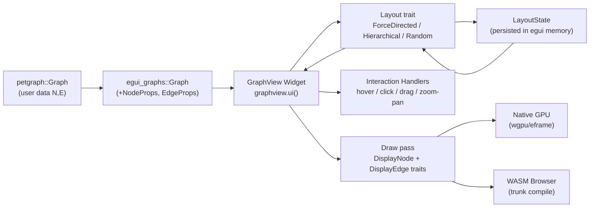
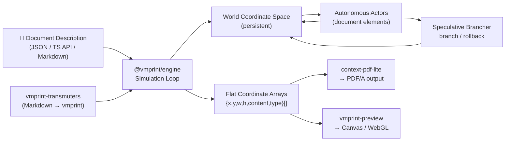
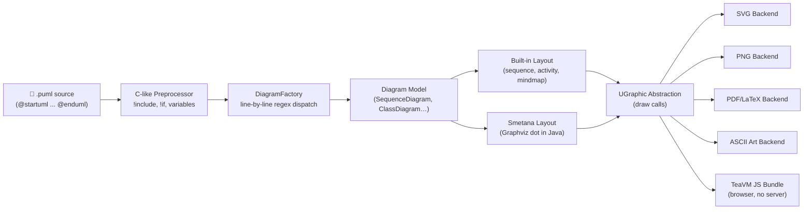

# Weekly Diagram Tooling Scan — 2026-06-09

> Scope: repos active/released trong 7 ngày qua (2026-06-02 → 2026-06-09)
> Phương pháp: topic search → keyword fallback → ecosystem scan → relevance filter

---

## Executive Summary

- **Pintora** (TypeScript, 1.3k★) định nghĩa pattern rõ nhất cho kiến trúc diagram-plugin: interface `IDiagram` buộc mỗi diagram type phải expose `pattern` (regex detect) + `parser` (text→DiagramIR) + `artist` (DiagramIR→GraphicsIR), còn renderer là pluggable backend riêng — đây là cách tách concern sạch nhất trong ecosystem JS hiện tại.
- **egui_graphs** (Rust+WASM, 679★) cho thấy Fruchterman-Reingold có thể được modularized thành composable "extras" (Center Gravity, v.v.) qua generic `Layout<S: LayoutState>` trait — state persistence across frames cho phép simulation tiếp tục giữa repaints mà không reset.
- **vmprint** (TypeScript, 548★) abandon pipeline pattern hoàn toàn: thay vào đó, layout là một *spatiotemporal simulation* — từng element là autonomous actor thương lượng geometry trong world coordinates, pages là viewports chứ không phải containers. Approach patent-pending nhưng source mở, đáng học nếu kymostudio cần giải quyết bài toán dependency (e.g. edge routing constraints, label placement overlap).

---

## Table of Contents

1. [hikerpig/pintora — Extensible text-to-diagram TS monorepo](#1-hikerpigpintora)
2. [blitzarx1/egui_graphs — Rust/WASM interactive graph widget](#2-blitzarx1egui_graphs)
3. [cosmiciron/vmprint — Spatiotemporal layout engine](#3-cosmicironvmprint)
4. [plantuml/plantuml — Battle-tested grammar-based DSL (Java)](#4-plantumlplantuml)

---

## 1. hikerpig/pintora

### §1 — Quick Context

**One-line pitch:** Text-to-diagram TypeScript library giải quyết vấn đề extensibility mà Mermaid không làm được — developer third-party có thể ship diagram type mới như npm package, không cần fork.

- **Tech stack:** TypeScript, nearley (parser combinator), @antv/event-emitter, tinycolor2 → output SVG / Canvas / PNG / JPG
- **Repo health:** 1,282★, ~37 forks, MIT license, có CI, last push 2026-06-03, v0.8.1
- **Distribution:** npm (8 packages), browser + Node.js + WinterCG runtime

### §2 — Architecture Deep-Dive

#### A. Component Inventory

| Module | Path | Vai trò |
|--------|------|---------|
| `pintora-core` | `packages/pintora-core/` | Registry, config, type contracts, `parseAndDraw()` entrypoint |
| `pintora-diagrams` | `packages/pintora-diagrams/` | 8 diagram implementations (sequence, ER, component, activity, mindmap, gantt, dot, class) |
| `pintora-renderer` | `packages/pintora-renderer/` | SVG / Canvas backends, `rendererRegistry`, `makeRenderer()` factory |
| `pintora-standalone` | `packages/pintora-standalone/` | Browser bundle (bundles core+diagrams+renderer) |
| `pintora-cli` | `packages/pintora-cli/` | Node.js CLI: `pintora render -i foo.pintora -o foo.svg` |
| `pintora-target-wintercg` | `packages/pintora-target-wintercg/` | Serverless / edge runtime support |
| `development-kit` | `packages/development-kit/` | Plugin dev utilities |

#### B. Pipeline / Control Flow

```
1. User chạy: pintora.renderTo(text, {container: el})
       ↓
2. Core: diagramRegistry.detect(text) → match IDiagram.pattern (regex)
       ↓
3. Core: IDiagram.parser.parse(text, context) → DiagramIR
       (ParserWithPreprocessor: preprocessing macros → nearley grammar parse)
       ↓
4. Core: IDiagram.artist.draw(diagramIR, config, opts) → GraphicsIR
       (artist per diagram type: sequence artist tính lifeline positions,
        message arrow paths, loop bounds — tất cả thành marks)
       ↓
5. Renderer: makeRenderer(graphicsIR, rendererType) → IRenderer instance
       (SVGRenderer hoặc CanvasRenderer, cả hai implement IRenderer interface)
       ↓
6. Renderer: renderer.setContainer(el) → renderer.render()
       → DOM được mutate / file PNG được ghi
```

#### C. Data Model / Intermediate Representation

Pintora dùng **two-level IR**:

- **DiagramIR** (`DiagramIR` type): semantic level — với sequence diagram là `SequenceDiagramIR` chứa `messages[]`, `actors{}`, `actorOrder[]`, `notes[]`, `participantBoxes[]`. Mutable: `SequenceDB.apply(action)` dispatch actions vào DB → `getDiagramIR()` snapshot immutable.
- **GraphicsIR** (`GraphicsIR` type): graphic primitives level — array of "marks" (rect, line, path, text, group). Immutable sau khi artist tạo ra.

Two-level separation rõ ràng: DiagramIR nói về *ngữ nghĩa* (actor A gửi message đến actor B), GraphicsIR nói về *geometry* (đường thẳng từ tọa độ (x1,y1) đến (x2,y2)).

#### D. Input Language Design

- **Parser approach:** `ParserWithPreprocessor` wrapper — giai đoạn 1 là text preprocessing (config blocks, includes), giai đoạn 2 là nearley grammar parse.
- **Grammar:** nearley (parser combinator approach, BNF-style grammar files `.ne`). Mỗi diagram type có grammar file riêng.
- **Detection:** regex pattern matching trên dòng đầu — `sequenceDiagram`, `erDiagram`, v.v.
- **Error reporting:** không xác định rõ từ source đọc được.

#### E. Layout Algorithm

Sequence diagram dùng **model-based vertical layout**:
- `model.verticalPos` track vertical position hiện tại
- `calculateActorMargins()` tính horizontal spacing dựa trên message text width
- `calculateLoopBounds()` pre-compute nested structure dimensions (loop/alt/par)
- Mỗi message → `bumpVerticalPos(delta)` → tăng `verticalPos`
- Self-message dùng cubic bezier curve: `M x,y C (x+60), ... x, y2`
- Không dùng generic graph layout (dagre/elk) — custom manual layout per diagram type

#### F. Rendering / Output Strategy

- **Backend(s):** SVG, Canvas (browser); PNG, JPG, SVG (Node.js via canvas module)
- **Pluggable emitter pattern:** `rendererRegistry` cho phép register backend mới — `makeRenderer(ir, type)` factory
- **Animation:** không có built-in animation
- **SVG output:** clean, self-contained, không inject global CSS (explicit design goal)

#### G. Extensibility

- **Plugin system:** third-party implement `IDiagram` interface → `diagramRegistry.registerDiagram(name, impl)` → system tự detect
- **Theme:** `themeRegistry` + `ITheme` interface → custom theme as plugin
- **Symbol:** `symbolRegistry` cho phép add custom shapes

#### H. Dev Experience

- **CLI:** `pintora render` command, có watch mode không xác định
- **IDE:** VSCode extension có (syntax highlighting)
- **Integrations:** Gatsby remark plugin, Obsidian plugin, Stencil web component wrapper

### §3 — Architecture Diagram



### §4 — Verdict

**Đáng học cho kymostudio:**
- `IDiagram` interface pattern (pattern + parser + artist) là blueprint lý tưởng nếu kymo muốn support multiple diagram types với third-party extensibility.
- Two-level IR (semantic IR → graphic IR) giúp tách bài toán "hiểu diagram" ra khỏi "vẽ diagram" — dễ test từng stage độc lập.
- `rendererRegistry` pattern cho phép swap render backend mà không đụng logic diagram.

**Red flags:**
- Custom manual layout per diagram type — không dùng generic layout engine, vì vậy khó add auto-layout cho diagram mới.
- DiagramIR dùng mutable DB pattern (apply/dispatch) nhưng artist nhận immutable snapshot — flow hơi lộn xộn.
- Một typo nhỏ trong source (`GrahpicEventHandler`) gợi ý test coverage chưa đủ nghiêm.

**Open questions:** Nearley vs PEG — tại sao chọn nearley? Nó handle ambiguous grammar nhưng chậm hơn PEG rõ rệt với large inputs.

**Verdict: study deeper** — đặc biệt IDiagram plugin interface và two-level IR design.

---

## 2. blitzarx1/egui_graphs

### §1 — Quick Context

**One-line pitch:** Widget Rust cho egui hiển thị interactive graph — khác thư viện JS ở chỗ compile được sang WASM, layout algorithm là trait generic thay vì hardcode, và force simulation tiếp tục giữa frames mà không reset.

- **Tech stack:** Rust, egui 0.34.1, eframe 0.34.1, petgraph 0.8 → output native GPU (wgpu) + WASM via trunk
- **Repo health:** 679★, 73 forks, MIT, `unsafe_code = 'forbid'`, có CI+benchmarks, last push 2026-06-07
- **Distribution:** crates.io, web demo (WASM), binary demo

### §2 — Architecture Deep-Dive

#### A. Component Inventory

| Module | Path | Vai trò |
|--------|------|---------|
| `egui_graphs` crate | `crates/egui_graphs/src/` | Core library: Graph, GraphView widget, Layout trait |
| `graph.rs` | `crates/egui_graphs/src/graph.rs` | Graph data structure wrapping petgraph |
| `graph_view.rs` | `crates/egui_graphs/src/graph_view.rs` | Widget UI implementation, interaction handler |
| `layouts/` | `crates/egui_graphs/src/layouts/` | Layout algorithm impls: force_directed, hierarchical, random |
| `draw/` | `crates/egui_graphs/src/draw/` | Rendering logic: node/edge shapes |
| `elements/` | `crates/egui_graphs/src/elements/` | Node, Edge types với props |
| `events/` | `crates/egui_graphs/src/events/` | Interaction event types |
| `settings.rs` | `crates/egui_graphs/src/settings.rs` | SettingsInteraction, SettingsNavigation, SettingsStyle |
| `demo-core` crate | `crates/demo-core/` | Shared demo logic |
| `demo-web` crate | `crates/demo-web/` | WASM web demo via trunk |

#### B. Pipeline / Control Flow

```
1. User tạo: Graph::from(&petgraph::Graph<N,E>)
      ↓
2. Frame render: graphview.ui(&mut ui)
      ↓
3. Widget: sync_layout() → L::from_state(S::load(ui, id))
      ↓
4. Widget: layout.next(&mut graph) → cập nhật node positions
      (Fruchterman-Reingold: repulsive + attractive forces,
       temperature cooling mỗi iteration)
      ↓
5. Widget: handle_hover() / handle_click() / handle_drag() / handle_navigation()
      ↓
6. Widget: draw nodes (DisplayNode trait) + draw edges (DisplayEdge trait)
      → egui Painter calls (rectangles, lines, bezier curves trên GPU canvas)
      ↓
7. Widget: state.save(ui, id) → persist layout state cho frame sau
      ↓
8. Widget: ui.ctx().request_repaint() → continuous animation
```

#### C. Data Model / Intermediate Representation

Không có IR theo nghĩa diagram tools — đây là widget library:
- **`Graph<N, E, Ty, Ix>`** wraps `petgraph::Graph` — add rendering metadata (`NodeProps`, `EdgeProps`: position, color, label)
- **`Node<N>`** / **`Edge<E>`** — graph elements với display properties
- **`LayoutState` trait** — persistent simulation state giữa frames (positions, velocities)
- **`MetadataFrame`** — track performance metrics (layout time, draw time)
- Mutable: positions thay đổi mỗi frame theo simulation

#### D. Input Language Design

Không có DSL — input là Rust code constructing `petgraph::Graph<N,E>`, rồi wrap bằng `egui_graphs::Graph::from()`.

#### E. Layout Algorithm

- **Force-directed (Fruchterman-Reingold):** O(n²), mỗi frame tính repulsive forces giữa tất cả cặp nodes + attractive forces trên edges, temperature cooling theo thời gian. Exposed params: tunable simulation parameters.
- **Composable extras pattern:** `FruchtermanReingoldWithExtras<E>` — generic parameter `E: Extra` cho phép compose thêm forces. `CenterGravity` là Extra built-in giữ graph centered.
- **Hierarchical:** layered/ranked layout (implementation details không xác định từ source đọc được)
- **Random:** scatter ngẫu nhiên — default nhanh
- **State persistence:** `L::from_state(S::load(ui, id))` load simulation state từ egui memory → simulation tiếp tục chứ không restart mỗi frame
- **Fast-forward:** `fast_forward_until_stable()` với time budget — useful cho initial placement

#### F. Rendering / Output Strategy

- **Backend duy nhất:** egui/eframe immediate-mode GPU rendering (wgpu underneath)
- **Native:** desktop app via eframe
- **WASM:** compile với trunk → chạy trên browser, same code
- **Animation:** không phải animation theo nghĩa timeline — continuous simulation repaint
- **Custom shapes:** `DisplayNode` trait → implement `show()` với `egui::Painter` → any shape possible
- **Edge routing:** straight lines / simple curves — không có orthogonal routing

#### G. Extensibility

- **Custom layout:** implement `Layout<S>` trait + `LayoutState` → pluggable
- **Custom node rendering:** implement `DisplayNode` → bất kỳ shape nào dùng egui Painter
- **Custom edge rendering:** implement `DisplayEdge`
- **Events:** optional `events` feature để nhận interaction events

#### H. Dev Experience

- **Strict safety:** `unsafe_code = 'forbid'` — không có unsafe Rust
- **Benchmarks:** criterion benchmarks cho layout performance
- **Web demo:** live WASM demo tại blitzarx1.github.io/egui_graphs
- **No LSP/IDE integration** (không applicable cho Rust widget library)

### §3 — Architecture Diagram



### §4 — Verdict

**Đáng học cho kymostudio:**
- **Composable extras pattern** cho force-directed layout là ý tưởng hay — thay vì một monolithic force function, có thể compose forces như `FruchtermanReingold + CenterGravity + EdgeLengthTarget`. Kymo có thể áp dụng pattern này cho layout engine riêng.
- **Generic `Layout<S: LayoutState>` trait** với state persistence: cách isolate layout algorithm state rất sạch, dễ swap algorithm mà không thay đổi rendering code.
- **`fast_forward_until_stable()`** với time budget: hữu ích cho initial placement — chạy simulation nhanh đến khi stable thay vì fade-in từ random positions.

**Red flags:**
- O(n²) force calculation — không scale với graphs > vài trăm nodes. Không thấy BVH/spatial hashing optimization.
- Không có orthogonal edge routing — chỉ straight/simple curve. Bài toán "edge crossing" không được giải.
- Hierarchical layout implementation không rõ từ source đọc được — có thể là Sugiyama hay đơn giản hơn.

**Open questions:** Composable extras có thể dùng cho orthogonal routing constraints không? Layout trait có hỗ trợ "pinned nodes" (user drag → lock position) chưa?

**Verdict: glance only** — useful nếu kymo target Rust/WASM, nhưng nếu stack là TypeScript thì chỉ học composable force extras pattern.

---

## 3. cosmiciron/vmprint

### §1 — Quick Context

**One-line pitch:** Layout engine TypeScript giải bài toán document pagination không phải bằng pipeline mà bằng spatiotemporal simulation — elements là autonomous actors, pages là viewports, cho phép single-pass resolution của circular dependencies (ToC với page numbers chính xác).

- **Tech stack:** Pure TypeScript, zero native deps, `@vmprint/engine`, `@vmprint/context-pdf-lite`, `@vmprint/standard-fonts` → output flat coordinate arrays → Canvas/WebGL/PDF
- **Repo health:** 548★, 20 forks, Apache 2.0, có pages demo, last push 2026-06-07, patent pending
- **Distribution:** npm (scoped packages), serverless-compatible, edge runtime compatible

### §2 — Architecture Deep-Dive

#### A. Component Inventory

| Module | Package | Vai trò |
|--------|---------|---------|
| `@vmprint/engine` | `packages/engine/` | Core API: simulation loop, actor model, world coordinates |
| `@vmprint/cli` | `packages/cli/` | CLI: batch JSON-to-PDF processing |
| `@vmprint/contracts` | `packages/contracts/` | Shared type contracts/interfaces |
| `pressrun` | `packages/pressrun/` | Minimal bootstrap/example |
| `@vmprint/context-pdf-lite` | companion repo | PDF output context (flat coords → PDF) |
| `@vmprint/standard-fonts` | companion repo | Font handling cho PDF |
| `vmprint-preview` | companion repo | Browser visualization |
| `vmprint-transmuters` | companion repo | Markdown → vmprint compilation |

#### B. Pipeline / Control Flow

vmprint không có "pipeline" theo nghĩa truyền thống — đây là **simulation loop**:

```
1. User define document: describe elements (paragraphs, tables, ToC, images)
      ↓
2. Engine: initialize world coordinate space — persistent coordinate system
      ↓
3. Simulation tick: each actor (document element) observes current world state
      ↓
4. Actor negotiates geometry: element tính size/position của mình dựa trên
      neighbors, constraints, available space
      ↓
5. Three-tier update classification:
      • no-change → skip
      • content-only → update text/style, giữ geometry
      • geometry-changing → recompute positions
      ↓
6. Speculative branching: nếu layout policy cần evaluate
      → tạo temporary branch → commit hoặc rollback đến bit-identical snapshot
      ↓
7. Simulation converges (single-pass): circular dependencies (ToC → page numbers
      → pagination affects page numbers) được resolve tự nhiên
      ↓
8. Engine output: flat coordinate arrays với semantic provenance
      (mỗi glyph/box biết nó là gì và ở đâu)
      ↓
9. Context renderer (PDF/Canvas/WebGL) consume flat arrays → output
```

#### C. Data Model / Intermediate Representation

vmprint dùng approach khác hẳn diagram tools:
- **World coordinate space:** single persistent coordinate system — không phải per-page
- **Actors:** document elements là autonomous agents, mỗi actor có state riêng
- **Flat coordinate output:** `{x, y, width, height, content, semanticType}[]` — intentionally simple để nhiều renderer dùng được
- **Speculative state:** mutable world state với branch/rollback capability — giống database MVCC
- **Three-tier classification:** `no-change | content-only | geometry-changing` cho incremental update efficiency

#### D. Input Language Design

- **Input format:** JSON documents (cli: batch JSON-to-PDF), hoặc TypeScript API
- **Không có DSL text** theo nghĩa pintora/plantuml — input là structured data
- **vmprint-transmuters:** Markdown → vmprint input (companion tool)
- Đây là **layout engine**, không phải diagram tool — bài toán khác hẳn

#### E. Layout Algorithm

vmprint giải **document pagination** không phải graph layout:
- **Spatiotemporal simulation:** không phải Sugiyama, không phải Fruchterman-Reingold
- **Actor-based negotiation:** mỗi element tự tính vị trí của mình trong world space
- **Pages as viewports:** thay vì chia content vào pages, pages là "windows" vào world space → page breaks được tính tự nhiên
- **Single-pass ToC:** circular dependency (ToC cần page numbers, pagination phụ thuộc content) được resolve bởi simulation observability
- **Multi-script:** Arabic (RTL), Hebrew, Thai, Devanagari, CJK — pure JS, không dùng HarfBuzz/ICU

#### F. Rendering / Output Strategy

- **Engine output:** flat coordinate arrays (không phải SVG/Canvas trực tiếp)
- **Multiple contexts:** `@vmprint/context-pdf-lite` (PDF), `vmprint-preview` (Canvas/WebGL browser preview)
- **Pluggable context pattern:** engine → context adapter → output format
- **Deterministic:** bit-identical output trên mọi machine/OS/run
- **Animation:** không applicable (document layout, không phải interactive diagram)

#### G. Extensibility

- **New output format:** implement context adapter (PDF context pattern)
- **Custom actors:** không xác định rõ từ source đọc được
- **vmprint-transmuters:** extensible compilation pipeline (Markdown → vmprint, sẽ có HTML → vmprint)

#### H. Dev Experience

- **CLI:** batch processing `@vmprint/cli`
- **Browser preview:** `vmprint-preview` companion
- **Pure TS:** no native deps → easy testing, serverless deploy
- **Patent pending:** architecture có giới hạn về việc implement tương tự

### §3 — Architecture Diagram



### §4 — Verdict

**Đáng học cho kymostudio:**
- **Actor-as-autonomous-agent model**: nếu kymo cần giải bài toán label placement, edge routing với constraints (label không được overlap edge, edge không được overlap node text), approach này có thể apply — mỗi label là actor tự negotiate vị trí.
- **Three-tier update classification** (no-change / content-only / geometry-changing): rất hữu ích cho incremental re-render khi user chỉnh sửa một phần diagram.
- **Flat coordinate output pattern**: tách engine khỏi renderer hoàn toàn — kymo có thể adopt pattern này để support nhiều output format (SVG, Canvas, WebGL) từ cùng một layout pass.

**Red flags:**
- Patent pending trên core architecture — không thể clone approach 1:1 cho commercial product
- Đây là document/DTP layout, không phải graph diagram layout — nhiều concept không transfer trực tiếp (không có edges, không có crossing minimization)
- Source chính không accessible trực tiếp nhiều — `packages/engine/src/` 404 repeatedly, có thể code engine thực tế ở companion private repos

**Open questions:** Simulation converge bao nhiêu ticks? Determinism có hold với font subsetting không đồng nhất?

**Verdict: glance only** — học 3 patterns cụ thể (actor negotiation, three-tier update, flat coord output) nhưng không study toàn bộ architecture.

---

## 4. plantuml/plantuml

### §1 — Quick Context

**One-line pitch:** DSL text-to-diagram Java tool với 20+ diagram types, khác biệt ở chỗ dùng preprocessor C-like (biến, điều kiện, include) trước khi parse → diagram logic có thể được template hóa và reuse.

- **Tech stack:** Java (99.3%), Gradle build, TeaVM (compile Java→JS cho browser), Graphviz (optional, cho class/component layout), custom layout engine built-in
- **Repo health:** 13,075★, 1,200 forks, Other license (có commercial clause), last release v1.2026.6 (Jun 8), active CI
- **Distribution:** JAR, Docker, web server, TeaVM JS bundle, Maven/Gradle

### §2 — Architecture Deep-Dive

#### A. Component Inventory

plantuml là monorepo Java lớn (~1M LOC). Packages chính (từ source structure):

| Package | Path | Vai trò |
|---------|------|---------|
| `net.sourceforge.plantuml` | root | Main orchestrator, `SourceStringReader`, diagram factory |
| `net.sourceforge.plantuml.preproc` | `preproc/` | C-like preprocessor: `!if`, `!include`, variables, functions |
| `net.sourceforge.plantuml.sequencediagram` | `sequencediagram/` | Sequence diagram: parser, model, renderer |
| `net.sourceforge.plantuml.classdiagram` | `classdiagram/` | Class diagram |
| `net.sourceforge.plantuml.ugraphic` | `ugraphic/` | Universal graphics abstraction layer |
| `net.sourceforge.plantuml.graphic` | `graphic/` | Text/shape rendering |
| `net.sourceforge.plantuml.svek` | `svek/` | Graphviz integration layer (SVG parsing + coordinate extraction) |
| `net.sourceforge.plantuml.skin` | `skin/` | Skinparam theming system |
| `net.sourceforge.plantuml.creole` | `creole/` | Rich text (Creole markup) renderer |

#### B. Pipeline / Control Flow

```
1. User chạy: java -jar plantuml.jar foo.puml
      ↓
2. SourceStringReader: đọc file → detect @startuml/@enduml boundary
      ↓
3. Preprocessor (C-like): expand !include, !if, variables, functions
      → clean diagram text
      ↓
4. DiagramFactory: line-by-line command parsing
      (regex per line type — không phải full grammar parser)
      ↓
5. Diagram model build: SequenceDiagram, ClassDiagram, etc.
      (mutable model, từng command mutate state)
      ↓
6. Layout:
      • Sequence/Activity/Gantt: built-in custom layout (manual)
      • Class/Component/Deployment: Graphviz (dot) via svek layer
        HOẶC built-in layout engine (Smetana — port của Graphviz dot sang Java)
      ↓
7. UGraphic rendering: diagram → ugraphic calls
      (UGraphicSvg, UGraphicPng, UGraphicEps, UGraphicTikz, v.v.)
      ↓
8. Output file: .svg / .png / .pdf / .eps / .txt (ASCII art)
```

#### C. Data Model / Intermediate Representation

plantuml không có explicit two-level IR như pintora:
- **Mutable diagram model** built command-by-command: `SequenceDiagram`, `ClassDiagram`, etc.
- **UGraphic abstraction** là "IR" duy nhất — sequence of draw calls (drawRect, drawLine, drawText)
- Không có explicit "DiagramIR → GraphicsIR" separation — layout và rendering interleaved trong nhiều trường hợp
- **Smetana** (built-in Graphviz port): có IR riêng từ Graphviz dot model

#### D. Input Language Design

- **Parser approach:** **line-by-line regex command parsing** — không phải grammar parser! Mỗi loại diagram có set regex patterns, đọc từng dòng và dispatch.
- **Preprocessor:** C-like preprocessor TRƯỚC khi parse — `!define`, `!include`, `!if/else/endif`, `!while`, `!procedure`, `!function`. >40 built-in `%functions`.
- **Formal grammar:** không có BNF/EBNF formal specification published — implicit trong code.
- **Error reporting:** error messages xuất hiện trong output diagram (diagram với error text) — unique approach.

#### E. Layout Algorithm

- **Sequence/Activity/Mindmap:** custom built-in layout (column-based, vertical growth)
- **Class/Component/Deployment:** **Graphviz dot** (Sugiyama algorithm) via subprocess HOẶC **Smetana** (Java port của dot)
- **Smetana:** pure Java implementation của Graphviz layout — không cần Graphviz binary installed
- **Edge routing:** Graphviz-style orthogonal + spline (via Smetana)
- **Crossing minimization:** Sugiyama framework (barycentric method) — trong Smetana

#### F. Rendering / Output Strategy

- **UGraphic abstraction:** universal drawing API với nhiều backend
- **Backends:** SVG, PNG, EPS, PDF, LaTeX/TikZ, ASCII art, Braille
- **TeaVM:** compile Java → JavaScript → browser rendering (không cần server)
- **Animation:** không có
- **Skinparam theming:** extensive theming system — background color, font, line thickness, v.v.
- **Single emitter pattern:** `UGraphic` interface, nhiều implementations

#### G. Extensibility

- **Skinparam:** extensive visual customization không cần code
- **Sprite/icon libraries:** zip/jar packages với custom sprites
- **`!include` libraries:** reusable diagram components
- **Không có plugin API** kiểu pintora — extending diagram types cần fork

#### H. Dev Experience

- **CLI:** full-featured, good error messages (error embedded in output image)
- **IDE integration:** VS Code extension, IntelliJ plugin, nhiều editor integrations
- **Server mode:** PlantUML server có REST API
- **Watch mode:** không có built-in nhưng nhiều editor integrations hỗ trợ
- **Active community:** forum, nhiều third-party integrations

### §3 — Architecture Diagram



### §4 — Verdict

**Đáng học cho kymostudio:**
- **Preprocessing layer** (C-like `!include`, `!if`, variables) trước khi parse: pattern rất mạnh cho diagram reuse và templating — kymo có thể adopt preprocessor step trước diagram parser để support macros.
- **Error-in-output pattern:** khi diagram lỗi, render một diagram có error message thay vì crash — UX tốt hơn blank screen.
- **UGraphic abstraction** là inspirational — universal draw API cho phép add output format mới mà không đụng diagram logic.
- **Smetana approach** (port layout engine sang target language) là template cho kymo nếu muốn run Graphviz-quality layout in-process.

**Red flags:**
- Line-by-line regex parsing — fragile, không có formal grammar, rất khó extend diagram types mới.
- Không có two-level IR — layout và rendering intermixed → khó test, khó optimize.
- Java monorepo ~1M LOC — difficult to understand holistically.
- License "Other" có commercial restriction clause — cần đọc kỹ trước khi reference.

**Open questions:** Smetana coverage có đầy đủ như Graphviz binary chưa? Có thể extract Smetana thành standalone library không?

**Verdict: glance only** — học preprocessor pattern và UGraphic abstraction, không study full architecture.

---

## Tổng kết

| Repo | Stars | Language | Verdict | Pattern chính cần học |
|------|-------|----------|---------|----------------------|
| hikerpig/pintora | 1,282★ | TypeScript | **Study deeper** | IDiagram plugin interface, two-level IR |
| blitzarx1/egui_graphs | 679★ | Rust+WASM | Glance only | Composable force extras, LayoutState persistence |
| cosmiciron/vmprint | 548★ | TypeScript | Glance only | Actor negotiation, three-tier update, flat coord output |
| plantuml/plantuml | 13,075★ | Java | Glance only | Preprocessing layer, UGraphic abstraction, error-in-output |

> Repo đáng invest thời gian nhất tuần này cho kymostudio: **hikerpig/pintora** — architectural patterns (IDiagram, two-level IR, rendererRegistry) có thể copy gần như 1:1 vào TypeScript stack.
