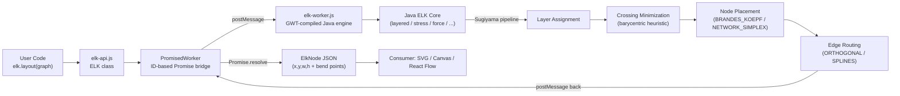
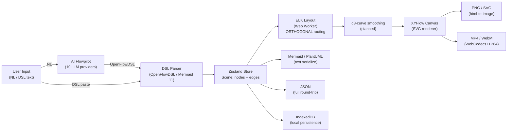
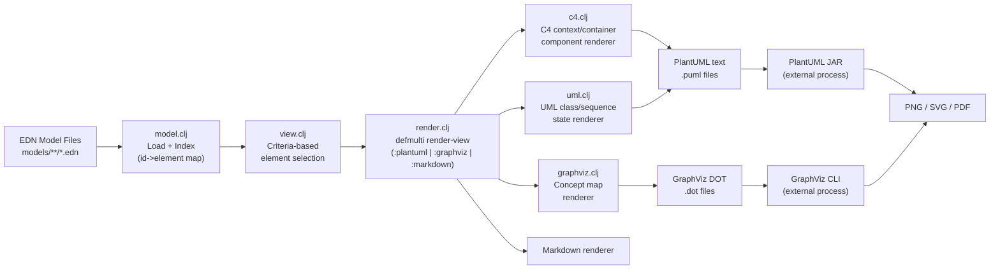

# Weekly Diagram Tooling Scan — 2026-06-11

> **Scan window:** 2026-06-04 → 2026-06-11  
> **Repos khảo sát:** 6 candidates (topic-based + keyword-based)  
> **Repos phân tích sâu:** 4

---

## Executive Summary

- **ELK.js** vừa push bản 0.12.0 với bug-fix quan trọng, là layout engine mạnh nhất hiện tại cho JS — Sugiyama layered + 8 thuật toán khác, pure-layout (no render), Web Worker pattern đáng học ngay cho kymo.
- **OpenFlowKit** (597★, mới 4 tháng) là bằng chứng thực nghiệm về một pipeline hoàn chỉnh: ELK orthogonal layout + d3-curve smoothing + WebCodecs MP4 export + AI self-correction loop + MCP server — đủ để dùng làm "reference architecture" cho kymo v2.
- **Overarch** (Clojure) trình bày một triết lý khác biệt: *model-as-data trước, diagram là view* — EDN làm single source of truth thay vì DSL; cách tiếp cận này đáng tham khảo khi kymo cần hỗ trợ multi-format export.

---

## Table of Contents

1. [kieler/elkjs](#1-kielerelkjs) — Layout engine Sugiyama + 8 thuật toán, GWT-compiled Java → JS
2. [Vrun-design/openflowkit](#2-vrun-designopenflowkit) — Visual + code diagram tool, AI + WebCodecs MP4, local-first SPA
3. [soulspace-org/overarch](#3-soulspace-orgoverarch) — Architecture-as-data (Clojure + EDN), C4/UML generation
4. [mingrammer/diagrams](#4-mingrammerdiagrams) — Python DSL context-manager, cloud architecture, Graphviz backend

---

## 1. kieler/elkjs

### §1 — Quick Context

**Pitch:** Engine layout đồ thị duy nhất viết bằng Java được compile sang JS qua GWT, hỗ trợ Sugiyama layered + 8 thuật toán khác mà không cần server.

- **Tech stack:** JavaScript (GWT-compiled Java core), Web Worker, ES module API; output: ELK JSON (tọa độ x/y/width/height), không render SVG
- **Repo health:** 2,616★, 17 contributors, v0.12.0 (pushed 2026-06-10), CI qua Gradle + Mocha
- **Distribution:** npm (`elkjs`), bundled (`elk.bundled.js`) + separate worker (`elk-worker.js`)

---

### §2 — Architecture Deep-Dive

#### A. Component Inventory

| Module | File path | Vai trò |
|--------|-----------|---------|
| `ELK` API class | `src/js/elk-api.js` | Public JS wrapper, Promise-based, spawns Worker |
| `PromisedWorker` | `src/js/elk-api.js` (internal) | Converts postMessage callback → Promise với unique ID matching |
| Java engine | `src/java/org/eclipse/elk/js/ElkJs.java` | GWT entry point, dispatch layout request → ELK Java core |
| Compiled worker | `lib/elk-worker.js` + `elk-worker.min.js` | Output của GWT compile + Babel + Browserify |
| TypeScript typings | `typings/elk-api.d.ts` | Full type declarations cho public API |

#### B. Pipeline / Control Flow

1. **User gọi** `elk.layout(graph, { layoutOptions })` → trả về `Promise<ElkNode>`
2. `PromisedWorker.send()` gán unique ID cho message → `worker.postMessage({ id, action: 'layout', graph })`
3. `elk-worker.js` nhận message → dispatch sang `ElkJs.java` entry point qua GWT JS interop
4. Java engine (ELK layered/stress/...) tính toán tọa độ → `postMessage({ id, data: layoutedGraph })`
5. `PromisedWorker` match ID → resolve Promise với graph đã có `x`, `y`, `width`, `height`
6. User nhận kết quả: `ElkNode` tree với tọa độ đầy đủ → tự vẽ SVG/Canvas

#### C. Data Model / Intermediate Representation

Dữ liệu là **ELK JSON format** — immutable in/out:

```typescript
interface ElkNode extends ElkShape {
  id: string                    // required
  children?: ElkNode[]          // hierarchical sub-graphs
  ports?: ElkPort[]             // attachment points trên border
  edges?: ElkExtendedEdge[]     // edges nằm trong scope của node
  labels?: ElkLabel[]
  layoutOptions?: LayoutOptions // { "elk.algorithm": "layered", ... }
}

interface ElkExtendedEdge extends ElkEdge {
  sources: string[]             // multi-source (hyperedge support)
  targets: string[]
  sections?: ElkEdgeSection[]   // OUTPUT: waypoints + bend points
}

interface ElkEdgeSection {
  startPoint: ElkPoint
  endPoint: ElkPoint
  bendPoints?: ElkPoint[]       // OUTPUT: bend points từ edge routing
}
```

Không có concept "compile to lower IR" — input và output cùng schema, output thêm tọa độ. Mutable chỉ trong Java engine (black-box với JS).

#### D. Input Language Design

Không có DSL — pure programmatic JSON API. Layout options dùng string key-value:

```javascript
layoutOptions: {
  "elk.algorithm": "layered",
  "elk.direction": "RIGHT",
  "elk.edgeRouting": "ORTHOGONAL",
  "elk.layered.nodePlacement.strategy": "BRANDES_KOEPF"
}
```

Có type alias shorthand (e.g., `"algorithm"` thay vì `"org.eclipse.elk.algorithm"`). Không có formal grammar — Java codebase có annotation-based option declaration. Error reporting: Promise rejection với message từ Java.

#### E. Layout Algorithm

ELK hỗ trợ nhiều thuật toán:

- **layered** (default): Sugiyama framework — layer assignment → crossing minimization (barycentric / iterative) → node placement (BRANDES_KOEPF, NETWORK_SIMPLEX) → edge routing
- **stress**: Force-directed dựa trên stress minimization
- **mrtree**: Tree layout, hierarchical
- **radial**: Circular/radial layout
- **force**: Classic force-directed (Fruchterman-Reingold)
- **disco**: Connected components với auto-decomposition
- **sporeOverlap / sporeCompaction**: Overlap removal
- **rectpacking**: Rectangle packing

Edge routing: `ORTHOGONAL` (corridor-based), `POLYLINE`, `SPLINES`, `UNDEFINED`. Crossing minimization: có, dùng barycentric heuristic trong layered algorithm.

#### F. Rendering / Output Strategy

**Không render** — pure layout engine. Output là JSON với tọa độ. Consumer (React Flow, Sprotty, custom SVG renderer) tự vẽ. Không có animation. Single backend (JSON output).

#### G. Extensibility

- Custom layout algorithms: register qua `algorithms` array trong constructor
- `workerFactory`: inject custom Worker implementation (cho environments không có native Worker)
- Layout options: string key-value → extensible nhưng không type-safe ngoài known options

#### H. Dev Experience

- CLI: không (library, không tool)
- TypeScript: full typings tại `typings/elk-api.d.ts`
- Web Worker support: built-in (`workerUrl` param)
- Node.js support: `lib/elk.bundled.js` (Node-compatible bundle)
- Watch mode: không applicable
- Test: Mocha + Chai, có test examples HTML trong `test/examples/`

---

### §3 — Architecture Diagram



---

### §4 — Verdict

**Điểm đáng học cho kymostudio:**
- **Web Worker pattern** là cách đúng để chạy layout nặng mà không block UI — kymo nên làm tương tự ngay khi có auto-layout.
- **BRANDES_KOEPF** vs `NETWORK_SIMPLEX` là hai chiến lược node placement với trade-off quality vs speed — đáng thử nghiệm trong kymo layout engine.
- ELK edge section (`sections[].bendPoints`) là format chuẩn cho orthogonal routing output — kymo có thể dùng format này làm internal representation.
- **Red flag:** ELK 0.12.0 vẫn dùng GWT để compile Java → JS (technology từ 2000s), build pipeline phức tạp. Dependency nặng (~1.5MB bundled). Xem xét dùng trực tiếp qua npm thay vì tự build.
- **Open question:** ELK có hỗ trợ incremental layout (chỉ relayout subgraph thay đổi) không?
- **Verdict: Study deeper** — đặc biệt thuật toán layered và edge routing options.

---

## 2. Vrun-design/openflowkit

### §1 — Quick Context

**Pitch:** Công cụ diagram visual + code kết hợp, local-first không cần backend, AI từ 10 providers, export MP4 qua WebCodecs — tất cả chạy trong browser.

- **Tech stack:** TypeScript 5, React 19, XYFlow/React Flow 12, ELK.js 0.11, Zustand 5, Yjs (CRDT), Mermaid 11, mp4-muxer, Playwright; output: SVG/PNG/PDF/MP4/WebM/Mermaid/PlantUML/JSON/Figma
- **Repo health:** 597★, 116 forks, pushed 2026-06-06, có Playwright e2e CI + Vitest unit tests
- **Distribution:** Web SPA (Vite build), Docker, npm MCP package (`@vrun-design/openflowkit-mcp`)

---

### §2 — Architecture Deep-Dive

#### A. Component Inventory

| Module | File path | Vai trò |
|--------|-----------|---------|
| Canvas Panel | `src/features/canvas/` | XYFlow render, node/edge event handling |
| ELK Layout Service | `src/services/elkLayout.ts:70–84` | ELK.js wrapper, harvests waypoints từ layout result |
| ELK Layout Options | `src/services/elk-layout/options.ts:125` | Preset layout options (spacing, routing, placement strategy) |
| DSL Parser (OpenFlowDSL) | `src/services/` | Parse OpenFlowDSL (Mermaid-compatible) → nodes/edges |
| Mermaid Import | `src/services/mermaid/parseMermaidByType.ts:26–35` | Mermaid 11 parse + frontmatter/init config extraction |
| Import Fidelity | `src/services/importFidelity.ts` | Diagnostics, error classification, layout fallback detection |
| AI Flowpilot | `src/services/ai/` | 10-provider unified AI interface, self-correction loop |
| WebCodecs Exporter | `src/services/export/webCodecsExport.ts` | H.264 MP4 encode, mp4-muxer, MediaRecorder fallback |
| Icon Classifier | nội bộ | Semantic matching 1,600+ icons (exact → alias → substring) |
| Zustand Store | `src/store/` | Scene state (nodes, edges, viewport) |
| Yjs CRDT | `src/services/collab/` | Real-time collaboration (Y-WebRTC + Y-IndexedDB) |
| MCP Server | `packages/openflowkit-mcp/` (npm) | 8 tools cho Claude/Cursor/Windsurf |

#### B. Pipeline / Control Flow

1. **User nhập** text DSL hoặc NL description (AI) → Flowpilot → generate OpenFlowDSL
2. **OpenFlowDSL parser** parse → Zustand store update: `{ nodes: Node[], edges: Edge[] }`
3. **ELK layout service** serialize store → ELK JSON → Web Worker → layout kết quả → apply `x/y` về store
4. **XYFlow** render canvas từ store: custom node components per type (flowchart, sequence, ER, ...)
5. **Export** trigger: canvas → html-to-image (PNG/SVG) | WebCodecs (MP4) | serialize JSON | convert Mermaid/PlantUML
6. **AI self-correction loop:** nếu DSL parse error → gửi lại AI cùng error message → AI sửa DSL → retry

**Import path (Mermaid → canvas):**
Mermaid text → `parseMermaidByType()` (type detection + config extraction) → Mermaid 11 layout → attempt position mapping → nếu thất bại → `elk_fallback` → ELK relayout → import fidelity report

#### C. Data Model / Intermediate Representation

**Scene model** (Zustand + IndexedDB):
```typescript
// Conceptual — inferred from codebase
type Scene = {
  nodes: FlowNode[]   // XYFlow node: { id, type, position, data }
  edges: FlowEdge[]   // XYFlow edge: { id, source, target, curve: EdgeCurve }
  viewport: Viewport
}

type EdgeCurve = 'basis' | 'linear' | 'step' | 'smoothstep' | 'cardinal' | ...
```

**Hai IR tồn tại song song:**
- XYFlow scene graph (mutable Zustand store, source of truth cho render)
- ELK JSON (transient, chỉ dùng trong layout pass, không persist)
- OpenFlowDSL text (serialization format cho code view)

Không có "compile to lower IR" — nhưng có migration pass khi load scene cũ: `variant → curve` enum mapping.

#### D. Input Language Design

**OpenFlowDSL** là dialect của Mermaid với frontmatter config:
```
---
config:
  flowchart:
    curve: basis
    layout: elk
---
flowchart LR
  A[Start] --> B{Decision}
  B -->|Yes| C[End]
```

Parser tiếp cận: dùng **Mermaid 11 parser** làm base (PEG-based, nằm trong mermaid npm package). Frontmatter/init directive parsing tại `parseMermaidByType.ts:26–35`. Error reporting: diagnostics objects → `ImportIssue` với severity (error/warning/unsup).

AI self-correction: error message + bad DSL → LLM context → corrected DSL output. Không có formal BNF riêng ngoài Mermaid's grammar.

#### E. Layout Algorithm

ELK.js 0.11.0 với **ORTHOGONAL** edge routing, **NETWORK_SIMPLEX** node placement (plan switch sang **BRANDES_KOEPF**). Spacing: nodeNode 40–76, edgeNode 24–42 (preset-driven). **Anchored layout**: user có thể pin nodes — ELK arrange around pinned positions.

**Planned improvement** (render-quality-plan.md): sau khi ELK tính orthogonal waypoints, chạy thêm `d3.line().curve(curveFn)` để B-spline smoothing → kết hợp corridor routing của ELK với smooth aesthetics của Mermaid.

#### F. Rendering / Output Strategy

- **Canvas render:** XYFlow SVG-based renderer, custom React components per node type
- **PNG/SVG:** html-to-image library
- **MP4/WebM:** WebCodecs API (`VideoEncoder`, codec `avc1.42001f` H.264 baseline 3.1, 4Mbps, keyframe mỗi 30 frames, mp4-muxer), fallback MediaRecorder
- **Animation sequence:** node-by-node + edge-by-edge reveal, frame timing dựa trên `delayMs` (deterministic, không dùng wall clock)
- **PDF, Mermaid text, PlantUML text, Figma SVG, JSON**: export adapters

#### G. Extensibility

- AI providers: unified interface, add provider = implement adapter + add to settings enum
- Icons: classifier system, add provider = thêm icon map JSON
- MCP server: 8 tools pre-built, extensible qua Node.js MCP protocol
- Node types: React component per type → thêm type = thêm component + register

#### H. Dev Experience

- `npm install && npm run dev` → localhost:5173, zero env vars
- Docker: nginx + SPA routing
- Tests: Playwright e2e (`e2e:ci`), Vitest unit (`test:mermaid:gold` cho diagram parsing)
- No VS Code extension, no LSP
- MCP integration: Claude Desktop / Cursor / Windsurf có thể control canvas qua MCP tools

---

### §3 — Architecture Diagram



---

### §4 — Verdict

**Điểm đáng học cho kymostudio:**
- **AI self-correction loop** (bad DSL → re-prompt với error context) là pattern đơn giản nhưng hiệu quả — kymo nên implement khi tích hợp AI generation.
- **ELK orthogonal + d3-curve smoothing** là giải pháp hybrid thông minh: tận dụng routing chính xác của ELK, thêm aesthetic của B-spline mà không cần custom routing algorithm.
- **WebCodecs MP4 export** với frame timing deterministic (không dùng wall clock) là technique sạch cho animation export — áp dụng được ngay cho kymo nếu cần export animated walkthroughs.
- **Anchored layout** (pin một số node, auto-arrange phần còn lại) là UX pattern hay cho semi-automatic layout.
- **Red flag:** Codebase còn khá mới (4 tháng), một số feature documented nhưng chưa thấy test coverage (anchored layout, icon auto-assign). `render-quality-plan.md` còn là plan, chưa phải done.
- **Open question:** OpenFlowDSL khác Mermaid ở chỗ nào ngoài frontmatter? Có parser riêng hay chỉ là superset config?
- **Verdict: Study deeper** — đặc biệt `webCodecsExport.ts`, `render-quality-plan.md`, và ELK layout options.

---

## 3. soulspace-org/overarch

### §1 — Quick Context

**Pitch:** Tool mô hình hóa kiến trúc phần mềm theo triết lý *model-as-data* — EDN là source of truth, PlantUML/GraphViz chỉ là views — không coupling giữa diagram syntax và domain model.

- **Tech stack:** Clojure 1.12, babashka/sci (scripting templates), charred (JSON/CSV), beholder (file watch), Graphviz + PlantUML (external renderers); output: `.puml`, `.dot`, `.md`, `.json`, Structurizr
- **Repo health:** 292★, 8 forks, pushed 2026-06-09, EPL-1.0 license, có test alias trong deps.edn
- **Distribution:** Clojure CLI (`clojure -M -m org.soulspace.overarch.main`), JAR, Babashka

---

### §2 — Architecture Deep-Dive

#### A. Component Inventory

| Module | File path | Vai trò |
|--------|-----------|---------|
| Domain Model | `src/org/soulspace/overarch/domain/model.clj` | In-memory model: nodes, relations, views, indexes |
| Element definitions | `src/org/soulspace/overarch/domain/element.clj` | Predicate functions, type hierarchies |
| View queries | `src/org/soulspace/overarch/domain/view.clj` | Filter elements for rendering per view spec |
| Render dispatch | `src/org/soulspace/overarch/application/render.clj` | `defmulti render-view`, `defmulti render-file` dispatch |
| PlantUML renderer | `src/org/soulspace/overarch/adapter/render/plantuml.clj` | Base PlantUML emit |
| C4 renderer | `src/org/soulspace/overarch/adapter/render/plantuml/c4.clj` | C4 context/container/component/deployment diagrams |
| UML renderer | `src/org/soulspace/overarch/adapter/render/plantuml/uml.clj` | UML class/sequence/state/usecase diagrams |
| GraphViz renderer | `src/org/soulspace/overarch/adapter/render/graphviz.clj` | Concept maps, model structure |
| Template engine | `src/org/soulspace/overarch/adapter/template/` | SCI-based Clojure templates (`.cmb` files) |
| View API | `src/org/soulspace/overarch/adapter/template/view_api.clj` | API surface cho templates: query elements, get specs |
| CLI | `src/org/soulspace/overarch/main.clj` (inferred) | Entry point, tools.cli options |

#### B. Pipeline / Control Flow

1. **User viết** model EDN files (`models/*/model.edn`) với các element descriptions và view specs
2. **CLI** load + merge tất cả EDN files → `model.clj` build in-memory model map với indexes
3. **Render orchestrator** iterate qua views trong model, filter `el/external?` elements
4. `render.clj` → `(render-view model format options view)` dispatch by format keyword (`:plantuml`, `:graphviz`, `:markdown`)
5. Format-specific renderer (e.g., `c4.clj`) query model qua `view/elements-to-render` → emit PlantUML/DOT text
6. **Output files** viết ra disk (`.puml`, `.dot`, `.md`)
7. **External process** (PlantUML JAR hoặc GraphViz CLI) generate images từ text files
8. **Watch mode** (beholder): khi model files thay đổi → re-run pipeline tự động

#### C. Data Model / Intermediate Representation

EDN format — Clojure data literals:

```clojure
;; Model element
{:el   :container
 :id   :myapp/api-service
 :name "API Service"
 :tech "Clojure/Ring"
 :desc "REST API layer"
 :tags #{:backend}}

;; Relation
{:el   :request
 :id   :myapp/web-to-api
 :from :myapp/web-app
 :to   :myapp/api-service
 :name "HTTP/JSON"}

;; View spec
{:el   :container-view
 :id   :myapp/container-view
 :selection {:el :container :namespace :myapp}
 :plantuml {:sketch true :theme :c4}}
```

**In-memory model** (Clojure map):
- `:nodes` — tất cả nodes
- `:relations` — tất cả relations
- `:views` — view specs
- `:id->element` — O(1) lookup index
- `:referrer-id->relations` / `:referred-id->relations` — bidirectional relation indexes

Immutable between passes (Clojure persistent data structures). Không có "compile to lower IR" — model được query trực tiếp khi render.

#### D. Input Language Design

**EDN** (Extensible Data Notation) — không phải custom DSL. Là Clojure data syntax: keywords, maps, sets, vectors. Không cần parser vì Clojure runtime parse EDN natively. Error reporting: Clojure spec validation (expound library) cho schema errors.

View specs dùng **criteria-based selection** thay vì liệt kê elements thủ công:
```clojure
:selection {:el :container :namespace :myapp :tags #{:backend}}
```
→ tự động include tất cả elements match criteria vào view.

Không có formal BNF, nhưng có Clojure spec definitions cho element types.

#### E. Layout Algorithm

Overarch **delegate hoàn toàn** cho downstream renderers:
- PlantUML: auto-layout của PlantUML (Graphviz DOT internally)
- GraphViz: DOT layout (dot/neato/fdp/circo/twopi)
- Layout hints: `:plantuml {:layout :left-to-right}` pass-through

Không có custom layout algorithm trong overarch. Không có orthogonal routing, edge routing nằm trong PlantUML/Graphviz.

#### F. Rendering / Output Strategy

**Multi-format emit** qua multimethod:
- `:plantuml` → `.puml` text → PlantUML JAR → PNG/SVG/PDF
- `:graphviz` → `.dot` text → GraphViz CLI → PNG/SVG/PDF
- `:markdown` → `.md` với embedded PlantUML blocks
- `:json` → model export
- `:structurizr` → Structurizr DSL export

Plugin pattern: mỗi format là `defmethod render-view :format-keyword [model format options view] ...`. Không có animation.

#### G. Extensibility

- Thêm format mới: implement `defmethod render-view :new-format` và `defmethod render-file :new-format`
- Thêm element type: thêm EDN keyword, update spec, add render dispatch
- Templates: `.cmb` files (Clojure/SCI templates), có access đến view API — dùng cho doc gen, code gen, CI templates
- Themes: EDN map với color definitions

#### H. Dev Experience

- CLI: `clojure -M -m org.soulspace.overarch.main --model-dir models/ --output-dir output/`
- **Watch mode**: `beholder` lib watch model files → auto-regenerate (hot reload cho diagram)
- No IDE extension, no LSP, no browser preview built-in
- JAR distribution: có thể chạy standalone
- Babashka compatible (sci dependency)

---

### §3 — Architecture Diagram



---

### §4 — Verdict

**Điểm đáng học cho kymostudio:**
- **Model-view separation**: triết lý "EDN là model, diagram là view" — áp dụng vào kymo khi design document format: tách semantic model (nodes/relations/attributes) khỏi layout hints và render config.
- **Criteria-based view selection** (`{:el :container :namespace :myapp}`) thay vì liệt kê thủ công — đây là UX pattern hay cho large models: user định nghĩa *filter*, tool tự include elements.
- **`defmulti` dispatch** cho multi-format emit là Clojure-idiomatic nhưng concept áp dụng được ở bất kỳ ngôn ngữ nào: một function signature, nhiều implementations per format type.
- **Red flag:** Dependency nặng vào external processes (PlantUML JAR, Graphviz CLI) — không suitable cho browser/serverless. 292 stars cho thấy audience hẹp (Clojure + C4 model users).
- **Open question:** View selection criteria có support phức tạp (AND/OR/NOT, cross-namespace) không? Có thể define custom element types ngoài C4/UML ontology không?
- **Verdict: Glance only** — học triết lý model-view separation và criteria selection, không cần đọc toàn bộ codebase.

---

## 4. mingrammer/diagrams

### §1 — Quick Context

**Pitch:** Python DSL dùng context manager + operator overloading để khai báo cloud architecture diagram, giao Graphviz render — không học syntax mới, chỉ viết Python.

- **Tech stack:** Python 3.9+, Graphviz (system dep), pyproject.toml; output: PNG/JPG/SVG/PDF/DOT
- **Repo health:** 42,340★, 2,725 forks, pushed 2026-06-09, MIT license, có CI
- **Distribution:** PyPI (`pip install diagrams`)

---

### §2 — Architecture Deep-Dive

#### A. Component Inventory

| Module | File path | Vai trò |
|--------|-----------|---------|
| Core classes | `diagrams/__init__.py` | `Diagram`, `Node`, `Edge`, `Cluster` classes |
| Provider nodes | `diagrams/aws/*.py`, `diagrams/azure/*.py`, ... | Subclasses của Node per cloud service (S3, EC2, ...) |
| Icon assets | `resources/*/provider/*.png` | PNG icons embed vào Graphviz nodes |
| Theme system | `diagrams/__init__.py` (Diagram.__init__) | Color schemes: neutral/pastel/blues/greens/orange |

#### B. Pipeline / Control Flow

1. **User viết** `with Diagram("My App", outformat="png") as d:`
2. **`Diagram.__enter__`** set global diagram context via `contextvars`
3. **Node instantiation** `web = Node("Web")` → check `getcluster()` → register với current Cluster hoặc Diagram → `Digraph.node()` call
4. **Operator `>>`** (`web >> db`) → tạo `Edge` object → `diagram.connect(web, db, edge)` → `Digraph.edge()`
5. **`Diagram.__exit__`** call → `self.render()` → `Digraph.render(format=outformat)` → Graphviz binary xử lý
6. **Output file** được tạo, Graphviz temp `.dot` file bị cleanup

#### C. Data Model / Intermediate Representation

**Graphviz `Digraph` object là IR duy nhất** — mutable, nodes/edges được thêm imperative trong suốt context. Không có separate IR step, không có semantic model layer.

```python
class Diagram:
    __directions  = ("TB", "BT", "LR", "RL")
    __curvestyles = ("ortho", "curved", "spline", "polyline")
    __outformats  = ("png", "jpg", "svg", "pdf", "dot")

    def __init__(self, name, direction="LR", curvestyle="ortho",
                 outformat="png", theme="neutral", ...):
        self._diagram = Digraph(name, ...)  # ← IR trực tiếp là Digraph
```

Node attributes được pass-through sang Graphviz (`shape`, `label`, `image` cho icon). Không có type checking hay semantic validation trước khi render.

#### D. Input Language Design

**Python-as-DSL** — không parser riêng:
- `with Diagram(...)` → context manager
- `Node("label")` → node creation
- `n1 >> n2` → operator overloading (`__rshift__`) → Edge
- `n1 - n2` → bidirectional edge
- `[n1, n2] >> n3` → multiple sources (Python list)

Elegant và zero learning curve cho Python devs. Error reporting: Python exceptions + Graphviz stderr. Không có formal grammar — Python syntax là grammar.

#### E. Layout Algorithm

Hoàn toàn delegate cho **Graphviz DOT engine**:
- `direction` param → `rankdir` attribute (TB/BT/LR/RL)
- `curvestyle` → `splines` attribute (ortho/curved/spline/polyline)
- Không có control over crossing minimization, layer assignment, hay edge routing algorithm — Graphviz black-box toàn bộ

Cluster → Graphviz subgraph (auto-boundary routing). Nested clusters: depth tracking cho background color variation.

#### F. Rendering / Output Strategy

**Single backend**: Graphviz (external system binary). Output formats: PNG/JPG/SVG/PDF/DOT (Graphviz native). Không có animation. Không có web rendering.

Theme → Graphviz graph/node/edge attrs. Icons → `image` attribute trên Graphviz node (PNG paths).

#### G. Extensibility

- **Custom providers**: subclass `Node`, set `_icon_dir` và `_icon` class attributes
- **Custom themes**: không có plugin — override `graph_attr`/`node_attr`/`edge_attr` passthrough
- **Custom shapes**: qua `attrs` passthrough → Graphviz shape param

#### H. Dev Experience

- Install: `pip install diagrams` + system Graphviz (`apt install graphviz`)
- No live preview — generate file on disk, open manually
- No IDE extension, no watch mode
- Output file name: `{diagram_name}.{format}` trong working directory
- `show=True` → auto-open output file sau khi generate (OS default viewer)

---

### §3 — Architecture Diagram

```mermaid
flowchart LR
    PY["Python Code\nwith Diagram() as d:"]
    CTX["contextvars\nGlobal diagram context"]
    NODE["Node.__init__\n(cloud service subclass)"]
    ICON["Icon Resolution\n_icon_dir + _icon → .png path"]
    EDGE["Edge (>> operator)\n(forward/back/both/none)"]
    CLUSTER["Cluster.__enter__\n(subgraph context)"]
    DGR["Graphviz Digraph\n(mutable IR)"]
    GV["Graphviz DOT\n(external binary)"]
    OUT_PNG["PNG / JPG"]
    OUT_SVG["SVG"]
    OUT_PDF["PDF"]
    OUT_DOT["DOT text"]

    PY -->|__enter__| CTX
    CTX --> NODE
    NODE --> ICON
    NODE -->|Digraph.node()| DGR
    EDGE -->|Digraph.edge()| DGR
    CLUSTER -->|Digraph.subgraph()| DGR
    PY -->|__exit__ → render()| GV
    DGR --> GV
    GV --> OUT_PNG
    GV --> OUT_SVG
    GV --> OUT_PDF
    GV --> OUT_DOT
```

---

### §4 — Verdict

**Điểm đáng học cho kymostudio:**
- **Python context manager pattern** cho diagram DSL là thiết kế rất sạch — "DSL không cần syntax mới nếu host language đủ biểu cảm". Áp dụng cho kymo: nếu có TypeScript SDK, chained API + tagged template literal có thể cho UX tương tự.
- **Icon-per-node design** (subclass Node, set `_icon_dir/_icon`) là pattern đơn giản cho extensible node types — đối lập với approach "icon registry" phức tạp hơn của OpenFlowKit.
- **Operator overloading** (`>>`, `-`, `<<`) cho edges là readable nhưng chỉ work với Python. Trong TypeScript: fluent API `node.to(other)` hoặc template literal DSL là equivalent.
- **Red flag:** Graphviz là dependency không kiểm soát được — không chạy trong browser, output quality không consistent trên các platforms. 42k stars nhưng 385 open issues, maintainer activity thấp dần.
- **Open question:** Có cách nào để preview incrementally (chỉ re-render phần thay đổi) không, hay luôn phải regenerate full diagram?
- **Verdict: Glance only** — đọc `diagrams/__init__.py` một lần để học context manager + operator overloading pattern, sau đó không cần revisit.

---

## Appendix: Repos khảo sát nhưng không chọn

| Repo | Stars | Lý do loại |
|------|-------|-----------|
| `excalidraw/excalidraw` | 125k | Generic drawing app, không DSL-specific, không layout algorithm |
| `plantuml/plantuml` | 13k | Quá quen thuộc, không có architectural insight mới trong 7 ngày qua |

---

*Generated: 2026-06-11 | Branch: `claude/adoring-wozniak-opin8i`*
