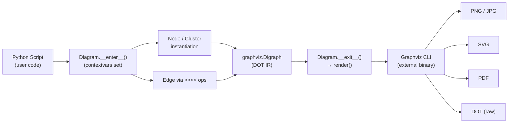
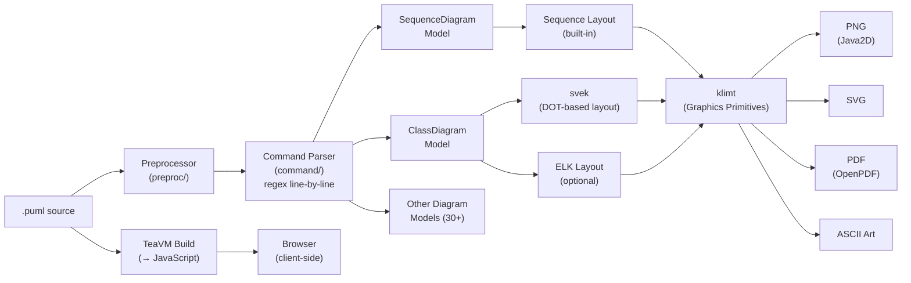
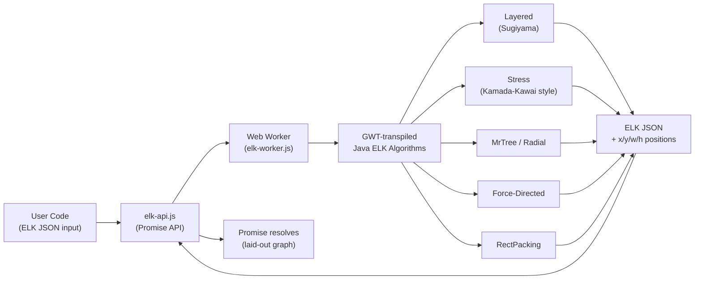

# Weekly Diagram Tooling Scan — 2026-06-12

> Scout: diagram-as-code & visual tooling | Repos active trong 7 ngày qua

---

## Executive Summary

- **D2 (terrastruct/d2)** là repo kiến trúc đáng học nhất tuần này: pipeline Go 5-stage rõ ràng (AST → IR → Graph → Layout → Render), layout interface pluggable với function type đơn giản, và 5 render backend (SVG/ASCII/LaTeX/sketch/animation) cho thấy cách tách biệt concerns sạch nhất trong ecosystem.
- **elkjs** bất ngờ: không phải JS thuần mà là GWT transpile từ Java ELK — mang toàn bộ thuật toán Sugiyama (layered, barycentric crossing minimization, orthogonal routing) sang browser mà không viết lại; pattern này gợi ý cách tái dùng academic algorithm cho web.
- **PlantUML** và **mingrammer/diagrams** đều active trong 7 ngày, nhưng đi hai hướng ngược nhau về DSL design: PlantUML dùng line-based regex parser với diagram-type-specific models, còn diagrams dùng Python-as-DSL với operator overloading — cả hai đều có tradeoff rõ ràng đáng tham khảo cho kymostudio.

---

## Table of Contents

1. [mingrammer/diagrams](#1-mingrammerdiagrams)
2. [plantuml/plantuml](#2-plantumlplantuml)
3. [kieler/elkjs](#3-kielerelkjs)
4. [terrastruct/d2](#4-terrastruct-d2)

---

## 1. mingrammer/diagrams

### §1 — Quick Context

**Pitch:** Vẽ cloud architecture diagram bằng Python code thuần — không cần công cụ GUI, diagram thay đổi được track qua version control như code thường.

- **Tech stack:** Python 3.9+, Graphviz (external binary bắt buộc), `graphviz` Python wrapper, `contextvars` stdlib
- **Output:** PNG, JPG, SVG, PDF, DOT
- **Repo health:** 42,338 stars, ~150+ contributors, pushed 2026-06-09, CI có (GitHub Actions + pre-commit hooks), tests qua pytest
- **Distribution:** PyPI (`pip install diagrams`), poetry/pipenv support

---

### §2 — Architecture Deep-Dive

#### A. Component Inventory

- `Diagram` (`diagrams/__init__.py`) — root context manager, khởi tạo `graphviz.Digraph`, trigger render khi exit context
- `Cluster` (`diagrams/__init__.py`) — subgraph với depth-based color theming, nesting qua parent tracking
- `Node` (`diagrams/__init__.py`) — base class của mọi element, hỗ trợ icon loading và operator overloading
- `Edge` (`diagrams/__init__.py`) — connection giữa nodes, configurable direction và styling
- Provider modules (`diagrams/aws/`, `diagrams/gcp/`, `diagrams/azure/`, etc.) — extend `Node` với provider-specific icon paths
- `diagrams/base.py` — base classes bổ sung (không xác định nội dung chính xác do 404)
- `diagrams/c4/` — C4 model diagram support
- `diagrams/k8s/` — Kubernetes-specific nodes
- `diagrams/cli.py` — CLI entry point nhỏ

#### B. Pipeline / Control Flow (Happy Path)

1. User viết Python file: `with Diagram("My System", direction="LR") as d:`
2. `Diagram.__enter__` khởi tạo `graphviz.Digraph`, set `contextvars` global cho active diagram
3. Nodes/Clusters instantiate và tự-register vào active context qua `contextvars`
4. `node1 >> node2` gọi `__rshift__`, tạo `Edge`, add vào Digraph dưới dạng DOT edge string
5. Python `with` block kết thúc → `Diagram.__exit__` gọi `render()`
6. `render()` serializes Digraph thành `.dot` file, invoke Graphviz binary với output format
7. PNG/SVG/PDF xuất hiện, temp `.dot` file tự cleanup

#### C. Data Model / Intermediate Representation

- **IR = DOT language.** Không có graph model nội bộ riêng — `graphviz.Digraph` object IS the IR. Mỗi Node/Edge call trực tiếp append vào DOT string builder.
- **Mutable và accumulative:** mọi thứ được append khi instantiate, không có compile pass riêng.
- Không có "compile to lower IR" — pipeline thẳng Python → DOT → Graphviz binary.

#### D. Input Language Design

- **Parser approach:** Không có parser — Python source code IS the DSL. Operator overloading (`__rshift__`, `__lshift__`, `__sub__`) tạo syntax `node1 >> node2`.
- **Grammar:** Không có formal grammar — constraints enforcement qua Python type system.
- **Error reporting:** Python exceptions (TypeError khi misuse, AttributeError khi icon không tồn tại). Không có domain-specific error messages.

#### E. Layout Algorithm

- **Hoàn toàn delegate sang Graphviz.** User chọn direction (`TB`/`BT`/`LR`/`RL`) → Graphviz chọn layout algorithm (`dot` cho TB/LR, `neato` có thể config được).
- Edge routing: Straight lines với curves tùy theo Graphviz algorithm. Không có orthogonal routing native.
- Không có crossing minimization trong code Python — Graphviz tự xử lý.

#### F. Rendering / Output Strategy

- **Single backend:** Graphviz external binary. Nếu Graphviz chưa install → toàn bộ library không work.
- Output formats: PNG, JPG, SVG, PDF, DOT (raw) — tất cả qua Graphviz
- **Animation:** Không có
- **Pluggable emitter:** Không — hardcoded Graphviz call

#### G. Extensibility

- Thêm provider mới: tạo Python class extend `Node`, set `_icon` class attribute trỏ tới icon path, group vào subdirectory
- `diagrams/custom/` cho user-defined components
- Theme: 5 hardcoded color palettes ("neutral", "pastel", "blues", "greens", "orange") — không pluggable
- Không có plugin system

#### H. Dev Experience

- Không có CLI watch mode. User chạy `python diagram.py` để re-render.
- `diagrams.cli` cho một số utilities nhỏ
- VS Code Python extension xử lý IDE support (không phải LSP riêng)
- No browser preview

---

### §3 — Architecture Diagram



---

### §4 — Verdict

**Đáng học cho kymostudio:**
- **Python-as-DSL pattern** qua operator overloading: cách tiếp cận này cho phép diagram code hòa vào version control mà không cần parser riêng. Nếu kymo cần SDK/library tier thay vì standalone tool, đây là pattern tốt.
- **Context variable tracking** (contextvars) để implicit parent registration — sạch hơn là pass parent explicitly, áp dụng được cho tree-building DSL bất kỳ.

**Red flags:**
- Phụ thuộc hard vào Graphviz external binary: không có layout self-contained → không chạy được trên serverless/WASM.
- Không có IR riêng = không thể optimize, transform, hay validate diagram trước khi render.
- Theme system cứng nhắc: 5 color palettes không đủ cho production tooling.

**Open questions:** Tại sao không implement layout engine tự chứa thay vì Graphviz dependency? Có plan cho WASM port không?

**Verdict: GLANCE ONLY** — Python DSL pattern hay nhưng kiến trúc quá thin để study sâu. Đọc `__init__.py` một lần đủ rồi.

---

## 2. plantuml/plantuml

### §1 — Quick Context

**Pitch:** Generate 30+ loại diagram từ text description với DSL line-based, mature nhất trong ecosystem (2009), hỗ trợ từ UML đến Gantt đến mindmap.

- **Tech stack:** Java (99.3%), Gradle + Ant build, TeaVM cho browser build, Graphviz/svek/ELK cho layout
- **Output:** PNG, SVG, PDF, ASCII art, LaTeX, HTML image maps
- **Repo health:** 13,086 stars, active open source (605 open issues), pushed 2026-06-12 (hôm nay), CI có, tests extensive
- **Distribution:** JAR, Maven, npm (via TeaVM build), Docker, GitHub Actions integration

---

### §2 — Architecture Deep-Dive

#### A. Component Inventory

- `preproc` / `preproc2` (`net/sourceforge/plantuml/preproc/`) — preprocessor: resolve `!include`, `!define`, variables, loops trước khi parse
- `command` (`net/sourceforge/plantuml/command/`) — command/statement parser: mỗi line match với `UmlDiagramCommand` subclass
- `sequencediagram` (`net/sourceforge/plantuml/sequencediagram/`) — sequence diagram domain model và layout engine chuyên biệt
- `classdiagram` (`net/sourceforge/plantuml/classdiagram/`) — class diagram model
- `activitydiagram3` (`net/sourceforge/plantuml/activitydiagram3/`) — activity diagram (v3 rewrite)
- `svek` (`net/sourceforge/plantuml/svek/`) — SVG layout engine, wraps DOT format, core layout cho class/component diagrams
- `elk` (`net/sourceforge/plantuml/elk/`) — ELK integration alternative layout
- `klimt` (`net/sourceforge/plantuml/klimt/`) — graphics rendering abstraction (shapes, text, colors)
- `png`, `svg/parser`, `openpdf` — output backends
- `plantuml-mcp-js/` — Node.js MCP server (mới thêm)

#### B. Pipeline / Control Flow (Happy Path)

1. User chạy `java -jar plantuml.jar foo.puml`
2. `preproc` scan file: resolve `!include`, macro definitions, variable substitutions → normalized source text
3. `command` package scan từng line: match với list `UmlDiagramCommand` subclasses qua regex patterns
4. Diagram-type module (e.g., `SequenceDiagramFactory`) build domain-specific model từ matched commands
5. Layout engine được chọn: `svek` (default cho structural), `sequencediagram` layout (built-in cho sequence), `elk` (nếu configured)
6. `klimt` render graphic primitives (shapes, lines, text) với Java2D/Batik
7. Output backend (PNG/SVG/PDF) serialize kết quả ra file

#### C. Data Model / Intermediate Representation

- **Không có universal IR.** Mỗi diagram type có domain model riêng: `SequenceDiagram`, `ClassDiagram`, etc. — không interoperable.
- `svek` package dùng DOT intermediate format để giao tiếp với Graphviz-style layout.
- **Mutable:** models được build incrementally khi process commands.
- Không có "compile to lower IR" concept — mỗi diagram type có riêng rendering path.

#### D. Input Language Design

- **Parser approach:** Line-based custom parser. Mỗi diagram type đăng ký list `UmlDiagramCommand` objects với regex patterns. Input chia thành `@startuml`/`@enduml` blocks, từng line được match sequentially.
- **Grammar:** Không có published formal BNF/EBNF. Grammar là implicit trong class hierarchy của command objects.
- **Error reporting:** "Syntax Error" với line number, đôi khi có suggestion. Không có structured error recovery — fail fast on first error.

#### E. Layout Algorithm

- **svek:** Dùng Graphviz-compatible DOT format, tính toán layout nội bộ hoặc delegate ra Graphviz binary nếu có.
- **ELK plugin:** Full ELK integration cho hierarchical layout — orthogonal routing, port assignment.
- **Sequence diagrams:** Specialized time-ordered vertical layout (không dùng graph layout).
- **Gantt/Mindmap:** Specialized custom layout cho từng diagram type.
- Edge routing: Orthogonal (qua svek/ELK), straight (sequence).
- Crossing minimization: Delegate sang Graphviz DOT hoặc ELK — không implement độc lập.

#### F. Rendering / Output Strategy

- **Multiple backends:** PNG (Java2D/AWT), SVG (custom generator), PDF (OpenPDF), ASCII art, LaTeX, HTML image maps
- **TeaVM build:** Compile toàn bộ Java core sang JavaScript để run client-side trong browser — không cần server
- **Animation:** Không có native animation
- **Pattern:** Không pluggable theo formal interface — mỗi output format là hardcoded subclass

#### G. Extensibility

- Custom shapes/sprites qua `!define` preprocessor macros và included stdlib
- `skinparam` system cho extensive visual customization (colors, fonts, borders)
- Diagram type extension cần viết Java và register `UmlDiagramCommand` subclass
- Plugin system: không có formal plugin API, nhưng codebase modular theo diagram type
- Theme: `!theme` directive với built-in themes + custom theme files

#### H. Dev Experience

- CLI solid: `java -jar plantuml.jar @files` hay stdin piping
- VS Code extension có (jebbs.plantuml)
- No LSP — extension dùng external process call
- Watch mode: external (VS Code extension tự handle)
- MCP server mới: `plantuml-mcp-js` — cho phép AI agents generate diagrams

---

### §3 — Architecture Diagram



---

### §4 — Verdict

**Đáng học cho kymostudio:**
- **TeaVM pattern:** Compile Java → JavaScript để run diagram engine hoàn toàn client-side không cần server — cách tiếp cận đáng tham khảo nếu kymo cần offline capability hay web worker rendering.
- **skinparam system:** Extensive customization qua key-value parameters — cách thiết kế theming cho tooling với nhiều visual controls mà không cần expose raw CSS.
- **MCP server integration:** Thêm `plantuml-mcp-js` cho thấy trend diagram tools đang tích hợp với AI agents — relevant cho kymo roadmap.

**Red flags:**
- Không có universal IR → code 30+ diagram types bị fragmented, hard to maintain, impossible to add cross-diagram transforms.
- Line-based regex parser không có error recovery — một syntax error sẽ break toàn bộ diagram.
- Codebase Java heavy (99.3%) và monolithic — difficult entry point cho contributors.

**Open questions:** skinparam có ~500 parameters — là anti-pattern hay pragmatic API? TeaVM build có được maintain cập nhật cùng core không?

**Verdict: GLANCE ONLY** — mature và battle-tested nhưng kiến trúc legacy. TeaVM pattern đáng note, MCP integration mới đáng theo dõi cho roadmap.

---

## 3. kieler/elkjs

### §1 — Quick Context

**Pitch:** ELK (Eclipse Layout Kernel) — bộ layout algorithm research-grade từ academia (Kiel University) — transpile sang JavaScript qua GWT, đem Sugiyama hierarchical layout chuẩn công nghiệp lên browser.

- **Tech stack:** JavaScript (GWT-transpiled từ Java), Babel, Browserify, TypeScript typings
- **Output:** ELK JSON (positions/dimensions) — không render, chỉ compute layout
- **Repo health:** 2,617 stars, Kiel University org, pushed 2026-06-10, CI với Gradle + npm, tests có
- **Distribution:** npm (`elkjs`), CDN bundle, ES module

---

### §2 — Architecture Deep-Dive

#### A. Component Inventory

- `elk-api.js` (`src/js/elk-api.js`) — Promise-based public API: `layout()`, `knownLayoutAlgorithms()`, `knownLayoutOptions()`, `terminateWorker()`
- `elk-worker.js` — Core layout computation: GWT-transpiled Java ELK algorithms chạy trong Web Worker thread
- `elk.bundled.js` — Browserify bundle kết hợp cả hai file cho CDN usage
- `main.js` — Node.js entry point
- `src/java/org/eclipse/elk/` — Java source files bridge/adapter
- `src/java-additional/org/eclipse/elk/` — supplementary Java additions
- TypeScript typings (`typings/`) — `.d.ts` files cho TypeScript users

#### B. Pipeline / Control Flow (Happy Path)

1. User gọi `elk.layout(graph, { layoutOptions: {...} })`
2. `elk-api.js` serialize graph object thành JSON message
3. Message được post sang Web Worker thread (`elk-worker.js`)
4. Worker nhận message, dispatch sang đúng layout algorithm (layered/stress/mrtree/etc.)
5. GWT-compiled Java code run Sugiyama algorithm (hoặc algorithm được request): node layer assignment → crossing minimization → node positioning → edge routing
6. Worker post result message về main thread với positions/dimensions assigned cho mọi nodes và edges
7. Promise trong main thread resolves với laid-out graph JSON (ELK JSON format với `x`, `y`, `width`, `height` trên mỗi element)

#### C. Data Model / Intermediate Representation

- **Input/Output IR:** ELK JSON — `{ id, children: [{id, width, height, ...}], edges: [{id, sources, targets}] }`
- ELK JSON là flat-ish structure với optional `sections` cho edge bend points.
- **Immutable contract:** layout() nhận graph, trả về laid-out graph mới (không mutate in-place từ user perspective, dù Web Worker compute internally có state).
- Không có "lower IR" concept — thuật toán đọc thẳng ELK JSON, trả về ELK JSON với coordinates added.

#### D. Input Language Design

- **Không có DSL/parser** — input là JSON object (ELK JSON format).
- Layout configuration qua `layoutOptions` map với ~hundreds of documented options (e.g., `elk.algorithm`, `elk.direction`, `elk.spacing.nodeNode`).
- `knownLayoutOptions()` trả về full list các options có type và default values.
- Error reporting: Promise reject với error message từ Java exception (thường technical, không user-friendly).

#### E. Layout Algorithm

- **Layered (flagship):** Full Sugiyama framework
  - Phase 1: Cycle removal (DFS-based feedback arc set)
  - Phase 2: Layer assignment (longest path / Coffman-Graham)
  - Phase 3: Crossing minimization (barycentric heuristic qua multiple passes)
  - Phase 4: Node positioning (Brandes-Köpf algorithm)
  - Phase 5: Edge routing (orthogonal, polyline, spline options)
- **Stress:** Force-directed minimizing stress metric (Kamada-Kawai style)
- **MrTree:** Tree layout với configurable compaction
- **Radial:** Radial tree với angular sectors
- **Force:** Standard spring-electrical model
- **RectPacking:** Rectangle bin-packing cho non-graph layouts
- **Disco:** Handle disconnected components với layout per component
- Edge routing: **Orthogonal routing** (layered default), spline available, configurable via options
- Crossing minimization: **Barycentric heuristic** (Sugiyama) — không ILP, nhưng multiple pass với local search

#### F. Rendering / Output Strategy

- **Không có rendering.** elkjs là pure layout engine: "no rendering, styling, etc. is provided."
- Output là ELK JSON với coordinates added — consumer tự render (SVG, Canvas, etc.)
- Web Worker architecture cho non-blocking execution trong browser
- Node.js mode chạy synchronous (worker optional)

#### G. Extensibility

- Thêm algorithm: cần viết Java ELK extension + rebuild với GWT → không accessible cho JS developers thông thường
- `layoutOptions`: thousands of options cho fine-tuning existing algorithms
- `workerUrl`: configure CDN hosting cho worker bundle
- `workerFactory`: inject custom worker implementation
- Không có plugin system ở JS layer

#### H. Dev Experience

- Pure library, không có CLI
- TypeScript typings tốt — autocomplete cho `layoutOptions` keys
- Promise-based async API — clean modern interface
- Web Worker support tự động — non-blocking cho UI
- Interactive playground: eclipse.dev/elk
- No watch mode (library, không phải tool)

---

### §3 — Architecture Diagram



---

### §4 — Verdict

**Đáng học cho kymostudio:**
- **GWT transpile pattern:** Cách mang research-quality Java algorithms sang JS mà không rewrite — nếu kymo cần implement Sugiyama hoặc academic layout algorithm, học từ ELK Java source (https://github.com/eclipse/elk) trước khi tự implement.
- **Sugiyama layer-by-layer phases:** Crossing minimization qua barycentric heuristic + multiple passes — đây là state-of-art cho hierarchical diagrams. Phase 3 (crossing min) và Phase 5 (orthogonal edge routing) là hai phase phức tạp nhất và đáng nghiên cứu riêng.
- **Layout-only library contract:** Việc elkjs tách hoàn toàn layout khỏi rendering cho thấy đây là viable product — kymo có thể dùng elkjs làm layout engine backend thay vì implement riêng.
- **Promise-based Web Worker API:** Pattern clean cho offloading heavy computation — áp dụng được nếu kymo implement layout trong browser.

**Red flags:**
- GWT transpile → ~800KB bundle (`elk.bundled.js`) — nặng cho web app
- Thêm algorithm mới phải viết Java + GWT rebuild — barrier cao
- Error messages từ Java exceptions khó đọc

**Open questions:** Có plan native JS rewrite không? ELK layered algorithm có support port constraints (edge phải ra từ specific side of node) không — quan trọng cho nhiều enterprise diagram types.

**Verdict: STUDY DEEPER** — elkjs là production-ready layout engine cho hierarchical diagrams. Nếu kymo cần auto-layout cho flowcharts/sequence diagrams, dùng elkjs trực tiếp trước khi tự implement. Study Sugiyama phases trong ELK Java source.

---

## 4. terrastruct/d2

### §1 — Quick Context

**Pitch:** D2 là diagram scripting language hiện đại viết bằng Go — khác Mermaid ở chỗ có IR pipeline riêng, multiple pluggable layout engines (kể cả commercial TALA), và 5 render backends bao gồm animated SVG và sketch mode.

- **Tech stack:** Go (89.2%), JavaScript (d2js bridge, 5.1%), Shell (build scripts, 4.3%)
- **Output:** SVG (primary), PNG (via headless browser), PDF, ASCII, LaTeX (TikZ), animated SVG/GIF
- **Repo health:** 5,097 commits, 34 releases, v0.7.1 (Aug 2025), CI active, comprehensive test suite (e2etests + unit)
- **Distribution:** Binary (install.sh), `go install`, npm (`@terrastruct/d2`), Homebrew

---

### §2 — Architecture Deep-Dive

#### A. Component Inventory

- `d2parser` (`d2parser/`) — recursive descent parser, D2 source → `d2ast.Map`
- `d2ast` (`d2ast/`) — AST data structures: `Map`, `Key`, `Value`, `Edge`, `Import`
- `d2ir` (`d2ir/`) — IR layer: `compile.go` AST → IR, `d2ir.go` định nghĩa `Map`/`Field`/`Scalar` IR structures, `import.go` resolve imports, `pattern.go` pattern matching, `merge.go` merge diagrams
- `d2compiler` (`d2compiler/compile.go`) — orchestrator: gọi d2ir rồi build `d2graph.Graph`
- `d2graph` (`d2graph/`) — low-level graph model: `Graph`, `Object` (nodes), `Edge`; `seqdiagram.go` và `grid_diagram.go` cho specialized types; `layout.go` layout invocation; `serde.go` serialization
- `d2layouts` (`d2layouts/`) — layout interface + implementations: `d2dagrelayout/`, `d2elklayout/`, `d2sequence/`, `d2grid/`, `d2near/`, với `d2layouts.go` defining pluggable interface
- `d2renderers` (`d2renderers/`) — `d2svg/` (primary), `d2ascii/`, `d2latex/`, `d2sketch/`, `d2animate/`, `d2fonts/`
- `d2themes` (`d2themes/`) — theme definitions
- `d2lsp` (`d2lsp/`) — Language Server Protocol implementation
- `d2oracle` (`d2oracle/`) — programmatic diagram manipulation API
- `d2cli` (`d2cli/main.go`) — CLI entry point với watch mode, browser preview

#### B. Pipeline / Control Flow (Happy Path)

1. User chạy `d2 --layout=dagre --theme=0 --watch diagram.d2 out.svg`
2. `d2cli/main.go:Run()` parse flags (layout engine, theme, sketch mode, watch mode), đọc `.d2` file
3. `d2parser` parse D2 source bằng recursive descent → `d2ast.Map` (AST)
4. `d2ir.Compile()` transform AST → `d2ir.Map` (high-level IR): resolve imports, expand patterns, validate references
5. `d2compiler.Compile()` transform IR → `d2graph.Graph` (low-level IR): materialize edges, assign shape types
6. `d2layouts` invoke layout engine (`LayoutGraph(ctx, graph)`) — mutates graph in-place, assigns `x`, `y`, `width`, `height` tới mọi `Object` và `Edge` route points
7. `d2renderers/d2svg` traverse laid-out graph → SVG XML string; nếu sketch mode → d2sketch apply filter; nếu animation → d2animate bundle boards
8. Output written atomically tới filesystem; nếu watch mode → browser preview refresh qua local HTTP server

#### C. Data Model / Intermediate Representation

- **Hai-tầng IR:**
  - `d2ir.Map` — high-level IR, gần với source. Mutable nested structure (Map chứa Fields, Fields chứa Scalars hoặc Maps). Dùng để: import resolution, pattern expansion, macro substitution.
  - `d2graph.Graph` — low-level IR. Objects có position info. Edges fully materialized với route points. Đây là "compile to lower IR" pattern giống D2's TALA.
- **Mutability:** Layout engine mutates `d2graph.Graph` in-place (assign coordinates). Renderer chỉ đọc.
- **Separation of concerns rõ ràng:** IR tầng 1 (d2ir) xử lý language semantics, IR tầng 2 (d2graph) xử lý visual placement.

#### D. Input Language Design

- **Parser approach:** Recursive descent, Go thuần, không dùng external parser library
- **Grammar:** Không có published formal BNF/EBNF, nhưng syntax có cấu trúc rõ:
  - `x: "Label"` — node với label
  - `x -> y: "Edge label"` — directed connection
  - `x -> y -> z` — connection chain
  - `x: { shape: sql_table; ... }` — nested container với properties
  - `classes: { myclass: { ... } }` — reusable class definitions
  - `...@import_path` — import/spread
- **Error recovery:** Parser tiếp tục sau syntax errors, collect all errors for batch reporting (không fail-fast như PlantUML)
- Subcommand `d2 validate input.d2` cho standalone validation

#### E. Layout Algorithm

- **Dagre (default):** Dagre-d3 style hierarchical layout (Sugiyama-inspired, simplified)
- **ELK:** Full ELK layout qua `d2elklayout` package (wraps elkjs equivalent)
- **d2sequence:** Specialized sequence diagram layout (time-ordered vertical)
- **d2grid:** Grid/table layout cho explicit grid arrangements
- **d2near:** Proximity-based placement (node A `near: B` để đặt gần B)
- **TALA** (separate binary, commercial): Terrastruct's proprietary layout engine đặc biệt cho software architecture — install riêng, register qua plugin system
- **Layout interface:**
  ```go
  type LayoutGraph func(ctx context.Context, g *d2graph.Graph) error
  type RouteEdges func(ctx context.Context, g *d2graph.Graph, edges []*d2graph.Edge) error
  ```
  Cả hai mutate in-place. Đơn giản và đủ để plug in external engine.
- Edge routing: Orthogonal (ELK), straight + bezier (Dagre), không xác định trong d2near/d2grid

#### F. Rendering / Output Strategy

- **d2svg:** Custom SVG generator (không dùng Graphviz SVG), tạo semantic SVG với class names và IDs
- **d2sketch:** Post-process SVG với rough/hand-drawn filter — sketch aesthetic không cần redraw
- **d2animate:** Bundle nhiều "boards" thành animated SVG (SMIL) hoặc GIF — cho multi-step diagram animation
- **d2ascii:** Text-based ASCII art output
- **d2latex:** TikZ-based LaTeX output
- **Pluggable emitter:** Không có formal emitter interface, nhưng renderers là separate packages với consistent API
- PNG export: Via headless Playwright/browser (external)

#### G. Extensibility

- Layout engine pluggable qua `LayoutGraph` function type — minimal interface
- TALA là example của external layout plugin
- Themes: `d2themes` package, user-defined themes support
- Shapes: hardcoded set nhưng extensive (SQL tables, classes, sequences, standard shapes)
- Icons: URL-based icon import trong DSL (`icon: ./path/or/url`)
- `d2oracle` package cho programmatic diagram manipulation (diagram-as-API)

#### H. Dev Experience

- **Excellent CLI:** Extensive `--help`, subcommands rõ ràng (`layout`, `themes`, `fmt`, `validate`, `play`)
- **Watch mode + browser preview:** `d2 --watch` starts local HTTP server, live reload khi file thay đổi
- **LSP:** `d2lsp` cho VS Code và IDE integration (autocomplete, hover, go-to-definition)
- **`d2 fmt`:** DSL formatter tự động
- **`d2 play`:** Interactive playground
- TypeScript bridge qua `d2js` package

---

### §3 — Architecture Diagram

```mermaid
flowchart LR
    src[".d2 source"] --> parser["d2parser\n(recursive descent Go)"]
    parser --> ast["d2ast.Map\n(high-level AST)"]
    ast --> ir["d2ir.Compile()\nimport / pattern resolution"]
    ir --> irmap["d2ir.Map\n(high-level IR)"]
    irmap --> compiler["d2compiler.Compile()\nedge materialization"]
    compiler --> graph["d2graph.Graph\n(low-level IR)"]
    graph --> layouts["d2layouts\nLayoutGraph interface"]
    layouts --> dagre["d2dagrelayout\n(default)"]
    layouts --> elk["d2elklayout"]
    layouts --> seq["d2sequence"]
    layouts --> grid["d2grid"]
    layouts --> near["d2near"]
    dagre --> renderers["d2renderers"]
    elk --> renderers
    seq --> renderers
    grid --> renderers
    near --> renderers
    renderers --> d2svg["d2svg → SVG\n(primary)"]
    renderers --> d2sketch["d2sketch → Sketch SVG"]
    renderers --> d2animate["d2animate → Animated SVG/GIF"]
    renderers --> d2ascii["d2ascii → ASCII"]
    renderers --> d2latex["d2latex → LaTeX/TikZ"]
```

---

### §4 — Verdict

**Đáng học cho kymostudio:**
- **Hai-tầng IR pattern** (`d2ir.Map` → `d2graph.Graph`): Cách split high-level semantic IR với low-level positional IR cho phép transforms và validations ở đúng layer — đây là kiến trúc đáng implement trong kymo nếu cần extensible pipeline.
- **`LayoutGraph func(ctx, graph) error` interface:** Minimal function-type interface cho layout engine là elegant Go design — so với OOP heavy abstract class, function type đơn giản hơn nhiều và đủ pluggable.
- **d2sketch pattern:** Apply visual filter post-SVG để tạo sketch aesthetic mà không cần redraw — kymo có thể implement sketch/hand-drawn mode theo cách này.
- **d2animate multi-board:** Bundling nhiều diagram states thành animated SVG — technique để tạo diagram animation từ static frames.
- **`d2near` layout:** Proximity constraint-based placement (`near: node_id`) là user-friendly alternative cho force-directed — pattern đáng implement trong kymo's layout system.

**Red flags:**
- TALA (tốt nhất cho software architecture diagrams) là proprietary binary — lock-in cho best layout.
- PNG export phụ thuộc Playwright/headless browser — heavy dependency cho server-side rendering.
- Không có grammar specification published — hard để implement alternative parser hoặc syntax highlighting without reading Go source.

**Open questions:** `d2oracle` (programmatic manipulation API) có mature không? Watch mode's local HTTP server có hỗ trợ collaborative editing chưa? TALA có kế hoạch open source không?

**Verdict: STUDY DEEPER** — D2 là reference implementation đáng nhất trong ecosystem hiện tại. Đọc `d2ir/`, `d2compiler/compile.go`, `d2layouts/d2layouts.go`, và `d2renderers/d2svg/` theo thứ tự đó.

---

*Generated: 2026-06-12 | Branch: `claude/adoring-wozniak-q3ltuh` | Scout: weekly-diagram-tooling*
