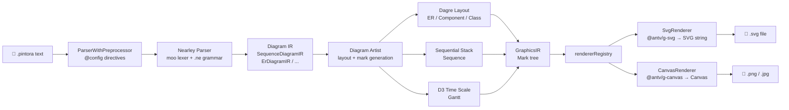
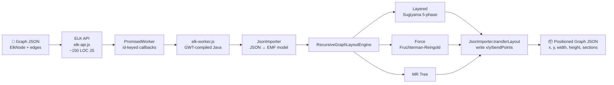
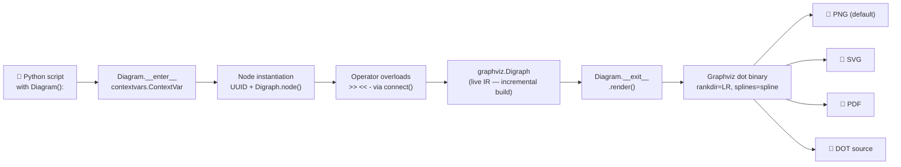
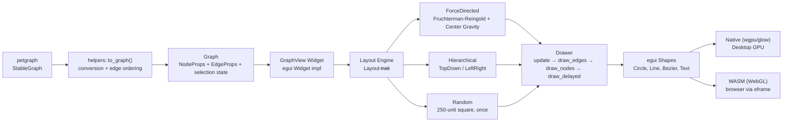

# Weekly Diagram Tooling Scan — 2026-06-13

> Scout: diagram-as-code, visual tooling, layout algorithm  
> Nguồn: GitHub topic search + ecosystem monitoring  
> Kỳ: 7 ngày qua (2026-06-06 → 2026-06-13)

---

## Executive Summary

- **Pintora** (`hikerpig/pintora`) là repo có kiến trúc đáng học nhất tuần này: hệ thống plugin chuẩn hóa qua `IDiagram` interface + Nearley grammar cho từng diagram type, cho phép bên thứ ba đăng ký diagram mới mà không chạm core — pattern này trực tiếp áp dụng được cho kymostudio nếu muốn có extensible diagram engine.
- **ELKjs** (`kieler/elkjs`) là gold mine về layout: Sugiyama 5-phase pipeline (cycle-break → layer-assign → crossing-minimize → node-place → edge-route) với hơn 600 layout options được expose qua JSON — đặc biệt valuable nếu kymo cần hierarchical/orthogonal routing chất lượng cao.
- **mingrammer/diagrams** chứng minh "Python làm DSL" hoạt động cực kỳ tốt ở scale 42k stars — pattern context manager + operator overload giúp user không phải học cú pháp mới; nhưng trade-off là lock-in vào host language và Graphviz binary dependency.

---

## Table of Contents

1. [hikerpig/pintora](#1-hikerpigpintora) — TypeScript extensible text-to-diagram, browser + Node.js
2. [kieler/elkjs](#2-kielerелкjs) — ELK layout engine (Sugiyama + force-directed), JavaScript wrapper
3. [mingrammer/diagrams](#3-mingrammerdiagrams) — Python DSL cho cloud architecture diagram
4. [blitzarx1/egui_graphs](#4-blitzarx1egui_graphs) — Rust/WASM interactive graph visualization

---

## 1. hikerpig/pintora

### §1 — Quick Context

**Pitch:** Thư viện text-to-diagram extensible chạy cả browser lẫn Node.js — khác Mermaid ở chỗ cho phép bên thứ ba đăng ký diagram type mới qua plugin API chuẩn hóa.

- **Tech stack:** TypeScript, Nearley PEG parser + moo lexer, `@antv/g-svg` / `@antv/g-canvas`, `@pintora/dagre` (fork of dagrejs), pnpm monorepo + Turbo 2.x build
- **Output formats:** SVG, Canvas, PNG, JPG (qua jsdom + node-canvas trong CLI)
- **Repo health:** 1,282 ★, 37 forks, active (last push 2026-06-13), Jest 30 test suite, ESLint 10, Husky pre-commit hooks, CI present. MIT license.
- **Distribution:** npm (9 packages riêng), browser ESM + UMD bundle, WinterCG/edge runtime target, VS Code extension, Web Components wrapper (pintora-stencil)

---

### §2 — Architecture Deep-Dive

#### A. Component Inventory

| Module | Path | Vai trò |
|---|---|---|
| `@pintora/core` | `packages/pintora-core/src/` | Kernel: `parseAndDraw()`, `diagramRegistry`, `configApi`, `themeRegistry`, `symbolRegistry`. Định nghĩa tất cả shared interface. |
| `@pintora/diagrams` | `packages/pintora-diagrams/src/` | 8 built-in diagram implementations: Sequence, ER, Component, Activity, MindMap, Gantt, DOT, Class. Mỗi cái là một `IDiagram` object. |
| `@pintora/renderer` | `packages/pintora-renderer/src/` | `SvgRenderer` + `CanvasRenderer` extends `BaseRenderer`; `rendererRegistry` để select backend. |
| `@pintora/standalone` | `packages/pintora-standalone/` | Browser/Node integration bundle; `renderTo()`, `initBrowser()`, `renderContentOf()`. Rolldown bundler. |
| `@pintora/cli` | `packages/pintora-cli/` | Binary `pintora`; yargs CLI, jsdom + `canvas` package, subprocess isolation mode. |
| `development-kit` | `packages/development-kit/` | Plugin helper — `compileGrammar()` cho Nearley grammar authors. |
| `pintora-target-wintercg` | `packages/pintora-target-wintercg/` | Edge runtime (Cloudflare Workers, Deno Deploy) target. |

#### B. Pipeline / Control Flow

1. **User chạy** `pintora render foo.pintora -o out.svg` — CLI (yargs) parse args, gọi `renderInSubprocess` hoặc `renderInCurrentProcess`.
2. **Entry point** gọi `@pintora/standalone` → `@pintora/core`'s `parseAndDraw(text, drawOptions)`.
3. **Diagram detection:** `diagramRegistry.detectDiagram(text)` test từng `IDiagram.pattern` regex. Match → pick diagram type.
4. **Parse:** `ParserWithPreprocessor` xử lý `@config` directives → Nearley parser + moo lexer parse cú pháp diagram-specific → populate stateful `db` module → return **Diagram IR** (e.g. `SequenceDiagramIR`, `ErDiagramIR`).
5. **Layout + Artist:** `diagram.artist(IR, options)` chạy layout algorithm phù hợp, tính toán tọa độ → produce **GraphicsIR** (cây `Mark` objects: rect, circle, line, text, path, group).
6. **Render:** `rendererRegistry` chọn `SvgRenderer` hoặc `CanvasRenderer`; `BaseRenderer.renderGCanvas()` traverse mark tree → tạo `@antv/g-svg` / `@antv/g-canvas` shapes → output SVG string hoặc Canvas element.
7. **Output:** CLI write SVG string to file; PNG/JPG qua `canvas` package Buffer.

#### C. Data Model / IR

**Two-stage IR pipeline:**

- **Stage 1 — Diagram IR (domain-specific):** Mỗi diagram type có IR riêng. `SequenceDiagramIR` chứa actors, messages, loops, activations. `ErDiagramIR` chứa entities với attributes (type, name, key, comment), relationships với cardinality. Tất cả extend `BaseDiagramIR`.
- **Stage 2 — GraphicsIR:** Scene-graph cây `Mark` objects — `group`, `rect`, `circle`, `line`, `path`, `text`, `symbol`. Marks mang transformation matrices (`@antv/matrix-util`), style attributes, CSS class strings. **Mutable** trong quá trình artist xây dựng, **frozen** khi truyền vào renderer.

#### D. Input Language Design

- **Parser approach:** Nearley PEG-adjacent parser generator + moo lexer (dùng custom forks `@hikerpig/nearley`, `@hikerpig/moo`). Grammar files `.ne` được compile sang JS trong build step.
- **Grammar files có evidence:** `sequenceDiagram.ne` (lexer states: `main`, `line`, `configStatement`, `noteState`; productions cho participants, signals, loop/alt/par control flow, notes), `erDiagram.ne` (cardinality tokens: `|o`, `o{`, `}{`, `||`; relationship types identifying vs non-identifying).
- **Preprocessing:** `ParserWithPreprocessor` wrapper handle `@config` directives trước khi Nearley chạy — shared moo lexer state `configStatement`.
- **Error reporting:** Nearley cung cấp line/column information; không có custom error recovery nhưng `ParserWithPreprocessor` isolate config parse errors.

#### E. Layout Algorithm

**Ba strategy riêng biệt:**

1. **Dagre-based auto-layout** (ER, Component, MindMap, DOT, Class): `@pintora/dagre` + `@pintora/graphlib` (forks of dagrejs). `DagreWrapper` abstracts node/edge registration với callbacks. Config: `rankdir`, `nodesep` (80px ER / 30px MindMap), `edgesep`, `ranksep`, `splines`. Sau `doLayout()`, edge paths được generate từ point arrays Dagre compute (curved hoặc linear theo `splines` config).
2. **Incremental vertical stacking** (Sequence): Không dùng graph layout engine. Actors positioned horizontally theo max message widths. `verticalPos` counter tăng dần khi append messages, notes, loops. Actor spacing: `messageWidth + actorMargin - (actorWidth/2 + nextActorWidth/2)`.
3. **D3 time-scale layout** (Gantt): `d3-scale`'s `scaleTime()` map date domain sang pixel range. `LayerManager` tổ chức z-stacked layers. Tasks = rectangles; milestones = diamonds; critical tasks = red stroke.

#### F. Rendering / Output

Pluggable renderer system qua `rendererRegistry`. Hai built-in renderers:

- **SvgRenderer** (`packages/pintora-renderer/src/renderers/SvgRenderer.ts`): Dùng `@antv/g-svg`. Thêm HTML entity escaping cho text marks. Produce self-contained SVG strings không pollute global styles.
- **CanvasRenderer** (`src/renderers/CanvasRenderer.ts`): Dùng `@antv/g-canvas`. Chỉ override `getCanvasClass()`; toàn bộ traversal logic ở `BaseRenderer`.

`defaultRenderer` config key (default `'svg'`) select renderer. Third-party renderers có thể register vào `rendererRegistry`.

#### G. Extensibility

`diagramRegistry.registerDiagram(name, diagram)` — object `diagram` phải implement `IDiagram<IR, Conf>`:
- `pattern: RegExp` — detect diagram type từ raw text
- `parser: IDiagramParser<IR>` — text → domain IR
- `artist: IDiagramArtist<IR, Conf>` — IR → GraphicsIR
- `configKey: string` — namespace trong `PintoraConfig`
- `clear(): void` — reset parser state

Thêm theme qua `themeRegistry`, symbols qua `symbolRegistry`, custom renderers qua `rendererRegistry`. Package `development-kit` export `compileGrammar()` để plugin authors build Nearley grammars.

External integrations: VS Code extension (`pintora-vscode`), Gatsby remark plugin, Obsidian plugin, Web Components (`pintora-stencil`), Observable notebooks.

#### H. Dev Experience

- **CLI:** `pintora render foo.pintora -o out.svg`. Subprocess isolation mode cho production stability.
- **Browser:** `initBrowser()` auto-scan DOM cho `.pintora` class elements, render inline. Per-element config qua `data-*` attributes.
- **IDE:** VS Code extension với syntax highlighting + diagram preview.
- **WinterCG:** Edge runtime target (Cloudflare Workers, Deno Deploy).
- **Watch mode:** Không có — `compile:watch` là build-system watch, không phải diagram file watcher.
- **LSP:** Không có evidence.

---

### §3 — Architecture Diagram



---

### §4 — Verdict

**Điểm đáng học cho kymostudio:**
- **Plugin registry pattern** (`IDiagram` interface) là blueprint hoàn hảo cho kymo nếu muốn extensible diagram engine — cách isolate parser + artist + config per diagram type rất clean.
- **Two-stage IR** (domain IR → GraphicsIR mark tree) cho phép swap renderer mà không đụng layout logic — áp dụng được nếu kymo muốn support cả SVG và WebGL output.
- **Nearley + moo combo** cho grammar definition khá ergonomic — file `.ne` readable hơn ANTLR grammar với Nearley's EBNF-like syntax.

**Red flags:**
- `@hikerpig/nearley` và `@hikerpig/moo` là forks riêng — upstream sync risk nếu Nearley có bug fix quan trọng.
- Không có watch/hot-reload mode built-in — friction trong dev workflow.
- 39 open issues, một số old.

**Open questions:** Tại sao dùng `@antv/g` (AntV scene graph) thay vì write SVG DOM trực tiếp? Performance gain có đủ justify dependency weight không?

**Verdict: Study deeper** — plugin architecture và two-stage IR là reference implementation chất lượng cao.

---

## 2. kieler/elkjs

### §1 — Quick Context

**Pitch:** JavaScript adapter mỏng wrap Eclipse Layout Kernel (Java) biên dịch qua GWT — cung cấp Sugiyama hierarchical layout với hơn 600 options cho browser và Node.js, không render, chỉ tính toán tọa độ.

- **Tech stack:** JavaScript (API layer ~200 LOC), GWT-compiled Java core (`elk-worker.js` ~opaque), Gradle + Babel + Browserify, Web Worker / fake-worker pattern
- **Output:** Pure JSON — same input graph enriched với `x`, `y`, `width`, `height` trên nodes/ports/labels + `sections[].bendPoints[]` trên edges. Không render.
- **Repo health:** 2,617 ★, 117 forks, active org (KIELER / Kiel University), npm v0.12.0 (sync với ELK Java minor version), Mocha + Chai tests, Gitpod configuration. EPL-2.0 license.
- **Distribution:** npm `elkjs`, CDN, dùng bởi React Flow, Cytoscape.js, sprotty, LikeC4, Eclipse GLSP.

---

### §2 — Architecture Deep-Dive

#### A. Component Inventory

| File | Path | Vai trò |
|---|---|---|
| `ELK` class | `src/js/elk-api.js` | Public JS API — `layout()`, `knownLayoutOptions()`, `terminateWorker()`. ~150 LOC hand-written. |
| `PromisedWorker` | `src/js/elk-api.js` | Promise wrapper quanh Web Worker message passing. Assign numeric `id` per request, store resolver callbacks. |
| `ELKNode` | `src/js/main-node.js` | Node.js subclass — auto-resolve worker path, fake-worker fallback nếu không có `web-worker` package. |
| `elk-worker.js` | `lib/elk-worker.js` | **GWT-compiled Java.** Chứa `JsonImporter`, `RecursiveGraphLayoutEngine`, tất cả layout algorithms. Opaque. |
| `elk.bundled.js` | `lib/elk.bundled.js` | Browserify bundle API + worker cho `<script>` tag. |
| TypeScript types | `typings/elk-api.d.ts` | `ElkNode`, `ElkExtendedEdge`, `ElkPort`, `ElkLabel`, `ELK`, generic `layout<T extends ElkNode>()`. |
| `ElkJs.java` | `src/java/org/eclipse/elk/js/ElkJs.java` | GWT `@EntryPoint` — Java message handler dispatch `cmd: 'layout'` → ELK core. |

#### B. Pipeline / Control Flow

1. **User tạo instance:** `const elk = new ELK({ workerUrl: '/elk-worker.js' })` — constructor gửi `{ cmd: 'register', algorithms: [...] }` tới worker.
2. **User gọi:** `const result = await elk.layout(graph, { layoutOptions })`.
3. **`ELK.layout()`** delegate tới `PromisedWorker.postMessage()`: assign `id`, store resolver, gọi `worker.postMessage({ cmd: 'layout', graph, id, layoutOptions })`, return Promise.
4. **Worker nhận message:** `ElkJs.java` switch-case trên `cmd === 'layout'` → `JsonImporter.transform(graph)` convert JSON sang EMF model → apply layoutOptions → `RecursiveGraphLayoutEngine.layout(elkGraph)`.
5. **Layout engine dispatch** tới `ILayoutAlgorithm` được chọn qua `elk.algorithm` property (mặc định `layered`). Algorithm chạy 5 phase (xem §E).
6. **`JsonImporter.transferLayout()`** write `x`, `y`, `width`, `height`, `bendPoints` trở lại JSON object ban đầu.
7. **Worker postMessage** result về: `{ id, data: graph }`.
8. **`PromisedWorker.receive()`** lookup resolver theo `id` → `resolve(graph)` (wrapped trong `setTimeout(0)` tránh re-entrancy).

#### C. Data Model / IR

Internal representation là **ELK Graph EMF model** (Java, compiled away trong `elk-worker.js`). External API chỉ expose JSON.

**JSON schema (TypeScript interface):**
```typescript
// Input & output — cùng object, ELK populate in-place
interface ElkNode extends ElkShape {
  id: string
  children?: ElkNode[]     // hierarchical — graph + node là same type
  ports?: ElkPort[]
  edges?: ElkExtendedEdge[]  // edges owned by node (lowest common ancestor rule)
}
interface ElkExtendedEdge {
  id: string; sources: string[]; targets: string[]  // supports hyperedges
  sections?: ElkEdgeSection[]  // populated ON OUTPUT
}
interface ElkEdgeSection {
  startPoint: ElkPoint; endPoint: ElkPoint; bendPoints?: ElkPoint[]
}
```

**Thiết kế đáng chú ý:** `ElkNode` vừa là graph root vừa là node — hierarchical graphs được encode naturally. Edges được đặt trên node là lowest common ancestor của endpoints → cho phép cross-hierarchy edges.

#### D. Input Language Design

Không có text DSL. Input là **JSON thuần**. Tất cả layout behavior được configure qua `layoutOptions` dict với string keys/values:

```json
{
  "id": "root",
  "layoutOptions": { "elk.algorithm": "layered", "elk.direction": "RIGHT" },
  "children": [
    { "id": "n1", "width": 30, "height": 30 },
    { "id": "n2", "width": 30, "height": 30 }
  ],
  "edges": [{ "id": "e1", "sources": ["n1"], "targets": ["n2"] }]
}
```

Tất cả values là strings, kể cả numeric (e.g. `"elk.spacing.nodeNode": "20"`). `elk.knownLayoutOptions()` return full list runtime.

#### E. Layout Algorithm

**Algorithms trong elkjs (configure qua `elk.algorithm`):**

| Algorithm | Type | Ghi chú |
|---|---|---|
| `layered` | Sugiyama hierarchical | **Default.** 5-phase pipeline. |
| `force` | Force-directed (FR / Eades) | General graphs. |
| `stress` | Stress minimization | Tốt cho graph aesthetics. |
| `mrtree` | Tree-based | Strict tree topologies. |
| `radial` | Radial/circular | Root-to-leaves. |
| `rectpacking` | Rectangle packing | Non-graph layouts. |

**Layered Algorithm — 5 phases (Sugiyama et al. 1981):**

1. **Cycle Breaking:** Reverse edges để eliminate directed cycles. Strategy: `GREEDY`, `DEPTH_FIRST`, `INTERACTIVE`, `MODEL_ORDER`.
2. **Layer Assignment:** Assign nodes vào layers. Strategy: `NETWORK_SIMPLEX`, `LONGEST_PATH`, `COFFMAN_GRAHAM`, `MIN_WIDTH`.
3. **Crossing Minimization:** Reorder nodes trong layers để giảm edge crossings. Strategy: `LAYER_SWEEP` (barycenter/median heuristics + greedy switch), `INTERACTIVE`.
4. **Node Placement:** Compute concrete x/y. Strategy: `NETWORK_SIMPLEX`, `BRANDES_KOEPF`, `LINEAR_SEGMENTS`.
5. **Edge Routing:** Compute bend points. Style: `ORTHOGONAL` (default), `POLYLINE`, `SPLINES`.

**Key options expose:** `elk.edgeRouting`, `elk.portConstraints` (`FREE`, `FIXED_SIDE`, `FIXED_ORDER`, `FIXED_POS`), `elk.portAlignment`, `elk.nodeLabels.placement`, `elk.hierarchyHandling`. Tổng cộng >600 options.

#### F. Rendering / Output

**ELK không render.** Explicitly stated trong README. Output là positioned graph JSON:
- Mọi `ElkNode`: `x`, `y`, `width`, `height` populated
- Mọi `ElkPort`: `x`, `y`, `width`, `height` (relative to parent)
- Mọi `ElkExtendedEdge`: `sections[]` với `startPoint`, `endPoint`, `bendPoints[]`

Rendering phải do consuming app tự làm. Known integrations: React Flow (`@reactflow/elk`), Cytoscape.js (`cytoscape-elk`), sprotty, Eclipse GLSP, LikeC4.

#### G. Extensibility

**JavaScript level:** `workerFactory` option cho full control worker instantiation (webpack/Vite integration). `algorithms` array trong constructor chọn subset algorithms để register.

**Algorithm level:** Cần sửa Java source (`AbstractLayoutProvider` subclass + `.melk` metadata file) + recompile GWT. Không có JS-level plugin API cho custom algorithms.

#### H. Dev Experience

- **Playground:** `elklive` (elklive.informatik.uni-kiel.de) — write ELKT text DSL hoặc JSON, xem layout interactive.
- **Web Worker:** First-class. Browser dùng real Worker thread. Node.js fallback `fake-worker` (synchronous in-process).
- **TypeScript:** Full — generic `layout<T extends ElkNode>()` preserves caller type.
- **Logging:** `{ logging: true }` trong layout options → attach ELK internal log tree vào result.
- **WASM:** Không có — dùng GWT-compiled JS, không phải WASM.

---

### §3 — Architecture Diagram



---

### §4 — Verdict

**Điểm đáng học cho kymostudio:**
- **Sugiyama 5-phase pipeline** là blueprint canonical cho hierarchical diagram layout — nếu kymo muốn implement auto-layout chất lượng cao, đây là reference paper implementation đáng đọc (Sugiyama 1981 + ELK source Java).
- **JSON schema design** của ELK rất well-thought: `ElkNode` vừa là graph root vừa là node, edge containment rule (lowest common ancestor) giải quyết elegantly vấn đề cross-hierarchy edges — pattern này áp dụng được cho kymo's data model.
- **Orthogonal edge routing** trong phase 5 là technique đáng study nếu kymo muốn route edges đẹp như draw.io.
- **PromisedWorker pattern** (id-keyed callbacks qua Web Worker) là pattern chuẩn để offload heavy layout computation khỏi main thread — copy trực tiếp vào kymo nếu layout nặng.

**Red flags:**
- GWT-compiled Java core là black box — không debug được JS level. EPL-2.0 license có điều khoản copyleft phức tạp hơn MIT.
- Build chain phức tạp (Gradle + GWT + Java 8-17 constraint).

**Open questions:** Liệu ELK's `layered` có hỗ trợ tốt cho mixed hierarchical + non-hierarchical graphs (kymo's use case) không, hay chỉ optimal cho pure DAG?

**Verdict: Study deeper** — đặc biệt Sugiyama paper + ELK's phase 3 (crossing minimization) và phase 5 (orthogonal routing).

---

## 3. mingrammer/diagrams

### §1 — Quick Context

**Pitch:** Python context manager + operator overload làm DSL để vẽ cloud architecture diagram qua Graphviz — user không học cú pháp mới, viết Python thuần, diagram sinh tự động.

- **Tech stack:** Python 3.9+, `graphviz` Python binding (≥0.13.2, <0.22), `jinja2` (template code-gen), Graphviz `dot` binary (system dependency), hatchling build
- **Output formats:** PNG (default), JPG, SVG, PDF, DOT source
- **Repo health:** 42,344 ★, 2,726 forks, mature (2020), pytest 8.3 + pylint 3.3, pre-commit hooks, black + isort formatting. MIT license.
- **Distribution:** PyPI `diagrams`, Jupyter support (`_repr_png_`), 18+ built-in cloud providers bundled

---

### §2 — Architecture Deep-Dive

#### A. Component Inventory

| Module | Path | Vai trò |
|---|---|---|
| Core | `diagrams/__init__.py` | **Toàn bộ core logic** — `Diagram`, `Cluster`, `Node`, `Edge`, `Group`. Manage `contextvars.ContextVar` cho active diagram/cluster. Không có `diagrams/core/` subdirectory. |
| CLI | `diagrams/cli.py` | `diagrams script.py` — `exec()` từng file (~30 LOC). Minimal. |
| AWS provider | `diagrams/aws/__init__.py` | `_AWS(Node)` base class; `_icon_dir = "resources/aws"`. |
| Custom node | `diagrams/custom/__init__.py` | `Custom(Node)` — user-supplied icon path, không cần bundled PNG. |
| Providers (×18) | `diagrams/aws/`, `diagrams/gcp/`, `diagrams/azure/`, `diagrams/k8s/`, ... | Mỗi provider follow pattern: `_<Provider>(Node)` base + sub-modules per service category. |
| Resources | `resources/aws/`, `resources/gcp/`, ... | Bundled PNG icons cho tất cả built-in nodes. |

#### B. Pipeline / Control Flow

1. **User viết Python script** import từ `diagrams` và provider packages (e.g., `from diagrams.aws.compute import EC2`).
2. **Enter Diagram context:** `with Diagram("title", direction="LR") as d:` → `__enter__` gọi `setdiagram(self)`, store instance vào `contextvars.ContextVar __diagram`.
3. **Node instantiation:** `ec2 = EC2("web server")` → `Node.__init__` gọi `getdiagram()`, lấy active diagram, gọi `diagram.node(id, label, **attrs)` → delegate tới `graphviz.Digraph.node(...)`. UUID hex làm node ID.
4. **Edge creation qua operators:** `ec2 >> rds` → `__rshift__` gọi `connect(other, Edge(forward=True))` → `diagram.dot.edge(src_id, dst_id, **edge.attrs)`. Edges viết **ngay lập tức** vào Digraph, không queue.
5. **Optional Cluster nesting:** `with Cluster("label"):` → `setcluster(self)`. On `__exit__`, `parent.subgraph(self.dot)` promote inner Digraph vào parent.
6. **`Diagram.__exit__`:** gọi `self.render()` → `self.dot.render(format=outformat, view=self.show)` → shell out tới `dot` binary.
7. **Graphviz write output** (e.g., `my_diagram.png`). Intermediate `.gv` file bị `os.remove()` ngay sau đó.
8. **`show=True`** (default): OS open generated image tự động.

#### C. Data Model / IR

**Không có IR riêng biệt.** Data model IS `graphviz.Digraph` — được build incremental.

```
Diagram     → wraps graphviz.Digraph (self.dot)
Cluster     → wraps child graphviz.Digraph, promoted via subgraph()
  Group = Cluster  (alias)
Node        → abstract base
  _AWS(Node) → _Compute(_AWS) → EC2, Lambda, ...
               _Storage(_AWS) → S3, EBS, ...
  _GCP(Node) → similar
  Custom(Node) → user-supplied icon_path
Edge        → transient parameter object (NOT stored in collection)
              compute graphviz 'dir' attr từ forward/reverse booleans at call time
```

**Cluster depth tracking:** `Cluster.depth = parent.depth + 1` → index vào `bgcolors[depth % len(bgcolors)]` để cycle màu theo nesting level (4-color palettes per theme).

#### D. Input Language Design

**Python IS the DSL** — không có parser, không có grammar file.

```python
# Context manager cho scope
with Diagram("Event Processing", direction="LR", outformat=["png", "svg"]):
    with Cluster("Processing"):
        workers = [EC2("worker") for _ in range(3)]

# Operator overloads cho edges
ELB("lb") >> [EC2("w1"), EC2("w2")]  # fan-out
S3("storage") << Lambda("fn")        # reverse arrow
EC2("a") - EC2("b")                  # undirected

# Edge với attributes
EC2("src") >> Edge(label="async", color="red", style="dashed") >> SQS("queue")
```

**`direction` parameter:** `"LR"` (default), `"TB"`, `"BT"`, `"RL"` → map sang Graphviz `rankdir`.  
**`curvestyle`:** `"spline"` (default), `"ortho"`, `"curved"`, `"polyline"` → map sang Graphviz `splines`.  
**Passthrough escape hatch:** `graph_attr`, `node_attr`, `edge_attr` dicts cho full Graphviz DOT attribute control.

#### E. Layout Algorithm

**Engine:** Graphviz `dot` binary (hierarchical/layered layout — ranked layout Sugiyama-based).

- Default direction: `LR` (left-to-right)
- Default spline: `spline`
- Node sizing: `fixedsize=true`, `width=1.4`, `height=1.4`. Multi-line labels: `height = 1.9 + 0.4 × label.count('\n')`
- Chỉ `dot` layout được expose — không có neato, fdp, sfdp, circo options.

#### F. Rendering / Output

Graphviz binary làm toàn bộ rendering. Python package chỉ là wrapper.

- **Formats:** PNG (default), JPG, SVG, PDF, DOT source
- **Multiple formats:** `outformat=["png", "svg"]` — render tất cả trong một lần
- **Jupyter:** `_repr_png_(self)` → `self.dot.pipe(format="png")` — inline rendering trong notebooks
- **Không có Pillow dependency** — tất cả image generation do Graphviz

#### G. Extensibility

**3-layer model:**
1. **Use built-in provider** — import từ 18+ packages.
2. **Custom node với bất kỳ PNG icon:** `Custom("RabbitMQ", "./icons/rabbitmq.png")` — override `_load_icon()` để trả về user path.
3. **Thêm provider package mới:** subclass `Node` + đặt PNG vào `resources/`. `jinja2` dependency suggest template-based code generation cho provider scaffolding.

`Edge` object accept `label`, `color`, `style`, và arbitrary Graphviz edge attrs. `Diagram(autolabel=True)` prepend class name vào label.

#### H. Dev Experience

- **CLI:** `diagrams diagram1.py diagram2.py` — `exec()` từng file. Không có watch mode.
- **Jupyter:** Excellent — `_repr_png_` cho inline preview.
- **`show=False`** cho server environments.
- **Python version:** 3.9+

---

### §3 — Architecture Diagram



---

### §4 — Verdict

**Điểm đáng học cho kymostudio:**
- **"Host language làm DSL"** pattern (Python context manager + operator overload) là lựa chọn thú vị nếu kymo target developer audience quen Python — zero learning curve, full IDE autocomplete, refactoring tools work out of the box. Đây là anti-thesis của Mermaid's text DSL.
- **Cluster depth-based color cycling** (`depth % len(bgcolors)`) là trick đơn giản nhưng hiệu quả cho visual nesting hierarchy — có thể borrow trực tiếp cho kymo's group/container styling.
- **`_repr_png_` pattern** cho Jupyter integration là minimal (3 lines) nhưng unlock một whole workflow — kymo nên có tương tự cho notebook environments.

**Red flags:**
- Lock-in vào **Graphviz binary** — system dependency làm deploy phức tạp (Docker, serverless). Không có pure-Python fallback.
- 385 open issues — nhiều feature requests cho providers mới, nhưng maintainer pace chậm.
- Nodes dùng `fixedsize=true` — Graphviz không auto-size theo content, phải calculate height manually theo số dòng label.

**Open questions:** Có thể swap Graphviz `dot` backend sang ELKjs không? (Bao giờ cũng có câu hỏi này với diagrams.)

**Verdict: Glance only** — pattern "Python làm DSL" đáng học về concept, nhưng architecture quá đơn giản (Graphviz delegation) để study deep. Chỉ relevant nếu kymo muốn build Python SDK.

---

## 4. blitzarx1/egui_graphs

### §1 — Quick Context

**Pitch:** egui widget Rust cho interactive graph visualization với layout Fruchterman-Reingold và Hierarchical — nổi bật vì compile được sang WASM, chạy trong browser qua WebGL mà không cần JS framework.

- **Tech stack:** Rust, egui 0.34.1, petgraph 0.8, eframe (wgpu/glow backend), wasm-bindgen, web-sys, Cargo workspace (3 crates)
- **Output:** Immediate-mode rendered graphics (egui Shapes → GPU). Không export SVG/PNG.
- **Repo health:** 682 ★, 73 forks, maintainer tự ghi nhận "not in active development — feel free to fork". v0.30.0. criterion benchmarks. MIT license.
- **Distribution:** crates.io `egui_graphs`. WASM live demo tại `blitzarx1.github.io/egui_graphs`.

---

### §2 — Architecture Deep-Dive

#### A. Component Inventory

**Cargo workspace — 3 crates:**

| Crate | Path | Vai trò |
|---|---|---|
| `egui_graphs` | `crates/egui_graphs/` | Core library — public widget |
| `demo-core` | `crates/demo-core/` | Shared demo logic, graph manipulation, metrics |
| `demo-web` | `crates/demo-web/` | WASM build target với `index.html` |

**Modules trong `crates/egui_graphs/src/`:**

| File | Vai trò |
|---|---|
| `graph.rs` | `Graph<N,E,Ty,Ix,Dn,De>` — wrapper quanh `StableGraph` |
| `graph_view.rs` | `GraphView` — egui `Widget` impl, drive layout + draw + interaction |
| `settings.rs` | `SettingsInteraction`, `SettingsNavigation`, `SettingsStyle` — builder-pattern config |
| `metadata.rs` | `MetadataFrame` (zoom/pan/bounds), `MetadataSync` (shared drag/hover ownership) |
| `helpers.rs` | `to_graph()`, `to_graph_custom()`, `add_node()`, `add_edge()`, `generate_random_graph()` |
| `elements/node.rs` | `Node<N,E,Ty,Ix,D>` + `NodeProps<N>` |
| `elements/edge.rs` | `Edge<N,E,Ty,Ix,Dn,De>` + `EdgeProps<E>` |
| `draw/displays.rs` | `DisplayNode` + `DisplayEdge` traits — **custom rendering extension points** |
| `draw/drawer.rs` | `Drawer` — orchestrate 4-phase render pipeline |
| `layouts/force_directed/implementations/fruchterman_reingold/core.rs` | FR algorithm + params |
| `layouts/hierarchical/layout.rs` | `Hierarchical` layout, `Orientation` enum |
| `layouts/random/layout.rs` | `Random` layout (fires once) |

#### B. Pipeline / Control Flow

1. **User build petgraph graph:** `StableGraph<MyN, MyE, Directed>`.
2. **Convert:** `let mut g = helpers::to_graph(&stable_graph)` hoặc `to_graph_custom(...)`.
3. **Choose layout:** `ForceDirected<FruchtermanReingold>`, `Hierarchical`, hoặc `Random`.
4. **Configure settings:** Builder pattern — `SettingsInteraction::new().with_dragging_enabled(true)`.
5. **Add widget vào egui frame:** `ui.add(GraphView::new(&mut graph, &si, &sn, &ss, &mut layout_state))`.
6. **GraphView drives layout:** Mỗi frame → `Layout::next()` → algorithm đọc/ghi `node.location: Pos2`.
7. **Drawer renders:** `update_nodes` → `draw_edges` (geometry từ updated node boundary points) → `draw_nodes` (non-selected) → `draw_delayed` (selected/dragged nodes on top — correct layering).
8. **Interaction processed:** Hover detection qua `is_inside()`, node drag (với `MetadataSync` ownership tracking), edge clicks, zoom (Ctrl+scroll), pan (middle-mouse).
9. **Events (optional):** Feature flag `events` → typed events (`PayloadNodeClick`, `PayloadNodeMove`, `PayloadZoom`) qua crossbeam channel (native) hoặc shared buffer (WASM).

#### C. Data Model / IR

**`Graph<N,E,Ty,Ix,Dn,De>`** — thin-but-enriched wrapper quanh `petgraph::stable_graph::StableGraph`.

- **Node:** `NodeProps<N>` (payload, label, selected, dragged, hovered, color, `location: Pos2`) + `display: D` implementing `DisplayNode`.
- **Edge:** `EdgeProps<E>` (payload, label, selected, `order: usize`) + `display: De` implementing `DisplayEdge`.
- **Edge ordering:** Parallel edges giữa cùng node pair được auto-assign `order: usize` non-negative để render offset (arc-style). Anti-parallel edges ở order 0 được detect và increment.
- **State:** Sets of selected/dragged/hovered node/edge indices + bounding rect tracked trên `Graph`.

#### D. Input Language Design

Không có text DSL — pure Rust builder/fluent API:

```rust
// From existing petgraph
let mut g = helpers::to_graph(&stable_graph);

// From scratch
let mut g = Graph::new();
let a = g.add_node(payload);
g.add_node_with_label_and_location(payload2, "label", Pos2::new(100., 200.));
g.add_edge(a, b, edge_payload);

// Widget
ui.add(GraphView::new(&mut g, &settings_i, &settings_n, &settings_s, &mut layout)
    .with_events(&event_sink));

// Pre-stabilize layout trước khi show
GraphView::<_, _, _, _, DefaultNodeShape, DefaultEdgeShape, _, FruchtermanReingold>
    ::fast_forward_until_stable(&mut g, &mut layout_state, 0.1);
```

#### E. Layout Algorithm

**Ba layout families implement `Layout<S>` trait:**

**1. Fruchterman-Reingold** (`layouts/force_directed/implementations/fruchterman_reingold/core.rs`):
- Repulsion (all node pairs): `force = c_repulse × k² / distance`
- Attraction (adjacent only): `force = c_attract × distance² / k`
- `k = sqrt(canvas_area / node_count) × k_scale`
- Position update: `pos += step × dt × damping`
- Params: `dt=0.05`, `damping=0.3`, `max_step=10.0`, `epsilon=1e-3`, `k_scale=1.0`, `c_attract=1.0`, `c_repulse=1.0`

**2. FR với Center Gravity** (`with_extras.rs`): Thêm `CenterGravity` force (`c_gravity=0.3`) kéo nodes về viewport center — tránh drift off-screen.

**3. Hierarchical** (`layouts/hierarchical/layout.rs`): Layered tree layout. Identify roots (nodes không có incoming edges), recursive top-down placement. Orientation: `TopDown` / `LeftRight`. Params: `row_dist`, `col_dist`, `center_parent`. Fires once (guarded bởi `triggered` flag).

**4. Random** (`layouts/random/layout.rs`): Place nodes tại random position trong 250-unit square. Fires once.

**Plugin architecture:** Custom algorithm implement `ForceAlgorithm` trait → wrap trong `ForceDirected<A>`.

#### F. Rendering / Output

- **Renderer:** egui immediate-mode. eframe backend: wgpu (native GPU) hoặc glow/WebGL (WASM).
- **WASM target:** `crates/demo-web/` là `cdylib`, build với `wasm-bindgen` + `web-sys`. Live demo WebGL tại `blitzarx1.github.io/egui_graphs`.
- **Drawing primitives:** egui `Shape` enum (circles, lines, bezier curves, text) → `Painter` mỗi frame. Không có retained scene graph.
- **Layering strategy:** Selected/dragged shapes deferred, painted last (`draw_delayed`) → luôn appear on top.
- **SVG/PNG export:** Không có — egui không natively export; không có helper nào trong codebase.
- **JSON import:** Demo support drag-drop JSON `{"nodes": [...], "edges": [[src, tgt], ...]}`.

#### G. Extensibility

**Custom node shapes** — implement `DisplayNode<N,E,Ty,Ix>` trait:
```rust
fn closest_boundary_point(&self, dir: Vec2) -> Pos2;  // edge attachment point
fn shapes(&mut self, ctx: &DrawContext) -> Vec<Shape>;  // return any egui shapes
fn is_inside(&self, pos: Pos2) -> bool;                // hit testing
```

**Custom edge shapes** — implement `DisplayEdge<N,E,Ty,Ix,D>` trait. **Stroke-only theming** (lightweight): `SettingsStyle::with_node_stroke_hook(fn(selected, dragged, color) -> Stroke)`.

**Custom layout:** Implement `ForceAlgorithm` trait (defines `step()`) → wrap trong `ForceDirected<A>`. Hoặc implement full `Layout<S>` trait.

#### H. Dev Experience

- **Interactivity:** Node drag-and-drop, click, double-click, hover; multi-select; zoom (Ctrl+scroll); pan (middle-mouse); fit-to-screen.
- **Multi-instance:** Multiple `GraphView` widgets trong cùng egui app, share state qua custom string ID + `MetadataSync`.
- **Demo keybindings:** `n/e/m/r` add nodes/edges, `Space` fit screen, `Tab` toggle sidebar, `d` debug overlay.
- **Performance:** `MetricsRecorder` track `step_ms` + `draw_ms` rolling 5-second averages. `criterion` benchmark cho FR layout.
- **Maintenance:** Maintainer tự ghi: "not in active development" — occasional bug fixes only.

---

### §3 — Architecture Diagram



---

### §4 — Verdict

**Điểm đáng học cho kymostudio:**
- **FR algorithm implementation** (`core.rs`) là clean, well-parameterized reference — 5 tunable params (dt, damping, max_step, epsilon, k_scale) đủ để port sang TypeScript/JS nếu kymo muốn force-directed layout.
- **`closest_boundary_point(dir: Vec2) -> Pos2`** trên `DisplayNode` trait là elegant abstraction cho edge attachment — thay vì hardcode edge endpoints vào node center, arrow tips tự tính boundary point theo hướng. Kymo nên dùng pattern này nếu implement non-circular nodes.
- **`draw_delayed` pattern** (paint selected/dragged nodes last) là trick đơn giản nhưng đúng cho interactive graph — ensures selected items always on top mà không cần z-index management phức tạp.
- **`MetricsRecorder`** pattern (rolling 5-second average cho step_ms/draw_ms) là minimal perf monitoring đáng borrow.

**Red flags:**
- **Maintainer đã declare project "not in active development"** — forking risk, no security patches.
- Không có SVG/PNG export — chỉ viable nếu kymo target interactive (not static output).
- egui ecosystem còn khá niche so với web-based rendering frameworks.

**Open questions:** Tại sao không có integrated export? WASM memory limits ảnh hưởng như thế nào khi graph size tăng lên vài nghìn nodes?

**Verdict: Glance only** — FR algorithm implementation (`core.rs`) đáng đọc cho reference, nhưng project có maintenance risk và thiếu export capability quá lớn cho kymo's use case. Study source code của layout algorithms, không cần adopt cả library.

---

*Generated by kymostudio weekly research scout. Scan date: 2026-06-13. Next scan: 2026-06-20.*
