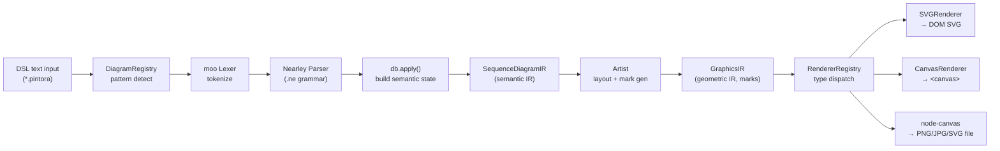
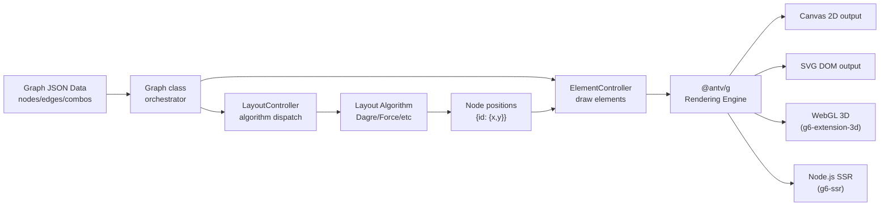
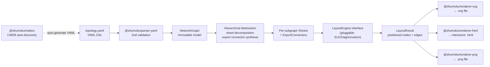

```mermaid
flowchart LR
    INPUT["ElkGraph JSON\n{children[], edges[],\nlayoutOptions}"]
    ELK["ELK class\n(main thread)"]
    WORKER["PromisedWorker\npostMessage bridge"]
    WTHREAD["ELKWorker\n(Web Worker thread)"]
    CYCLE["Cycle Removal\n(acyclic transform)"]
    LAYER["Layer Assignment\n(network-simplex)"]
    CROSS["Crossing Minimization\n(barycentric)"]
    PLACE["Node Placement\n(Brandes-Köpf)"]
    ROUTE["Edge Routing\n(orthogonal + ports)"]
    OUTPUT["Enriched ElkGraph\n{x,y on nodes,\nbendPoints on edges}"]

    INPUT --> ELK --> WORKER --> WTHREAD --> CYCLE --> LAYER --> CROSS --> PLACE --> ROUTE --> OUTPUT
```

# Weekly Diagram Tooling Scan — 2026-06-14

> Scout: Claude (claude-sonnet-4-6) | Domain: diagram-as-code, layout, visual DSL

---

## Executive Summary

- **Pintora** nổi bật với plugin system thực sự (Nearley grammar + IDiagram interface) — đây là reference tốt nhất để học cách thiết kế extensible diagram DSL trong TypeScript.
- **antvis/G6 v5** chứng minh rằng multi-backend rendering (Canvas/SVG/WebGL) cộng GPU-accelerated layout là viable cho production — nhưng complexity cao, phù hợp học về architecture hơn là fork.
- **kieler/elkjs** là pure layout engine đáng giá nhất cho kymostudio: API đơn giản, Sugiyama hierarchical layout battle-tested, chạy được cả trong Web Worker — có thể integrate trực tiếp.
- **shumoku** là case study về YAML-as-DSL với pluggable layout engine abstraction và cross-boundary connector synthesis — pattern hay cho network/infra diagram domain.

---

## Table of Contents

1. [hikerpig/pintora](#1-hikerpigpintora)
2. [antvis/G6 v5](#2-antvisg6-v5)
3. [kieler/elkjs](#3-kielerelkjs)
4. [konoe-akitoshi/shumoku](#4-konoe-akitoshishumoku)

---

## 1. hikerpig/pintora

**Repo:** https://github.com/hikerpig/pintora | **Pushed:** 2026-06-13

### §1 — Quick Context

**One-line pitch:** Thư viện TypeScript text-to-diagrams extensible thực sự — không phải fork Mermaid mà có plugin system + Nearley grammar cho phép third-party diagram type.

- **Tech stack:** TypeScript, Nearley (parser generator), moo (lexer), `@pintora/renderer` → SVG/Canvas
- **Output:** SVG (browser default), Canvas (browser), PNG/JPG/SVG (Node.js via `node-canvas`)
- **Repo health:** 1.2k stars, 1 maintainer, CI có, npm packages published (`@pintora/*`)
- **Distribution:** npm (`pintora-standalone` bundle), CDN-ready

### §2 — Architecture Deep-Dive

#### A. Component Inventory

- `Parser` (`packages/pintora-diagrams/src/sequence/parser/sequenceDiagram.ne`) — Nearley grammar file (.ne), compiled bởi nearleyc tại build time
- `DiagramRegistry` (`packages/pintora-core/src/diagram-registry.ts`) — Registry pattern, lưu `Map<string, IDiagram>`, detect diagram type bằng RegExp pattern
- `SequenceDiagramIR` (`packages/pintora-diagrams/src/sequence/index.ts`) — Typed TypeScript interface, intermediate representation sau parse
- `Artist` (`packages/pintora-diagrams/src/sequence/artist.ts`) — Layout + mark generation, tính toán positions cho actors, messages, loops
- `RendererRegistry` (`packages/pintora-renderer/src/renderers/index.ts`) — Registry chứa SVGRenderer và CanvasRenderer, fallback sang SVG nếu type không tồn tại
- `parseAndDraw` (`packages/pintora-core/src/index.ts`) — Public entry point, orchestrate toàn bộ pipeline

#### B. Pipeline / Control Flow

1. **User gọi** `pintora.renderTo(code, { container })` hoặc `parseAndDraw(code, options)`
2. **DiagramRegistry.detect(code)** — scan từng registered diagram's `pattern: RegExp`, return diagram name (default: `'sequenceDiagram'`)
3. **Parser.parse(code)** — Nearley parser tokenize bằng moo lexer → apply grammar rules → `postProcess` gọi `db.apply()` để build IR state
4. **Artist.draw(ir, conf)** — Tính `calculateActorMargins()`, iterate messages/loops/notes để generate **mark tree** (Rect, Line, Path, Text, Group) với tọa độ tuyệt đối
5. **RendererRegistry.makeRenderer(graphicsIR)** — Instantiate SVGRenderer (hoặc Canvas), render mark tree → DOM SVG element hoặc `<canvas>`
6. **Output xuất hiện** trong container hoặc được serialize thành SVG string / PNG buffer (Node.js)

#### C. Data Model / Intermediate Representation

- `SequenceDiagramIR`: TypeScript interface thuần, **immutable** sau khi parse. Chứa `actors[]`, `messages[]`, `loops[]`, `notes[]`.
- `GraphicsIR`: Output của Artist, chứa `mark` (root mark node) và `width/height`. Đây là "display IR" — separates layout concern khỏi rendering.
- Pattern: **2-stage IR** — `SequenceDiagramIR` (semantic) → `GraphicsIR` (geometric). Không có "compile to lower IR" step như D2's TALA.

#### D. Input Language Design

- **Parser approach:** Nearley parser generator với .ne grammar file (formal EBNF-like syntax), compiled tại build time thành JavaScript parser
- **Grammar:** Có formal Nearley grammar viết rõ ràng trong `sequenceDiagram.ne` — production rules dạng `signal -> actor signaltype actor textWithColon`
- **Lexer:** moo (separate lexer stage trước Nearley)
- **Error reporting:** `dedupeAmbigousResults: true` option, nhưng không có formal error recovery — parse fail là silent fallback
- **Extension:** Diagram mới implement `IDiagram<IR, Conf>` interface với `pattern`, `parser`, `artist`, `eventRecognizer`

#### E. Layout Algorithm

- **Approach:** Mỗi diagram type tự quản lý layout trong Artist — không có shared layout engine
- **Sequence diagram:** Sequential vertical positioning — actor horizontal positions calculated từ text widths + message widths; `startY` được bump dần xuống theo từng element
- **Edge routing:** Straight lines cho most messages; self-messages dùng cubic Path (curved)
- **Mindmap:** Không xác định (cần đọc `mindmap/artist.ts`)

#### F. Rendering / Output Strategy

- **SVGRenderer:** Default, tạo DOM SVG elements với class attributes cho CSS styling
- **CanvasRenderer:** Alternative backend, draw tới `<canvas>` context
- **Node.js:** `pintora-target-wintercg` và CLI dùng `node-canvas` để render PNG/JPG
- **Animation:** Không có native animation support
- **Pattern:** Pluggable emitter — RendererRegistry cho phép register custom renderer

#### G. Extensibility

- Diagram mới: implement `IDiagram` interface → `diagramRegistry.registerDiagram(name, impl)`
- Custom renderer: `RendererRegistry.register(name, RendererClass)`
- Theme: `themeRegistry` với `ITheme` interface, có `configApi` để override
- Symbol/shape: `symbolRegistry` cho custom shapes

#### H. Dev Experience

- CLI: `pintora-cli` package với `--watch` mode, `--output-format` flag
- Browser preview: Live preview tại https://pintorajs.vercel.app/demo/
- VS Code: Không thấy LSP hoặc VS Code extension
- Tests: Jest, có test fixtures

### §3 — Architecture Diagram



### §4 — Verdict

**Đáng học cho kymostudio:**
- **Nearley grammar approach** là clean hơn regex line-by-line nhiều — nếu kymo có DSL phức tạp, đây là reference tốt
- **2-stage IR pattern** (semantic IR → geometric IR) nên adopt: tách "what" và "where" rõ ràng
- **IDiagram interface** là minimal viable plugin contract — chỉ cần `pattern + parser + artist`; kymo có thể dùng exact pattern này
- **RendererRegistry** pluggable emitter — có thể học cách add WASM renderer sau

**Red flags:** 1 maintainer, 39 open issues. Nearley có learning curve. Không có formal error recovery.

**Open questions:** Layout của mindmap và ER diagram dùng gì? Có support animation/transition không?

**Verdict: Study deeper** — đặc biệt phần grammar + 2-stage IR.

---

## 2. antvis/G6 v5

**Repo:** https://github.com/antvis/G6 (branch `v5`) | **Pushed:** 2026-06-09

### §1 — Quick Context

**One-line pitch:** Framework TypeScript graph visualization hoàn chỉnh nhất hiện tại — Canvas/SVG/WebGL backends + GPU-accelerated layout + 3D extension trong cùng monorepo.

- **Tech stack:** TypeScript, `@antv/g` rendering engine, `@antv/layout` (layout algorithms), GPU/Rust acceleration cho force layouts
- **Output:** Canvas 2D, SVG DOM, WebGL (3D via extension), Node.js SSR
- **Repo health:** 12.1k stars, AntV org (Ant Group), CI/CD, npm published
- **Distribution:** npm (`@antv/g6`), CDN bundle, React integration package

### §2 — Architecture Deep-Dive

#### A. Component Inventory

- `Graph` (`packages/g6/src/runtime/graph.ts`) — Main public API class, orchestrate toàn bộ lifecycle
- `LayoutController` (`packages/g6/src/runtime/controller/layout.ts`) — Quản lý layout lifecycle, connect algorithm → element positions
- `ElementController` (`packages/g6/src/runtime/controller/element.ts`) — Quản lý draw/update lifecycle của nodes, edges, combos
- `BaseLayout` (`packages/g6/src/layouts/`) — Base class cho 17+ layout implementations
- `BasePlugin` (`packages/g6/src/plugins/`) — Base class cho extensions (Minimap, Toolbar, History, etc.)
- `BaseNode/BaseEdge/BaseCombo` (`packages/g6/src/elements/`) — Element base classes với shape composition
- `@antv/g` (external) — Rendering engine cung cấp Canvas/SVG/WebGL contexts

#### B. Pipeline / Control Flow

1. **User khởi tạo** `new Graph({ container, data, layout, plugins, behaviors })`
2. **Graph constructor** instantiate 8 controllers: batch, plugin, viewport, transform, element, animation, layout, behavior
3. **`graph.render()`** phát `BEFORE_RENDER` event → gọi `ElementController.draw()` để render initial elements
4. **LayoutController.execute()** — resolve layout algorithm từ config → gọi `algorithm.execute(graphData)` → nhận back node positions
5. **Element positions update** — positions từ layout kết quả được apply vào element state, trigger re-render
6. **Auto-fit** nếu configured (`fitView/fitCenter`) → `AFTER_RENDER` event
7. **Output:** Interactive graph xuất hiện trong container DOM

#### C. Data Model / Intermediate Representation

- **Input model:** `GraphData = { nodes: NodeData[], edges: EdgeData[], combos?: ComboData[] }` — plain JSON
- **Internal state:** Mutable graph model, updated qua `setData/addData/updateData/removeData`
- **Layout IR:** Layout algorithms nhận `LayoutMapping` (node positions) và return updated positions — **không có typed semantic IR**
- **No compile-to-lower-IR:** G6 không có concept như D2's TALA; layout algorithms consume graph data trực tiếp

#### D. Input Language Design

- **Không có textual DSL** — G6 là programmatic API, không phải diagram-as-code
- Input là JavaScript/TypeScript objects và JSON data
- Không relevant cho DSL design research

#### E. Layout Algorithm

- **17+ algorithms:** Dagre (Sugiyama hierarchical), Force, ForceAtlas2, Fruchterman (force-directed), Grid, Circular, Concentric, Radial, MDS, ComboCombined, D3Force, AntVDagre
- **Custom algorithms:** FishboneLayout, SnakeLayout (G6-specific)
- **Hierarchy:** compactBox, dendrogram, indented, mindmap (từ `@antv/hierarchy`)
- **GPU acceleration:** Force và ForceAtlas2 có GPU/Rust-powered variants cho large graphs
- **Edge routing:** Không xác định cụ thể — các edge types (Cubic, Polyline, Quadratic) suggest spline và orthogonal routing

#### F. Rendering / Output Strategy

- **Multi-backend:** Canvas 2D (default, tốt cho performance), SVG (tốt cho CSS styling), WebGL (3D, via `g6-extension-3d`)
- **SSR:** `g6-ssr` package render tới canvas trong Node.js environment
- **Animation:** Built-in animation system với easing, duration; element state transitions có animated
- **Pattern:** Pluggable renderer via `@antv/g` rendering engine abstraction — swap renderer không cần change element code

#### G. Extensibility

- **Plugins:** extend `BasePlugin`, register qua `plugins` config option
- **Custom nodes/edges:** extend `BaseNode/BaseEdge`, register shape type
- **Custom behaviors:** extend behavior base, handle events
- **Custom layouts:** implement layout interface, register với `layoutRegistry`
- **React nodes:** `g6-extension-react` cho phép React components làm node content

#### H. Dev Experience

- **No CLI** — library chỉ, không có standalone CLI
- **Storybook/docs:** Có demo site (g6.antv.antgroup.com)
- **No IDE integration:** Không thấy VS Code extension hay LSP
- **Hot reload:** Không applicable — library integrate vào app framework của user

### §3 — Architecture Diagram



### §4 — Verdict

**Đáng học cho kymostudio:**
- **FishboneLayout và SnakeLayout** là custom layout algorithms đặc thù — đọc implementation để học cách tự implement specialized layouts
- **ComboCombined layout** (hierarchical + force hybrid) có thể relevant cho nested subgraph layout trong kymo
- **GPU-accelerated force layout** pattern: đây là cách scale lên large graphs mà không block UI thread
- **Multi-backend via `@antv/g`** — architecture này cho phép add WebGL backend mà không rewrite element code; kymo nên consider similar abstraction

**Red flags:** v5 still có 329 open issues. API thay đổi nhiều từ v4. Dependency tree nặng (nhiều `@antv/*` packages).

**Open questions:** GPU layout có dùng được trong cloud SSR không? FishboneLayout xử lý cycle detection như thế nào?

**Verdict: Glance only** — reference tốt cho layout algorithm collection và multi-backend rendering architecture, nhưng không nên fork/depend vào.

---

## 3. kieler/elkjs

**Repo:** https://github.com/kieler/elkjs | **Pushed:** 2026-06-10

### §1 — Quick Context

**One-line pitch:** Port JavaScript của Eclipse Layout Kernel — cung cấp Sugiyama hierarchical layout battle-tested cho browser và Node.js qua Web Worker API.

- **Tech stack:** JavaScript (GWT/Browserify compiled từ Java/Kotlin source), Web Workers, Gradle build
- **Output:** Không render — pure layout engine, output là JSON với positions
- **Repo health:** 2.6k stars, Eclipse/Kieler org, CI, EPL-2.0 license, npm published
- **Distribution:** npm (`elkjs`), CDN bundle (`elk.bundled.js`)

### §2 — Architecture Deep-Dive

#### A. Component Inventory

- `ELK` (`src/js/elk-api.js`) — Public API class, wraps ELKWorker communication với Promise interface
- `PromisedWorker` (`src/js/elk-api.js`) — Internal wrapper convert Web Worker postMessage/onmessage thành Promise-based request/response
- `ELKWorker` (compiled Java → JS) — Worker chứa actual layout algorithms (Layered, Stress, Mrtree, Radial, Force, Disco, RectPacking, SporeOverlap)
- `main-node.js` (`src/js/main-node.js`) — Node.js variant, không dùng Web Worker (synchronous)
- `main-api.js` (`src/js/main-api.js`) — Browser variant entry point
- Java/Kotlin source (`src/java/`) — Original ELK implementation, compiled sang JS bởi Gradle + GWT

#### B. Pipeline / Control Flow

1. **User gọi** `const elk = new ELK({ workerUrl: '...', defaultLayoutOptions: {...} })`
2. **`elk.layout(graph)`** serialize graph object → `postMessage` tới ELKWorker
3. **ELKWorker** (trong Web Worker thread) nhận message → deserialize → chạy layout algorithm Java code (compiled JS)
4. **Layered algorithm** (Sugiyama-based): cycle removal → layer assignment → crossing minimization (barycentric/Barth-Mutzel) → node positioning → edge routing
5. **Worker** serialize result với node positions đã tính → `postMessage` trả về main thread
6. **`PromisedWorker`** resolve Promise với graph object chứa `x, y` trên mỗi node và `sections` (bend points) trên mỗi edge
7. **User nhận** enriched graph JSON, render bằng renderer của mình

#### C. Data Model / Intermediate Representation

- **Input/Output format:** Cùng một JSON schema — `ElkGraph = { id, children: ElkNode[], edges: ElkEdge[] }`, `ElkNode = { id, width, height, x?, y?, ports?, labels?, layoutOptions? }`
- **Mutable qua passes:** Graph object được mutate in-place bởi worker, positions được add vào existing objects
- **layoutOptions:** Mỗi node/edge có thể override options — per-element algorithm config
- **Không có lower IR:** ELK internal passes (5 phases của Layered algorithm) không exposed ra JS API

#### D. Input Language Design

- **Không có textual DSL** — elkjs là pure layout engine
- Input là JSON graph, không có DSL
- ELK có riêng ELKT (text format) trong Java ecosystem, nhưng không có trong elkjs

#### E. Layout Algorithm

- **Flagship: Layered (Sugiyama-based):**
  - Phase 1: Cycle removal (acyclic transformation)
  - Phase 2: Layer assignment (longest-path atau network-simplex)
  - Phase 3: Crossing minimization (barycentric heuristics, iterative improvement)
  - Phase 4: Node placement (Brandes-Köpf algorithm)
  - Phase 5: Edge routing (orthogonal với bend points, support ports)
- **Orthogonal edge routing:** Edges có explicit bend points (`sections[].bendPoints[]`) — không phải straight lines
- **Ports:** `ElkPort` cho phép explicit attachment points trên node borders — unique feature so với dagre
- **Other algorithms:** Stress (force-based với stress minimization), Mrtree (tree layout), Radial, Force, Disco (subgraph decomposition)

#### F. Rendering / Output Strategy

- **Không render** — pure compute. User tự render kết quả.
- Thích hợp integrate với bất kỳ renderer nào (SVG/Canvas/WebGL)
- **Animation:** Không có — user tự animate transition giữa 2 layout states

#### G. Extensibility

- **Custom algorithms:** Có plugin mechanism trong Java ELK, không xác định exposure qua elkjs
- **layoutOptions:** Extensive — hơn 100 options cho Layered algorithm (spacing, node placement strategy, edge routing mode, etc.)

#### H. Dev Experience

- **API:** Minimal và clean — `layout()`, `knownLayoutAlgorithms()`, `knownLayoutOptions()`
- **TypeScript:** Typings có trong `typings/` directory
- **Web Worker:** Optional nhưng recommended — tránh block UI cho large graphs
- **Build complexity:** Cần Java/Gradle để rebuild từ source (không phải pure JS build)

### §3 — Architecture Diagram



### §4 — Verdict

**Đáng học cho kymostudio:**
- **Integrate trực tiếp** — `npm install elkjs` + feed JSON graph → nhận back positions. Không cần hiểu internals để dùng được.
- **Port layout** (`ElkPort`) là killer feature: cho phép specify exact connection points trên node boundary — rất quan trọng cho technical diagrams (circuit diagrams, data flow)
- **Orthogonal routing với bend points** — nếu kymo cần clean orthogonal edges (không phải straight/curved), đây là best ready-made option
- **Web Worker API** là pattern tốt để copy: layout expensive computation nên luôn offload sang worker
- **`layoutOptions` per-element** — học cách design fine-grained per-node config mà không cần custom subclass

**Red flags:** Build từ source cần Java environment. 99 open issues. Versioning slow (0.12.0). Dependency trên GWT compiled output.

**Open questions:** Performance với >1000 nodes? Có incremental layout (chỉ re-layout subgraph thay đổi) không?

**Verdict: Study deeper + integrate** — elkjs là dependency kymo nên seriously consider nếu cần auto-layout.

---

## 4. konoe-akitoshi/shumoku

**Repo:** https://github.com/konoe-akitoshi/shumoku | **Pushed:** 2026-06-12

### §1 — Quick Context

**One-line pitch:** Network topology diagram-as-code từ YAML với 900+ vendor icons, NetBox auto-discovery, và pluggable layout engine — khác Mermaid/D2 ở chỗ tập trung vào infrastructure ops thay vì software architecture.

- **Tech stack:** TypeScript (70.7%), Svelte (23.5%), Bun runtime, Turbo monorepo, AGPL-3.0
- **Output:** SVG static, HTML interactive, PNG (via `@shumoku/renderer-png`)
- **Repo health:** 130 stars, 1 maintainer, CI, npm published (`shumoku`, `@shumoku/*`)
- **Distribution:** npm packages + web platform (SaaS)

### §2 — Architecture Deep-Dive

#### A. Component Inventory

- `@shumoku/parser-yaml` (`libs/@shumoku/parser-yaml`) — Zod-validated YAML parser, converts YAML → `NetworkGraph` model
- `@shumoku/core` (`libs/@shumoku/core/src/`) — Core models, layout engine interface, plugin-kit, themes, icon catalog, hierarchical abstraction
- `HierarchicalLayoutEngine` interface (`libs/@shumoku/core/src/hierarchical.ts`) — Pluggable interface: `layoutAsync(graph): Promise<LayoutResult>`
- `@shumoku/renderer-svg` (`libs/@shumoku/renderer-svg`) — Renders `LayoutResult` → SVG string
- `@shumoku/renderer-html` (`libs/@shumoku/renderer-html`) — Renders → interactive HTML với JS (hover, zoom, weathermap)
- `@shumoku/renderer-png` (`libs/@shumoku/renderer-png`) — PNG output via headless browser hoặc `resvg`
- `@shumoku/plugin-sdk` (`libs/@shumoku/plugin-sdk`) — SDK để build custom plugins
- `@shumoku/netbox` (`libs/@shumoku/netbox`) — NetBox API integration, auto-generate topology từ CMDB

#### B. Pipeline / Control Flow

1. **User viết** `topology.yaml` với `metadata`, `subgraphs`, `nodes`, `links` sections
2. **`@shumoku/parser-yaml`** đọc YAML → Zod schema validation → serialize thành `NetworkGraph` typed object
3. **Hierarchical abstraction** (`hierarchical.ts`) — transform graph: group nodes theo subgraphs, synthesize **export connector nodes** cho cross-boundary links, split thành "sheets" per subgraph
4. **Pluggable LayoutEngine.layoutAsync(sheet)** — mỗi sheet được layout độc lập bởi configured layout engine (ELK, Dagre, hoặc custom)
5. **Sheet merging** — kết quả layout của các sheets được combine, export connectors được resolve thành actual cross-boundary edge visual
6. **Renderer** nhận `LayoutResult` → generate SVG/HTML với positioned nodes, edges, vendor icons
7. **Output file** `.svg` / `.html` / `.png` xuất hiện

#### C. Data Model / Intermediate Representation

- **`NetworkGraph`** — Core model: `{ nodes: Node[], edges: Edge[], subgraphs: Subgraph[] }` — immutable sau parse
- **`LayoutResult`** — Enriched graph với positions: `{ nodes: PositionedNode[], edges: RoutedEdge[] }`
- **Sheet model** — Internal hierarchical abstraction: một subgraph = một sheet với local coordinate system
- **Export connectors** — Synthesized virtual nodes đại diện cho cross-boundary connections — clever pattern tránh layout engine cần biết về hierarchy

#### D. Input Language Design

- **Parser approach:** YAML (via standard YAML parser) + Zod schema validation — không phải custom grammar
- **YAML schema:**
  ```yaml
  metadata:
    name: "Production Network"
    settings:
      direction: TB
      theme: light
  subgraphs:
    - id: core
      label: "Core Layer"
      color: "#22c55e"
  nodes:
    - id: core-sw-01
      type: switch
      vendor: cisco
      model: "Catalyst 9300"
      subgraph: core
  links:
    - source: core-sw-01
      target: core-sw-02
      bandwidth: "40G"
  ```
- **Validation:** Zod schemas, runtime type checking — có descriptive error messages
- **Không có formal grammar** — YAML schema là "grammar"

#### E. Layout Algorithm

- **Layout-agnostic framework** — `LayoutEngine` interface là abstraction layer; không có built-in algorithm hardcoded
- **Hierarchical sheet decomposition** — key insight: mỗi subgraph layout independently, cross-boundary links được xử lý sau qua export connectors
- **Export connector pattern:** Cross-boundary link A→B (khác subgraph) được transform thành A→ExportConnector(A-side) và ImportConnector(B-side)→B; connector nodes được render như special "gateway" nodes
- **Edge routing:** Không xác định trong code, phụ thuộc vào configured LayoutEngine
- **Default engine:** Không xác định rõ (không thấy default engine shipped)

#### F. Rendering / Output Strategy

- **SVGRenderer:** Pure SVG output, self-contained, vendor icons embed
- **HTMLRenderer:** Interactive SVG-in-HTML với Svelte components cho hover, zoom, weathermap overlay
- **PNGRenderer:** Headless render
- **Animation:** HTMLRenderer có smooth transitions cho metric updates (weathermap)
- **Pattern:** Multiple emitters, không pluggable theo cách programmatic (hardcoded renderer implementations)

#### G. Extensibility

- **Plugin system:** `@shumoku/plugin-sdk` cho phép custom data source integrations (Zabbix, Prometheus hooks)
- **Custom layout engine:** Implement `LayoutEngine` interface
- **Custom icons:** Icon catalog có `@shumoku/catalog`
- **Theme:** Theme system trong core

#### H. Dev Experience

- **CLI:** `shumoku render topology.yaml --output diagram.svg` — có watch mode
- **IDE:** Không thấy VS Code extension, nhưng YAML với JSON schema có thể provide autocomplete
- **Docs:** docs/ directory với Mermaid diagrams về architecture
- **CLAUDE.md:** Có (repo-specific AI instructions!)

### §3 — Architecture Diagram



### §4 — Verdict

**Đáng học cho kymostudio:**
- **Export connector pattern** cho cross-boundary links — nếu kymo có subgraph/cluster concept, đây là elegant solution để layout mỗi cluster độc lập rồi stitch lại
- **`LayoutEngine` interface** chỉ cần một method `layoutAsync(graph): Promise<LayoutResult>` — minimal contract, nhưng allow swap bất kỳ algorithm nào; kymo nên copy pattern này
- **YAML schema với Zod validation** thay vì custom grammar — phù hợp cho ops/infra domain khi user đã biết YAML; DSL không nhất thiết phải custom parser
- **Sheet-based hierarchical decomposition** — scalable approach khi diagram có nested groups

**Red flags:** AGPL-3.0 license (phải open source code nếu distribute). 1 maintainer. 70 open issues nhiều. Default LayoutEngine không rõ ràng (có thể chưa ship).

**Open questions:** Default LayoutEngine là gì? Performance với 500+ nodes trên web platform? PNG renderer dùng headless browser hay `resvg`?

**Verdict: Study specific patterns** — export connector pattern và layout engine interface rất đáng học; không nên depend vào package trực tiếp vì AGPL và single maintainer.

---

*Generated by Claude Scout — 2026-06-14 | kymostudio weekly research*
