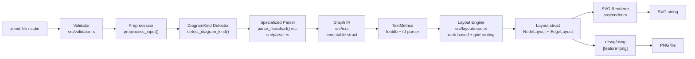
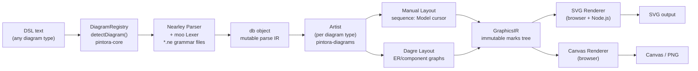
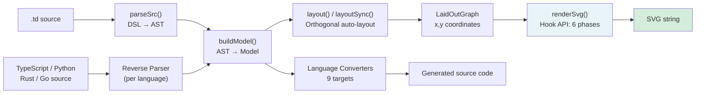
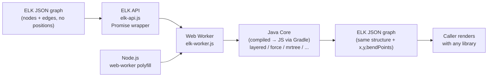

# Weekly Diagram Tooling Scan — 2026-06-15

## Executive Summary

- **Rust đang tái triển khai JavaScript diagram tools** với lý do chính đáng: `mermaid-rs-renderer` đạt 500–1400× speedup so với mermaid-cli bằng cách loại bỏ hoàn toàn browser dependency, mở ra khả năng render server-side cực nhanh cho kymo pipeline.
- **Minimalist domain-specific DSL đang nổi lên**: `typeDiagram` (tháng 4/2026) chứng minh rằng một DSL chỉ cần 3 keyword (`type`, `union`, `alias`) có thể tạo ra tool đủ mạnh — SVG auto-layout + codegen 9 ngôn ngữ + round-trip conversion, với hook API rendering rất áp dụng được cho kymo.
- **Pintora là blueprint tốt nhất để học plugin architecture**: Nearley grammar + `diagramRegistry` pattern + "artist" abstraction tách biệt layout khỏi rendering — pattern này trực tiếp applicable cho kymo nếu muốn support nhiều diagram type.

## Table of Contents

1. [mermaid-rs-renderer — Rust renderer không cần browser](#1-mermaid-rs-renderer)
2. [pintora — Text-to-diagram extensible với real plugin system](#2-pintora)
3. [typeDiagram — DSL siêu nhỏ cho data types, 9 codegen targets](#3-typediagram)
4. [elkjs — Eclipse Layout Kernel ported sang JavaScript](#4-elkjs)

---

## 1. mermaid-rs-renderer

**Repo:** `1jehuang/mermaid-rs-renderer` · Rust · 1 391★ · MIT
**Last push:** 2026-06-14 · **CI:** có (criterion benchmarks)
**Distribution:** crates.io, binary release

### §1 — Quick Context

Renderer Mermaid viết thuần Rust, **không cần Chromium/browser**, nhanh hơn mermaid-cli 500–1400× bằng cách implement pipeline parse→layout→SVG natively thay vì đi qua DOM.

**Tech stack:** Rust · `regex` · `serde_json` · `fontdb` / `ttf-parser` (text measurement) · `resvg`/`usvg` (PNG output, optional)
**Output:** SVG (native), PNG (feature flag)
**Stars:** 1 391 · **Contributors:** ~8 · **Releases:** có thường xuyên

### §2 — Architecture Deep-Dive

#### A. Component Inventory

| Module | File path | Vai trò |
|--------|-----------|---------|
| `Parser` | `src/parser.rs` | Chuyển Mermaid text → `Graph` IR |
| `IR` | `src/ir.rs` | Định nghĩa `Graph`, `Node`, `Edge`, `Subgraph`, `DiagramKind` |
| `Layout` | `src/layout/mod.rs` | Tính toán tọa độ x/y từ `Graph` → `Layout` |
| `Renderer` | `src/render.rs` | `Layout` → SVG string |
| `Config` | `src/config.rs` | `LayoutConfig`, `RenderConfig`, `RenderOptions` |
| `Theme` | `src/theme.rs` | Color schemes (mermaid_default, modern) |
| `TextMetrics` | `src/text_metrics.rs` | Pre-calculates text dimensions dùng `fontdb` |
| `CLI` | `src/main.rs` | `clap`-based CLI (feature-gated) |
| `Validator` | `src/validator.rs` | Validate init directives trước khi parse |

#### B. Pipeline / Control Flow

1. User chạy `mmdr -i diagram.mmd -o out.svg`
2. `cli::run()` reads input, calls `render_with_options(source, opts)`
3. `validator::validate_init_directives()` kiểm tra frontmatter hợp lệ
4. `parser::detect_diagram_kind()` scan dòng đầu tìm keyword ("flowchart", "sequenceDiagram", ...)
5. Specialized parser được gọi (`parse_flowchart()`, v.v.), sinh ra `Graph` (IR bất biến)
6. `layout::compute_layout(&graph, &layout_cfg)` tính toán vị trí → `Layout` struct
7. `render::render_svg(&graph, &layout, &render_cfg)` xuất SVG string
8. Nếu PNG feature enabled: `resvg` render SVG → PNG buffer → file

#### C. Data Model / IR

`Graph` là immutable struct được sinh ra từ parser và không bị modify sau đó:

```rust
struct Graph {
    kind: DiagramKind,
    direction: Direction,
    nodes: BTreeMap<String, Node>,
    edges: Vec<Edge>,
    subgraphs: Vec<Subgraph>,
    class_defs: HashMap<String, ClassDef>,
    node_styles: HashMap<String, String>,
    // ... per-diagram-type fields (sequence_data, state_data, etc.)
}
```

Không có "lower IR" hay multi-pass compile — `Graph` → `Layout` là một-bước.

#### D. Input Language Design

- **Parser approach:** Regex-based line-by-line, không có formal grammar.
- `preprocess_input()` strip comments, frontmatter, init directives trước
- `split_statements()` tách compound expressions
- Mỗi diagram type có hàm parser riêng biệt
- **Không có BNF/EBNF viết ra** — syntax được mã hóa implicitly trong regex patterns (ví dụ: `ARROW_RE` match `-->`, `<-->`, `-.->`  dùng char class `[-.=ox]*[-=]+[-.=ox]*`)
- Error handling: `anyhow::bail!()` với message descriptive, fail-fast

#### E. Layout Algorithm

- **Hierarchical rank-based layout** cho flowchart/class/ER/state
- `assign_positions()` nhóm nodes vào rank buckets, sắp xếp theo `node_order`, space theo `node_spacing` và `rank_spacing`
- **Grid-based edge routing:** `build_routing_grid()` + `route_edge_with_grid()` → polyline pathfinding
- `EdgeOccupancy` tracks channels đã dùng để tránh overlap
- Label-aware routing: route qua `preferred_label_center`, tránh `label_obstacles` corridors
- Final `label_placement` pass: collision avoidance cho edge labels
- Sequence, Pie, Gantt, Kanban: mỗi loại có dedicated layout function riêng

#### F. Rendering / Output Strategy

- **Backend:** SVG (primary, native) + PNG (optional, qua `resvg`)
- **Styling:** Chủ yếu **inline SVG attributes** (fill, stroke, font-family trực tiếp trên elements)
- Text measurement xảy ra ở **layout phase** (không phải render phase) — `textMetrics` pre-calculates width/height dùng `fontdb`/`ttf-parser`
- Node shapes: `shape_svg()` dispatch theo `NodeShape` enum → rect/circle/diamond/etc.
- Edge paths: `points_to_path()` (polyline), `rounded_polyline_path()` (flowchart), `basis_curve_path()` (mindmap)
- **Không có animation**
- Single backend (không pluggable)

#### G. Extensibility

- Feature flags: `cli`, `png` → có thể embed as library không cần binary
- Không có plugin system — thêm diagram type mới cần fork và sửa `DiagramKind` enum + thêm parser/layout/renderer functions
- Theme mechanism qua `Theme` struct có predefined variants

#### H. Dev Experience

- CLI usability tốt: `--nodeSpacing`, `--rankSpacing` flags
- `--fastText` flag: bỏ qua precise text measurement → thêm 1600× speedup
- Watch mode: không có
- Browser preview: không có
- Benchmark suite với `criterion`

### §3 — Architecture Diagram



### §4 — Verdict

**Điểm đáng học cho kymo:**
- `TextMetrics` pattern: tách text measurement khỏi render phase là key cho performance — kymo nên làm tương tự thay vì measure inline
- IR design: `BTreeMap<String, Node>` (sorted) + `Vec<Edge>` là lựa chọn đơn giản nhưng effective
- Grid-based edge routing với `EdgeOccupancy` là approach có thể adapt cho kymo's routing layer

**Red flags:** Parser không có formal grammar → rất khó maintain khi số diagram type tăng; không có extensibility path nào ngoài forking. Regex-based parser sẽ fail khi gặp corner cases phức tạp.

**Open questions:** `--fastText` mode hoạt động thế nào khi text có nhiều ngôn ngữ? Font fallback strategy?

**Verdict: Study deeper** — đặc biệt là TextMetrics module và layout/grid-routing implementation.

---

## 2. pintora

**Repo:** `hikerpig/pintora` · TypeScript · 1 282★ · MIT
**Last push:** 2026-06-13 · **CI:** có (GitHub Actions) · **VSCode extension:** có
**Distribution:** npm (`@pintora/standalone`, `@pintora/core`, v.v.)

### §1 — Quick Context

Text-to-diagram library TypeScript chạy được cả browser lẫn Node.js, có **plugin system thật sự** cho phép developer đăng ký custom diagram type mà không cần fork core.

**Tech stack:** TypeScript · Nearley (grammar) · moo (lexer) · Dagre (layout cho graph diagrams) · Canvas / SVG (render)
**Output:** SVG (browser + Node.js), Canvas (browser), PNG/JPG files (Node.js)
**Stars:** 1 282 · **Contributors:** ~15 · **Monorepo:** pnpm workspaces

### §2 — Architecture Deep-Dive

#### A. Component Inventory

| Module | File path | Vai trò |
|--------|-----------|---------|
| `pintora-core` | `packages/pintora-core/src/index.ts` | DiagramRegistry, ThemeRegistry, SymbolRegistry, ConfigEngine |
| `DiagramRegistry` | `packages/pintora-core/src/diagram-registry.ts` | Đăng ký + detect diagram type |
| `pintora-diagrams` | `packages/pintora-diagrams/src/` | Collection các diagram implementations |
| `Parser (per diagram)` | `packages/pintora-diagrams/src/sequence/parser.ts` | Nearley grammar → IR/db |
| `Artist (per diagram)` | `packages/pintora-diagrams/src/sequence/artist.ts` | IR → GraphicsIR (layout + draw instructions) |
| `DagreWrapper` | `packages/pintora-diagrams/src/util/dagre-wrapper.ts` | Wrapper cho Dagre layout engine |
| `Renderer` | `packages/pintora-renderer/` | GraphicsIR → SVG / Canvas |
| `pintora-standalone` | `packages/pintora-standalone/src/index.ts` | Browser-ready bundle, entry point `renderTo()` |

#### B. Pipeline / Control Flow

1. User gọi `pintora.renderTo('#container', { code: 'sequenceDiagram\n...' })`
2. `pintora-standalone::renderTo()` resolve container, push config vào `configStack`
3. `diagramRegistry.detectDiagram(code)` match keyword prefix → trả về diagram implementation
4. `parseAndDraw(code, artistOpts)` gọi diagram's `parse()` method
5. Nearley parser (+ moo lexer) parse text → apply kết quả vào `db` object (mutable store)
6. Diagram's `artist.draw(db, config)` → tính layout (Dagre hoặc manual) → sinh `GraphicsIR`
7. `GraphicsIR` là cây các marks (Group, Line, Rect, Text, Path) với tọa độ đã tính
8. Renderer (SVG hoặc Canvas) traverse `GraphicsIR`, xuất output cuối cùng

#### C. Data Model / IR

Hai lớp IR:
- **`db` object** (mutable): Output trực tiếp từ parser. Mỗi diagram type có schema riêng. Đây là "parse IR."
- **`GraphicsIR`**: Output từ artist. Cây các geometric marks đã có tọa độ. Đây là "render IR" — immutable sau khi artist xong.

```typescript
// GraphicsIR là một cây marks
interface GraphicsIR {
  mark: Group // root Group
  width: number
  height: number
}
```

Không có "compile to lower IR" — `db` → `GraphicsIR` là một-bước trong artist.

#### D. Input Language Design

- **Parser approach:** **Nearley grammar** + **moo lexer** — formal grammar viết trong `.ne` files
- Sequence diagram grammar: `packages/pintora-diagrams/src/sequence/parser/sequenceDiagram.ne`
- Grammar dùng `@preprocessor typescript`, `@lexer lexer`, `@include` cho shared rules
- Tokens: `SOLID_ARROW`, `DOTTED_ARROW`, `NOTE`, `QUOTED_WORD`, `NL`, v.v.
- **Grammar rules rõ ràng:** `start → document → line → statement → signal | participantStatement | ...`
- Error reporting: Nearley báo lỗi parse ở token position, artist có thể wrap thêm context

#### E. Layout Algorithm

- **Sequence diagram:** Manual layout hoàn toàn — không dùng Dagre. `Model` class track vertical position cursor, `bumpVerticalPos()` di chuyển cursor sau mỗi element. `mat3` transform matrix cho final positioning.
- **ER, Component diagram:** **Dagre** (`@dagrejs/dagre`) — compound directed graph với `rankdir`, `nodesep`, `ranksep`, `splines` config
- **Edge routing:** Curved (`getPointsCurvePath`) hoặc linear (`getPointsLinearPath`) tùy config. Self-messages dùng Bézier curves: `M startx,y C (startx+60),y-10 (startx+60),y+30 startx,endY`
- **Crossing minimization:** Không có riêng — delegate cho Dagre

#### F. Rendering / Output Strategy

- **Backends:** SVG (primary), Canvas (browser), PNG/JPG (Node.js qua canvas library)
- Renderer selection: explicit `renderer` option → `data-renderer` attribute → `defaultRenderer` config
- Renderer registry cho phép thêm custom renderer
- **Styling:** Class annotations trên marks (e.g., `'sequence__message'`), CSS-based
- **Animation:** Không có native — marks là static
- **Pluggable emitter:** Có thật sự qua renderer registry

#### G. Extensibility

- **Plugin system thật sự:** `diagramRegistry.registerDiagram(name, impl)` — implement interface `IDiagramDefinition` { parse, artist }
- Theme qua `themeRegistry` — implement `ITheme` interface
- Symbol qua `symbolRegistry`
- VSCode extension: `@pintora/vscode` — syntax highlighting

#### H. Dev Experience

- `pintora.renderTo()` một-dòng cho browser
- Node.js: `@pintora/cli` package
- VSCode extension có
- Watch mode: không rõ
- Browser playground: `pintorajs.vercel.app`

### §3 — Architecture Diagram



### §4 — Verdict

**Điểm đáng học cho kymo:**
- `IDiagramDefinition` interface {parse, artist} là pattern rất clean — kymo có thể borrow trực tiếp nếu muốn support multiple diagram types mà không tạo monolith
- **Artist abstraction**: tách "biết cách layout diagram X" khỏi "biết cách draw SVG" là quyết định kiến trúc đúng nhất trong repo này
- `configStack` push/pop pattern cho isolated rendering rất useful
- Nearley grammar approach: có learning curve nhưng cho error reporting tốt hơn regex nhiều

**Red flags:** 39 open issues, solo maintainer; Dagre bị deprecated (no longer maintained); mixing layout engines (manual + Dagre) tạo inconsistent spacing behavior giữa các diagram types.

**Open questions:** Plugin distribution mechanism là gì (npm package)? Có bundle splitting cho lazy-loading diagram types không?

**Verdict: Study deeper** — đặc biệt là `IDiagramDefinition` interface pattern và cách `GraphicsIR` được structured.

---

## 3. typeDiagram

**Repo:** `Nimblesite/typeDiagram` · TypeScript · 56★ · MIT
**Last push:** 2026-06-11 · **Created:** 2026-04-16 · **CI:** có (Vitest)
**Distribution:** npm (`typediagram-core`), CLI binary, VSCode extension, web playground

### §1 — Quick Context

DSL cực kỳ nhỏ gọn chỉ có 3 keyword (`type`, `union`, `alias`) để mô tả data types — tự động sinh SVG với orthogonal layout VÀ codegen sang 9 ngôn ngữ, đồng thời hỗ trợ round-trip từ source code trở lại DSL.

**Tech stack:** TypeScript · ESM monorepo · Vitest · no layout library dependency
**Output:** SVG (auto-layout), TypeScript/Python/Rust/Go/C#/F#/Dart/PHP/Protobuf
**Stars:** 56 · Mới (April 2026) · VSCode extension có

### §2 — Architecture Deep-Dive

#### A. Component Inventory

| Module | File path | Vai trò |
|--------|-----------|---------|
| `Parser` | `packages/typediagram/src/` | `.td` text → AST |
| `ModelBuilder` | `packages/typediagram/src/` | AST → `Model` (internal graph) |
| `Layout` | `packages/typediagram/src/` | `Model` → `LaidOutGraph` (orthogonal positions) |
| `SVG Renderer` | `packages/typediagram/src/` | `LaidOutGraph` → SVG markup |
| `Converters` | `packages/typediagram/src/` | DSL → code (9 languages) + code → DSL (reverse parse) |
| `CLI` | `packages/cli/` | Binary entry point |
| `Web Playground` | `packages/web/` | Browser-based editor |
| `VSCode Extension` | `packages/vscode/` | Syntax highlighting + preview |

#### B. Pipeline / Control Flow

1. User chạy `typediagram schema.td > diagram.svg`
2. CLI reads `.td` file, calls `renderToString(source, opts)`
3. `parseSrc(source)` → AST (array of type/union/alias declarations)
4. `buildModel(ast)` → `Model` (typed internal graph với nodes và connections)
5. `layout(model)` (hoặc `layoutSync()`) → `LaidOutGraph` với tọa độ x/y cho mỗi node
6. `renderSvg(laidOutGraph, opts)` → SVG string với hook callbacks
7. SVG string được write ra stdout hoặc file

**Reverse path:** `typediagram --from typescript types.ts > diagram.svg`
→ Language-specific reverse parser → AST → tiếp tục từ step 4

**Codegen path:** `typediagram --to rust schema.td > types.rs`
→ `parseSrc()` → `buildModel()` → Language converter → source code string

#### C. Data Model / IR

Bốn-stage IR pipeline:
- **AST:** Raw parse output, thể hiện cú pháp `.td` file
- **`Model`:** Internal graph — nodes (type/union/alias) với typed fields và connections. Shared bởi sync và async path
- **`LaidOutGraph`:** `Model` + vị trí x/y đã tính — ready to render
- **SVG string:** Final output

```typescript
// Simplified
type Result<T, E> = { ok: T } | { err: E }
renderToString(source, opts): Promise<Result<string, Diagnostic[]>>
renderToStringSync(source, opts): Result<string, Diagnostic[]>  // requires warmup
```

Sync render cần `warmupSyncRender()` pre-call — đây là signal rằng layout có async I/O hoặc WASM loading.

#### D. Input Language Design

- **Parser approach:** Không xác định từ code (không đọc được source parser), nhưng DSL cực đơn giản gợi ý recursive descent hoặc PEG
- **DSL design:** Chỉ 3 keyword, generic parameters (`<T>`), inline comments (`#`), whitespace-significant
- DSL example:
  ```
  type User {
    id:    Uuid
    name:  String
    email: Option<Email>
  }
  union Shape = Circle | Rectangle | Triangle
  alias UserId = Uuid
  ```
- **Error reporting:** `Diagnostic[]` type — có line/column info
- **Grammar:** Không tìm thấy `.ne` hoặc `.pegjs` file — không xác định rõ

#### E. Layout Algorithm

- **Orthogonal auto-layout** — không dùng external library (không có layout lib trong dependencies)
- Nodes được auto-positioned; edges là right-angle routing (không phải diagonal/curved)
- Phù hợp với data type diagrams vì relationship edges thường là straight hierarchical connections
- Không rõ có crossing minimization không — không xác định từ code

#### F. Rendering / Output Strategy

- **SVG output duy nhất** (single backend)
- **Hook API (6 phases):** `defs`, `background`, `node`, `row`, `edge`, `post`
- Mỗi hook nhận typed context, trả về `SafeSvg` object
- Cho phép custom: drop shadows, grid backgrounds, CSS styling
- **Không có animation**

```typescript
// Hook API example
renderToString(source, {
  hooks: {
    node: (ctx) => SafeSvg.fromString(`<rect ... />`)
  }
})
```

#### G. Extensibility

- **Rendering hook API** là extensibility point chính — không phải plugin system
- Codegen extendable (adding new language converter)
- Không có diagram type extension (chỉ support data type diagrams)
- Theme thông qua CSS variables hoặc hook overrides (không rõ — không xác định)

#### H. Dev Experience

- CLI: `typediagram schema.td`, `--from`, `--to` flags
- VSCode extension: preview panel
- `warmupSyncRender()` API cho server-side usage
- Web playground tại `typediagram.dev`
- Tests: Vitest coverage

### §3 — Architecture Diagram



### §4 — Verdict

**Điểm đáng học cho kymo:**
- **6-phase hook API** (`defs → background → node → row → edge → post`) là design pattern cực hay cho render customization không cần fork — kymo nên implement tương tự cho theme/plugin system
- **Bidirectional DSL** (DSL → code VÀ code → DSL) là feature differentiator mạnh — nếu kymo có IR format, reverse-parsing từ existing files nên được nghĩ tới
- `warmupSyncRender()` pattern: phân biệt rõ sync vs async path, good for SSR
- **DSL minimalism:** Chỉ 3 keyword nhưng cover toàn bộ use case — kymo nên resist temptation thêm keyword không cần thiết

**Red flags:** Solo project, mới 2 tháng, 56 stars. Parser approach chưa documented rõ — có thể là adhoc. Layout algorithm không có paper reference.

**Open questions:** Orthogonal routing implementation có handle crossing minimization không? `warmupSyncRender()` load gì — WASM?

**Verdict: Study deeper** — Hook API rendering và bidirectional DSL pattern là hai ideas có thể borrow trực tiếp cho kymo.

---

## 4. elkjs

**Repo:** `kieler/elkjs` · JavaScript · 2 619★ · EPL-2.0
**Last push:** 2026-06-10 · **CI:** có
**Distribution:** npm (`elkjs`), CDN

### §1 — Quick Context

Port JavaScript của **Eclipse Layout Kernel** — thư viện layout algorithm Java được compile sang JS qua Gradle/GWT, cung cấp 6+ layout algorithms (layered/Sugiyama, force-directed, mrtree, radial) dưới một API thống nhất, không tự mình render.

**Tech stack:** Java (source) → Gradle → JavaScript (compiled) · Web Workers · ELK JSON format
**Output:** Computed positions (JSON) — không render
**Stars:** 2 619 · **Used by:** VS Code Diagrams, Sprotty, Theia, Eclipse IDE

### §2 — Architecture Deep-Dive

#### A. Component Inventory

| Module | File path | Vai trò |
|--------|-----------|---------|
| `ELK Java Core` | `(Java source, build artifact)` | Actual layout algorithms — Java source compiled → JS |
| `elk-api.js` | `lib/elk-api.js` | JavaScript wrapper class, Promise API |
| `elk-worker.js` | `lib/elk-worker.js` | Web Worker entrypoint |
| `elk-worker-no-logging.js` | `lib/elk-worker-no-logging.js` | Leaner worker (tắt logging) |
| `lib/main.js` | `lib/main.js` | Node.js entry với web-worker polyfill |
| Gradle build | `build.gradle` | Compile Java → JS artifacts |

#### B. Pipeline / Control Flow

1. User tạo `const elk = new ELK({ workerUrl: './elk-worker.js' })`
2. Chuẩn bị ELK JSON graph: nodes với id/width/height, edges với source/target
3. Gọi `elk.layout(graph, { layoutOptions: { 'elk.algorithm': 'layered' } })`
4. `elk-api.js` serialize graph → JSON, post message đến Web Worker
5. Worker chạy Java-compiled JS core, tính positions cho tất cả nodes và edges
6. Worker post message kết quả → Promise resolve với graph JSON có thêm `x`, `y` trên mỗi node
7. Caller dùng positions để render (bằng bất kỳ library nào)

#### C. Data Model / IR

ELK JSON là duy nhất: Input = Output với thêm `x`, `y`, `width`, `height` trên mỗi node.

```json
{
  "id": "root",
  "children": [
    { "id": "n1", "width": 30, "height": 30 },
    { "id": "n2", "width": 30, "height": 30 }
  ],
  "edges": [
    { "id": "e1", "sources": ["n1"], "targets": ["n2"] }
  ]
}
```

Hierarchy: nodes có thể có `children` (compound graphs). Edges có thể có `bendPoints`.

#### D. Input Language Design

- **Không có DSL** — ELK chỉ nhận JSON. Không phải diagram-as-code tool.
- Các diagram tools (Mermaid, Sprotty) parse DSL của họ → sinh ELK JSON → gọi ELK → dùng positions để render

#### E. Layout Algorithm

6 algorithms chính:
- **`layered`** (flagship): Sugiyama framework — hierarchical layout cho DAGs với cycle breaking, layer assignment, crossing minimization (barycentric heuristic), node placement. Port trực tiếp từ ELK Java paper: "A Technique for Drawing Directed Graphs" (Sugiyama et al., 1981)
- **`stress`**: Force-based, minimize stress function, tốt cho undirected graphs
- **`mrtree`**: Tree layout (min-root tree)
- **`radial`**: Radial tree layout
- **`force`**: Eades spring force-directed
- **`disco`**: Disconnected graph handling

Edge routing: ELK tính `bendPoints` array cho mỗi edge — orthogonal hoặc spline tùy config.

**Crossing minimization:** Có — `layered` algorithm dùng barycentric heuristic mặc định.

#### F. Rendering / Output Strategy

- **Không render** — chỉ tính positions
- Single JSON output format
- Rendering là trách nhiệm của caller

#### G. Extensibility

- Layout options có thể truyền ở bất kỳ level nào (graph, node, edge)
- Custom algorithm không dễ (cần Java + rebuild)
- Web Worker pattern cho phép non-blocking usage

#### H. Dev Experience

- Promise-based API: `elk.layout(graph).then(...)`
- Node.js: dùng `web-worker` package
- `knownLayoutOptions()`, `knownLayoutAlgorithms()` cho introspection
- Build phức tạp: cần Java + Gradle để rebuild từ source

### §3 — Architecture Diagram



### §4 — Verdict

**Điểm đáng học cho kymo:**
- **`layered` algorithm** (Sugiyama framework) là gold standard cho hierarchical diagram layout — nếu kymo cần hierarchical layout, nghiên cứu ELK's Java source (đặc biệt cycle breaking + layer assignment stages) trước khi tự implement
- **ELK JSON format** là reference format tốt — positions stored trực tiếp trên node objects, hierarchy expressed qua `children`, edges dùng `sources`/`targets` arrays (support hyperedges)
- **Web Worker pattern** cho layout: đúng cách để tránh blocking UI thread

**Red flags:** EPL-2.0 license (copyleft, không MIT/Apache) — cần check compatibility với kymo license. Build phức tạp (cần Java). Bundle size lớn (~750KB minified).

**Open questions:** Có wasm build không để tránh GWT? Gần đây có ai fork ELK sang Rust/WASM không?

**Verdict: Glance only** — tốt làm reference cho layout algorithm theory, nhưng bundle size + license + Java dependency không phù hợp embed trực tiếp vào kymo. Dùng `@dagrejs/dagre` (MIT) hoặc tự implement layered algorithm nếu cần.

---

*Scan này cover push trong 7 ngày qua (2026-06-08 đến 2026-06-15). Next scan: 2026-06-22.*
