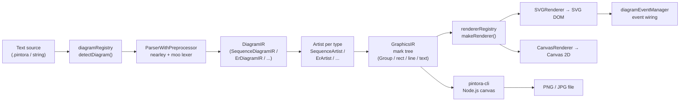
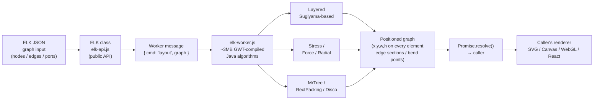
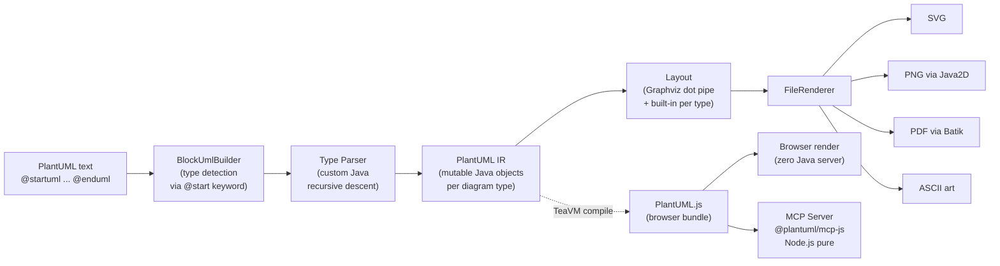
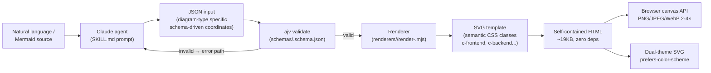

# Weekly Diagram Tooling Scan — 2026-06-16

## Executive Summary

- **pintora** cung cấp pattern IDiagram plugin rõ ràng nhất trong ecosystem TypeScript, với nearley+moo grammar
  và multi-backend renderer — mô hình đáng học trực tiếp cho hướng extensibility của kymo DSL.
- **elkjs** là implementation JavaScript của ELK (Eclipse Layout Kernel), gồm 9 thuật toán layout
  (Sugiyama layered, force, radial, stress...), chạy qua Web Worker — tham khảo thiết yếu cho
  bất kỳ quyết định nào về auto-layout engine trong kymostudio.
- **plantuml** vừa ship compiler chạy thuần browser via TeaVM và MCP server Node.js thuần — hai
  kỹ thuật deployment trực tiếp liên quan đến strategy của kymo (zero-dependency, agent-first).
- **archify** là Claude agent skill dùng fixed-coordinate SVG template per diagram type, ajv schema
  validation và semantic CSS class theming — model thú vị cho kymo's BPMN renderer và theme system.

## Table of Contents

1. [hikerpig/pintora](#1-hikerpigpintora)
2. [kieler/elkjs](#2-kielerElkjs)
3. [plantuml/plantuml](#3-plantumlplantuml)
4. [tt-a1i/archify](#4-tt-a1iarchify)

---

## 1. hikerpig/pintora

> **Repo:** https://github.com/hikerpig/pintora  
> **Pushed:** 2026-06-15 | **Stars:** 1,283 | **License:** MIT

### §1 — Quick Context

**One-line pitch:** Library TypeScript text-to-diagrams extensible, hỗ trợ 8 loại diagram với
plugin system cho phép third-party thêm diagram type mà không fork core.

- **Tech stack:** TypeScript (monorepo pnpm), nearley + moo (parser), SVG + Canvas (output),
  WinterCG target (edge runtime)
- **Repo health:** 1,283 ⭐, contributors đa số là maintainer chính (hikerpig), CI có, tests có,
  release qua npm
- **Distribution:** npm (`@pintora/standalone`, `@pintora/cli`), VSCode extension, Obsidian plugin

### §2 — Architecture Deep-Dive

#### A. Component Inventory

| Module | Path | Vai trò |
|--------|------|---------|
| `pintora-core` | `packages/pintora-core/src/` | Registry, configApi, themeRegistry, parseAndDraw entry point |
| `diagramRegistry` | `packages/pintora-core/src/diagram-registry.ts` | Đăng ký và detect diagram type từ text input |
| `pintora-diagrams` | `packages/pintora-diagrams/src/` | 8 diagram implementations (sequence, ER, component, activity, mind-map, gantt, dot, class) |
| `Parser (per-type)` | `packages/pintora-diagrams/src/<type>/parser.ts` | nearley + moo parser cho từng diagram type |
| `Artist (per-type)` | `packages/pintora-diagrams/src/<type>/artist.ts` | Chuyển DiagramIR → GraphicsIR (mark tree) |
| `pintora-renderer` | `packages/pintora-renderer/src/index.ts` | rendererRegistry, BaseRenderer, IRenderer interface |
| `pintora-standalone` | `packages/pintora-standalone/src/index.ts` | Public API: `renderTo()`, ConfigStack |
| `pintora-cli` | `packages/pintora-cli/` | CLI entry, Node.js canvas cho PNG/JPG |
| `pintora-target-wintercg` | `packages/pintora-target-wintercg/` | Edge runtime / WinterCG target |
| `development-kit` | `packages/development-kit/` | Tooling cho phát triển diagram type mới |

#### B. Pipeline / Control Flow

1. User gọi `renderTo(code, { container, renderer: 'svg' })` trong pintora-standalone
2. `diagramRegistry.detectDiagram(code)` — iterate tất cả registered patterns (regex), first match wins; default fallback là `sequenceDiagram`
3. Diagram-specific `ParserWithPreprocessor.parse(code)` — nearley grammar + moo lexer → `DiagramIR` (typed per diagram)
4. `diagram.artist.draw(ir, options)` — `Artist` chạy layout riêng của từng diagram type → trả `GraphicsIR` (mark tree: groups, rects, lines, text, paths)
5. `rendererRegistry.makeRenderer(type)` tạo renderer (SVG hoặc Canvas) → render mark tree ra DOM / canvas
6. `diagramEventManager.wireCurrentEventsToRenderer(renderer)` nối event handlers sau khi render xong

#### C. Data Model / Intermediate Representation

Hai tầng IR tách biệt:
- **DiagramIR** (`SequenceDiagramIR`, `ErDiagramIR`, v.v.): kiểu dữ liệu cụ thể per diagram, được `db.ts` của từng loại xây dựng trong quá trình parse. Immutable sau khi parse xong.
- **GraphicsIR** (`mark: Group` chứa marks lồng nhau): cây graphic marks (Mark = `rect | line | path | text | group | marker`). Artist tạo ra, Renderer consume. Không có "compile to lower IR" như D2's TALA — nhưng có khái niệm `enhanceGraphicIR` callback cho post-processing.

`ConfigStack` đảm bảo theme và config changes bị isolate per render call (push/pop pattern, restored trong `finally`).

#### D. Input Language Design

- **Parser approach:** nearley.js (parser generator) + moo (lexer). Grammar file `.ne` cho mỗi diagram type.
- **Grammar ví dụ (Sequence):** Hierarchical productions: `start → initiate + document`, `document → lines`, `line → statement | blank`. State-based lexing với moo (multiple states: `main`, `line`, `configStatement`, `noteState`).
- **Arrow tokens:** `->`, `-->`, `->>`, `-->>`, `-x`, `--x`, `-)`, `--)` — mỗi loại encode ý nghĩa semantics khác nhau.
- **Ambiguity handling:** `dedupeAmbigousResults: true` — nearley cho phép ambiguous grammar, pintora deduplicate.
- **Error reporting:** Delegate về `options.onError` callback, fallback `console.warn` — không có line/column annotation rõ ràng từ code đọc được.
- **Formal grammar:** Có `.ne` file (nearley format) nhưng không có BNF/EBNF document riêng.

#### E. Layout Algorithm

Layout trong pintora **không dùng thuật toán tổng quát** mà từng Artist tự implement:

**Sequence diagram (evidence rõ nhất):** Vertical-position model:
- `model.verticalPos` — Y cursor, tăng dần qua `bumpVerticalPos()`
- Actor positioning theo horizontal index
- `maxMessageWidthPerActor` — tính từ text dimension analysis
- Loop bounds: stack-based algorithm cho nested `[loop]`, `[alt]`, `[opt]`, `[par]`
- Activation stacking: `((stackedSize - 1) * conf.activationWidth) / 2` — horizontal offset cho parallel activations
- Responsive scaling: `scaleX = containerWidth / (contentWidth + margins)` applied as matrix transform

Edge routing: không có orthogonal routing — self-messages dùng `path` (curved), cross-actor dùng `line`.

**Thuật toán tổng quát (force/hierarchical):** Không có evidence trong code đọc được — pintora không depend vào dagre hay ELK.

#### F. Rendering / Output Strategy

- **SVG:** Backend chính — mark tree được serialize thành SVG elements. Tự-contained, không global style pollution (encapsulated styles).
- **Canvas:** Backend thứ hai — same mark tree, khác draw calls. Dùng cho browser canvas.
- **PNG/JPG:** Via `pintora-cli` + Node.js canvas library (server-side rasterization).
- **Pluggable emitter:** `rendererRegistry` cho phép register renderer mới theo tên — đây là extension point chính cho backend mới.
- **Animation:** Không có evidence của built-in SVG/CSS animation.
- **WinterCG target:** Package riêng cho edge runtime (Cloudflare Workers, Deno Deploy).

#### G. Extensibility

- `IDiagram<IR, Conf>` interface: `pattern` (regex), `parser`, `artist`, `config` schema — implement đủ 4 là đăng ký được diagram type mới.
- `registerDiagram(name, diagram)` trong `diagramRegistry` — duplicate check có warn.
- `rendererRegistry` để add renderer backend mới.
- `symbolRegistry` và `themeRegistry` cho icon/theme custom.
- `development-kit` package: tooling hỗ trợ dev diagram type mới (build, watch, test harness).
- **Plugin distribution:** Npm package — import và `pintora.registerDiagram(...)` là xong.

#### H. Dev Experience

- CLI: `pintora` với `--watch` mode có (qua development-kit), `--renderer` flag.
- VSCode Extension: có, hỗ trợ syntax highlight và live preview.
- Obsidian plugin và Gatsby remark plugin.
- Tests: `test-shared` package, mocha-based, CI chạy trên push.
- Watch mode: có qua development-kit.
- Browser preview: có tại `pintorajs.vercel.app`.

### §3 — Architecture Diagram



### §4 — Verdict

**Điểm đáng học cho kymostudio:**

- **IDiagram interface pattern** là reference implementation tốt nhất hiện tại cho extensible diagram plugin system trong TypeScript/JS ecosystem. Kymo đang Rust-based nhưng pattern `(pattern, parser, artist, config)` per diagram type có thể map trực tiếp vào trait system của Rust.
- **Moo state-based lexer** cho sequence arrows (nhiều arrow variant như `->>`, `-->>`, `-x`) đáng tham khảo vì kymo cũng cần model nhiều loại edge semantics trong `.kymo` DSL.
- **ConfigStack (push/pop với finally)** — cách isolate theme per render call, tránh global state mutation. Kymo's theme system có thể học pattern này.
- **`maxMessageWidthPerActor` calculation** — heuristic tính spacing dựa trên text dimension là bài toán kymo cũng phải giải cho sequence diagram hoặc swimlane layout.

**Red flags:**
- Layout không tổng quát — mỗi diagram type tự implement, dẫn đến code duplication giữa artist files. Không scale tốt khi thêm diagram type mới phức tạp.
- Không có orthogonal edge routing — self-messages chỉ là curved path, không có constraint-based routing.
- Error reporting thiếu line/column info — UX kém khi debug syntax error.

**Open questions:** Pintora có dùng shared layout primitive nào giữa các diagram types không, hay hoàn toàn independent? `development-kit` có layout helper nào không?

**Verdict: study deeper** — đặc biệt là `IDiagram` interface và `development-kit` pattern cho extensibility roadmap của kymo.

---

## 2. kieler/elkjs

> **Repo:** https://github.com/kieler/elkjs  
> **Pushed:** 2026-06-10 | **Stars:** 2,621 | **License:** EPL-2.0

### §1 — Quick Context

**One-line pitch:** Eclipse Layout Kernel compiled từ Java sang JavaScript via GWT, export 9 thuật toán
layout tổng quát (Sugiyama layered, force, stress, radial...) cho web app mà không cần Java runtime.

- **Tech stack:** Java (source, GWT-compiled) + JavaScript (runtime), Browserify, Babel, mocha tests
- **Repo health:** 2,621 ⭐, maintained bởi Kieler group (research group tại Uni Kiel), CI có,
  release qua npm. Open issues: 99 (nhiều do feature requests cho algorithm config).
- **Distribution:** npm (`elkjs`), cả browser bundle (`elk.bundled.js`) lẫn API-only (`elk-api.js`)

### §2 — Architecture Deep-Dive

#### A. Component Inventory

| Module | Path | Vai trò |
|--------|------|---------|
| `elk-api.js` | `src/js/elk-api.js` | Public API: constructor, `layout()`, `knownLayoutOptions()`, `knownAlgorithms()` |
| `main-api.js` | `src/js/main-api.js` | Entry point cho Node.js |
| `main-node.js` | `src/js/main-node.js` | Node.js worker thread wrapper |
| `elk-worker.js` | `lib/elk-worker.js` (generated) | Layout computation engine — Java code compiled via GWT |
| `Java source` | `src/java/org/eclipse/elk/` | Core ELK algorithms (Layered, Stress, Force, Radial, MrTree, Disco) |
| `Java additional` | `src/java-additional/org/eclipse/elk/` | JS-specific adaptations và bridging code |

#### B. Pipeline / Control Flow

1. User khởi tạo `const elk = new ELK({ workerUrl: '/elk-worker.js' })`
2. User gọi `elk.layout(graph)` với ELK JSON format graph object
3. `elk-api.js` posts message `{ cmd: 'layout', graph, layoutOptions }` tới Web Worker
4. Worker (`elk-worker.js`, ~3MB GWT-compiled Java) nhận message, chạy thuật toán layout đã chọn
5. Thuật toán tính toán `(x, y, width, height)` cho tất cả nodes, ports, edge sections
6. Worker posts result trở lại main thread
7. Promise resolve với positioned graph — caller tự render (không có renderer trong elkjs)

#### C. Data Model / Intermediate Representation

ELK JSON format — graph là plain JSON object:
```json
{
  "id": "root",
  "layoutOptions": { "elk.algorithm": "layered" },
  "children": [
    { "id": "n1", "width": 30, "height": 30, "ports": [...] }
  ],
  "edges": [
    { "id": "e1", "sources": ["n1"], "targets": ["n2"] }
  ]
}
```

- **Nodes:** `id`, `x`, `y`, `width`, `height`, `children` (hierarchical), `ports`, `labels`, `layoutOptions`
- **Edges:** Hai loại: primitive (source/target string) và extended (sources/targets arrays cho hyperedges). `sections` array chứa bend points sau layout.
- **Ports:** `id`, `x`, `y`, `width`, `height` — connection points trên node boundary.
- Sau `layout()`, graph object được mutate in-place với coordinates được fill vào.

Không có "compile to lower IR" — ELK xử lý trực tiếp từ JSON graph → positioned JSON graph trong một pass.

#### D. Input Language Design

ELK không có text DSL — input là JSON. Không có parser, không có grammar. Điều này là design choice có chủ ý: ELK là layout engine thuần túy, không phải diagram DSL.

Tuy nhiên, `layoutOptions` per element cho phép fine-grained control:
- `elk.algorithm`: `layered`, `stress`, `force`, `radial`, `mrtree`, `disco`, `sporeOverlap`, `rectpacking`
- `elk.layered.nodePlacement.strategy`: `NETWORK_SIMPLEX`, `SIMPLE`, `BRANDES_KOEPF`
- `elk.direction`: `DOWN`, `RIGHT`, `UP`, `LEFT`
- `elk.edgeRouting`: `ORTHOGONAL`, `POLYLINE`, `SPLINES`
- Port constraints, spacing, aspect ratio... (hàng trăm options documented trong ELK docs)

#### E. Layout Algorithm

**Evidence rõ từ documentation và source:**

- **Layered (Sugiyama-based):** Thuật toán chính, suited cho DAGs và hierarchical graphs. Các phase: cycle removal → layer assignment → crossing minimization → node placement → edge routing. Crossing minimization dùng barycentric heuristic (Sugiyama framework).
- **Stress Minimization:** Force-directed variant, optimize cho aesthetic criteria.
- **Force-Directed:** Classic spring model.
- **Radial:** Node ở vòng tròn đồng tâm.
- **MrTree:** Tree layout.
- **Disco:** Connected components layout.
- **SporeOverlap / SporeCompaction / RectPacking:** Packing algorithms.

**Edge routing:**
- `ORTHOGONAL`: Axis-aligned segments, cần port assignment.
- `POLYLINE`: Straight segments, bend points.
- `SPLINES`: Bézier curves.

**Node placement trong Layered:**
- `NETWORK_SIMPLEX`: Optimal (chậm hơn).
- `BRANDES_KOEPF`: Heuristic nhanh hơn, quality tốt.
- `SIMPLE`: Fastest, quality kém nhất.

**Hierarchical graphs:** `children` array cho phép compound nodes — layout tính toán recursively.

#### F. Rendering / Output Strategy

ELK **không render** — là layout engine thuần túy. Output là positioned graph JSON (same structure as input but with x/y/width/height filled in). Caller chịu trách nhiệm render (có thể dùng SVG, Canvas, WebGL, React Flow, sprotty, v.v.).

Nhiều diagram tools dùng ELK làm layout backend: Sprotty (Eclipse Foundation), Eclipse Theia, một số ứng dụng React Flow.

#### G. Extensibility

- Custom algorithm: Implement trong Java, compile via GWT, rebuild `elk-worker.js`.
- `workerFactory` option: Inject custom Worker implementation (test environment, Node.js threads).
- Layout options có thể add per element — không cần modify core.
- Không có plugin system ở JS layer — extension ở Java level.

#### H. Dev Experience

- Không có CLI, không có IDE integration riêng.
- API đơn giản — `new ELK()` + `elk.layout(graph)` + `Promise`.
- Debugging: `logging: true` option trong `layout()` call, `measureExecutionTime: true`.
- Browser: Cần serve `elk-worker.js` tĩnh từ server (do Worker URL requirement).
- Bundle size: `elk.bundled.js` ~3MB (GWT-compiled Java) — significant weight.

### §3 — Architecture Diagram



### §4 — Verdict

**Điểm đáng học cho kymostudio:**

- **9 thuật toán trong một API** — ELK là reference implementation đầy đủ nhất cho hierarchical + force + tree + packing layout trong một library. Nếu kymo muốn extend layout engine, đây là checklist về thuật toán cần support.
- **Layered algorithm chi tiết:** 4-phase Sugiyama pipeline (cycle removal → layer assignment → crossing minimization → node placement) là thiết kế đã được chứng minh cho architecture diagrams dạng top-down hoặc left-right. Kymo đang làm "smart auto-layout" — việc research các phase này giúp quyết định implement native (Rust) hay wrap ELK.
- **Orthogonal edge routing choice:** `ORTHOGONAL` vs `POLYLINE` vs `SPLINES` — ELK support cả 3. Kymo hiện render edges với "flowing animation" — orthogonal routing + animated dash-offset là combination được dùng nhiều trong architecture diagram tools.
- **`layoutOptions` per element** — thiết kế cho phép user override layout behavior tại node/edge level mà không cần đổi global config. Kymo DSL có thể học pattern này.
- **Web Worker pattern:** GWT-compiled code (heavy ~3MB) chạy trong Worker để không block UI. Nếu kymo muốn có browser-side layout, đây là reference architecture.

**Red flags:**
- Bundle size ~3MB là deal-breaker cho nhiều use case. Kymo nếu muốn zero-dependency browser rendering cần xem xét kỹ.
- Java dependency ở build time (GWT) — khó contribute, khó fork và customize algorithm.
- 99 open issues, nhiều liên quan đến edge cases trong algorithm configuration.
- EPL-2.0 license — cần check compatibility với Apache 2.0 của kymo nếu bundle.

**Open questions:** Kymo đang implement layout engine riêng trong Rust hay đang wrapper một library? Nếu đang implement riêng, có đang follow Sugiyama phases không? Phần `edge routing` của kymo hiện ở đâu trong codebase?

**Verdict: study deeper** — đặc biệt là documentation của Layered algorithm và `elk.edgeRouting` option set cho kymostudio's orthogonal routing implementation.

---

## 3. plantuml/plantuml

> **Repo:** https://github.com/plantuml/plantuml  
> **Pushed:** 2026-06-15 | **Stars:** 13,091 | **License:** GPL/LGPL/MIT (multi-license)

### §1 — Quick Context

**One-line pitch:** Diagram-as-code Java tool 15 năm tuổi, vừa ship browser compilation via TeaVM
(zero Java server) và MCP server Node.js thuần — hai shift deployment quan trọng.

- **Tech stack:** Java (core), TeaVM (Java→JS compiler cho browser), Node.js (MCP server wrapper via `@plantuml/mcp-js`), Graphviz (optional external dependency cho dot layout)
- **Repo health:** 13,091 ⭐, team nhỏ nhưng rất active (pushed ngày 2026-06-15), 603 open issues,
  CI có, release qua GitHub releases + Maven Central
- **Distribution:** JAR standalone, Maven/Gradle, npm (`@plantuml/mcp-js`), browser extension

### §2 — Architecture Deep-Dive

#### A. Component Inventory

Note: Kymostudio's GitHub MCP không cho phép đọc file ngoài repo. Evidence dưới đây từ README, changelog và web documentation.

| Module | Inferred Path | Vai trò |
|--------|---------------|---------|
| `BlockUmlBuilder` | `src/.../plantuml/` | Entry point: nhận text, detect diagram type, dispatch parser |
| Type-specific Parsers | `src/.../plantuml/<type>/` | Custom Java parser cho mỗi diagram type (không dùng ANTLR) |
| PlantUML IR | (Java objects per type) | Diagram intermediate representation (mutable Java objects) |
| Layout Engine | External + internal | Graphviz (dot) cho graph layout; internal cho sequence/gantt |
| FileRenderer | `src/.../plantuml/png/` etc. | Render IR → SVG/PNG/PDF/ASCII/LaTeX |
| TeaVM target | Separate build | Compile PlantUML Java → JavaScript cho browser |
| MCP Server | `@plantuml/mcp-js` (npm) | Node.js MCP server wrap PlantUML JS build |
| Browser Extension | Separate repo | Render diagrams in GitHub/GitLab via browser-side PlantUML JS |

#### B. Pipeline / Control Flow

1. User chạy `java -jar plantuml.jar diagram.puml` hoặc gọi API
2. `BlockUmlBuilder` đọc source text, detect diagram type từ `@startuml` / `@startditaa` / `@startgantt` keyword
3. Type-specific parser nhận text block, xây dựng PlantUML IR (Java object graph)
4. Layout phase: Gọi Graphviz (nếu cần, qua pipe/embedded) hoặc dùng built-in layout (sequence: custom vertical model; gantt: timeline model)
5. `FileRenderer` traverse IR, emit SVG/PNG/PDF/ASCII tùy format flag
6. Output file ghi ra disk (hoặc stream)

**Browser path (mới, via TeaVM):**
1. PlantUML Java compiled to JS via TeaVM build
2. Browser load JS bundle
3. Same pipeline nhưng chạy client-side, không cần server
4. MCP server (`@plantuml/mcp-js`): wrap JS build, expose `render_diagram` tool qua MCP protocol

#### C. Data Model / Intermediate Representation

**Không xác định** chi tiết IR structure từ code đọc được. Inference từ behavior:
- Mutable Java objects (theo pattern Java cũ của codebase)
- Per-type: `SequenceDiagram`, `ClassDiagram`, `ComponentDiagram`, v.v.
- Không có documented public IR format — IR là internal implementation detail
- Không có "compile to lower IR" — single representation từ parse → render

#### D. Input Language Design

- **Parser approach:** Custom recursive descent / line-based parser viết tay bằng Java. Không dùng ANTLR hay parser combinator library (verified từ community discussions).
- **Grammar:** Không có formal BNF/EBNF documentation chính thức. Syntax documented qua examples trên plantuml.com.
- **Keyword detection:** `@startuml`, `@startgantt`, `@startmindmap`, v.v. — explicit type markers, không ambiguous.
- **Error reporting:** Basic error messages, line number cho một số errors. Known weakness: error messages không descriptive.
- **Preprocessing:** Supports `!include`, `!define`, `!procedure` macros — preprocessor layer trước parse.

#### E. Layout Algorithm

- **Graphviz integration:** Sequence, activity, component diagrams gọi Graphviz (dot) qua system pipe hoặc embedded. Đây là dependency nặng (binary external) nhưng quality cao.
- **Built-in sequence layout:** Custom vertical model tương tự pintora (vertical cursor, actors trên horizontal axis).
- **Gantt:** Custom timeline-based layout.
- **Mind map:** Radial layout built-in.
- **Edge routing:** Orthogonal + spline (Graphviz handles), straight lines cho sequence.

#### F. Rendering / Output Strategy

- **SVG:** Chính, high-quality
- **PNG:** Via Java2D (server) hoặc Canvas API (browser)
- **PDF:** Via Apache Batik
- **ASCII art:** Built-in ASCII renderer (unique feature)
- **LaTeX/TikZ:** Export cho academic use
- **Animation:** Không có SVG animation built-in

#### G. Extensibility

- Custom shapes qua `!define` macros và `sprite` system
- Theme (`!theme`) hỗ trợ — có sẵn nhiều themes trên plantuml.com
- Không có formal plugin API
- Contribution yêu cầu fork + submit PR — no runtime extension

#### H. Dev Experience

- CLI: `java -jar plantuml.jar` — heavy JVM startup (~500ms)
- Browser extension: render inline trên GitHub, zero-friction UX
- MCP server: `@plantuml/mcp-js` — agent có thể `render_diagram(text)` get URL/base64
- IDE: VSCode extension (third-party), nhiều editors có plugin
- Watch mode: Có (`-watch` flag)
- TeaVM build: Cho phép self-hosted rendering không cần Java install

### §3 — Architecture Diagram



### §4 — Verdict

**Điểm đáng học cho kymostudio:**

- **TeaVM pattern (Java → JS):** Kymostudio dùng Rust — pattern tương đương là compile Rust → WASM. PlantUML đã validate rằng compiling diagram tool core sang client-side runtime là viable và được users đón nhận tốt (browser extension 0 permissions). Đây là validation cho kymostudio's potential WASM path.
- **MCP server design (`@plantuml/mcp-js`):** Wrap existing binary tool vào MCP server thuần Node.js. Kymo đã có MCP server — nên so sánh tool interface design (schema, error handling) với `@plantuml/mcp-js` implementation.
- **`@start` keyword prefix cho type detection:** Explicit type marker (không cần pattern matching phức tạp) là choice đơn giản hơn pintora's regex detect. Tradeoff: verbose hơn nhưng unambiguous. Kymo DSL cần quyết định: explicit marker hay implicit detect từ content?
- **ASCII renderer:** Unique output backend — nếu kymo muốn diff-friendly output cho CI, ASCII là idea đáng consider.

**Red flags:**
- Java codebase >15 năm, không có public IR, parser viết tay không có formal grammar — maintainability khó.
- Graphviz external dependency phức tạp deploy.
- Multi-license (GPL/LGPL/MIT) — phức tạp cho commercial use.
- Error messages kém — known pain point.

**Open questions:** TeaVM bundle size so với GWT/Emscripten như thế nào? `@plantuml/mcp-js` có expose plantuml rendering errors đủ tốt cho agent retry không?

**Verdict: glance only** — quan sát two deployment innovations (TeaVM, MCP) nhưng không cần study architecture sâu vì Java monolith codebase khó extract patterns.

---

## 4. tt-a1i/archify

> **Repo:** https://github.com/tt-a1i/archify  
> **Pushed:** 2026-06-14 | **Stars:** 1,057 | **License:** MIT

### §1 — Quick Context

**One-line pitch:** Claude agent skill biến mô tả tiếng Anh thành self-contained HTML file chứa SVG
diagram đẹp, với dark/light theme toggle và export PNG/JPEG/WebP/SVG — không cần DSL riêng.

- **Tech stack:** JavaScript (Node.js renderers), ajv (JSON schema validation), inline SVG + CSS custom properties, browser canvas API (export). Không có framework JS nào (zero dependencies trong output HTML).
- **Repo health:** 1,057 ⭐, single maintainer (tt-a1i), rapid iteration, CHANGELOG và ROADMAP có.
  CI: GitHub Actions (cơ bản). npm package không có.
- **Distribution:** Zip download skill (`archify.zip`), web demo tại `tt-a1i.github.io/archify/`

### §2 — Architecture Deep-Dive

#### A. Component Inventory

| Module | Path | Vai trò |
|--------|------|---------|
| `SKILL.md` | `archify/SKILL.md` | Agent prompt: trigger phrases, rendering instructions, schema reading logic |
| Schema files | `archify/schemas/<type>.schema.json` | Ajv JSON schema cho từng diagram type (5 types) |
| Renderers | `archify/renderers/<type>/render-<type>.mjs` | Node.js scripts nhận JSON input, output HTML |
| Example inputs | `archify/examples/*.<type>.json` | Worked examples cho agent study |
| Output examples | `examples/*.html` | Sample output HTML files |

#### B. Pipeline / Control Flow

1. User mô tả system/process bằng tiếng Anh (hoặc paste Mermaid source) cho Claude agent
2. Claude đọc `SKILL.md`, detect diagram type từ trigger phrases ("architecture", "workflow", "sequence", "data flow", "state")
3. Claude đọc JSON schema (`schemas/<type>.schema.json`) và example (`examples/*.<type>.json`)
4. Claude tạo JSON input object tuân theo schema
5. Execute renderer: `node renderers/<type>/render-<type>.mjs input.json output.html`
6. Ajv validate input JSON — nếu fail, Claude đọc error path + constraint, sửa JSON và retry
7. Renderer sinh SVG + CSS + JS thành self-contained HTML (~19KB)
8. User có thể export PNG/JPEG/WebP (via browser canvas API) hoặc dual-theme SVG

#### C. Data Model / Intermediate Representation

Không có traditional IR — data flow là: **JSON input → SVG template inline**.

Mỗi diagram type có fixed coordinate system (documented trong `SKILL.md`):
- **Sequence:** Participants tại `x = 62 + index × 108` (max 8 participants cho viewBox 920px wide). Messages tại `y ∈ [160, height−83]`, min 28px separation giữa messages.
- **Workflow (swimlane):** Nodes với `col` 0–5, fixed x-positions. Edges với routing option: `straight`, `drop`, `outside-right`, `return-left`, `channels`.
- **Dataflow:** Stages 2–5 tại `x = 100 + stage × 215`. Rows 0–4 tại fixed y values `[128, 242, 356, 470, 584]`.
- **Lifecycle:** 3 semantic lanes: `main` (phases), `waiting` (interruptions), `terminal` (outcomes).
- **Architecture:** Free coordinates `pos: [x, y]`, no grid. Renderer handles overlap/collision detection.

JSON là immutable input — renderer consume một lần, không có multi-pass.

#### D. Input Language Design

**Không có DSL text syntax** — input là JSON. "Parser" trong archify là Claude itself: agent đọc schema và tạo valid JSON.

Tuy nhiên có một design decision thú vị: **Mermaid-as-input conversion**:
- Nếu user paste Mermaid, agent **không parse mechanically** mà đọc topology rồi **rebuild from scratch** trong archify format
- `flowchart/graph` → workflow hoặc architecture (agent phán đoán intent)
- `sequenceDiagram` → sequence (participants map tới types; `->>` là message; `-->>` là return)
- `stateDiagram` → lifecycle (`[*]` marks start/terminal)
- **Drop styling, retain topology** — đây là conversion-by-semantic-intent, không phải syntax translation

#### E. Layout Algorithm

Không có layout algorithm — positions được **hardcoded** trong schema per diagram type, agent
generate coordinates trong JSON input. Renderer chỉ trust input coordinates.

**Architecture diagram exception:** Renderer có collision detection sau khi receive `pos: [x, y]` — nếu overlap detected, renderer auto-adjusts. Boundary computation cho "groups" (containers) auto-pads từ contained component IDs.

Không có force-directed, không có hierarchical layout engine — "layout" là responsibility của Claude agent khi gen JSON.

#### F. Rendering / Output Strategy

- **SVG:** Duy nhất, generated inline trong HTML
- **CSS custom properties:** Tất cả fills/strokes dùng semantic CSS class thay vì hardcoded colors: `c-frontend`, `c-backend`, `c-database`, `c-security`, `c-messagebus`, `a-emphasis`, `a-security` — đây là mechanism chính cho dark/light theme toggle
- **Theme toggle:** CSS variable swap tại runtime, không cần re-render
- **Export:** Browser canvas API — rasterize SVG → PNG/JPEG/WebP tại 2–4× resolution
- **Dual-theme SVG download:** Embed cả dark và light CSS trong một SVG file, responsive to `prefers-color-scheme`
- **Output size:** ~19KB self-contained HTML, zero external dependencies
- **Animation:** Không có

#### G. Extensibility

- Add diagram type: Tạo schema JSON + renderer `.mjs` + example JSON + update `SKILL.md` instructions
- Custom styling: Thêm CSS class trong renderers (pattern đã xác định)
- Không có plugin API — extend bằng cách copy và modify

#### H. Dev Experience

- Không có CLI install — download zip, dùng như Claude skill
- Renderer executable trực tiếp: `node renderers/workflow/render-workflow.mjs input.json output.html`
- Schema validation errors: ajv trả về JSON path + constraint detail — agent đọc và self-correct
- Web demo: `tt-a1i.github.io/archify/` — playground online
- Không có VSCode extension, không có watch mode, không có test suite rõ ràng

### §3 — Architecture Diagram



### §4 — Verdict

**Điểm đáng học cho kymostudio:**

- **Semantic CSS class theming** (`c-frontend`, `c-backend`, `c-database`) thay vì hardcoded colors là pattern rất clean cho dark/light toggle. Kymo đang làm SVG output — có thể dùng pattern này cho themed SVG export (Figma token mapping và Excalidraw export cũng hưởng lợi).
- **Schema-driven coordinate system** per diagram type: mỗi loại diagram có một "coordinate grammar" riêng được document rõ trong schema JSON. Kymo có thể formalize tương tự cho `.kymo` DSL — define valid range của coordinates, column/row constraints per diagram mode.
- **ajv self-correction loop** (agent gen JSON → validate → sửa lỗi → retry) là pattern đáng note cho kymo's MCP server: khi agent tạo `.kymo` code có lỗi, MCP tool nên trả về structured validation error với path + constraint để agent có thể self-correct, thay vì generic error string.
- **Mermaid conversion via semantic intent** (không phải AST translation) là approach thú vị: agent đọc ý nghĩa topology rồi rebuild. Kymo đang support BPMN import — có thể dùng cách tiếp cận hybrid: parse BPMN strictly (structural) + allow agent to refine layout intent.
- **19KB zero-dependency HTML output:** Kymo output là SVG — nhưng archify chứng minh rằng self-contained HTML với theme toggle và export controls là format user thực sự muốn, đặc biệt khi share qua email/docs.

**Red flags:**
- Không có thuật toán layout thực sự — Claude phải "nghĩ ra" coordinates, dẫn đến overlap và xấu nếu agent không follow schema tốt.
- Fixed coordinate grids hạn chế flexibility — architecture diagram với >20 nodes sẽ bị tràn bounds.
- Single maintainer, không có tests rõ ràng — risk nếu cần reliable automation.
- Output quality phụ thuộc hoàn toàn vào chất lượng prompt trong SKILL.md.

**Open questions:** Archify có plans cho layout algorithm thực không (thay vì rely vào agent)? Schema có version hay backward compat consideration không?

**Verdict: glance only, steal 2 ideas** — (1) semantic CSS class system cho theming, (2) structured validation error cho agent self-correction trong MCP. Không study architecture deeper.

---

*Scan performed: 2026-06-16. Data sources: GitHub search API (pushed:>2026-06-09), raw.githubusercontent.com, eclipse.dev/elk documentation. Repos analyzed: 4 (pintora, elkjs, plantuml, archify).*
