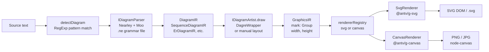
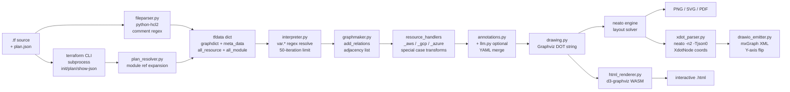
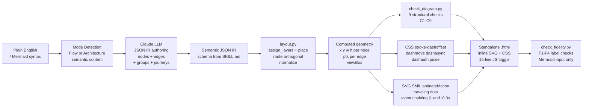

```mermaid
flowchart LR
    Repo["Source repo"] --> Tokei["ProjectScanner\ntokei binary\nlanguage detect"]
    Tokei --> LSP["LSP server spawn\npyright / gopls\nJDTLS / typescript-ls\nintelephense"]
    LSP --> SymDisc["documentSymbol\ndidOpen\nSymbolTable"]
    SymDisc --> EdgeBuild["textDocument/references\ntextDocument/definition\nCaller-Callee edges"]
    EdgeBuild --> CG["CallGraph\nnodes: dict str Node\nedges: list Edge"]
    CG --> NX["to_networkx\nNetworkX graph"]
    NX --> Leiden["Leiden algorithm\nleidenalg + igraph\nModularityVertexPartition"]
    Leiden --> Clusters["ClusterResult\ncluster_id to set node"]
    Clusters --> MetaAgent["MetaAgent\nLLM reads docs\nMetaAnalysisInsights"]
    Clusters --> AbsAgent["AbstractionAgent\nLLM 2-phase\nclusters to components"]
    MetaAgent --> AbsAgent
    AbsAgent --> DetailsAgent["DetailsAgent\nLLM parallel\nsub-decomposition"]
    DetailsAgent --> AnalysisJSON["UnifiedAnalysisJson\nanalysis.json"]
    AnalysisJSON --> MD["generate_markdown\nMermaid graph LR"]
    AnalysisJSON --> HTML["generate_html\nCytoscape.js + Dagre\ninteractive .html"]
    AnalysisJSON --> MDX["generate_mdx\ngenerate_sphinx"]
```

# Weekly Scan: Diagram Tooling — 2026-06-18

> Scout run tự động, 25 repos được scan, 4 được chọn để deep-dive.
> Data source: GitHub topic search (diagram-as-code, graph-visualization, svg-animation) + keyword search,
> window: pushed trong 7 ngày qua (2026-06-11 → 2026-06-18).

---

## Executive Summary

- **Pintora** (`hikerpig/pintora`, ★1,284) cung cấp blueprint extensibility rõ ràng nhất tuần này: interface `IDiagram` 5-field + `diagramRegistry` runtime registration cho phép add diagram type mới không cần fork. Parser dùng Nearley (Earley algorithm) + Moo lexer với `.ne` grammar files — formal grammar có viết ra, error position reporting thực sự.
- **dashmotion** (`csthink/dashmotion`, ★56, sinh ngày 2026-06-11) chứng minh rằng tách LLM ra khỏi geometry computation là đúng hướng: LLM sinh semantic JSON IR, `layout.py` Python deterministic tính tất cả coordinates. Token giảm ~84%. SVG SMIL `<animateMotion>` event chaining (`begin="j1.end+0.3s"`) cho traveling-dot animation là technique đáng đọc kỹ cho kymo.
- **CodeBoarding** (`CodeBoarding/CodeBoarding`, ★2,300) thể hiện hướng "code → architecture diagram" scalable nhất: dùng LSP servers (pyright, gopls, JDTLS) làm oracle phân tích thay vì viết custom parser, Leiden community detection để cluster call graph thành components, LLM labeling chỉ làm phần semantic — hai distinct IRs (`CallGraph` structural + `UnifiedAnalysisJson` semantic) tách bạch rõ concerns.

---

## Table of Contents

1. [Pintora — Extensible Text-to-Diagrams TypeScript Library](#1-pintora--hikerpigpintora)
2. [Terravision — Terraform → Cloud Architecture Diagram](#2-terravision--patrickchughterravision)
3. [dashmotion — Animated SVG Diagram từ Mermaid / Plain English](#3-dashmotion--cstinkdashmotion)
4. [CodeBoarding — Code → Interactive Architecture Diagram via LSP + LLM](#4-codeboarding--codeboardingcodeboarding)

---

## 1. Pintora — `hikerpig/pintora`

### §1 — Quick Context

**Pitch:** Library TypeScript text-to-diagrams chạy đồng thời trên browser và Node.js, plugin registry cho phép register diagram type mới vào runtime mà không fork codebase.

**Tech stack:** TypeScript 6.0, monorepo pnpm 9 + Turbo; parser: `@hikerpig/nearley` (Earley) + `@hikerpig/moo` lexer; layout: `@pintora/dagre` (Sugiyama hierarchical); renderer: `@antv/g-svg` / `@antv/g-canvas`; output: SVG/Canvas (browser), PNG/JPG/SVG (Node.js CLI).

**Repo health:** ★1,284 | 37 forks | 40 open issues | CI: jest + codecov | Changesets versioning. Pushed 2026-06-15.

**Distribution:** npm — `@pintora/standalone` (ESM + UMD), `@pintora/cli`, `@pintora/core`, `@pintora/diagrams`, `@pintora/renderer`.

---

### §2 — Architecture Deep-Dive

#### A. Component Inventory

- **`@pintora/core`** (`packages/pintora-core`) — Engine trung tâm: `diagramRegistry`, `themeRegistry`, `symbolRegistry`, `rendererRegistry`, `configEngine`, function `parseAndDraw()`. Định nghĩa tất cả interfaces quan trọng (`IDiagram`, `IDiagramParser`, `IDiagramArtist`, `IRenderer`, `GraphicsIR`, `Mark`).
- **`@pintora/diagrams`** (`packages/pintora-diagrams`) — 8 diagram implementations (Sequence, ER, Component, Activity, Mind Map, Gantt, DOT, Class): mỗi loại có parser, db state module, và artist. Shared: `DagreWrapper`, `createLayoutGraph`.
- **`@pintora/dagre`** (`packages/pintora-dagre`) — Vendored Dagre v0.10.10, Sugiyama hierarchical layout algorithm.
- **`@pintora/graphlib`** (`packages/pintora-graphlib`) — Graph data structure (nodes, edges, children), v2.2.2.
- **`@pintora/renderer`** (`packages/pintora-renderer`) — `SvgRenderer` (via `@antv/g-svg`) và `CanvasRenderer` (via `@antv/g-canvas`); factory `makeRenderer(type)`.
- **`@pintora/standalone`** (`packages/pintora-standalone`) — Browser bundle: `pintoraStandalone` singleton, `renderTo()`, `initBrowser()`, `renderContentOf()`. Build: rolldown → ESM + UMD.
- **`@pintora/cli`** (`packages/pintora-cli`) — Node.js CLI: dùng `jsdom` + `node-canvas` simulate DOM cho raster output; `GlobalPatcher` patch `window`/`document` globals.

#### B. Pipeline

1. User gọi `pintoraStandalone.renderTo(code, { container })` (browser) hoặc `pintora-cli render input.pmd` (Node.js).
2. **Detect:** `diagramRegistry.detectDiagram(code)` test từng registered `IDiagram.pattern: RegExp` chống prefix của input text.
3. **Parse:** `IDiagram.parser` (là `ParserWithPreprocessor`) chạy `@pre` config block preprocessor, rồi instantiate `nearley.Parser` với moo lexer biên dịch từ `.ne` grammar file → typed `DiagramIR` (e.g. `SequenceDiagramIR`, `ErDiagramIR`).
4. **Layout:** `IDiagram.artist.draw(diagramIR)` tạo `LayoutGraph` via `createLayoutGraph()`, add nodes/edges, gọi `DagreWrapper.doLayout()` → Dagre Sugiyama tính positions, `onLayout()` callbacks build `Mark` primitives. Ngoại lệ: Sequence diagrams dùng manual layout (`bumpVerticalPos()`) thay Dagre.
5. **Render:** `render(graphicsIR, { renderer: 'svg' })` → `SvgRenderer` traverse mark tree via `@antv/g-svg`, append `<svg>` vào container.
6. **Output:** SVG DOM (browser) / `element.outerHTML` (Node.js SVG) / `canvas.toBuffer()` với 20ms delay (Node.js PNG/JPG).

#### C. Data Model / IR

**`GraphicsIR`** — output của artist, input của renderer (immutable value objects):
```typescript
interface GraphicsIR { mark: Mark; width: number; height: number; bgColor?: string }
type Mark = Group | Rect | Circle | Text | Line | Path | PolyLine | Marker | GSymbol
```

**`DiagramIR`** — per diagram type, e.g. `SequenceDiagramIR`:
```typescript
{ messages: Message[], actors: Record<string, Actor>, actorOrder: string[], notes: Note[], title: string }
```
`SequenceDiagramIR`, `ErDiagramIR`, `ComponentDiagramIR`, v.v. đều extend `BaseDiagramIR`. Immutable: không có mutation giữa parse → layout → render passes.

#### D. Input Language Design

Parser: **Nearley (Earley algorithm)** + `@hikerpig/moo` lexer, grammar files `.ne`. `dedupeAmbigousResults: true` xử lý grammar ambiguity. Formal grammar: có `.ne` files viết ra (e.g. `erDiagram.ne`) với productions, `@lexer` directive, cardinality tokens. Pintora fork cả nearley và moo (`@hikerpig/` prefix) → full control, thêm được `ParserWithPreprocessor` + `@pre` block support. Error reporting: Nearley throw với position info, quality tùy diagram.

#### E. Layout Algorithm

**Dagre (Sugiyama hierarchical)** cho graph-based diagrams; config: `rankdir`, `nodesep`, `ranksep`, spline options. **Ngoại lệ quan trọng:** Sequence diagrams dùng custom manual layout — `Model.bumpVerticalPos()`, `calculateActorMargins()`, `calculateLoopBounds()` — không dùng Dagre (insight đúng: hierarchical layout không phù hợp sequential flow). Edge routing: Dagre handles splines.

#### F. Rendering / Output

Hai backends pluggable qua `rendererRegistry`: `SvgRenderer` (`@antv/g-svg`) và `CanvasRenderer` (`@antv/g-canvas`). Không có animation. SVG output không pollute global styles — giải quyết class collision issue nổi tiếng của Mermaid. Single backend per render call.

#### G. Extensibility

Interface 5-field để register diagram type mới:
```typescript
interface IDiagram<D, Config> {
  pattern: RegExp; parser: IDiagramParser<D>;
  artist: IDiagramArtist<D, Config>; configKey?: string; clear(): void;
}
diagramRegistry.registerDiagram('myDiagram', impl)
```
Thêm: `themeRegistry`, `symbolRegistry`, `rendererRegistry` đều pluggable. `StyleEngine` với `@bindClass` directives cho CSS-like styling trong `@pre` blocks (v0.8.0+).

---

### §3 — Architecture Diagram



---

### §4 — Verdict

**Đáng học cho kymostudio:**
- `IDiagram` registry pattern là blueprint rõ nhất cho extensible diagram engine: 5 fields, không magic, pluggable tại runtime. Kymo nên adopt pattern này.
- `GraphicsIR` mark tree (immutable, typed value objects) là IR design tốt nhất trong domain — tách bạch hoàn toàn layout concern và render concern.
- Sequence diagram dùng manual layout thay Dagre — decision đúng; kymo nên xem source `sequence/artist.ts` khi implement sequential diagram type.
- Vendor parser lib (`@hikerpig/nearley`, `@hikerpig/moo`) là quyết định dứt khoát để có full control; cân nhắc khi nào kymo nên làm tương tự.

**Red flags:** 40 open issues với 1.2k stars là ratio cao. `@antv/g` library ít community ngoài hệ sinh thái AntV.

**Open questions:** `StyleEngine` + `@bindClass` hoạt động thế nào với custom renderer backend? Error recovery trong parser failures?

**Verdict: Study deeper** — đặc biệt `IDiagram` interface, `GraphicsIR` mark tree structure, và sequence diagram manual layout code.

---

## 2. Terravision — `patrickchugh/terravision`

### §1 — Quick Context

**Pitch:** CLI Python convert Terraform HCL source code thành cloud architecture diagrams (AWS/GCP/Azure) tự động — không cần viết DOT hay config thủ công, support draw.io và interactive HTML output.

**Tech stack:** Python ≥3.11, `python-hcl2` (HCL parser), `graphviz` Python bindings (neato engine), `d3-graphviz` + WebAssembly (interactive HTML), `GitPython`, Ollama/Bedrock/OpenAI (optional LLM annotation).

**Repo health:** ★1,560 | AGPL-3.0 | PyPI v0.43.0 | 40+ releases | Python 96.3% | Docker + Nix support. Pushed 2026-06-17.

**Distribution:** `pipx install terravision`; prerequisites: Terraform 1.x binary, Graphviz, Git.

---

### §2 — Architecture Deep-Dive

#### A. Component Inventory

- **`terravision/terravision.py`** — Click CLI: commands `draw`, `graphdata`, `visualise`.
- **`modules/fileparser.py`** — HCL parser: regex extract comments → `hcl2.load()` → `tfdata` dict (`all_resource`, `all_module`, `all_variable`, `all_locals`, `all_data`, `all_outputs`, `tf_comments`).
- **`modules/tfwrapper.py`** / **`tgwrapper.py`** — Terraform/Terragrunt CLI orchestration: `terraform init/plan/show -json/graph` via `subprocess.run()`.
- **`modules/interpreter.py`** — Variable/locals resolver: iterative regex substitution `var.*`, `local.*`, `data.*`, `module.*` (max 50 iterations, cycle detection).
- **`modules/plan_resolver.py`** — Terraform plan JSON walker: navigate `configuration.root_module.module_calls` → expand module references.
- **`modules/graphmaker.py`** — Graph IR builder: `add_relations()` → `graphdict: dict[str, list[str]]` + `meta_data: dict[str, dict]` + `node_list`.
- **`modules/resource_transformers.py`** — Post-processing: `expand_to_numbered_instances()`, `auto_group_by_type()`, `link_via_shared_child()`, `create_transitive_links()`.
- **`modules/drawing.py`** — Graphviz DOT generator + static render (PNG/SVG/PDF).
- **`modules/html_renderer.py`** — Interactive HTML: embed DOT + metadata JSON vào template với d3-graphviz WASM.
- **`modules/drawio_emitter.py`** — draw.io XML emitter: parse xdot layout → flip Y-axis → mxGraph XML dùng built-in AWS4/Azure/GCP shape libraries.
- **`modules/xdot_parser.py`** — Layout extractor: chạy `neato -n2 -Tjson0` subprocess → `XdotNode`, `XdotCluster`, `XdotEdge`, `XdotGraph` dataclasses.
- **`modules/annotations.py`** — Manual (`terravision.yml`) + AI (`terravision.ai.yml`) annotation merge, precedence rõ ràng.
- **`modules/llm.py`** — LLM annotation backend: Ollama (local HTTP) / AWS Bedrock (boto3) / OpenAI-compatible REST. `graphdict` immutable — LLM chỉ modify annotation YAML.
- **`modules/provider_detector.py`** — Provider detection từ resource name prefix: `{providers, primary_provider, confidence}`.
- **`resource_classes/{aws,azure,gcp,generic}/`** — Graphviz node class definitions per cloud service (27 AWS modules).

#### B. Pipeline

1. `terravision draw --source=./infra --format=png` → Click dispatch.
2. **Provider detect:** scan resource name prefixes (`aws_`, `azurerm_`, `google_`) → primary provider + confidence.
3. **Remote modules:** `gitlibs.clone_files()` clone module source qua GitPython / HTTP archive.
4. **Terraform execution:** `tfwrapper.py` → `terraform init` → `plan` → `show -json` → `graph` via subprocess.
5. **HCL parse:** `fileparser.iterative_parse()` — regex strip comments → `hcl2.load()` → `tfdata` dict.
6. **Plan merge:** `plan_resolver` walk `configuration.root_module.module_calls` → enrich resource attrs từ plan JSON.
7. **Variable resolve:** `interpreter.py` iterative regex substitution (50 iterations max, cycle detection).
8. **Graph IR build:** `graphmaker.add_relations()` → `graphdict` adjacency list + `meta_data` per node.
9. **Provider transforms:** `resource_handlers_{aws,gcp,azure}.py` apply special case transforms (subnet grouping, EKS node splitting, VMSS expansion).
10. **Annotation merge:** apply `terravision.yml`; nếu `--ai-annotate`, gọi `llm.py` trước.
11. **DOT generation:** `drawing._build_diagram()` instantiate resource class objects → Graphviz DOT string.
12. **Layout & output:**
    - PNG/SVG/PDF: Graphviz neato render trực tiếp.
    - draw.io: `xdot_parser` chạy `neato -n2 -Tjson0` → extract `XdotNode` positions → `drawio_emitter` emit mxGraph XML.
    - Interactive HTML: `html_renderer` embed DOT + JSON metadata vào template với d3-graphviz WASM.

#### C. Data Model / IR

**`tfdata` dict** — plain Python dict, mutable, không có typed class wrapper. Flow qua tất cả passes:
```python
{
  'graphdict': dict[str, list[str]],  # adjacency list: resource_id → [dep_ids]
  'node_list': list[str],
  'meta_data': dict[str, dict],       # per-node attrs: vpc_id, subnet_id, cidr, count, etc.
  'all_resource': dict,               # raw HCL parsed per file
  'all_module': dict, 'all_variable': dict,
  'all_locals': dict, 'all_data': dict, 'all_outputs': dict,
  'plandata': dict,                   # terraform show -json output
  'tf_comments': dict,
}
```
Node identifier format: `aws_s3_bucket.my_bucket`, `module.vpc.aws_subnet.private`, `aws_ec2_instance.web~1`.

Layout positions chỉ extracted sau render vào `XdotNode/XdotEdge` dataclasses — dùng cho draw.io export only, không stored trong `tfdata`.

#### D. Input Language Design

Parser: **`python-hcl2` library** (`hcl2.load()`) — không phải custom parser. Regex extract comments trước khi parse (vì `hcl2` strip comments và mất info). Variable interpolation dùng iterative regex thuần Python, không call `terraform console`. Terraform CLI vẫn invoke cho runtime (`init/plan/show`) nhưng không dùng cho HCL syntax parsing.

#### E. Layout Algorithm

**Graphviz neato** với `neato_no_op=2`: node positions fixed từ DOT file, neato chỉ route edges. Direction: top-to-bottom. Clusters (VPC, subnet, resource group) là Graphviz subgraph clusters, rendered đệ quy. Python không manually assign coordinates.

**Dual-path trick cho draw.io:** sau khi neato layout xong, chạy `neato -n2 -Tjson0` subprocess riêng để extract `(x, y)` coordinates per node + spline control points per edge → flip Y-axis (Graphviz bottom-left → draw.io top-left) → emit mxGraph XML.

#### F. Rendering / Output

| Format | Mechanism |
|--------|-----------|
| PNG / SVG / PDF | Graphviz Python bindings → neato |
| draw.io | `xdot_parser` + `drawio_emitter` → mxGraph XML |
| Interactive HTML | `html_renderer` + d3-graphviz (Graphviz WASM) + metadata JSON |

Không dùng PIL/Pillow. Không có animation. Node icons là PNG files từ `resource_images/` hoặc base64 data URIs.

---

### §3 — Architecture Diagram



---

### §4 — Verdict

**Đáng học cho kymostudio:**
- **Dual-output path qua xdot extraction** là pattern tinh tế: layout một lần với engine tốt nhất, rồi extract positions bằng `neato -n2 -Tjson0` subprocess để emit format thứ hai. Kymo có thể dùng pattern này khi cần hỗ trợ nhiều export formats từ cùng một layout pass.
- **Annotation YAML system** với merge precedence rõ (AI file < user file < CLI flag) là design tốt cho user-override layer trong diagram tool.
- **LLM annotation tách hoàn toàn khỏi deterministic pipeline** — LLM không thể corrupt `graphdict`, chỉ modify annotation YAML. Architectural decision đúng, áp dụng được cho kymo.

**Red flags:** `tfdata` dict mutable qua nhiều passes — no type safety, hard to reason about state. Iterative regex variable resolution (50 iterations) fragile với edge cases. AGPL-3.0 = không dùng được trong proprietary product.

**Open questions:** Behavior khi `terraform plan` fails (expired credentials, network)? Error recovery trong HCL parse failures với dynamic expressions?

**Verdict: Glance only** — Terravision giải quyết Terraform-specific problem, không generalize. Nhưng xdot dual-output trick và annotation YAML pattern đáng bookmark.

---

## 3. dashmotion — `csthink/dashmotion`

### §1 — Quick Context

**Pitch:** Claude Code skill sinh animated technical diagrams từ plain English hoặc Mermaid syntax — output là single self-contained HTML file, không cần external dependencies, không cần build step.

**Tech stack:** Không phải library — là SKILL.md-based Claude Code skill. Python 22.5% (`layout.py` deterministic layout engine + 2 validators), HTML 77.5% (templates + output). Không có npm/Node.js. Output: standalone HTML với inline SVG + CSS animations + SVG SMIL.

**Repo health:** ★56 | 4 forks | 0 issues | **created 2026-06-11** (7 ngày tuổi!) | 8 releases (v2.0.0 → v2.2.4 trong 1 tuần) | MIT | CI: `test/run_checks.py` phải pass trước mỗi release.

**Distribution:** `npx skills add csthink/dashmotion -a claude-code -g` hoặc upload `.zip` release qua claude.ai web. Có dual remote GitHub + Gitee.

---

### §2 — Architecture Deep-Dive

#### A. Component Inventory

**`skills/dashmotion/`** — installable unit (chỉ subtree này được distribute):
- **`SKILL.md`** — Core instruction file: trigger conditions, pipeline steps, design tokens, animation contracts, output spec.
- **`references/flow-mode.md`** — Node shapes, color tokens, animation dot placement rules, layout arithmetic cho flow diagrams.
- **`references/architecture-mode.md`** — 7-component-type color system (`frontend`, `backend`, `database`, `cloud`, `security`, `msgbus`, `external`), tier spacing, boundary types (region/subnet).
- **`references/mermaid-input.md`** — Mermaid→dashmotion translation rules, supported subset, fidelity requirements.
- **`references/layout-script.md`** — Documentation cách call `layout.py`.
- **`resources/template-flow.html`** / **`resources/template-architecture.html`** — HTML templates.
- **`scripts/layout.py`** — Deterministic Python layout engine: DAG layering + horizontal packing + orthogonal routing + SVG rendering.
- **`scripts/check_diagram.py`** — 9 structural checks C1–C9.
- **`scripts/check_fidelity.py`** — 4 Mermaid label fidelity checks F1–F4.

**`eval/`** — `test/run_checks.py` với fixtures b1–b4 (built-in) + m1–m7 (Mermaid) — repo-only, không ship.

#### B. Pipeline

1. **Mode selection:** Claude đọc user request → classify **Flow mode** (sequences, pipelines, state machines) hoặc **Architecture mode** (systems, microservices, topology). Mermaid `TB`/`LR` directive bị ignore — semantic content quyết định mode.

2. **Semantic JSON IR authoring (LLM):** Claude sinh JSON IR theo schema được define trong `SKILL.md`:
```json
{
  "mode": "flow" | "arch",
  "nodes": [{"id", "label", "shape"?, "type"?, "tier"?, "group"?}],
  "edges": [{"from", "to", "kind"?, "label"?}],
  "groups": [{"id", "label", "kind"?, "parent"?}],
  "journeys": [{"hops": [[src,dst]], "color"?}],
  "title", "subtitle", "summary", "footer"
}
```

3. **Geometry computation (`layout.py`):** 4-phase deterministic algorithm:
   - `assign_layers()` — DAG longest-path layering (flow) hoặc model-supplied `tier` values (arch).
   - `place()` — left-to-right horizontal packing với group-contiguity sorting.
   - `route()` — orthogonal L-shaped/multi-segment paths với `_column_clear()` collision avoidance.
   - `normalize()` — translate coordinates tới positive space, compute viewBox.

4. **Animation contracts applied:** CSS `stroke-dashoffset` cycling cho tất cả connectors; SVG SMIL `<animateMotion>` cho traveling dots trên selected edges.

5. **Structural validation (`check_diagram.py`):** 9 failure classes C1–C9: partial overlap, through-box connector, dash-seam, out-of-bounds coordinates, dot-off-line, black-fill path, endpoint-pierce, begin-ref mismatch, group-member absence.

6. **Fidelity check (`check_fidelity.py`)** — Mermaid input only: F1 (node labels), F2 (edge labels), F3 (subgraph/boundary labels), F4 (connector count trong expected range).

#### C. Data Model / IR

**Semantic JSON IR** — explicitly defined trong SKILL.md, authored bởi LLM, consumed bởi `layout.py`. Fields với computed extensions:
```
Node(id, label, sublabel, shape, type, tier, group)
  + computed: (layer, x, y, w, h, cx, cy, x2, y2, lines)
Edge(src, dst, kind, label, pts, is_loop, label_pos)
Group(id, label, kind, parent, box)
```
`shape` values: `"pill"` (START/END), `"decision"` (dashed diamond); `type` (arch mode): 7 cloud component types. `kind` (edges): maps từ Mermaid `-->`, `-.->`, `==>`, `---`, `<-->`.

**Key insight:** LLM không viết SVG coordinates. `layout.py` v2.2.1 reduced model output ~84% bằng cách move toàn bộ coordinate arithmetic ra ngoài LLM generation step.

#### D. Input Language Design

Không có formal parser. Hai input modes:
- **Plain English** — LLM parse semantics trực tiếp thành JSON IR.
- **Mermaid subset** — `flowchart`, `graph`, `stateDiagram-v2`, `stateDiagram`. Edge types map tới animation classes: `-->` → `dashmove`, `-.->` → `dashasync` (async slower), `==>` → main path (thicker, dot priority). `classDef` bị drop trừ khi encode lifecycle semantics. Không hỗ trợ: sequence, class, ER, Gantt.

#### E. Layout Algorithm

**Custom deterministic layout trong `layout.py`** — không dùng Dagre hay external library:
- DAG longest-path layering (flow) hoặc model-supplied tier (arch).
- Left-to-right horizontal packing với group-contiguity (members packed adjacent).
- **Orthogonal routing:** L-shaped và multi-segment paths, `_column_clear()` collision avoidance.

Toàn bộ geometry là hand-written deterministic Python, không có graph layout library dependency.

#### F. Rendering / Output

**Hai animation mechanisms đồng thời:**

1. **CSS `stroke-dashoffset`** — "Electric current" effect trên tất cả connectors. `stroke-dasharray="10 10"`, keyframe cycle offset `-10px` ở 0.6–0.9s. Named keyframes: `dashmove` (standard 0.75s), `dashasync` (async slower), `dashauth` (security flows, rose-colored 1.2s), `pulse`.

2. **SVG SMIL `<animateMotion>`** — Traveling dot circles chạy trên connector `<path>` elements. Architecture mode: SMIL event chaining `begin="j1.end+0.3s"` cho request hops tier by tier. Dot animation capped 4s max (v2.2.1).

Không có GIF, không có external JS libs. `@media (prefers-reduced-motion: no-preference)` wrapper cho accessibility. Output: single standalone `.html`, inline SVG + CSS, ~15-line inline JS (pause/play toggle only). No external fonts từ v2.2.2.

---

### §3 — Architecture Diagram



---

### §4 — Verdict

**Đáng học cho kymostudio:**
- **LLM-layout split** là insight quan trọng nhất của tuần: định nghĩa một semantic IR, để LLM author IR đó, và có deterministic engine tính geometry. `layout.py` là concrete implementation đáng đọc. Áp dụng trực tiếp cho bất kỳ "text → diagram" feature nào của kymo.
- **Orthogonal routing thuần Python** với collision avoidance trong `layout.py` — nếu kymo cần edge routing nhẹ không muốn pull Graphviz, đây là reference implementation.
- **SMIL `<animateMotion>` event chaining** (`begin="j1.end+0.3s"`) cho animated request flow — không cần JS, render đẹp, scalable.
- **9-check structural validator** (C1–C9) sau generation là pattern tốt cho diagram quality assurance — kymo có thể adopt checklist tương tự.

**Red flags:** 56 stars, 1 contributor confirmed. SMIL không reliable trong headless/recording tools. Claude-skill-only = không reuse như library. Back-edge handling trong DAG chưa xác định được.

**Open questions:** `layout.py` xử lý cycles trong graph thế nào? Hand-computed fallback khi Python3 unavailable hoạt động thế nào so với full engine?

**Verdict: Study deeper** — đặc biệt `layout.py` source và animation contracts trong `SKILL.md`. Repo mới 7 ngày nhưng engineering decisions clean hơn nhiều dự án lớn hơn.

---

## 4. CodeBoarding — `CodeBoarding/CodeBoarding`

### §1 — Quick Context

**Pitch:** Tool Python phân tích codebase thông qua LSP servers (không viết custom parser) + Leiden community detection + LLM để sinh interactive architecture diagrams dạng component-level (C4 Level 2).

**Tech stack:** Python ≥3.12, LangChain + LangGraph (`CompiledStateGraph`); LSP servers: pyright, typescript-language-server, JDTLS, gopls, intelephense (spawn as subprocess, JSON-RPC 2.0 over stdio); `leidenalg` + `igraph` + `networkx`; output: Mermaid `graph LR` + Cytoscape.js interactive HTML.

**Repo health:** ★2,300 | 188 forks | MIT | Python 95.2% | v0.12.2 | CI: GitHub Actions (dogfooding — tool chạy trên chính repo mình). 12 LLM providers. Pushed 2026-06-18.

**Distribution:** `pipx install codeboarding --extra-index-url https://pip.codeboarding.org/simple/` (custom PyPI index) + `codeboarding-setup` để download LSP binaries.

---

### §2 — Architecture Deep-Dive

#### A. Component Inventory

- **`main.py`** — CLI: `full`, `incremental`, `partial` subcommands; `full` là default.
- **`install.py`** (`codeboarding-setup`) — Download LSP binaries: Node.js, pyright, typescript-language-server, JDTLS, gopls, intelephense, tokei; file-lock cho concurrency safety.
- **`static_analyzer/engine/lsp_client.py`** (`LSPClient`) — JSON-RPC 2.0 over stdio, background reader thread: `textDocument/documentSymbol`, `references`, `definition`, `implementation`, `typeHierarchy/supertypes`, `typeHierarchy/subtypes`.
- **`static_analyzer/engine/call_graph_builder.py`** (`CallGraphBuilder`) — 4-phase: symbol discovery → edge construction → hierarchy → package deps.
- **`static_analyzer/engine/adapters/`** — Per-language adapters: `python_adapter.py`, `typescript_adapter.py`, `java_adapter.py`, `go_adapter.py`, `rust_adapter.py`, `csharp_adapter.py`, `php_adapter.py`.
- **`static_analyzer/graph.py`** (`CallGraph`) — `nodes: dict[str, Node]`, `edges: list[Edge]`, `_location_index`, `_alias_to_canonical`; methods: `to_networkx()`, `llm_str()` (progressive token-budget compression).
- **`static_analyzer/node.py`** (`Node`) — `fully_qualified_name`, `node_type: NodeType`, `file_path`, `line_start`, `line_end`, `methods_called_by_me: set[str]`.
- **`static_analyzer/leiden_utils.py`** — `find_partition()`: NetworkX → igraph → Leiden → `ClusterResult: dict[int, set[str]]`.
- **`static_analyzer/scanner.py`** (`ProjectScanner`) — `tokei --output json` → language distribution (1% threshold).
- **`agents/meta_agent.py`** (`MetaAgent`) — LLM reads docs/structure → `MetaAnalysisInsights`; cached by prompt + model hash.
- **`agents/abstraction_agent.py`** (`AbstractionAgent`) — 2-phase LLM: clusters → grouped components → `AnalysisInsights` với descriptions, relations, key entities.
- **`agents/details_agent.py`** (`DetailsAgent`) — Per-component sub-decomposition; hierarchical IDs (1.1, 1.2); parallel processing; validates coverage + entity uniqueness.
- **`agents/llm_config.py`** — `LLM_PROVIDERS` dict (12 vendors); `agent_model` vs. `parsing_model` separation; temperature=0.
- **`agents/prompts/`** — Factory: `abstract_prompt_factory.py` + per-model-family (`gpt_prompts.py`, `claude_prompts.py`, `gemini_flash_prompts.py`, `deepseek_prompts.py`, `glm_prompts.py`, `kimi_prompts.py`).
- **`diagram_analysis/analysis_json.py`** — `UnifiedAnalysisJson`, `ComponentJson`, `RelationJson`, `MethodIndexEntry`.
- **`output_generators/markdown.py`** — `generate_markdown()` → Mermaid `graph LR` + `.md` với source hyperlinks và line numbers.
- **`output_generators/html.py`** — `generate_html()` → Cytoscape.js v3.23.0 + Dagre v0.8.5 interactive graph.
- **`caching/`** — 3-tier cache: prompt content + LLM model hash làm key.

#### B. Pipeline

1. `codeboarding full --local ./myrepo` → CLI dispatch.
2. **Language detect:** `ProjectScanner.scan()` chạy `tokei --output json` → languages ≥1% code share.
3. **LSP spawn:** Per detected language, spawn LSP server (pyright/gopls/JDTLS/typescript-language-server/intelephense) via subprocess, JSON-RPC 2.0 over stdio.
4. **Symbol discovery:** `CallGraphBuilder._discover_symbols()` → `textDocument/didOpen` + `documentSymbol` cho tất cả source files → `SymbolTable`.
5. **Reference pre-index:** Batch `textDocument/references` requests để warm-up LSP cross-reference index.
6. **Edge construction:** `_build_edges()` → `textDocument/definition` / `references` → caller→callee edges; `_postprocess_edges()` dedup aliases.
7. **Graph assembly:** `CallGraph.add_node()`, `add_edge()` → `CallGraph` object.
8. **Community detection:** `to_networkx()` → igraph → `find_partition()` Leiden algorithm (`ModularityVertexPartition`) → `ClusterResult`.
9. **Meta-agent** (parallel): LLM reads `README`, docs, file structure → `MetaAnalysisInsights`.
10. **Abstraction agent:** Phase 1 prompt: clusters + meta context → group clusters. Phase 2 prompt: generate `AnalysisInsights` với component descriptions + relations.
11. **Details agent** (parallel per component, frontier queue): sub-decomposition với hierarchical IDs; validate coverage + uniqueness; best-of-N scoring (up to 3 retries).
12. **Serialize:** `save_analysis()` → `.codeboarding/analysis.json` (`UnifiedAnalysisJson`).
13. **Render:** `generate_markdown()` → Mermaid `.md`; `generate_html()` → Cytoscape.js `.html`.

#### C. Data Model / IR

**Hai distinct IRs — separation of concerns rõ:**

**`CallGraph`** (structural, từ LSP analysis):
```python
nodes: dict[str, Node]     # key = fully_qualified_name
edges: list[Edge]          # Edge(src_node: Node, dst_node: Node)
_location_index: dict[LocationKey, str]
_alias_to_canonical: dict[str, str]
```

**`UnifiedAnalysisJson`** (semantic, từ LLM analysis):
```python
{ metadata, description, files, methods_index: list[MethodIndexEntry],
  components: list[ComponentJson], components_relations: list[RelationJson] }
# ComponentJson: { component_id, source_cluster_ids, can_expand, file_methods,
#                  components[], components_relations[] }  -- hierarchical, drillable
# RelationJson: { src_id, dst_id, edge_count: int, is_static: bool }
```

#### D. Static Analysis Approach

**LSP-first** — không viết custom parser cho bất kỳ ngôn ngữ nào. JSON-RPC 2.0 over stdio với `Content-Length` framing. LSP calls: `documentSymbol`, `references`, `definition`, `implementation`, `typeHierarchy`. Language detection via `tokei` (Rust binary). Community detection: NetworkX → igraph → Leiden. 7 ngôn ngữ: Python, TypeScript/JS, Java, Go, Rust, C#, PHP.

#### E. LLM Integration

- **Framework:** LangChain + LangGraph. `trustcall` cho structured output extraction.
- **12 providers:** OpenAI, Anthropic, Google Gemini, AWS Bedrock, Ollama, OpenRouter, LiteLLM, Vercel AI Gateway, Cerebras, DeepSeek, GLM, Kimi.
- **Per-model-family prompts:** 17 named prompt templates, factory pattern, biến `{cfg_clusters}`, `{meta_context}`, `{component}`, `{cross_component_calls}`.
- **Temperature=0** cho determinism. **Best-of-N:** 3 retries, highest validator score wins, early exit on perfect score.
- **Token compression:** `CallGraph.llm_str()` progressively compress graph để fit token budget.
- **3-tier cache** keyed on prompt + model hash — incremental analysis skip unchanged clusters.

#### F. Rendering / Output

| Format | Library | Notes |
|--------|---------|-------|
| Mermaid `.md` | Custom `generate_markdown()` | `graph LR`, source hyperlinks với line numbers |
| Interactive HTML | Cytoscape.js v3.23.0 + Dagre v0.8.5 (CDN) | Click → detail; hover tooltip; LR hierarchical layout |
| `analysis.json` | `UnifiedAnalysisJson` | Machine-readable canonical IR |
| MDX | `output_generators/mdx.py` | Next.js / Docusaurus |
| Sphinx | `output_generators/sphinx.py` | Python docs |

---

### §3 — Architecture Diagram



---

### §4 — Verdict

**Đáng học cho kymostudio:**
- **LSP-first approach** là hướng scalable nhất cho "code → diagram": spawn pyright/gopls/etc làm oracle, không viết grammar. Nếu kymo cần analyze code để sinh diagrams, `lsp_client.py` là reference implementation cho JSON-RPC 2.0 over stdio.
- **Leiden community detection** thay vì heuristic manual clustering — `leiden_utils.py` với NetworkX→igraph pipeline (~50 LOC) là component đáng pull và reuse.
- **Hai distinct IRs** (`CallGraph` structural + `UnifiedAnalysisJson` semantic): pattern tránh entanglement giữa static analysis và LLM reasoning. Áp dụng cho bất kỳ hybrid analysis tool nào của kymo.
- **Per-model-family prompt factory** (17 templates, 6 model families): nếu kymo support nhiều LLM backends, đây là blueprint cho prompt management.

**Red flags:** Custom PyPI index (không phải main PyPI) — distribution risk. Setup nặng (download LSP binaries, Node.js). Cytoscape.js + Dagre từ CDN — không hoạt động offline. Không xác định được `tree-sitter` dùng ở đâu dù có trong deps.

**Open questions:** Incremental analysis xử lý file rename thế nào? `CallGraph.llm_str()` compress bằng algorithm gì khi graph rất lớn?

**Verdict: Study deeper** — đặc biệt `lsp_client.py` JSON-RPC implementation, `leiden_utils.py`, và `UnifiedAnalysisJson` schema. Nếu kymo build code-to-diagram feature, đây là reference implementation tốt nhất trong tuần.

---

*Automated weekly scout — 2026-06-18 | Repos scanned: 25 | Selected: 4 | Agents: 4 parallel | Total research time: ~7 phút*
