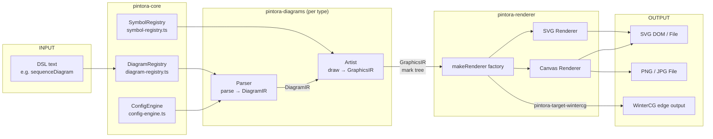
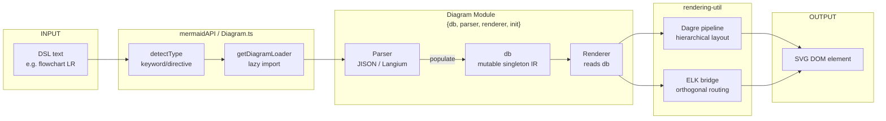
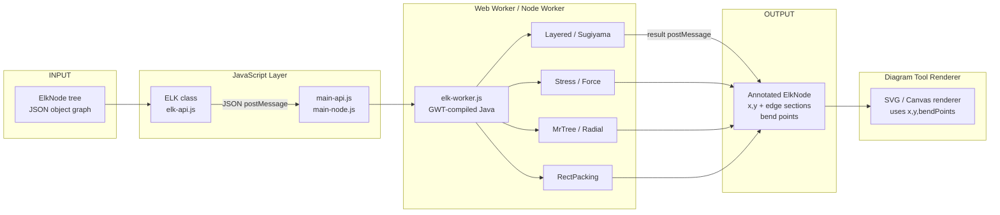

```mermaid
flowchart LR
    subgraph INPUT
        A[FSL string\ne.g. Red -> Green -> Yellow -> Red;]
    end

    subgraph PARSE["Parse Stage"]
        B[fsl_parser.peg\nPEG Grammar]
        C[JssmParseTree]
    end

    subgraph COMPILE["Compiler - jssm_compiler.ts"]
        D[Stage 1: Group Registry]
        E[Stage 2: Group Fan-out]
        F[Stage 3: Rule Compilation]
        G[Stage 4: Conflict Resolution]
        H[JssmGenericConfig]
    end

    subgraph RUNTIME["Runtime - Machine class"]
        I[_states Map\n_edges Array\n_edge_map Map\ninterners]
    end

    subgraph VIZ["Visualization Pipeline"]
        J[machine_to_dot\nDOT string]
        K["@viz-js/viz\nGraphviz WASM"]
        L[SVG XML]
    end

    subgraph OUTPUT
        M[SVG DOM element]
        N[PNG / JPEG file]
    end

    A --> B
    B --> C
    C --> D
    D --> E
    E --> F
    F --> G
    G --> H
    H --> I
    I --> J
    J --> K
    K --> L
    L --> M
    L --> N
```

# Weekly Diagram Tooling Scan — 2026-06-18

> Khoảng thời gian scan: 2026-06-11 → 2026-06-18  
> Data source: GitHub topic/keyword search + ecosystem activity checks  
> Repos phân tích sâu: 4 / ~12 candidates ban đầu

---

## Executive Summary

- **hikerpig/pintora** là text-to-diagrams extensible nhất trong tầm sao vừa (1.3k stars): monorepo 9 package, GraphicsIR scene-graph độc lập backend, pattern `Parser → DiagramIR → Artist → GraphicsIR → Renderer` rất sạch và đáng học cho kymo.
- **mermaid-js/mermaid** vừa push 8+ commit trong 7 ngày — đáng chú ý nhất: DAGRE pipeline normalization (chia sẻ painting/node handling giữa các diagram type) và ELK cyclic-entry fix; 31 diagram type, mỗi type là module {db + parser + renderer} hoàn toàn độc lập.
- **kieler/elkjs** (v0.12.0, pushed 2026-06-10) là cách duy nhất để dùng toàn bộ Eclipse Layout Kernel trong browser/Node — layered (Sugiyama), stress, mrtree, radial, force, rectpacking — compile từ Java sang WASM-like qua GWT, Web Worker native; đây là thư viện layout algorithm cốt lõi cho bất kỳ diagram tool nào cần auto-layout nghiêm túc.
- **StoneCypher/jssm** implement FSL DSL bằng PEG grammar với 3 loại arrow (`->` / `=>` / `~>`) encode *semantic ý định* (legal / canonical / forced), DSL + runtime + diagram là 1 — không thể drift, rất đáng học về DSL design cho state machine diagram trong kymo.

---

## Table of Contents

1. [hikerpig/pintora](#1-hikerpigpintora)
2. [mermaid-js/mermaid](#2-mermaid-jsmermaid)
3. [kieler/elkjs](#3-kielerflkjs)
4. [StoneCypher/jssm](#4-stonecypherjssm)

---

## 1. hikerpig/pintora

### §1 — QUICK CONTEXT

**One-line pitch:** Text-to-diagrams extensible browser+Node — cạnh tranh Mermaid bằng plugin architecture và clean SVG output không pollute global style.

- **Tech stack:** TypeScript (monorepo Yarn workspaces), 9 packages; output SVG/Canvas (browser) + PNG/JPG/SVG (Node.js)
- **Repo health:** 1,284 stars, ~10 contributors, last push 2026-06-15, có CI/tests (pintora-harness package + `__tests__` trong từng package)
- **Distribution:** npm (`@pintora/standalone`), VSCode extension

---

### §2 — ARCHITECTURE DEEP-DIVE

#### A. Component Inventory

| Component | Path | Vai trò |
|---|---|---|
| `Core` | `packages/pintora-core/src/` | Config engine, diagram registry, symbol registry, theme, base types |
| `DiagramRegistry` | `packages/pintora-core/src/diagram-registry.ts` | Lookup table DSL-type-name → {parser, artist} |
| `SymbolRegistry` | `packages/pintora-core/src/symbol-registry.ts` | Shape/icon library có thể extend |
| `DiagramIR types` | `packages/pintora-core/src/type.ts` | Generic interface `IDiagramParser<D>` + `IDiagramArtist<D,Config>` |
| `GraphicsIR` | `packages/pintora-core/src/types/graphics.ts` | Scene graph với 11 mark types |
| `Diagrams` | `packages/pintora-diagrams/src/` | 8 diagram type implementations (sequence, er, component, activity, mindmap, gantt, dot, class) |
| `Renderer` | `packages/pintora-renderer/src/index.ts` | Factory `makeRenderer(ir, type)` → `BaseRenderer` subclass |
| `CLI` | `packages/pintora-cli/` | Entry point `pintora render` |
| `Standalone` | `packages/pintora-standalone/` | Bundle cho browser, tất cả diagram types |
| `WinterCG target` | `packages/pintora-target-wintercg/` | Edge runtime (Cloudflare Workers, Deno Deploy) |

#### B. Pipeline / Control Flow

1. User chạy `pintora render input.pintora -o output.svg` (CLI) hoặc gọi `pintora.renderTo(text, {container})` (browser)
2. `pintora-core` đọc type marker ở đầu text (e.g. `sequenceDiagram`) → lookup `DiagramRegistry`
3. Registry trả về `{parser, artist}` tương ứng, parser được gọi: `parser.parse(text) → DiagramIR`
4. Artist nhận `DiagramIR`, chạy manual layout (tùy từng diagram type) → trả về `GraphicsIR` (scene graph mark tree)
5. `makeRenderer(graphicsIR, rendererType)` tạo SVG renderer hoặc Canvas renderer
6. Renderer traverse mark tree, emit SVG elements hoặc Canvas calls → output file/DOM node

#### C. Data Model / Intermediate Representation

**DiagramIR:** Generic type `D` — mỗi diagram type tự define IR của mình (e.g. `SequenceDiagramIR` chứa actors, messages, loops, notes; `ErDiagramIR` chứa entities, relationships). Không có shared graph IR chung — mỗi type hoàn toàn tự quản.

**GraphicsIR:** Scene graph tree, immutable sau khi artist tạo ra.  
11 mark primitives: `rect` | `circle` | `ellipse` | `line` | `polyline` | `polygon` | `path` | `text` | `marker` | `symbol` | `group`  
Coordinate: 2D Cartesian, BBox = `{minX, minY, maxX, maxY, width, height}`  
Styles qua `MarkAttrs`: fill, stroke, opacity, fontSize, fontFamily, fontWeight, textAlign, lineDash, shadow, v.v.

Pattern: **Immutable transformation** — `draw(diagramIR) → GraphicsIR`, không mutate.

**Không có** concept "compile to lower IR" như D2's TALA. Chỉ có 2 IR: DiagramIR (domain-specific) → GraphicsIR (rendering-ready).

#### D. Input Language Design

Mỗi diagram type có parser riêng. Không có grammar formal duy nhất.  
Ví dụ sequence diagram syntax:
```
sequenceDiagram
  Alice->Bob: Hello
  Bob->Alice: Hi
```

**Parser approach:** Không xác định từ source (file parser.ts không fetch được trực tiếp, nhưng dựa vào tên file và Mermaid inspiration — nhiều khả năng là custom recursive descent hoặc nearley.js).  
**Error reporting:** Không xác định từ code đọc được.

#### E. Layout Algorithm

**Không dùng auto layout engine chung.** Mỗi diagram artist tự implement layout:
- **Sequence:** Vertical position tracker + `calculateActorMargins()` cho horizontal spacing; self-message dùng curved path; loop/alt/opt tracked trên stack, bounds expand khi add items
- **DOT diagram:** Delegate ra Graphviz-compatible DOT renderer (pintora-diagrams/src/dot/)
- **MindMap, Gantt, ER:** Custom layout logic riêng trong từng artist

**Edge routing:** Straight lines cho hầu hết; curved paths cho self-messages trong sequence.  
**Crossing minimization:** Không xác định (không có evidence trong code đọc được).

#### F. Rendering / Output Strategy

- **Browser:** SVG renderer (DOM append) + Canvas renderer (2D context)
- **Node.js:** SVG file, PNG, JPG (dùng canvas hoặc sharp)
- **WinterCG:** Edge runtime target riêng (`pintora-target-wintercg`)
- **Animation:** Không có built-in animation
- **Pattern:** Pluggable emitter — `makeRenderer(ir, RendererType)` factory, `BaseRenderer` abstract class cho subclassing

#### G. Extensibility

- **Plugin system:** `DiagramRegistry` cho phép register diagram type mới bằng cách provide `{parser, artist}`
- **SymbolRegistry:** Add custom shapes/icons
- **Theme:** `themes/` trong pintora-core, configurable qua config engine
- **WinterCG target:** Suggest tác giả đang port sang edge runtime — extensible ở deployment level

#### H. Dev Experience

- **CLI:** `pintora-cli` package, syntax `pintora render`
- **IDE:** VSCode extension có
- **Watch mode:** Không xác định
- **Browser preview:** `@pintora/standalone` cho browser embed
- **Harness:** `pintora-harness` package — có lẽ là visual regression test/golden file framework

---

### §3 — ARCHITECTURE DIAGRAM



---

### §4 — VERDICT

**Điểm đáng học cho kymostudio:**
- `IDiagramParser<D>` + `IDiagramArtist<D,Config>` generic interface pattern — rất clean, kymo có thể dùng pattern này để register các diagram type mới mà không couple vào core
- **GraphicsIR với 11 mark primitives** là backend-agnostic scene graph chuẩn — học cách thiết kế IR này để kymo có thể render cùng IR ra SVG, Canvas, và PDF mà không đổi logic layout
- `SymbolRegistry` pattern cho extensible shapes — áp dụng được nếu kymo cần user-defined icons/shapes
- `pintora-target-wintercg` cho thấy kiến trúc đủ sạch để port sang edge runtime — target cho kymo nếu muốn serverless rendering

**Red flags:**
- Sequence artist dùng manual bump-down vertical tracker — không scale tốt cho large/nested diagrams, không có crossing minimization
- Thiếu formal grammar document — khó onboard contributor mới vào parser logic
- Parser approach không rõ (không fetch được trực tiếp)

**Open questions:** Làm sao `pintora-target-wintercg` handle font metrics mà không có DOM? SVG text layout cần font data.

**Verdict: STUDY DEEPER** — GraphicsIR design và plugin registration pattern trực tiếp áp dụng được cho kymo architecture.

---

## 2. mermaid-js/mermaid

### §1 — QUICK CONTEXT

**One-line pitch:** Markdown-like text-to-diagrams benchmark — 31 diagram types, embedded trong GitHub, tích hợp rộng nhất trong ecosystem.

- **Tech stack:** TypeScript, D3.js, Dagre (default layout), ELK (optional), Cytoscape; output SVG
- **Repo health:** 88,678 stars, 800+ contributors, pushed 2026-06-16 active, có CI (Vitest, Playwright E2E)
- **Distribution:** npm (`mermaid`), CDN jsdelivr/unpkg, mermaid.live editor

---

### §2 — ARCHITECTURE DEEP-DIVE

#### A. Component Inventory

| Component | Path | Vai trò |
|---|---|---|
| `mermaidAPI` | `packages/mermaid/src/mermaidAPI.ts` | Public API, init, render entrypoint |
| `Diagram` | `packages/mermaid/src/Diagram.ts` | Factory class, orchestrate parse→render pipeline |
| `diagram-api` | `packages/mermaid/src/diagram-api/` | Type contracts cho diagram modules |
| `diagrams/` | `packages/mermaid/src/diagrams/` | 31 diagram type implementations |
| `rendering-util` | `packages/mermaid/src/rendering-util/` | Shared render helpers (dagre pipeline, ELK bridge, node painting) |
| `config` | `packages/mermaid/src/config.ts` | Runtime config merge |
| `defaultConfig` | `packages/mermaid/src/defaultConfig.ts` | Theme/layout defaults |
| `themes/` | `packages/mermaid/src/themes/` | Color themes (default, dark, forest, neutral, base) |
| `schemas/` | `packages/mermaid/src/schemas/` | JSON Schema cho config validation |
| `accessibility` | `packages/mermaid/src/accessibility.ts` | ARIA label injection |

#### B. Pipeline / Control Flow

1. User calls `mermaid.render('id', text)` hoặc `mermaid.init()` trên DOM
2. `mermaidAPI.render()` → `Diagram.fromText(text)` được gọi
3. `Diagram.fromText()` chạy `detectType(text, config)` → identify diagram type từ directive/keyword ở đầu text
4. `getDiagramLoader(type)` trả về lazy-load function → `{db, parser, renderer, init}` được import động
5. `parser.parse(text)` populate `db` (diagram-type-specific in-memory store)
6. `renderer.draw(text, elementId, version, diagramInstance)` → renderer đọc từ `db`, chạy layout, emit SVG vào DOM element
7. SVG element được inject vào container, sanitize, accessibility labels added

#### C. Data Model / Intermediate Representation

**Mermaid không có shared IR.** Mỗi diagram type dùng `db` module (singleton in-memory store) riêng. Ví dụ:
- `flowchart/db.ts`: nodes Map, edges array, subgraphs array
- `sequence/db.ts`: actors Map, messages array, loops stack
- `er/db.ts`: entities Map, relationships array, (sau 7 ngày qua: subgraphs)

**Mutation model:** `db` là **mutable singleton** — parser ghi vào db, renderer đọc từ db. Không immutable transform. Đây là design debt lớn (khó test, khó parallel render).

**Không có concept "lower IR compile"** — diagram-type-specific db là IR duy nhất, renderer đọc trực tiếp.

#### D. Input Language Design

**Mỗi diagram type có grammar/parser riêng.** Cách tiếp cận:
- Flowchart, sequence: **JISON** parser (compile-time generated) — `.jison` grammar files
- Một số type mới hơn (C4, packet): đang migrate sang **Langium** (TypeScript-native parser framework với formal grammar)
- Recents (7 ngày qua): C4 parser converted to TypeScript

**Error reporting:** Thông thường JISON throw generic parse error với line number — không rất informative. Langium migration đang improve điều này.

#### E. Layout Algorithm

Mermaid có **2 layout engine cho flowchart:**

1. **Dagre** (default): Hierarchical layout, Sugiyama method, JavaScript port — được dùng cho phần lớn diagram types
2. **ELK** (opt-in `%%{init: {"flowchart": {"defaultRenderer": "elk"}}}%%`): Gọi elkjs, support complex orthogonal routing, port constraints

7 ngày qua có:
- **Dagre pipeline normalization** (`rendering-util/`): layout data normalization + shared painting/node handling extracted — đây là refactor quan trọng, các diagram type giờ dùng shared helper thay vì copy-paste
- **ELK pin cyclic entry fix**: bug trong ELK renderer khi có cyclic entry points

**Edge routing:** Dagre = spline/polyline; ELK = orthogonal routing với port constraints.  
**Crossing minimization:** Dagre dùng barycentric heuristic (Sugiyama layer 2); ELK dùng Sugiyama layered với proper crossing minimization.

#### F. Rendering / Output Strategy

- **Backend duy nhất:** SVG (inject vào DOM)
- **Không có Canvas/PNG backend** trong core — server-side dùng puppeteer/playwright headless
- **Animation:** Không trong core; sequence diagram có activations (static box)
- **Theming:** CSS classes + inline style, 5 built-in themes

#### G. Extensibility

- **Custom diagram types** qua `mermaid.registerExternalDiagrams()` hoặc monorepo package
- **Custom themes** qua config
- **Không có** official plugin registry

#### H. Dev Experience

- **Live editor:** mermaid.live với real-time preview
- **IDE:** VS Code extension (Markdown preview), GitHub native support
- **CLI:** `@mermaid-js/mermaid-cli` (mmdc) — dùng Puppeteer, nặng
- **Watch mode:** Không built-in trong CLI

---

### §3 — ARCHITECTURE DIAGRAM



---

### §4 — VERDICT

**Điểm đáng học cho kymostudio:**
- **Dagre pipeline normalization pattern** (7 ngày qua): Mermaid đang extract shared `painting/node handling` vào `rendering-util/` — đây là cách đúng để scale multi-diagram-type codebase; kymo nên làm tương tự từ sớm thay vì copy-paste render logic
- **Lazy diagram type loading** qua `getDiagramLoader()` — tree-shaking friendly, chỉ load code của diagram type user cần
- **Dual layout engine** (Dagre default, ELK opt-in) — pattern hay: light engine default, heavy engine opt-in khi cần complex layout

**Red flags:**
- **Mutable singleton `db`** per diagram type là antipattern lớn — khó test (cần reset giữa test cases), khó parallel render, impossible để render 2 instance cùng lúc
- JISON parser legacy — old tooling, binary format, hard to debug grammar errors
- 31 diagram types = 31 silo codebase — consistency khó maintain dù đang refactor

**Open questions:** ELK cyclic entry fix ở commit gần nhất ám chỉ gì về edge case trong layout khi có circular dependencies? Kymo sẽ gặp vấn đề tương tự.

**Verdict: GLANCE ONLY** — quá lớn để study deep; học pattern cụ thể (lazy loading, rendering-util extraction) thì có, học architecture tổng thể thì không — quá nhiều legacy debt.

---

## 3. kieler/elkjs

### §1 — QUICK CONTEXT

**One-line pitch:** Eclipse Layout Kernel compiled sang JavaScript — 9 layout algorithms nghiêm túc (Sugiyama layered, force, mrtree, rectpacking) cho browser/Node, không phải diagram tool mà là layout engine thuần.

- **Tech stack:** Java (ELK core) → GWT compiler → JavaScript; wrapping layer JS/TypeScript; output: annotated graph object (x/y positions)
- **Repo health:** 2,622 stars, ~30 contributors, v0.12.0 pushed 2026-06-10, có CI (Mocha + Chai)
- **Distribution:** npm (`elkjs`), Web Worker bundle, browser bundle (Browserify)

---

### §2 — ARCHITECTURE DEEP-DIVE

#### A. Component Inventory

| Component | Path | Vai trò |
|---|---|---|
| `ELK Java core` | `src/java/org/eclipse/elk/` | Toàn bộ layout algorithms viết bằng Java |
| `Java additional` | `src/java-additional/org/eclipse/elk/` | Supplementary Java (GWT bridge?) |
| `elk-api.js` | `src/js/elk-api.js` | JavaScript API layer — defines `ELK` class, `layout()` method contract |
| `main-api.js` | `src/js/main-api.js` | Concrete implementation, bridge sang GWT worker |
| `main-node.js` | `src/js/main-node.js` | Node.js entry — use `web-worker` polyfill |
| `elk-worker.js` | `lib/elk-worker.js` (generated) | GWT-compiled layout engine, runs in Web Worker |
| `elk.bundled.js` | `lib/elk.bundled.js` (generated) | Browserify bundle, self-contained |

#### B. Pipeline / Control Flow

1. User khởi tạo `const elk = new ELK({ defaultLayoutOptions: {...} })`
2. Gọi `elk.layout(graph)` với `ElkNode` tree (nodes có children, edges, ports)
3. `main-api.js` serialize graph thành JSON, postMessage sang Web Worker (`elk-worker.js`)
4. Web Worker (GWT-compiled Java) run layout algorithm, compute `{x, y, width, height}` cho mọi node/edge section/label
5. Worker postMessage result back, `layout()` Promise resolves với annotated graph
6. Caller diagram tool đọc `node.x`, `node.y`, `edge.sections[].bendPoints` để vẽ

**Node.js path:** Thay Web Worker bằng `web-worker` npm polyfill (same-thread hoặc worker_threads).

#### C. Data Model / Intermediate Representation

**ElkNode** (input + output):
```typescript
{
  id: string,
  width?: number, height?: number,        // set by caller
  x?: number, y?: number,                  // FILLED IN by elk
  children?: ElkNode[],                    // nested containers
  edges?: ElkEdge[],                       // edges owned by this container
  ports?: ElkPort[],                       // connection points on boundary
  labels?: ElkLabel[],
  layoutOptions?: Record<string, string>   // per-node layout config
}
```

**ElkEdge** (input + output):
```typescript
{
  id: string,
  sources: string[],  // port/node IDs
  targets: string[],  // port/node IDs
  sections?: ElkEdgeSection[],  // FILLED IN: [{startPoint, endPoint, bendPoints[]}]
  labels?: ElkLabel[]
}
```

**Mutable output:** ELK mutate graph object in-place (add `x,y` và `sections`). Caller nhận lại cùng reference với positions filled.

**3-tier option cascade:** constructor defaults → per-`layout()` call → per-element `layoutOptions`. Viết `elk.algorithm = "layered"` là shorthand cho `org.eclipse.elk.algorithm`.

#### D. Input Language Design

**ELK không có text DSL.** Input là pure JSON/object graph. Layout options là string key-value pairs (`"org.eclipse.elk.direction": "DOWN"`).

Tuy nhiên có **ELKT** (Eclipse Layout Kernel Text format) cho Java side — không exposed trong elkjs.

#### E. Layout Algorithm

**6 primary algorithms + 3 always-loaded:**

| Algorithm | Type | Best for |
|---|---|---|
| `layered` | Sugiyama hierarchical | Flowcharts, DAGs, class diagrams |
| `stress` | Force-based (stress minimization) | General graphs, network viz |
| `mrtree` | Reingold–Tilford tree | Tree structures |
| `radial` | Radial tree | Hierarchies, org charts |
| `force` | Spring-electrical | Clustered networks |
| `disco` | Connected components | Disconnected graphs |
| `rectpacking` | Rectangle packing | Container layout |
| `sporeOverlap` | Overlap removal | Post-process step |
| `sporeCompaction` | Compaction | Post-process step |

**Layered algorithm detail:** Sugiyama 4-phase — cycle removal → layer assignment (network simplex / longest path) → crossing minimization (barycentric) → node placement (BK algorithm) → edge routing (orthogonal / spline).

**Edge routing:** ELK layered hỗ trợ orthogonal routing với proper bend-point minimization — đây là feature mà Dagre thiếu.  
**Port constraints:** `FREE`, `FIXED_SIDE`, `FIXED_ORDER`, `FIXED_RATIO`, `FIXED_POS` — quan trọng cho UML-style diagrams.

#### F. Rendering / Output Strategy

**ELK không render.** Output là annotated JSON với positions — caller (diagram tool) phải tự vẽ từ `x,y,sections[].bendPoints`.

#### G. Extensibility

- Layout options rất nhiều (~200+ options documented) — cấu hình được từ padding, spacing, direction tới advanced crossing minimization heuristics
- Algorithm thêm mới bằng cách extend Java class và recompile — không dễ cho end user

#### H. Dev Experience

- **API clean:** `elk.layout(graph)` returns Promise — non-blocking, Web Worker transparent
- **Documentation:** Eclipse project có full docs tại eclipse.dev/elk
- **No CLI/watch mode** — pure library
- **TypeScript types:** `@types/elkjs` available (community)

---

### §3 — ARCHITECTURE DIAGRAM



---

### §4 — VERDICT

**Điểm đáng học cho kymostudio:**
- **ELK là câu trả lời đúng cho auto-layout** nếu kymo cần hierarchical layout với orthogonal edge routing — đừng implement Sugiyama từ đầu, dùng elkjs
- **Port constraints** (`FIXED_SIDE`, `FIXED_ORDER`) cực kỳ quan trọng cho UML class/component diagram — ELK xử lý đúng, Dagre không có
- **3-tier layout option cascade** (constructor → call → element) là pattern tốt để expose layout tuning cho user mà không phức tạp hóa API
- **Web Worker pattern** giải phóng main thread khi layout phức tạp — kymo nên adopt từ sớm nếu diagram lớn

**Red flags:**
- **GWT compilation** làm bundle to (~1.5MB elk.bundled.js) — cold start browser nặng
- **Java source dependency** — contribute/fix bug trong layout algorithm đòi hỏi rebuild Java + GWT, không friendy với JS contributor
- `@types/elkjs` là community types, không official — có thể lag API

**Open questions:** ELK 0.12.0 có gì mới so với 0.11.x? Changelog không đọc được từ search results. Cần check release notes.

**Verdict: STUDY DEEPER** — nếu kymo cần auto-layout cho bất kỳ diagram type nào phức tạp hơn tree, elkjs là dependency đáng dùng thẳng. Học API và option cascade kỹ.

---

## 4. StoneCypher/jssm

### §1 — QUICK CONTEXT

**One-line pitch:** FSM library với DSL riêng (FSL) mà 3 loại arrow encode *semantic* transition — runtime và diagram không thể drift vì cùng một source.

- **Tech stack:** TypeScript (PEG.js grammar), Graphviz via `@viz-js/viz` (WASM), Lit web components; output SVG/PNG/JPEG
- **Repo health:** 366 stars, ~5 contributors, pushed 2026-06-16, **7,228 tests ở 100% line coverage**, CI với fast-check fuzz testing
- **Distribution:** npm (`jssm`), ES6 + CommonJS + IIFE formats, Deno compatible

---

### §2 — ARCHITECTURE DEEP-DIVE

#### A. Component Inventory

| Component | Path | Vai trò |
|---|---|---|
| `PEG Grammar` | `src/ts/fsl_parser.peg` | Formal PEG grammar cho FSL DSL |
| `FSL Parser` | `src/ts/fsl_parser.ts` | Generated từ .peg, emit `JssmParseTree` |
| `Compiler` | `src/ts/jssm_compiler.ts` | ParseTree → `JssmGenericConfig` (4-stage pipeline) |
| `Machine` | `src/ts/jssm.ts` | Core class, runtime FSM + hook system |
| `Arrow handler` | `src/ts/jssm_arrow.ts` | Normalize arrow type variants (unicode etc.) |
| `Internals` | `src/ts/jssm_intern.ts` | Numeric interning cho state/action (perf) |
| `Visualizer` | `src/ts/jssm_viz.ts` | Machine → DOT → SVG pipeline |
| `Viz colors` | `src/ts/jssm_viz_colors.ts` | Color theme per state kind |
| `Theme` | `src/ts/jssm_theme.ts` + `themes/` | Visual themes |
| `CLI` | `src/ts/cli/` | Dispatcher architecture |
| `Web Components` | `src/ts/wc/` | Lit-based `<jssm-machine>` element |

#### B. Pipeline / Control Flow

1. User viết FSL string: `` sm`Red -> Green -> Yellow -> Red;` `` (tagged template literal)
2. `fsl_parser.peg` (PEG grammar) parse string → `JssmParseTree` (raw parse tree)
3. `jssm_compiler.ts` transform parse tree qua 4 stages → `JssmGenericConfig` (resolved config)
4. `Machine<mDT>` constructor nhận config, build:
   - `_states` Map (state descriptors)
   - `_edges` Array (transition objects)
   - `_edge_map` Map (O(1) lookup by source+target pair)
   - State/action interners (numeric ID cho perf)
5. Runtime: `machine.transition('action')` hoặc `machine.go('state')` → check legality → mutate current state → fire hooks
6. Visualization: `machine_to_dot(machine)` → DOT string → `viz.renderString(dot, {format:'svg'})` → SVG XML

#### C. Data Model / Intermediate Representation

**`JssmParseTree`:** Raw output từ PEG parser — array của rule nodes (transitions, declarations, config blocks).

**`JssmGenericConfig`** (sau compiler):
```typescript
{
  start_states, end_states, failed_outputs: string[],
  transitions: JssmTransition[],      // from, to, action, probability, forced_only
  state_property: Map<state, props>,
  group_registry: Map<name, string[]>,
  group_hooks, state_hooks,
  default_graph_config, default_state_config, default_transition_config,
  name, version, author, license       // machine metadata
}
```

**`Machine._states` Map:** `state_name → JssmGenericState {from: string[], to: string[], ...style}`

**`Machine._edge_map`:** Key = `pair_key(from, to)` → O(1) transition lookup.

**Interning:** State names và action names đều được intern thành số integers (`_state_interner`, `_action_interner`) — giải thích tại sao "tens of millions of transitions/second."

**Mutability:** `Machine` instance **mutable** (current state thay đổi khi transition). Config và parse tree immutable sau khi build.

#### D. Input Language Design

**PEG grammar** (`fsl_parser.peg`) — formal, traceable, có thể regenerate parser từ grammar.

**3 arrow types (semantic encoding):**

| Arrow | Unicode alt | Nghĩa |
|---|---|---|
| `->` | `←`, `<->` | *Legal* transition — có thể xảy ra |
| `=>` | `⇒`, `<=>` | *Main-path* transition — canonical happy path |
| `~>` | `↛`, `<~>` | *Forced* transition — chỉ xảy ra qua explicit `force_transition()` |

**Bidirectional arrows:** `<->`, `<=>`, `<~>` define cả 2 chiều cùng lúc.

**Decorations trên transition:**
```
'action_name' after 500ms { description }
```

**Group syntax:**
```
&TrafficGroup : [Red, Yellow, Green];
&TrafficGroup -> Off;  // fan-out: Red -> Off; Yellow -> Off; Green -> Off;
```

**Compiler phase 2 (group fan-out):** Group reference SOURCE được expand thành N transition nodes (một per member). Specificity-based conflict resolution khi có overlap.

**Error reporting:** Không xác định chi tiết — PEG parser nói chung có decent error messages với line/column.

#### E. Layout Algorithm

**Delegate hoàn toàn sang Graphviz.** `machine_to_dot()` emit DOT format, `@viz-js/viz` (Graphviz compiled to WASM) run layout.

Layout engine có thể chọn: `dot` (hierarchical), `neato` (spring), `circo` (circular), `fdp` (force-directed), `sfdp` (large-scale spring), tùy param `engine` trong `dot_to_svg()`.

**Cluster groups:** Khi FSL khai báo groups, render thành Graphviz `subgraph cluster_<group>` — automatic bounding boxes quanh related states.

**Không implement layout thuần.** Toàn bộ delegate Graphviz.

#### F. Rendering / Output Strategy

- **Pipeline:** FSL → DOT string → Graphviz WASM (`@viz-js/viz`) → SVG XML string
- **Browser:** Parse SVG string → `SVGSVGElement` DOM node
- **Node.js:** Cần inject `DOMParser` qua `configure()`, hoặc dùng `xmldom`
- **Output formats:** SVG, PNG, JPEG (qua canvas conversion)
- **Animation:** Không có
- **Caching:** `viz` instance cached để tránh re-init WASM

**Highlight:** DOT generation có rich styling — per-state fill color theo kind (final/complete/terminal/base), per-edge label styling, custom graph/node/edge default config blocks.

#### G. Extensibility

- **Custom themes** qua theme system
- **Web components** (`<jssm-machine>`) cho embed dễ
- **CLI** dispatcher pattern — có thể add sub-commands

#### H. Dev Experience

- **100% test coverage** — 7,228 tests + fuzz testing với fast-check
- **Tagged template literal API** (`sm\`FSL here\``) — elegant developer UX
- **CLI:** Dispatcher architecture, có visual output
- **Web component** sẵn dùng với Lit
- **3 distribution formats** (ES6/CJS/IIFE) — flexible deployment

---

### §3 — ARCHITECTURE DIAGRAM



---

### §4 — VERDICT

**Điểm đáng học cho kymostudio:**
- **3-arrow semantic encoding** (`->` / `=>` / `~>`) là DSL design decision xuất sắc — encode không chỉ *structure* mà còn *intent* vào syntax; nếu kymo làm state machine diagram, copy quy ước này hoàn toàn
- **PEG grammar với formal .peg file** — rõ ràng, testable, regeneratable; contrast với Mermaid JISON legacy; nên dùng PEG hoặc Langium cho mọi DSL trong kymo
- **4-stage compiler pipeline** (Group Registry → Fan-out → Rule Compile → Conflict Resolution) là cách đúng để handle DSL với group/macro expansion trước khi build IR
- **100% coverage + fuzz testing pattern** — fast-check cho DSL parser là gold standard, áp dụng cho kymo parser
- **Tagged template literal API** (`sm\`...\``) — minimal friction developer UX, có thể dùng cho kymo embedding API

**Red flags:**
- **Graphviz WASM bundle** (~5MB viz.js) — sẽ là vấn đề cold start trên web nếu không lazy load
- **Node.js cần inject DOMParser** — awkward workaround cho server-side rendering
- 366 stars suggest niche adoption dù code quality rất cao

**Open questions:** Tại sao không dùng ELK hoặc Dagre thay vì Graphviz cho layout? Graphviz DOT engine (hierarchical) cho FSM tốt nhưng không control được nhiều; ELK layered sẽ cho port constraints tốt hơn.

**Verdict: STUDY DEEPER** — DSL design pattern (PEG grammar + 4-stage compiler + semantic arrow types) và 100% coverage approach đều trực tiếp áp dụng cho kymo DSL parser layer.

---

*Scan generated: 2026-06-18 | Branch: claude/adoring-wozniak-fz1dpe*
