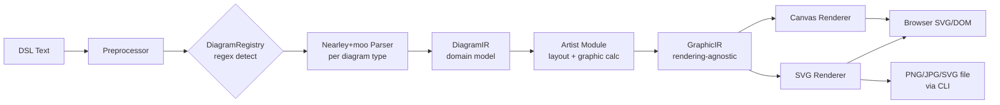
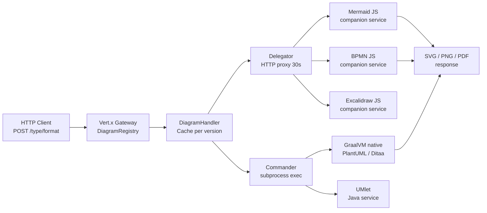

```mermaid
flowchart LR
    Raster[Raster logo\nPNG/JPG/WebP] --> Trace[raster_logo_trace.py\nanalysis + actor decomp]
    Trace --> Fit[render_overlay.py\niterative IoU fitting ≤10x\nPillow overlay + smoothness gate]
    Fit --> Audit[svg_path_audit.py\nBezier smoothness QA]
    Audit --> Ribbon[fit_ribbon_centerline.py\nself-crossing paths optional]
    Ribbon --> LogoSVG[logo.svg\nstable actor IDs]
    LogoSVG --> Animate[animate_svg_showcase.py\nCSS choreography + HTML showcase]
    Animate --> Capture[capture_motion_frames.py\nPlaywright Chromium frame strip]
    Capture --> Probe[probe_motion_continuity.py\neasing + ink-delta verify]
    Probe --> Artifacts[logo_motion.html\nmotion.css\nmotion_spec.md\nQA evidence PNGs]
```

# Weekly Diagram Tooling Scan — 2026-06-19

> Scout chu kỳ: diagram-as-code, animation, rendering craft.  
> Data source: GitHub topic search + keyword search, tuần 2026-06-12 → 2026-06-19.

---

## Executive Summary

- **merman** (Latias94/merman, Rust) là điểm nổi bật nhất tuần này: headless Mermaid re-implementation với hai-tầng IR, Dagre port viết lại bằng Rust, và WASM + UniFFI multi-binding story. Đây là reference architecture nếu kymo cần cross-platform diagram rendering không phụ thuộc browser.
- **pintora** (hikerpig/pintora, TypeScript) thể hiện extensible plugin pattern tốt nhất trong ecosystem: Nearley+moo grammar, registry triples, dual IR (DiagramIR → GraphicIR) tách biệt domain model và visual model — đáng study để thiết kế extension API cho kymo.
- **kroki** (yuzutech/kroki, Java+JS) dạy federation pattern ngược lại: không xây engine, chỉ orchestrate 25+ backends qua Commander/Delegator — hữu ích nếu kymo cần route nhiều diagram DSL từ một API gateway.
- **pixel2motion** (nolangz/pixel2motion, Python) repo mới nhất (tạo 2026-06-12, 798 stars) với golden-ratio CSS choreography pipeline + deterministic QA bằng Playwright; kỹ thuật draw-on + shared clock + easing verification đáng áp dụng trực tiếp cho kymo animation layer.

---

## Table of Contents

1. [hikerpig/pintora](#1-hikerpigpintora)
2. [Latias94/merman](#2-latias94merman)
3. [yuzutech/kroki](#3-yuzutechkroki)
4. [nolangz/pixel2motion](#4-nolangzpixel2motion)

---

## 1. hikerpig/pintora

### §1 — Quick Context

**One-line pitch:** Library TypeScript text-to-diagram extensible, chạy đồng thời browser+Node.js, cho phép third-party viết và phân phối diagram type mới như npm package — khác Mermaid ở plugin-first architecture thay vì monolithic diagram set.

| Dimension | Value |
|-----------|-------|
| Language | TypeScript 74%, JavaScript, Nearley grammar |
| Key deps | nearley (parser), moo (lexer), pnpm monorepo |
| Output formats | SVG, Canvas (browser); PNG, JPG, SVG (Node.js CLI) |
| Stars / Contributors | 1284 ★ / actively maintained |
| Last push | 2026-06-18 |
| CI/Tests | Có (GitHub Actions, test-shared package, harness/) |
| Distribution | npm: `@pintora/standalone`, `@pintora/cli`; VSCode extension |

### §2 — Architecture Deep-Dive

#### A. Component Inventory

- `pintora-core` (`packages/pintora-core/src/index.ts`) — Registry engine: `diagramRegistry`, `symbolRegistry`, `themeRegistry`; hàm orchestrator `parseAndDraw()`; định nghĩa `DiagramIR`, `GraphicIR`, `DrawOptions`, event system.
- `pintora-diagrams` (`packages/pintora-diagrams/src/`) — Triển khai 8 diagram types: `sequence`, `er`, `component`, `activity`, `mindmap`, `gantt`, `dot`, `class`. Mỗi type là một module độc lập gồm parser + artist.
- `pintora-renderer` (`packages/pintora-renderer/`) — Output backends: SVG renderer, Canvas renderer.
- `pintora-cli` (`packages/pintora-cli/`) — Entry point Node.js, file I/O.
- `pintora-standalone` (`packages/pintora-standalone/`) — Bundle duy nhất cho browser, bọc toàn bộ stack.
- `pintora-target-wintercg` — Runtime target cho WinterCG-compliant environments (Cloudflare Workers, etc.).

#### B. Pipeline / Control Flow

1. User chạy `pintora render diagram.pintora -o out.svg` (CLI) hoặc gọi `pintora.renderTo(code, config)` (browser).
2. `parseAndDraw()` trong `pintora-core` nhận raw text, chạy **preprocessor** (strip comments, resolve directives).
3. `diagramRegistry.detectDiagram(text)` khớp regex đầu file (vd. `/^\s*sequenceDiagram/`) để xác định diagram type.
4. Diagram type's **parser** (Nearley + moo lexer) parse text thành `DiagramIR` — data model domain-specific.
5. Diagram type's **artist** nhận `DiagramIR`, tính toán layout, xuất `GraphicIR` — rendering-agnostic graphic instructions.
6. `pintora-renderer` nhận `GraphicIR`, emit ra SVG element tree hoặc Canvas draw calls.
7. Output file hoặc DOM node được trả về / ghi ra đĩa.

#### C. Data Model / IR

Hai tầng IR tách biệt rõ ràng:
- **`DiagramIR`** — per-diagram, chứa domain concepts (participants, signals, nodes, edges). Mutable trong quá trình parse, frozen sau khi parse xong.
- **`GraphicIR`** — rendering-agnostic, chứa shapes, text nodes, paths với tọa độ tuyệt đối. Là "compiled output" của artist stage.

Pattern này tương tự D2's internal/external IR split. Không có bằng chứng "compile to lower IR" nhiều tầng như D2's TALA.

#### D. Input Language Design

- **Parser approach:** Nearley grammar (`.ne` files) + moo stateful lexer. Nearley là parser combinator-style dựa trên Earley algorithm — xử lý được ambiguous grammar, nhưng chậm hơn PEG trên large input.
- **Grammar formal:** Có `.ne` files chính thức (vd. `sequenceDiagram.ne`) — evidence rõ ràng, đọc được.
- **Detection:** Regex line-based per diagram type — đơn giản, không có formal dispatch grammar.
- **Error reporting:** Qua `DrawOptions.errorHandler` callback — error được forwarded ra ngoài thay vì crash silent.

#### E. Layout Algorithm

- Layout xử lý bên trong mỗi **artist** module, không có unified layout engine.
- Sequence diagram: manual vertical layout theo thứ tự timeline.
- Component/activity diagram: không xác định thuật toán cụ thể từ code đọc được (cần đào sâu hơn vào từng artist).
- Edge routing: không xác định rõ từ code level đọc được.

#### F. Rendering / Output Strategy

- SVG backend (primary): DOM-free SVG generation cho Node.js via custom element builder.
- Canvas backend: HTML5 Canvas API cho browser.
- Pattern: **pluggable emitter** — `GraphicIR` làm boundary, renderer là strategy pattern.
- Animation: Không có evidence native animation support.

#### G. Extensibility

- Plugin system: Diagram type mới = register parser + artist + config schema vào `diagramRegistry`.
- Third-party npm packages có thể ship diagram types mới.
- Theme: `themeRegistry` + `ITheme` interface — theme là first-class citizen.
- Symbol: `symbolRegistry` + `SymbolDef` cho custom shapes.

#### H. Dev Experience

- VSCode extension available.
- CLI với `--help`.
- Website + live playground tại pintorajs.vercel.app.
- Watch mode: không xác định được từ data hiện có.

### §3 — Architecture Diagram



### §4 — Verdict

**Đáng học cho kymo:**
- **Dual IR pattern** (DiagramIR → GraphicIR) là separation of concern rất sạch: domain model tách khỏi rendering model. Kymo nên áp dụng pattern này nếu muốn support nhiều output backend.
- **Nearley .ne grammar files** là cách document grammar chính thức, dễ đọc hơn hardcoded parser. Đáng xem xét nếu kymo có DSL riêng.
- **Symbol/theme registry as first-class** — không phải afterthought.

**Red flags:**
- Nearley Earley algorithm chậm trên large input so với PEG/recursive descent. Nếu kymo cần real-time preview, đây là bottleneck tiềm năng.
- Artist modules không có unified layout interface — mỗi diagram type layout riêng, không reuse.

**Open questions:** Layout algorithm trong component/activity artist là gì? Có force-directed hay chỉ là manual heuristics?

**Verdict: Study deeper** — plugin architecture và dual IR design là patterns trực tiếp áp dụng cho kymo extension API.

---

## 2. Latias94/merman

### §1 — Quick Context

**One-line pitch:** Mermaid.js re-implementation hoàn toàn bằng Rust, headless (zero browser/JS dependency), xuất SVG/PNG/ASCII từ cùng một codebase với bindings WASM, Python, Flutter, Android, Apple — khác mermaid-js ở không cần Chromium headless để render.

| Dimension | Value |
|-----------|-------|
| Language | Rust (MSRV 1.95), wasm-bindgen, UniFFI |
| Key deps | `dugong` (Dagre Rust port), `manatee` (COSE/FCoSE port), `roughr-merman` (Rough.js port) |
| Output formats | SVG, PNG, JPG, PDF, ASCII/Unicode terminal, semantic JSON, layout JSON |
| Stars / Contributors | 360 ★, 1 main author + community |
| Last push | 2026-06-18 |
| CI/Tests | Có (GitHub Actions, golden snapshot fixtures/) |
| Distribution | Homebrew, Cargo, npm (WASM), PyPI, Flutter pub, Swift SPM, Android AAR |

### §2 — Architecture Deep-Dive

#### A. Component Inventory

- `merman-core` (`crates/merman-core/src/`) — Detection, parsing, metadata; định nghĩa `Engine` struct với `DetectorRegistry`, `DiagramRegistry`, `RenderDiagramRegistry`; xuất `ParsedDiagram` (semantic JSON), `ParsedDiagramRender` (typed render model).
- `merman-render` (`crates/merman-render/src/`) — Layout computation (`layout_parsed_render_layout_only()`), SVG emission, postprocessing; per-diagram modules: `flowchart`, `sequence`, `state`, `class`, `c4`, `gantt`, `pie`, `sankey`, v.v.
- `merman-ascii` (`crates/merman-ascii/`) — Terminal render từ typed models.
- `merman-cli` (`crates/merman-cli/src/main.rs`) — Entry point, modules: `cli`, `commands`, `render`, `markdown`; dùng `clap` cho argument parsing.
- `merman-ffi` — C ABI stable interface cho native hosts.
- `merman-wasm` — wasm-bindgen transport, xuất `@mermanjs/web` npm package.
- `merman-uniffi` — UniFFI surface cho Python/Flutter/Android/Apple bindings.
- `dugong` + `dugong-graphlib` — Dagre-compatible layout port, Graphlib graph container.
- `manatee` — COSE/FCoSE compound graph layout port.
- `roughr-merman` — Forked Rough.js-style renderer (hand-drawn aesthetic).

#### B. Pipeline / Control Flow

1. User chạy `merman render diagram.mmd -o out.svg` hoặc gọi Rust API / WASM binding.
2. `merman-core` `Engine::detect()` → `DetectorRegistry` xác định diagram type từ text prefix/frontmatter.
3. `DiagramRegistry::parse()` → `ParsedDiagram` (semantic JSON — JSON-compatible IR).
4. `RenderDiagramRegistry::parse_for_render_model()` → `ParsedDiagramRender` (typed render model, Rust structs).
5. `merman-render::layout_parsed_render_layout_only()` với `LayoutOptions` → `LayoutDiagram` (geometry: node bounds, edge routes, text positions).
6. SVG emitter tiêu thụ `LayoutDiagram`, emit SVG string với postprocessing metadata.
7. Output: SVG string, rasterize thành PNG/PDF, hoặc pass qua `merman-ascii` cho terminal.

#### C. Data Model / IR

Ba tầng IR rõ ràng nhất trong các repo được scan:
- **`ParsedDiagram`** — Semantic JSON, JSON-serializable, immutable sau parse. Public API stable.
- **`ParsedDiagramRender`** — Typed Rust structs, optimized cho layout engine consumption. Internal.
- **`LayoutDiagram`** — Geometry data: tọa độ tuyệt đối, edge routing paths, text measurement results.

Concept "compile to lower IR": **Có** — rõ ràng hai bước: semantic parse → layout compile → render. Tương tự D2's TALA nhưng open.

#### D. Input Language Design

- **Parser approach:** "1:1 parity với Mermaid 11.15.0" — parser được implement để match behavior của Mermaid's JavaScript parser. Không có evidence grammar formal riêng (Mermaid dùng custom recursive descent + jison historically).
- **Config parsing:** Frontmatter config extraction via `parse_metadata_*` APIs.
- **Error reporting:** Strongly-typed Rust `Result<T, E>` errors, propagated qua FFI/bindings.

#### E. Layout Algorithm

- **Flowchart/sequence:** `dugong` — Dagre-compatible layout (hierarchical Sugiyama-style, layered graph). Rust port đảm bảo "algorithm parity" với upstream JavaScript dagre.
- **Compound graphs / mindmap / architecture:** `manatee` — COSE/FCoSE force-directed compound layout.
- **ELK:** Optional feature flag `elk-layout` — `merman-layout-elk` integration point, treated as "last resort for parity" theo CONTEXT.md.
- **Text measurement:** Headless, vendored font metrics (`LayoutOptions::headless_svg_defaults()`) — không phụ thuộc browser DOM cho text sizing.
- **Edge routing:** Theo Dagre convention — orthogonal-ish polyline routing.

#### F. Rendering / Output Strategy

- **SVG:** Primary backend, Mermaid-compatible DOM parity checks.
- **Raster:** PNG/JPG/PDF via SVG rasterization pipeline (post-render).
- **ASCII:** `merman-ascii` crate, separate render path từ typed models.
- **Rough/hand-drawn:** `roughr-merman` optional — chuyển SVG paths thành hand-drawn aesthetic.
- **Animation:** Không có evidence.
- Pattern: **Pluggable rasterizer** trên top của SVG output.

#### G. Extensibility

- Feature flags (`cytoscape-layout`, `elk-layout`) để enable experimental layouts.
- Diagram type ownership model: mỗi type "sở hữu" toàn bộ stack từ parse → layout → SVG.
- Bindings: UniFFI cho Python/Flutter/Android/Apple — extensibility ở mức embedding platform.

#### H. Dev Experience

- CLI với clap — structured subcommands.
- Live playground tại frankorz.com/merman/.
- `merman-rustdoc` — render Mermaid fences trong rustdoc thành inline SVG.
- Watch mode: không xác định.

### §3 — Architecture Diagram

```mermaid
flowchart LR
    DSL[Mermaid DSL text] --> Core[merman-core\nDetectorRegistry]
    Core --> DiagReg[DiagramRegistry\n→ ParsedDiagram\nsemantic JSON]
    DiagReg --> RenderReg[RenderDiagramRegistry\n→ ParsedDiagramRender\ntyped Rust model]
    RenderReg --> Layout[merman-render\nlayout_parsed_render_layout_only\ndugong / manatee / ELK\n→ LayoutDiagram]
    Layout --> SVGEmit[SVG Emitter\n+ postprocess]
    Layout --> ASCII[merman-ascii\nterminal render]
    SVGEmit --> WASMOut[@mermanjs/web\nBrowser WASM]
    SVGEmit --> NativeBin[Native CLI\nPNG/PDF rasterize]
    SVGEmit --> FFI[C ABI / UniFFI\nPython / Flutter / Android / Apple]
```

### §4 — Verdict

**Đáng học cho kymo:**
- **Three-tier IR** (semantic JSON → typed render model → layout geometry) là pattern rất clean để tách concern. Kymo có thể adopt tier 1 làm public API (stable JSON), tier 2-3 là internal.
- **Headless font metrics**: vendored font data để tính text bounds mà không cần browser — critical nếu kymo muốn server-side rendering.
- **Dagre port trong Rust** (`dugong`): nếu kymo dùng hierarchical layout, đây là implementation đáng tham khảo thay vì wrap JS dagre.
- **UniFFI multi-binding pattern**: cùng core Rust code serve Python, Flutter, Android, WASM — architecture đáng học nếu kymo muốn cross-platform SDK.

**Red flags:**
- Repo có 1 main author, dependency nặng vào upstream Mermaid baseline — nếu Mermaid thay đổi lớn, parity effort rất cao.
- 360 stars — nhỏ, có thể bị abandon.

**Open questions:** Merman có support incremental re-layout (chỉ recalculate phần thay đổi) không? Đây là critical cho live editor performance.

**Verdict: Study deeper** — three-tier IR và headless layout patterns trực tiếp applicable cho kymo.

---

## 3. yuzutech/kroki

### §1 — Quick Context

**One-line pitch:** Gateway server thống nhất HTTP API trên 25+ diagram libraries (Mermaid, PlantUML, BPMN, Graphviz, v.v.) — khác các tool khác ở không xây rendering engine, chỉ orchestrate qua microservices federation.

| Dimension | Value |
|-----------|-------|
| Language | Java (Vert.x gateway), JavaScript/Node.js (companion services) |
| Key deps | Vert.x (async HTTP), GraalVM native binaries (PlantUML, Ditaa), wasm-bindgen |
| Output formats | SVG, PNG, PDF, base64 (qua backend delegation) |
| Stars / Contributors | 4194 ★, active org team |
| Last push | 2026-06-18 |
| CI/Tests | Có (pom.xml Maven, GitHub Actions) |
| Distribution | Docker Hub, self-hosted |

### §2 — Architecture Deep-Dive

#### A. Component Inventory

- `server` (`server/src/main/java/io/kroki/server/`) — Java Vert.x gateway; `Server.java` (router setup), `DiagramRegistry.java` (service map), `DiagramHandler.java` (cache layer), `Delegator.java` (HTTP proxy), `Commander.java` (local process exec).
- `mermaid/` — Node.js companion service: Express server wrap Mermaid.js.
- `bpmn/` — Node.js companion service: bpmn-js rendering.
- `excalidraw/` — Node.js companion service: Excalidraw export.
- `diagrams.net/` — Node.js companion service (experimental): draw.io export.
- `nomnoml/`, `vega/`, `bytefield/`, `wavedrom/` — Node.js CLI wrappers.
- `umlet/` — Java service wrapper cho UMlet.
- PlantUML, Ditaa: GraalVM native binaries, invoked qua Commander subprocess.

#### B. Pipeline / Control Flow

1. Client gửi `POST /mermaid/svg` với diagram text trong body.
2. `Server.java` Vert.x router match `/mermaid/:output_format` → `DiagramRegistry.getHandler("mermaid")`.
3. `DiagramHandler` kiểm tra cache (keyed by diagram type version + request hash).
4. Cache miss → `Delegator.delegate()` gửi HTTP POST tới Mermaid companion service (host/port từ env config).
5. Companion service (Node.js Mermaid server) parse + render → trả SVG string.
6. `Delegator` nhận response: nếu 200 → return body; nếu JSON error → extract error message → `BadRequestException`; nếu `ConnectException` → `ServiceUnavailableException`.
7. `DiagramHandler` cache kết quả, trả response cho client.

Với local services (PlantUML, Ditaa): `Commander` thay `Delegator`, invoke GraalVM native binary qua subprocess.

#### C. Data Model / IR

**Không có unified IR** — mỗi backend service tự xử lý parsing và rendering. Kroki gateway không có knowledge về diagram semantics, chỉ forward opaque text payloads. Điều này là intentional design: loose coupling cho phép add backend mới mà không thay đổi gateway.

#### D. Input Language Design

- Kroki không có DSL riêng — passthrough raw text của từng diagram language.
- Encoding: GET endpoint hỗ trợ base64-encoded source trong URL path.
- Error: JSON structured error với `name`, `message`, `stacktrace` từ companion services.

#### E. Layout Algorithm

- Không applicable ở gateway level — layout xử lý hoàn toàn bên trong companion services.
- Routing: Kroki biết diagram type nhưng không biết layout algorithm được dùng.

#### F. Rendering / Output Strategy

- Output format negotiation qua URL: `/diagram-type/:output_format`.
- Validation: `UnsupportedFormatException` nếu format không hỗ trợ.
- Caching: Per service version, response reuse.
- HTTP timeout: 30s (generous — companion services có timeout 10s riêng để trả structured error trước khi gateway timeout).

#### G. Extensibility

- Thêm diagram type mới: implement service (Node.js/Java), register trong `DiagramRegistry`.
- Companion service discovery: qua environment variables (host/port mapping).
- Không có plugin SDK chính thức.

#### H. Dev Experience

- Docker Compose deployment — toàn bộ stack locally trong 1 command.
- Health endpoints (`/health`, `/healthz`, `/v1/health`) cho Kubernetes.
- Metrics endpoint cho Prometheus.
- IDE integration: không applicable (server-side tool).

### §3 — Architecture Diagram



### §4 — Verdict

**Đáng học cho kymo:**
- **Commander/Delegator split**: tách local process exec và remote HTTP delegation thành hai strategy rõ ràng — kymo có thể dùng pattern này để support cả embedded renderer lẫn external service.
- **Cache keyed by service version**: hash(diagram_text + service_version) → cache invalidation tự động khi upgrade backend.
- **Structured timeout ladder**: companion service timeout (10s) < gateway timeout (30s) để đảm bảo luôn nhận structured error, không bao giờ nhận raw TCP close — rất practical.

**Red flags:**
- No unified IR: việc không có shared semantic model làm cho cross-format conversion (vd. Mermaid → D2) impossible ở gateway level.
- Java+Node.js+GraalVM stack nặng — overhead deployment không nhỏ.
- 327 open issues — tốc độ resolve chậm.

**Open questions:** Companion service discovery có hỗ trợ service mesh/Kubernetes-native (như service accounts) không, hay chỉ dùng hardcoded env vars?

**Verdict: Glance only** — federation pattern hay nhưng kymo unlikely cần orchestrate 25 backends. Học structured timeout ladder và version-keyed cache là đủ.

---

## 4. nolangz/pixel2motion

### §1 — Quick Context

**One-line pitch:** Pipeline Python chuyển đổi logo raster thành animated SVG với CSS choreography theo Disney principles — khác tool SVG animation khác ở QA deterministic (Playwright frame capture) và iterative IoU geometry fitting thay vì single-pass trace.

| Dimension | Value |
|-----------|-------|
| Language | Python 82%, JavaScript 18% |
| Key deps | Pillow, NumPy, Playwright + Chromium |
| Output formats | SVG, animated HTML/CSS, GIF previews, motion spec Markdown |
| Stars / Contributors | 798 ★, created 2026-06-12 (7 ngày tuổi!) |
| Last push | 2026-06-18 |
| CI/Tests | Không có CI rõ ràng; QA bằng Playwright deterministic capture |
| Distribution | GitHub Pages demo; run locally |

### §2 — Architecture Deep-Dive

#### A. Component Inventory

- `scripts/raster_logo_trace.py` — Analysis và measurement raster image, không trace (pure analysis phase).
- `scripts/render_overlay.py` — Iterative geometry fitting với IoU metrics (≤10 iterations, smoothness gate).
- `scripts/svg_path_audit.py` — Bezier curve complexity analysis: smooth edges, no stair-stepping.
- `scripts/fit_ribbon_centerline.py` — Specialized handling cho self-crossing ribbon paths; de Casteljau subdivision.
- `scripts/animate_svg_showcase.py` — Build HTML showcase: embed SVG + pre-authored CSS animations + playback controls.
- `scripts/capture_motion_frames.py` — Playwright Chromium frame strip at choreography-significant timestamps.
- `scripts/probe_motion_continuity.py` — Easing verification (`--probe`), ink-delta continuity sweep (`--ink-sweep`).
- `SKILL.md` — Structured workflow specification (LLM-executable skill protocol).
- `references/` — Motion personality templates, animation principles, reveal templates.

#### B. Pipeline / Control Flow

1. User cung cấp raster logo (PNG/JPG/WebP) và brand motion brief (3 từ personality).
2. `raster_logo_trace.py` phân tích geometry, xác định complexity budget và actor decomposition (`#mark`, `#swoosh`, `#wordmark`).
3. `render_overlay.py` fitting loop: generate SVG candidate → render overlay với Pillow → tính IoU → kiểm tra smoothness gate → nếu fail, iterate (max 10). Output: `outputs/fit_iterations/NN_*_overlay.png`.
4. `svg_path_audit.py` audit Bezier paths: reject nếu có visible stair-stepping dù IoU cao.
5. `fit_ribbon_centerline.py` nếu logo có self-crossing ribbon shapes (optional stage).
6. `animate_svg_showcase.py` build HTML: inject pre-authored motion CSS (với `cubic-bezier()` explicit) vào template, reconstruct SVG từ JSON với `createElementNS()`, add playback UI (speed slider 0.25x–2.5x, replay, slow-mo).
7. `capture_motion_frames.py` dùng Playwright điều khiển Chromium: seek đến timestamps quan trọng (anticipation, mid-action, overshoot, settle) → screenshot frame strip.
8. `probe_motion_continuity.py --probe` verify CSS easing thực sự run (không silently degrade to linear); `--ink-sweep` detect stall+pop handoffs.
9. Deliverables: `logo.svg`, `motion.css`, `logo_motion.html`, `motion_spec.md`, `outputs/overlay_progress_strip.png`, `outputs/motion_strip.png`.

#### C. Data Model / IR

- SVG là IR duy nhất: sau fitting, SVG structure được stable với `id` attributes cho từng actor (`#mark`, `#dot`, `#wordmark`).
- CSS animations target stable SVG IDs — coupling intentional và documented.
- Motion spec: `motion_spec.md` Markdown với personality tokens, timing table, easing tokens — human-readable choreography spec.
- Frame data: PNG strips (không có machine-readable timing JSON format).

#### D. Input Language Design

- Không có formal DSL. Input là: raster image + natural language brief (3 motion words).
- SKILL.md là "executable protocol" cho LLM agents (Claude, Codex) — quasi-DSL.
- Motion parameters: personality tokens map to timing scales và easing curves — informal token system.

#### E. Layout Algorithm

- Không applicable: không có auto-layout. Actor positions come from SVG paths sau fitting.
- "Layout" là IoU-guided iterative refinement của geometry fidelity.

#### F. Rendering / Output Strategy

- **SVG static:** Pillow-rendered overlay cho QA; browser-rendered SVG cho showcase.
- **CSS animation:** Pre-authored `cubic-bezier()` keyframes — không generate từ algorithm, viết tay theo golden-ratio timeline (anticipation 20% / action 50% / follow-through 30%).
- **`pathLength="1"` trick:** Draw-on effect cho stroke animations — standard CSS technique nhưng được dùng đúng cách với butt caps và de Casteljau easing subdivision cho self-intersections.
- **Shared clock pattern:** Tất cả actors share một `--duration` CSS variable, intra-keyframe offsets kiểm soát sequencing — eliminates desync bugs.
- **GIF/video:** Playwright frame captures → strip PNG (không có direct GIF encoder evident).
- **Reduced motion:** `@media (prefers-reduced-motion: reduce)` — logo static.

#### G. Extensibility

- `references/` chứa motion personality templates và reveal templates — plugin-like nhưng static files.
- New logo shape types: cần viết thêm fitting logic trong `render_overlay.py`.
- SKILL.md là entry point cho LLM orchestration — extensible qua prompt engineering.

#### H. Dev Experience

- Không có formal CLI framework (không dùng argparse/click rõ ràng từ data đọc được).
- `?t=<ms>` và `?static=1` URL parameters cho frame-precise QA trong browser — developer-friendly.
- Không có IDE integration.
- Documentation: SKILL.md rất detailed — nhưng hướng đến LLM agents hơn là human developers.

### §3 — Architecture Diagram



### §4 — Verdict

**Đáng học cho kymo:**
- **Shared clock pattern**: `--duration` CSS variable duy nhất + intra-keyframe percentage offsets = zero desync. Kymo nên adopt cho mọi multi-actor animation.
- **`pathLength="1"` + explicit `cubic-bezier()` (không dùng CSS variable trong @keyframes):** Đây là known CSS gotcha — `animation-timing-function: var(--token)` silently degrades to linear inside `@keyframes`. pixel2motion document rõ và fix đúng.
- **Iterative IoU fitting pattern**: Thay vì single-pass trace, loop có acceptance gate — pattern này applicable cho bất kỳ generative pipeline nào của kymo có quality threshold.
- **Golden-ratio timeline** (anticipation 20% / action 50% / follow-through 30%): Công thức cụ thể, không phải magic numbers — kymo có thể adopt làm default animation timing.
- **`?t=<ms>` frame seeking**: Đơn giản nhưng rất powerful cho animation debugging — kymo nên implement tương tự cho diagram animation preview.

**Red flags:**
- Repo 7 ngày tuổi, 798 stars — có thể viral nhưng codebase chưa battle-tested.
- Không có formal test suite — chỉ có manual QA evidence.
- Dependency trên Playwright/Chromium nặng cho production pipeline.
- CSS animation là pre-authored manually — không có layout-to-animation bridge tự động.

**Open questions:** Pipeline có thể chạy fully headless (server-side, no display) không? `DISPLAY=:99 xvfb-run` có cần thiết không?

**Verdict: Study deeper** — CSS animation techniques (shared clock, pathLength, explicit easing) rất practical cho kymo, có thể adopt ngay.

---

*Scan generated by kymostudio weekly-scout routine. Next scan: 2026-06-26.*
