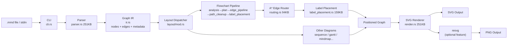
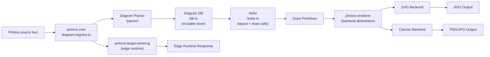
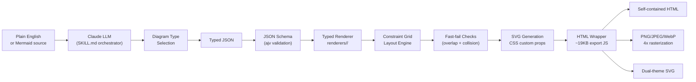

```mermaid
flowchart LR
    Input["Text description\nor Mermaid source"] --> Claude["Claude LLM\n(SKILL.md orchestrator)"]
    Claude --> ModeSelect["Mode Selection\nFlow / Architecture"]
    ModeSelect --> SemanticJSON["Semantic JSON\n(nodes, edges, groups)"]
    SemanticJSON --> LayoutPy["layout.py\nrow packing + rail routing"]
    LayoutPy --> Coords["Positioned Coordinates"]
    Coords --> Claude2["Claude LLM\n(SVG generation)"]
    Claude2 --> SVGAnim["SVG + CSS Animation\nstroke-dashoffset +\nanimateMotion"]
    SVGAnim --> Fidelity["check_fidelity.py"]
    Fidelity --> HTMLOut["Self-contained\nHTML Output"]
```

# Weekly Diagram Tooling Scan — 2026-06-20

## Executive Summary

- **mermaid-rs-renderer** là repo kỹ thuật nhất tuần này: pure Rust reimplementation của toàn bộ Mermaid pipeline, không cần Chromium, với orthogonal A* routing và collision-aware label placement. Layout code (~500KB tổng) đáng đọc kỹ nhất.
- **pintora** là ví dụ tốt nhất về plugin architecture cho diagram tools: mỗi diagram type là một package TypeScript độc lập với parser riêng + artist riêng, đăng ký qua diagram-registry. Pattern này trực tiếp áp dụng được vào kymo.
- **dashmotion** + **archify** là hai Claude skills bổ sung nhau: dashmotion xử lý animated flow diagrams (CSS stroke-dashoffset + SVG animateMotion), archify xử lý static architecture diagrams đẹp với constraint-grid layout và 4× PNG export. Cả hai đều là reference tốt về "LLM as orchestrator" trong diagram generation pipeline.

## Table of Contents

1. [mermaid-rs-renderer — Pure Rust Mermaid renderer](#1-mermaid-rs-renderer)
2. [pintora — Extensible text-to-diagrams (TypeScript monorepo)](#2-pintora)
3. [dashmotion — Animated technical diagrams Claude skill](#3-dashmotion)
4. [archify — Architecture diagram agent skill với beautiful output](#4-archify)

---

## 1. mermaid-rs-renderer

> **Repo:** https://github.com/1jehuang/mermaid-rs-renderer  
> **Updated:** 2026-06-19 · **Stars:** 1,397 · **Language:** Rust

### §1 — Quick Context

**One-line pitch:** Reimplementation thuần Rust của Mermaid, không cần Chromium hay Node.js, nhanh hơn mermaid-cli 500–2000× nhờ native compilation và font cache.

**Tech stack:** Rust; `fontdb` + `ttf-parser` (font measurement), `resvg`/`usvg` (PNG conversion, optional feature), `clap` (CLI), `serde_json`, `regex`. Output: SVG (primary), PNG (optional).

**Health:** 1,397 stars; last release v0.2.2 (2026-04-23); `.github/` CI directory; crates.io distribution. CHANGELOG.md maintained.

**Distribution:** `crates.io` (library crate) + binary CLI. Feature flags tách `clap` và `resvg` ra khỏi dependency tree.

---

### §2 — Architecture Deep-Dive

#### A. Component Inventory

| Module | File | Vai trò |
|---|---|---|
| `Parser` | `src/parser.rs` (251KB) | Hand-written Rust parser cho 23 Mermaid diagram types |
| `IR` | `src/ir.rs` (15KB) | Intermediate representation: `Graph` struct |
| `Layout Engine` | `src/layout/` (28 files) | Per-diagram layout, routing, label placement |
| `Flowchart Layout` | `src/layout/flowchart/` (14 files) | Multi-pass orthogonal routing cho flowchart |
| `Edge Router` | `src/layout/routing.rs` (94KB) | A* grid-based orthogonal edge routing |
| `Label Placement` | `src/layout/label_placement.rs` (159KB) | Collision-aware label positioning |
| `Renderer` | `src/render.rs` (251KB) | SVG string emission |
| `Config` | `src/config.rs` (108KB) | `RenderOptions`, theme system |
| `CLI` | `src/cli.rs` (64KB) | clap-based CLI, batch README extraction |
| `TextMetrics` | `src/text_metrics.rs` (11KB) | Font measurement via fontdb/ttf-parser |
| `Validator` | `src/validator.rs` (21KB) | Post-parse semantic validation |

#### B. Pipeline / Control Flow

1. User chạy `mmdr -i diagram.mmd -e svg` (hoặc stdin pipe)
2. `cli.rs` parse args → gọi `render_with_options(input, opts)`
3. `lib.rs` gọi `parse_mermaid(input)` → `parser.rs` dispatch theo diagram type header
4. Parser trả về `Graph` IR (nodes với shape/label, edges với style/arrows, diagram-specific metadata)
5. `compute_layout(graph, opts)` dispatch tới `layout/<diagram_type>.rs`
6. Flowchart layout: `analysis → plan → edge_pipeline → path_cleanup → label_placement → post_route`
7. `render_svg(positioned_graph, theme)` trong `render.rs` emit SVG string
8. Nếu output PNG: `resvg` convert SVG → PNG bytes

#### C. Data Model / Intermediate Representation

`Graph` struct là core IR:
- `BTreeMap<String, Node>` indexed by ID; `node_order` HashMap track insertion sequence
- `Node`: label, shape enum (Rectangle, Diamond, Circle, Stadium, Hexagon...), optional numeric value, icons
- `Edge`: from/to ID, optional label, directionality, arrow types (crow's foot ER notation), style (Solid/Dotted/Thick)
- Styling: hai track song song — `class_defs` (Mermaid `classDef` feature) và `node_styles` (direct override)
- Diagram-specific data embedded: Sequence có participants + frames (Alt/Opt/Loop/Par) + activations; C4 có boundaries + relationships; Mindmap có tree nodes với level tracking

IR immutable sau parse; layout result là separate positioned data (không mutate Graph).

#### D. Input Language Design

- **Parser approach:** Hand-written Rust, không dùng ANTLR/PEG/parser combinator — `parser.rs` là 251KB single file, evidence của custom recursive descent per diagram type
- **Formal grammar:** Không có BNF/EBNF file trong repo
- **Error reporting:** `parse_mermaid_strict()` trả typed diagnostics; `validator.rs` (21KB) handle post-parse validation với semantic checks

#### E. Layout Algorithm

Flowchart layout là phần phức tạp nhất, có pipeline riêng bên trong layout:
- `analysis.rs` — graph analysis (SCC, rank assignment)
- `plan.rs` — layout planning (slot allocation)
- `edge_pipeline.rs` (115KB) — multi-pass edge routing
- `routing.rs` (94KB) — A* pathfinding trên `RoutingGrid` discretized space; `RouteCandidate` scoring (obstacle hits + label conflicts + crossing count); orthogonal routing với L-shaped segments; self-loop routing; fallback exterior perimeter routing
- `label_placement.rs` (159KB) — collision detection cho edge labels
- `path_cleanup.rs` (46KB) — path simplification (remove redundant waypoints)
- `objectives.rs` (31KB) — layout optimization objectives

Các diagram khác có layout module riêng: `sequence.rs`, `gantt.rs`, `mindmap.rs`, `treemap.rs`, `timeline.rs`, v.v.

#### F. Rendering / Output Strategy

- **Primary:** SVG (built-in, không deps)
- **PNG:** via `resvg`/`usvg` optional feature — cắt dependency tree từ 123 → 71 crates khi disable
- **Animation:** Không có
- **Theme:** `RenderOptions::modern()` vs `RenderOptions::mermaid_default()` + `theme.rs` (12KB)

#### G. Extensibility

- Không có plugin system — thêm diagram type yêu cầu fork + thêm case vào `parser.rs`, `ir.rs`, `layout/`, `render.rs`
- Feature flags: `default-features = false` disable CLI và PNG
- `RenderOptions` builder pattern cho per-call customization

#### H. Dev Experience

- CLI: `mmdr -i file.mmd -e svg|png`, pipe stdin, batch mode từ Markdown file
- Library API: `render()`, `render_with_options()`, `render_with_timing()` (với profiling)
- `--fastText` flag: disable accurate font metrics, dùng char-count approximation (speed: 1600–2069×)
- Không có watch mode hay LSP mention

---

### §3 — Architecture Diagram

---

### §4 — Verdict

**Điểm đáng học cho kymostudio:**
- `routing.rs` (94KB) + `label_placement.rs` (159KB) là goldmine về orthogonal edge routing với A*: `RoutingGrid`, `RouteCandidate` scoring, obstacle-aware pathfinding. Nếu kymo cần auto-layout flowchart, đây là reference implementation tốt nhất có thể đọc full source.
- `RenderOptions` builder pattern + `render_with_timing()` là good practice cho diagnostic/profiling API.
- Tách `resvg` thành optional feature — kymo nên làm tương tự cho heavy rendering deps.

**Red flags:** Parser là single 251KB file — rất khó maintain/extend. Không có plugin system tức là adding diagram type là toàn bộ cross-cutting change.

**Open questions:** Layout code có implement Sugiyama (hierarchical) hay chỉ là custom rank-based? `objectives.rs` (31KB) implement gì cụ thể?

**Verdict: Study deeper** — đặc biệt `routing.rs` và `label_placement.rs`.

---

## 2. pintora

> **Repo:** https://github.com/hikerpig/pintora  
> **Updated:** 2026-06-16 · **Stars:** 1,284 · **Language:** TypeScript

### §1 — Quick Context

**One-line pitch:** Text-to-diagrams TypeScript library với plugin architecture: mỗi diagram type là npm package độc lập — extensible theo cách Mermaid và PlantUML không làm được.

**Tech stack:** TypeScript 5.9; pnpm workspaces + turbo monorepo; per-diagram parsers (generated); SVG + Canvas rendering backends; PNG/JPG/SVG output. WinterCG target cho edge runtimes.

**Health:** 1,284 stars; v0.8.2 (recent, exact date không xác định từ changelog); codecov + GitHub Actions CI; jest tests per package; renovate.json dependency automation.

**Distribution:** npm (`@pintora/standalone`, `@pintora/cli`, `@pintora/core`); VSCode extension (community); Obsidian plugin; web component.

---

### §2 — Architecture Deep-Dive

#### A. Component Inventory

| Package | Path | Vai trò |
|---|---|---|
| `pintora-core` | `packages/pintora-core/` | Diagram registry, config engine, symbol registry, logger |
| `pintora-diagrams` | `packages/pintora-diagrams/` | 8 diagram type implementations |
| `pintora-renderer` | `packages/pintora-renderer/` | Rendering backend abstraction |
| `pintora-cli` | `packages/pintora-cli/` | Node.js CLI |
| `pintora-standalone` | `packages/pintora-standalone/` | Single-file browser bundle |
| `pintora-target-wintercg` | `packages/pintora-target-wintercg/` | Cloudflare Workers / Deno target |
| `pintora-harness` | `packages/pintora-harness/` | Testing infrastructure |

Trong `pintora-diagrams/src/`, mỗi diagram type có thư mục riêng: `sequence/`, `er/`, `class/`, `component/`, `activity/`, `mindmap/`, `gantt/`, `dot/`.

#### B. Pipeline / Control Flow

1. User gọi `pintora.renderTo(code, { container })` hoặc `pintora-cli render -i file.pintora`
2. `pintora-core/diagram-registry.ts` đọc diagram type từ dòng đầu tiên của source (e.g., `sequenceDiagram`)
3. Dispatch tới diagram package được register
4. Diagram's `parser/` parse source → populate `db.ts` (mutable data store per diagram)
5. Diagram's `artist.ts` đọc `db` → emit draw primitives (không phải SVG trực tiếp)
6. `pintora-renderer` nhận draw primitives → execute trên SVG backend (DOM hoặc Node canvas) hoặc Canvas backend
7. Output: SVG node (browser), PNG/SVG file (Node.js), hoặc edge runtime response (WinterCG)

#### C. Data Model / Intermediate Representation

- **Không có shared IR** — mỗi diagram type quản lý `db.ts` riêng
- `sequence/db.ts` (12KB): mutable store — participants, messages, frames (Alt/Opt/Loop), activations, notes
- `sequence/artist.ts` (47KB): consume db → compute positions → emit draw calls
- `pintora-core/config-engine.ts` (2.6KB): per-diagram config overrides
- `pintora-core/symbol-registry.ts` (2.5KB): icon/shape symbols
- v0.8.0 thêm `StyleEngine` trong `@pre` blocks: `@bindClass` statements cho custom styling selectors

#### D. Input Language Design

- **Parser approach:** Per-diagram, trong `<type>/parser/` subdirectory. `sequence/parser.ts` chỉ 312 bytes — delegate sang generated parser (likely Nearley hoặc PEG)
- **Formal grammar:** Không xác định từ evidence hiện có
- **Error reporting:** Không xác định
- **StyleEngine** (v0.8.0): `@pre` block với `@bindClass` statements — novel syntax cho diagram-level style injection

#### E. Layout Algorithm

- **Sequence diagram:** Timeline-based, positions computed inside `artist.ts` (không có auto-layout solver)
- **Other diagrams:** Không xác định cụ thể — artist.ts per type handle layout
- **Crossing minimization:** Không xác định
- **Edge routing:** Không xác định cho general case; sequence dùng straight horizontal arrows

#### F. Rendering / Output Strategy

- **SVG backend:** Browser DOM + Node.js canvas
- **Canvas backend:** Browser-only
- **PNG/JPG output:** Node.js via canvas package
- **WinterCG:** Edge runtime target — `pintora-target-wintercg` package
- **Pluggable pattern:** `pintora-renderer` là separate package — backend swappable

#### G. Extensibility

- **Plugin system:** `diagram-registry.ts` cho phép register diagram type mới như npm package — đây là differentiator chính
- **Custom diagrams:** Tutorial "Write a custom diagram" documented
- **Theme:** `symbol-registry.ts` + config engine + StyleEngine (`@pre` blocks)
- **Output "clean and self-contained, won't pollute the page"** — explicit design decision

#### H. Dev Experience

- pnpm workspaces + turbo — fast incremental builds
- jest tests per package; codecov tracking
- VSCode extension (community-maintained)
- Obsidian integration, Gatsby plugin, web component
- renovate.json auto-dependency updates

---

### §3 — Architecture Diagram

---

### §4 — Verdict

**Điểm đáng học cho kymostudio:**
- Plugin registration pattern trong `diagram-registry.ts` là thiết kế đáng adopt nhất: map from diagram-type-string → `{ parser, artist, config }` — kymo nên implement tương tự để mỗi diagram type trong kymo là pluggable unit.
- Separation of `artist.ts` (layout + draw call emission) khỏi `renderer` (backend execution) là clean boundary — cho phép swap SVG ↔ Canvas ↔ future backends mà không rewrite artist logic.
- `pintora-target-wintercg` — nếu kymo muốn chạy rendering ở edge (Cloudflare Workers), đây là reference.

**Red flags:** Không có shared IR — mỗi diagram type reinvents layout từ đầu trong artist.ts. `sequence/artist.ts` 47KB là god object.

**Open questions:** Parser generation toolchain là gì (Nearley? custom PEG?).

**Verdict: Study deeper** — đặc biệt diagram-registry pattern và artist/renderer boundary.

---

## 3. dashmotion

> **Repo:** https://github.com/csthink/dashmotion  
> **Updated:** 2026-06-19 · **Stars:** 57 · **Language:** HTML/Python

### §1 — Quick Context

**One-line pitch:** Claude skill tạo animated technical diagrams dạng single HTML file — Python layout engine xử lý coordinates, CSS stroke-dashoffset tạo flowing connector animation.

**Tech stack:** Python (layout.py, check scripts); HTML/SVG/CSS output; zero runtime deps; Claude LLM làm orchestrator. No npm, no pip package.

**Health:** 57 stars; rất mới (2026-06-11, 9 ngày tuổi); không có formal CI; README.zh-CN.md có.

**Distribution:** Claude Code skill (CLAUDE.md) — chạy qua `claude` CLI.

---

### §2 — Architecture Deep-Dive

#### A. Component Inventory

| Module | Path | Vai trò |
|---|---|---|
| `SKILL.md` | `skills/dashmotion/SKILL.md` (14KB) | Instruction set cho Claude LLM orchestrator |
| `layout.py` | `skills/dashmotion/scripts/layout.py` | Python layout engine (row packing, rail routing) |
| `check_diagram.py` | `skills/dashmotion/scripts/check_diagram.py` | Structural validator |
| `check_fidelity.py` | `skills/dashmotion/scripts/check_fidelity.py` | Fidelity checker — verify labels appear verbatim |

#### B. Pipeline / Control Flow

1. User chạy skill với text description hoặc Mermaid source (`flowchart` hoặc `stateDiagram-v2`)
2. Claude đọc `SKILL.md` → chọn mode: **Flow** (sequence/branching logic) hoặc **Architecture** (topology/components)
3. Claude parse Mermaid input nếu có (đọc `references/mermaid-input.md`) → extract nodes/edges/groups
4. Claude emit semantic JSON (node types, edge directions, group boundaries)
5. `layout.py` nhận JSON → compute coordinates: row packing, branch gaps, boundary padding, orthogonal rail/lane routing
6. Layout output → Claude generate SVG với CSS animation specs theo hai contracts:
   - **Flowing connectors:** `stroke-dashoffset` animation (delta = one dasharray period)
   - **Traveling dots:** `<animateMotion>` elements riding connector paths
7. `check_fidelity.py` verify mọi source label xuất hiện verbatim trong output
8. Output: single self-contained HTML file

#### C. Data Model / Intermediate Representation

- Semantic JSON struct (không formal schema — LLM-mediated)
- Z-order spec cứng: grid → connectors → dots → nodes
- ViewBox: positive coordinates only; `height = bottom_element_y + 50px`
- Design tokens: dark theme `#020617`, JetBrains Mono font, 4px endpoint padding, shared arrowhead marker
- Animation timing: 0.6–0.9s cho connectors ("slower appears broken"); 3–6 dots per diagram với staggered `begin` times

#### D. Input Language Design

- Hỗ trợ `flowchart`/`graph` và `stateDiagram-v2` Mermaid syntax làm input
- Layout luôn recomputed top-down bất kể `direction` declaration trong Mermaid source
- Không có DSL file format riêng — LLM-mediated translation
- **Quan trọng:** `connector <path> MUST have fill="none"` — explicit constraint trong SKILL.md để prevent polygon fill bugs

#### E. Layout Algorithm

- `layout.py` implement: row packing, branch gaps, boundary padding, orthogonal rail/lane routing
- Deterministic (không force-directed) — coordinate-computed
- Layout direction: luôn top-down
- Rail/lane routing: edges đi theo fixed horizontal/vertical channels

#### F. Rendering / Output Strategy

- SVG + CSS animation inline trong HTML
- **Connector animation:** CSS `stroke-dashoffset` với delta = one complete `stroke-dasharray` period
- **Dot animation:** SVG `<animateMotion>` elements
- Accessibility: `@media (prefers-reduced-motion: no-preference)` wrapper + pause/play toggle
- Zero external assets — complete self-containment
- Single HTML file, vài KB, loops forever

#### G. Extensibility

- Extension thông qua modifying `SKILL.md` instructions
- New mode = new section trong SKILL.md + new layout logic trong `layout.py`
- Không có formal plugin system

#### H. Dev Experience

- Chạy qua `claude` CLI
- Fidelity checking automated via Python scripts
- Self-contained output mở được trong bất kỳ browser nào
- Không có watch mode, IDE integration, hay npm/pip distribution

---

### §3 — Architecture Diagram

---

### §4 — Verdict

**Điểm đáng học cho kymostudio:**
- **Animation contracts** trong SKILL.md là specification đáng adopt nguyên vẹn: `stroke-dashoffset` delta = one dasharray period là công thức đúng để tránh loop glitch; 0.6–0.9s timing window là calibrated recommendation không cần re-discover.
- **`fill="none"` trên tất cả connector `<path>`** là gotcha thực tế mà kymo sẽ tự hit khi build SVG renderer.
- `check_fidelity.py` pattern (verify every source label appears verbatim) là good practice cho LLM-generated output validation.
- Python layout script làm coordinate computation riêng biệt với LLM rendering pass — separation đúng.

**Red flags:** 57 stars, 9 ngày tuổi — chưa battle-tested. Không có formal schema cho semantic JSON.

**Open questions:** `layout.py` implement orthogonal routing thế nào cụ thể? Branch gap calculation có handle diamond patterns không?

**Verdict: Glance + borrow specific techniques** — đặc biệt animation contracts và `fill="none"` constraint.

---

## 4. archify

> **Repo:** https://github.com/tt-a1i/archify  
> **Updated:** 2026-06-19 · **Stars:** 1,186 · **Language:** JavaScript

### §1 — Quick Context

**One-line pitch:** Agent skill tạo architecture diagrams đẹp với dark/light theme tự động và 4× PNG export — 5 typed renderers với constraint-grid layout và fast-fail validation.

**Tech stack:** JavaScript/Node.js; `ajv` (JSON schema validation); CSS custom properties theming; `resvg` hoặc native browser rasterization cho PNG. Output: HTML/SVG/PNG/JPEG/WebP.

**Health:** 1,186 stars; mới (2026-04-15); CHANGELOG.md maintained; có `examples/` và `experiments/`; có ROADMAP.md.

**Distribution:** Claude skill (`archify.zip` trong repo), cũng có `package.json` cho Node.js tooling.

---

### §2 — Architecture Deep-Dive

#### A. Component Inventory

| Module | Path | Vai trò |
|---|---|---|
| `SKILL.md` | `archify/SKILL.md` (17KB) | LLM instruction set cho Claude orchestrator |
| `Renderers` | `archify/renderers/` | 6 typed renderers: architecture, workflow, sequence, dataflow, lifecycle, shared |
| `Schemas` | `archify/schemas/` | JSON schemas per diagram type (ajv validation) |
| `Template` | `archify/assets/template.html` | Fallback hand-placed SVG template |
| `Package` | `archify/package.json` | Node.js entry point |

#### B. Pipeline / Control Flow

1. User mô tả system bằng plain English hoặc cung cấp Mermaid code
2. Claude (orchestrator) đọc SKILL.md → chọn diagram type: `architecture` / `workflow` / `sequence` / `dataflow` / `lifecycle`
3. Claude convert description → JSON matching schema của type đó
4. `ajv` validate JSON — fail fast với error messages naming JSON paths
5. Node.js renderer nhận validated JSON → apply predefined constraint grid + spacing rules
6. Renderer fast-fail checks: node/state overlap, label collision, label width violations, out-of-range values
7. SVG generated với CSS custom properties (`c-frontend`, `c-backend`, etc.)
8. HTML wrapper embed SVG + ~19KB export JavaScript
9. Output: single self-contained HTML
10. Optional: export PNG/JPEG/WebP (4× native rasterization) hoặc dual-theme SVG

#### C. Data Model / Intermediate Representation

- Strongly-typed JSON schema per diagram type — không có shared IR
- **Predefined constraint grids per type:**
  - Workflow: 6 fixed columns tại `x = [88, 220, 300, 430, 500, 625]`
  - Sequence: max 8 participants, `x = 62 + index × 108` trong 920px viewBox
  - Dataflow: 2–5 stages tại `x = 100 + stage × 215`, max 5 rows
  - Lifecycle: main lane cols 0–4, terminal lane cols 0–2, event band shared
  - Architecture: free positioning, auto-fitted viewBox
- CSS semantic classes: `c-frontend`, `c-backend`, `c-database`, `c-cloud`, `c-security`, `c-messagebus`, `c-external`
- Text accents: `t-primary`, `t-muted`, `t-dim`, `t-<type>`
- Arrow variants: `a-default`, `a-emphasis`, `a-security`, `a-dashed`

#### D. Input Language Design

- JSON (LLM-mediated) — không có DSL file format riêng
- Mermaid → JSON: Claude convert bằng semantic reading, không phải mechanical parsing
- **Critical rule:** tất cả colors phải dùng CSS classes — hardcoded hex/RGB values break theming
- ajv validation với detailed error messages

#### E. Layout Algorithm

- **Constraint-based với predefined grids** — không force-directed
- Per-type grids encode spatial constraints (column positions, row spacing, boundary padding)
- Fast-fail validation: node overlap, cross-lane collisions, label width violations
- Architecture mode: free positioning với `auto-fitted viewBox` (duy nhất type không dùng predefined grid)

#### F. Rendering / Output Strategy

- **SVG primary** với CSS custom properties
- **Dual theme:** `:root` (dark default) + `[data-theme="light"]` selectors; `localStorage` persistence; `prefers-color-scheme` respect
- **Export:** Copy PNG to clipboard, download PNG/JPEG/WebP tại 4× viewBox resolution, download dual-theme SVG
- **4× rasterization:** set `width`/`height` = 4× viewBox → native browser rasterize → draw to canvas at natural size → avoid upsampling blur
- **Không có animation**
- Fallback: `assets/template.html` cho hand-placed SVG khi renderer không tồn tại

#### G. Extensibility

- New renderer = new directory trong `archify/renderers/` + JSON schema + layout logic
- Theme extension: thêm CSS classes vào design system
- Fallback template cho free-form diagrams

#### H. Dev Experience

- Chạy qua `claude` CLI
- Export toolbar built-in trong generated HTML
- Schema validation với clear error messages
- `experiments/` directory cho work-in-progress
- Không có watch mode

---

### §3 — Architecture Diagram

---

### §4 — Verdict

**Điểm đáng học cho kymostudio:**
- **Predefined constraint grids** là approach pragmatic hơn force-directed cho domain-specific diagrams: workflow luôn có columns, sequence luôn có swimlanes — encode domain knowledge vào grid thay vì solve general layout. Kymo nên làm tương tự cho BPMN/process diagrams.
- **4× rasterization trick** (set viewBox × 4 → native rasterize → draw at natural size) là giải pháp sạch cho high-DPI PNG export không cần server-side renderer.
- **CSS semantic classes** (`c-frontend`, `c-backend`, ...) thay vì hardcoded hex là pattern đúng cho theming — dual theme miễn phí khi implement đúng từ đầu.
- **Fast-fail validation trước khi render** (overlap check, label collision) là UX tốt — người dùng biết lỗi ở đâu trong JSON, không phải debug SVG output.

**Red flags:** Predefined grids = constraint — nếu user muốn layout không fit grid, archify fall back về hand-placed SVG (fragile). JSON input via LLM không deterministic.

**Open questions:** `shared/` renderer có implement gì dùng chung giữa các types?

**Verdict: Study deeper** — đặc biệt constraint grid design, CSS custom properties theming system, và 4× rasterization export.

---

*Generated by weekly-scout routine · 2026-06-20*
