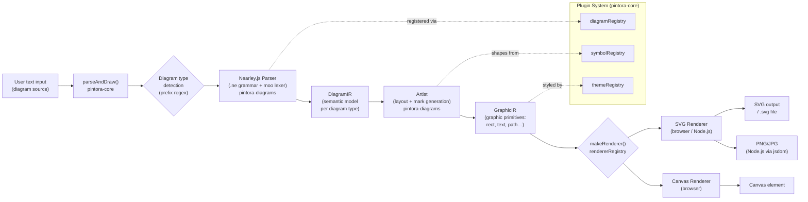
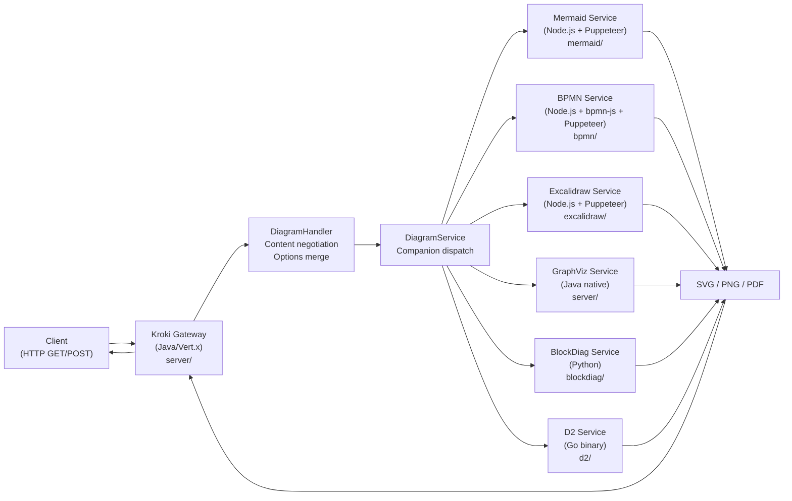
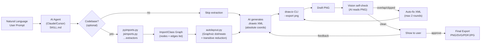

```mermaid
flowchart LR
    RASTER["Raster Logo\n(PNG/JPG/WebP)"] --> FIT["Geometric Fitting\n(iterative primitives)\nAI-guided"]
    BRIEF["Motion Brief\n(motion_spec.md)"] --> ANIM
    
    FIT --> OVERLAY["render_overlay.py\n(NumPy pixel comparison\nfit metrics JSON)"]
    OVERLAY -->|fit < threshold| FIT
    OVERLAY -->|fit OK| AUDIT["svg_path_audit.py\n(Bézier smoothness check)"]
    AUDIT --> SVG["Verified SVG\n(semantic IDs:\n#mark, #dot, #wordmark)"]
    
    SVG --> ANIM["AI author\nCSS keyframe animations\n(target semantic IDs)"]
    ANIM --> SHOWCASE["animate_svg_showcase.py\n(interactive HTML build)"]
    SHOWCASE --> HTML["Dependency-free HTML\n(replay controls,\nspeed adjust)"]
    
    HTML --> CAPTURE["capture_motion_frames.py\n(Playwright, deterministic\nframe strips)"]
    CAPTURE --> PROBE["probe_motion_continuity.py\n(risky window detection)"]
    PROBE -->|glitch detected| ANIM
    PROBE -->|clean| FINAL["Final Output:\nHTML + SVG\n+ GIF/video"]
```

# Weekly Diagram Tooling Scan — 2026-06-21

**Scope:** Repos published hoặc có significant push trong 7 ngày qua (2026-06-14 → 2026-06-21),
domain: diagram-as-code, animation, visual tooling.

---

## Executive Summary

- **Pintora** (`hikerpig/pintora`) là repo đáng study nhất tuần này: two-IR architecture
  (DiagramIR → GraphicIR), plugin registry pattern cho diagram types, và Nearley.js grammar với
  moo tokenizer — đây là blueprint extensibility mà kymostudio chưa có.
- **Kroki** (`yuzutech/kroki`) chứng minh companion-container pattern cho multi-format rendering:
  mỗi diagram backend (BPMN, Mermaid, Excalidraw…) chạy trong container riêng với REST API chung
  — hướng scale cho kymo khi cần support thêm formats.
- **Agents365-ai/drawio-skill** và **nolangz/pixel2motion** đều là AI agent skills (không phải
  standalone libraries) nhưng mang hai lessons cụ thể: (1) vision self-check loop cho diagram QA
  và (2) pipeline raster → clean SVG → CSS animation với semantic element IDs.

---

## Table of Contents

1. [hikerpig/pintora](#1-hikerpigpintora) — extensible TypeScript text-to-diagram với plugin system
2. [yuzutech/kroki](#2-yuzutechkroki) — unified API gateway cho 30+ diagram formats
3. [Agents365-ai/drawio-skill](#3-agents365-aidrawio-skill) — NL-to-diagram với vision self-check loop
4. [nolangz/pixel2motion](#4-nolangzpixel2motion) — raster-logo → clean SVG → CSS animation pipeline

---

## 1. hikerpig/pintora

**Repo:** https://github.com/hikerpig/pintora
**Stars:** 1,284 | **Last push:** 2026-06-18 | **Created:** 2021

---

### §1 — Quick Context

**One-line pitch:** TypeScript diagram-as-code library với plugin architecture cho phép community thêm diagram type mới mà không fork core.

- **Tech stack:** TypeScript, Nearley.js (parser), moo (tokenizer/lexer), Dagre (hierarchical layout), SVG + Canvas (browser), PNG/JPG (Node.js via jsdom)
- **Repo health:** 1,284 stars, ~30 contributors, CI có, đang upgrade TypeScript v6 và rolldown bundler
- **Distribution:** npm (`@pintora/standalone`), VSCode extension có syntax highlight + preview

---

### §2 — Architecture Deep-Dive

#### A. Component Inventory

- **`pintora-core`** (`packages/pintora-core/src/index.ts`) — registry system, event bus, config engine, `parseAndDraw()` entry point
- **`pintora-diagrams`** (`packages/pintora-diagrams/src/`) — implementations: sequence, ER, component, activity, mindmap, gantt, DOT, class diagram
- **`pintora-renderer`** (`packages/pintora-renderer/src/index.ts`) — pluggable renderer factory (`makeRenderer()`), `rendererRegistry`, `IRenderer` interface
- **`pintora-standalone`** (`packages/pintora-standalone/`) — bundled single-file distribution cho browser
- **`pintora-cli`** (`packages/pintora-cli/`) — Node.js CLI, PNG/SVG/JPG output
- **`pintora-target-wintercg`** (`packages/pintora-target-wintercg/`) — target cho WinterCG (Cloudflare Workers, Deno Edge)

#### B. Pipeline / Control Flow

1. User chạy `pintora.renderTo(text, {container: el})` hoặc CLI `pintora render -i foo.pintora`
2. `parseAndDraw(text)` trong `pintora-core` phát hiện loại diagram qua prefix pattern (e.g. `^\\s*sequenceDiagram`)
3. Diagram-specific **parser** (Nearley.js grammar `.ne`) chuyển text thành `DiagramIR` (data model chứa actors, messages, nodes…)
4. Diagram-specific **artist** nhận `DiagramIR + config`, tính layout (Dagre hoặc custom), output `GraphicIR` (danh sách primitives: rect, text, path, arrow…)
5. `makeRenderer(type)` khởi tạo renderer (SVG hoặc Canvas), nhận `GraphicIR`, vẽ output
6. Browser: DOM element được populate SVG. Node.js: file `.png`/`.svg` xuất hiện trên disk.

#### C. Data Model / Intermediate Representation

Pintora dùng **hai-tầng IR** — đây là điểm đặc sắc nhất:

- **`DiagramIR`** — diagram-semantic IR, khác nhau cho mỗi diagram type. Ví dụ `SequenceDiagramIR` chứa `participants[]`, `messages[]`, `groups[]`. Được tạo bởi parser, immutable sau bước parse.
- **`GraphicIR`** (`GraphicsIR`) — rendering-semantic IR, chứa graphic primitives: `marks[]` (rect, text, path, circle, line…), `rootMark`, `width/height`. Được tạo bởi artist sau layout.

`GraphicIR` là **cross-diagram-type** — tất cả diagram types đều compile xuống cùng một graphic primitive set, nên renderer không cần biết về sequence hay mindmap. Đây là design rất clean.

#### D. Input Language Design

- **Parser framework:** Nearley.js với moo tokenizer (stateful lexer, multiple states: `main`, `line`, `configStatement`, `noteState`)
- **Grammar format:** `.ne` files (Nearley grammar), declarative BNF-like syntax với semantic actions
- **Tokenization:** moo định nghĩa token types qua regex patterns, `fallback: true` token catchall cho unexpected input
- **Error reporting:** Minimal — chưa có formal error recovery rules. `fallback` token absorb lỗi thay vì report. Không có line/column error messages rõ ràng.
- **Diagram detection:** Prefix-based regex match (`^\\s*sequenceDiagram`, `^\\s*erDiagram`…)

#### E. Layout Algorithm

- **Hierarchical layout:** Dagre (directed graph, rank-based) cho mindmap, ER diagram, và component diagram
- **Edge routing:** Orthogonal/rectilinear: 4-point paths `[fromPoint, mid1, mid2, toPoint]`, với midpoint tính theo `(fromY + nextLevelTop) / 2`
- **Custom layout:** Sequence diagram dùng custom sequential layout (không cần Dagre), Gantt dùng timeline layout
- **Cross-minimization:** Không có explicit crossing minimization — Dagre xử lý nội bộ

#### F. Rendering / Output Strategy

- **Browser:** SVG (default) hoặc Canvas — cả hai đều nhận `GraphicIR`
- **Node.js:** SVG → file, hoặc jsdom + canvas → PNG/JPG
- **WinterCG:** Target riêng cho edge runtime (Cloudflare Workers)
- **Animation:** Không có (static output only)
- **Pattern:** Pluggable emitter — `rendererRegistry` cho phép thêm renderer mới

#### G. Extensibility

- **Plugin API:** `diagramRegistry.register(name, {parser, artist, eventRecognizer})` — một object với 3 thành phần. Rất clean.
- **Symbol system:** `symbolRegistry` cho custom shape definitions
- **Theme system:** `themeRegistry` + `ITheme` interface — style overrides per theme
- **Config scoping:** Mỗi diagram type có config namespace riêng (e.g. `sequence.actorBackground`)

#### H. Dev Experience

- VSCode extension với syntax highlight và live preview
- CLI có `--watch` mode
- Browser playground tại `pintorajs.vercel.app`
- Monorepo với `pintora-harness` package cho testing diagram artists
- Docs/AI knowledge base mới được thêm (May 2026)

---

### §3 — Architecture Diagram



---

### §4 — Verdict

**Điểm đáng học cho kymostudio:**

1. **Two-IR design** (`DiagramIR` → `GraphicIR`) là pattern kymo nên adopt. Hiện tại kymo có `Diagram` dataclass rồi, nhưng chưa có tầng `GraphicIR` explicit — renderer vẫn consume `Diagram` trực tiếp. Tách thêm một `GraphicIR` sẽ cho phép kymo support Canvas hoặc WebGL renderer mà không đụng layout code.
2. **`diagramRegistry` plugin contract** (`{parser, artist, eventRecognizer}`) là API đẹp cho community extension — kymo chưa expose extension point nào public.
3. **Nearley.js + moo combo** đáng tham khảo cho JS side của kymo: moo stateful lexer giải quyết nhiều vấn đề tokenization edge case mà kymo's line-based regex parser gặp với nested constructs.

**Red flags:** Error reporting rất yếu (fallback token absorb lỗi thầm lặng). Không có animation support — cùng gap với mermaid. WinterCG target là niche.

**Open questions:** Pintora's `GraphicIR` mark set có đủ để render BPMN glyphs không? Artist layer có lazy hay toàn bộ layout chạy eager?

**Verdict:** **Study deeper.** Hai-IR design và plugin registry là concrete patterns kymo có thể adapt ngay cho JS package.

---

## 2. yuzutech/kroki

**Repo:** https://github.com/yuzutech/kroki
**Stars:** 4,195 | **Last push:** 2026-06-20 | **Created:** 2018

---

### §1 — Quick Context

**One-line pitch:** REST API gateway thống nhất cho 30+ diagram engines — một endpoint, mọi format, không cần cài từng library riêng.

- **Tech stack:** Java 21 + Vert.x 4 (gateway server), Node.js 24 + Puppeteer (BPMN, Mermaid, Excalidraw companion services), Docker Compose (orchestration)
- **Repo health:** 4,195 stars, ~60 contributors, CI matrix test, có Docker Hub images
- **Distribution:** Docker (`yuzutech/kroki`), có self-hosted và cloud (kroki.io) options

---

### §2 — Architecture Deep-Dive

#### A. Component Inventory

- **`server/`** (`server/src/main/java/io/kroki/server/`) — Java/Vert.x gateway, HTTP routing, content negotiation, service discovery
  - `Main.java` — Vert.x startup, OpenTelemetry tracing init
  - `DiagramHandler.java` — HTTP request handler, GET/POST, content type negotiation
  - `service/DiagramService.java` — dispatch to companion services
- **`bpmn/`** (`bpmn/src/`) — Node.js microservice, `bpmn-js` v18 + Puppeteer, headless Chrome render
- **`mermaid/`** — Node.js microservice, Mermaid.js + Puppeteer
- **`excalidraw/`** — Node.js microservice, Excalidraw + Puppeteer
- **`vega/`** — Node.js microservice, Vega-Lite
- **`blockdiag/`** — Python microservice, BlockDiag library

#### B. Pipeline / Control Flow

1. Client gửi `POST /mermaid/svg` với diagram source (plain text, hoặc base64 deflate encoded)
2. `DiagramHandler.createPost()` parse content type, extract source, merge options từ headers + URL params + JSON body
3. `DiagramService.convert(source, "mermaid", "svg", options)` dispatch request tới companion service
4. Companion service (Node.js Mermaid) nhận HTTP request, render diagram bằng library gốc, trả về SVG/PNG
5. Gateway stream response về client với đúng Content-Type header
6. Client nhận SVG/PNG/PDF file

#### C. Data Model / Intermediate Representation

Kroki không có internal IR — nó là **passthrough gateway**. Diagram source đi thẳng từ client đến companion service không transform. Companion service dùng IR của library gốc (e.g. mermaid-js dùng Mermaid's AST). Output là binary blob (SVG/PNG/PDF).

Duy nhất "IR" trong gateway là normalized `options` map (lowercase keys merged từ 3 sources: URL params, HTTP headers có prefix `kroki-diagram-options-`, JSON body field).

#### D. Input Language Design

Không applicable — Kroki chỉ forward source strings, không parse. Mỗi companion library tự handle grammar. Source encoding: plain text (POST), hoặc `deflate + base64` cho GET URL (compact enough để fit vào URL).

#### E. Layout Algorithm

Không applicable cho gateway layer. Companion services dùng algorithm của library gốc:
- `bpmn-js` → manual layout từ BPMN DI coordinates (giống kymo's BPMN importer)
- `mermaid-js` → Dagre hierarchical
- `graphviz` → dot algorithm

#### F. Rendering / Output Strategy

- **Approach:** Headless Chrome (Puppeteer) trong companion services render library's native output → capture DOM → serialize SVG hoặc screenshot PNG
- **Formats:** SVG, PNG, PDF, Base64 — mỗi companion service support subset
- **Trade-off:** Puppeteer approach nặng (mỗi diagram type cần Chrome instance) nhưng đảm bảo pixel-perfect output giống như library gốc chạy trong browser
- **Animation:** Không (static snapshot từ headless Chrome)

#### G. Extensibility

- Thêm diagram format mới = viết một companion microservice (Dockerfile + HTTP endpoint)
- Gateway discover companion qua environment variable `KROKI_MERMAID_HOST` etc.
- Community đã thêm Symbolator, WireViz, GoAT qua pattern này

#### H. Dev Experience

- Docker Compose one-command setup
- REST API đơn giản, có Swagger docs
- `kroki.io` public instance để test
- IDE plugins (IntelliJ, VS Code preview extensions)

---

### §3 — Architecture Diagram



---

### §4 — Verdict

**Điểm đáng học cho kymostudio:**

1. **Companion container pattern** là blueprint cho khi kymo cần expose rendering API: một Java/Go gateway + mỗi renderer là lightweight HTTP service riêng. Kroki đã chứng minh pattern này scale tốt ở 30+ formats.
2. **Options merging từ 3 sources** (URL params + headers + JSON body) là UX design đẹp cho API — người dùng có thể control output format theo nhiều cách tùy context (curl, browser, CI).
3. **BPMN companion** dùng `bpmn-js` + Puppeteer — pattern này (headless Chrome render) là fallback đáng tham khảo khi kymo cần đảm bảo pixel-perfect BPMN output mà không maintain renderer riêng.

**Red flags:** Puppeteer/Chrome dependency rất nặng (companion containers ~500MB each). Gateway-only, không có CLI standalone. Không có IR layer — mỗi companion là black box.

**Open questions:** Kroki's `bpmn-js` version (v18) có align với kymo's BPMN importer element coverage không? Companion service startup time có phải latency bottleneck?

**Verdict:** **Glance only** cho architecture patterns — kymo hiện tại là library/CLI, không phải service. Tham khảo companion pattern khi kymo cần build API tier.

---

## 3. Agents365-ai/drawio-skill

**Repo:** https://github.com/Agents365-ai/drawio-skill
**Stars:** 4,262 | **Last push:** 2026-06-20 | **Created:** 2026-05

---

### §1 — Quick Context

**One-line pitch:** Claude/AI agent skill biến text description thành draw.io XML, tự check lỗi layout bằng vision, và tự sửa tới khi output sạch.

- **Tech stack:** Python 3.x (extractors, layout, validation), Graphviz (auto-layout + orthogonal routing), draw.io desktop CLI (export), `bpmn-js` không dùng — thuần draw.io XML
- **Repo health:** 4,262 stars, 78 forks, tốt nhưng mới (2 tháng), chưa có release semantic version, CI/CD có
- **Distribution:** Pure SKILL.md — không publish lên PyPI/npm, deploy bằng cách copy SKILL.md vào project

---

### §2 — Architecture Deep-Dive

#### A. Component Inventory

- **`skills/drawio-skill/SKILL.md`** — master prompt + pipeline instruction cho AI agent
- **`scripts/autolayout.py`** — Graphviz wrapper: nhận node/edge list, chạy `dot`/`neato` layout, output absolute coordinates cho `.drawio` XML
- **`scripts/pyimports.py`**, **`jsimports.py`**, **`goimports.py`**, **`rustimports.py`** — parse codebase thành import graph (nodes = modules, edges = dependencies)
- **`scripts/pyclasses.py`** — extract Python class hierarchy (nodes = classes, edges = inheritance/composition)
- **`scripts/shapesearch.py`** — index 10,000+ official draw.io shape stencils, query bằng keyword
- **`scripts/aiicons.py`** — resolve 321 AI/LLM brand logos qua `lobe-icons` library
- **`scripts/validate.py`** — XML lint cho `.drawio` files (check orphan edges, missing node refs, overlapping positions)

#### B. Pipeline / Control Flow

1. User prompt đến AI agent ("draw an architecture diagram for my microservices")
2. Agent (Claude/Cursor) chạy `SKILL.md` instruction: xác định diagram preset (6 types)
3. AI generate `.drawio` XML trực tiếp (không qua intermediate DSL) — manual coordinate hoặc gọi `autolayout.py` cho large graphs
4. Draw.io CLI export: `draw.io --export --format png diagram.drawio`
5. AI đọc PNG qua vision: detect overlap, clipped labels, stacked edges
6. Nếu có lỗi → sửa XML coordinates/styles → re-export (tối đa 2 rounds auto-fix)
7. Show kết quả user; nếu user có feedback → targeted edits (tối đa 5 rounds iterative)
8. Final export: PNG/SVG/PDF/JPG

#### C. Data Model / Intermediate Representation

`.drawio` XML là IR duy nhất — format XML độc quyền của Diagrams.net. Structure:
```xml
<mxGraphModel>
  <root>
    <mxCell id="1" parent="0"/>
    <mxCell id="node1" value="Service A" style="..." vertex="1">
      <mxGeometry x="100" y="50" width="120" height="60" as="geometry"/>
    </mxCell>
    <mxCell id="edge1" source="node1" target="node2" edge="1"/>
  </root>
</mxGraphModel>
```

Absolute coordinates (`x`, `y`, `width`, `height` per cell). Không có DSL layer — AI directly generates XML.

#### D. Input Language Design

**Không có custom DSL.** Input là plain English natural language. "Diagram source" là `.drawio` XML mà AI tạo ra. Novelty nằm ở:
- Grid alignment: `x,y` values snap to 10px grid
- Semantic color system: 7-color palette mapped to semantic roles (primary, secondary, warning, error…)
- Transitive reduction: simplify dense import graphs trước khi layout

#### E. Layout Algorithm

- **Graphviz** (`dot` algorithm) cho hierarchical diagrams (ERD, UML Class, Architecture)
- **`neato`** cho organic/force-directed (org charts, mind maps)
- **Transitive reduction** (via NetworkX) trước Graphviz để giảm số edges trong import graphs
- **Orthogonal routing:** Graphviz output edge paths được convert sang rectilinear segments
- **Post-processing:** `validate.py` detect overlap và adjust bounding boxes

#### F. Rendering / Output Strategy

- **Backend:** draw.io desktop CLI (Electron app) — không phải pure SVG renderer
- **Output:** PNG (primary, để AI vision check), SVG, PDF, JPG
- **Animation:** Không
- **Pattern:** Single-backend (draw.io CLI), không pluggable

#### G. Extensibility

- Thêm language extractor mới = viết `<lang>imports.py` script
- Thêm shape set = update `shapesearch.py` index
- 6 preset diagram types hardcoded trong SKILL.md
- Không có formal plugin API — mở rộng qua fork SKILL.md

#### H. Dev Experience

- Zero installation khi dùng trong agent (pure SKILL.md)
- `draw.io --export` CLI không phải lúc nào cũng available trên CI
- Vision self-check là killer feature cho UX — người dùng thấy clean output ngay lần đầu

---

### §3 — Architecture Diagram



---

### §4 — Verdict

**Điểm đáng học cho kymostudio:**

1. **Vision self-check loop** là technique kymo chưa có và có thể apply: sau khi render SVG, dùng screenshot + AI vision để detect overlap, label clipping, edge crossing — rồi auto-fix coordinates. Kymo đã có golden SVG tests nhưng chưa có "visual quality gate" tự động.
2. **Transitive reduction** trước layout là optimization đáng apply cho kymo's edge routing khi diagram có nhiều connections — giảm visual clutter trước khi compute paths.
3. **Semantic color system** (7 colors với role mapping) và **10px grid snapping** là design decisions đơn giản nhưng cho output trông professional — kymo có thể hardcode tương tự vào default theme.

**Red flags:** `.drawio` XML là IR độc quyền, không portable. Draw.io CLI dependency nặng (Electron). Transitive reduction có thể xóa mất edges cần thiết nếu semantic không được preserve.

**Verdict:** **Glance only** về tool, nhưng **study vision-QA loop** cụ thể — đây là pattern mới hoàn toàn chưa thấy trong diagram-as-code ecosystem.

---

## 4. nolangz/pixel2motion

**Repo:** https://github.com/nolangz/pixel2motion
**Stars:** 853 | **Last push:** 2026-06-21 | **Created:** 2026-06-12 (9 ngày tuổi!)

---

### §1 — Quick Context

**One-line pitch:** Pipeline chuyển raster logo (PNG/JPG) thành SVG có cấu trúc semantic rồi author CSS animation choreography có QA verification tự động.

- **Tech stack:** Python 3.10+, Pillow (image processing), NumPy (geometry fitting), Playwright (headless Chrome, frame capture), `lobe-icons` (brand logo library)
- **Repo health:** 853 stars, 78 forks — growth viral (9 ngày), CI không rõ, docs site (GitHub Pages), MIT license
- **Distribution:** Claude/Codex agent skill (SKILL.md), Python scripts standalone

---

### §2 — Architecture Deep-Dive

#### A. Component Inventory

- **`SKILL.md`** — AI agent orchestration prompt (pipeline steps, QA criteria)
- **`scripts/render_overlay.py`** — so sánh SVG vector candidate với raster source bằng pixel overlay; tính fit metrics (mark scale, dot placement, baseline alignment)
- **`scripts/svg_path_audit.py`** — phân tích Bézier curves trong SVG paths, report smoothness issues và sharp corners
- **`scripts/animate_svg_showcase.py`** — nhận verified SVG + motion CSS, build interactive HTML showcase với replay controls, speed adjustment, slow-motion toggle
- **`scripts/capture_motion_frames.py`** — Playwright capture deterministic animation frames tại specified timestamps; tạo frame strips cho QA review
- **`scripts/probe_motion_continuity.py`** — probe SVG properties tại "risky windows" (draw-on effects, mask transitions) để detect discontinuities
- **`references/`** — animation principles docs, motion pattern templates, easing token library

#### B. Pipeline / Control Flow

1. User provide raster logo (PNG/JPG/WebP) + motion brief (markdown mô tả personality, choreography)
2. AI + geometry fitting: convert raster → SVG với iterative geometric primitives (circles, rects, bezier paths), verify bằng `render_overlay.py` cho đến khi fit metrics đạt threshold
3. `svg_path_audit.py` check smoothness của Bézier segments
4. AI author CSS keyframe animations, target semantic SVG element IDs (`#mark`, `#dot`, `#wordmark`)
5. `animate_svg_showcase.py` build interactive HTML demo
6. `capture_motion_frames.py` chụp frames tại key timestamps
7. `probe_motion_continuity.py` detect bất kỳ visual glitch nào trong animation windows
8. Final output: dependency-free HTML + animated SVG + GIF/video preview

#### C. Data Model / Intermediate Representation

Không có formal IR. Pipeline dùng:
- **SVG file** với semantic IDs như chuẩn: `#mark` (logo symbol), `#dot` (accent element), `#wordmark` (text part)
- **Motion brief** (`motion_spec.md`) = markdown doc chứa: personality adjectives, choreography sketch, timing values, easing tokens
- **Fit metrics JSON** từ `render_overlay.py`: `{mark_scale_error, dot_placement_error, wordmark_baseline_error, ink_weight_delta}`
- CSS keyframes là "compiled output" — không có higher-level animation DSL

#### D. Input Language Design

Không có custom DSL. Input là:
1. Raster image file
2. Natural language motion brief (markdown, không structured)

Novelty là **semantic SVG ID convention** (`#mark`, `#dot`, `#wordmark`) — constraint nhẹ cho phép CSS target predictably. Như một micro-schema cho animated logo.

#### E. Layout Algorithm

Không applicable — không phải diagram layout. Geometry fitting là:
- Iterative primitive fitting: try circles, rects, bezier curves → measure pixel overlap với raster → accept nếu fit > threshold
- `render_overlay.py` compute overlay metrics (NumPy pixel comparison)

#### F. Rendering / Output Strategy

- **Output:** HTML file (dependency-free), animated SVG embedded, GIF/video preview
- **Animation mechanism:** CSS keyframe animations — zero JS runtime, works in any SVG-capable viewer
- **Self-contained HTML:** Replay controls, speed adjustment, slow-motion toggle — thuần CSS/minimal JS
- **Frame capture:** Playwright screenshot tại deterministic timestamps → frame strip images

#### G. Extensibility

- Motion pattern `references/` folder là template library — thêm pattern mới bằng cách add markdown template
- Không có plugin API
- SKILL.md có thể customized qua fork

#### H. Dev Experience

- Zero setup nếu dùng qua AI agent
- Python scripts standalone nếu cần chạy QA tools riêng
- Docs site có demo animations (GitHub Pages)
- Frame strips cho visual QA rất tiện khi review animation trong PR

---

### §3 — Architecture Diagram



---

### §4 — Verdict

**Điểm đáng học cho kymostudio:**

1. **CSS-only animation với semantic IDs** là pattern áp dụng thẳng vào kymo's animated SVG output: thay vì generate SMIL animation (deprecated) hoặc JS-driven animation, kymo có thể output CSS `@keyframes` targeting semantic class names (`.node--primary`, `.edge--flow`). Zero JS runtime, works everywhere.
2. **QA verification loop** (`render_overlay → audit → probe`) là pattern kymo có thể apply cho animation testing: capture frames tại known timestamps, compare với expected states. Kymo hiện có golden SVG tests cho static output, nhưng chưa có golden frame tests cho animated output.
3. **Semantic SVG ID convention** là micro-schema đáng apply: khi kymo emit animated SVG, có convention rõ ràng về element IDs (`#diagram-node-{id}`, `#edge-{from}-{to}`) để downstream tools (CSS, JS, Playwright tests) có thể target predictably.

**Red flags:** Repo mới 9 ngày — stability chưa proven. Chỉ là Claude skill, không có standalone library mode. Geometry fitting iterative có thể không convergent với complex logos. "Dependency-free HTML" vẫn cần browser với CSS animation support.

**Open questions:** Easing tokens và animation timing có được lưu trong machine-readable format không (hay chỉ markdown)? `motion_spec.md` có thể evolved thành formal mini-DSL không?

**Verdict:** **Study CSS animation pattern** cụ thể (không phải toàn repo). Lesson 1 (CSS-only animation với semantic IDs) có thể apply vào kymo trong 1-2 ngày.

---

*Scan thực hiện: 2026-06-21. Cutoff: repos pushed sau 2026-06-14. Nguồn: GitHub topic search + keyword search. 4 repos chọn từ pool ~20 candidates.*
