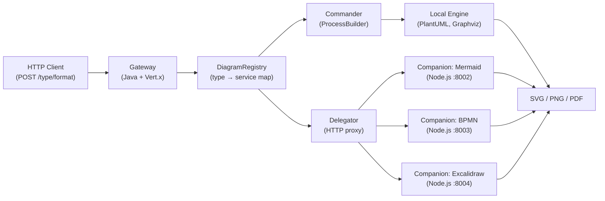
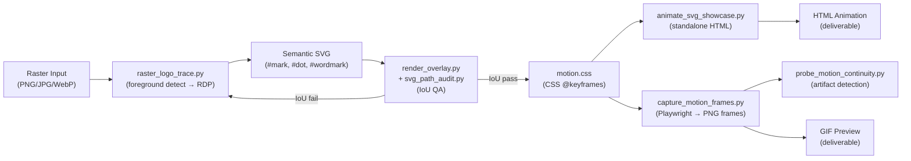
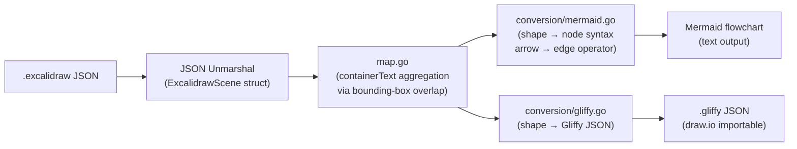

```mermaid
flowchart LR
    NL["Natural Language<br/>hoặc Codebase"]
    PLAN["Claude Planning<br/>(Step 2: identify shapes)"]
    EXTRACT["AST Extractors<br/>(py/js/go/rust → graph JSON)"]
    AUTOLAYOUT["autolayout.py<br/>(Graphviz dot -Tplain<br/>+ coord mapping)"]
    XMLGEN["XML Generator<br/>(Claude writes mxGraph XML)"]
    XML[".drawio XML"]
    DRAWIO_CLI["draw.io CLI<br/>(--width 2000)"]
    PNG["Draft PNG"]
    VISION["Claude Vision<br/>(self-check: overlap/clipped/offcanvas)"]
    FIX["Auto-fix XML<br/>(max 2 rounds)"]
    REVIEW["User Review<br/>(max 5 rounds)"]
    FINAL["Final Export<br/>(PNG/SVG/PDF/JPG)"]
    REPAIR["repair_png.py<br/>(fix IEND chunk)"]

    NL --> PLAN
    NL --> EXTRACT --> PLAN
    PLAN -->|>15 nodes| AUTOLAYOUT --> XMLGEN
    PLAN -->|≤15 nodes| XMLGEN
    XMLGEN --> XML --> DRAWIO_CLI --> PNG
    PNG --> VISION --> FIX --> XML
    FIX -->|pass| REVIEW --> FINAL
    FINAL --> REPAIR
```

# Weekly Diagram Tooling Scan — 2026-06-22

> Scout: repos published hoặc significantly updated trong 7 ngày qua (2026-06-15 → 2026-06-22).
> Nguồn: GitHub topic search (`diagram-as-code`, `svg-animation`, `excalidraw`, `bpmn`, `architecture-diagram`)
> + kiểm tra manual releases của mermaid-js, d2lang, kroki.

---

## Executive Summary

- **Cross-format conversion đang nổi**: `sindrel/excalidraw-converter` vừa refresh sau nhiều tháng — Go CLI convert Excalidraw → Mermaid/Gliffy/draw.io, bounding-box subgraph detection thủ công, rất gần bài toán BPMN↔kymo mà kymostudio đang giải.
- **Vision-in-the-loop là trend**: `Agents365-ai/drawio-skill` dùng Claude vision để tự QA layout PNG sau mỗi generation round — kỹ thuật "AI đọc output của chính mình" hoàn toàn mới, có thể áp dụng vào kymo playground để validate SVG render.
- **SVG animation từ raster**: `nolangz/pixel2motion` (10 ngày tuổi, 892 ★) triển khai pipeline raster→vector→CSS choreography với IoU-based QA — các kỹ thuật semantic SVG id và deterministic frame capture đáng học cho kymo animated SVG.

---

## Table of Contents

1. [yuzutech/kroki](#1-yuzutechkroki) — Unified diagram-as-code API gateway (4.2k ★)
2. [nolangz/pixel2motion](#2-nolangzpixel2motion) — Raster logo → animated SVG pipeline (892 ★)
3. [sindrel/excalidraw-converter](#3-sindrelexcalidraw-converter) — Excalidraw cross-format CLI (287 ★)
4. [Agents365-ai/drawio-skill](#4-agents365-aidrawio-skill) — AI+vision self-check diagram generator (4.3k ★)

---

## 1. yuzutech/kroki

### §1 — Quick Context

**Pitch**: Gateway duy nhất expose 24+ diagram engines (PlantUML, Mermaid, D2, Excalidraw, BPMN…) qua một HTTP API — client không cần cài đặt từng tool.

- **Stack**: Java 17 + Vert.x (gateway), Node.js micro-servers (Mermaid/BPMN/Excalidraw companion), Docker Compose orchestration
- **Output**: SVG, PNG, PDF (tùy engine)
- **Health**: 4,195 ★, 135 contributors, v0.31.0 released 2026-06-11 (54 releases total), CI green, Docker images on DockerHub
- **Distribution**: Docker (`yuzutech/kroki`), self-hosted, có hosted service tại kroki.io

### §2 — Architecture Deep-Dive

#### A. Component Inventory

- `Server.java` (`server/src/main/java/io/kroki/server/Server.java`) — entry point, khởi tạo Vert.x HttpServer, register routes
- `DiagramRegistry` (`server/.../registry/DiagramRegistry.java`) — map `String diagramType → DiagramService` impl
- `DiagramRest` (`server/.../action/DiagramRest.java`) — HTTP handler, extract type từ URL/body, dispatch qua registry
- `Commander` (`server/.../action/Commander.java`) — subprocess execution wrapper (ProcessBuilder, 3-stream async, 5s timeout)
- `Delegator` (`server/.../service/Delegator.java`) — HTTP proxy tới companion container
- Companion containers: `companion/mermaid/`, `companion/bpmn/`, `companion/excalidraw/` — Node.js servers expose `/` endpoint nhận POST body, trả SVG

#### B. Pipeline / Control Flow

1. Client gửi `POST /{diagramType}/{outputFormat}` với diagram source trong body
2. `DiagramRest` handler extract `diagramType` từ URL path segment
3. `DiagramRegistry.lookup(diagramType)` trả về `DiagramService` instance
4. Nếu service là local (PlantUML, Graphviz): `Commander.execute(sourceBytes, cliArgs)` → subprocess → collect stdout SVG
5. Nếu service là companion (Mermaid, BPMN): `Delegator.delegate(sourceBytes)` → HTTP proxy tới companion container port
6. Response SVG/PNG trả về client với Content-Type phù hợp

#### C. Data Model / IR

Kroki **không có IR**. Thiết kế "pass-through gateway": source text đi thẳng vào engine, engine trả về binary. Không parse, không transform, không validate. Trade-off: zero IR overhead, nhưng không thể cross-validate hay combine diagram types.

#### D. Input Language Design

Kroki không parse DSL — responsibility hoàn toàn của downstream engine. Gateway chỉ route và proxy.

Error reporting: nếu engine trả non-zero exit code, `Commander` capture stderr và forward về client dưới dạng HTTP 400 với body là stderr text (plain text, không structured).

#### E. Layout Algorithm

Không có — layout thuộc về từng engine (Graphviz/dot cho PlantUML, ELK cho Mermaid, TALA cho D2).

#### F. Rendering / Output Strategy

- Multiple backends: SVG (primary), PNG (via headless browser hoặc librsvg), PDF (PlantUML native)
- Animation: **không hỗ trợ** — nếu engine trả animated SVG (Mermaid sequence), gateway pass-through nguyên xi
- Pluggable emitter pattern: `DiagramService` interface — mỗi engine implement `convert(sourceBytes) → byte[]`

#### G. Extensibility

Thêm engine mới = (a) implement `DiagramService` interface trong gateway, hoặc (b) spin up companion container và register `Delegator`. Không có plugin system động — phải recompile/redeploy.

#### H. Dev Experience

- CLI: companion containers có `--help` tốt qua Docker; gateway thuần HTTP, không có CLI riêng
- IDE integration: không có
- Watch mode: không có
- Browser preview: có hosted playground tại kroki.io với live preview

### §3 — Architecture Diagram

### §4 — Verdict

**Học được cho kymostudio**: Kroki là benchmark rõ nhất cho "pluggable emitter pattern" trong diagram tooling. Pattern `DiagramService` interface + `DiagramRegistry` map hoàn toàn tương đương với cách kymo hiện tại tổ chức emitters (`to_svg.py`, `to_figma.py`, `to_excalidraw.py`). Nếu kymo muốn expose HTTP API (hoặc kymo-mcp worker cần route multi-engine), có thể học trực tiếp cấu trúc này.

**Red flags**: Không có IR là double-edged — gateway đơn giản nhưng mỗi engine error ra một format khác nhau, client phải tự handle. Cũng không có cross-engine feature matrix (type safety theo engine capability).

**Open questions**: v0.31.0 có gì mới cụ thể? Companion architecture có overhead latency đáng kể không với diagram nhỏ?

**Verdict**: **glance only** — architecture pattern đã rõ, không có technique mới đột phá cho kymo's core. Nhưng giữ reference cho HTTP API design nếu kymo muốn expose public API.

---

## 2. nolangz/pixel2motion

### §1 — Quick Context

**Pitch**: Chuyển logo raster (PNG/JPG/WebP) thành SVG có animation CSS, rồi export HTML/GIF — pipeline hoàn toàn tự động với QA bằng IoU metrics.

- **Stack**: Python 3.10+ (Pillow, NumPy, Playwright), Chromium headless cho frame capture; JavaScript 17.8% cho showcase HTML
- **Output**: `.svg` (static), `motion.css`, standalone HTML animation, GIF/video frames, motion evidence PNGs
- **Health**: 892 ★, 1 contributor, created 2026-06-12 (10 ngày tuổi!), không có CI/tests, MIT license
- **Distribution**: GitHub Pages demo, Python scripts run locally (Claude skill invokable)

### §2 — Architecture Deep-Dive

#### A. Component Inventory

- `raster_logo_trace.py` (`scripts/raster_logo_trace.py`) — foreground detection, color quantization, boundary tracing, RDP simplification → SVG path data
- `render_overlay.py` (`scripts/render_overlay.py`) — rasterize SVG overlay lên original để visual diff (IoU metrics)
- `svg_path_audit.py` (`scripts/svg_path_audit.py`) — phân tích complexity của paths (curve count, point density)
- `animate_svg_showcase.py` (`scripts/animate_svg_showcase.py`) — sinh HTML showcase với replay controls, speed slider
- `capture_motion_frames.py` (`scripts/capture_motion_frames.py`) — Playwright/Chromium: scrub animation timeline → PNG frames → GIF strip
- `probe_motion_continuity.py` (`scripts/probe_motion_continuity.py`) — kiểm tra các "risky animation windows" (draw-on effects, mask transitions) cho artifacts
- `svg_to_js_html.py` (`scripts/svg_to_js_html.py`) — embed SVG inline vào JS/HTML delivery scaffold
- `references/` — animation principles, motion personality patterns, reveal templates

#### B. Pipeline / Control Flow

1. User chạy skill với raster image đầu vào (PNG/JPG/WebP)
2. `raster_logo_trace.py` → foreground mask → color quantization → boundary contours → RDP simplification → SVG path strings. Output: `logo.svg` với semantic IDs (`mark`, `dot`, `wordmark`)
3. `render_overlay.py` + `svg_path_audit.py` → IoU/Recall/Precision metrics → overlay PNG. Nếu IoU < threshold: retrace với looser tolerance
4. Motion choreographer (Claude) viết `motion.css` targeting semantic IDs (`#mark`, `#dot`, `#wordmark`) với CSS transforms, stroke-dashoffset animations
5. `animate_svg_showcase.py` → standalone HTML với inline SVG + motion.css + JS replay controls
6. `capture_motion_frames.py` → Playwright launch → scrub timeline → per-frame PNG → GIF strip
7. `probe_motion_continuity.py` → detect artifacts tại risky windows → nếu có, flag cho manual review

#### C. Data Model / IR

SVG với **semantic IDs** là IR trung tâm. Pipeline đầu cố tình tách logo thành các element addressable (`mark`, `dot`, `wordmark`) thay vì output flat path soup. Motion.css target theo ID, không inline style. Immutable sau khi trace — animation layer không modify SVG structure, chỉ thêm CSS.

#### D. Input Language Design

Không có DSL. Input là image + intent text ("logo reveal" / "slide-in wordmark"). Animation choreography là prose spec trong `motion_spec.md` (Claude-generated từ intent → applied bởi skill).

Error reporting: IoU metrics printed với visual overlay PNG — QA bằng mắt human.

#### E. Layout Algorithm

Không áp dụng — layout là positional từ original raster. `raster_logo_trace.py` preserve spatial position của từng color group trong image coordinates.

#### F. Rendering / Output Strategy

- Backend: CSS animation trong HTML (primary), GIF/video preview (secondary via Playwright frames)
- Animation mechanism: **CSS `@keyframes` targeting semantic SVG IDs** — không dùng JS animation, không SMIL (deprecated). Easing tokens (cubic-bezier), stroke-dashoffset cho draw-on effect
- Single backend (HTML+CSS), không pluggable

#### G. Extensibility

`references/` folder có `motion_personality_patterns.md` — một "DSL" informal cho animation style. Thêm pattern = thêm entry vào reference doc. Không có plugin system.

#### H. Dev Experience

- CLI: chạy từng script Python manually; không có unified CLI
- IDE integration: không có
- Watch mode: không có
- Browser preview: GitHub Pages demo tĩnh tại nolangz.github.io/pixel2motion/

### §3 — Architecture Diagram

### §4 — Verdict

**Học được cho kymostudio (cụ thể)**:

1. **Semantic SVG ID convention**: kymo hiện tại output SVG với class-based styling. Pixel2motion gợi ý dùng stable, semantic `id` attributes cho từng thành phần diagram (`#process-1`, `#swimlane-hr`, `#edge-ab`) để CSS animation có thể target chính xác — đây là foundation để kymo làm animated SVG đúng nghĩa.

2. **IoU-based render QA**: kymo đang dùng byte-for-byte golden SVG comparison. Pixel2motion gợi ý thêm layer QA hình học (pixel overlap giữa expected và actual bounding boxes) — hữu ích hơn byte diff khi layout thay đổi nhỏ.

3. **Deterministic frame capture**: Playwright scrub-and-capture cho animation testing — áp dụng được vào kymo's `--animate` output để generate test frames.

**Red flags**: Repo 10 ngày tuổi, 1 contributor, không có tests — evidence base mỏng. Nhiều script không có error handling. Chưa rõ hoạt động với logo phức tạp (gradient, multi-color marks).

**Open questions**: IoU threshold là bao nhiêu? Semantic ID assignment có tự động không hay manual?

**Verdict**: **study deeper** — semantic SVG ID convention và IoU QA đáng áp dụng trực tiếp vào kymo. Repo trẻ nhưng ideas cụ thể.

---

## 3. sindrel/excalidraw-converter

### §1 — Quick Context

**Pitch**: CLI Go convert Excalidraw whiteboard diagram sang Gliffy, draw.io, và Mermaid — giải quyết "sketch-to-doc" workflow không cần export thủ công.

- **Stack**: Go (96.2%), Mermaid (3.8%); zero external runtime dependencies
- **Output**: `.gliffy` (JSON), `.drawio` (XML), Mermaid flowchart text
- **Health**: 287 ★, 5 contributors, pushed 2026-06-18, có goreleaser CI, binary releases cho Mac/Linux/Windows
- **Distribution**: Binary download, `go install`, goreleaser GitHub releases

### §2 — Architecture Deep-Dive

#### A. Component Inventory

- `main.go` — CLI entry, subcommands `gliffy` / `mermaid` với cobra/flag parsing
- `internal/datastructures/excalidraw.go` — `ExcalidrawScene`, `ExcalidrawSceneElement` (35+ fields), `ExcalidrawElementBinding`
- `internal/datastructures/` — target format structs (Gliffy JSON schema, Mermaid AST)
- `internal/conversion/mermaid.go` — Excalidraw → Mermaid conversion logic
- `internal/conversion/gliffy.go` — Excalidraw → Gliffy conversion logic
- `internal/map.go` — `containerText` map: aggregate text elements per container element
- `internal/utils.go` — bounding-box overlap detection, ID generation

#### B. Pipeline / Control Flow

1. User chạy `exconv mermaid -i diagram.excalidraw`
2. `main.go` parse CLI flags, read `.excalidraw` file (JSON)
3. Deserialize vào `ExcalidrawScene` struct (Go standard JSON unmarshaling)
4. `map.go`: build `containerText` map — với mỗi text element, tìm containing shape bằng bounding-box overlap
5. `conversion/mermaid.go` iterate elements: map shape type → Mermaid node syntax, map arrows → edge operators
6. Spatial containment detection: nếu element A's bounding box contains element B's center → render A as Mermaid subgraph
7. Output Mermaid flowchart text to stdout/file

#### C. Data Model / IR

`ExcalidrawSceneElement` là central struct với 35+ fields:
- Geometry: `x`, `y`, `width`, `height`, `angle`
- Styling: `strokeColor`, `backgroundColor`, `opacity`, `strokeWidth`, `fillStyle`
- Text: `text`, `fontSize`, `fontFamily`, `textAlign`
- Connections: `startBinding`, `endBinding` (`ExcalidrawElementBinding{ElementID, Focus, Gap}`)
- Drawing: `points` ([][]float64 coordinate pairs), `roughness`
- Metadata: `id`, `type`, `version`, `isDeleted`

Không có compile-to-lower-IR. Conversion trực tiếp từ Excalidraw struct sang target format.

#### D. Input Language Design

Input là JSON (Excalidraw native format), không có DSL. Parser là Go standard library JSON unmarshaling vào typed struct — không regex, không PEG.

Error reporting: Go standard errors, không structured error format.

#### E. Layout Algorithm

**Không có auto-layout**. Excalidraw elements có absolute coordinates (x, y) — converter preserve positions trong Gliffy output, drop positions trong Mermaid output (Mermaid tự layout). Đây là information loss có chủ đích: Mermaid không support positional nodes.

#### F. Rendering / Output Strategy

- Hai backends: Gliffy (JSON), Mermaid (text)
- draw.io không phải backend riêng — Gliffy format có thể import vào draw.io
- Animation: không có
- Pluggable emitter: có pattern — mỗi target format là package riêng trong `internal/conversion/`

#### G. Extensibility

Thêm target format = thêm package trong `internal/conversion/` + subcommand trong `main.go`. Không có plugin system — phải recompile.

#### H. Dev Experience

- CLI: `exconv --help` có output tốt, per-subcommand help
- IDE integration: không có
- Watch mode: không có
- Cross-platform binaries trong releases

### §3 — Architecture Diagram

### §4 — Verdict

**Học được cho kymostudio (cụ thể)**:

1. **Bounding-box overlap cho text-in-shape detection**: kymostudio's DSL parser hiện tại dùng explicit `children { }` block. Excalidraw-converter gợi ý approach ngược — infer containment từ spatial overlap. Hữu ích nếu kymo muốn import từ free-draw tools (Excalidraw, tldraw) không có explicit hierarchy.

2. **`ExcalidrawElementBinding.Focus + Gap`**: binding model của Excalidraw dùng `focus` (0..1 position dọc edge của target) và `gap` (khoảng cách) — tinh tế hơn simple center-to-center connection. Kymo's edge model có thể học từ đây khi implement port-based connections.

3. **Arrow arrowhead → edge operator mapping**: bảng map `endArrowhead string → Mermaid operator` là reference tốt nếu kymo muốn export-to-Mermaid feature.

4. **Spatial subgraph detection**: bounding-box overlap detection cho containment — pattern có thể tái dụng trong BPMN pool/lane auto-detection từ position data.

**Red flags**: Conversion một chiều (Excalidraw → X), không có round-trip. Coordinate preservation chỉ có trong Gliffy output, mất hoàn toàn trong Mermaid. Không có tests cho edge cases (overlapping elements, rotated shapes).

**Open questions**: `angle` field bị drop trong tất cả outputs — có plan handle rotation không? WASM build có không để chạy trong browser?

**Verdict**: **glance only** — ideas hay về binding model và spatial containment inference, nhưng codebase nhỏ và thiếu test coverage. Reference tốt hơn là model to learn from.

---

## 4. Agents365-ai/drawio-skill

### §1 — Quick Context

**Pitch**: Claude skill sinh `.drawio` XML từ natural language hoặc codebase, tự QA layout bằng vision (đọc PNG output, auto-fix defects), lặp tới 5 rounds refinement.

- **Stack**: Python (extractors, autolayout, shape search), draw.io desktop CLI, Graphviz `dot`, Claude vision API
- **Output**: `.drawio` XML, PNG/SVG/PDF/JPG exports; 10k+ official shapes; 321 AI brand logos
- **Health**: 4,335 ★, 3 contributors, pushed 2026-06-22 (active today!), MIT license, GitHub Actions CI
- **Distribution**: Claude skill (SKILL.md invocable), GitHub Pages docs

### §2 — Architecture Deep-Dive

#### A. Component Inventory

- `SKILL.md` (`skills/drawio-skill/SKILL.md`) — normative spec: 7-step workflow, XML schema mandates, vision self-check protocol, edge routing rules
- `autolayout.py` (`skills/drawio-skill/scripts/autolayout.py`) — Graphviz `dot -Tplain` invocation, coordinate extraction, draw.io XML patch
- `validate.py` (`skills/drawio-skill/scripts/validate.py`) — structural linting của `.drawio` XML
- `shapesearch.py` (`skills/drawio-skill/scripts/shapesearch.py`) — index 10,000+ shape styles, fuzzy search by keyword
- `aiicons.py` (`skills/drawio-skill/scripts/aiicons.py`) — resolve 321 AI brand logos từ lobe-icons library
- `pyimports.py`, `jsimports.py`, `goimports.py`, `rustimports.py` — AST extractors per language → graph JSON
- `repair_png.py` (`skills/drawio-skill/scripts/repair_png.py`) — fix truncated IEND chunk (8 missing bytes) trong draw.io CLI PNG output

#### B. Pipeline / Control Flow

1. User invoke skill: "draw me an architecture diagram for..."
2. **Step 0**: Check user preset preference (`~/.drawio-skill/styles/`), fall back to built-in conventions
3. **Step 1**: Verify draw.io binary (resolve: `drawio`, `draw.io`, platform path)
4. **Step 2**: Planning — identify shapes, relationships, layout type (LR/TB)
5. **Step 3**: Generate `.drawio` XML. Nếu >15 nodes: call `autolayout.py` (Graphviz layout); nếu ≤15: hand-place với 10px grid snap
6. **Step 4**: Export draft PNG `--width 2000` (NOT `-e` flag — embedded chunk breaks vision API, issue #8)
7. **Step 5**: Claude vision scan PNG → detect 6 defect categories → auto-fix XML → re-export (max 2 rounds)
8. **Step 6**: Show user → receive feedback → targeted XML edit → re-export (up to 5 rounds total)
9. **Step 7**: Final export với `-e` flag → run `repair_png.py` (8 missing bytes IEND bug)

#### C. Data Model / IR

`.drawio` XML (mxGraph format) là IR. Strict schema mandated trong SKILL.md:
- File skeleton: `mxfile > diagram > mxGraphModel > root > mxCell[id=0] + mxCell[id=1] + user shapes`
- Vertex: `id`, `value`, `style`, `parent`, `<mxGeometry x y width height>`
- Edge: phải có `<mxGeometry relative="1" as="geometry"/>` child (không self-closing!), `source`/`target` IDs, `edgeStyle=orthogonalEdgeStyle`
- Containers: `parent=containerId`, child coords relative to container

Mutable trong edit loops. Không có lower IR — XML là cả model lẫn render spec.

#### D. Input Language Design

Input là natural language (không có DSL). Parser là Claude LLM. Không có grammar formal. Error reporting qua vision self-check (detect bad layout visually).

Codebase-to-diagram: extractors parse source code (AST-based per language) → JSON graph → Claude sinh `.drawio` XML từ JSON.

#### E. Layout Algorithm

**Hybrid**: 
- Ít nodes (≤15): hand-place với 10px grid snap — coordinates viết tay trong XML
- Nhiều nodes (>15): `autolayout.py` → Graphviz `dot -Tplain`:
  - `rankdir` LR/TB, `splines=ortho` (orthogonal edge routing)
  - Node dimensions: pixels ÷ 72 → inches
  - Parse plain-text output: `node` lines → center coords → convert về pixels (×72), flip Y axis (bottom-left → top-left), snap to 10px grid
  - Edge waypoints từ Graphviz intermediate control points → `<mxPoint>` elements
  - Container bounds tính deepest-first, wrapping members + padding

#### F. Rendering / Output Strategy

- Backend: draw.io desktop CLI (not open source) — single binary renderer
- Animation: không có
- Multiple export formats qua draw.io CLI flags
- "Pluggable" qua presets (`.drawio-skill/styles/`) — user-defined style templates

#### G. Extensibility

- Preset system: JSON files trong `~/.drawio-skill/styles/` với custom shape/color palette
- Shape search: `shapesearch.py` indexing bất kỳ shape library nào trong draw.io's catalog
- Thêm language extractor: thêm `{lang}imports.py` theo pattern

#### H. Dev Experience

- CLI: không có (invoked as Claude skill)
- IDE integration: không có
- Vision self-check là killer feature — thay thế watch mode bằng AI QA
- `SKILL.md` là excellent developer documentation cho XMLcritical rules

### §3 — Architecture Diagram

### §4 — Verdict

**Học được cho kymostudio (cụ thể)**:

1. **Vision-in-the-loop QA**: Ý tưởng "render output → read PNG với vision → auto-fix source" hoàn toàn applicable cho kymo playground. Khi user sửa `.kymo` source, kymo có thể render SVG → Claude vision scan → detect visual defects → suggest DSL fixes. Đây là hướng đi mới cho kymo interactive mode.

2. **`repair_png.py` pattern**: drawio-skill phải patch IEND chunk bị truncate. Kymo cũng có quirks về resvg rendering — document và isolate những edge-case patches như này thay vì inline trong render pipeline.

3. **`edgeStyle=orthogonalEdgeStyle` + `entryX/exitY` port distribution**: kỹ thuật phân phối entry/exit points trên perimeter (0.25, 0.5, 0.75) khi multiple edges connect cùng một node — kymo hiện tại có edge staggering trong `alignment.py` (fan-in trunk-lane), có thể học thêm từ đây cho more general port allocation.

4. **SKILL.md as architecture spec**: cách drawio-skill dùng SKILL.md như normative XML schema spec là pattern hay — kymo có DSL.md cho grammar nhưng chưa có equivalent "render contract" spec cho SVG output. Đáng viết `SVG-CONTRACT.md`.

**Red flags**: Phụ thuộc draw.io desktop CLI (closed source, platform-specific binary) — fragile deployment. `repair_png.py` là hacky workaround cho upstream bug. Vision self-check phụ thuộc Claude API — không offline-capable.

**Open questions**: Graphviz layout quality so với ELK/dagre cho architecture diagrams? Preset format có documented schema không?

**Verdict**: **study deeper** — vision self-check loop và SKILL.md-as-contract là hai patterns hoàn toàn mới, đáng extract và adapt cho kymostudio's interactive mode và documentation strategy.

---

*Report generated: 2026-06-22 | Branch: claude/adoring-wozniak-wn4k8j*
