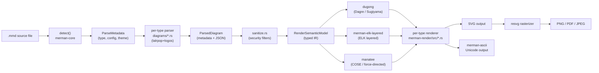
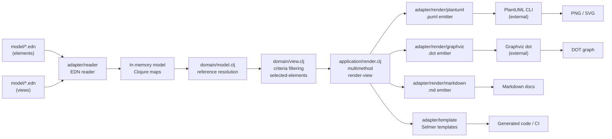
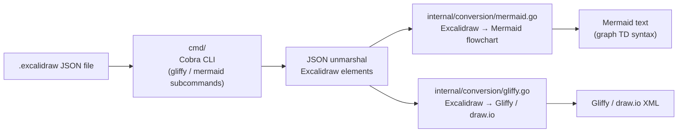
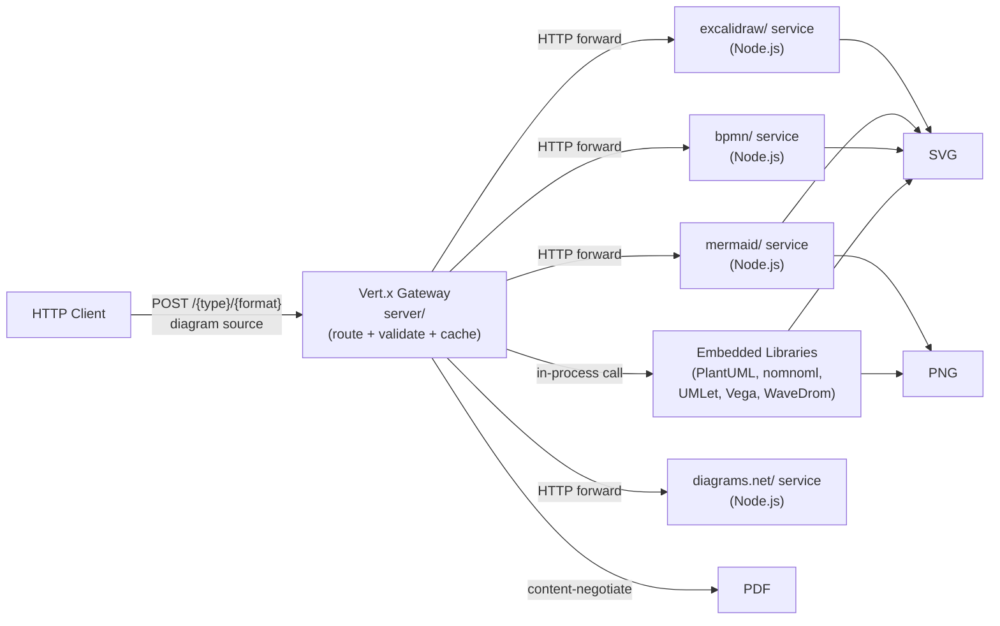

# Weekly Diagram Tooling Research — 2026-06-23

## Executive Summary

- **Merman** (Rust headless Mermaid) đang tích cực phát triển text-measurement FFI và unified SVG→raster pipeline — dùng cùng `resvg` engine với kymostudio, kiến trúc multi-crate sạch đáng học về cách tổ chức layout engines.
- **Overarch** (Clojure EDN → C4/UML) chứng minh rằng "model as data" không cần parser DSL riêng: EDN native = version-control-friendly IR, multimethod dispatch cho multiple backends mà không sửa core.
- **excalidraw-converter** (Go CLI cross-format) nhỏ gọn nhất nhưng làm rõ quyết định thiết kế quan trọng: không có shared IR, mỗi conversion là direct translation — trade-off rõ ràng giữa complexity và coverage.
- **Kroki** (unified diagram API, 4k⭐) là nghiên cứu case về pluggable emitter pattern ở scale microservices: mỗi backend là service độc lập, gateway Java (Vert.x) route request.

## Table of Contents

1. [Latias94/merman — Mermaid.js headless trong Rust](#1-latias94merman)
2. [soulspace-org/overarch — Clojure data-model → C4/UML](#2-soulspace-orgoverarch)
3. [sindrel/excalidraw-converter — Go CLI cross-format](#3-sindrelexcalidraw-converter)
4. [yuzutech/kroki — Unified diagram API](#4-yuzutechkroki)

---

## 1. Latias94/merman

### §1 — Quick Context

**Pitch:** Rust reimplementation của Mermaid.js, browserless — chạy headless không cần Node/browser, parity 3500+ golden SVG baselines với upstream.

- **Tech stack:** Rust 1.95+, 18 crates workspace; `resvg`/`usvg` render → SVG/PNG/PDF; `lalrpop` + `logos` parse; `nalgebra`/`euclid` cho geometry; WASM build qua `wasm-bindgen`; FFI qua `uniffi` (Dart/Flutter/Swift/Android JNI)
- **Repo health:** 383 ⭐, pushed 2026-06-23 (hôm nay), version 0.8.0-alpha.2, CI có golden snapshot testing
- **Distribution:** Binary CLI (`merman-cli`), npm WASM package, Homebrew, Typst plugin

### §2 — Architecture Deep-Dive

#### A. Component Inventory

- `merman-core` (`crates/merman-core/src/`) — preprocessing, type detection, parse pipeline orchestrator, sanitization, theming, config
- `merman-render` (`crates/merman-render/src/`) — per-diagram-type SVG renderers (27 types: flowchart, sequence, class, ER, architecture, c4, gantt, mindmap, venn, xychart, …)
- `dugong` (`crates/dugong/`) — Dagre-compatible hierarchical layout engine (ported từ JS `dagre`)
- `dugong-graphlib` (`crates/dugong-graphlib/`) — Graph data structure library backing Dagre
- `manatee` (`crates/manatee/`) — COSE/FCoSE-style compound graph layout (force-directed + compound)
- `merman-layout-elk` (`crates/merman-layout-elk/`) — ELK (Eclipse Layout Kernel) layered layout integration
- `merman-elk-layered` (`crates/merman-elk-layered/`) — ELK layered algorithm implementation
- `merman-ascii` (`crates/merman-ascii/`) — Terminal text/Unicode renderer
- `merman-cli` (`crates/merman-cli/`) — CLI entry point: detect / parse / layout / render commands
- `merman-wasm` (`crates/merman-wasm/`) — WASM compilation target
- `merman-ffi` + `merman-uniffi` (`crates/merman-ffi/`, `crates/merman-uniffi/`) — C FFI và UniFFI bindings cho mobile/desktop
- `merman-bindings-core` (`crates/merman-bindings-core/`) — Shared interface cho các binding targets
- `roughr` (`crates/roughr/`) — "Rough" hand-drawn rendering style
- `xtask` (`crates/xtask/`) — Build automation (WASM size budgets, snapshot regeneration)

#### B. Pipeline / Control Flow

1. **User chạy** `merman-cli render diagram.mmd --out output.svg`
2. **`merman-core::ParsePipeline::detect()`** — đọc file, detect diagram type (hoặc explicit via `known_type()`)
3. **Preprocessing** — extract inline config (`%%{init: ...}%%` directives), merge với global theme + effective config; sinh `ParseMetadata`
4. **Parse** — dispatch đến module tương ứng trong `crates/merman-core/src/diagrams/` (27 modules), mỗi module implements `parse_or_unsupported()`, trả `ParsedDiagram` (metadata + JSON model)
5. **Sanitize** — apply security filters (strip active SVG elements, unsafe attrs) trả `ParsedDiagramRender` với `RenderSemanticModel`
6. **Layout** — `merman-render` nhận semantic model, gọi `dugong` (Dagre) hoặc `manatee` (COSE) hoặc `merman-layout-elk` tùy diagram type, tính geometry
7. **Render** — per-type renderer (`architecture.rs`, `class.rs`, `er.rs`, …) sinh SVG string; optionally `resvg` rasterize → PNG/PDF/JPEG

#### C. Data Model / Intermediate Representation

- **`ParseMetadata`** — diagram type, raw config, effective config (merged), title: immutable struct
- **`ParsedDiagram`** — `ParseMetadata` + JSON model (serde_json::Value): semi-mutable mid-pipeline
- **`ParsedDiagramRender`** — `ParseMetadata` + `RenderSemanticModel` (strongly-typed render IR)
- **`RenderSemanticModel`** — enum: either typed semantic output (per diagram type) hoặc JSON fallback
- Có hai IR levels: (1) generic JSON từ parse stage, (2) typed Rust structs trong render stage — tách biệt concerns giữa parsing và rendering

#### D. Input Language Design

- **Parser approach:** Không dùng single grammar — mỗi diagram type có parser riêng. Dùng `lalrpop` (LR parser generator) + `logos` (lexer). `parse_pipeline.rs` orchestrate nhưng delegate đến per-type parsers trong `diagrams/` modules.
- **Grammar:** Không có single formal grammar file — parity được enforce bằng 3500+ golden SVG snapshots so với upstream Mermaid JS output
- **Error reporting:** `error_diagram` module — lỗi parse sinh ra một "error diagram" SVG thay vì panic

#### E. Layout Algorithm

- **Dagre (hierarchical):** `dugong` là Rust port của JS dagre — dùng cho flowchart, sequence, class, ER, git graph. Layered layout Sugiyama-style.
- **COSE/FCoSE (force-directed compound):** `manatee` — dùng cho mindmap, architecture diagrams với compound nodes
- **ELK Layered:** `merman-layout-elk` + `merman-elk-layered` — Eclipse Layout Kernel's layered algorithm, dùng cho complex hierarchical cases
- **Edge routing:** Orthogonal (Dagre default), spline/curved tùy diagram type
- **Crossing minimization:** Dagre implement barycentric heuristic (ported từ JS)

#### F. Rendering / Output Strategy

- **Primary:** SVG via per-type renderer trong `merman-render/src/*.rs`
- **Rasterization:** `resvg` (same engine as kymostudio!) → PNG, JPEG, PDF qua `svg2pdf`
- **ASCII:** `merman-ascii` — terminal-friendly Unicode output
- **Resvg-safe mode:** Strip `<foreignObject>` HTML labels → clean SVG cho rasterization (issue tương tự kymostudio gặp với CSS-class SVG)
- **Pattern:** Pluggable renderer — common trait/interface, per-type implementation, không phải monolithic renderer

#### G. Extensibility

- Add diagram type: tạo module trong `crates/merman-core/src/diagrams/` + renderer trong `crates/merman-render/src/`
- Thêm output target: thêm WASM binding hoặc FFI wrapper
- Theme: `theme.rs` (103KB!) — centralized styling configuration
- Rough mode: `roughr` crate toggle — render style alternative

#### H. Dev Experience

- CLI có `detect`, `parse`, `layout`, `render` sub-commands — introspect từng pipeline stage độc lập
- WASM playground (`playground/`)
- Golden snapshot CI — parity enforced automatically
- `xtask` crate cho build automation (WASM size budgets)
- Typst plugin: render Mermaid inline trong Typst documents

### §3 — Architecture Diagram

### §4 — Verdict

**Điểm học cho kymostudio:**
- `dugong` (Dagre port trong Rust) là reference implementation đáng study nếu kymo muốn implement Sugiyama-style hierarchical layout thay vì chỉ dùng user-specified positions. Codebase cho thấy đây là ~2K+ LOC riêng.
- Cách `merman-render` tách per-type renderer thành từng file `.rs` riêng (class.rs, er.rs, architecture.rs) — scale tốt hơn nhiều so với monolithic renderer.
- **Resvg-safe mode** (strip `<foreignObject>` trước khi rasterize) giải quyết đúng vấn đề kymostudio đã gặp với cairosvg.
- `error_diagram` pattern — lỗi parse sinh SVG thay vì exception — UX tốt cho CLI tools.

**Red flags:** `theme.rs` 103KB là smell to — centralized god object cho styling. `sanitize.rs` 44KB cũng thick.

**Open questions:** `manatee` (COSE) có phục vụ được compound-graph layout không (kymo có nested regions)? `merman-layout-elk` vs `dugong` — khi nào dùng cái nào?

**Verdict: Study deeper** — đặc biệt `dugong` layout engine và `merman-render` per-type pattern.

---

## 2. soulspace-org/overarch

### §1 — Quick Context

**Pitch:** Lưu architecture model như EDN data (không phải diagram), query/filter để sinh C4/UML diagrams qua PlantUML hoặc Graphviz.

- **Tech stack:** Clojure (JVM), Leiningen, requires Java 11+; output via PlantUML (delegate rendering) và GraphViz; template engine cho code/docs generation
- **Repo health:** 292 ⭐, 4 contributors, pushed 2026-06-22, có CI tests; available via Homebrew
- **Distribution:** Standalone JAR, Homebrew formula, Clojars

### §2 — Architecture Deep-Dive

#### A. Component Inventory

- `domain/element.clj` (`src/org/soulspace/overarch/domain/element.clj`, 48KB) — core type hierarchy: 30+ element types (`:system`, `:container`, `:class`, `:state`, `:org-unit`, …) + relation types (`:request`, `:dataflow`, `:inheritance`, …); Clojure `derive` hierarchy cho polymorphism
- `domain/model.clj` (`src/org/soulspace/overarch/domain/model.clj`, 28KB) — in-memory model: EDN files → map of `{:id element}`; composition và reference resolution
- `domain/view.clj` (`src/org/soulspace/overarch/domain/view.clj`, 13KB) — 18 view types định nghĩa; criteria-based element selection (`selected-elements`, `referenced-elements`)
- `domain/spec.clj` (`src/org/soulspace/overarch/domain/spec.clj`, 13KB) — validation specs (clojure.spec)
- `application/render.clj` — multimethod dispatch: `render-view` dispatched by format keyword; orchestrate filtering + rendering
- `adapter/reader/` — EDN file loading, JSON import
- `adapter/render/plantuml/` — PlantUML emit (C4, UML diagrams)
- `adapter/render/graphviz/` — Graphviz DOT emit (concept maps)
- `adapter/render/markdown/` — Markdown tables/text emit
- `adapter/template/` — Selmer/Hiccup template engine for code/doc generation
- `adapter/export/` — Structurizr export (experimental)
- `adapter/ui/` — Watch mode, CLI interface

#### B. Pipeline / Control Flow

1. **User chạy** `java -jar overarch.jar -m ./model -r plantuml`
2. **Reader** đọc tất cả `.edn` files trong model directory → in-memory model map `{:elements {id → element}}`
3. **Model resolution** — `model.clj` resolve references (`:from`/`:to` trong relations, `:ct` children) → fully connected graph
4. **View filtering** — `view.clj::selected-elements` áp criteria predicates lên model: node-pred, relation-pred, boundary-pred
5. **`render-view` dispatch** — multimethod dispatches by `[view-type render-format]` pair
6. **Backend emit** — `adapter/render/plantuml/` sinh `.puml` files; `adapter/render/graphviz/` sinh `.dot` files
7. **External render** — PlantUML hoặc Graphviz CLI được gọi externally để sinh PNG/SVG (Overarch không tự render)

#### C. Data Model / Intermediate Representation

- **IR:** Pure Clojure maps (EDN) — không compile xuống lower IR
- **Element:** `{:el :system, :id :my-ns/my-system, :name "My System", :desc "…", :tech "Java", :tags #{:external}}`
- **Relation:** `{:el :request, :id :my-ns/req1, :from :my-ns/svc-a, :to :my-ns/svc-b, :name "HTTP GET"}`
- **View:** `{:el :context-view, :id :my-ns/ctx, :ct [{:ref :my-ns/my-system}], :selection {:el-types #{:system}}}`
- Model là immutable Clojure data — persistent maps; no mutation between passes
- Clojure `derive` hierarchy: `:class` → `:code-model-node` → `:model-node` → `:model-element` — multimethod dispatch polymorphism

#### D. Input Language Design

- **Không có custom parser:** Input là EDN (Clojure's native data notation) — read bằng `clojure.edn/read`
- **Grammar:** EDN spec là formal grammar; không cần parser riêng
- **Error reporting:** Validation qua `clojure.spec` (spec.clj) — spec explain output
- **Điểm đặc biệt:** Model có thể được compose từ nhiều `.edn` files → distributed model across team

#### E. Layout Algorithm

- **Không có own layout engine** — delegate hoàn toàn cho PlantUML (built-in layout) và Graphviz (dot algorithm)
- Overarch chỉ filter/select elements và emit source text; layout là responsibility của downstream tool
- View criteria có thể control *which* elements appear nhưng không control positions

#### F. Rendering / Output Strategy

- **Không có own renderer** — pluggable emitter pattern delegate sang external tools
- PlantUML → PNG/SVG/PDF (rendered bởi PlantUML engine)
- Graphviz → SVG/PNG (rendered bởi dot)
- Markdown → text tables/docs (no visual rendering)
- Template → arbitrary text (code, CI configs, …)
- **Pattern:** Overarch là "compiler frontend" — sinh source code cho diagram tools khác

#### G. Extensibility

- Add backend: implement `render-view` và `render-file` multimethods cho format keyword mới
- Add element type: `derive` trong `element.clj` + add xử lý trong multimethod
- Plugin: không có formal plugin system — extension qua Clojure multimethod open system

#### H. Dev Experience

- Watch mode (`-w` flag) — auto-regenerate khi model files thay đổi
- Template-based generation — output không chỉ diagrams mà còn code, docs, CI configs
- CLI đơn giản nhưng effective
- Không có IDE integration cụ thể, nhưng EDN editing trong Emacs/Calva là tốt

### §3 — Architecture Diagram

### §4 — Verdict

**Điểm học cho kymostudio:**
- **"Model as data, not diagram"** — Overarch tách biệt rõ ràng: model là truth, views là queries trên model. Kymostudio đang theo hướng tương tự với `Diagram` dataclass, nhưng Overarch đi xa hơn bằng criteria-based filtering thực sự declarative.
- **Không cần custom parser nếu dùng host-language data syntax** — EDN-as-DSL là trade-off thú vị: mất custom syntax sugar nhưng gain composability và free tooling (editors, formatters).
- **Multimethod dispatch `[view-type, format]`** — dispatch 2 chiều cho phép mỗi view type sinh ra output khác nhau cho cùng format, mà không cần if/else tree. Kymo có thể áp dụng nếu muốn khác biệt hóa cách render `sequence` vs `flowchart` cho cùng SVG backend.

**Red flags:** Delegate hoàn toàn layout cho PlantUML/Graphviz là limitation lớn — không có control visual output quality. Model cũng rất verbose (EDN maps không concise như YAML/TOML).

**Open questions:** Có thể thêm SVG renderer trực tiếp không (bypass PlantUML)? Criteria-based filtering có expressiveness đủ cho complex queries không?

**Verdict: Glance only** — pattern thú vị nhưng "compiler frontend" approach không phù hợp với kymo's goal là first-class beautiful animated SVG output.

---

## 3. sindrel/excalidraw-converter

### §1 — Quick Context

**Pitch:** CLI Go tool chuyển đổi Excalidraw diagram sang Mermaid / Gliffy / draw.io — bridge giữa whiteboard sketching và diagram-as-code.

- **Tech stack:** Go (standard library heavy), `goreleaser` for distribution; input `.excalidraw` JSON, output Mermaid/Gliffy/draw.io XML
- **Repo health:** 287 ⭐, pushed 2026-06-18, test coverage cho cả 2 converters, Apache 2.0 license
- **Distribution:** Binary release via GoReleaser (macOS/Linux/Windows), Homebrew tap

### §2 — Architecture Deep-Dive

#### A. Component Inventory

- `main.go` — minimal entry point, 77 bytes
- `cmd/` — Cobra CLI commands (`gliffy`, `mermaid`, sub-commands)
- `internal/conversion/gliffy.go` (12KB) — Excalidraw → Gliffy/draw.io converter
- `internal/conversion/mermaid.go` (15KB) — Excalidraw → Mermaid flowchart converter
- `internal/conversion/gliffy_test.go` + `mermaid_test.go` — unit tests với fixtures
- `internal/datastructures/` — shared data structures (Excalidraw element types)
- `internal/map.go` + `internal/utils.go` — utility functions
- `test/` — integration test fixtures (`.excalidraw` sample files)

#### B. Pipeline / Control Flow

1. **User chạy** `exconv mermaid -i my-diagram.excalidraw -d top-down`
2. **CLI parse** — Cobra command parse flags (`-i` input, `-d` direction, `-p` print to stdout)
3. **Input load** — đọc `.excalidraw` file (JSON), unmarshal vào Excalidraw element structs
4. **Conversion dispatch** — `cmd/` route sang `internal/conversion/mermaid.go` hoặc `gliffy.go`
5. **Direct translation** — iterate elements, map từng Excalidraw element type → target format node/edge
6. **Output emit** — write Mermaid text hoặc Gliffy/draw.io XML to file/stdout

#### C. Data Model / Intermediate Representation

- **Không có shared IR** — mỗi converter đọc Excalidraw structs trực tiếp và emit target format
- Excalidraw elements: `{type: "rectangle"|"diamond"|"ellipse"|"arrow"|"text", x, y, width, height, strokeColor, fillStyle, label}`
- Không có "compile to IR then emit" pattern — đây là direct AST-to-AST translation
- Trade-off: simple codebase nhưng khó add format mới (mỗi format phải understand Excalidraw model riêng)

#### D. Input Language Design

- **Không parse DSL** — input là Excalidraw JSON format (external format)
- Excalidraw file là array of elements với geometric properties
- Parser chỉ là JSON unmarshal

#### E. Layout Algorithm

- **Không có layout** — positions được preserve từ Excalidraw (user đã layout manually)
- Mermaid output: geometric positions convert thành relative ordering (top-down / left-right direction flag)
- Gliffy output: positions được translate 1:1 từ Excalidraw coordinates

#### F. Rendering / Output Strategy

- **Mermaid output:** Text-based flowchart syntax — `graph TD\n A[Box] --> B[Another]`
- **Gliffy output:** XML format compatible với Gliffy + draw.io
- **Pattern:** Direct format translation, không có rendering engine own

#### G. Extensibility

- Add format: tạo converter file mới trong `internal/conversion/`, add Cobra command trong `cmd/`
- Không có plugin system
- Element type support: thêm case trong switch statement

#### H. Dev Experience

- Minimal CLI với clear error messages
- `-p` flag print to stdout — pipeline-friendly
- GoReleaser: multi-platform binary distribution
- Không có watch mode, không có browser preview

### §3 — Architecture Diagram

### §4 — Verdict

**Điểm học cho kymostudio:**
- **Excalidraw format spec** — `internal/datastructures/` chứa chuẩn Excalidraw element schema. Kymo có `to_excalidraw.py` — đối chiếu để xác nhận parity với format này.
- **Direct translation là đủ cho format bridges** — không nhất thiết cần shared IR cho cross-format conversion nếu source format đã có structure đủ phong phú.
- **Mermaid output limitation:** chỉ support flowchart, không support sequence/class — vì Excalidraw graph không encode diagram semantics (không biết `diamond` là decision hay entity). Đây là fundamental limitation của geometry→semantic lifting.
- **`-d top-down/left-right`** direction flag — simple way để control layout direction từ geometry. Kymo có thể học cách map absolute positions → Mermaid direction tốt hơn.

**Red flags:** Mermaid conversion bị hạn chế flowchart-only là limitation lớn. Không có test cho Gliffy converter (chỉ có `gliffy_test.go` 709 bytes là thin).

**Open questions:** Có support Excalidraw → PlantUML không? Cách handle Excalidraw arrows với multiple waypoints?

**Verdict: Glance only** — nhỏ và focused, nhưng ít insight kiến trúc. Hữu ích như format spec reference khi improve kymo's `to_excalidraw.py`.

---

## 4. yuzutech/kroki

### §1 — Quick Context

**Pitch:** Unified HTTP API cho 20+ diagram engines — single endpoint, pluggable backends, không phải manage multiple diagram tools riêng lẻ.

- **Tech stack:** Java (Vert.x web framework) cho gateway; Node.js companion services (Mermaid, Excalidraw, diagrams.net, BPMN); Java libs embedded (PlantUML, UMLet, Vega, Nomnoml); Maven multi-module; Docker Compose orchestration
- **Repo health:** 4195 ⭐, 80+ contributors, active, pushed 2026-06-20, CI đầy đủ
- **Distribution:** Docker images (`yuzutech/kroki` + companion images), self-hosted

### §2 — Architecture Deep-Dive

#### A. Component Inventory

- `server/` — Java Vert.x gateway: HTTP routing, request validation, backend dispatch, response caching
- `server/src/main/java/io/kroki/server/Main.java` — Vert.x bootstrap, OpenTelemetry tracing init
- `bpmn/` — Node.js BPMN renderer companion service
- `mermaid/` — Node.js Mermaid renderer companion service
- `excalidraw/` — Node.js Excalidraw renderer companion service
- `diagrams.net/` — Node.js diagrams.net (draw.io) renderer companion service
- `nomnoml/` — Embedded Java nomnoml renderer
- `vega/` — Embedded Java Vega/Vega-Lite renderer
- `tikz/`, `wavedrom/`, `dbml/`, `bytefield/` — per-format renderer modules
- `lib/` — Shared Java libraries
- `docs/` — Documentation

#### B. Pipeline / Control Flow

1. **Client sends** `POST /mermaid/svg` với body là diagram source text
2. **Vert.x gateway** nhận request, parse path `/{diagram-type}/{output-format}`
3. **Request validation** — diagram type có trong supported list? format hợp lệ?
4. **Backend routing** — nếu type là `bpmn`/`mermaid`/`excalidraw`/`diagrams.net` → forward đến companion Node.js service qua HTTP; nếu type là embedded (plantuml/graphviz/nomnoml/vega) → call library trực tiếp in-process
5. **Encoding decode** — GET requests dùng deflate+base64 URL encoding; POST JSON payload giải mã inline
6. **Diagram render** — companion service hoặc embedded library sinh SVG/PNG
7. **Response** — return SVG/PNG/PDF/base64 với appropriate Content-Type

#### C. Data Model / Intermediate Representation

- **Không có shared IR** — mỗi backend nhận raw diagram source text và trả rendered output
- Gateway chỉ route text → không transform, không parse diagram content
- Output format negotiation (svg/png/pdf) là responsibility của gateway layer

#### D. Input Language Design

- Không có DSL riêng — pass-through cho native syntax của mỗi tool (Mermaid syntax, PlantUML syntax, etc.)
- Encoding scheme: `deflate → base64 → URL-safe` cho GET requests (URL-friendly sharing)
- Alternative: plain text POST (diagram content direct), JSON POST (structured với type + source + options)

#### E. Layout Algorithm

- **Không có layout engine riêng** — layout là responsibility của mỗi backend (Mermaid, PlantUML, Graphviz, etc.)
- Gateway là transparent proxy về layout concerns

#### F. Rendering / Output Strategy

- **Pluggable backend pattern** — hai loại backends:
  - **Embedded:** PlantUML, nomnoml, UMLet, Vega, WaveDrom → Java libraries called in-process
  - **Companion containers:** Mermaid, BPMN, Excalidraw, diagrams.net → separate Node.js Docker services, called via HTTP
- Output formats: SVG, PNG, PDF, base64
- Pattern: **Microservices-based pluggable emitter** — mỗi format có service độc lập, scale independently

#### G. Extensibility

- Add format: tạo module mới (Node.js hoặc Java), expose HTTP endpoint, register trong gateway routing config
- Docker Compose: add companion service container
- Không cần gateway code change — routing table driven config

#### H. Dev Experience

- Single public API endpoint — clients không cần biết underlying engines
- URL-encoded diagrams — sharable URLs với diagram embedded
- Docker-first deployment — `docker-compose up` đủ dùng
- No IDE integration — server tool, không phải client tool
- OpenTelemetry tracing built-in

### §3 — Architecture Diagram

### §4 — Verdict

**Điểm học cho kymostudio:**
- **Deflate+base64 URL encoding scheme** — kymo playground (editor.kymo.studio) đang dùng approach tương tự không? Nếu chưa, đây là pattern để share diagrams qua URL mà không cần server state.
- **Embedded vs. companion pattern** — kymo có `kymostudio-core` (Rust/WASM) dùng cho Python + JS + editor. Nếu kymo muốn expose HTTP API, Kroki's pattern (embedded small libs, companion containers cho heavy ones) là reference architecture tốt.
- **OpenTelemetry từ đầu** — tracing built-in từ Main.java; useful lesson cho production tooling.
- **Pass-through text** — Kroki không parse diagram content, chỉ route. Điều này trade off: không thể validate input hay cung cấp meaningful errors trước khi gửi đến backend.

**Red flags:** Heavy Docker dependency — khó run locally without Docker. Gateway không validate diagram syntax trước → bad UX khi backend trả lỗi cryptic.

**Open questions:** Kroki có support streaming output không (large diagrams)? Cache strategy là gì — hash of (type + source)?

**Verdict: Study deeper** — đặc biệt nếu kymo muốn expose server API (kymo-mcp đang làm) hoặc implement URL-based diagram sharing trong playground.

---

*Generated: 2026-06-23 | Sources: GitHub API search, raw.githubusercontent.com*
*Repos scanned: goadesign/model, plantuml/plantuml, Latias94/merman, soulspace-org/overarch, sindrel/excalidraw-converter, yuzutech/kroki, dai-shi/excalidraw-animate, nolangz/pixel2motion, mermaid-js/mermaid*
*Selected 4: merman, overarch, excalidraw-converter, kroki — theo relevance filter DSL/layout/rendering/cross-format*
