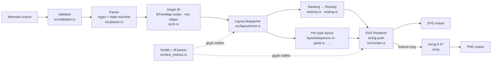
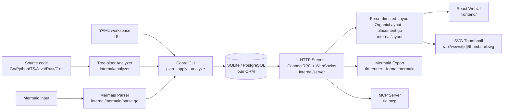
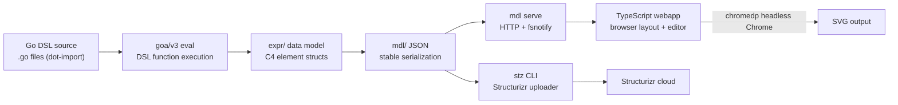
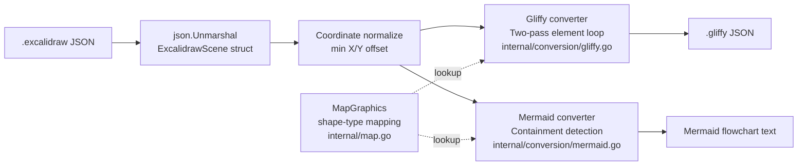

# Weekly Diagram Tooling Research — 2026-06-24

## Executive Summary

- **mermaid-rs-renderer** (Rust, 1.4k★): Renderer Mermaid native Rust loại bỏ Node.js/Chromium hoàn toàn; dùng resvg/usvg cùng stack với `kymostudio-core`; grid-based obstacle-avoidance edge routing và fontdb/ttf-parser cho text metrics không cần browser — hai kỹ thuật trực tiếp áp dụng được vào kymo.
- **Mertcikla/tld** (Go, 264★): Architecture-as-code tool mới (April 2026), tích hợp force-directed layout thuần Go, bidirectional Mermaid bridge cho 10+ diagram type, tree-sitter codebase analysis, và MCP server; không phải rendering engine nhưng các module layout + import đáng nghiên cứu kỹ.
- **Ecosystem news tuần này**: Mermaid v11.15.0 (May 2026) thêm Event Modeling diagram type, Wardley Maps beta, nested namespace trong class diagrams. PlantUML đang phát triển `explain_diagram` MCP tool và SVG export cho npm (commits June 15–18). D2: không có release notable trong 7 ngày qua.

## Table of Contents

1. [1jehuang/mermaid-rs-renderer](#1-1jehuangmermaid-rs-renderer) — **study deeper**
2. [Mertcikla/tld](#2-mertcikladiagram) — **study deeper**
3. [goadesign/model](#3-goadesignmodel) — glance only
4. [sindrel/excalidraw-converter](#4-sindrelexcalidraw-converter) — glance only

---

## 1. 1jehuang/mermaid-rs-renderer

**Repo:** https://github.com/1jehuang/mermaid-rs-renderer | **Stars:** ~1 400 | **Lang:** Rust | **Pushed:** 2026-06-21

### §1 — Quick Context

Renderer Mermaid native thuần Rust, không cần Node.js hay Chromium — 100–1 400× nhanh hơn `mermaid-cli`; hỗ trợ 23 diagram type, output SVG + PNG (via resvg, same engine với kymostudio-core).

**Tech stack:** Rust 2024 edition; regex + serde_json; fontdb + ttf-parser (text metrics); resvg 0.47 + usvg (PNG, feature-gated); clap (CLI). Output: SVG (always), PNG (optional).

**Health:** ~1 400★, 68 forks, CI có (GitHub Actions), MIT license, v0.2.2. Binary: `cargo install mmdr`, Homebrew, Scoop, AUR. Status: early active development — visual fidelity đang cải thiện.

### §2 — Architecture Deep-Dive

**A. Component inventory**

| Module | File path | Vai trò |
|--------|-----------|---------|
| `lib` | `src/lib.rs` | Public API: `render()`, `render_with_options()`, staged pipeline |
| `validator` | `src/validator.rs` | Preflight structural check, typed `ParseError` với line/col |
| `parser` | `src/parser.rs` | Tokenizer line-by-line regex + state machine, 23 diagram type |
| `ir` | `src/ir.rs` | `Graph` (BTreeMap nodes, Vec edges), `DiagramKind` (23 variants), type-specific payloads |
| `layout/mod` | `src/layout/mod.rs` | Dispatcher: routing tới từng layout sub-module |
| `layout/ranking` | `src/layout/ranking.rs` | Custom hierarchical rank assignment (không dùng Sugiyama/dagre) |
| `layout/routing` | `src/layout/routing.rs` | Grid-based obstacle-avoidance + `EdgeOccupancy` lane model |
| `layout/label_placement` | `src/layout/label_placement.rs` | Label placement với clearance buffer |
| `layout/<type>` | `src/layout/{sequence,gantt,mindmap,...}.rs` | One file per non-flowchart diagram type |
| `render` | `src/render.rs` | SVG back-end: pure `String::push_str()`, không dùng XML crate |
| `text_metrics` | `src/text_metrics.rs` | Glyph advance width via fontdb + ttf-parser |
| `theme` | `src/theme.rs` | `Theme::modern()` + `Theme::mermaid_default()` |
| `cli` | `src/cli.rs` | clap CLI `mmdr`, `-i/-o/-e` flags, Markdown batch extraction |

**B. Pipeline (happy path)**

1. User chạy `mmdr -i diagram.mmd` hoặc gọi `render(src)`
2. `validator::validate()` — preflight check, trả `ParseError` với line/col nếu lỗi
3. `parser::parse_mermaid()` — line-by-line regex + state machine → `ParseOutput { graph: Graph }` (IR)
4. `layout::compute_layout()` — dispatch tới sub-module theo `DiagramKind`: rank assignment → position assignment → subgraph expansion → grid-based edge routing → label placement
5. `render::render_svg()` — walk Layout, push SVG defs/markers/fills/edges/nodes qua `String::push_str()`
6. (Optional, feature `png`) `write_output_png()` → resvg/usvg rasterize SVG → PNG bytes

**C. Data model**

IR là flat `Graph` struct: `BTreeMap<id, Node>` + `Vec<Edge>`. Diagram-specific data hanging off `Graph` dưới dạng optional fields (pie_slices, gantt_tasks, sequence frames...) thay vì enum-of-variants — dễ extend per type. Layout tạo ra `Layout` struct song song với `NodeLayout` / `EdgeLayout` / `SubgraphLayout` (x, y, w, h, routed path) — **IR không bị mutate bởi layout**.

**D. Input language design**

Không có custom grammar formal. Parser dùng static `Lazy<Regex>` (Rust) cho arrow pattern, shape detection, label extraction + stack-based subgraph nesting tracking. Preprocessing strip YAML frontmatter, `%%` comments, `%%{init:...}%%` directives trước khi parse chính.

**E. Layout algorithm**

Custom hierarchical ranker (không phải Sugiyama/dagre/elkjs). `rank_edges_for_manual_layout()` assign integer ranks ưu tiên non-dotted edges → `assign_positions()` spacing nodes trong rank. Edge routing: **grid-based obstacle avoidance** (configurable cell size) với `EdgeOccupancy` lane fallback. `preferred_aspect_ratio` hint điều chỉnh rank spacing iteratively để hit target W/H ratio.

**F. Rendering / output**

SVG: pure string building (no XML crate). Text sizing chính xác nhờ fontdb + ttf-parser — không cần browser hay canvas. PNG: resvg 0.47 + usvg (same engine với kymostudio-core). Animation: không có.

**G. Extensibility**

Feature flags: drop CLI (`dep:clap`) hoặc PNG (`dep:resvg`) cho lean library build. API expose 3 stages riêng biệt (parse/layout/render) → embedder có thể intercept IR giữa stages. Adding new diagram type: thêm `DiagramKind` variant, parser branch, layout sub-module, render branch — all in Rust.

**H. Dev experience**

`render_with_timing()` expose microsecond breakdown per stage. `layout_dump` serialize Layout to JSON cho debug. Criterion benchmarks trong `benches/`. Python scripts (~15% repo) có vẻ là conformance/comparison tooling. Không có WASM build path — library Rust-native only.

### §3 — Architecture Diagram

### §4 — Verdict

**Đáng học cho kymostudio:**
1. **Grid-based edge routing** (`routing.rs`): explicit obstacle avoidance + lane-occupancy model — cụ thể hơn kymo's fan-in staggering, đáng đọc cho trunk-lane conflicts.
2. **fontdb + ttf-parser text metrics**: đóng gap giữa Python estimated metrics và browser-accurate sizing — cùng stack resvg với kymostudio-core.
3. **Aspect-ratio hint**: iterative rank spacing để target W/H ratio — UX feature kymo chưa có.
4. **Staged public API**: `parse()/layout()/render()` as first-class functions — pattern JS package đã có nhưng Python chưa đủ.
5. **Per-diagram-type layout modules**: cách tổ chức tách biệt BPMN layout khỏi main resolver.

**Red flags:** Visual fidelity vs mermaid.js 11 vẫn đang "improving" (v0.2.2). Parser regex có thể mis-parse edge cases phức tạp. Không có WASM target.

**Verdict: study deeper** — đọc `src/layout/routing.rs`, `src/text_metrics.rs`, `src/render.rs`.

---

## 2. Mertcikla/tld

**Repo:** https://github.com/Mertcikla/tld | **Stars:** 264 | **Lang:** Go + TypeScript | **Pushed:** 2026-06-22 | **Created:** April 2026

### §1 — Quick Context

Architecture-as-code tool kiểu `terraform plan/apply` cho software diagrams: khai báo elements/connectors trong YAML, force-directed auto-layout, Mermaid bidirectional bridge, tree-sitter codebase analysis, MCP server — tất cả trong một binary tự chứa.

**Tech stack:** Go 1.26 + TypeScript/React 42.9%; Wails v2 (desktop); SQLite/PostgreSQL (bun ORM); ConnectRPC (protobuf); WebSocket (real-time collab); tree-sitter (gotreesitter + wazero WASM); OpenAI SDK (AI generation); Cobra CLI; Echo HTTP. Output: Mermaid text, SVG thumbnail, WebUI.

**Health:** 264★, 17 forks, CI có (Playwright E2E + golangci-lint), Apache-2.0. Goreleaser cross-compile + Wails desktop app cho macOS/Windows.

### §2 — Architecture Deep-Dive

**A. Component inventory**

| Module | File path | Vai trò |
|--------|-----------|---------|
| `cmd/` | `cmd/root.go` | Cobra CLI 27+ subcommands: add/connect/plan/apply/export/analyze/render/mcp/serve |
| `internal/workspace` | `internal/workspace/types.go` | Core data model: `Workspace`, `Element`, `Connector`, `ViewPlacement`, `LockFile` |
| `internal/layout/organic` | `internal/layout/organic.go` | Force-directed layout (D3-style): 300 iterations velocity verlet |
| `internal/layout/placement` | `internal/layout/placement.go` | Incremental placement: directed-level grid + edge-crossing penalty scoring |
| `internal/mermaid/parse` | `internal/mermaid/parse.go` | Mermaid→model: regex import 10+ diagram type (flowchart, C4, sequence, class, ER, state, Gantt...) |
| `internal/mermaid/export` | `internal/mermaid/export.go` | Model→Mermaid flowchart text export |
| `internal/analyzer` | `internal/analyzer/tree_sitter.go` | Tree-sitter static analysis: Go/Python/TS/Java/Rust/C++ → auto-generate elements/connectors |
| `internal/server` | `internal/server/server.go` | HTTP: ConnectRPC `/api/v1/`, WebSocket collaboration, SVG thumbnail endpoint |
| `pkg/app + pkg/api + pkg/dbrepo` | `pkg/` | Canonical types, ConnectRPC service impls, bun-backed DB repo |
| `frontend/` | `frontend/` | TypeScript/React WebUI (42.9%); embedded vào binary via assets.go |
| `skills/create-diagram` | `skills/create-diagram/` | AI skill + `.claude-plugin/`, `.codex-plugin/`, `gemini-extension.json` |

**B. Pipeline (happy path)**

1. Author viết elements/connectors trong YAML files dưới `.tld/` workspace directory
2. `tld plan` preview changes; `tld apply` commit atomically + update lockfile (versioned hash)
3. `tld analyze` chạy tree-sitter static analysis → auto-generate hoặc augment elements
4. `tld serve` start HTTP server; React WebUI render với force-directed layout (OrganicLayout)
5. Layout coordinates compute server-side → lưu vào `ViewPlacement {x, y}` trong YAML workspace
6. `tld render --format mermaid <view>` serialize view → Mermaid flowchart text
7. Real-time collaboration via WebSocket; SVG thumbnail on-demand tại `/api/views/{id}/thumbnail.svg`
8. `tld mcp` expose MCP server cho AI agents (Claude/Codex/Gemini)

**C. Data model**

YAML-file workspace (không phải database primary store): `Element {ref, name, kind, owner, technology, tags[], file, symbol refs, placements[]{parentRef, x, y}}`; `Connector {source, target, label, style}`. Lockfile track version ID + SHA hashes + resource counts. Internal IDs: int64 (SQLite watch store) hoặc string refs (YAML). Protobuf types cho ConnectRPC API surface.

**D. Input language design**

Không có custom DSL parser. Input chính là YAML — không phải diagram DSL mà là architecture inventory. Mermaid import dùng regex-based pattern matching + type-routing (max 250KB, 250 elements, 500 connectors). Tree-sitter (wazero WASM sandbox) parse source code cho codebase analysis.

**E. Layout algorithm**

`OrganicLayout` (`internal/layout/organic.go`): D3-style force simulation, 300 iterations velocity verlet. Forces: gravity pull → O(n²) many-body repulsion + spring link force (bias by degree) → O(n²) collision detection. Tunable: `LinkDistance, ChargeStrength, CollideRadius, GravityStrength`. Incremental placement (`placement.go`): directed-level grid assignment + candidate scoring = edge-length cost + edge-crossing penalty (weight 10 000).

**F. Rendering / output**

SVG thumbnail server-side; Mermaid text via `tld render`; React WebUI (browser canvas). Không có native SVG render pipeline như kymo — Mermaid text là main export format.

**G. Extensibility**

MCP server; plugin JSON cho Claude/Codex/Gemini; pluggable DB (SQLite/PostgreSQL); Docker Compose import; multi-repo workspace; LSP integration (go.lsp.dev).

**H. Dev experience**

`air` hot-reload; Taskfile.yml + Makefile; Vite dev server proxied; Playwright E2E; shell completion; text/JSON output flag; workspace auto-detection.

### §3 — Architecture Diagram

### §4 — Verdict

**Đáng học cho kymostudio:**
1. **`organic.go`**: clean Go implementation của D3 force simulation (velocity verlet, 300 iter) — benchmark trực tiếp so với kymo's `alignment.py`. Đọc để thấy parameter tuning approach.
2. **`placement.go`**: incremental placement scoring (edge-length + crossing penalty 10k) khi add node vào existing layout — kymo chưa có.
3. **`internal/mermaid/parse.go`**: bidirectional Mermaid bridge cho 10+ type — scope rộng hơn kymo's import hiện tại.
4. **MCP server pattern**: `tld mcp` + multi-agent skill JSON cho Claude/Codex/Gemini — applicable vào kymo roadmap.

**Red flags:** Không phải rendering engine — SVG output chỉ là thumbnail, Mermaid text là main export. `go 1.26.2` trong go.mod chưa released (có thể pre-release toolchain). 150+ deps (AWS SDK, GCP SDK, OTel) → binary lớn.

**Open questions:** SVG thumbnail dùng gì render (headless browser hay resvg)? `internal/embedlab` có phải sqlite-vec vector store không?

**Verdict: study deeper** — đọc `internal/layout/organic.go` và `internal/mermaid/parse.go`.

---

## 3. goadesign/model

**Repo:** https://github.com/goadesign/model | **Stars:** 461 | **Lang:** Go + TypeScript | **Pushed:** 2026-06-22

### §1 — Quick Context

DSL C4 architecture diagrams embedded trong Go (dot-import, không cần custom parser) → render qua browser/Structurizr. Khác biệt: DSL là Go code thực, IDE autocomplete miễn phí; rendering lock vào Chrome headless hoặc Structurizr cloud.

**Tech stack:** Go 1.26 + TypeScript (browser webapp); goa/v3 (eval framework); chromedp (headless Chrome SVG export); fsnotify (live-reload). Output: SVG (via headless Chrome), Structurizr cloud workspace JSON.

**Health:** 461★, 21 forks, CI có, MIT, v1.15.0 (June 2026). Go module `goa.design/model`.

### §2 — Architecture Deep-Dive

**A. Component inventory**

`dsl/` (Go DSL API functions: `Design`, `SoftwareSystem`, `Container`, `Person`, `Relationship`, `Views`...) → `expr/` (evaluated data model: C4 element structs) → `mdl/` (JSON-serializable mirror với deterministic ordering) → `cmd/mdl/webapp/` (TypeScript interactive editor, layout algorithms) / `cmd/stz/` (Structurizr uploader).

**B. Pipeline**

1. Author viết Go package với dot-import `dsl` (plain `.go` files)
2. `mdl gen` evaluate Go package qua goa/v3 eval → build `expr/` data model
3. `mdl serve` launch HTTP server host TypeScript webapp + fsnotify live-reload
4. User position elements trong browser editor (webapp handle layout algorithms interactively)
5. `mdl svg` spawn headless Chrome (chromedp), navigate tới local server, capture SVG
6. Hoặc: `stz` upload workspace JSON → Structurizr cloud render

**C. Data model**

Strict C4 hierarchy: Enterprise → People + SoftwareSystems → Containers → Components. Views là separate từ model: `LandscapeView, ContextView, ContainerView, ComponentView, DynamicView, DeploymentView`. ElementStyle/RelationshipStyle (15 shape kinds, 3 border kinds). Layout positions được tính trong TypeScript webapp (browser-side) — không có server-side layout computation.

**D. Layout:** Toàn bộ trong TypeScript webapp (browser-side). Không có Go-side layout engine. Auto-layout với direction DOWN/UP/LEFT/RIGHT; manual drag-and-drop.

**E. Rendering:** Chrome headless (chromedp) — không có pure-Go SVG path. Library backend (Structurizr) hoặc browser là required.

### §3 — Architecture Diagram

### §4 — Verdict

**Đáng học cho kymostudio:**
- **Go-as-DSL pattern**: dùng host language làm DSL (dot-import, no parser) — trade-off thú vị: IDE support miễn phí nhưng bị lock vào Go ecosystem. Không applicable cho kymo (đã có custom DSL tốt hơn), nhưng interesting về mặt design space.
- **mdl/ serialization**: clean separation giữa `expr/` (mutable AST) và `mdl/` (stable JSON) — pattern kymo đã làm tốt rồi, nhưng cách goadesign implement deterministic ordering đáng đọc.
- **Conformance approach**: golden-JSON testing strategy tương tự kymo's conformance suite.

**Red flags:** Chrome dependency làm cho server-side/embed use cases khó khăn. TypeScript webapp phải build riêng (npm) trước khi Go CLI work — friction. Rendering hoàn toàn lock vào browser/Structurizr.

**Verdict: glance only** — skim `dsl/dsl.go` cho Go-as-DSL pattern, không cần đọc sâu hơn.

---

## 4. sindrel/excalidraw-converter

**Repo:** https://github.com/sindrel/excalidraw-converter | **Stars:** 287 | **Lang:** Go | **Pushed:** 2026-06-18

### §1 — Quick Context

CLI converter một chiều (Excalidraw → Gliffy/Mermaid): đọc `.excalidraw` JSON, normalize coordinates, map shapes, emit Gliffy JSON hoặc Mermaid flowchart text. Static conversion, không có layout engine, không có animation.

**Tech stack:** Go stdlib + Cobra (CLI) + Testify (tests). Zero runtime deps ngoài stdlib. Output: Gliffy JSON, Mermaid text. Binary via GitHub Releases + Homebrew tap + AUR, 32 releases.

**Health:** 287★, 16 forks, CI (CodeQL + GoReleaser), MIT. Renovate bot cho dependency updates.

### §2 — Architecture Deep-Dive

**A. Component inventory**

`main.go` (entry → `cmd.Execute()`) → `cmd/root.go` (Cobra root `exconv`) → `cmd/gliffy.go` / `cmd/mermaid.go` (subcommands với flags) → `internal/conversion/gliffy.go` / `internal/conversion/mermaid.go` (core conversion logic) → `internal/datastructures/excalidraw.go` / `gliffy.go` (typed Go structs) → `internal/map.go` (MapGraphics shape-mapping table) → `internal/utils.go` (WriteToFile, NormalizeRotation, SanitizeElementText).

**B. Pipeline**

1. Đọc `.excalidraw` file từ disk (raw JSON bytes)
2. `json.Unmarshal` vào `ExcalidrawScene` struct (elements array + appState + files map)
3. Compute canvas offset: scan all elements tìm minimum X/Y → normalize về `(0,0)`
4. **[Gliffy]** Two-pass element loop: pass 1 top-level elements, pass 2 attach children (ContainerId-linked) → map shape type → convert style → marshal GliffyScene JSON
5. **[Mermaid]** Build node/edge graph từ bindings → assign N0/N1/... IDs → spatial containment detection (bounding-box overlap → smallest enclosing parent) → recursive subgraph emit → style blocks + click handlers
6. Write output file hoặc stdout (`--print-to-stdout` cho Mermaid)

**C. Data model**

Input flat array `ExcalidrawSceneElement {x, y, width, height, angle, type, strokeColor, backgroundColor, fillStyle, strokeWidth, strokeStyle, opacity, fontSize, fontFamily, boundElements, startBinding, endBinding, containerId, points[], id}`. Output Gliffy: nested JSON tree. Output Mermaid: plain text string concat.

**D. Parser:** Không có custom parser — direct `encoding/json.Unmarshal` vào typed Go structs.

**E. Layout:** Không có. Gliffy: absolute coordinates preserved (offset-normalized). Mermaid: bounding-box containment detection cho subgraph nesting.

**F. Rendering:** Không có rendering — output là data format (Gliffy JSON, Mermaid text), không phải SVG/PNG.

### §3 — Architecture Diagram

### §4 — Verdict

**Đáng học cho kymostudio:**
- **`internal/datastructures/excalidraw.go`**: typed Go structs cho `ExcalidrawScene` — cross-reference trực tiếp với kymo's `to_excalidraw.py` output format để validate field names, JSON tags, binding conventions.
- **`internal/map.go` (MapGraphics)**: comprehensive shape-type mapping table Excalidraw ↔ Gliffy — cross-reference hữu ích cho completeness của kymo's Excalidraw export.
- **Mermaid containment detection**: bounding-box overlap → smallest enclosing parent cho subgraph nesting — lightweight alternative so sánh với kymo's alignment resolver grouping.

**Red flags:** Conversion direction ngược với kymo (Excalidraw → output, không phải input → Excalidraw). `go.mod` khai `go 1.25` — không tồn tại (có thể typo). Isolated nodes bị drop silently trong Mermaid output. Frames/groups Excalidraw (2023+) chưa được handle.

**Verdict: glance only** — chỉ đọc `internal/datastructures/excalidraw.go` để cross-check kymo's Excalidraw data model.
