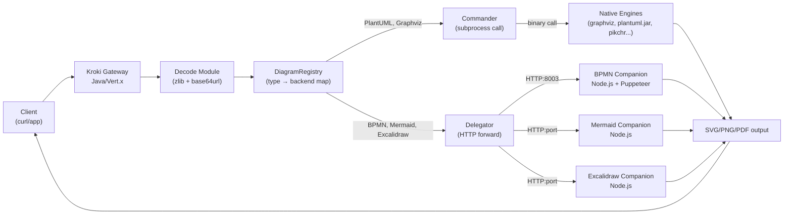
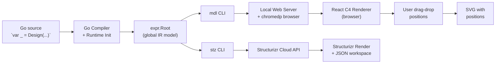

# Weekly Diagram Tooling Scan — 2026-06-25

## Executive Summary

- **Mermaid v11 vẫn là trung tâm ecosystem**: 88k stars, 30+ diagram types, active development với ELK layout opt-in và plugin detector architecture — đáng study kỹ cơ chế lazy-loading diagram type.
- **mermaid-rs-renderer là tín hiệu quan trọng**: Rust native reimplementation của toàn bộ Mermaid pipeline (không browser), 500–1600× nhanh hơn, dùng cùng `resvg` engine với kymostudio-core — xác nhận hướng đi của kymo là đúng.
- **Kroki's microservice pattern** và **goadesign/model's embedded-Go DSL** cung cấp hai góc nhìn khác nhau về kiến trúc extensibility: service registry vs. language-as-DSL — cả hai đều áp dụng được insight cho kymo.

## Table of Contents

1. [mermaid-js/mermaid](#1-mermaid-jsmermaid) — 88k stars, TypeScript, updated 2026-06-24
2. [yuzutech/kroki](#2-yuzutechkroki) — 4.2k stars, Java+JS, updated 2026-06-24
3. [goadesign/model](#3-goadesignmodel) — 462 stars, Go, updated 2026-06-22
4. [1jehuang/mermaid-rs-renderer](#4-1jehuangmermaid-rs-renderer) — 1.4k stars, Rust, updated 2026-06-21

---

## 1. mermaid-js/mermaid

> https://github.com/mermaid-js/mermaid

### §1 — Quick Context

**One-line pitch**: DSL diagram engine lớn nhất ecosystem — text → SVG cho 30+ diagram types với plugin-based extensibility và dual layout backend (dagre / ELK).

- **Tech stack**: TypeScript, D3 v7, dagre-d3-es 7.0.14, Cytoscape, jison (parser compiler), roughjs, DOMPurify, KaTeX; internal `@mermaid-js/parser` package đang được phát triển song song.
- **Output**: SVG (DOM hoặc string), PNG (qua browser), hand-drawn style qua roughjs.
- **Repo health**: 88,856 stars, active org với nhiều maintainer, CI trên GitHub Actions, test suite đầy đủ. Latest stable v11.x (develop branch active), v10.9.6 là security backport.
- **Distribution**: npm (`mermaid`), CDN (jsDelivr).

### §2 — Architecture Deep-Dive

#### A. Component Inventory

- `Parser` (`packages/mermaid/src/diagrams/*/parser/`) — Per-diagram jison grammar files; mỗi diagram type có grammar riêng (`.jison` → compiled JS lexer/parser). Internal `@mermaid-js/parser` đang thay thế dần jison.
- `DiagramDB` (`packages/mermaid/src/diagrams/*/flowDb.ts` etc.) — State container mutable cho parsed diagram; mỗi diagram type có một DB riêng lưu nodes, edges, styling.
- `DiagramDetector` (`packages/mermaid/src/diagrams/*/flowDetector.ts`) — Function nhận raw text, trả `true` nếu match diagram type. Ordering của detectors là critical (first-match wins).
- `DiagramOrchestrator` (`packages/mermaid/src/diagram-api/diagram-orchestration.ts`) — Registry trung tâm; `addDiagrams()` đăng ký tất cả diagram types theo thứ tự ưu tiên; support lazy-loading qua `registerLazyLoadedDiagrams()`.
- `Renderer` (`packages/mermaid/src/diagrams/*/flowRenderer-v3-unified.ts` etc.) — Per-diagram SVG renderer; gọi layout algorithm và D3 để vẽ.
- `LayoutEngine` (`packages/mermaid/src/diagrams/flowchart/elk/`) — ELK (Eclipse Layout Kernel) là opt-in; dagre-d3-es là default.
- `mermaidAPI` (`packages/mermaid/src/mermaidAPI.ts`) — Public surface: `render()`, `parse()`, `initialize()`.
- `Diagram` (`packages/mermaid/src/Diagram.ts`) — Wrapper object: `Diagram.fromText(src)` orchestrates detection + parsing.

#### B. Pipeline / Control Flow

1. User gọi `mermaidAPI.render(id, diagramText)`.
2. `processAndSetConfigs(diagramText)` strip frontmatter/directives, extract theme overrides.
3. `Diagram.fromText(processed)` → iterate registered detectors theo priority order → first match xác định diagram type → gọi jison parser của type đó → populate DiagramDB.
4. `createUserStyles() + compileCSS()` → namespaced CSS string cho diagram.
5. `diag.renderer.draw(src, id, version, diag)` → gọi `getData()` trên DiagramDB để extract `LayoutData` → feed vào layout engine (dagre hoặc ELK) → D3 vẽ nodes/edges lên SVG DOM element.
6. DOMPurify sanitize SVG string → inject accessibility metadata (title, desc).
7. Return `{ diagramType, svg, bindFunctions }`.

#### C. Data Model / IR

DiagramDB là mutable stateful object — không phải immutable IR. Mỗi diagram type có DB schema khác nhau (flowchart DB có nodes/edges/subgraphs; sequence DB có messages/actors). Không có shared IR format — đây là weakness: mỗi renderer phải implement `getData()` để export `LayoutData` chuẩn hóa cho layout engine.

`LayoutData` là intermediate format giữa DB và renderer:
```typescript
{ nodes: Node[], edges: Edge[], config: LayoutConfig }
```
Mutable giữa các pass. ELK và dagre đều consume cùng `LayoutData` shape.

#### D. Input Language Design

- **Parser approach**: Jison (LALR(1) grammar compiler) per diagram type — grammar files `.jison` được compile thành JavaScript lexer+parser tại build time. `@mermaid-js/parser` mới đang được phát triển song song (chưa replace hoàn toàn).
- **Formal grammar**: Có `.jison` files — nhưng không có single unified EBNF spec. Mỗi diagram type tự define grammar riêng.
- **Error reporting**: Jison cung cấp basic line/column errors; user-facing error messages được wrap lại bởi mermaid; chưa có detailed contextual errors.
- **Detection**: Keyword-based detector (ví dụ flowchart detector check `src.startsWith('graph') || src.startsWith('flowchart')`).

#### E. Layout Algorithm

- **Default**: dagre (dagre-d3-es) — Sugiyama hierarchical layout cho directed graphs. Xếp hạng nodes theo layers, minimize crossings.
- **Opt-in**: Eclipse Layout Kernel (ELK) — Java-originated layout framework ported to JS; hỗ trợ orthogonal routing, hierarchical layout, và crossing minimization tốt hơn. Được gated bởi `includeLargeFeatures` flag (có thể tăng bundle size).
- **Edge routing**: Straight (default) hoặc orthogonal khi dùng ELK.
- **Spacing**: nodeSpacing 50px, rankSpacing 50px — hardcoded defaults, configurable qua diagram config.
- **Cytoscape**: Được dùng cho mindmap và architecture diagrams (force-directed, cose-bilkent và fcose algorithms).

#### F. Rendering / Output Strategy

- **Primary backend**: SVG qua D3. D3 manipulates DOM elements; mermaid serialize về string.
- **Hand-drawn style**: roughjs vẽ lại các shapes với "sketchy" appearance khi `look: 'handDrawn'`.
- **Multiple output paths**: Browser DOM (live embed), SVG string, PNG (qua headless browser - external tool `mermaid-cli`).
- **No animation**: Static SVG only (không có CSS animation hay JS animation built-in).
- **Pluggable renderer**: Mỗi diagram type implement interface `DiagramRenderer.draw()` — thực chất là pluggable emitter pattern per type.

#### G. Extensibility

- **Add diagram type**: Implement detector + parser + DB + renderer, gọi `registerDiagram()` hoặc `registerLazyLoadedDiagrams()`.
- **External packages**: Có thể register diagram types từ npm packages bên ngoài.
- **Theming**: CSS variables + theme compilation; built-in themes: default, dark, forest, neutral, base.
- **Layout**: Có thể đăng ký custom layout algorithm qua `getRegisteredLayoutAlgorithm()` registry.

#### H. Dev Experience

- **CLI**: `mermaid-cli` (separate npm package), headless Puppeteer-based, đây là lý do nó chậm (~2 giây per render).
- **IDE**: VS Code extension có preview; nhiều third-party plugins.
- **Live editor**: https://mermaid.live — browser-based playground.
- **Error messages**: Còn basic, không contextual.

### §3 — Architecture Diagram

```mermaid
flowchart LR
    Input["`.mmd` text"] --> API["mermaidAPI.render()"]
    API --> Preproc["processAndSetConfigs()\n(directives, frontmatter)"]
    Preproc --> FromText["Diagram.fromText()"]
    FromText --> DetectorReg["DiagramOrchestrator\n(Detector Registry)"]
    DetectorReg --> JisonParser["Jison Parser\n(per diagram type)"]
    JisonParser --> DiagramDB["DiagramDB\n(mutable state)"]
    DiagramDB --> GetData["getData() → LayoutData"]
    GetData --> Layout{Layout Engine}
    Layout -->|default| Dagre["dagre-d3-es\n(Sugiyama/hierarchical)"]
    Layout -->|opt-in| ELK["Eclipse Layout Kernel\n(orthogonal routing)"]
    Layout -->|mindmap/arch| Cytoscape["Cytoscape.js\n(force-directed)"]
    Dagre --> D3Render["D3 SVG Renderer\n(diag.renderer.draw)"]
    ELK --> D3Render
    Cytoscape --> D3Render
    D3Render --> Sanitize["DOMPurify\n+ a11y inject"]
    Sanitize --> SVGOut["SVG string output"]
```

### §4 — Verdict

**Áp dụng cho kymostudio**:
- **Detector pattern** (first-match detector registry) là elegant — kymo hiện detect bằng file extension (`.kymo`, `.bpmn`), nhưng nếu muốn support inline embedding trong markdown, detector array như mermaid sẽ cần thiết.
- **`getData()` contract** giữa parser và renderer: kymo đang làm đúng rồi (`Diagram` dataclass → renderer), nhưng tên convention này đáng borrow.
- **ELK integration**: Mermaid phải dùng JS port của ELK vì browser-bound. Kymo có lợi thế lớn khi native — có thể gọi ELK binary trực tiếp hoặc dùng Rust ELK binding nếu muốn.
- **Red flag**: DiagramDB mutable global state (không thread-safe) — kymo dùng immutable dataclasses là kiến trúc tốt hơn.
- **Open question**: `@mermaid-js/parser` mới dùng gì (PEG? treesitter?) — cần watch.

**Verdict**: **Study deeper** — nhất là cơ chế detector registry và ELK layout integration.

---

## 2. yuzutech/kroki

> https://github.com/yuzutech/kroki

### §1 — Quick Context

**One-line pitch**: Unified REST API gateway cho 20+ diagram engines — một endpoint duy nhất thay thế việc self-host từng tool riêng lẻ.

- **Tech stack**: Java 17 + Vert.x (gateway server), Node.js + Puppeteer (per-engine companion services), Maven + Docker.
- **Output**: SVG, PNG, PDF, Base64 — tùy engine hỗ trợ.
- **Repo health**: 4,203 stars, org yuzutech, CI active, Docker images on Docker Hub. Latest release active (codebase pushed 2026-06-24).
- **Distribution**: Docker (self-hosted), API service tại kroki.io.

### §2 — Architecture Deep-Dive

#### A. Component Inventory

- `Gateway Server` (`server/src/main/java/io/kroki/server/`) — Java/Vert.x HTTP server; `Server.java` định nghĩa routes; `DiagramRegistry` ánh xạ diagram type → backend service.
- `DiagramRest` (`server/.../action/DiagramRest.java`) — Request handler: decode source, lookup registry, dispatch.
- `DiagramService` interface — Contract mỗi backend phải implement: `convert()`, `getSupportedFormats()`, `getVersion()`, `sanitize()`.
- `Plantuml` (`server/.../service/Plantuml.java`) — Java wrapper tích hợp sâu nhất; xử lý PNG/SVG/PDF/TXT; inject theme, sanitize `!include`.
- `Commander` — Dispatch pattern cho subprocess-based backends (GraphViz, ditaa, pikchr, tikz — gọi binary qua subprocess).
- `Delegator` — Dispatch pattern cho companion microservices (Mermaid, BPMN, Excalidraw, Vega — HTTP forward đến companion container).
- `BPMN Companion` (`bpmn/src/index.js`) — Node.js + Puppeteer service trên port 8003; warm Chrome at startup, convert BPMN XML → SVG qua headless browser.
- `Mermaid Companion` (`mermaid/`) — Node.js service, render Mermaid diagrams server-side.
- `Decode` (`server/.../decode/`) — Zlib decompress + base64 decode input source cho URL-encoded requests.

#### B. Pipeline / Control Flow

1. Client gửi `POST /bpmn/svg` với BPMN XML body (hoặc GET với zlib+base64-encoded URL).
2. `DiagramRest.handle()` → decode source (UTF-8, optionally decompress) → lookup `DiagramRegistry["bpmn"]` → trả về `DiagramService` instance.
3. Registry dispatch: nếu là BPMN → `Delegator` forward HTTP request đến BPMN companion container (`http://bpmn:8003`).
4. BPMN companion nhận request → Worker wraps source trong `Task` → Puppeteer loads bpmn-js in headless Chrome → converts BPMN XML → SVG string.
5. SVG trả về gateway → gateway set `Content-Type: image/svg+xml` → trả về client.
6. Nếu timeout → 408; syntax error → 400; exception → 500.

#### C. Data Model / IR

Không có shared IR. Mỗi engine xử lý source text trực tiếp — kroki là **thin proxy/router**, không parse hay transform diagram AST. Source text đi thẳng từ client đến engine tương ứng. Đây là tradeoff: đơn giản hóa integration nhưng không cho phép cross-format conversion hay source validation ở gateway layer.

Plantuml service có thêm `sanitize()` bước — strip `!include` directives vì security risk.

#### D. Input Language Design

Kroki không define DSL — nó delegate parsing hoàn toàn cho từng engine backend. Format đầu vào là native syntax của mỗi tool (PlantUML syntax, Mermaid syntax, BPMN XML, etc.).

**URL encoding scheme**: Source → UTF-8 → zlib deflate → base64url → embed trong URL. Cho phép GET request với diagram source trong URL.

#### E. Layout Algorithm

Không có layout engine riêng — delegate hoàn toàn cho backend engines (Graphviz dot algorithm, PlantUML's layout, Mermaid's dagre, etc.).

#### F. Rendering / Output Strategy

- **Backends**: SVG (hầu hết engines), PNG (PlantUML, Graphviz), PDF (PlantUML), ASCII art (PlantUML TXT).
- **Pluggable**: Mỗi `DiagramService` implement interface riêng → thêm engine mới chỉ cần implement interface + thêm vào registry.
- **Browser-dependent backends**: BPMN, Mermaid, Excalidraw companion services đều dùng Puppeteer → startup overhead, memory usage cao.
- **Animation**: Không hỗ trợ.

#### G. Extensibility

- **Add diagram type**: Implement `DiagramService` Java interface + add companion microservice (optional) + register trong `DiagramRegistry`.
- **Companion service protocol**: HTTP REST, companion listen trên dedicated port.
- **Docker Compose**: Mỗi companion là optional container; deployment linh hoạt.
- **No plugin system**: Extensibility qua code + container, không có runtime plugin loading.

#### H. Dev Experience

- **API**: REST, curl-friendly; URL-encoded GET và POST JSON/plaintext.
- **kroki.io**: Hosted version với playground.
- **Self-hosted**: Docker Compose file có sẵn.
- **No CLI**: Có `kroki-cli` (Go, 83 stars) là thin wrapper gọi API.

### §3 — Architecture Diagram



### §4 — Verdict

**Áp dụng cho kymostudio**:
- **DiagramRegistry pattern** là blueprint tốt nếu kymo muốn add "adapter" cho external format (pikchr, graphviz, etc.) mà không muốn port toàn bộ engine.
- **URL encoding scheme** (source → zlib → base64url) rất clean cho shareable diagram URLs — kymo's web editor có thể borrow y chang pattern này.
- **Companion service isolation**: Cách kroki isolate browser-dependent rendering (BPMN companion) sang separate process giải quyết đúng vấn đề memory/stability — kymo chưa cần (không dùng browser), nhưng nếu add AI-generated diagrams hay third-party engines thì pattern này relevant.
- **Red flag**: Companion services dùng Puppeteer headless Chrome → expensive, fragile. Đây là lý do mermaid-rs-renderer tồn tại.
- **Open question**: kroki có đang thay thế Puppeteer companions bằng native renderers không?

**Verdict**: **Glance only** — pattern hay nhưng kymo không cần gateway architecture. URL encoding scheme đáng steal ngay.

---

## 3. goadesign/model

> https://github.com/goadesign/model

### §1 — Quick Context

**One-line pitch**: Mô tả C4 architecture bằng Go code thuần — không cần custom parser, Go compiler IS the parser, output là SVG hoặc Structurizr JSON.

- **Tech stack**: Go 1.26+, chromedp (headless Chrome cho local editor), Structurizr API client; không có layout engine riêng.
- **Output**: SVG (vị trí do user chỉnh trong browser), Structurizr workspace JSON.
- **Repo health**: 462 stars, org goadesign (tác giả framework Goa), 30 open issues, có CI. Latest v1.15.0 (June 2024).
- **Distribution**: `go install` binary; không có npm/PyPI.

### §2 — Architecture Deep-Dive

#### A. Component Inventory

- `DSL` (`dsl/`) — Go functions: `Design()`, `Person()`, `SoftwareSystem()`, `Container()`, `Component()`, `Uses()`, `InteractsWith()`, `Views()`. Executed at Go init time via `var _ = Design(...)`.
- `Expr` (`expr/`) — IR data model: `Model` struct (Enterprise, People, Systems, DeploymentNodes), `Person`, `SoftwareSystem`, `Container`, `Component`, `Relationship`, `Element` (base interface). Hierarchical containment.
- `Codegen` (`codegen/`) — Code generation utilities, không rõ target.
- `MDL tool` (`cmd/mdl/`) — CLI binary: load Go model package → start local browser editor (chromedp) → user drag-drop positions → export SVG với positions embedded.
- `STZ tool` (`cmd/stz/`) — CLI binary: load model → serialize Structurizr JSON → upload qua Structurizr API → sync changes back.
- `Plugin` (`plugin/`) — Extension point, không rõ scope.
- `DSL.md` — Normative grammar documentation (written docs, không phải machine-readable).

#### B. Pipeline / Control Flow

**Workflow A — Local SVG via `mdl`**:
1. User viết Go file: `var _ = Design("My System", ..., func() { Person(...) ... })`.
2. `mdl` binary `go run` user's package → DSL functions execute at init time → populate `expr.Root` global model.
3. `mdl` starts local web server + opens Chrome via chromedp → renders C4 diagram in browser.
4. User drag-drop elements để position → positions saved.
5. `mdl export` → serialize model + positions → SVG file.

**Workflow B — Structurizr cloud via `stz`**:
1. Same step 1-2 as above.
2. `stz push` → serialize `expr.Root` → Structurizr JSON workspace → POST to Structurizr API.
3. Structurizr cloud renders + saves → `stz pull` sync positions back.

#### C. Data Model / IR

`expr.Root` là global singleton (mutable, populated at init). `Model` struct:
```go
type Model struct {
    Enterprise               string
    People                   People           // []*Person
    Systems                  SoftwareSystems  // []*SoftwareSystem
    DeploymentNodes          []*DeploymentNode
    AddImpliedRelationships  bool
}
```
Hierarchical: `SoftwareSystem` → `[]Container` → `[]Component`. Relationships cross-cut. Không có intermediate compile step — Go struct IS the IR.

#### D. Input Language Design

- **Parser approach**: Không có parser! DSL là Go code — Go compiler parse nó. DSL functions build `expr.Root` as side effects khi package được load.
- **Formal grammar**: `DSL.md` document specs behavior bằng prose và Go code examples — không có BNF/EBNF file.
- **Error reporting**: Go compile errors + runtime panics nếu DSL constraints bị vi phạm (e.g., `Design()` gọi nhiều hơn một lần).
- **Novelty**: "The language is Go" — không có new syntax để học; IDE (GoLand/VS Code) autocomplete DSL functions như bình thường.

#### E. Layout Algorithm

**Không có auto-layout**. Positions do user xác định trong browser editor (`mdl`) hoặc Structurizr cloud. Đây là deliberate choice: C4 diagrams typically cần hand-crafted layout để communicate architecture intent.

Không có edge routing algorithm — edges là straight lines hoặc Structurizr-rendered.

#### F. Rendering / Output Strategy

- **Local render**: Browser-based (chromedp → React app renders diagram).
- **Cloud render**: Structurizr service renders canonical C4 views.
- **SVG export**: Positions + diagram serialized to SVG.
- **No animation**.
- **No pluggable backend**: Chỉ có mdl (local) và stz (Structurizr).

#### G. Extensibility

- `plugin/` package tồn tại nhưng scope unclear từ README.
- Không có documented plugin API.
- Extensibility thực tế là: viết Go functions định nghĩa reusable architecture components → import như Go package.

#### H. Dev Experience

- **IDE**: Full Go IDE support (autocomplete, go to definition, refactor) vì DSL là Go code.
- **Hot reload**: `mdl` watch mode (browser auto-updates khi file thay đổi).
- **Browser preview**: Yes, via chromedp.
- **Error messages**: Go compiler errors — rõ ràng với Go devs.

### §3 — Architecture Diagram



### §4 — Verdict

**Áp dụng cho kymostudio**:
- **Go-embedded DSL pattern** là một extreme khác của spectrum — DSL là host language code, không cần parser. Kymo đang ở opposite extreme (custom `.kymo` text syntax). Câu hỏi: liệu kymo có nên cung cấp Python API (`kymo.Diagram()`) song song với `.kymo` text syntax không? goadesign/model là blueprint cho approach đó.
- **`expr.Root` singleton anti-pattern**: Global mutable singleton populated at init là fragile — kymo's immutable dataclass approach rõ ràng tốt hơn cho testability.
- **No-auto-layout decision**: Thú vị — với C4 architecture diagrams, layout ý nghĩa quan trọng hơn layout đẹp. Kymo nên có cả hai options.
- **Reusable architecture via Go imports**: Concept "import architecture component như Go package" là powerful — kymo có thể borrow ý tưởng này dưới dạng `.kymo` `import` statement.
- **Red flag**: Phụ thuộc chromedp (headless Chrome) cho local editor → heavy dependency, fragile. Kroki có cùng vấn đề với Puppeteer.
- **Open question**: `codegen/` package làm gì? Có generate code từ model không?

**Verdict**: **Glance only** — DSL-as-Go-code pattern đáng tham khảo tư duy, nhưng không apply trực tiếp vào kymo pipeline.

---

## 4. 1jehuang/mermaid-rs-renderer

> https://github.com/1jehuang/mermaid-rs-renderer

### §1 — Quick Context

**One-line pitch**: Native Rust reimplementation toàn bộ Mermaid pipeline — không cần browser, 500–1600× nhanh hơn mermaid-cli, dùng cùng `resvg` engine với kymostudio-core.

- **Tech stack**: Rust 83.5%, Python (testing scripts), Mermaid DSL files (test fixtures). Key crates: resvg (SVG→PNG — same as kymostudio-core), custom Rust parser + layout + renderer.
- **Output**: SVG, PNG (via resvg).
- **Repo health**: 1,413 stars, individual project (1jehuang), 5 open issues. Updated 2026-06-21. MIT license. Cargo test suite + benches/.
- **Distribution**: Binary (cargo install).

### §2 — Architecture Deep-Dive

#### A. Component Inventory

Dựa trên README và top-level structure — src/ directory không accessible trực tiếp, nhưng README mô tả rõ pipeline:

- `Parser` (`src/parser/` — inferred) — Mermaid DSL parser written in Rust. Không dùng jison hay browser — native Rust implementation. Hỗ trợ 23 diagram types.
- `IR` (`src/ir/` — inferred) — Intermediate representation của parsed diagram (nodes, edges, labels, styles).
- `Layout Engine` (`src/layout/` — inferred) — Rust layout implementation; cụ thể algorithm chưa xác định từ public docs (likely dagre port hoặc custom).
- `Renderer` (`src/renderer/` — inferred) — SVG string emitter từ laid-out graph.
- `PNG Export` — Gọi `resvg` (same crate as kymostudio-core) để rasterize SVG → PNG.
- `CLI` (`src/main.rs` — inferred) — Entry point; parse flags `--fastText`, `--format`, input file.
- `Font Cache` — Built-in font caching system; critical để đạt speedup 500–900× trên warm runs.
- `Fast Text Metrics` (`--fastText` flag) — Approximate text measurement thay vì full font shaping → thêm 3–5× speedup.

#### B. Pipeline / Control Flow

1. User chạy `mmdr diagram.mmd` (hoặc pipe stdin).
2. Rust parser đọc `.mmd` source → detect diagram type từ first keyword → parse syntax → build IR (nodes, edges, labels).
3. Layout engine compute positions: assign node coordinates + route edges.
4. SVG renderer emit SVG string từ positioned IR.
5. (Optional) Pass SVG → resvg → rasterize → PNG output.
6. Write SVG/PNG to stdout hoặc file.

Không có browser spawn, không có Node.js process, không có subprocess. Toàn bộ trong một Rust binary.

#### C. Data Model / IR

Không xác định từ public docs — cần đọc src/. Likely là struct-based IR tương tự:
```rust
struct Diagram { nodes: Vec<Node>, edges: Vec<Edge>, config: DiagramConfig }
struct Node { id: String, label: String, shape: Shape, pos: Option<(f64, f64)> }
struct Edge { from: String, to: String, label: Option<String>, style: EdgeStyle }
```
Immutable sau layout pass (inferred từ Rust ownership model — idiomatic Rust favors immutable data flow).

#### D. Input Language Design

- **Parser approach**: Custom Rust parser — không rõ approach (recursive descent hay PEG). Hỗ trợ 23 diagram types nghĩa là có hoặc một unified grammar hoặc per-type parsers như mermaid gốc.
- **Formal grammar**: Không có formal grammar document trong public docs.
- **Compatibility**: Claim compatible với Mermaid syntax — phải implement toàn bộ Mermaid grammar.
- **Error reporting**: Không xác định.

#### E. Layout Algorithm

- Không xác định rõ từ docs — likely dagre port in Rust hoặc custom hierarchical layout.
- `nodeSpacing`, `rankSpacing` configurable (tương tự mermaid).
- Edge routing: không xác định.

#### F. Rendering / Output Strategy

- **SVG**: Pure Rust string generation (không dùng DOM, không dùng D3).
- **PNG**: Delegate sang `resvg` — ĐÂY LÀ ĐIỂM ĐỘC ĐÁO: cùng engine với `kymostudio-core`!
- **No animation**: Static output only.
- **Performance tiers**: 
  - Default: 100–450× vs mermaid-cli
  - Warm font cache: 500–900×
  - `--fastText` (approximate metrics): 1000–1600×

#### G. Extensibility

- Không rõ plugin system.
- Add diagram type: cần implement parser + layout + renderer cho type đó trong Rust.
- CLI flags cho configuration (`--fastText`, format selection).

#### H. Dev Experience

- **CLI**: Fast, direct — không cần Node.js hay browser.
- **IDE**: Không có (plain binary).
- **Font caching**: Explicit warm-up recommended để đạt full speed.
- **Benchmarks**: Detailed benchmark table trong README — excellent DX cho performance-sensitive use cases.

### §3 — Architecture Diagram

```mermaid
flowchart LR
    MmdFile["`.mmd` source"] --> RustParser["Rust Parser\n(per diagram type)"]
    RustParser --> IR["Diagram IR\n(nodes, edges, config)"]
    IR --> LayoutEngine["Layout Engine\n(Rust, algorithm ?)")"]
    LayoutEngine --> PositionedIR["Positioned IR\n(coords computed)"]
    PositionedIR --> SVGRenderer["SVG Renderer\n(pure Rust string emit)"]
    SVGRenderer --> SVGOut["SVG output"]
    SVGOut -->|PNG request| Resvg["resvg\n(same as kymostudio-core!)"]
    Resvg --> PNGOut["PNG output"]
    FontCache["Font Cache\n(warm = 5–9× speedup)"] -.->|accelerates| SVGRenderer
    FastText["--fastText flag\n(approx metrics)"] -.->|further speedup| SVGRenderer
```

### §4 — Verdict

**Áp dụng cho kymostudio**:
- **Validation của architecture kymo**: mmdr xác nhận rằng pipeline `source → Rust parser → IR → layout → SVG → resvg → PNG` là viable và fast. Kymo đang đi đúng hướng.
- **Font caching**: Kymo chưa có explicit font cache. mmdr benchmark cho thấy font loading là bottleneck lớn nhất — warm cache tăng 5–9×. Đây là easy win cho kymo CLI performance.
- **`--fastText` / approximate text metrics**: Kymo hiện đo text width chính xác (resvg font metrics). mmdr suggest approximate mode có thể đủ cho layout trong nhiều cases. Trade-off: layout accuracy vs. speed — đáng investigate.
- **Cùng resvg engine**: mmdr và kymostudio-core đều dùng resvg. Nếu mmdr open-source Rust code, có thể học từ cách họ wrap resvg cho Mermaid shapes.
- **Red flag**: src/ directory không public-accessible — có thể repo private source. 1,413 stars nhưng không có active contributors list → single-author risk.
- **Open question**: Layout algorithm cụ thể là gì? Có handle orthogonal edge routing không? Cách implement subgraph layout?

**Verdict**: **Study deeper** — đặc biệt font caching architecture và approximate text metrics. Nếu source code accessible, đọc layout engine implementation.

---

*Scanned by: claude-sonnet-4-6 | Date: 2026-06-25 | Branch: `claude/adoring-wozniak-mdb2ca`*
