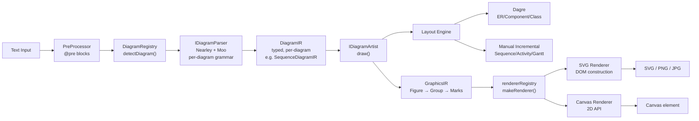
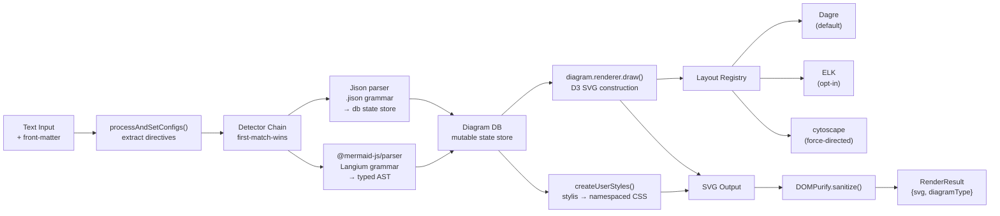
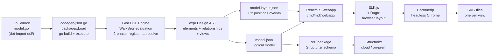

```mermaid
flowchart LR
    Raster["Raster Logo\nPNG/JPG/WebP"] --> AI["Claude Agent\nSKILL.md orchestration"]
    AI --> MotionBrief["Motion Brief\n(motion_spec.md)\npersonality + choreography intent"]
    MotionBrief --> GeoFit["Geometry Fitting\ncomplexity ladder\nsmoothing → IoU QA loop"]
    GeoFit --> OverlayQA["render_overlay.py\nIoU measurement"]
    OverlayQA -->|"IoU ok"| SVGFile["SVG File\nstable semantic IDs\n#mark #dot #wordmark"]
    OverlayQA -->|"iterate"| GeoFit
    SVGFile --> Choreograph["CSS @keyframes\nDisney 12 principles\n20/50/30 timing"]
    Choreograph --> HTMLOut["Standalone HTML\n?t=ms QA hook\nreplay/slow-motion"]
    HTMLOut --> Playwright["Playwright\nframe capture + easing probe"]
    Playwright -->|"linear detected"| Choreograph
    Playwright -->|"pass"| Output["Deliverables\nSVG + CSS + HTML + GIF"]
```

# Weekly Research Scan — Diagram Tooling
**2026-06-26** | Tuần 26, 2026

---

## Executive Summary

- **Mermaid v11.16.0** (phát hành 25/06) lần đầu tiên trên thế giới cung cấp DSL cho Cynefin framework; đồng thời tiếp tục migration từ Jison sang **Langium** (TypeScript-native language workbench) — một chiến lược parser thay thế đáng nghiên cứu cho kymo.
- **Pintora** cho thấy mô hình two-layer IR (DiagramIR → GraphicsIR marks) sạch hơn kymo's single-pass model cho bài toán multi-renderer; pattern đăng ký diagram type qua `IDiagram` interface là cách tiếp cận plugin mạnh nhất trong tuần này.
- **nolangz/pixel2motion** (mới 14 ngày, 1030 stars) phát hiện critical Chromium gotcha: CSS custom properties bên trong `@keyframes` bị silently dropped, fallback về linear — bất kỳ animated SVG output nào của kymo phải dùng literal `cubic-bezier()` thay vì CSS variables.

---

## Table of Contents

1. [hikerpig/pintora](#1-hikerpigpintora) — TypeScript text-to-diagram monorepo với plugin architecture
2. [mermaid-js/mermaid](#2-mermaid-jsmermaid) — v11.16.0 với Cynefin DSL và Langium migration
3. [goadesign/model](#3-goadesignmodel) — Go-as-DSL cho C4 architecture diagrams
4. [nolangz/pixel2motion](#4-nolangzpixel2motion) — AI-driven raster→SVG animation pipeline

---

## 1. hikerpig/pintora

> **Repo**: https://github.com/hikerpig/pintora | **Stars**: ~1,285 | **Lang**: TypeScript | **Pushed**: 2026-06-24

### §1 — Quick Context

**Pitch**: Library text-to-diagram chạy cả browser lẫn Node.js với hệ thống plugin hoàn chỉnh — thêm diagram type mới không cần fork, chỉ implement một interface.

| Attribute | Value |
|---|---|
| **Tech stack** | TypeScript, Nearley (forked), Moo (forked), Dagre (forked), D3 sub-packages, pnpm + Turborepo |
| **Output** | SVG, Canvas (browser), PNG/JPG (CLI) |
| **Stars / Contributors** | ~1,285 / chủ yếu 1 người (hikerpig) |
| **Last release** | v0.8.2 (sequence, class, component diagram fixes) |
| **CI/Tests** | Có (jest, vitest) |
| **Distribution** | npm (`@pintora/standalone`, `@pintora/cli`, etc.) |

### §2 — Architecture Deep-Dive

#### A. Component Inventory

| Module | File | Vai trò |
|---|---|---|
| `pintora-core` | `packages/pintora-core/src/index.ts` | Entry point: `parseAndDraw()`, `diagramRegistry`, `configApi`, `themeRegistry` |
| `IDiagram` interface | `packages/pintora-core/src/type.ts` | Contract plugin phải implement: `{pattern, parser, artist, eventRecognizer, configKey}` |
| `GraphicsIR` | `packages/pintora-core/src/types/graphics.ts` | Universal mark tree: `Figure → Group → [Rect, Circle, Line, Text, Path, Marker, Polygon, GSymbol]` |
| `DiagramRegistry` | `packages/pintora-core/src/diagram-registry.ts` | `registerDiagram()`, `detectDiagram()` (regex pattern-match) |
| `pintora-diagrams` | `packages/pintora-diagrams/src/` | 8 built-in diagram types; mỗi cái có `index.ts`, `parser/`, `artist.ts` |
| `pintora-renderer` | `packages/pintora-renderer/src/index.ts` | `SvgRenderer`, `CanvasRenderer`, `rendererRegistry`, `makeRenderer()` factory |
| `pintora-standalone` | `packages/pintora-standalone/src/index.ts` | Browser/Node entry: `renderTo()`, `initBrowser()`, config stack |
| `pintora-cli` | `packages/pintora-cli/src/index.ts` | CLI: `renderToImage()`, `renderToSvg()`, subprocess vs in-process |
| `pintora-stencil` | `packages/pintora-stencil/` | Web Components wrapper |

#### B. Pipeline / Control Flow

```
1. User gọi pintora.renderTo(text, {container, renderer: 'svg'})
2. PreProcessor: strip @pre config blocks, extract config overrides
3. diagramRegistry.detectDiagram(text): regex pattern-match để nhận diagram type
4. IDiagramParser.parse(text, context): Nearley+Moo grammar → DiagramIR (typed, per-diagram)
5. IDiagramArtist.draw(diagramIR, options): layout → GraphicsIR (universal mark tree)
6. rendererRegistry.makeRenderer(graphicsIR, {renderer}): factory tạo SVG hoặc Canvas backend
7. IRenderer.render(): traverse mark tree → DOM SVG elements / Canvas 2D draw calls
```

#### C. Data Model / Intermediate Representation

Hai lớp IR riêng biệt:

**Layer 1 — DiagramIR**: Mỗi diagram type có typed struct riêng. Ví dụ `SequenceDiagramIR` có `{actors: Actor[], messages: Message[], notes: Note[]}`. Mutable trong quá trình parse; per-diagram.

**Layer 2 — GraphicsIR**: Universal mark tree, shared giữa tất cả diagram types:
```typescript
Figure { width, height, mark: Group }
Group { children: Mark[], matrix?: mat3, class?: string }
Mark = Rect | Circle | Ellipse | Line | PolyLine | Polygon | Text | Path | Marker | GSymbol
// MarkAttrs borrowed from @antv/g: stroke, fill, font, shadow, etc.
```

Immutable sau khi `artist.draw()` xong. Không có "compile to lower IR" stage như D2/TALA.

#### D. Input Language Design

- **Parser approach**: Nearley (LL parser generator, forked) + Moo (lexer, forked). Mỗi diagram type có grammar file riêng và parser class riêng wrapped trong `ParserWithPreprocessor`.
- **Grammar**: Nearley `.ne` files; không có EBNF document publish chính thức.
- **Diagram detection**: Regex pattern-match trên dòng đầu tiên (e.g. `/^\s*sequenceDiagram/`). First-match-wins.
- **Error reporting**: Nearley parse error propagation; không có user-friendly diagnostics rõ ràng.
- **@pre blocks**: DSL config blocks được PreProcessor strip trước khi grammar chạy — sạch hơn kymo's inline config approach.

#### E. Layout Algorithm

**Dual strategy**:
- **Graph diagrams** (ER, component, class, mindmap): Forked Dagre (`@pintora/dagre`) — Sugiyama-style layered layout, config: `rankdir`, `nodesep`, `ranksep`.
- **Sequential diagrams** (sequence, activity, Gantt): Custom incremental layout — stateful `Model` class bump một `verticalPos` cursor, tính actor margins từ message widths, apply `mat3` matrix transforms.

Không có constraint solver. Crossing minimization: Dagre đã có built-in. Edge routing: straight cho sequential, orthogonal cho graph (Dagre).

#### F. Rendering / Output Strategy

- **Backends**: SVG (chính, browser DOM construction), Canvas (browser HTML5 2D API). PNG/JPG qua CLI subprocess rendering.
- **Animation**: Không có — Pintora chỉ render static.
- **Pattern**: Pluggable emitter via `rendererRegistry`. Renderer không biết gì về diagram semantics — chỉ traverse GraphicsIR marks.

#### G. Extensibility

Implement `IDiagram<MyIR, MyConfig>` với 4 field:
```typescript
{ pattern: RegExp, parser: IDiagramParser, artist: IDiagramArtist, eventRecognizer?: IDiagramEventRecognizer }
```
Gọi `diagramRegistry.registerDiagram('myType', impl)`. v0.8.0 thêm StyleEngine với `@pre` blocks và `@bindClass` statements cho CSS-like customization mà không cần code.

#### H. Dev Experience

- CLI: `pintora-cli` package, `renderToImage()` / `renderToSvg()` API.
- VS Code: `pintora-vscode` (separate package, preview in editor).
- Browser: `@pintora/standalone` package; `renderContentOf()` auto-detect `<div class="pintora">` elements.
- Watch mode: Không thấy evidence trong monorepo.

### §3 — Architecture Diagram



### §4 — Verdict

**Điểm học cho kymo**:
- **Two-layer IR** (DiagramIR → GraphicsIR) là pattern đáng nghiên cứu: GraphicsIR mark tree hoàn toàn decoupled khỏi diagram semantics → dễ add renderer mới (Figma, Excalidraw) hơn approach hiện tại của kymo.
- **`IDiagram` plugin contract** sạch hơn kymo's current approach: pattern + parser + artist + eventRecognizer trong một interface.
- `@pre` block preprocessing trước grammar là giải pháp tốt cho config-in-DSL mà không làm phức tạp grammar.

**Red flags**: Single maintainer, 40 open issues không được giải quyết. Nearley là parser generator ít phổ biến; nếu hikerpig stop maintain thì rủi ro cao.

**Open questions**: Tại sao fork Dagre thay vì dùng ELK? Pintora có plan support animation không?

**Verdict**: **Study deeper** — đặc biệt two-layer IR pattern và IDiagram plugin contract.

---

## 2. mermaid-js/mermaid

> **Repo**: https://github.com/mermaid-js/mermaid | **Stars**: 88,881 | **Lang**: TypeScript | **Pushed**: 2026-06-25 (v11.16.0)

### §1 — Quick Context

**Pitch**: Chuẩn công nghiệp cho diagram-as-code; v11.16.0 tuần này ship Cynefin diagram type đầu tiên thế giới và tiếp tục migration từ Jison sang Langium parser workbench.

| Attribute | Value |
|---|---|
| **Tech stack** | TypeScript, Langium (grammar), Jison (legacy), D3.js (SVG), Dagre (default layout), ELK (optional), RoughJS (sketch mode), DOMPurify |
| **Output** | SVG (static) |
| **Stars / Contributors** | 88,881 / 1000+ |
| **Last release** | v11.16.0 (2026-06-25) |
| **CI/Tests** | Extensive (vitest, playwright E2E, argos visual regression) |
| **Distribution** | npm (`mermaid`), CDN, integrations (GitHub, GitLab, Confluence, Notion) |

### §2 — Architecture Deep-Dive

#### A. Component Inventory

| Module | File | Vai trò |
|---|---|---|
| `mermaid` (core) | `packages/mermaid/src/` | Main package; `Mermaid.render()` API |
| `diagram-orchestration` | `packages/mermaid/src/diagram-api/diagram-orchestration.ts` | `addDiagrams()`: lazy-load registry; detector chain |
| `@mermaid-js/parser` | `packages/parser/src/language/` | Langium grammar files (`.langium`) → generated TS parsers |
| `@mermaid-js/layout-elk` | `packages/mermaid-layout-elk/` | ELK layered layout (optional large feature) |
| `@mermaid-js/tiny` | `packages/tiny/` | Lightweight build |
| `flowRenderer-v3-unified` | `packages/mermaid/src/renderers/` | D3-based unified SVG renderer, 70+ parameterized shapes |
| Jison parsers | `packages/mermaid/src/diagrams/*/parser/*.jison` | Legacy grammar files; migration to Langium ongoing |

#### B. Pipeline / Control Flow

```
1. mermaid.render(id, text) được gọi
2. processAndSetConfigs(text): extract front-matter directives (%%{...}%%), update MermaidConfig
3. Diagram.fromText(text): chạy detector chain (first-match) → identify diagram type
4. Type-specific parser (Langium hoặc Jison) parse text → typed AST → populate diagram db (state store)
5. DOM prep: tạo enclosing div → SVG element → g group; sandboxed mode wrap trong iframe
6. createUserStyles(): compile namespaced CSS từ theme + diagram styles qua stylis → inject <style> vào SVG
7. diag.renderer.draw(): layout engine tính node/edge positions → D3 vẽ shapes vào SVG groups
8. cleanUpSvgCode(): post-process SVG, fix IDs, handle viewBox
9. DOMPurify.sanitize(): XSS sanitization của SVG output
10. Return RenderResult { diagramType, svg, bindFunctions }
```

#### C. Data Model / Intermediate Representation

Mỗi diagram type có **diagram db** riêng (mutable state store, e.g. `FlowDB`, `SequenceDB`) được parser populate. Không có shared cross-diagram AST. Langium-backed types có strongly-typed AST nodes (generated TypeScript interfaces). Không có "lower IR" compile step — diagram db đi thẳng vào renderer.

**Layout positions** được tính bởi layout engine trong `renderer.draw()` phase — không được serialized vào IR, chỉ tồn tại trong memory khi render.

#### D. Input Language Design

**Dual-parser architecture** (đang migration):
- **Langium** (mới, `@mermaid-js/parser` v1.2.0): TypeScript-native language workbench, generate ANTLR4-style parsers từ `.langium` grammar files. Hiện cover: flowchart, sequence, class, state, git, gantt, pie, packet, radar, treemap, treeView, wardley, cynefin, eventModeling, architecture.
- **Jison** (legacy): JavaScript port của YACC/Bison, `.jison` grammar files colocated trong mỗi diagram's `parser/` dir. Còn ER, journey, kanban, sankey, xychart, và một số khác.

**Detection**: Detector function per diagram type; detector chain theo thứ tự priority. "Ordering of detectors is important — first one to return true wins."

**Error reporting**: Phụ thuộc parser (Langium có structured errors; Jison kém hơn).

#### E. Layout Algorithm

**Pluggable layout registry** (`registerLayoutLoaders()`):
- **Dagre** (default, `dagre-d3-es 7.0.14`): Sugiyama-style layered DAG layout.
- **ELK** (`@mermaid-js/layout-elk`, optional/large): Eclipse Layout Kernel — richer auto-layout.
- **cytoscape + cose-bilkent**: Force-directed (optional).
- **cytoscape-fcose**: Fast compound spring embedder (optional).
- Swimlane diagrams: Built-in engine riêng.
- Mindmap/Architecture: Dedicated logic riêng.

#### F. Rendering / Output Strategy

- **Backend duy nhất**: SVG via D3.js — không có Canvas, không có PDF built-in.
- **Animation**: Không có — mermaid chỉ render static SVG.
- **RoughJS**: Optional overlay cho hand-drawn sketch style.
- **Theme system**: `stylis` compile namespaced CSS, injected vào SVG — self-contained output.
- **XSS**: `DOMPurify.sanitize()` trên final SVG — critical cho web embedding.

#### G. Extensibility

```typescript
// Implement DiagramDefinition:
{ parser: ParseFunction, db: DBObject, renderer: { draw(text, id, version, diagObj): void }, styles: string }
// Register:
mermaid.registerExternalDiagrams([yourDef])
// Layout injection:
mermaid.registerLayoutLoaders([{ name, loader: () => import('./myLayout') }])
// Icon packs:
mermaid.registerIconPacks([{ name, icons: {...} }])
```

#### H. Dev Experience

- CLI: `@mermaid-js/mermaid-cli` (separate package, headless Puppeteer, PNG/SVG/PDF output).
- VS Code: Official extension (`mermaid-vscode`) với live preview.
- Playground: `mermaid.live` editor.
- E2E: Playwright suite với Argos visual regression.

### §3 — Architecture Diagram



### §4 — Verdict

**Điểm học cho kymo**:
- **Langium migration**: Thay vì hand-written line-oriented parser, Langium cung cấp strongly-typed AST generation từ formal grammar — đáng xem xét cho kymo's `dsl.py` và `dsl.ts` để có better error reporting và IDE support.
- **Pluggable layout registry** (`registerLayoutLoaders`): Kymo nên có abstraction tương tự để switch giữa auto-layout implementations dễ dàng.
- **DOMPurify trên SVG output**: Kymo hiện không sanitize SVG output — cần thêm nếu SVG được embed vào web pages.
- **Detector chain pattern**: Approach detect diagram type bằng detector function (thay vì file extension) đáng nghiên cứu.

**Notable release**: Cynefin diagram type (v11.16.0) — xem cách team mermaid implement một diagram type hoàn toàn mới với Langium grammar (`packages/parser/src/language/cynefin.langium`).

**Red flags**: Jison codebase còn lớn; migration dài hạn, không có deadline rõ. 1627 open issues.

**Verdict**: **Glance** — kymo đã biết mermaid rõ; focus vào Langium migration strategy và Cynefin implementation để học cách add diagram type mới với formal grammar.

---

## 3. goadesign/model

> **Repo**: https://github.com/goadesign/model | **Stars**: 462 | **Lang**: Go (70%) + TypeScript (26%) | **Pushed**: 2026-06-22

### §1 — Quick Context

**Pitch**: Dùng Go code làm DSL để model C4 architecture — không có syntax mới để học, architect viết Go functions, IDE tự làm autocomplete và type-check.

| Attribute | Value |
|---|---|
| **Tech stack** | Go, goa.design/goa/v3 (DSL engine), Chromedp (headless Chrome), ELK.js + React/TS (webapp editor), Dagre |
| **Output** | SVG, Structurizr workspace JSON, raw JSON |
| **Stars / Contributors** | 462 / ~5 |
| **Last release** | v1.x (maintenance mode hiện tại) |
| **CI/Tests** | Có (testify) |
| **Distribution** | `go install goa.design/model/cmd/mdl@latest` |

### §2 — Architecture Deep-Dive

#### A. Component Inventory

| Module | Path | Vai trò |
|---|---|---|
| `dsl/` | `dsl/*.go` | DSL functions users gọi: `Design()`, `SoftwareSystem()`, `Container()`, `Uses()`, `Views()`, `AutoLayout()` |
| `expr/` | `expr/*.go` | AST/expression layer: structs populated bởi DSL evaluation |
| `codegen/` | `codegen/json.go` | Runtime codegen pipeline: `packages.Load` → generate temp `main.go` → `go build` → execute |
| `mdl/` | `mdl/` | `RunDSL()`, HTTP server cho webapp, JSON serialization |
| `stz/` | `stz/` | Structurizr workspace JSON schema + REST API client |
| `cmd/mdl/` | `cmd/mdl/main.go` | `mdl` CLI: `serve`, `gen`, `svg` subcommands |
| `cmd/mdl/webapp/` | `cmd/mdl/webapp/` | React + TypeScript editor; ELK.js browser-side layout |
| `cmd/stz/` | `cmd/stz/main.go` | `stz` CLI: `gen`, `put`, `get` subcommands |

#### B. Pipeline / Control Flow

```
1. User viết model.go dùng dot-import: "import . goa.design/model/dsl"
   → gọi Design{ SoftwareSystem("BankApp", func() { Container("API", ...) }) }
2. User chạy: mdl serve goa.design/myapp/architecture
3. codegen/json.go dùng golang.org/x/tools/packages.Load để validate package
4. codegen generate temp main.go gọi mdl.RunDSL(), compile qua "go build", execute
5. Goa DSL engine walk Design AST theo WalkSets order:
   Model → People → Systems → Containers → Components → Deployment → Views
   (Phase 1: đăng ký elements, Phase 2: resolve relationships/views)
6. Kết quả marshal thành model.json + model.layout.json (layout state riêng biệt)
6a. SVG path: mdl start HTTP server; React webapp load JSON;
    ELK.js/Dagre tính layout browser-side; Chromedp headlessly export SVG
6b. Structurizr path: stz put upload model.json; stz get fetch layout ngược lại
7. Layout state (X/Y per element, vertices per relationship) persist trong model.layout.json riêng
```

#### C. Data Model / Intermediate Representation

Hierarchical C4 model rooted tại `expr.Design`:

```go
Element { ID, Name, Description, Technology, Tags []string, URL string, Properties map[string]string, Relationships []*Relationship }
// Concrete types embed Element:
Person, SoftwareSystem (→ Containers), Container (→ Components), Component
DeploymentNode (recursive: children[], InfrastructureNodes[], ContainerInstances[])

Relationship { Source, Destination *Element, Description, Technology, InteractionStyle, Tags }
// Destination resolved sau full DSL eval via DestinationPath string

// Views separate khỏi model:
ViewProps { Key, ElementViews []*ElementView{X,Y}, RelationshipViews, AutoLayout }
```

**Key insight**: Layout state trong `model.layout.json` tách biệt hoàn toàn khỏi `model.json` (logical model) — graphical edits tồn tại qua model regeneration.

#### D. Input Language Design

**Go itself as DSL** — không có grammar file, không có parser riêng. Pattern:
```go
import . "goa.design/model/dsl"  // dot import

var _ = Design(func() {
    SoftwareSystem("Big Bank PLC", "...", func() {
        Container("Internet Banking", "...", "Go", func() {
            Uses("Database", "reads/writes")
        })
    })
    Views(func() {
        SystemContextView("BigBankPLC", func() {
            AddDefault()
            AutoLayout(LeftRight)
        })
    })
})
```

DSL evaluation dùng `goa.design/goa/v3` framework's evaluation engine — stack-based context tracking khi anonymous functions được gọi.

**Trade-off**: Không có parse errors, nhưng không có syntax highlighting/IDE support riêng (dùng Go IDE). Không thể parse một `.kymo` file — users phải viết Go code.

#### E. Layout Algorithm

- **Browser-side ELK.js** (Eclipse Layout Kernel v0.10.0): Algorithms: Layered, Force, Tree, Radial, Stress, Disco. Tính toán trong React webapp.
- **Dagre** (fallback): JavaScript directed-graph layout.
- **Graphviz** (option): External dot-based layout.
- AutoLayout config trong DSL: `AutoLayout(TopBottom, RankSepNumber, NodeSepNumber, EdgeSepNumber)`.
- Positions stored trong `model.layout.json` overlay — không bị overwrite khi regenerate model.

#### F. Rendering / Output Strategy

- **SVG**: Headless Chrome qua Chromedp — không có SVG generation code thuần. Webapp render → screenshot SVG element.
- **JSON**: `model.json` (full design) + `model.layout.json` (layout overlay).
- **Structurizr**: `stz` package convert sang Structurizr workspace schema.
- **Animation**: Không có.

#### G. Extensibility

Không có plugin system. Extend bằng cách: (1) thêm Go functions vào `dsl/`, (2) implement Goa DSL plugin pattern, (3) fork và add C4 element types mới. Structurizr là "second backend" qua `stz`.

#### H. Dev Experience

- CLIs: `mdl serve` (interactive editor), `mdl gen` (JSON), `mdl svg` (headless export). `stz gen/put/get` (Structurizr sync).
- Interactive editor: React webapp với ELK.js layout, drag-and-drop, live reload.
- VS Code: Không có extension riêng — dùng Go IDE.
- Go autocomplete tự làm hết — architect không cần học DSL mới.

### §3 — Architecture Diagram



### §4 — Verdict

**Điểm học cho kymo**:
- **Layout state overlay**: `model.layout.json` riêng biệt khỏi `model.json` — kymo nên có tương tự để user-adjusted positions survive khi re-parse DSL source.
- **WalkSets two-phase evaluation**: (1) register tất cả elements trước, (2) resolve references sau — giống kymo's `resolve_alignments()` multi-pass nhưng explicit hơn về ordering. Có thể học cách model này để làm kymo's resolution passes clearer.
- **Go-as-DSL** là insight thú vị: kymo có thể expose Python API để programmer-users define diagrams mà không cần parse `.kymo` text.

**Red flags**: Rendering qua Chromedp (headless Chrome) là fragile — browser dependency cho SVG export. "Maintenance-only" mode (tất cả commits gần đây là Dependabot bumps).

**Open questions**: Tại sao cần Chrome để render SVG thay vì generate SVG code trực tiếp? Layout state trong file riêng — kymo có use case nào cho điều này không?

**Verdict**: **Glance only** — Go-as-DSL pattern thú vị về mặt concept nhưng không áp dụng cho kymo's text-file DSL approach. Layout overlay idea đáng borrow.

---

## 4. nolangz/pixel2motion

> **Repo**: https://github.com/nolangz/pixel2motion | **Stars**: 1,030 | **Lang**: Python | **Pushed**: 2026-06-25 | **Created**: 2026-06-12

### §1 — Quick Context

**Pitch**: Pipeline 3 phase chuyển đổi raster logo (PNG/JPG/WebP) thành SVG animation hoàn chỉnh với CSS keyframes theo 12 nguyên tắc Disney — mới 14 ngày đã 1,030 stars.

| Attribute | Value |
|---|---|
| **Tech stack** | Python 3.10+, Pillow, NumPy, Playwright/Chromium, Claude (AI agent), Vanilla JS+CSS |
| **Output** | Animated SVG, CSS keyframes, standalone HTML, PNG overlays (QA), GIF/video |
| **Stars / Contributors** | 1,030 / 1 (nolangz) |
| **CI/Tests** | Không thấy evidence |
| **Distribution** | Scripts trực tiếp; không publish lên PyPI |

> **Lưu ý**: Đây không phải diagram tool — không có nodes/edges/layout. Nhưng animation technique và Chromium gotcha cực kỳ relevant cho kymo's animated SVG output.

### §2 — Architecture Deep-Dive

#### A. Component Inventory

| Module | File | Vai trò |
|---|---|---|
| Main pipeline | `SKILL.md` | Machine-readable instruction set cho Claude agent — đây là "source of truth" của toàn bộ pipeline |
| `animate_svg_showcase.py` | `scripts/` | Package SVG + CSS thành standalone animated HTML |
| `animate_svg_html.py` | `scripts/` | Authoring CSS @keyframes từ motion spec |
| `capture_motion_frames.py` | `scripts/` | Playwright frame capture qua `?t=<ms>` seeking |
| `probe_motion_continuity.py` | `scripts/` | Verify easing curve không bị degrade sang linear |
| `render_overlay.py` | `scripts/` | IoU QA: overlay raster vs SVG để đo accuracy |
| `svg_path_audit.py` | `scripts/` | Detect noisy path handles, stair-step artifacts |
| `fit_ribbon_centerline.py` | `scripts/` | Centerline scaffold + variable-width ribbon fitting |
| `references/` | `references/` | `reveal-patterns.md`, `motion-personality.md`, `html-delivery-template.md` |

#### B. Pipeline / Control Flow

```
Phase 1 — PIXEL:
1. Input: raster logo file (PNG/JPG/WebP)
2. AI phân tích source image, derive motion brief với "personality words" + usage context
3. Record choreography intent (narrative, not geometry) trước bất kỳ vector work nào

Phase 2 — VECTOR:
4. Geometry fitting theo complexity ladder:
   primitives (circle/rect/line) → composites → analytic paths → smoothed outlines → pixel traces
5. SVG structuring: stable semantic IDs (#mark, #dot, #wordmark), split paths tại animation seams
6. Thêm pathLength='1' trên stroke elements cho draw-on effects
7. QA loop: render_overlay.py tính IoU; nếu < threshold → iterate (tối đa 10 iterations)
   Smoothness là hard constraint — IoU optimize SAU khi smoothness đạt

Phase 3 — MOTION:
8. Choreograph theo Disney 12 principles: 20/50/30 ratio (anticipation:action:follow-through)
9. Implement CSS @keyframes với literal cubic-bezier() easing
10. Package thành standalone HTML với: atomic motion studies, ?t=<ms> QA hook, replay/slow-motion controls
11. QA: capture_motion_frames.py + probe_motion_continuity.py verify easing không degrade
```

#### C. Data Model / Intermediate Representation

Không có formal IR. Pipeline state:
- **Motion brief** (`motion_spec.md`): narrative document về personality + choreography intent.
- **SVG file** với semantic IDs: structured để animation dễ target từng part.
- **CSS file** (`motion.css`): @keyframes declarations.
- **HTML output**: self-contained với all assets inlined.
- **model.layout.json** equivalent: không có — animation parameters trong CSS.

#### D. Input Language Design

Không có DSL. Input là raster image file. Orchestration bằng Claude AI đọc `SKILL.md` như instruction set. User interface là CLI scripts gọi trực tiếp.

#### E. Layout Algorithm

Không có layout trong nghĩa truyền thống. **Geometry fitting algorithm**:
- Complexity ladder: simplest primitive first (IoU check) → step up nếu không đủ accuracy
- Smoothness gate là hard reject — model từ chối path có stair-steps dù IoU cao
- `fit_ribbon_centerline.py`: centerline scaffold + auto-recentering + source-edge snapping cho ribbon shapes
- De Casteljau subdivision tại crossing fractions để preserve easing continuity across path joins

#### F. Rendering / Output Strategy

**Quan trọng — Critical Chromium gotcha**:
> CSS custom properties (variables) bên trong `@keyframes` bị Chromium silently drop → fallback về `linear` easing, gây velocity cliff 4.3x tại handoff points.

**Solution**: Dùng literal `cubic-bezier()` values trực tiếp trong `@keyframes`, không dùng `var(--easing)`:
```css
/* ❌ Chromium drops this silently */
@keyframes reveal { to { opacity: var(--final-opacity); } }

/* ✅ Correct */
@keyframes reveal {
  0% { opacity: 0; animation-timing-function: cubic-bezier(0.34, 1.56, 0.64, 1); }
  100% { opacity: 1; }
}
```

**Animation technique**:
- Single master clock với phase offsets là intra-keyframe percentages (không phải separate `animation-delay`)
- `animation-fill-mode: both` là mandatory (không phải optional)
- `animation-timing-function` per-keyframe (không phải per-element)
- Draw-on effects: `stroke-dasharray: 1 1` + `pathLength='1'` → animate `stroke-dashoffset`
- No SMIL, no JS animation library — pure CSS keyframes

#### G. Extensibility

Không có plugin system. Extension bằng cách thêm scripts mới vào `scripts/` và reference trong `SKILL.md`.

#### H. Dev Experience

Script-based, không có unified CLI. User chạy từng script theo thứ tự hoặc để Claude agent orchestrate toàn bộ pipeline qua `SKILL.md`.

### §3 — Architecture Diagram



### §4 — Verdict

**Điểm học cho kymo — Animation output**:
1. **Critical Chromium gotcha**: CSS variables trong `@keyframes` bị dropped silently → dùng literal `cubic-bezier()`. Kymo phải test animated SVG output trên Chromium ngay bây giờ nếu chưa làm.
2. **Single master clock pattern**: Tất cả animation elements share một clock, phase offsets là intra-keyframe percentages. Kymo nên adopt pattern này thay vì dùng `animation-delay` riêng cho từng element.
3. **`animation-fill-mode: both`**: Required cho animation state persist đúng trước/sau play range.
4. **Seekable animation via `?t=<ms>`**: QA hook bằng cách set `animation-play-state: paused` và `animation-delay: -<ms>ms` — có thể adopt cho kymo's animation preview/debug.
5. **20/50/30 timing model** (anticipation:action:follow-through): Khi kymo support animation sequences, đây là baseline timing ratio đáng dùng.

**Red flags**: Single author repo, không có tests, pipeline phụ thuộc Claude AI làm orchestrator — không reproducible mà không có Claude.

**Open questions**: CSS variable dropping có phải Chromium-only gotcha không, hay Safari/Firefox cũng bị? Kymo's resvg-based PNG output có cần xử lý CSS animations không (resvg support SMIL, không phải CSS animations).

**Verdict**: **Study deeper** cho animation technique — đặc biệt Chromium gotcha và single master clock pattern. Pipeline tổng thể là AI-specific và không applicable.

---

*Generated by weekly-research-scout routine | 2026-06-26 | kymostudio/kymostudio*
