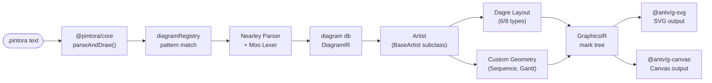
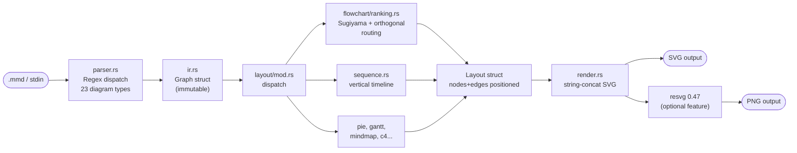
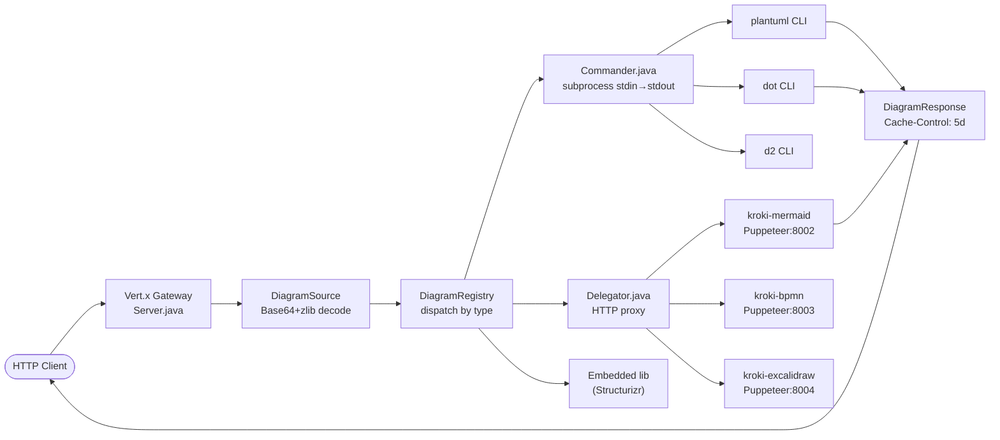
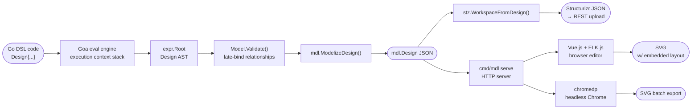

# Weekly Diagram Tooling Scan — 2026-06-27

## Executive Summary

- **mermaid-rs-renderer** (`1jehuang/mermaid-rs-renderer`) chứng minh rằng loại bỏ browser runtime hoàn toàn bằng Rust native rendering đạt speedup 500–2000×, sử dụng resvg — cùng engine với `kymostudio-core`. Pipeline của nó (regex parse → Sugiyama rank → orthogonal route → string-concat SVG) có thể là blueprint cho kymo nếu cần render Mermaid syntax natively.
- **pintora** (`hikerpig/pintora`) là ví dụ sạch nhất về extensible diagram plugin architecture: một `IDiagram` interface chuẩn với `pattern + parse + artist` tách bạch hoàn toàn, Nearley PEG parser cho từng diagram type, và AntV graphics cho multi-backend rendering. Đáng study nhất về DSL extension design.
- **kroki** (`yuzutech/kroki`) là gateway federation pattern — Java Vert.x dispatch 30+ diagram backends qua CLI subprocess và HTTP delegation — cho thấy cách expose một public API đa format mà không bị lock-in vào một renderer duy nhất. Relevant nếu kymo muốn publish `POST /render` API với multi-format support.
- **goadesign/model** dùng Go code chính là DSL (qua Goa eval engine), output Structurizr JSON và SVG qua ELK.js — thiết kế thú vị nhưng ít applicable trực tiếp cho kymo vốn đã có text-based DSL.

## Table of Contents

1. [hikerpig/pintora](#1-hikerpigpintora)
2. [1jehuang/mermaid-rs-renderer](#2-1jehuangmermaid-rs-renderer)
3. [yuzutech/kroki](#3-yuzutechkroki)
4. [goadesign/model](#4-goadesignmodel)

---

## 1. hikerpig/pintora

**GitHub:** https://github.com/hikerpig/pintora · **Last push:** 2026-06-24

### §1 — Quick Context

Thư viện text-to-diagram TypeScript extensible cho browser và Node.js, tách biệt parser/artist/renderer bằng interface chuẩn — không phải Mermaid fork mà là kiến trúc mới hoàn toàn hỗ trợ plugin third-party.

- **Tech stack:** TypeScript 6.0, pnpm monorepo, Nearley + Moo lexer, Dagre layout, AntV g-svg/g-canvas renderer
- **Output formats:** SVG, Canvas, PNG (via Node.js)
- **Stars:** 1,285 · **Contributors:** ~15 · **CI:** GitHub Actions + CodeCov
- **Distribution:** npm (`@pintora/standalone`, `@pintora/core`, `@pintora/diagrams`)

### §2 — Architecture Deep-Dive

**A. Component inventory**

| Module | Path | Vai trò |
|--------|------|---------|
| `core` | `packages/pintora-core/src/index.ts` | Registry, config, event bus, `parseAndDraw()` orchestrator |
| `diagrams` | `packages/pintora-diagrams/src/index.ts` | 8 diagram types (ER, Sequence, Class, Activity, Mindmap, Gantt, Dot, Component) |
| `renderer` | `packages/pintora-renderer/src/index.ts` | AntV g-svg/g-canvas rendering adapter |
| `standalone` | `packages/pintora-standalone/src/index.ts` | Bundle hoàn chỉnh cho browser |

Mỗi diagram type trong `pintora-diagrams` có cấu trúc đồng nhất: `{diagram}/parser.ts`, `{diagram}/db.ts` (IR store), `{diagram}/artist.ts`.

**B. Pipeline**

1. User gọi `parseAndDraw(text, opts)` từ `@pintora/core`
2. `diagramRegistry` dùng `pattern: RegExp` của từng diagram để detect loại
3. `diagram.parse(text, db)` → Nearley grammar phân tích, kết quả apply vào `db` (IR store)
4. `diagram.artist.draw(diagramIR)` → Dagre layout (với ER, Class, Activity, Component, Mindmap) hoặc custom geometry (Sequence, Gantt)
5. Artist trả về `GraphicsIR` — mark tree (group, rect, path, text)
6. `renderer.render(graphicsIR, opts)` → AntV g-svg/g-canvas render thành SVG/Canvas DOM

**C. Data model / IR**

Mỗi diagram có một `db.ts` định nghĩa IR riêng. Ví dụ `SequenceDiagramIR`:
```
actors: Map<name, Actor>     // linked list qua prevActorId/nextActorId
messages: Message[]          // {from, to, label, lineType, sequenceNbr}
notes: Note[]                // {text, actor, placement}
```

`ErDiagramIR` có `entities: Record<name, Entity>` với attributes, `relationships[]`, `inheritances[]`. Tất cả extend `BaseDiagramIR` từ `@pintora/core` với `{diagramType, title, configParams}`.

IR là **mutable trong parse phase** (accumulated vào `db`), **immutable sau khi pass vào artist**.

**D. Input language / Parser**

Parser approach: **Nearley PEG + Moo lexer**. Mỗi diagram có file grammar riêng (`.ne` compiled). Pattern:
```typescript
export const parse = genParserWithRules(grammar, {
  dedupeAmbigousResults: true,
  postProcess(results) { return db.apply(results) }
})
```
Không có formal EBNF doc ngoài grammar files. Error reporting từ Nearley — line/column có nhưng messages chưa polish.

**E. Layout algorithm**

**Dagre** cho 6/8 diagram types (hierarchical layout, cấu hình `rankDir: TB/LR`). Sequence và Gantt dùng custom geometry (sequential vertical positioning cho Sequence, D3 time scale cho Gantt). Không có orthogonal edge routing — edges là straight lines hoặc curves đơn giản. Không có crossing minimization ngoài những gì Dagre cung cấp.

**F. Rendering**

Hai backends: `@antv/g-svg` (SVG DOM) và `@antv/g-canvas` (Canvas 2D). Multi-backend qua adapter pattern — artist không biết renderer nào đang được dùng. Không có animation support built-in, nhưng `onRender` callback cho phép custom post-processing.

**G. Extensibility**

Plugin interface `IDiagram<IR, Conf>` yêu cầu: `pattern`, `parse()`, `artist`, `clear()`, `configKey`. Đăng ký qua `diagramRegistry.registerDiagram(name, impl)`. Symbol registry và theme registry cũng extensible. Đây là thiết kế sạch nhất trong tuần.

**H. Dev experience**

Browser playground tại `pintorajs.vercel.app`. Không có VS Code extension. Không có watch mode chính thức. TypeScript strict mode.

### §3 — Architecture Diagram



### §4 — Verdict

**Đáng học cho kymostudio:**
- `IDiagram` interface là pattern rõ ràng nhất cho kymo nếu muốn cho phép third-party diagram plugins — `pattern + parse + artist` tách biệt hoàn toàn.
- `genParserWithRules` wrapper pattern: bọc Nearley để dedup ambiguous results và apply vào db post-parse — kymo có thể áp dụng cho DSL extension syntax.
- `diagramRegistry` với auto-detection bằng RegExp đơn giản hơn kymo's current approach — worth comparing.

**Red flags:** Dagre không còn được maintain tích cực, và Pintora không có orthogonal edge routing. Với complex diagrams, edges chồng lên nhau.

**Open questions:** Nearley vs PEG.js vs hand-written — Pintora chọn Nearley vì dễ write grammar, nhưng performance với large diagrams chưa benchmark.

**Verdict: study deeper** — plugin architecture pattern apply được ngay.

---

## 2. 1jehuang/mermaid-rs-renderer

**GitHub:** https://github.com/1jehuang/mermaid-rs-renderer · **Last push:** 2026-06-21

### §1 — Quick Context

Rust native Mermaid renderer không cần browser — đạt 500–2000× nhanh hơn mermaid-cli bằng cách implement Sugiyama layout và SVG generation hoàn toàn trong Rust, dùng resvg/usvg cho PNG output.

- **Tech stack:** Rust, regex-based parser, fontdb + ttf-parser, resvg 0.47
- **Output formats:** SVG, PNG (qua resvg feature flag)
- **Stars:** 1,422 · **Contributors:** ~3 · **CI:** benchmarks với criterion.rs
- **Distribution:** Cargo crate, binary `mmdr`

### §2 — Architecture Deep-Dive

**A. Component inventory**

| Module | Path | Vai trò |
|--------|------|---------|
| Parser | `src/parser.rs` | Regex-based Mermaid syntax parser, 23 diagram types |
| IR | `src/ir.rs` | `Graph`, `Node`, `Edge` structs + diagram-specific fields |
| Layout | `src/layout/mod.rs` + subdirs | Per-diagram-type layout engines |
| Flowchart layout | `src/layout/flowchart/` | Sugiyama ranking + orthogonal routing |
| Renderer | `src/render.rs` | String-concat SVG generation |
| Text metrics | `src/text_metrics.rs` | fontdb + ttf-parser cho accurate width |
| CLI | `src/cli.rs` | `mmdr` binary với batch/stdin processing |
| Public API | `src/lib.rs` | `render()`, `parse_mermaid()`, `compute_layout()`, `render_svg()` |

**B. Pipeline**

1. User chạy `mmdr -i diagram.mmd -o out.svg` hoặc gọi `render(input: &str)`
2. `parser.rs`: Detect diagram type qua regex trên first line, dispatch `parse_flowchart()` / `parse_sequence()` / … (23 variants)
3. Kết quả: `ParseOutput { graph: Graph, init_config: Option<serde_json::Value> }`
4. `compute_layout(graph, theme, config)` → `Layout { nodes: HashMap<NodeLayout>, edges: Vec<EdgeLayout>, width, height }`
5. `render_svg(layout, theme, config)` → String SVG
6. Optional: resvg convert SVG → PNG bytes

**C. Data model / IR**

```rust
Graph {
    kind: DiagramKind,          // enum 23 variants
    direction: Option<Direction>,
    nodes: HashMap<String, Node>,
    edges: Vec<Edge>,
    subgraphs: Vec<Subgraph>,
    // diagram-specific: pie_slices, gantt_tasks, c4_shapes...
}

Layout {
    nodes: HashMap<String, NodeLayout>,    // {x, y, width, height, shape, style}
    edges: Vec<EdgeLayout>,                // {from, to, points: Vec<(f32, f32)>, label_anchor}
}
```

IR là **immutable** sau parse — layout nhận `&Graph` và trả về `Layout` mới hoàn toàn. Staged pipeline rõ ràng, mỗi stage có thể bench độc lập.

**D. Input language / Parser**

**Hand-written regex-based parser** — không dùng pest/nom. Mỗi diagram type có set of `Lazy<Regex>` static patterns. Trade-off: đơn giản maintain, phù hợp cho Mermaid syntax deterministic; không có formal grammar doc. Error reporting qua `ParseError` với message có context.

**E. Layout algorithm**

Flowchart dùng **Sugiyama hierarchical layout** (tự implement, không delegate sang dagre-js):
1. Longest-path ranking để assign ranks (layers)
2. Cycle breaking cho feedback edges
3. Port assignment (N/S/E/W connection points per node)
4. **Orthogonal edge routing** với occupancy grid
5. Multi-edge offset cho parallel edges
6. Iterative label placement với collision detection
7. Aspect ratio rebalancing (up to 6 passes) để hit target width:height

Các diagram types khác có custom algorithms: Sequence (sequential vertical), Pie (polar), Gantt (D3-like time scale), Mindmap (radial tree), Sankey (flow-width proportional).

**F. Rendering**

**Pure string concatenation** — không dùng SVG DOM library. Markers (`<marker id="arrow-{idx}">`) được generate per-diagram. Font metrics từ fontdb + ttf-parser cho accurate text sizing. `--fastText` flag dùng calibrated ASCII widths để bỏ qua fontdb → thêm 3-10× speedup nữa. PNG qua resvg (optional Cargo feature).

**G. Extensibility**

Thêm diagram type: implement `parse_{type}()` trong `parser.rs`, add `DiagramKind` variant, add layout module. Không có plugin system — hardcoded. Themes qua `config.json` / `%%{init:{themeVariables:{}}}%%` frontmatter.

**H. Dev experience**

CLI usability tốt: `--timing` JSON breakdown, `--dumpLayout`, `--size`, `--fastText`. Không có IDE extension. Batch mode cho Markdown extraction. `bench_compare.py` script để compare vs mermaid-cli.

### §3 — Architecture Diagram



### §4 — Verdict

**Đáng học cho kymostudio:**
- Sugiyama ranking implementation trong `src/layout/flowchart/ranking.rs` — kymo hiện dùng alignment resolver qua multiple passes, Sugiyama cho phép cleaner hierarchical layout khi diagram có DAG structure rõ ràng.
- Orthogonal routing với occupancy grid (`routing.rs`) — kymo dùng straight edges hiện tại; orthogonal routing cho đẹp hơn đáng kể với complex edge graphs.
- `--fastText` / accurate font metrics toggle — kymo cũng cần server-side text width estimation; pattern này (fast mode vs full fontdb mode) là production-tested.
- API design: `parse_mermaid()` → `compute_layout()` → `render_svg()` tách đôi rõ ràng — kymo có thể expose tương tự nếu muốn kymo-mcp support streaming partial results.

**Red flags:** Không có plugin system — hardcoded 23 types. Parser không có formal grammar, regex approach sẽ khó maintain khi syntax phức tạp hơn.

**Verdict: study deeper** — layout algorithm và font metric approach apply được trực tiếp vào `packages/rust/`.

---

## 3. yuzutech/kroki

**GitHub:** https://github.com/yuzutech/kroki · **Last push:** 2026-06-26

### §1 — Quick Context

Unified diagram-as-text API gateway — một HTTP endpoint dispatch sang 30+ diagram backends (PlantUML, Mermaid, GraphViz, D2, BPMN, Excalidraw...) bằng cách federation CLI subprocess và Puppeteer companion services.

- **Tech stack:** Java 11+ / Vert.x 5.1.2 gateway + Node.js 24 Puppeteer companions, Maven, Docker Buildx
- **Output formats:** SVG, PNG, PDF, JPEG (tùy backend)
- **Stars:** 4,205 · **Contributors:** ~50+ · **CI:** Maven + Docker multi-platform builds
- **Distribution:** Docker images `yuzutech/kroki`, `yuzutech/kroki-mermaid`, `yuzutech/kroki-bpmn`

### §2 — Architecture Deep-Dive

**A. Component inventory**

| Module | Path | Vai trò |
|--------|------|---------|
| Gateway server | `server/src/main/java/io/kroki/server/Server.java` | Vert.x router, CORS, route registration |
| Diagram registry | `server/.../service/DiagramRegistry.java` | Maps diagram type → `DiagramService` impl |
| Diagram handler | `server/.../service/DiagramHandler.java` | Request parsing, format validation |
| Commander | `server/.../action/Commander.java` | Subprocess stdin/stdout manager cho CLI tools |
| Delegator | `server/.../action/Delegator.java` | HTTP proxy sang companion services |
| Source decoder | `server/.../decode/DiagramSource.java` | Base64 + zlib decompress URL-encoded diagrams |
| Mermaid service | `mermaid/src/worker.js` | Puppeteer headless Chrome rendering |
| Browser pool | `lib/browser-instance/browser-instance.js` | Shared Chromium instance qua WebSocket |

**B. Pipeline**

1. Client gửi `GET /plantuml/svg/{base64-zlib-encoded}` hoặc `POST /` JSON
2. `Server.java` route → `DiagramHandler`
3. `DiagramSource.decode()`: Base64 + zlib decompress → plain text source
4. `diagramRegistry.getService(type).convert(source, format, opts)` → `Future<Buffer>`
   - **CLI path** (PlantUML, GraphViz, D2, Svgbob...): `Commander.execute(stdin → stdout)` với timeout 5s
   - **HTTP delegation** (Mermaid, BPMN, Excalidraw): `Delegator.delegate()` → `POST 127.0.0.1:8002/mermaid/svg`
   - **Embedded** (Structurizr): Direct Java library call
5. `DiagramResponse.end(buffer, mimeType)` với cache headers `Cache-Control: public, max-age=432000`

**C. Data model / IR**

Không có shared IR — mỗi backend là black box nhận text, trả binary. Gateway chỉ handle HTTP envelope, encoding/decoding, và error propagation. Đây là trade-off chủ ý: không normalize output, không có cross-format conversion.

Companion Mermaid service: `worker.js` inject Mermaid source vào Puppeteer browser page, `page.evaluate()` gọi `window.mermaid.render()`, capture SVG string. PNG bằng `page.screenshot()` của SVG container.

**D. Input language**

Hai URL schemes: (1) Standard: `Base64-URL(zlib(source))`, (2) PlantUML-compat: PlantUML custom compression. Backward compatible — PlantUML share links work natively. `POST /` JSON `{diagram_source, diagram_type, output_format}` cho programmatic use.

**E. Layout algorithm**

Không implement layout — delegate hoàn toàn sang từng backend (GraphViz dot algorithm, PlantUML Smetana, Mermaid Dagre, D2 ELK). Gateway là pure dispatcher.

**F. Rendering**

Per-backend: PlantUML (Java native), Mermaid (Puppeteer + Chrome), GraphViz (CLI), D2 (CLI). Output pass-through. Caching HTTP-only (stateless, no server-side memoization) — deterministic output cho same source+format nên CDN-friendly.

**G. Extensibility**

Implement `DiagramService` interface (3 methods: `getSupportedFormats()`, `convert()`, `getVersion()`), đăng ký trong `Server.java`. Routes auto-generated. Companion services chỉ cần expose HTTP server trên assigned port.

**H. Dev experience**

URL-based diagrams: paste vào browser URL = render ngay. Tích hợp với AsciiDoc, Markdown, Confluence. Docker Compose để run locally. Không có IDE extension.

### §3 — Architecture Diagram



### §4 — Verdict

**Đáng học cho kymostudio:**
- **URL encoding scheme** (`Base64-URL(zlib(source))`) — kymo có thể áp dụng pattern này cho shareable diagram URLs trên kymo.studio, compatible với cách PlantUML/Kroki share.
- **DiagramService interface pattern** — nếu kymo muốn expose `/render` public API hỗ trợ multi-format (`.kymo`, `.bpmn`, `.mermaid`), đây là pattern để build service registry.
- **Stateless caching strategy**: HTTP `ETag = version + MD5(source)` invalidates khi release mới — kymo có thể áp dụng cho API responses thay vì Redis cache.
- **Commander dual-thread pattern** (stdout/stderr parallel read): avoid pipe deadlock khi CLI tools write large output — kymo's `to_webp.py` subprocess calls có thể benefit từ pattern này.

**Red flags:** Puppeteer cho Mermaid/BPMN = 512 MB RAM mỗi companion container, cold start 2-5s. Không scale well nếu kymo muốn low-latency rendering API.

**Verdict: glance only** — architecture pattern hữu ích nhưng không có algorithm nào để study sâu. Áp dụng URL encoding scheme là action item cụ thể nhất.

---

## 4. goadesign/model

**GitHub:** https://github.com/goadesign/model · **Last push:** 2026-06-22

### §1 — Quick Context

Go library dùng Go code chính là DSL (không phải text file) để model C4 architecture diagrams — output ra Structurizr JSON hoặc SVG qua browser-based ELK.js editor, tích hợp với Goa microservices framework.

- **Tech stack:** Go 1.26+, Goa eval engine, ELK.js (browser layout), Vue.js editor, chromedp cho SVG export
- **Output formats:** Structurizr JSON, SVG (qua editor hoặc headless Chrome)
- **Stars:** 462 · **Contributors:** ~10 · **CI:** GitHub Actions Go tests
- **Distribution:** `go get goa.design/model`

### §2 — Architecture Deep-Dive

**A. Component inventory**

| Module | Path | Vai trò |
|--------|------|---------|
| DSL keywords | `dsl/design.go`, `dsl/views.go` | User-facing Go functions (`Design()`, `SoftwareSystem()`, `AutoLayout()`) |
| Expression AST | `expr/design.go`, `expr/model.go` | Internal representation, `WalkSets()` evaluation order |
| Registry | `expr/registry.go` | Element ID → object lookup, late-binding relationships |
| Modelization | `mdl/eval.go`, `mdl/model.go` | AST → JSON-serializable `mdl.Design` struct |
| Structurizr bridge | `stz/eval.go`, `stz/workspace.go`, `stz/layout.go` | Transform sang Structurizr JSON + REST client |
| CLI & editor | `cmd/mdl/serve.go`, `cmd/mdl/webapp/` | HTTP server, Vue.js + ELK.js editor, SVG export |

**B. Pipeline**

1. User viết Go package import `"goa.design/model/dsl"`, gọi `Design(func() { SoftwareSystem(...); Views(...) })`
2. Goa eval engine execute closures via `eval.Execute(dsl, parentExpr)` với **execution context stack**
3. `expr.Root` (global `Design`) được populate với all elements
4. `expr.Model.Validate()` → resolve relationship destinations bằng path-based lookup
5. `mdl.ModelizeDesign()` → `mdl.Design` struct → JSON
6. Output path A: `stz.WorkspaceFromDesign()` → Structurizr JSON → upload via REST client
7. Output path B: JSON serve qua HTTP → Vue.js editor → ELK.js layout → User chỉnh/save → SVG với embedded layout JSON

**C. Data model / IR**

```go
Design {
    Model → {People, Systems → {Containers → {Components}}, DeploymentNodes}
    Views → {ContextView, ContainerView, ComponentView, DynamicView, DeploymentView, FilteredView}
}

Element {ID, Name, Description, Tags, Properties, Relationships}
ElementView {ElementID, X, Y}  // positions stored per view
AutoLayout {Implementation, RankDirection, RankSep, NodeSep}
```

Two-phase evaluation: Phase 1 register elements, Phase 2 (`WalkSets`) resolve relationships sau khi tất cả elements đã known. Cho phép **late binding** — reference element trước khi declare, như nhiều diagram DSLs cần.

**D. Input language / DSL Design**

**Go-as-DSL** thông qua Goa eval engine — không phải text parser. Closures lồng nhau tạo syntactic nesting:
```go
Design("name", func() {
    System := SoftwareSystem("Web App", func() {
        Container("API", func() { Uses(DB, "reads") })
    })
    Person("User", func() { Uses(System, "uses") })
    Views(func() { SystemContextView(System, "ctx", func() { AutoLayout(RankLeftRight) }) })
})
```
Advantages: Type-safe, Go IDE autocomplete, refactoring support, import reuse. Disadvantage: Không accessible cho non-Go users, DSL "syntax" bị Go parser rules giới hạn.

**E. Layout algorithm**

**ELK.js** (browser-side) cho interactive editor, **Dagre hoặc Graphviz** (server-side) khi dùng `AutoLayout()`. Không có custom layout implementation. Positions persist trong SVG `<script>` block dưới dạng JSON cho session tiếp theo.

**F. Rendering**

SVG render qua Vue.js + ELK.js trong browser, hoặc chromedp headless Chrome cho batch export. Không có native SVG renderer. Layout positions extracted từ SVG sau khi browser render.

**G. Extensibility**

Mở rộng bằng Go code trực tiếp — không có plugin system chính thức. Filtering expressions (include/exclude by tag) cho `FilteredView`. Structurizr client extensible qua REST API.

**H. Dev experience**

`cmd/mdl serve` → browser editor với watch mode (fsnotify). `cmd/stz` cho Structurizr upload. Không có VS Code extension riêng (dùng Go extension đương nhiên).

### §3 — Architecture Diagram



### §4 — Verdict

**Đáng học cho kymostudio:**
- **Two-phase evaluation pattern** (`WalkSets`): register elements first, resolve references second — kymo's `alignment.py` đã làm tương tự qua multiple passes; Go model formalizes pattern này rõ ràng hơn với typed expression walker.
- **Late binding bằng path-based lookup**: `expr/registry.go` map element ID → object cho phép forward references trong DSL — kymo DSL hiện không support forward ref, đây là feature gap đáng cân nhắc.
- **Layout persistence** trong SVG `<script>` block: lưu positions embedded trong file output để reuse — hữu ích nếu kymo muốn "remember layout" giữa các render sessions.

**Red flags:** Dependency vào browser (ELK.js) cho layout và chromedp cho export là heavy — cùng vấn đề như kroki/Puppeteer. Go-as-DSL approach không accessible cho kymo users vốn dùng `.kymo` text files.

**Open questions:** Tại sao không dùng ELK.js server-side (Node.js) thay vì require browser? Structurizr lock-in có phải concern không?

**Verdict: glance only** — two-phase evaluation và path-based late binding là ideas đáng note, nhưng overall approach quá khác kymo's text-file DSL model để apply rộng.

---

*Scan này cover 7 ngày 2026-06-20 → 2026-06-27. Next scan: 2026-07-04.*
