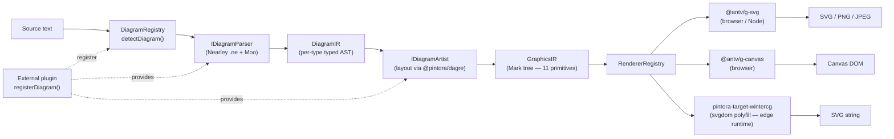
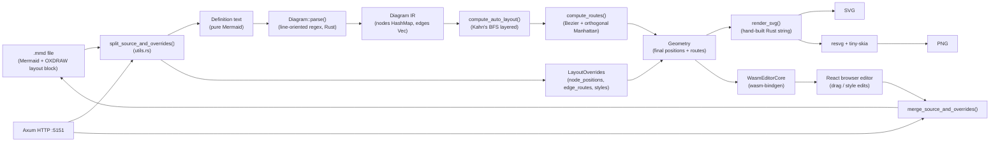
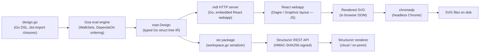
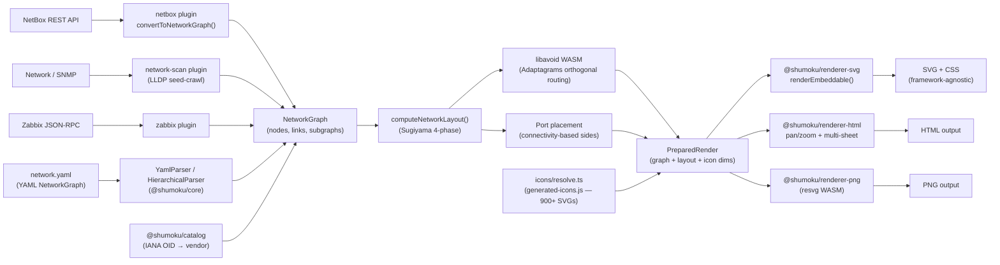

# Weekly Diagram Tooling Scan — 2026-06-28

## Executive Summary

- **Oxdraw** giải quyết tension code-first vs drag-first editing bằng single-file bidirectional sync: `.mmd` file chứa đồng thời Mermaid text và JSON layout override trong `%% comment block` — kéo node trong browser tự update file, không cần export/import.
- **Pintora** là kiến trúc plugin sạch nhất trong tuần: mỗi diagram type là `{ parser, artist, config }` object tự đăng ký, Earley grammar riêng (Nearley+Moo), hai-stage IR (DiagramIR → GraphicsIR mark tree) — kymo hiện thiếu tất cả ba pattern này.
- **Shumoku** ship `libavoid WASM` cho orthogonal obstacle-avoiding edge routing trong TypeScript package — applicable trực tiếp vào kymo BPMN swimlane edge routing, không cần viết router từ đầu.

## Table of Contents

1. [hikerpig/pintora — Extensible TypeScript text-to-diagrams](#1-hikerpigpintora)
2. [RohanAdwankar/oxdraw — Rust diagram-as-code với bidirectional sync](#2-rohanadwankarowdraw)
3. [goadesign/model — C4 architecture DSL bằng Go](#3-goadesignmodel)
4. [konoe-akitoshi/shumoku — Network topology từ YAML với 900+ icons](#4-konoe-akitoshishumoku)

---

## 1. hikerpig/pintora

### §1 — Quick Context

**Pitch**: Library TypeScript text-to-diagrams extensible theo plugin — diagram type nào cũng là module độc lập tự đăng ký, không phải core fork.

- **Stack**: TypeScript 6.0, Nearley+Moo (Earley parser), `@antv/g-svg`+`@antv/g-canvas` (rendering), `@pintora/dagre` (layout), pnpm monorepo + Turborepo + Rolldown
- **Output**: SVG, Canvas (browser), PNG, JPEG (Node); WinterCG/edge runtime target via `svgdom` polyfill
- **Health**: ~1,285 ⭐ | ~12 contributors | Last release: v0.8.2 (2026-02-13) | CI: GitHub Actions + Jest + Playwright visual harness | Coverage: Codecov
- **Distribution**: npm (`pintora-standalone`, `pintora-cli`, `@pintora/diagrams`, ...)

### §2 — Architecture Deep-Dive

**A. Component inventory**

- `pintora-core` (`packages/pintora-core/src/`) — Registry hub: `DiagramRegistry`, `ThemeRegistry`, `SymbolRegistry`, `ConfigEngine`; định nghĩa interfaces `IDiagram<D,Config>`, `GraphicsIR`, `MarkTypeMap` (11 primitive mark types); event system via `@antv/event-emitter`
- `pintora-diagrams` (`packages/pintora-diagrams/src/`) — 8 diagram implementations (sequence, ER, component, activity, mindmap, Gantt, DOT, class); mỗi cái export một `IDiagram` object với `{ pattern, parser, artist, config }`; parser dùng Nearley `.ne` grammar files + Moo lexer; layout qua `@pintora/dagre`
- `pintora-renderer` (`packages/pintora-renderer/src/`) — `RendererRegistry` + `makeRenderer(type)` factory; hai built-in backends: `@antv/g-svg` và `@antv/g-canvas`
- `pintora-standalone` (`packages/pintora-standalone/`) — Public bundle: core + diagrams + renderer; `PintoraStandalone` API với `renderTo()`, `initBrowser()`, `ConfigStack` cho isolation
- `pintora-cli` (`packages/pintora-cli/`) — Node.js CLI; `renderToSvg()`, `renderToImage()` (PNG/JPEG)
- `pintora-target-wintercg` (`packages/pintora-target-wintercg/`) — Edge runtime target: `svgdom` + `fontkit` polyfills cho CF Workers/Deno/Bun
- `development-kit` (`packages/development-kit/`) — Tooling để viết custom diagram extension; peer-dep `@hikerpig/nearley`
- `pintora-harness` (`packages/pintora-harness/`) — Internal visual regression harness: Playwright browser capture + jsdom; binary `pintora-harness`

**B. Pipeline (happy path)**

1. User chạy `pintora render diagram.txt` hoặc gọi `pintora.renderTo(el, { source })`
2. `DiagramRegistry.detectDiagram(text)` — pattern-match keyword đầu file → lấy đúng `IDiagram` object
3. `IDiagramParser.parse(text)` — Nearley+Moo Earley parser → **DiagramIR** (domain-specific typed AST per diagram type)
4. `IDiagramArtist.drawDiagram(ir, options)` — layout bằng `@pintora/dagre` (hoặc custom cho sequence/Gantt), sinh **GraphicsIR** (Mark tree)
5. `IRenderer.render(graphicsIR, container)` — `@antv/g-svg` hoặc `@antv/g-canvas` render primitives vào DOM/Node
6. Output: file SVG/PNG/JPEG (CLI) hoặc DOM mutation (browser)

**C. Data model / IR**

Two-stage IR:

- **DiagramIR** (per-type): typed IR riêng cho mỗi diagram — `SequenceDiagramIR { messages, notes, actors, actorOrder, participantBoxes, title }`, `ErDiagramIR`, `ActivityDiagramIR`, etc. Tất cả extend `BaseDiagramIR`. Immutable sau khi parse.
- **GraphicsIR** (`Figure` + `Mark` tree): 11 primitive mark types (`group`, `rect`, `circle`, `ellipse`, `line`, `polyline`, `polygon`, `path`, `text`, `marker`, `symbol`). `MarkAttrs` carry đủ: stroke/fill/opacity, font, shadow, matrix transform, transform policy (stretch/fixed/scale). Renderer không cần context ngoài `GraphicsIR`.

Không có "compile to lower IR" như D2's TALA. Artist chuyển thẳng DiagramIR → GraphicsIR.

**D. Input language design**

**Earley parsing qua Nearley** (không phải PEG, không phải ANTLR, không phải recursive descent). Pintora dùng fork riêng `@hikerpig/nearley` v2.21.0-beta.1 và `@hikerpig/moo` v0.5.2-beta.2 — patched cho TypeScript và multi-state lexer.

Mỗi diagram type có `.ne` grammar file riêng (e.g. `sequenceDiagram.ne`, `activityDiagram.ne`, `classDiagram.ne`). Grammar compile thành `parser.ts` artifact qua `build:grammar` step. Lexer states dùng rộng rãi để handle context-sensitive tokenization (multi-line notes, config blocks). Detection diagram type: `DiagramRegistry.detectDiagram(text)` pattern-match keyword đầu file — mỗi `IDiagram` declare một `pattern` regexp.

Error reporting: không có evidence về user-friendly messages — likely raw Nearley parse errors.

**E. Layout algorithm**

- **Dagre** (`@pintora/dagre`) là universal engine cho hầu hết diagram types (ER, component, class, activity, mindmap, DOT). `DagreWrapper` utility class với callback pattern: `callNodeOnLayout(data)`, `callEdgeOnLayout(data)`.
- **Sequence diagram** dùng custom vertical sweep: `verticalPos` tracking, `calculateActorMargins()` dựa trên text dimensions + message widths, final scale/translate qua 3×3 matrix.
- **Gantt** dùng **D3 time-scale** (`d3-scale` `scaleTime()`) cho X-axis; Y-axis là arithmetic `order × sectionUnitHeight`. Curved edges qua `d3-shape`/`d3-interpolate`.
- Edge routing: Dagre built-in (spline/polyline) — không có orthogonal obstacle-avoidance.

**F. Rendering / output strategy**

AntV G scene graph layer (`@antv/g-svg`, `@antv/g-canvas`) abstract hóa primitives. `rendererRegistry.register(type, RendererClass)` cho phép add custom backend. `pintora-target-wintercg` dùng `svgdom` DOM polyfill để chạy SVG backend không có browser. Không có animation mechanism.

**G. Extensibility**

Plugin API sạch: `pintora.registerDiagram(name, { parser, artist, configKey })`. Duplicate check, event recognizer auto-register. `SymbolRegistry.register(name, def)` cho custom shapes (prototype hoặc factory function). Theme extension qua `ThemeRegistry` (deep-merge via `deepmerge`). `development-kit` package ship tooling; `.ai/skills/add-new-diagram/SKILL.md` document hóa quy trình thêm diagram type.

**H. Dev experience**

- CLI: `pintora-cli` render file
- VSCode extension: `pintora-vscode` (separate repo)
- Web Components: `pintora-stencil`; Obsidian plugin
- Live editor: `demo/` package; docs site: `website/`
- Visual regression: `pintora-harness` (Playwright)

### §3 — Architecture Diagram



### §4 — Verdict

**Điểm đáng học cho kymostudio:**

- **Two-stage IR (DiagramIR → GraphicsIR)** là pattern kymo chưa có — `model.py` dataclasses tương đương DiagramIR, nhưng `to_svg.py` đọc trực tiếp từ `Diagram` mà không qua GraphicsIR layer. Thêm explicit GraphicsIR sẽ cho phép swap renderer (`to_excalidraw.py`, future Canvas backend) không đụng parser/layout.
- **`IDiagram` registration pattern** — kymo hard-code `.kymo` và `.bpmn` paths trong `cli.py`; pintora's registry sẽ cho phép third-party diagram types không fork core.
- **Earley vs line-based**: kymo's line-oriented `dsl.py` đơn giản và error-friendly; pintora's Earley mạnh hơn cho grammar phức tạp nhưng error messages tệ hơn. Tradeoff rõ ràng — kymo đang chọn đúng cho current grammar complexity.

**Red flags**: Không có evidence về quality error messages (Nearley raw errors). Dagre cho tất cả → sequence phải tự viết layout riêng. Activity gần đây (last feature Feb 2026), nhưng số commits/tuần rất thấp — maintainer workload ở 1 người.

**Open questions**: `@pintora/dagre` fork có gì khác dagre gốc không? AntV G scene graph có overhead gì so với direct SVG string?

**Verdict**: **study deeper** — `IDiagram` plugin registration pattern và GraphicsIR mark tree design đáng đọc kỹ. Nearley `.ne` grammar files cho sequence/activity đáng xem nếu kymo expand grammar sau này.

---

## 2. RohanAdwankar/oxdraw

### §1 — Quick Context

**Pitch**: Diagram-as-code Rust với bidirectional sync — drag node trong browser tự update `.mmd` file trên disk, code edit tự update visual — một file, hai cách edit.

- **Stack**: Rust 2024 edition, Axum 0.7 (HTTP server), `wasm-bindgen` (WASM target), React/Next.js (frontend), `resvg` 0.43 + `tiny-skia` 0.11 (PNG), `regex` crate (parser), `reqwest` (AI API)
- **Output**: SVG (primary, hand-built), PNG via resvg
- **Health**: ~2,321 ⭐ | ~5 contributors | Last release: v0.2.1 | CI: không rõ evidence
- **Distribution**: `cargo install oxdraw`

### §2 — Architecture Deep-Dive

**A. Component inventory**

- `src/diagram/` — `Diagram` IR struct, Mermaid-compatible parser (regex crate), `compute_auto_layout()`, `compute_routes()`, `render_svg()`
- `src/editor_core/` — Bidirectional sync state machine: `LayoutOverrides`, drag operations; `WasmEditorCore` exposed via `wasm-bindgen`
- `src/serve/` — Axum HTTP server trên `127.0.0.1:5151`; 14 REST endpoints: `GET/PUT /api/diagram/*`, `GET/PUT /api/diagram/source`, `DELETE /api/diagram/nodes/:id`, `/api/codemap/*`
- `src/utils/` — `split_source_and_overrides()`, `merge_source_and_overrides()`, `escape_xml()`
- `src/codemap/` — AI-powered codebase diagram generation (`reqwest` → AI API)
- `src/main.rs` / `src/cli.rs` — CLI: modes render, serve (`--edit`), codemap (`--code-map`)
- `frontend/` — React/Next.js app (compiled static, embedded vào Axum `ServeDir`)

**B. Pipeline (happy path — interactive editing)**

1. User chạy `oxdraw --edit diagram.mmd` → Axum server start `127.0.0.1:5151`, browser mở
2. `split_source_and_overrides(file_contents)` tách definition text và `LayoutOverrides` JSON từ `%% OXDRAW LAYOUT START/END` block
3. `Diagram::parse(definition)` — line-oriented regex parser → `Diagram` IR (nodes `HashMap`, edges `Vec`)
4. `compute_auto_layout()` → `compute_routes()` → `Geometry` struct (final computed positions + routes)
5. User kéo node trong browser → `WasmEditorCore.endNodeDrag()` → `LayoutOverrides.node_positions` updated in memory
6. `merge_source_and_overrides(definition, overrides)` — serialize overrides as pretty-printed JSON trong `%% OXDRAW LAYOUT START` comment block → `PUT /api/diagram/source` → write `.mmd` file
7. File vẫn là valid Mermaid (comment block là legal `%%`-prefixed Mermaid comment) và chứa full visual state

**C. Data model / IR**

```rust
struct Diagram {
    kind: DiagramKind,            // Flowchart | Gantt
    direction: Direction,          // TD | BT | LR | RL
    nodes: HashMap<String, Node>, // node_id → Node
    order: Vec<String>,            // insertion-order IDs
    edges: Vec<Edge>,
    subgraphs: Vec<Subgraph>,
    node_membership: HashMap<String, Vec<String>>,
}

struct LayoutOverrides {
    node_positions: HashMap<String, Point>,
    edge_routes: HashMap<String, Vec<Point>>,
    node_styles: HashMap<String, NodeStyleOverride>,
    edge_styles: HashMap<String, EdgeStyleOverride>,
}

// Post-layout computed state consumed by renderer:
struct Geometry { /* node bounds + edge routes after auto-layout + overrides applied */ }
```

Immutable-then-override pattern: `Diagram` compute layout, `LayoutOverrides` đè lên trên, `Geometry` là final state cho `render_svg()`.

**D. Input language design**

Oxdraw dùng **Mermaid flowchart syntax** — không có DSL riêng. Parser là hand-written **line-oriented + `regex` crate**: detect `graph <direction>` / `gantt`, parse node shapes qua bracket patterns (`[rect]`, `(stadium)`, `((circle))`, `{diamond}`, etc.), edges qua `-->` / `-.-` / `==>` / `~~~`. Subgraph: stack-based `subgraph_stack`. `%% OXDRAW IMAGE <node_id>` comment convention cho base64 images. Layout block stripped bởi `split_source_and_overrides()` trước khi reach `Diagram::parse()`.

Gantt: `original_source` preserved verbatim — chưa có parser/round-trip Gantt support.

**E. Layout algorithm**

Custom Rust implementation của **Sugiyama-style layered layout**:
1. Compute in-degree cho mỗi node
2. Kahn's BFS algorithm — assign `level = max(parent_level + 1, current)`
3. Group nodes by level vào layers; horizontal placement với `NODE_SPACING = 160px`
4. `separate_top_level_subgraphs()` — iteratively shift bounding boxes tránh overlap (`SUBGRAPH_SEPARATION = 140px`)

Edge routing (`compute_routes()`) — multi-strategy pipeline:
- Bidirectional pairs → Bezier offset stubs (`EDGE_BIDIRECTIONAL_OFFSET = 28px`)
- Conflict detection → single offset curve (`EDGE_SINGLE_OFFSET = 32px`)
- Collision avoidance: up to `EDGE_COLLISION_MAX_ITER = 6` iterations; orthogonal Manhattan fallback (`build_orthogonal_route()`)
- Label-rect intersection tests để score candidate routes

Manual `LayoutOverrides.node_positions` completely replace computed positions.

**F. Rendering / output strategy**

- SVG: hand-built string trong `Diagram::render_svg()` — pure Rust, không dùng XML library. `<defs>` arrowhead markers, `<rect>`/shape nodes, `<path>` edges, `<text>` labels với `escape_xml()`.
- PNG: `resvg` v0.43 + `tiny-skia` v0.11 — SVG string → `tiny-skia` pixmap → PNG encode; scale 10x cho high-DPI.
- **Dual compilation**: `crate-type = ["cdylib", "rlib"]` — cùng engine build native binary VÀ WASM (`wasm32` target). `WasmEditorCore` expose full drag/style/source API cho JS qua `wasm-bindgen`.
- Không có animation.

**G. Extensibility**

Không có plugin system. Single DSL (Mermaid subset). Custom shapes không có API. `--code-map` là isolated AI feature.

**H. Dev experience**

- `cargo install oxdraw` → single binary
- `--edit <file>`: auto-open browser editor
- `--code-map <path>`: AI codebase diagram generation
- REST API tại `:5151` cho custom integrations

### §3 — Architecture Diagram



### §4 — Verdict

**Điểm đáng học cho kymostudio:**

- **Bidirectional sync pattern** (`%% LAYOUT_BLOCK` comment embedding trong file) là elegant solution cho "code-first + visual touch-up" — kymo hiện không có interactive editing mode. Pattern này VCS-friendly (git diff readable), không cần separate state file.
- **Hand-built SVG string** trong Rust (không dùng XML library): kymo Python `to_svg.py` dùng cùng approach — validation rằng pattern này ổn cho production.
- **`resvg` + `tiny-skia`** stack hoàn toàn giống `kymostudio-core` — Rust architecture của oxdraw xác nhận đây là standard pipeline.
- **Dual `cdylib`/`rlib` compilation**: kymo Rust core chỉ là `cdylib` WASM hiện tại; oxdraw pattern (native binary + WASM cùng codebase) là approach đáng follow nếu kymo muốn ship native CLI tool.

**Red flags**: Mermaid syntax chỉ (subset) → không thể evolve language riêng. Gantt parser là `original_source` workaround. Không có CI evidence. 5 contributors, v0.2.1 → còn early.

**Open questions**: Override JSON trong comment block có conflict gì khi Mermaid tools khác parse file không? `EDGE_COLLISION_MAX_ITER = 6` có đủ cho dense graphs không?

**Verdict**: **glance only** — `%% LAYOUT_BLOCK` bidirectional sync idea rất hay, đáng borrow concept; nhưng implementation quá narrow (Mermaid subset, no plugin, young). Không cần đọc code sâu hơn.

---

## 3. goadesign/model

### §1 — Quick Context

**Pitch**: Model C4 architecture bằng Go thuần — code Go là DSL, type-safe, IDE completion, git-diffable, không cần ngôn ngữ riêng hay file format.

- **Stack**: Go 1.26, `goa.design/goa/v3` (DSL eval engine), Dagre/Graphviz (browser-side layout), `chromedp` (headless Chrome SVG export), React/TypeScript (webapp), `fsnotify` (file watch)
- **Output**: SVG (via headless Chrome), Structurizr workspace JSON (REST upload)
- **Health**: ~462 ⭐ | ~12 contributors | Last release: v1.15+ | CI: GitHub Actions (Go 1.26 + npm webapp build)
- **Distribution**: Go module `goa.design/model`

### §2 — Architecture Deep-Dive

**A. Component inventory**

- `dsl/` (`dsl/doc.go` + Goa eval engine) — DSL functions: `Design()`, `SoftwareSystem()`, `Container()`, `Component()`, `Person()`, `Uses()`, `Delivers()`, `AutoLayout()`, `SystemContextView()`, `DeploymentView()`, etc. Không có parser — Go compiler là parser.
- `expr/` (`expr/model.go`, `element.go`, `views.go`, `design.go`, etc.) — IR: typed Go struct tree. `Element` base struct; `Design` root; `Model` với People/Systems/Containers/Components/DeploymentNodes; `Views` với tất cả view types.
- `cmd/mdl/` — Binary `mdl`; embeds React webapp (static assets); Go HTTP server; `chromedp` cho SVG export; `fsnotify`+`lrserver` cho live-reload
- `cmd/mdl/webapp/` — React/TypeScript frontend; Dagre (default) hoặc Graphviz layout client-side; CI builds webapp trước khi embed
- `cmd/stz/` — Binary `stz`; Structurizr REST API integration (HMAC-SHA256-signed)
- `stz/` (`stz/client.go`, `workspace.go`) — `Workspace` struct mirroring Structurizr JSON schema: Documentation, Decision/ADR, WorkspaceConfiguration, Image embeds, User access-control

**B. Pipeline (happy path — SVG export)**

1. User tạo `design/design.go`: `import . "goa.design/model/dsl"` và `var _ = Design("Name", func() { ... })`
2. `init()` time: `Design(...)` registers DSL closure với Goa eval engine
3. `mdl gen ./design` — Goa eval engine chạy `WalkSets()`, execute closures theo thứ tự: Model → People → Systems → Containers → Components → Deployment environments → Views
4. Kết quả: populated `expr.Design` Go struct (typed IR)
5. `mdl gen` start HTTP server; React webapp load; render diagrams với Dagre layout in browser
6. `mdl svg` → `chromedp` launch headless Chrome, navigate `?auto=1&save=1` URL → trigger auto-layout + SVG export
7. SVG files written to disk

**C. Data model / IR**

Go struct tree trong package `expr`:

```
Design
├── Name, Description, Version
├── Model *Model
│   ├── Enterprise string
│   ├── People []*Person            → embeds *Element
│   ├── Systems []*SoftwareSystem   → embeds *Element, has Containers
│   │   └── Containers []*Container → embeds *Element, has Components
│   │       └── Components []*Component
│   └── DeploymentNodes []*DeploymentNode (hierarchical)
└── Views *Views
    ├── LandscapeView, ContextView[], ContainerView[], ComponentView[]
    ├── DynamicView[], DeploymentView[], FilteredView[]
    └── Styles: ElementStyle[], RelationshipStyle[]
```

`Element` base: `ID`, `Name`, `Description`, `Technology`, `Tags` (comma-separated, auto-applied tại `Finalize()`), `URL`, `Properties map[string]string`, `Relationships []*Relationship`, `DSL func()` (deferred execution). Tags là primary classification: `["Element", "Person"]`, `["Element", "Container"]`, etc.

`stz.Workspace` là separate serialization layer map `expr` types → Structurizr JSON schema.

**D. Input language design**

**Dot-import + nested closure DSL** — hoàn toàn là Go code, không có custom parser:

```go
import . "goa.design/model/dsl"

var _ = Design("MySystem", func() {
    SoftwareSystem("Backend", "Core API", func() {
        Container("API Server", "REST API", "Go")
    })
    SystemContextView("Backend", func() {
        AutoLayout(RankDirectionLeftRight)
        RankSeparation(300)
        NodeSeparation(600)
    })
})
```

Goa eval engine (từ `goa.design/goa/v3`) execute closures trong đúng thứ tự via `WalkSets()` và `DependsOn()` declarations — không phải user code tự chạy.

→ Go compiler là parser. Full IDE support (gopls, GoLand, VSCode), refactoring, type checking, `go vet`. Error reporting = Go compile errors.

**E. Layout algorithm**

- **Dagre** (default): JavaScript, chạy trong React webapp browser
- **Graphviz** (alternate): cũng client-side
- Config via DSL: `AutoLayout(RankDirectionKind)`, `RankSeparation(300)`, `NodeSeparation(600)`, `EdgeSeparation(200)`
- Manual positioning: `Coord(x, y int)`, `Vertices(args ...int)` cho relationship waypoints
- Layout runs in browser (JS) → không portable sang server-side; export phụ thuộc `chromedp`

**F. Rendering / output strategy**

- SVG: rendered bởi browser (Dagre/Graphviz in JS), captured via `chromedp` headless Chrome — heavy dependency
- Structurizr JSON: `stz/workspace.go` serialize `expr.Design` → Structurizr workspace JSON, upload via HMAC-SHA256-signed REST API
- Interactive editor: React app serve bởi `mdl` binary với embedded static assets
- Không có PNG, PDF, Mermaid, PlantUML output trực tiếp

**G. Extensibility**

Go module → any Go code có thể import và extend. Goa plugin API cho phép integrate `model` với Goa API design (architecture diagrams share same Go module với API definitions). Không có user-facing plugin system ngoài Go module imports.

**H. Dev experience**

- `mdl gen ./design` — generate + serve interactive editor
- `mdl svg ./design` — export SVG files
- `fsnotify` file watching + `lrserver` live-reload
- Full Go IDE support; compile-time validation

### §3 — Architecture Diagram



### §4 — Verdict

**Điểm đáng học cho kymostudio:**

- **Go-as-DSL (dot-import + closure + eval engine)** là pattern elegant để "host language IS the DSL" với type safety và IDE support đầy đủ. Kymo's `.py` input path (`DIAGRAM` object trong Python module) theo spirit tương tự nhưng ít structured — `goadesign/model` cho thấy cách enforce execution ordering qua eval engine thay vì trust user code tự chạy đúng thứ tự.
- **`stz/workspace.go` serialization layer** — map internal IR → external format mà không leak model details; `to_figma.py` kymo hiện mix transform logic với serialization. Clean separation đáng học.
- **Tags là primary classification** (comma-separated string trên `Element`, auto-applied tại `Finalize()`) thay vì type hierarchies — flexible và queryable. Kymo's `shape` field là specific-value enum; tags cho phép cross-cutting concerns (e.g., `["Element", "Container", "External"]`).

**Red flags**: `chromedp` headless Chrome dependency để export SVG là fragile và heavy — 1 process crash là lose export. Layout client-side (JS) không portable. Ít stars cho tool đã 5 năm. `stz` upload cần Structurizr account.

**Open questions**: Có cách nào run Dagre server-side trong Go (via goja/otto) để bỏ `chromedp` dependency không?

**Verdict**: **glance only** — Go DSL pattern với eval engine instructive nhưng tool quá niche (Go-only, C4-only, Chromedp). Study `expr/` package structure và `WalkSets()` ordering; skip everything else.

---

## 4. konoe-akitoshi/shumoku

### §1 — Quick Context

**Pitch**: Sinh network topology diagram từ YAML hoặc live data (NetBox/Zabbix/SNMP scan) với 900+ vendor icons, Sugiyama layout, và orthogonal routing qua libavoid WASM.

- **Stack**: TypeScript 5.9, Bun 1.3.4 + Turborepo monorepo, Sugiyama custom implementation, libavoid WASM (Adaptagrams — orthogonal routing), `resvg` WASM (PNG), Svelte 5 (editor UI), Vitest + Biome (test/lint)
- **Output**: SVG, HTML (interactive pan/zoom, multi-sheet), PNG
- **Health**: ~141 ⭐ | ~3 contributors | 72 open issues | CI: Vitest + Biome + Lefthook (pre-commit)
- **Distribution**: npm (`@shumoku/cli`, `shumoku` facade)

### §2 — Architecture Deep-Dive

**A. Component inventory**

- `@shumoku/core` (`libs/@shumoku/core/src/`) — All pure logic:
  - `parser/`: `YamlParser` (single-file), `HierarchicalParser` (multi-file với `FileResolver` protocol — `createMemoryFileResolver()` / `createNodeFileResolver()`)
  - `layout/`: `createEngine()`, `computeNetworkLayout()`, port placement, Bezier edges, octilinear channel routing, constraint registry (`LayoutInvariantReport`), collision detection, `layoutNetwork()` với `fixed`/`hints` options
  - `models/types.ts`: `NetworkGraph`, `Node`, `Link`, `Subgraph`, `DeviceType` (15 enum values), `GraphSettings`
  - `icons/resolve.ts` + `generated-icons.js`: 900+ bundled SVG icons; `ResolvedIcon` discriminated union (`{ kind: 'inline'; svg }` | `{ kind: 'url'; url }`)
  - `observation/`: Discovery policy, entity identity, SNMP/LLDP interface naming
- `@shumoku/renderer-svg` — `prepareRender()` → `renderSvg()` → `renderEmbeddable()` (framework-agnostic: `{ svg, css, containerId, viewBox }`)
- `@shumoku/renderer-html` — `renderGraphToHtml()`, `renderGraphToHtmlHierarchical()` (multi-sheet navigation)
- `@shumoku/renderer-png` — resvg WASM, Node.js only
- `@shumoku/renderer` — Svelte 5 reactive renderer cho Editor/Server apps; `rerouteEdges` derived store
- `@shumoku/catalog` — Device/vendor catalog; IANA enterprise OID → vendor mapping; PoE class specs; port templates
- `@shumoku/plugin-sdk` — HTTP client + pagination base class; capability mixins: `topology`, `hosts`, `metrics`, `alerts`
- `libs/plugins/`: `netbox`, `zabbix`, `prometheus`, `grafana`, `aruba-instant-on`, `network-scan` (LLDP/SNMP seed-crawl)

**B. Pipeline (happy path)**

1. User chạy `@shumoku/cli render network.yaml -f svg`
2. `YamlParser.parse(content)` → `ParseResult<NetworkGraph>` với `ParseWarning[]`
3. `computeNetworkLayout(graph, settings)`:
   a. Sugiyama 4 phases: cycle removal → layer assignment → crossing reduction (barycenter) → coordinate assignment
   b. Cross-container link promotion: edges giữa subgraphs khác nhau được lift lên LCA
   c. Port placement: sides (top/bottom/left/right) assigned based on connectivity
   d. Edge routing: libavoid WASM (orthogonal obstacle-avoiding) hoặc Bezier splines theo `settings.edgeRouting`
4. `prepareRender(graph, options)` — resolve icon URLs, fetch dimensions (async)
5. `renderSvg(prepared, options)` — emit SVG markup với dynamic CSS (theme variables, hover effects, tooltips)
6. SVG string written to output file

**C. Data model / IR**

```typescript
interface NetworkGraph {
    name: string
    settings: GraphSettings  // direction TB/BT/LR/RL, theme, edgeRouting, nodeSpacing, rankSpacing
    subgraphs?: Subgraph[]   // hierarchical; membership: { nameRegex?, subnet? }
    nodes: Node[]
    links: Link[]
}

interface Node {
    id: string; label: string
    type: DeviceType         // 15 values: router, l2-switch, firewall, server, ...
    vendor?: string; model?: string
    parent?: string          // subgraph id
    status?: 'active' | 'planned' | 'failed'
    icon?: string            // inline SVG fragment hoặc URL override
    ports?: Port[]
}

interface Link {
    from: { node: string; port?: string }
    to: { node: string; port?: string }
    bandwidth?: string       // e.g. "10G" (visualized as line width)
    medium?: 'fiber-sm' | 'fiber-mm' | 'twisted-pair' | 'dac' | 'aoc'
    vlan?: number[]
    bends?: Point[]          // manual waypoint coords
}
```

Plain TypeScript interfaces, immutable — new objects created khi layout apply.

**D. Input language design**

YAML (không phải text DSL). `YamlParser` validate schema → `ParseWarning[]`. `HierarchicalParser` dùng `FileResolver` protocol cho multi-file topologies: `include:` directives resolve qua `createNodeFileResolver()` (disk) hoặc `createMemoryFileResolver()` (tests/browser). Subgraph membership patterns (`nameRegex`, `subnet`) auto-assign nodes mà không cần list explicit. Không có formal grammar file; YAML schema = implicit grammar.

**E. Layout algorithm**

**Sugiyama four-phase hierarchical layout** (custom TypeScript implementation trong `@shumoku/core/src/layout/`):

1. **Cycle removal** — acyclify directed graph
2. **Layer assignment** — rank nodes vào horizontal/vertical tiers theo `settings.direction`
3. **Crossing reduction** — barycenter heuristic minimize edge crossings
4. **Coordinate assignment** — barycenter-aligned placement cho symmetric layout around parents

Thêm vào Sugiyama chuẩn:
- **Cross-container link promotion**: edges giữa subgraphs khác nhau được lift lên lowest common ancestor subgraph
- **Octilinear channel routing**: 8-direction edge bending cho dense datacenter/rack layouts
- **libavoid WASM** (Adaptagrams' libavoid compiled to WASM): orthogonal obstacle-avoiding edge routing — edges automatically route quanh nodes thay vì đi xuyên qua
- **Port placement**: port sides (top/bottom/left/right) computed from connectivity patterns
- **Constraint registry** (`LayoutInvariantReport`): checks containment và overlap violations sau layout
- **Interactive ops**: `placeNode()` (collision-free drag placement), `layoutNetwork()` với `fixed` (pin nodes) và `hints` (soft-nudge) options
- **Link width** proportional to bandwidth (wider = faster link)

**F. Rendering / output strategy**

- SVG (`@shumoku/renderer-svg`): `prepareRender()` (async icon URL fetch + dimensions) → `renderSvg()` → `renderEmbeddable()` trả về `{ svg, css, containerId, viewBox }` cho framework-agnostic embedding. Dynamic CSS: theme variables (light/dark), node/port hover effects, link highlighting, tooltip styling — generated per render, không hardcode trong SVG.
- HTML (`@shumoku/renderer-html`): SVG embedded trong pan/zoom shell; `renderGraphToHtmlHierarchical()` cho multi-sheet output với navigation
- PNG (`@shumoku/renderer-png`): resvg WASM (Node.js only), same engine như kymo `kymostudio-core`
- Không có animation.

**G. Extensibility**

Data source plugins via `@shumoku/plugin-sdk`: `DataSourcePlugin` base với capability mixins (`topology`, `hosts`, `metrics`, `alerts`). 6 built-in plugins; user có thể add custom. Icon extension: add SVG files → regenerate `generated-icons.js`. `renderEmbeddable()` cho React/Vue/Svelte embedding. Theme qua CSS variables.

**H. Dev experience**

- CLI: `npx @shumoku/cli render network.yaml -f svg|html|png`
- Svelte 5 reactive editor/server app
- NetBox integration: pull live topology → diagram trực tiếp
- SNMP seed-crawl: auto-discover topology không cần prior inventory

### §3 — Architecture Diagram



### §4 — Verdict

**Điểm đáng học cho kymostudio:**

- **libavoid WASM** (Adaptagrams' `libavodoid` compiled to WASM, bundled trong npm package) là directly applicable cho kymo BPMN edge routing — hiện kymo BPMN edges là straight lines; libavoid implement full orthogonal obstacle-avoiding router từ academic research. Package đã có TypeScript bindings, có thể evaluate cost/benefit của việc add vào `packages/js`.
- **`renderEmbeddable()` pattern** trả về `{ svg, css, containerId, viewBox }` — kymo hiện return SVG string với CSS inlined. Tách CSS ra giúp embed vào React/Vue không bị style bleed; CSS variables cho theming mà không cần re-render.
- **`HierarchicalParser` với `FileResolver` protocol** — `include:` directives cho multi-file topologies. Kymo `.kymo` hiện single-file; nếu sau này support `include:`, pattern này (memory resolver cho tests, node resolver cho disk) là clean approach.
- **Port-side assignment** (top/bottom/left/right based on connectivity): network-specific nhưng idea applicable cho kymo BPMN task shapes với multiple incoming/outgoing sequence flows — automatic port side selection thay vì fixed top-in/bottom-out.
- **Subgraph membership patterns** (`nameRegex`, `subnet`): auto-assign nodes vào subgraph bằng pattern thay vì list explicit — kymo `region` hiện cần list members; pattern-based auto-membership là UX improvement đáng consider.

**Red flags**: 72 open issues với 3 contributors = high bus factor. libavoid WASM adds ~500KB bundle. YAML input không có IDE completion hay compile-time validation. Stars thấp (141) cho size của project.

**Open questions**: libavoid WASM bundle size có acceptable không cho kymo JS package? `HierarchicalParser` FileResolver protocol có extensible đủ cho browser (fetch-based) resolver không?

**Verdict**: **study deeper** — libavoid WASM integration pattern và Sugiyama implementation chi tiết đáng đọc kỹ. `renderEmbeddable()` và port-side assignment là hai cái có thể apply vào kymo trong ngắn hạn.
