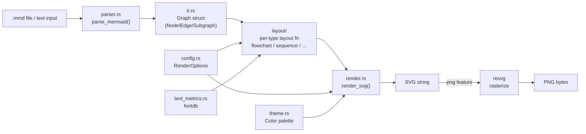
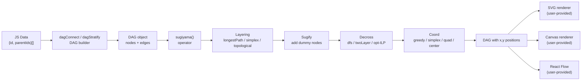
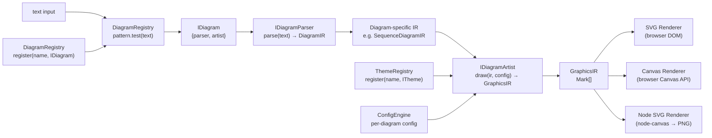
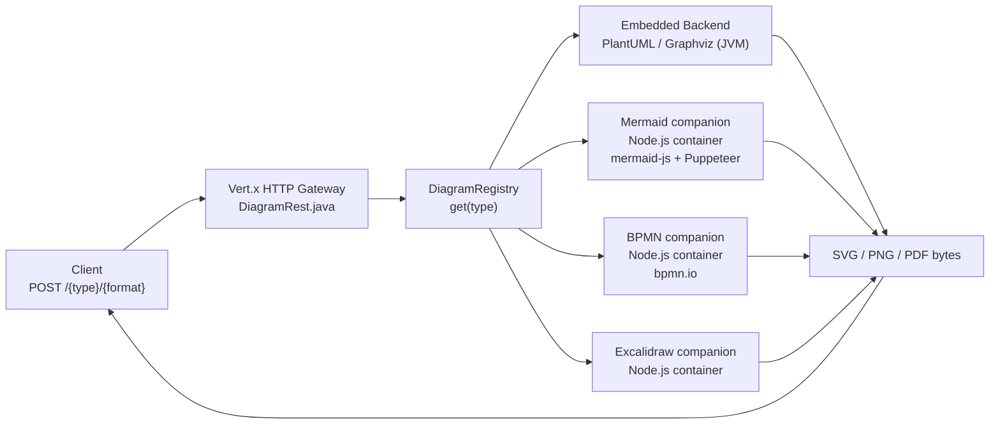

# Weekly Diagram Tooling Scan — 2026-06-29

## Executive Summary

- **Sugiyama thực chiến:** `d3-dag` cung cấp implementation đầy đủ nhất của Sugiyama algorithm trong JS ecosystem — layering → decross (kể cả ILP optimal) → coord assignment — có thể áp dụng trực tiếp vào `packages/js/src/layout.ts`.
- **Rust rendering pipeline ngắn:** `mermaid-rs-renderer` chứng minh rằng parse → IR → layout → SVG có thể làm hoàn toàn trong Rust mà không cần browser, 764–2069x nhanh hơn mermaid-cli; architecture này gần giống kymostudio-core nếu kymo quyết định mở rộng render engine sang Rust.
- **Plugin contract sạch nhất:** `pintora` có interface `IDiagram = { pattern, parser, artist }` + two-level IR (diagram IR → GraphicsIR) là design pattern đáng học cho bất kỳ ai muốn làm extensible diagram library.

## Table of Contents

1. [mermaid-rs-renderer](#1-mermaid-rs-renderer)
2. [d3-dag](#2-d3-dag)
3. [pintora](#3-pintora)
4. [kroki](#4-kroki)

---

## 1. mermaid-rs-renderer

**Repo:** `1jehuang/mermaid-rs-renderer` · ★1,427 · Rust · Updated 2026-06-28

### §1 — Quick Context

**Pitch:** Renderer Mermaid native Rust không cần Node.js hay headless browser, 764–2069× nhanh hơn mermaid-cli qua pipeline parse → IR → layout → SVG → resvg.

**Tech stack:** Rust (thuần), `regex` cho tokenization, `fontdb`/`ttf-parser` cho text metrics, `usvg`/`resvg` (optional feature) cho PNG output. Không dùng parser generator — hand-written.

**Repo health:** ★1,427, solo/small team (recent solo contributor), CI có (Cargo test + clippy), push liên tục — 2026-06-28. CHANGELOG.md đầy đủ. 23 diagram types được support.

**Distribution:** crates.io (`mmdr`) — binary và library. Feature flags `cli` và `png` tách độc lập.

---

### §2 — Architecture Deep-Dive

#### A. Component Inventory

| Module | Path | Vai trò |
|---|---|---|
| `Parser` | `src/parser.rs` | Mermaid text → `Graph` IR, riêng cho từng diagram type |
| `IR` | `src/ir.rs` | `Graph` struct (Node, Edge, Subgraph + diagram-specific data) |
| `Layout` | `src/layout/` | Một file/subdir per diagram type (flowchart/, sequence, mindmap…) |
| `Renderer` | `src/render.rs` | `Graph` + positions → SVG string |
| `EdgeGeometry` | `src/edge_geometry.rs` | Routing geometry cho edges |
| `Theme` | `src/theme.rs` | Color palette, stroke/fill defaults |
| `Config` | `src/config.rs` | `RenderOptions` builder (spacing, aspect ratio) |
| `TextMetrics` | `src/text_metrics.rs` | Font-aware text measurement |
| `Validator` | `src/validator.rs` | Pre-parse validation |
| `CLI` | `src/cli.rs` + `src/main.rs` | Entry point (feature-gated) |

#### B. Pipeline / Control Flow

1. User chạy `mmdr input.mmd` (hoặc gọi `render(input)` từ library)
2. `cli.rs` → `render_with_options(input, opts)` trong `lib.rs`
3. `parser::parse_mermaid(input)` — detect diagram type từ header line, dispatch sang `parse_flowchart()`/`parse_class_diagram()`/… → `Graph` IR
4. `layout::compute_layout(&graph, &metrics)` — gọi layout function tương ứng trong `layout/{type}.rs` → thêm position vào Graph
5. `render::render_svg(&graph)` → SVG string
6. (Optional) `resvg::render(svg)` → PNG bytes

#### C. Data Model / IR

`Graph` là một struct đơn với:
- `Vec<Node>` (id, label, shape, NodeStyle)
- `Vec<Edge>` (src, dst, label, EdgeStyle, arrowheads)
- `Vec<Subgraph>` (logical group với direction override)
- Diagram-specific fields trong `GraphData` enum: sequence participants, Gantt tasks, ER/class metadata, etc.

Design: **mutable single struct, single-pass accumulation**. Parser điền vào Graph trực tiếp, không có "compile to lower IR" bước thứ hai. Layout mutates thêm position fields vào cùng struct. Điểm yếu: Graph biết quá nhiều về từng diagram type.

#### D. Input Language Design

- **Parser approach:** Regex-assisted line-by-line + hand-written recursive descent. Không dùng parser generator (ANTLR, PEG, Nearley, pest).
- Mỗi diagram type có dedicated function `parse_flowchart(lines)`, `parse_sequence(lines)`, v.v.
- Preprocessing stripping comments và frontmatter trước khi parse.
- **Error handling:** `anyhow::Result<T>`, `bail!` macro cho early termination, `validate_init_directives()` chạy trước parse.
- Không có formal grammar spec — behavior hoàn toàn implicit trong code.

#### E. Layout Algorithm

- Không có generic Sugiyama engine — mỗi diagram type có layout riêng trong `src/layout/{type}.rs`.
- Flowchart: hierarchical rank-based layout (dagre-style).
- Sequence: linear top-down với participant lanes.
- `edge_geometry.rs` handle orthogonal và curved edge routing riêng.
- `preferredAspectRatio` trong config: geometry rebalancing để đạt target ratio như 16:9.

#### F. Rendering / Output

- SVG: Rust string building (không dùng SVG library), inject `<style>` và CSS class-based theming.
- PNG: `resvg` (cùng engine với `kymostudio-core`) qua optional feature `png`.
- Không có animation.
- `--fastText` flag: skip font-accurate text measurement → thêm 2–3× speedup.

#### G. Extensibility

- Feature flags tách CLI/PNG.
- Thêm diagram type mới: thêm branch vào match trong `parser.rs` + file mới trong `layout/`. Không có plugin interface.
- Theme: struct constants trong `theme.rs`.

#### H. Dev Experience

- CLI: `mmdr input.mmd` (SVG), `mmdr input.mmd -o out.png` (PNG)
- Library API: `render(input)` → SVG string, hoặc `render_with_options(input, RenderOptions::default().theme(Theme::Dark))`
- `render_with_detailed_timing()` trả timing breakdown per stage
- Không có VSCode extension hay LSP.

---

### §3 — Architecture Diagram



---

### §4 — Verdict

**Điểm đáng học cho kymostudio:**
- `kymostudio-core` đã dùng `resvg` — cùng engine, confirm rằng hướng đi Rust đúng.
- Pattern "một layout file per diagram type" (layout/flowchart/, layout/sequence…) giống cách kymostudio tổ chức `bpmn_shapes.py`. Đây là pragmatic decomposition.
- `render_with_detailed_timing()` → có thể dùng làm benchmark harness idea cho kymo's own CI perf tracking.
- `--fastText` flag trick: option bypass font-accurate text metrics để tăng speed trong preview mode.

**Red flags:**
- Không có formal grammar → parsing behavior implicit trong code, khó spec và test edge cases. Kymo đã biết gotcha này (dsl.py vs DSL.md).
- `Graph` struct biết quá nhiều diagram types → coupling cao, khó add type mới không sửa core struct.

**Open questions:** Orthogonal edge routing trong `edge_geometry.rs` — có dùng A* hay đơn giản hơn?

**Verdict: Glance only.** Architecture gần giống kymo đã có. Có thể học nhanh `--fastText` trick và per-stage timing API design.

---

## 2. d3-dag

**Repo:** `erikbrinkman/d3-dag` · ★1,510 · TypeScript · Updated 2026-06-24

### §1 — Quick Context

**Pitch:** Layout library cho DAG với Sugiyama algorithm đầy đủ — layering + decross (bao gồm ILP optimal) + coord assignment — được viết TypeScript-first, không deps, nhẹ hơn elkjs nhiều.

**Tech stack:** TypeScript 100%, zero runtime dependencies, browser + Node.js. Bundled là ESM + `.d.ts`. Build tool: Bun.

**Repo health:** ★1,510, 1 chính tác giả (erikbrinkman), CI có (GitHub Actions), push 2026-06-24. Changelog chi tiết. 3 layout algorithms (Sugiyama, Zherebko, Grid).

**Distribution:** npm (`d3-dag`), CDN compatible.

---

### §2 — Architecture Deep-Dive

#### A. Component Inventory

| Module | Path | Vai trò |
|---|---|---|
| `Graph` | `src/graph/` | DAG data structure (nodes, edges, traversal helpers) |
| `Sugiyama` | `src/sugiyama/index.ts` | Operator factory + pipeline orchestration |
| `Layering` | `src/sugiyama/layering/` | longestPath, simplex (LP), topological |
| `Decross` | `src/sugiyama/decross/` | dfs, twoLayer, opt (ILP exact) |
| `Coord` | `src/sugiyama/coord/` | center, greedy, quad, simplex, topological |
| `Sugify` | `src/sugiyama/sugify.ts` | Add dummy nodes for long edges (standard Sugiyama step) |
| `Zherebko` | `src/zherebko/` | Linear topological layout (alternative algo) |
| `Grid` | `src/grid/` | Grid-based topological layout |
| `Tweaks` | `src/tweaks.ts` | Post-layout adjustments |
| `Dagre shim` | `src/dagre.ts` | Dagre v3 API compatibility wrapper |

#### B. Pipeline / Control Flow

1. User tạo DAG: `const dag = dagConnect()(data)` hoặc `dagStratify()(data)`
2. Tạo layout operator: `const layout = sugiyama().layering(layeringSimplex()).decross(decrossTwoLayer()).coord(coordSimplex())`
3. Gọi `layout(dag)` → mutates node positions in-place
4. User renders: iterate `dag.nodes()` và `dag.edges()`, lấy `.x/.y` từ mỗi node

#### C. Data Model / IR

- DAG là mutable JS object, nodes/edges có generic type params `<N, L>`
- Operators (layering, decross, coord) là **immutable**: mỗi `.layering(algo)` call trả về new Sugiyama instance.
- Pattern: fluent builder nhưng immutable — safe để reuse operator mà không side effects.
- Không có "lower IR" — positions được assign trực tiếp lên DAG nodes.

#### D. Input Language Design

Không phải text DSL — nhận dữ liệu JS (array of `{parentIds, id}` objects). Không có parser. API-first design.

#### E. Layout Algorithm

**Sugiyama 3-stage pipeline:**
1. **Layering** — gán mỗi node vào một layer:
   - `longestPath`: O(V+E), fast
   - `simplex`: LP optimization, minimize dummy nodes (long edges)
   - `topological`: topo order làm layer
2. **Decross** — reorder nodes trong mỗi layer để minimize edge crossings:
   - `twoLayer`: sweep up/down, barycentric heuristic
   - `dfs`: DFS-based, fastest
   - `opt`: ILP exact solution (exponential worst case, chỉ dùng cho nhỏ)
3. **Coord** — assign x-coordinates:
   - `simplex`: LP, optimal
   - `quad`: quadratic programming
   - `greedy`: heuristic fast
   - `center`: simple centering

Default: `layeringSimplex() + decrossTwoLayer() + coordSimplex()`.

**Sugify step** (trong `sugify.ts`): insert dummy nodes cho long edges (edges spanning >1 layer) — chuẩn Sugiyama, quan trọng để coord assignment hoạt động đúng.

#### F. Rendering / Output

Không có renderer — chỉ trả positions. User tự render (D3, React Flow, Canvas, SVG…). Pure layout library.

#### G. Extensibility

- Mọi operator đều implement interface chuẩn: `Layering<N,L>`, `Decross<N,L>`, `Coord<N,L>`
- Custom algorithm: implement interface → pass vào `.layering(myAlgo)`
- Dagre v3 shim: API compat để migrate existing code

#### H. Dev Experience

- TypeScript-first: full generics, good type inference
- Docs site với interactive examples
- Quality presets: "fast" (dfs+center), "medium" (default), "slow" (opt+simplex)

---

### §3 — Architecture Diagram



---

### §4 — Verdict

**Điểm đáng học cho kymostudio:**
- **3-stage composition rõ ràng** (layering → decross → coord) là blueprint chuẩn Sugiyama. Kymo's `layout.py` + `alignment.py` hiện tại gần như làm layering + alignment nhưng không explicit có decross step. Thêm decross sẽ cải thiện chất lượng layout cho diagrams phức tạp.
- **Sugify pattern** (dummy nodes cho long edges): kymostudio hiện có `fan-in / trunk-lane edge staggering` nhưng không rõ có dummy node insertion không. Đây là trick quan trọng để coord assignment work correctly.
- **Immutable operator pattern** (`sugiyama().layering(X).decross(Y)` trả new copy): rất clean, đáng áp dụng vào `layout.ts` JS package.
- `decross/opt.ts` (ILP exact): có thể bật như `--high-quality` flag khi rendering cuối, giống kymo's future animated SVG mode.

**Red flags:**
- "Medium" preset ~49ms trên 184-node graph — với kymo-size diagrams (thường <50 nodes) thì OK, nhưng nếu support large BPMN (100+ elements) cần benchmark kỹ.
- Zero runtime deps là tốt nhưng có nghĩa LP solver là custom implementation — cần verify correctness.

**Open questions:** `coordSimplex()` có handle edge label positions không? Hay chỉ node positions?

**Verdict: Study deeper.** `packages/js/src/layout.ts` nên adopt cấu trúc 3-stage operator composition này. Đặc biệt sugify step + decross step là missing pieces so với kymo hiện tại.

---

## 3. pintora

**Repo:** `hikerpig/pintora` · ★1,285 · TypeScript + Nearley · Updated 2026-06-24

### §1 — Quick Context

**Pitch:** Library text-to-diagrams extensible với plugin contract rõ ràng — bất kỳ diagram type nào có thể được thêm vào runtime mà không sửa core; dùng Nearley grammar cho formal parsing.

**Tech stack:** TypeScript 74%, JavaScript 12%, Nearley 7% (grammar files), MDX 7% (docs). pnpm monorepo. Browser + Node.js.

**Repo health:** ★1,285, 1 chính tác giả, CI có (pnpm + tests), release cuối v0.8.2 Feb 2026. VSCode extension, Obsidian plugin ecosystem.

**Distribution:** npm (5 packages), standalone bundle, CLI.

---

### §2 — Architecture Deep-Dive

#### A. Component Inventory

| Module | Path | Vai trò |
|---|---|---|
| `Core` | `packages/pintora-core/` | DiagramRegistry, config engine, theme registry, parseAndDraw |
| `DiagramRegistry` | `pintora-core/src/diagram-registry.ts` | Registry + pattern matching, `register(name, IDiagram)` |
| `Type contracts` | `pintora-core/src/type.ts` | IDiagram, IDiagramParser, IDiagramArtist interfaces |
| `ConfigEngine` | `pintora-core/src/config-engine.ts` | Per-diagram config merge |
| `Diagrams` | `packages/pintora-diagrams/` | 8 built-in diagram implementations |
| `Renderer` | `packages/pintora-renderer/` | GraphicsIR → SVG / Canvas output |
| `CLI` | `packages/pintora-cli/` | `pintora` CLI → PNG/JPG/SVG file |
| `Standalone` | `packages/pintora-standalone/` | Bundled browser build |

#### B. Pipeline / Control Flow

1. User gọi `pintora.renderTo(code, { container: '#div' })`
2. `pintora-core/parseAndDraw(text, options)`:
   - Iterate DiagramRegistry → match `diagram.pattern.test(text)` → tìm IDiagram
3. `diagram.parser.parse(text, context)` → diagram-specific IR (e.g. `SequenceDiagramIR`)
4. `diagram.artist.draw(ir, config, options)` → `GraphicsIR` (list of `Mark` objects)
5. `pintora-renderer` nhận GraphicsIR → serialize SVG `<rect>`, `<path>`, `<text>`… hoặc Canvas draw calls
6. Output gắn vào DOM hoặc trả buffer

#### C. Data Model / IR

**Two-level IR design:**
- Level 1: Diagram-specific IR — mỗi diagram type tự định nghĩa (e.g. `{participants, messages, notes}` cho sequence)
- Level 2: `GraphicsIR` — abstract graphic commands: `{marks: Mark[]}` với Mark là union của `{type: 'rect' | 'circle' | 'path' | 'text' | 'group', ...}`

`GraphicsIR` là generic "draw calls" abstraction — hoàn toàn decoupled khỏi output format. Renderer chỉ biết GraphicsIR, không biết diagram semantics.

#### D. Input Language Design

- **Parser approach:** Nearley grammar (`.ne` files, 7% codebase) — context-free grammar, compiled sang JS parser.
- Formal grammar file → Nearley compiler → JS parser → parse tree → diagram IR.
- Rõ ràng hơn hand-written approach: grammar là spec, không chỉ là implementation.
- Pattern regex trên từng IDiagram để detect loại diagram từ text (e.g. `sequenceDiagram` header).

#### E. Layout Algorithm

- Không có centralized layout engine — mỗi diagram artist tự làm layout trong `artist.draw()`.
- Sequence diagram: linear top-down, explicit position calculation.
- ER/Component: dùng `@antv/layout` hoặc custom force-directed.
- Flexible nhưng không share code giữa các diagram types.

#### F. Rendering / Output

- `pintora-renderer` convert GraphicsIR → SVG (browser DOM hoặc `@pintora/renderer-svg-node`) hoặc Canvas API.
- `pintora-cli`: node-canvas cho PNG/JPG output.
- SVG output không có animation.
- Theme system: `themeRegistry.register(name, ITheme)`.

#### G. Extensibility

**Đây là điểm mạnh nhất của pintora.** Plugin contract:
```typescript
interface IDiagram<D = unknown, Config = unknown> {
  pattern: RegExp        // detect nếu text là loại này
  parser: IDiagramParser<D>    // { parse(text, ctx?): D }
  artist: IDiagramArtist<D>    // { draw(ir, config, opts): GraphicsIR }
  clear(): void
  configKey?: string
  eventRecognizer?: any
}
```
Register: `pintora.diagramRegistry.register(name, myDiagram)`. Runtime pluggable. Có tutorial đầy đủ.

#### H. Dev Experience

- Browser playground + live editor
- VSCode extension (syntax highlight + preview)
- Obsidian plugin, Gatsby plugin
- pnpm monorepo với turbo build

---

### §3 — Architecture Diagram



---

### §4 — Verdict

**Điểm đáng học cho kymostudio:**
- **IDiagram plugin interface** là design đáng học nhất tuần này. Kymo hiện tại có implicit "diagram type" concept thông qua file extension dispatch trong `cli.py` — nhưng không có formal interface contract. Pintora chứng minh pattern này scale tốt.
- **Two-level IR** (diagram-specific → GraphicsIR marks): `to_svg.py` kymo hiện tại tightly coupled với `model.py`. GraphicsIR abstraction cho phép thêm renderer mới (Figma, Canvas, WebGL) mà không cần sửa diagram logic. Kymo đã có `to_figma.py` riêng — pattern này hợp thức hóa cách tổ chức đó.
- **Nearley grammar** (.ne files): formal grammar spec + generated parser. Nếu kymo DSL ngày càng phức tạp, đây là upgrade path từ hand-written `dsl.py`. Nearley dùng Earley algorithm nên handle ambiguous grammars tốt hơn PEG.
- Pattern regex để detect diagram type: simple nhưng effective. Kymo `cli.py` dispatch theo extension — pattern approach sẽ enable multi-diagram-in-one-file trong tương lai.

**Red flags:**
- Release pace chậm (v0.8.2 từ Feb 2026 — 5 tháng không có release). Solo maintainer risk.
- Layout không shared giữa diagram types → duplication.

**Open questions:** GraphicsIR có express animation primitives không? Hay chỉ static marks?

**Verdict: Study deeper.** IDiagram interface + GraphicsIR two-level IR là pattern transfer ngay được vào kymo's JS package architecture. Đặc biệt relevant khi planning extensibility cho custom diagram types.

---

## 4. kroki

**Repo:** `yuzutech/kroki` · ★4,208 · JavaScript + Java (Vert.x) · Updated 2026-06-26

### §1 — Quick Context

**Pitch:** API gateway thống nhất cho 20+ diagram engines (PlantUML, Mermaid, D2, BPMN, Graphviz…) qua microservices — mỗi engine chạy trong container riêng, gateway route và normalize.

**Tech stack:** JavaScript 94% (companion containers), Java 6% (Vert.x HTTP gateway), Docker Compose, Maven.

**Repo health:** ★4,208, active org (yuzutech), CI có (Maven + npm tests), push 2026-06-26. Production-ready (nhiều doanh nghiệp dùng qua self-hosted).

**Distribution:** Docker images (kroki/kroki + companion images kroki/mermaid, kroki/bpmn, etc.).

---

### §2 — Architecture Deep-Dive

#### A. Component Inventory

| Module | Path | Vai trò |
|---|---|---|
| `Gateway` | `server/` | Java Vert.x HTTP server, routing, DiagramRegistry |
| `DiagramRegistry` | `server/src/.../DiagramRegistry.java` | Map diagram-type → backend handler |
| `DiagramRest` | `server/src/.../DiagramRest.java` | POST handler, request validation |
| `Mermaid companion` | `mermaid/` | Node.js + Puppeteer + mermaid-js, Docker container |
| `BPMN companion` | `bpmn/` | Node.js + bpmn.io, Docker container |
| `Excalidraw companion` | `excalidraw/` | Node.js, Docker container |
| `Embedded engines` | `server/` | Graphviz, PlantUML, Nomnoml chạy trực tiếp trong JVM/Node |

#### B. Pipeline / Control Flow

1. Client POST `/mermaid/svg` với diagram text body
2. Vert.x router match `/mermaid/svg` → `DiagramRest` handler
3. `DiagramRegistry.get("mermaid")` → `Mermaid` backend class
4. Backend: HTTP request tới mermaid companion container trên internal network
5. Companion Node.js process: nhận text → mermaid-js render → trả SVG bytes
6. Gateway trả SVG response về client

**URL scheme:** `POST /{diagram-type}/{output-format}` — clean API convention.

#### C. Data Model / IR

Không có shared diagram IR. Gateway chỉ biết:
- `diagram-type` string
- `input bytes` (text/base64)
- `output-format` string (svg, png, pdf, base64)

Mỗi backend tự parse và render — hoàn toàn isolated. Gateway là pure routing layer.

#### D. Input Language Design

Pass-through — gateway không parse. Mỗi engine có parser riêng. Không có shared DSL concept.

#### E. Layout Algorithm

Delegated hoàn toàn tới từng engine. Gateway không biết về layout.

#### F. Rendering / Output

- Companion containers handle rendering
- Gateway normalize HTTP response
- Hỗ trợ: SVG, PNG, PDF, base64-encoded variants
- Không có animation support

#### G. Extensibility

Backend mới: implement Java class extend `DiagramService`, register trong `Server.java`:
```java
registry.register(new MyDiagram(vertx, config), "my-type");
```
Không có Java interface requirement khắt khe — duck typing qua method names.

#### H. Dev Experience

- Docker Compose: `docker compose up` → full stack local
- REST API: `curl -X POST 'http://localhost:8000/mermaid/svg' -d 'graph TD; A-->B'`
- Không có native CLI — mọi thứ qua HTTP
- Health endpoint `/health`, metrics `/metrics` (Prometheus)

---

### §3 — Architecture Diagram



---

### §4 — Verdict

**Điểm đáng học cho kymostudio:**
- **URL scheme** `/{diagram-type}/{output-format}` là clean REST API design nếu kymostudio ever builds a server/API mode (e.g. kymo-mcp worker). Hiện tại `packages/mcp/` đã có API server — convention này worth adopting.
- **DiagramRegistry pattern** tương tự pintora's registry nhưng ở infrastructure level. Cách register backend: `registry.register(new Backend(vertx, config), "name")` — clean wiring.
- **Companion container per engine** solves engine versioning isolation tốt — mỗi Mermaid/BPMN version trong container riêng, không ảnh hưởng nhau. Relevant nếu kymo muốn support multiple render backends với different dependencies.

**Red flags:**
- Network hop per render (gateway → companion) adds latency — không phù hợp cho real-time preview.
- Java gateway + Node.js companions = 2 runtimes để maintain.
- Puppeteer trong mermaid companion = headless Chromium vẫn còn đó cho Mermaid render (contrast với mermaid-rs-renderer).

**Open questions:** Companion containers cho bpmn.io render — có cần headless browser không, hay bpmn.io có server-side rendering path?

**Verdict: Glance only.** Kroki là excellent production tool nhưng là gateway pattern, không phải diagram engine. Kymo là library, không phải service. Học URL scheme convention và registry wiring pattern là đủ.

---

*Scan thực hiện 2026-06-29. Data sources: GitHub search API (topic:diagram-as-code, pushed:>2026-06-22), mermaid/excalidraw ecosystem scan. Repos excluded: chart libs, icon packs, Excalidraw drawing apps, AI skill wrappers (archify, axton-obsidian-visual-skills).*
