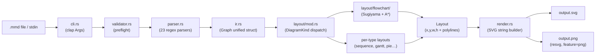
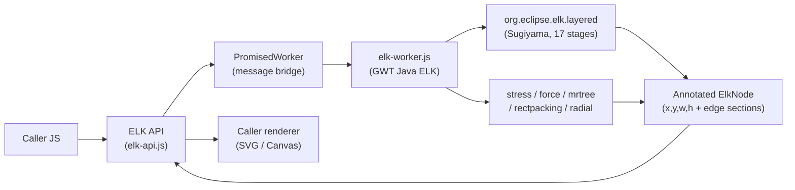
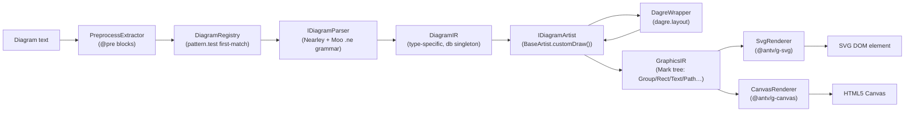
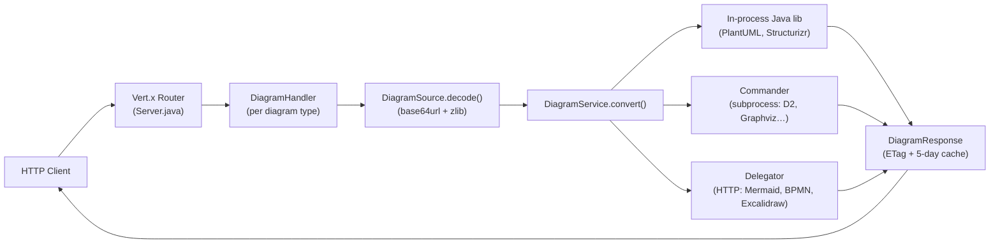

# Weekly Scan: Diagram Tooling — 2026-06-30

## Executive Summary

- **mermaid-rs-renderer** chứng minh rằng layout quality có thể được đưa vào CI như một metric (geometry gate), không chỉ snapshot SVG hash — pattern này kymo chưa có và nên adopt.
- **elkjs** phân lập hoàn toàn layout engine khỏi renderer, export pure-position JSON API; pattern này cho phép embed hoặc swap renderer mà không chạm layout code.
- **pintora** có `IDiagram` plugin interface sạch nhất trong nhóm: mỗi diagram type là plugin độc lập (`pattern + parser + artist`), ngược lại với switch-case monolith của Mermaid và `Graph` fat-struct của mermaid-rs-renderer.

## Table of Contents

1. [mermaid-rs-renderer — Rust-native Mermaid renderer](#1-mermaid-rs-renderer)
2. [elkjs — ELK layout algorithms cho JavaScript](#2-elkjs)
3. [pintora — Extensible text-to-diagrams (TypeScript)](#3-pintora)
4. [kroki — Multi-diagram gateway service](#4-kroki)

---

## 1. mermaid-rs-renderer

**Repo:** `1jehuang/mermaid-rs-renderer` · 1 430 ⭐ · Rust · pushed 2026-06-28

### §1 — Quick Context

Rust-native Mermaid renderer không cần headless browser, nhanh hơn `mermaid-cli` 500–2 000× bằng cách parse và layout hoàn toàn trong Rust thay vì spawn Chromium.

- **Stack:** Rust, crates `clap` + `resvg`/`usvg` + `fontdb`/`ttf-parser`; output SVG/PNG
- **Health:** 1 430 ⭐, CI với `cargo clippy`, `cargo test`, và Python layout-quality gate; crates.io v0.2.2
- **Distribution:** `cargo install mermaid-rs-renderer` (binary `mmdr`), Homebrew, AUR, Scoop

### §2 — Architecture Deep-Dive

**A. Component Inventory**

| Module | Path | Vai trò |
|--------|------|---------|
| `CLI` | `src/cli.rs` | Clap arg parsing, Markdown block extraction, dispatch |
| `Validator` | `src/validator.rs` | Preflight: subgraph balance, participant names, quoted strings |
| `Parser` | `src/parser.rs` | 23 per-type hand-written regex/line-scan parsers |
| `Graph IR` | `src/ir.rs` | Unified mutable struct cho tất cả diagram types |
| `Layout Orchestrator` | `src/layout/mod.rs` | Dispatch theo `DiagramKind` → per-type layout |
| `Flowchart Layout` | `src/layout/flowchart/` | Sugiyama + A* routing subsystem (10+ sub-modules) |
| `Ranking` | `src/layout/ranking.rs` | Rank assignment + barycentric crossing minimization |
| `Routing` | `src/layout/routing.rs` | A* grid router với obstacle grid |
| `Label Placement` | `src/layout/label_placement.rs` | Collision-avoiding final label pass |
| `Renderer` | `src/render.rs` | SVG string builder trực tiếp |
| `TextMeasurer` | `src/text_metrics.rs` | Font-backed glyph width measurement với disk cache |
| `Quality Gate` | `scripts/hard_gate.py` | CI: kiểm tra geometry metrics so baseline JSON |

**B. Pipeline**

1. User chạy `mmdr -i diagram.mmd -o out.svg`
2. `cli.rs` đọc input (file / stdin / Markdown fenced blocks), load config JSON
3. `validator.rs` preflight: kiểm tra subgraph balance, participant declarations, click quoting → typed `ParseError` nếu lỗi
4. `parser.rs` detect `DiagramKind` từ dòng đầu → dispatch vào 1 trong 23 per-kind regex parsers → `Graph` IR (mutable `BTreeMap<String, Node>` + `Vec<Edge>`)
5. `layout::compute_layout_with_metrics()` → Sugiyama layered (rank assignment → barycentric crossing min → median node placement → A* orthogonal routing → path cleanup → label placement) → `Layout` với `(x, y, w, h)` và `Vec<(f32, f32)>` polylines
6. `render::render_svg_with_dimensions()` → static SVG string → file / stdout hoặc `resvg::write_output_png()` cho PNG

**C. Data Model / IR**

Hai layer tách biệt rõ ràng:

- **Parse-time:** `Graph` — fat unified struct với fields cho cả 23 diagram types (`pie_slices`, `gantt_tasks`, `mindmap: MindmapData`, …). `BTreeMap<String, Node>` cho deterministic iteration, `HashMap<String, usize>` node_order để track insertion order. Mutable trong quá trình parse.
- **Layout-time:** `Layout { nodes: BTreeMap<String, NodeLayout>, edges: Vec<EdgeLayout>, ... }`. `NodeLayout` chứa absolute `f32` coordinates. `EdgeLayout.points: Vec<(f32, f32)>` là polyline đã route xong. Immutable sau khi layout; label pass mutate in-place cuối cùng.
- `DiagramKind` enum với 23 variants dispatch toàn bộ pipeline.

**D. Input Language Design**

Parser approach là **hand-written line-scan + regex** — không dùng parser generator (`pest`, `nom`, PEG). 23 parsers được viết inline trong `src/parser.rs` với `Lazy<Regex>` statics cho arrow patterns, pipe labels, quoted labels. Không có formal grammar file.

Error reporting hai lớp: `validator.rs` tạo typed `ParseError { UnknownParticipant { name, line, candidates }, UnclosedSubgraph { opened_at }, … }` với "did-you-mean" suggestions; parsers bên dưới dùng `anyhow::bail!` strings. Lỗi parse fail gracefully thành `ErrorLayout` SVG (visible error box trong output).

**E. Layout Algorithm**

Flowchart/class/state/ER/requirement: **Sugiyama layered với A\* orthogonal routing**:
1. Rank assignment (`compute_ranks_subset`)
2. Crossing minimization: alternating forward/backward barycentric sweeps + pair-crossing transpose
3. Node placement: `weighted_median_center` với 15% damping
4. Port assignment: exit side chọn theo dx/dy ratio (DIRECTION_PREF_RATIO=1.35)
5. A* grid routing: cell = 0.35 × node_spacing, obstacles = padded nodes/subgraphs, occupancy grid shared giữa edges
6. Aspect-ratio rebalancing: ≤6 passes sau layout để push viewBox về target ratio

23 per-type layouts khác: sequence (timeline vertical), gantt (date arithmetic), mindmap (tidy tree), pie (radial), gitgraph (branch lanes), sankey (cubic bezier gradients), v.v.

**F. Rendering / Output**

Direct string construction trong `render.rs`. Static SVG: không JS, không CSS animation, không external resources. Nodes → `<rect>/<circle>/<path>`, edges → `<polyline>`, arrowheads → SVG `<marker>` defs trong overlay layer. PNG qua `resvg`/`usvg` (feature flag `png`) — **cùng engine với `kymostudio-core`**. `SvgDimensions` struct cho phép inspect dimensions mà không allocate full SVG string.

**G. Extensibility**

Không có plugin system. Thêm diagram type mới = touch 5 files (`ir.rs`, `parser.rs`, `layout/mod.rs`, `layout/<type>.rs`, `render.rs`). Feature flags: `cli` và `png`. Config qua `%%{init}%%` JSON directives.

**H. Dev Experience**

CLI flags: `-i`/`-o`/`-e`, `--preferredAspectRatio`, `--nodeSpacing`/`--rankSpacing`, `--dumpLayout` (JSON layout dump), `--timing` (JSON ke stderr), `--fastText` (skip fontdb → 1 600–2 069× faster). Không có watch mode. CI có separate `layout-quality-gate` job dùng `scripts/hard_gate.py` check geometry metrics vs `tests/hard_gate_baseline.json`.

### §3 — Architecture Diagram



### §4 — Verdict

**Điểm đáng học cho kymo:**

1. **Layout quality CI gate** — `scripts/hard_gate.py` + `tests/hard_gate_baseline.json` kiểm tra geometry metrics (bend count, crossing count, edge length distribution). Kymo test byte-for-byte SVG hash nhưng không test QUALITY của layout — nếu layout regression xảy ra, tests vẫn pass (vì chỉ compare hash). Adopt pattern này để catch visual regression thực sự.
2. **`--dumpLayout` JSON** — inspect intermediate layout state không cần add print statements. Hữu ích để debug alignment bugs trong kymo's `alignment.py`.
3. **`--fastText` fast path** — calibrated ASCII fallback widths (skip fontdb) cho benchmarking. Kymo Python text measurement chưa có fast path tương tự.
4. **Two-layer error model** — `validator.rs` (typed, structured) tách khỏi `parser.rs` (anyhow). Kymo hiện raise generic `ValueError` — có thể formalize typed error hierarchy.

**Red flags:** Fat `Graph` struct (fields cho 23 types) sẽ scale kém khi thêm types mới — kymo's per-type dataclasses tốt hơn.

**Verdict: Study deeper** — cụ thể quality gate pattern và `--dumpLayout` tooling idea.

---

## 2. elkjs

**Repo:** `kieler/elkjs` · 2 637 ⭐ · JavaScript (GWT-compiled Java) · pushed 2026-06-29

### §1 — Quick Context

ELK layout engine được compile từ Java sang JavaScript qua GWT, expose promise-based API — kymo có thể dùng để bổ sung thuật toán layout phức tạp (Sugiyama, stress, rectpacking) mà không cần re-implement.

- **Stack:** JavaScript wrapper + GWT-compiled Java ELK engine, npm `elkjs` v0.12.0, EPL-2.0
- **Health:** 2 637 ⭐, Mocha + Chai CI trên Node 14+24, active, 0.11.1 release tháng 3/2026
- **Distribution:** npm, bundled browser file `elk.bundled.js`

### §2 — Architecture Deep-Dive

**A. Component Inventory**

| Module | Path | Vai trò |
|--------|------|---------|
| `ELK API` | `src/js/elk-api.js` | Promise-based public API; wraps Worker via `PromisedWorker` |
| `PromisedWorker` | (in elk-api.js) | Worker message-passing với promise id mapping |
| `ELKNode` | `src/js/main-node.js` | Node.js subclass, auto-wire Worker từ `elk-worker.min.js` |
| `elk-worker.js` | `lib/` | GWT-compiled Java ELK engine (không hand-written) |
| `elk.bundled.js` | `lib/` | Single-file browser bundle |
| `SimpleElkGraphDrawer` | `test/examples/` | Reference SVG renderer ~300 lines |
| TypeScript types | `typings/elk-api.d.ts` | `ElkNode`, `ElkExtendedEdge`, `ElkEdgeSection`, `LayoutOptions` |

**B. Pipeline**

1. `new ELK()` → ELKNode wires in-process fake Worker từ `elk-worker.min.js`
2. `elk.layout(graph, options)` posts `{ cmd: 'layout', graph, layoutOptions }` qua `PromisedWorker`
3. Worker deserializes JSON → ELK Java-style internal graph (via `org.eclipse.elk.graph.json`)
4. `LayoutMetaDataService` chọn algorithm (default: `org.eclipse.elk.layered`), chạy synchronously trong Worker — Sugiyama 17-stage pipeline
5. Laid-out graph serialized về ELK JSON với `x`, `y`, `width`, `height` filled trên mọi node/port/label; `sections[].startPoint/bendPoints/endPoint` trên mọi edge
6. `PromisedWorker.receive()` resolves promise; caller render với code riêng

**C. Data Model / IR**

ELK JSON format (TypeScript types trong `typings/elk-api.d.ts`):
- `ElkNode`: `{ id, children?, ports?, edges?, labels?, layoutOptions?, x?, y?, width?, height? }`
- `ElkExtendedEdge`: `{ id, sources: string[], targets: string[], sections?: ElkEdgeSection[] }`
- `ElkEdgeSection`: `{ id, startPoint, endPoint, bendPoints? }` — polyline waypoints
- `junctionPoints?: ElkPoint[]` trên edges cho hyperedge branch markers
- Input graph bị **mutate in-place** — layout positions được ghi thẳng vào objects đầu vào
- Layout options: `string → string` map (key có thể là full ID hoặc unique suffix)

**D. Input Language Design**

Không có text DSL — entirely **programmatic JSON API**. `layoutOptions` là string key-value pairs. Không applicable cho parser design.

**E. Layout Algorithms**

| Algorithm | ID | Mô tả |
|-----------|-----|-------|
| **layered** | `org.eclipse.elk.layered` | Sugiyama flagship: 17-slot pipeline (cycle breaking, NETWORK_SIMPLEX/COFFMAN_GRAHAM layering, crossing min, node placement, orthogonal edge routing) |
| stress | `org.eclipse.elk.stress` | Spring embedder: geometric ≈ graph-theoretic distances |
| mrtree | `org.eclipse.elk.mrtree` | Tree layout cho hierarchical graphs |
| radial | `org.eclipse.elk.radial` | Concentric rings |
| force | `org.eclipse.elk.force` | Physics simulation |
| sporeOverlap | `org.eclipse.elk.sporeOverlap` | Overlap removal |
| sporeCompaction | `org.eclipse.elk.sporeCompaction` | Whitespace reduction |
| rectpacking | `org.eclipse.elk.rectpacking` | Bin-packing cho rectangles |

Port constraints: `FIXED_ORDER`, `FIXED_SIDE`, `FIXED_RATIO`, `FIXED_POS`, `FREE`. Layer constraints: `FIRST`, `LAST`, `FIRST_SEPARATE`, `LAST_SEPARATE`.

**F. Edge Routing**

`layered` algorithm: **orthogonal by default** (`edgeRouting: ORTHOGONAL`), configurable sang `POLYLINE` hoặc `SPLINES`. Kết quả trong `ElkEdgeSection.startPoint / bendPoints / endPoint`. Junction points (cho hyperedges) được compute tự động trong `junctionPoints: ElkPoint[]`.

**G. Rendering / Output**

**elkjs không render SVG** — pure layout engine, chỉ tính positions. `SimpleElkGraphDrawer` example (~300 lines) minh họa canonical rendering pattern: `<rect>` cho nodes, `<polyline>` từ edge sections, `<text>` cho labels. Coordinate system: node positions relative to parent; edge routing relative to `container` node.

**H. Extensibility**

Không thể add custom layout algorithm từ JS — cần fork Java ELK và rebuild via GWT. `workerFactory` hook cho custom Worker transport. `algorithms[]` constructor param để chọn subset algorithms để register.

### §3 — Architecture Diagram



### §4 — Verdict

**Điểm đáng học cho kymo:**

1. **Layout-only API** — elkjs không render, chỉ return positions. Kymo có thể expose `kymo.layout(diagram) → PositionedDiagram` như một stable public API riêng, tách khỏi rendering. Useful cho VS Code extension khi cần positions để hit-test.
2. **`ElkEdgeSection` data model** — `startPoint / bendPoints / endPoint` rõ ràng hơn kymo's flat `points: Vec<(f32,f32)>`. Distinction này quan trọng khi render arrowheads (cần biết endpoint vs waypoint).
3. **`junctionPoints`** — explicit markers cho hyperedge branch points. Kymo chưa có concept này — relevant khi fan-in edges cần visual junction dots như trong BPMN.
4. **`rectpacking` algorithm** — bin-packing rectangles rất hữu ích cho `layout { }` frame placement trong kymo DSL, thay vì chỉ có hierarchical.

**Red flags:** GWT toolchain phức tạp; no incremental layout; no standalone edge routing; `disco` algorithm excluded khỏi GWT build dù README list nó là default.

**Verdict: Glance only** — ELK JSON format và junction point concept là actionable. Không nên dùng elkjs trực tiếp vì GWT overhead + EPL-2.0 license.

---

## 3. pintora

**Repo:** `hikerpig/pintora` · 1 285 ⭐ · TypeScript · pushed 2026-06-29

### §1 — Quick Context

Text-to-diagram TypeScript library với plugin architecture rõ ràng nhất trong nhóm — mỗi diagram type là `IDiagram` plugin độc lập thay vì switch-case monolith; diagram-specific grammar compiled từ Nearley `.ne` files.

- **Stack:** TypeScript, Nearley + moo parser generator, @antv/g scene graph, pnpm monorepo
- **Health:** 1 285 ⭐, Jest CI với Turbo, 8 diagram types, VSCode extension
- **Distribution:** npm `@pintora/standalone` (ESM + UMD), CLI, VSCode extension, Obsidian plugin

### §2 — Architecture Deep-Dive

**A. Component Inventory**

| Module | Path | Vai trò |
|--------|------|---------|
| `DiagramRegistry` | `pintora-core/src/diagram-registry.ts` | Plugin registration + `detectDiagram()` |
| `IDiagram<IR,Conf>` | `pintora-core/src/type.ts` | Plugin contract interface |
| `8 diagram plugins` | `pintora-diagrams/src/{sequence,er,…}/` | Mỗi type: `index.ts` + `db.ts` + `parser.ts` + `*.ne` + `artist.ts` |
| `DagreWrapper` | `pintora-diagrams/src/util/dagre-wrapper.ts` | Dagre layout abstraction |
| `BaseArtist<IR,Conf>` | `pintora-diagrams/src/util/base-artist.ts` | Abstract mark tree builder |
| `GraphicsIR` | `pintora-core/src/types/graphics.ts` | Renderer-agnostic scene graph (Mark union) |
| `SvgRenderer` | `pintora-renderer/src/renderers/SvgRenderer.ts` | @antv/g-svg backend |
| `CanvasRenderer` | `pintora-renderer/src/renderers/CanvasRenderer.ts` | @antv/g-canvas backend |
| `pintoraStandalone` | `pintora-standalone/src/index.ts` | Browser entry point, `renderTo()` |
| `@pintora/cli` | `pintora-cli/src/` | `renderToSvg()`, `renderToImage()` |

**B. Pipeline**

1. `pintoraStandalone.renderTo(code, { container })` được gọi
2. `PreprocessExtractor.parse(text)` extract `@pre/@endpre` inline config blocks
3. `diagramRegistry.detectDiagram(text)` → `diagram.pattern.test(text)` first-match, `diagram.clear()` reset DB
4. `diagram.parser.parse(text, { preContent })` — nearley grammar với moo lexer → grammar actions call `yy.addActor()`, `yy.addMessage()`, … trên `db` singleton → `db.getDiagramIR()` → diagram-specific `DiagramIR`
5. `diagram.artist.draw(ir, config)` → `customDraw()` → layout via DagreWrapper → build `Mark` tree → `styleEngine.apply()` → `GraphicsIR { mark: Group, width, height }`
6. `renderer.render(graphicsIR)` → `traverseScene()` visitor → `@antv/g` shapes → SVG DOM element
7. Insert vào container, bind `eventsHandlers`

**C. Data Model / IR**

Hai-level design:

- **DiagramIR** (diagram-specific): extend `BaseDiagramIR`. Ví dụ `SequenceDiagramIR = { messages: Message[], actors: {[key: string]: Actor}, actorOrder: string[], … }`. Được build mutable qua Nearley grammar actions trên `db` singleton, snapshot sau khi parse xong.
- **GraphicsIR** (renderer-agnostic): `{ mark: Group, width, height, bgColor? }`. `Mark` union: `Group | Rect | Circle | Ellipse | Text | Line | PolyLine | Polygon | Marker | Path | GSymbol`. Mỗi mark có `MarkAttrs` (stroke, fill, font, transform, class string). Immutable sau khi `draw()` returns; `styleEngine` mutate in-place trước khi return.
- Không có shared fat struct như `Graph` trong mermaid-rs-renderer — mỗi diagram type có riêng IR type.

**D. Input Language Design**

**Parser approach: Nearley + Moo**:
- **Moo** (`@hikerpig/moo` fork): stateful multi-state tokenizer, lexer states inline trong `.ne` files
- **Nearley**: Earley-algorithm parser generator. Grammar files (`.ne`) compiled sang `CompiledRules` JS modules tại build time
- Grammar files: `sequenceDiagram.ne`, `erDiagram.ne`, `classDiagram.ne`, `activityDiagram.ne`, …; shared fragments: `whitespace.ne`, `config.ne`, `comment.ne`
- Entry function: `genParserWithRules<T>(grammar: CompiledRules, opts)` — handles ambiguity deduplication (`dedupeAmbigousResults`), `postProcess` callback
- `@pre/@endpre` blocks: extracted trước parse bởi `PreprocessExtractor` cho inline config
- `%%` comment lines qua shared regex

Supported: Sequence, ER, Component, Activity, MindMap, Gantt, Class, DOT (8 types).

Error reporting: `onError` callback trong `RenderToOptions`. Parser errors throw exceptions từ Nearley propagate đến caller.

**E. Layout Algorithm**

| Diagram | Layout |
|---------|--------|
| ER, Component, Activity, MindMap, Class, DOT | **Dagre** via `DagreWrapper` |
| Sequence | Custom sequential: actors fixed x, messages increment `verticalPos` |
| Gantt | D3 `scaleTime()` X axis + sequential vertical stacking |

`DagreWrapper.doLayout()` gọi `dagre.layout(g)` → `callNodeOnLayout()` / `callEdgeOnLayout()` fire callbacks để position marks. Edge routing via dagre's spline options (`getGraphSplinesOption(conf.edgeType)`).

**F. Rendering / Output**

Pintora **không build SVG string trực tiếp**. Dùng `@antv/g` scene graph làm intermediary:
- `BaseArtist.customDraw()` build `GraphicsIR` mark tree (pure data, no DOM)
- `BaseRenderer.renderGCanvas()` dùng `traverseScene(mark, visitors)` recursive visitor → tạo `@antv/g` shapes
- `SvgRenderer`: `@antv/g-svg` → SVG DOM element; `CanvasRenderer`: `@antv/g-canvas` → Canvas2D
- `SvgRenderer.preProcessMarkAttrs()` HTML-escape text marks; `onShapeAdd()` apply CSS classes
- Browser: real DOM; Node.js CLI: `renderToSvg()` return string; `renderToImage()` return PNG/JPEG Buffer

WinterCG bundle (`pintora-target-wintercg`) cho Cloudflare Workers (early stage).

**G. Extensibility**

Plugin interface `IDiagram<D, Config>`:
```typescript
interface IDiagram<D, Config> {
  pattern: RegExp          // detection
  parser: IDiagramParser<D>  // text → DiagramIR
  artist: IDiagramArtist<D, Config>  // DiagramIR → GraphicsIR
  configKey?: string       // key in PintoraConfig
  clear(): void
}
```

`diagramRegistry.registerDiagram(name, diagram)` — sạch, type-safe. Thêm: `rendererRegistry`, `symbolRegistry`, `themeRegistry` đều extensible.

**H. Dev Experience**

- `initBrowser()` tự detect `.pintora` elements, đọc `data-renderer`/`data-theme`
- Config stack push/pop giữa renders (safe for nested use)
- `@pintora/core` tree-shakeable; `@pintora/standalone` ESM + UMD
- Ecosystem rộng: VSCode extension, Obsidian plugin, gatsby-remark-pintora, web components

### §3 — Architecture Diagram



### §4 — Verdict

**Điểm đáng học cho kymo:**

1. **`IDiagram` plugin interface** — `{ pattern, parser, artist, configKey, clear() }` là formalization sạch nhất được review. Kymo JS impl có `dsl.ts`/`from-bpmn.ts` nhưng không có explicit plugin contract. Formalizing theo pattern này sẽ unlock third-party diagram types.
2. **Nearley grammar files** — Formal `.ne` grammars có lợi thế: Earley algorithm detect ambiguity, grammar fragments reusable (`whitespace.ne`, `config.ne`), có thể generate documentation từ grammar. Kymo Python dùng regex line-scan (tương tự mermaid-rs-renderer) — formal grammar cho JS impl là improvement path rõ ràng.
3. **`GraphicsIR` mark tree** — render-agnostic intermediate trước khi touch SVG/Canvas. Kymo `to_svg.py` build SVG strings trực tiếp — approach của pintora cho phép swap renderer (SVG → Canvas → WebGL) mà không thay đổi artist code.
4. **`@pre` inline config** — override config trong source text trước parse. Kymo JS có `%%{init}%%`; Python chưa có tương đương.

**Red flags:** Dagre cũ, không maintained tốt, có bugs với compound nodes (Component artist phải workaround thủ công). `@antv/g` là dependency nặng (~200KB+).

**Verdict: Study deeper** — đặc biệt `IDiagram` interface design cho kymo JS plugin system và Nearley grammar structuring. Dagre → ELK swap là natural next step cho pintora.

---

## 4. kroki

**Repo:** `yuzutech/kroki` · 4 209 ⭐ · Java (Vert.x) + JavaScript · pushed 2026-06-29

### §1 — Quick Context

Gateway service tổng hợp 25+ diagram tools thành một REST API duy nhất — không re-implement tool nào mà proxy đến tool gốc (subprocess hoặc companion container), tạo thành "diagram translation layer" cho cả organization.

- **Stack:** Java Vert.x 5 (server), Node.js companion containers (Mermaid/BPMN/Excalidraw), Docker
- **Health:** 4 209 ⭐, JUnit 5 CI, 25 diagram types, MIT license, production-grade
- **Distribution:** Docker image, JAR, Kubernetes Helm chart

### §2 — Architecture Deep-Dive

**A. Component Inventory**

| Module | Path | Vai trò |
|--------|------|---------|
| `Server` | `server/…/Server.java` | Vert.x Router wiring + DiagramRegistry population |
| `DiagramRegistry` | `…/service/DiagramRegistry.java` | `Map<String, DiagramHandler>` + auto-route mounting |
| `DiagramService` | `…/service/DiagramService.java` | Interface: `convert() → Future<Buffer>` |
| `Commander` | `…/action/Commander.java` | Subprocess executor (ProcessBuilder + stdin/stdout + timeout) |
| `Delegator` | `…/action/Delegator.java` | HTTP proxy đến companion containers (WebClient async) |
| `Plantuml` | `…/service/Plantuml.java` | Java library in-process (PlantUML v1.2026.6) |
| `Structurizr` | `…/service/Structurizr.java` | Java lib: DSL parse → PlantUML export → render |
| `DiagramSource` | `…/decode/DiagramSource.java` | URL-safe Base64 + zlib inflate decoder |
| `Caching` | `…/response/Caching.java` | 5-day cache headers + MD5-based ETag |
| `SafeMode` | `…/security/SafeMode.java` | Enum: UNSAFE/SAFE/SECURE |

**B. Pipeline (POST `/mermaid/svg`)**

1. Vert.x HttpServer → `CorsHandler` (CORS `*`) → `BodyHandler` (buffer đến `KROKI_MAX_BODY_SIZE`, default 1MB)
2. `Router` dispatch `POST /mermaid/svg` → `DiagramHandler.createPost("mermaid")`
3. Validate `FileFormat.SVG` ∈ `Mermaid.getSupportedFormats()`, merge options từ query params + `Kroki-Diagram-Options-*` headers
4. `Mermaid.convert()` → `Delegator.delegate("127.0.0.1", 8002, "/mermaid/svg", source, opts)` — async HTTP POST
5. Companion container `kroki-mermaid` (Node.js) render qua Mermaid JS library → SVG
6. `DiagramResponse.end()`: `Content-Type: image/svg+xml`, `Cache-Control: public, max-age=432000`, ETag (`MD5(version + content)`), SVG bytes

GET requests: `DiagramSource.decode(encoded)` = URL-safe Base64 decode + zlib inflate từ path param.

**C. Data Model**

Không có `DiagramRequest` class — fields truyền trực tiếp:
- **GET:** `/{type}/{format}/{encoded}` — source = base64url(zlib_deflate(utf8(source)))
- **POST:** plain-text body; hoặc JSON `{ diagram_source, diagram_type, output_format, diagram_options }`
- Options: query params hoặc `Kroki-Diagram-Options-<key>` HTTP headers
- `FileFormat` enum: `PNG, SVG, JPEG, PDF, BASE64, TXT, UTXT`

**D. Ba integration patterns**

**Pattern A — In-process Java library:** PlantUML, Structurizr. Gọi Java API trực tiếp, wrap bằng `vertx.executeBlocking()`.

**Pattern B — Subprocess:** D2, Graphviz, Svgbob, Pikchr, Ditaa, TikZ, ERD, Vega, Wavedrom, … (17+ tools). `Commander.execute()` dùng `ProcessBuilder`, write source vào stdin, đọc stdout, timeout = `KROKI_COMMAND_TIMEOUT` (default 5s). Binary path qua `KROKI_<TOOL>_BIN_PATH` env var.

**Pattern C — HTTP companion container:** Mermaid (port 8002), BPMN (port 8003), Excalidraw (port 8004). `Delegator` dùng Vert.x `WebClient`, timeout 30s. Companion containers là separate Docker images (Node.js + headless browser / bpmn-js).

**E. Supported Formats**

25 diagram types, 35+ aliases. Highlights: PlantUML (v1.2026.6, in-process), Mermaid (v11.15.0, companion), BPMN/bpmn-js (v18.18.0, companion), Excalidraw (v0.18.1, companion), D2 (v0.7.1, subprocess), Graphviz (v14.1.3, subprocess), Structurizr (v6.2.1, in-process), Pikchr (subprocess), TikZ (subprocess).

**F. Rendering**

Kroki là **pure gateway** — không parse hay render diagram syntax (ngoại trừ PlantUML/Structurizr là embedded Java libs). Zero diagram-specific parsing logic ở gateway layer.

**G. Extensibility**

1. Create `Foo.java` implementing `DiagramService` (4 methods)
2. `registry.register(new Foo(vertx, config, commander), "foo")` trong `Server.java`
3. Auto-mounts `GET /foo/:format/:encoded` + `POST /foo` + `POST /foo/:format`
4. Install binary hoặc run companion container, configure env vars

Không dùng factory/SPI — registration là imperative trong `Server.java`.

**H. Dev Experience**

REST API với encoding `base64url(zlib_deflate(source))` — shareable diagram URLs. `GET /health` trả version map của tất cả services. `GET /metrics` cho Prometheus. Config hoàn toàn qua `KROKI_*` env vars. `SAFE_MODE` (UNSAFE/SAFE/SECURE) cho security. 5-day cache + ETag = CDN-friendly.

### §3 — Architecture Diagram



### §4 — Verdict

**Điểm đáng học cho kymo:**

1. **URL encoding pattern** — `base64url(zlib_deflate(source))` là shareable diagram URLs không cần server storage. Kymo editor hiện chưa có URL sharing — có thể adopt exact pattern này cho `editor.kymo.studio`. Encoding là public domain knowledge, không có IP issue.
2. **3-tier integration patterns** — in-process / subprocess / HTTP companion là mental model tốt khi kymo mở rộng multi-tool support. "Render this với external tool" → subprocess pattern với configurable binary path.
3. **`GET /health` với version map** — kroki trả `{ plantuml: "1.2026.6", mermaid: "11.15.0", ... }`. Kymo CLI chỉ print single version — exposing bundled tool versions (resvg version, etc.) là UX improvement.
4. **ETag = MD5(version + content)** — diagram content là deterministic → heavy caching là free perf. Kymo MCP API (`api.kymo.studio`) có thể học pattern này cho `/render` endpoint.

**Red flags:** Subprocess fork overhead (~20–50ms/request) acceptable cho server, không okay cho library. Companion containers = deployment complexity. Phải maintain 25+ binary versions trong Docker image.

**Verdict: Glance only** — URL encoding và health endpoint version map là hai items duy nhất actionable trực tiếp cho kymo. Architecture pattern useful làm reference nhưng không cần study deeper.
