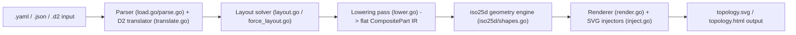
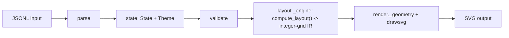
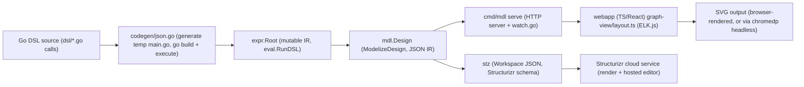
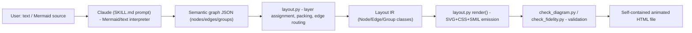

# Weekly Scan: Diagram Tooling — 2026-07-01

**Executive summary:**
- Tuần này không có "big bang" nào trong domain diagram-as-code — phần lớn hoạt động đến từ repo nhỏ/mới (0-23 sao) ở các ngách hẹp (isometric infra diagrams, git-graph-as-code, LLM-skill animation), cộng một cái tên đã thành danh (`goadesign/model`, phần của hệ sinh thái Goa) vừa ra release.
- Không repo nào tự triển khai crossing-minimization thật sự: `iso-topology` và `goadesign/model` đều **delegate** layout cho thư viện ngoài (d2/dagre, ELK.js), `gitsvg` dùng heuristic lane-greedy đơn giản, `dashmotion` dùng longest-path layering thuần Python. Tự làm layout engine "xịn" từ đầu vẫn là lợi thế khác biệt của kymostudio.
- 3 kỹ thuật đáng mang về: **layout-quality scoring** độc lập với golden-byte test (`iso-topology`'s `planeval.go`), **tách bạch layout-affecting state khỏi render-only state** để giữ golden SVG ổn định qua đổi theme (`gitsvg`'s `Theme.split()`), và **SMIL `animateMotion` + `stroke-dashoffset`** cho hiệu ứng "traveling dot" trên animated SVG (`dashmotion`'s `layout.py`).

**Mục lục:**
1. [MarkovWangRR/iso-topology](#markovwangrriso-topology)
2. [bertpl/gitsvg](#bertplgitsvg)
3. [goadesign/model](#goadesignmodel)
4. [Northwestern-caddo190/dashmotion](#northwestern-caddo190dashmotion)

---

## MarkovWangRR/iso-topology

**§1 — QUICK CONTEXT**

Sinh sơ đồ kiến trúc isometric (2.5D) "design-grade" từ text DSL, khác biệt với các tool diagram-as-code khác nhờ định vị "agent-first" (validate/evaluate có JSONPath issues, MCP server riêng). Tech stack: Go 1.25, phụ thuộc khóa cứng `oss.terrastruct.com/d2 v0.7.1` cho auto-layout, `gopkg.in/yaml.v3`; JS/CSS cho phần Studio web, Python phụ trợ tooling. Sức khỏe repo: single-author, 23 sao, 386 commit, 19 release (mới nhất v0.13.0, 2026-06-29), Apache 2.0; test coverage dày đặc (golden SVG test, fuzz, invariant test theo file `*_test.go` áp đảo số lượng). Phân phối: single static binary qua `go install` (`cmd/isotopo`, `cmd/isotopo-mcp`), không có npm/pip.

**§2 — ARCHITECTURE DEEP-DIVE**

**A. Component inventory**
- `Document/Node parser` (`parse.go`, `load.go`) — đọc YAML/JSON/D2, `LoadInput()` là entry point thống nhất.
- `D2 translator` (`translate.go`, hàm `d2ShapeCatalog`) — map shape/graph d2 sang shape iso nội bộ.
- `Layout solver` (`layout.go`, `force_layout.go`) — giải `layout`/`place` (containers + quan hệ) và bố cục cấp cao (dagre-style longest-path hoặc force-directed Fruchterman–Reingold cho đồ thị có chu trình).
- `Lowering pass` (`lower.go`) — hàm `lowerCompositeParts` hạ cây `CompositePart` (author-facing, có `group`/`stack` lồng nhau) thành slice phẳng mà renderer hiểu; đây chính là khái niệm "lower IR" của repo.
- `Flatten` (`flatten.go`) — biến `Node`+`Theme` thành `iso25d.ConvertOpts` cho shape đơn lẻ (non-composite).
- `iso25d geometry engine` (`iso25d/shapes.go`, `iso25d/shape_*.go`) — dispatcher `Convert2DTo25D`, ~18 primitive (box, cylinder, prism, rack, array, cloud, person, wedge, custom-path…).
- `Renderer` (`render.go`) — 4 entry point export (`Render`, `RenderWithCanvas`…), điều phối lowering + `iso25d.RenderComposite` + injectors.
- `SVG injectors` (`inject.go`, `svgutil.go`) — chèn canvas/background, connector, screen-label, annotation vào chuỗi SVG bằng text-surgery (không dùng DOM object model).
- `Plan-view renderer` (`planview.go`) — renderer song song cho `projection: top` (flat 2D), dùng chung layout solver.
- `Layout evaluator` (`planeval.go`) — chấm điểm chất lượng layout (crossings, tunneling, overlap) từ hình học plan-view.
- `Validator` (`validate.go`, `validate_*.go`) — sinh issue có JSONPath.
- `Capabilities reporter` (`capabilities.go`) — sinh JSON inventory DSL, dùng làm nguồn cho docs/schema tự động.
- `Edit engine` (`editops.go`, `yamledit/`) — "stateless text-surgery edits" giữ nguyên comment/format khi Studio/WASM sửa YAML.
- `CLI` (`cmd/isotopo/main.go`) — dispatch tay bằng switch trên `os.Args[1]`, không dùng framework flag.
- `MCP server` (`cmd/isotopo-mcp`) — bọc capabilities/validate/render thành 5 MCP tool.

**B. Pipeline/control flow** (`isotopo render scene.yaml out/`):
1. CLI parse flags thủ công (`--layout`, `--projection`…), đọc file/stdin.
2. `classifyInput()` xác định ngôn ngữ nguồn (YAML/JSON/D2) rồi `loadDocument()`/`LoadInput()` parse ra `*Document`/`*Node`; với `.d2` áp dụng auto-layout dagre/ELK ngay ở bước này.
3. Validator chạy full trước khi render (issue ra stderr, exit code phản ánh mức lỗi).
4. `applyLayout(n, canvas)` giải `layout`/`place` thành `Offset` cụ thể; với đồ thị có chu trình, `arrangeForce` (Fruchterman–Reingold, deterministic) thay cho xếp hạng longest-path.
5. `lowerCompositeParts` hạ cây parts (group/stack) thành slice phẳng; `iso25d.RenderComposite`/`Convert2DTo25D` sinh hình học iso; injectors chèn canvas/connector/annotation.
6. `renderFile` ghi `topology.svg` + `topology.html` + SVG/HTML/YAML riêng cho từng node vào thư mục output.

**C. Data model/IR** — Cây tác giả `CompositePart` (có `group`, `stack`) → lowering pass hạ thành **slice phẳng** cùng kiểu, tức "lower IR" là cùng struct nhưng đã mất cấu trúc lồng, chỉ còn danh sách phẳng có offset tuyệt đối. Không phải immutable rõ ràng theo pass — layout ghi `Offset` tại chỗ trước khi lower. Repo tự nhận trong `docs/design/flexible-geometry-plan.md`: hiện **chưa có khái niệm `[]Face` trung gian**, đó là roadmap M1 (thêm `Face`/`ShapeProvider`/`Surface` registry).

**D. Input language design** — Có 2 input: YAML/JSON (composite DSL, custom parser dựa `yaml.v3`, không phải PEG/combinator) và `.d2` (dùng thư viện d2 chính chủ làm parser + auto-layout). Không thấy EBNF hình thức cho YAML DSL — tài liệu hoá bằng Markdown mô tả field + JSON Schema (`docs/agent/schema/dsl.schema.json`) thay vì grammar formal. Error reporting: `validate` trả JSON có severity/JSONPath/message + gợi ý sửa, tách biệt hẳn với exit code contract (0/2/3).

**E. Layout algorithm** — Auto layout cho `.d2` chọn giữa `dagre` (default, longest-path/hierarchical, cạnh cong tự nhiên) và `elk` (orthogonal, tránh vật cản). Cho composite YAML, solver riêng xử lý `layout`/`place` (quan hệ tương đối, không toạ độ tay) cộng thêm force-directed fallback khi phát hiện chu trình (`graphIsCyclic` DFS 3 màu) để tránh cạnh xuyên node. `planeval.go` định lượng chất lượng: crossings, edges-through-nodes, backward edges, node overlaps, total bends — dùng chính hình học plan-view (world x/y thật, không méo bởi phép chiếu iso).

**F. Rendering/output strategy** — Hai backend chiếu: `iso` (2.5D isometric mặc định) và `top` (plan view phẳng, cùng solver). Không có animation. SVG sinh xong được hậu xử lý bằng text-injection (`inject.go`) chứ không qua object model — nhẹ nhưng dễ vỡ khi định dạng SVG nội bộ đổi. Không phải kiến trúc emitter pluggable rõ ràng (`Render`/`RenderWithCanvas` là 2 hàm cứng, rẽ nhánh if/else theo `Projection`), khác mô hình "nhiều emitter độc lập" của kymostudio.

**G. Extensibility** — `docs/guides/extending.md` mô tả quy trình thêm shape mới rất cụ thể: tạo `iso25d/shape_<name>.go` (Opts + `RenderIso<Name>` + `apply<Name>`) → đăng ký case trong dispatcher `iso25d/shapes.go` → khai báo mapping trong `translate.go::d2ShapeCatalog` → cập nhật `capabilities.go` (tự động lan ra docs/schema) → đồng bộ tay 3 chỗ trong Studio (`shapeOptions`, `shapeClass`, `studio.js::optGlyph`) → thêm golden test. Điểm yếu tự thừa nhận: 3 điểm đồng bộ thủ công dễ lệch (không có single source of truth cho toàn bộ surface). Theming qua `Style`/`Theme` cascade 3 tầng (`theme.Style → theme.shapes[shape] → part.Style`).

**H. Dev experience** — CLI có `capabilities` (machine-readable), `validate` với JSONPath + fix suggestion, `evaluate` chấm điểm layout — thiết kế rõ ràng cho vòng lặp agent tự sửa. `serve` mở live-preview server cổng 8731 với API `/api/move`, `/api/edit`, `/api/op` áp edit trực tiếp lên YAML (giữ format/comment). Có Claude Code skill cài đặt sẵn (`skills/draw-iso-diagram/`) và MCP server 5 tool. Không xác định: LSP/IDE integration ngoài Studio web.

**§3 — ARCHITECTURE DIAGRAM**



**§4 — VERDICT**

Đáng học sâu 3 điểm cụ thể: (1) `graphIsCyclic` + fallback sang force-directed (Fruchterman–Reingold) khi đồ thị có chu trình — kymostudio hiện chỉ có auto-layout frame tuyến tính trong `layout.py`, chưa xử lý cạnh vòng lặp gây tunneling; đáng cân nhắc thêm detector tương tự trước `alignment.py:resolve_alignments()`. (2) `planeval.go` định lượng layout quality (crossings/tunneling/overlaps) bằng hình học plan-view thật thay vì đo trên toạ độ đã chiếu — kymo có thể thêm một `evaluate` subcommand tương tự để CI tự chấm layout thay vì chỉ so golden byte. (3) Cascade theme 3 tầng (`theme.Style → theme.shapes[shape] → part.Style`) là mẫu resolution order rõ ràng, gọn hơn cách override rải rác hiện tại.

Red flag: SVG hậu xử lý bằng text-injection/string-surgery (`inject.go`, `svgutil.go`) thay vì object model — dễ vỡ, và nhóm dev tự nhận thiếu `[]Face` IR (roadmap M1 trong `flexible-geometry-plan.md`) nghĩa là kiến trúc renderer hiện tại chưa tách lớp bằng kymostudio (`model.py` dumb data → emitter). Đồng bộ shape mới cần sửa tay 3 nơi (CLI, Studio JS, dispatcher) — thiếu single source of truth, đúng vấn đề mà kymo's shared-model kiến trúc đã tránh được. Câu hỏi mở: hiệu năng force-layout ở scene lớn, độ ổn định byte-determinism khi nâng cấp d2 dependency. Verdict: **study deeper** riêng phần layout-quality scoring (`planeval.go`) và cyclic-graph force fallback; phần còn lại (SVG injection, DSL syntax) chỉ **glance**.

---

## bertpl/gitsvg

**§1 — Quick context**

CLI Python biến JSONL mô tả thao tác Git (branch/commit/merge) thành SVG cây nhánh — khác biệt: input là log thao tác tuần tự chứ không phải DSL khai báo hình học. Stack: Python ≥3.11, Click (CLI), Pydantic (schema/validate), drawsvg (SVG output), defusedxml. Repo health: 0 stars, MIT, 31 releases (mới nhất v0.3.6), CI GitHub Actions xanh, coverage 98.33%, 1186 tests, OpenSSF Scorecard. Phân phối: PyPI (`pip install gitsvg` / `uv tool install`), kèm GitHub Action (`gitsvg-action`) và MkDocs plugin (`mkdocs-gitsvg`, đang phát triển).

**§2 — Architecture deep-dive**

A. Component inventory (theo `gitsvg/`): `cli/_cli.py` — Click group, đăng ký 7 subcommand (`render`, `validate`, `state`, `layout`, `schema`, `theme`, `errors`); `parse/` — parse JSONL; `state/` — dựng structural model (`State`) từ operations; `validate/` — kiểm tra cross-reference/config conflict sau `state`; `layout/_engine.py` (34KB, module lớn nhất) — engine gán lane/row; `layout/_occupancy.py` — theo dõi (lane, row) đã chiếm; `layout/_layout_arc_kind.py`, `_layout_settings.py`, `_serialization.py`; `render/_geometry.py` — mọi tính tọa độ pixel đi qua đây (không xác định các file khác trong `render/` do lỗi khi liệt kê thư mục); `theme/` — theme presentational (4 theme dựng sẵn: muted, dark, compact, gui); `errors/` — catalog lỗi mã hoá (vd `E200`); `file_format/`; `_pipeline.py` — điều phối 5 giai đoạn.

B. Pipeline (từ `gitsvg render foo.jsonl`): (1) `parse` đọc từng dòng JSONL thành operation objects; (2) `imports` xử lý include/import giữa các file; (3) `state` dựng `State` (structural model + layout hints) và tách `Theme`; (4) validation cross-cutting chạy trên `State`+config trước khi vào layout; (5) `layout` (`compute_layout()`) sinh integer-grid IR (lane, row) qua 3 phase: tính commit-row từ parent deps → gán lane/extent → dựng dataclass; (6) `render` ánh xạ grid → pixel theo `RendererSettings` và orientation, xuất SVG qua drawsvg.

C. Data model/IR: layout engine sinh ra **integer-grid IR không có pixel/màu/font** — chỉ (lane, row) + side hint (`before`/`after`). `Theme.split()` tách thành `LayoutSettings` (ảnh hưởng `compute_layout()`) và `RendererSettings` (visual-only); không stage nào import `Theme` trực tiếp — ranh giới rõ ràng giữa "layout-affecting" và "presentation-only" state, được đặt tên là Invariant #8 trong architecture.md. Trường được phân loại axis-symmetric / axis-bound / direction-bound.

D. Input language: JSONL dòng-theo-dòng, mỗi dòng một operation (`branch`, `commit`, `merge`, `pull_request`, `highlight`, `import`, `remove`, `theme`). Không có formal grammar/JSON Schema công bố tĩnh — schema được introspect runtime qua `gitsvg schema <op>`. Validate bằng Pydantic (dependency xác nhận) dù docs mô tả nó "informal". Lỗi có format chuẩn `file:line: [code] field: message` với mã ổn định tra cứu qua `gitsvg errors <code>`.

E. Layout/lane algorithm (trọng tâm): `_assign_branch_lanes()` — greedy, duyệt branch theo thứ tự khai báo, đặt lane đầu tiên tại lane 0, các branch sau lấy "lane trống trái nhất tại row-commit-đầu-tiên", dùng `Occupancy` để track. Forward-reference (child khai báo trước parent) giải bằng đệ quy DFS on-demand. **Không có crossing-minimization tường minh** — chỉ ngầm định qua heuristic leftmost-free. Chế độ `auto_lane_change` chuyển sang event-sweep packing (`_assign_lane_segments()`): branch được rank theo `(start_row, declaration_index)`, tại mỗi boundary (start/end/release) các branch sống được nén xuống lane thấp nhất còn trống, sinh nhiều `LaneSegment`/branch + connector nối các đoạn — cơ chế "nén" tương tự mục tiêu của kymo's trunk-lane staggering nhưng chạy động theo occupancy thay vì tĩnh. `UNIQUE` row-mode: mỗi commit ép row riêng qua `max(shared_row, next_row+gap)`.

F. Rendering: một backend duy nhất (drawsvg → SVG tĩnh), không có animation mechanism, không multi-emitter — khác kymo (SVG animate + Figma/Excalidraw/WebP). Orientation (vertical/horizontal) xử lý hoàn toàn ở render stage, layout "orientation-blind".

G. Extensibility: theming qua `theme` subcommand + `Theme.split()`; 4 theme dựng sẵn, không xác định cơ chế plugin để thêm operation mới hay custom shape (không có evidence).

H. Dev experience: CLI có `--help` qua Click, `gitsvg schema`/`gitsvg errors` làm introspection thay README tĩnh; `gitsvg-action` cho CI (render/validate/check-drift, chỉ cần quyền read); mkdocs-gitsvg cho phép nhúng fenced-block ```gitsvg``` trực tiếp trong docs (đang phát triển). Không xác định watch mode hay LSP/IDE integration.

**§3 — Architecture diagram**



**§4 — Verdict**

Đáng nghiên cứu sâu phần **layout/lane** cho kymo: (1) tách rạch ròi "layout-affecting settings" vs "render-only settings" qua `Theme.split()` là ý hay để đảm bảo golden-SVG tests của kymo ổn định — đổi màu/theme không nên đụng tới `alignment.py`; (2) IR dạng integer-grid "orientation-blind" (layout không biết vertical/horizontal, render mới quyết) là pattern đáng học cho `to_svg.py` nếu kymo muốn hỗ trợ nhiều orientation mà không nhân bản logic layout; (3) event-sweep lane-packing (`_assign_lane_segments`) khi occupancy đổi động — có thể so sánh với cách kymo's alignment.py xử lý fan-in/trunk-lane staggering, dù gitsvg không làm crossing-minimization thực sự (chỉ leftmost-greedy) nên đừng kỳ vọng thuật toán tối ưu ở đây. Error-code catalog (`gitsvg errors <code>`) là UX pattern tốt cho DSL error reporting của kymo. Red flag: 0 stars, tài liệu kiến trúc mô tả nhiều nhưng không có crossing-minimization thật sự — thuật toán lane đơn giản hơn vẻ ngoài. Open question: cách xử lý reorder/animation hoàn toàn vắng mặt, không áp dụng cho phần animated-SVG của kymo. Verdict: **glance only** — riêng phần layout engine (`_engine.py`, `Theme.split()` invariant) đáng đọc kỹ hơn, phần còn lại không cần.

---

## goadesign/model

**§1 — QUICK CONTEXT**

Mô tả kiến trúc phần mềm theo C4 model bằng chính Go code (functional-options DSL) thay vì công cụ đồ họa hoặc text DSL riêng. Tech stack: Go 1.23+ (70.3%), TypeScript/React cho editor nhúng trình duyệt (26.5%), CSS (1.3%); phụ thuộc `goa.design/goa/v3` (dùng chung eval engine với Goa API DSL) và `chromedp` (headless Chrome). 462 sao, 21 fork, 1231 commit, release mới nhất v1.15.0 (2026-06-02), có CI test workflow + goreportcard + deepsource. Phân phối qua `go install goa.design/model/cmd/{mdl,stz}`.

**§2 — ARCHITECTURE DEEP-DIVE**

A. Component inventory:
- `DSL` (`dsl/*.go` — `design.go`, `elements.go`, `views.go`, `deployment.go`, `styles.go`) — các hàm functional-options (`Design()`, `SoftwareSystem()`, `AutoLayout()`...) mà user gọi trực tiếp trong Go source.
- `expr` (`expr/*.go` — `design.go`, `model.go`, `render.go`, `registry.go`) — cây "expression" nội bộ, mutable, được các hàm DSL điền dần khi Go code chạy; `render.go` chứa logic add-missing-elements/relationships (finalize pass).
- `eval` — package `goa.design/goa/v3/eval`, engine chạy DSL dùng chung với Goa (không phải code riêng của `model`).
- `mdl` (`mdl/*.go`) — model JSON-serializable (`Design`, `Model`, `Views`...) + `ModelizeDesign()` convert từ `expr.Root` sang struct này; `RunDSL()` là entrypoint chạy `eval.RunDSL()` rồi modelize.
- `stz` (`stz/*.go`) — biến thể sinh workspace JSON theo đúng format Structurizr, cộng `client.go`/`workspace.go` để gọi Structurizr cloud API (get/put).
- `codegen` (`codegen/json.go`) — cơ chế build-and-run: viết một `main.go` tạm import `_` package DSL của user, `go build`, chạy binary, đọc JSON output.
- `cmd/mdl` (`cmd/mdl/main.go`, `serve.go`, `watch.go`) — CLI với 3 lệnh `gen`/`serve`/`svg`; `serve.go` là HTTP server phục vụ webapp; `watch.go` dùng `fsnotify` để live-reload khi DSL đổi.
- `cmd/mdl/webapp` (TypeScript/React, `graph-view/layout.ts`) — editor đồ họa chạy trong trình duyệt, tự thực hiện auto-layout (không phải phía Go).
- `cmd/stz/main.go` — CLI cho `stz gen|get|put`, dùng cùng cơ chế build-and-run như `codegen/json.go`.
- `plugin/generate.go` — tích hợp làm Goa plugin (augment thiết kế API Goa bằng model kiến trúc).

B. Pipeline (happy path, lệnh `mdl serve` hoặc `mdl svg`):
1. User viết Go source gọi các hàm DSL (`dsl.Design(...)`) trong một package riêng (không có `main`), các hàm này side-effect vào `expr.Root` toàn cục lúc *runtime*.
2. `mdl`/`stz` **không** dùng `go generate` — chúng tự sinh một `main.go` tạm (`codegen/json.go`) import package DSL đó bằng blank import `_`, rồi `go build` + chạy binary đó (compile-and-execute the Go program).
3. Binary tạm gọi `mdl.RunDSL()` → `eval.RunDSL()` (Goa's eval engine) chạy toàn bộ các closure DSL, hoàn thiện `expr.Root`; `ModelizeDesign()` convert sang struct `mdl.Design`, marshal JSON, ghi ra file/stdout.
4. `mdl serve` đọc JSON đó, khởi HTTP server phục vụ webapp React; `watch.go` theo dõi file DSL, tự re-run pipeline khi có thay đổi.
5. Trong trình duyệt, `graph-view/layout.ts` (dùng ELK.js) tính auto-layout thực sự và render SVG bằng `svg-create.ts`; user có thể kéo-thả chỉnh tay rồi lưu.
6. Lệnh `mdl svg` tự động hoá bước 5 bằng headless Chrome (`chromedp`): mở từng view với query param `auto=1&save=1`, đợi trình duyệt tính layout + ghi file `.svg` ra đĩa — nghĩa là **việc render SVG nằm ở tầng TypeScript/browser, Go chỉ điều khiển trình duyệt headless**, không tự vẽ SVG bằng Go.

C. Data model/IR: có 2 tầng — `expr.Design` (mutable, tích luỹ qua các lời gọi DSL, dùng con trỏ + registry toàn cục `Registry`) là IR nội bộ khi đang eval; sau đó "modelize" một lần thành `mdl.Design` (JSON-serializable, gần bất biến, dùng để xuất). Với `stz`, có thêm biến thể `stz.Workspace` bám sát đúng **Structurizr JSON workspace schema** công khai (github.com/structurizr/json) — tức là dùng định dạng IR chuẩn hoá liên-vendor, không tự chế.

D. Input language design: dùng chính Go làm "ngôn ngữ" (nested closures functional-options) thay vì parser tự viết. Ưu điểm: tận dụng toolchain Go có sẵn (type-check, autocomplete/IDE, refactor, `go vet`), tái sử dụng/chia sẻ model qua Go package/import thông thường, versioning tự nhiên qua git. Nhược điểm: lỗi cú pháp/logic hiện ra dưới dạng **Go compiler error** hoặc panic từ closure lồng nhau — không có thông báo lỗi DSL tuỳ biến, dấu vết lỗi có thể trỏ vào file `main.go` tạm sinh ra chứ không phải trực tiếp dòng DSL gốc trong mọi trường hợp; cũng đòi hỏi người dùng biết Go, và mỗi lần "run" DSL phải compile+execute cả 1 binary Go (chậm hơn parse text thuần).

E. Layout algorithm: DSL chỉ set rank-direction (`RankTopBottom/RankLeftRight/...`) + `RankSeparation`/`NodeSeparation` như metadata (`dsl/views.go`); **auto-layout thực sự chạy ở phía trình duyệt bằng ELK.js** (`cmd/mdl/webapp/src/graph-view/layout.ts`, hỗ trợ Layered/Force/Tree/Radial), routing style hỗ trợ orthogonal/straight/curved. `mdl serve` cho phép kéo-thả chỉnh tay và lưu lại; không có auto-layout engine viết bằng Go.

F. Rendering/output strategy: không tự vẽ SVG trong Go — `mdl` sinh JSON rồi giao render cho webapp TS/React (browser), `mdl svg` chỉ là cầu nối headless-Chrome để lấy SVG do trình duyệt vẽ ra file. `stz` hoàn toàn không tự render — đẩy JSON workspace lên **Structurizr cloud service** để dịch vụ đó render/hiển thị/edit. Không thấy pluggable-emitter pattern kiểu multi-backend (Figma/Excalidraw/WebP) như kymostudio.

G. Extensibility: thêm element/view type đòi hỏi sửa cả `dsl/`, `expr/`, `mdl/` (3 tầng song song) — không có plugin system cho element type mới; `plugin/generate.go` chỉ là cơ chế để `model` cắm vào làm Goa plugin (mở rộng Goa DSL bằng model, không phải ngược lại). Theming qua `Styles()`/`ElementStyle()` trong DSL.

H. Dev experience: CLI `--help` rõ ràng (3 subcommand đơn giản: gen/serve/svg cho `mdl`; gen/get/put cho `stz`). `mdl serve` có watch mode tự động (fsnotify) reload khi sửa DSL, cộng graphical editor khá đầy đủ (pan/zoom/align/undo-redo/grid/snap). IDE integration: không xác định plugin IDE riêng, nhưng vì DSL là Go thật nên hưởng lợi tự nhiên từ gopls/goimports.

**§3 — ARCHITECTURE DIAGRAM**



**§4 — VERDICT**

Kỹ thuật "DSL nhúng trong host language" (Go functional-options thay vì parser tự viết) đáng cân nhắc cho tooling nội bộ/thư viện chia sẻ (import package Go = share model), nhưng kymostudio đã chọn hướng ngược lại (`.kymo` text DSL + parser riêng) vì lý do chính đáng: đơn giản hơn cho non-Go users, error message kiểm soát được, không cần compile-and-execute một binary mỗi lần render (chi phí ẩn lớn — `codegen/json.go` phải `go build` toàn bộ mỗi lần gọi `mdl gen`). Điểm đáng học: (1) watch-mode với `fsnotify` tự re-run pipeline khi file đổi — kymostudio có thể thêm `kymo watch` tương tự; (2) tách rõ "metadata layout" (rank direction, spacing) trong DSL khỏi engine layout thực thi riêng biệt, tương tự cách kymostudio tách `layout{}` khỏi `alignment.py`. Red flag rõ: renderer SVG thực sự nằm ở tầng TypeScript/browser (ELK.js) chứ không phải Go thuần — nghĩa là "Go core" không tự đủ để render, phải cõng theo cả một webapp; và `stz` phụ thuộc dịch vụ Structurizr cloud bên ngoài để render — một single point of failure/vendor lock-in mà kymostudio (tự render SVG native, không phụ thuộc dịch vụ ngoài) nên tránh lặp lại. Câu hỏi mở: lỗi Go compiler khi DSL sai có thực sự dễ hiểu với người không rành Go không — không xác định được từ code, cần thử thực tế. Verdict: **glance only** — mô hình phù hợp Go-native shops, nhưng không có nhiều ý tưởng renderer/layout mới áp dụng trực tiếp được cho kymostudio ngoài watch-mode.

---

## Northwestern-caddo190/dashmotion

**§1 — QUICK CONTEXT**

Dashmotion là một **Claude Code Skill** (không phải binary/CLI độc lập) hướng dẫn LLM biến mô tả văn bản hoặc Mermaid thành file HTML+SVG hoạt hình tự chứa, dùng `stroke-dashoffset`/`animateMotion` — không cần thư viện ngoài. Stack: HTML 78.9%, Python 21.1% (script hỗ trợ). Sức khỏe repo yếu: 0 sao, 0 fork, 51 commit, không thấy CI/test suite. Phân phối qua `npx skills add ... -a claude-code -g` hoặc upload `.zip` vào claude.ai Skills — không phải npm/PyPI package.

**§2 — ARCHITECTURE DEEP-DIVE**

**A. Component inventory**
- `skills/dashmotion/SKILL.md` (14 325 bytes, v2.2.3) — **LLM-prompt-driven**: chỉ dẫn Claude cách đọc Mermaid/text, sinh JSON ngữ nghĩa, gọi script, và giao file.
- `skills/dashmotion/references/mermaid-input.md` — tài liệu hướng dẫn Claude tự diễn giải cú pháp Mermaid (không có evidence về nội dung chi tiết ngoài việc nó tồn tại và được SKILL.md yêu cầu đọc).
- `scripts/layout.py` (42 948 bytes) — **deterministic code**: engine layout hình học + renderer SVG/HTML thật sự.
- `scripts/check_diagram.py` (17 892 bytes) — **deterministic code**: validator cấu trúc SVG output (9 lớp lỗi C1–C9).
- `scripts/check_fidelity.py` (14 274 bytes) — **deterministic code**: so khớp output HTML với Mermaid nguồn để phát hiện Claude "bịa" hoặc bỏ sót node/edge.

**B. Pipeline/control flow** (theo SKILL.md bước 5):
1. Claude đọc request/Mermaid source, tự diễn giải (không script parse Mermaid) thành JSON ngữ nghĩa (`nodes`, `edges`, `groups`, `journeys`).
2. Claude ghi JSON ra file tạm (`$TMPDIR/dashmotion-graph.json`).
3. Claude gọi `python3 scripts/layout.py graph.json --render out.html` — script tính toán layer, tọa độ, route cạnh, và render HTML hoàn chỉnh.
4. Claude chạy `check_diagram.py` (kiểm cấu trúc) và `check_fidelity.py` (so khớp với Mermaid gốc) để validate.
5. Nếu có vi phạm, Claude sửa JSON và lặp lại bước 3–4.
6. Giao file HTML tự chứa cho người dùng.

**C. Data model/IR** — có, tường minh trong `layout.py`: class **Node** (`id, label, sublabel, shape, type, tier, group, layer, x, y, w, h, lines` + property `cx/cy/x2/y2`), **Edge** (`src, dst, kind, label, pts` — polyline orthogonal, `is_loop, label_pos`), **Group** (`id, label, kind, parent, box`), và **Layout** (chứa toàn bộ nodes/edges/groups + lookup dict `by_id`, `group_by_id`, cùng state lane cho routing). Đây là IR thật, không phải dict rời rạc.

**D. Input language design** — layout.py **không tự parse Mermaid**; nó chỉ nhận JSON ngữ nghĩa đã cấu trúc sẵn (`json.load`). Việc diễn giải Mermaid/text hoàn toàn do LLM thực hiện theo hướng dẫn prose trong `references/mermaid-input.md`. `check_diagram.py` validate cấu trúc SVG kết quả (overlap C1, cạnh xuyên node C2, dasharray offset C3, bounds C4, animateMotion bám path C5, fill="none" C6, endpoint đâm vào node C7, SMIL `begin` reference hợp lệ C8, group containment sai C9). `check_fidelity.py` so khớp riêng HTML output với `.mmd` nguồn để bắt lỗi LLM tự thêm/bớt node.

**E. Layout algorithm** — thuật toán thật: DAG topological sort + longest-path để gán layer (`longest_path_layers`), phát hiện back-edge bằng DFS, đóng gói hàng ngang có căn giữa (`place`), tính bounding box nhóm bottom-up (`build_groups`), và routing cạnh 3 chiến lược (L-route liền kề, column-drop qua nhiều layer, hoặc "trunk lane" dùng chung cho fan-out) trong `route`/`_route_edge`. Không phải chỉ là template string.

**F. Rendering/output strategy** — SVG thuần + CSS animation (`stroke-dashoffset` cho "flowing dashed connector", SMIL `animateMotion` cho "traveling dots"), gói trong một file HTML tự chứa, hỗ trợ `prefers-reduced-motion` và nút pause/play. Không có Canvas/WebGL backend.

**G. Extensibility** — không xác định cơ chế plugin; SKILL.md coi 2 mode (Flow/Architecture) và 2 animation contract là bộ cố định, không có tài liệu hướng dẫn thêm loại diagram/animation mới.

**H. Dev experience** — không có CLI độc lập ngoài lời gọi `python3 layout.py` bên trong flow của Claude; không có watch mode; cài qua `npx skills add`; README không xác nhận có GIF minh họa trực tiếp (chỉ đề cập export GIF/MP4 qua công cụ ngoài).

**§3 — ARCHITECTURE DIAGRAM**



**§4 — VERDICT**

Điểm đáng học: `layout.py` chứng minh một layout engine dạng DAG (longest-path layering + row packing + multi-strategy edge routing) hoàn toàn có thể triển khai gọn trong ~40KB Python thuần — kiến trúc IR (`Node/Edge/Group/Layout`) gần giống `model.py`/`alignment.py` của kymo, đáng đối chiếu cách họ tách "size_nodes → assign_layers → place → route → normalize" thành pipeline tuần tự rõ ràng. Kỹ thuật SMIL `animateMotion` + `stroke-dashoffset` cho hiệu ứng dòng chảy là ý tưởng trực tiếp áp dụng được cho `to_svg.py`/animate target của kymo nếu muốn thêm "traveling dot" animation. Mô hình phân phối "LLM Skill" không liên quan đến kymo (kymo là DSL + renderer xác định, không cần LLM diễn giải cú pháp) nhưng cách họ dùng `check_diagram.py`/`check_fidelity.py` làm lưới an toàn cho output do LLM sinh là bài học hay cho bất kỳ tích hợp MCP nào của kymo có bước LLM-tạo-DSL. Red flags: 0 sao, chưa CI/test rõ ràng, và toàn bộ bước "hiểu ý người dùng" phụ thuộc LLM tự do (không deterministic) — rủi ro fidelity cao, chỉ được vá bằng validator hậu kiểm chứ không ngăn trước. Câu hỏi mở: `references/mermaid-input.md` chi tiết ra sao (không fetch được nội dung đầy đủ). Kết luận: **glance only** — đáng đọc lướt layout.py để tham khảo thuật toán routing, không cần nghiên cứu sâu hơn.
