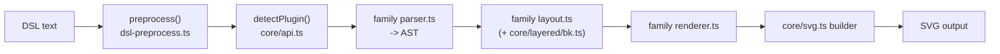
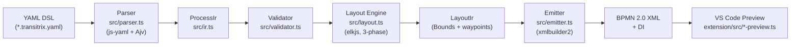
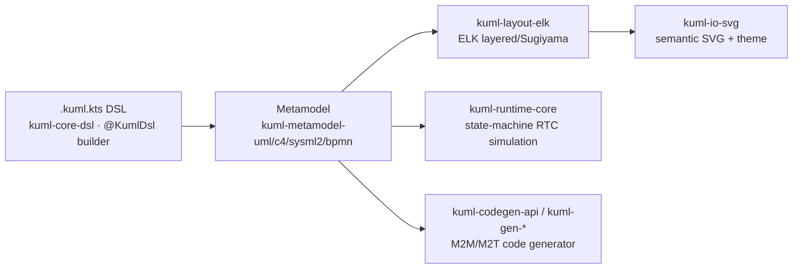

```mermaid
flowchart LR
    A["scene.yaml/.json/.d2"] --> B["parse.go: Parse/ParseYAML/ParseJSON"]
    B --> C["dsl.go: Document/Node IR"]
    C --> D["layout.go: arrangeAuto/Force/Ring/Container/placeSiblings"]
    D --> E["lower.go: flatten CompositePart"]
    E --> F["iso25d: Convert2DTo25D + RenderComposite"]
    F --> G["render.go/inject.go: canvas+connector+label layers"]
    G --> H["repair.go: auto-repair occlusion/contrast"]
    H --> I["out/*.svg"]
```

# Weekly Scan — Diagram-as-Code & Visual Tooling (2026-07-02)

**Executive summary:**
- 4 repo có evidence hoạt động xác nhận trong tuần qua (~2026-06-25 → 2026-07-02), tất cả đều ship release ngay trước ngày quét (chủ yếu 2026-07-01) — cụm này rõ ràng nghiêng về "LLM-native tooling": ba trong bốn repo (iso-topology, kUML, và gián tiếp SchemaTex qua doc AI-grounding) chủ động expose MCP server hoặc capability schema cho AI agent, một pattern mới đáng theo dõi cho kymostudio.
- Phát hiện đáng chú ý nhất cho kymostudio: **transitrix-studio** giải đúng bài toán mà kymostudio's BPMN importer hiện *tránh* — generate DI coordinates từ đầu (kymostudio chỉ đọc DI có sẵn) — bằng ELK 2-pass + custom orthogonal router, là blueprint cụ thể nếu kymostudio làm BPMN export/generation trong tương lai.
- Không repo nào trong 4 cái này cạnh tranh trực tiếp trên trục "animated SVG" của kymostudio (SchemaTex và iso-topology không có animation; kUML có SMIL nhưng traction rất thấp); điểm khác biệt lớn nhất giữa các repo là **IR design**: kymostudio dùng một `Diagram` dataclass chung cho mọi front-end, trong khi SchemaTex (49 family) và kUML (4 notation) đều chọn per-family/per-notation model riêng + tầng cầu nối tường minh thay vì ép chung.

## Mục lục
1. [iso-topology](#iso-topology)
2. [SchemaTex](#schematex)
3. [transitrix-studio](#transitrix-studio)
4. [kUML](#kuml)

---

## iso-topology

### §1 — Quick Context

iso-topology là DSL Go biên dịch YAML/JSON/D2 thành SVG kiến trúc isometric 2.5D "Figma-grade" — khác Mermaid/D2 (2D flat) và kymostudio (SVG phẳng + animate) ở chỗ tập trung vào **projection 2.5D + shape rendering chất lượng thiết kế** (gradient, glass, brand icon) thay vì animation. Stack: Go 1.25, phụ thuộc `gopkg.in/yaml.v3` và `oss.terrastruct.com/d2` (import D2), output SVG (+ PNG snapshot). Repo: 36 sao, 0 fork, license Apache-2.0, release mới nhất v0.14.2, có CI (`test.yml`, `release.yml` qua goreleaser) và rất nhiều `*_test.go` (golden/acceptance tests). Phân phối: binary qua `go install`, MCP server riêng (`cmd/isotopo-mcp`), và web "studio" (drag-drop).

### §2 — Architecture Deep-Dive

**A. Component inventory** — Codebase đặt phần lớn logic core ở root package (`package iso-topology`), không tách `internal/`:
- `dsl.go` — định nghĩa IR: `Document`, `Node`, `Style`, `CompositePart`.
- `parse.go` — `Parse`/`ParseYAML`/`ParseJSON`, tự sniff định dạng, có bước `normalizeFlowColons` chuẩn hoá YAML flow-map.
- `layout.go` — 5 chiến lược: `arrangeAuto` (Sugiyama longest-path), `arrangeForce` (force-directed), `arrangeContainer` (grid/row/col), `arrangeRing` (hub-spoke), `placeSiblings` (relation constraint: rightOf/leftOf/inFrontOf/behind/above).
- `lower.go` — lowering pass, flatten cây `CompositePart` (group/stack) thành slice phẳng cho `iso25d`.
- `render.go` + `inject.go` — orchestrator gọi `iso25d.Convert2DTo25D`/`RenderComposite` rồi chồng layer canvas/connector/label/annotation.
- `iso25d/` — package riêng vẽ hình học isometric: `geometry.go`, `shape_*.go` (cylinder, prism, rack, sphere, person, wedge, cloud...), `icons/si` (200+ brand logo Simple Icons).
- `capabilities.go` — sinh JSON capability report runtime cho agent.
- `repair.go`/`occlusion.go`/`readability.go` — auto-repair, occlusion detection, chấm điểm readability.
- `cmd/isotopo/main.go`, `cmd/isotopo-mcp/main.go` — CLI và MCP server.

**B. Pipeline** (1) User/agent viết `scene.yaml|.json|.d2` → (2) `isotopo render scene.yaml ./out` gọi `parse.go` auto-detect + decode thành `Document`/`Node` tree → (3) `layout.go` giải các auto-layout/`place` thành toạ độ grid-cell tuyệt đối → (4) `lower.go` flatten tree composite → (5) `iso25d` project 2D→2.5D và vẽ shape geometry, `inject.go` chồng connector/label/annotation, `repair.go` tự sửa occlusion/contrast (trừ `--no-repair`) → (6) SVG (+ tuỳ chọn PNG snapshot, `report.json` readability) ghi ra `out/`.

**C. Data model/IR** — struct Go mutable (`Document{Canvas,Theme,Nodes,Annotations}`, `Node{Shape,Geom,Style,Parts,Anchors,Connectors,Layout}`, `CompositePart{ID,Shape,Offset,Parts,Layout,Place}`). Không có "lower IR" type riêng biệt — `lower.go` chỉ flatten cùng kiểu `CompositePart` thành slice, mutate in-place và tự xoá field `layout/place` sau khi giải (idempotent).

**D. Input language** — không phải grammar text tự chế; input là YAML/JSON decode thẳng vào struct Go (config-as-DSL) cộng đường nhập D2 (qua dependency `d2`). Không có file `.bnf/.peg`. Validate/lint (`lint.go`, `keylint.go`) có gợi ý "did you mean"; `capabilities.go` publish enum hợp lệ trực tiếp từ runtime để tránh agent bịa key.

**E. Layout** — hybrid: Sugiyama hierarchical (longest-path + crossing reduction) cho DAG, force-directed cho đồ thị cyclic, ring/hub-spoke, grid/container, và constraint solver quan hệ (`place`) DFS có phát hiện cycle. Cờ CLI `--layout dagre|elk` gợi ý có thể còn dùng engine ngoài (không xác định cơ chế chính xác — `goja`, một JS VM thuần Go, có trong `go.mod` nhưng không rõ do `isotopo` dùng trực tiếp hay do `d2` kéo theo).

**F. Rendering** — renderer Go thuần, không headless browser; xuất SVG string trực tiếp. Không tìm thấy cơ chế animation. Shape mở rộng qua file `shape_*.go` riêng biệt trong `iso25d/`.

**G. Extensibility** — thêm shape mới = thêm `shape_*.go`; icon brand qua `icons/si`; theming qua `Style/Palette/FaceStyle`; `capabilities.go` tự đồng bộ schema công khai — tránh doc trôi khỏi code.

**H. Dev experience** — CLI đủ bộ: `render/validate/evaluate/preview/snapshot/serve`; `serve` mở live-preview HTTP kèm hover source-map, zoom/pan, edit-to-re-render (`yamledit/`). Không thấy LSP/VS Code extension.

### §3 — Architecture Diagram

### §4 — Verdict

Đáng học nhất cho kymostudio: (1) `capabilities.go` — sinh JSON schema/enum trực tiếp từ runtime code cho agent, tránh doc-drift, có thể áp dụng cho việc LLM-author `.kymo`; (2) `placeSiblings` — relation DSL (`rightOf/leftOf/behind`) như một lớp constraint bổ sung cho auto-layout frame, thay vì chỉ grid/stack; (3) auto-repair pass (occlusion/contrast) sau layout — ý tưởng validate-and-fix trước khi render, khác cách kymostudio để renderer "dumb". Red flag: toàn bộ logic core nằm ở root package (không `internal/`), dễ rối khi scale; input là YAML/JSON schema chứ không phải grammar text riêng — ít "ngôn ngữ" hơn so với `.kymo`. Câu hỏi mở: cơ chế `--layout dagre|elk` dùng `goja` thế nào, và animation có tồn tại không (không thấy). Verdict: **study deeper** phần `capabilities.go` và `placeSiblings`; phần renderer/shape 2.5D thì chỉ **glance only** vì mục tiêu khác kymostudio.

---

## SchemaTex

### §1 — Quick Context

SchemaTex là engine render 49 họ diagram chuyên ngành (y khoa, kỹ thuật, pháp lý) theo standard thật (IEC, IEEE, UML, NUREG...), khác Mermaid/D2 ở chỗ mỗi family có layout/notation riêng thay vì generic shape. Stack: TypeScript strict, zero runtime dependency, hand-written parser/layout, output pure SVG (không animation). Repo nhỏ (39 sao, 2 fork, do MyMap.ai chủ trì), release mới nhất v0.9.12, có CI (`ci.yml`, `publish.yml`) + Vitest + Playwright. Phân phối qua npm (`schematex`), kèm React wrapper, browser UMD build, export PNG/PDF.

### §2 — Architecture Deep-Dive

**A. Component inventory**
- `Plugin registry` (`src/core/api.ts`) — mảng `plugins: DiagramPlugin[]` (~49 phần tử), mỗi plugin export `{type, detect, render, parse?, lint?}`.
- `Preprocessor` (`src/core/dsl-preprocess.ts`) — strip frontmatter YAML tối giản + comment (`%%`, `//`, `#`) quote-aware, dùng chung cho mọi parser.
- `Diagnostics` (`src/core/diagnostics.ts`) — type `SchematexDiagnostic {severity, code, message, line?, column?, hint?, fatal}`.
- `SVG builder` (`src/core/svg.ts`) — element builder escape-safe, thuần static markup, không animation.
- `Layered layout engine` (`src/core/layered/bk.ts`) — implement Brandes-Köpf horizontal coordinate assignment (port từ dagre), dùng chung cho các family dạng layered graph (flowchart, entity, ER, block diagram).
- `Fault tree analysis` (`src/diagrams/faulttree/analysis.ts`) — implement MOCUS (Fussell-Vesely 1972) cho minimal cut sets.
- `PERT scheduler` (`src/diagrams/pert/scheduler.ts`) — tính critical path/schedule (tên file gợi ý, chưa đọc full nội dung).
- Mỗi family trong `src/diagrams/<name>/` theo mẫu cố định: `parser.ts`, `layout.ts`, `renderer.ts`, `types.ts`, `index.ts` (faulttree có thêm `analysis.ts`, pert có thêm `aoa.ts`/`gantt.ts`/`scheduler.ts`).

**B. Pipeline**
1. User gọi `render(text, config)` từ `src/index.ts`.
2. `preprocess()` strip frontmatter/comment.
3. `detectPlugin()` — nếu có `config.type` thì lookup trực tiếp, ngược lại loop gọi `plugin.detect(text)` (content-based, thường match keyword đầu dòng như `genogram "..."`).
4. Plugin-specific `parser.ts` → AST riêng của family (không có IR chung).
5. `layout.ts` của family (có thể gọi `bk.ts` nếu là layered graph) → `LayoutResult` (node/edge đã có toạ độ).
6. `renderer.ts` dùng `svg.ts` builder → chuỗi SVG string trả về.

**C. Data model/IR**
Không xác định có unified IR — evidence cho thấy **mỗi family tự định nghĩa AST riêng** (`DiagramAST`, `TimingAST`, `FlowchartAST`, `BpmnAst`...), chỉ thống nhất qua interface `DiagramPlugin`. AST parse một lần, không mutate lại (immutable by convention, không thấy setter). Không có khái niệm "lower IR" giữa các family — đây là điểm khác biệt lớn với kymostudio (`model.py`/`Diagram` dataclass dùng chung cho mọi front-end).

**D. Input language design**
Không xác định formal grammar (không tìm thấy EBNF/PEG file). Bằng chứng cho thấy **hand-written parser theo family**, preprocessing dùng regex/line-based (frontmatter + comment strip), có `dsl-suggest.ts` cho autocomplete và `legend-parser.ts` riêng cho legend syntax. Error reporting có structure rõ (`line`, `column`, `hint`, `code`) — thiết kế "AI-optimized" chủ đích tránh ambiguous nesting/positional args.

**E. Layout algorithm**
Đa dạng theo family: layered/hierarchical dùng Brandes-Köpf (`bk.ts`) cho crossing-aware horizontal alignment; fault tree dùng MOCUS Boolean expansion (idempotence + absorption để rút gọn cut-set); PERT/CPM có `scheduler.ts` riêng (tên gợi ý critical-path/forward-backward pass) tách biệt `layout.ts` (geometry) khỏi `scheduler` (schedule computation) — tách concern rất rõ ràng, đáng học.

**F. Rendering/output**
Renderer per-family gọi chung `svg.ts` builder — **không có animation mechanism** (xác nhận: không SMIL, không CSS keyframes). Tree-shakable qua sub-path export (`schematex/genogram`). Không phải pluggable emitter đa target (chỉ SVG + export PNG/PDF ở layer riêng `export.ts`, không phải Figma/Excalidraw như kymostudio).

**G. Extensibility**
Add family mới = tạo folder `src/diagrams/<name>/` theo template cố định + đăng ký vào mảng `plugins` trong `api.ts`. Đơn giản, tương tự cách kymostudio thêm BPMN importer, nhưng SchemaTex không có shared alignment/layout resolver — mỗi family tự viết layout từ đầu (trừ các family dùng chung `bk.ts`).

**H. Dev experience**
Có `docs/system/EXAMPLES-CORPUS-AI-GROUNDING.md`, `EXAMPLES-PLAN.md`, `USER-DOCS-TEMPLATE.md` — hướng tới AI-grounding/documentation-driven, không xác định có LSP/watch mode riêng (không thấy VSCode extension trong listing).

### §3 — Architecture Diagram

### §4 — Verdict

Đáng học nhất: (1) tách `scheduler.ts` khỏi `layout.ts` cho PERT — kymostudio có thể tách schedule-computation ra khỏi `alignment.py` khi mở rộng sang project-management diagrams; (2) `bk.ts` (Brandes-Köpf) là lời giải chuẩn cho horizontal coordinate assignment nếu kymostudio cần layered/Sugiyama layout tốt hơn thay vì auto-layout frame hiện tại; (3) MOCUS cut-set algorithm là blueprint cụ thể nếu kymostudio mở rộng sang fault-tree/reliability diagrams. Red flag: AGPL-3.0 + dual commercial license — nếu kymostudio muốn "mượn" thuật toán/code cụ thể (không chỉ ý tưởng), cần tránh copy trực tiếp hoặc xin license thương mại. Thiếu unified IR khiến 49 family không share alignment resolver — kymostudio's `Diagram`/`resolve_alignments()` dùng chung là thiết kế tốt hơn về mặt bảo trì. Không có animation — không phải đối thủ trực tiếp trên trục "animated SVG". Open question: chưa đọc được `scheduler.ts`/`aoa.ts` full nội dung để xác nhận CPM forward/backward pass chi tiết. **Verdict: study deeper** (riêng `bk.ts` và `faulttree/analysis.ts`), phần còn lại glance only.

---

## transitrix-studio

### §1 — Quick Context

Text-first YAML DSL compile ra BPMN 2.0 XML hợp lệ với auto-layout ELK — khác kymostudio ở chỗ nó *generate* DI coordinates từ đầu thay vì đọc DI có sẵn. Stack: TypeScript (93%), `elkjs`, `js-yaml`, `ajv`, `xmlbuilder2`; output XML (+ SVG/PNG preview qua bpmn-js). Repo nhỏ (3 sao, 1 tác giả chính — Valerii Korobeinikov), release rất dồn dập (v2.8.0, ~1-2 release/ngày cuối tháng 6/2026), có test corpus (`tests/fixtures/notation-corpus`, Vitest) nhưng workflow CI công khai chỉ thấy các job publish + `metrics-regression.yml`, không thấy workflow test/lint riêng. Phân phối: VS Code Marketplace, Open VSX, JetBrains Marketplace, `.vsix` trên GitHub Releases; CLI `transitrix` chưa publish lên npm (phải clone + `npm link`).

### §2 — Architecture Deep-Dive

**A. Component inventory**
- `Parser` (`src/parser.ts`) — `parseYamlToIr()` dùng `js-yaml` load YAML, validate bằng Ajv + schema JSON (`schemas/bpmn-dsl.schema.json`), rồi kiểm tra runtime (duplicate ID, self-referencing flow, missing reference), trả về `ProcessIr`.
- `IR types` (`src/ir.ts`) — `FlowElement`, `SequenceFlowIr`, `AssociationIr`, `ProcessIr` (logic layer) và `LayoutIr`/`PositionedFlowElement`/`PositionedSequenceFlow` (layer đã có toạ độ); cấu trúc bất biến (immutable), không có method mutate.
- `Layout engine` (`src/layout.ts`) — tích hợp `elkjs`, 3 phase (global X-pass, per-lane Y-pass, assembly/de-overlap) + custom orthogonal edge-routing logic riêng cho BPMN.
- `Emitter` (`src/emitter.ts`) — dùng `xmlbuilder2` build `<definitions>`/`<collaboration>`/`<process>`/`<bpmndi:BPMNDiagram>` từ `LayoutIr`.
- `Compiler` (`src/compiler.ts`) — orchestrator: parse → config (`transitrixrc`) → validate → layout → emit → round-trip conformance check qua `bpmn-moddle`.
- `Validator` (`src/validator.ts`, `validate-notation.ts`) — rule-based validation, cấu hình override qua `.transitrixrc`.
- `VS Code extension` (`extension/src/extension.ts` + ~20 file `*-preview.ts`) — mỗi notation một class preview riêng (`GoalsPreview`, `DgcaPreview`, `CapabilityMapPreview`, `ProcessMapPreview`, v.v.), quản lý webview.

**B. Pipeline (happy path)**
1. User viết `*.bpmn.transitrix.yaml`.
2. `parseYamlToIr()` — YAML → `ProcessIr` (validate schema + tham chiếu).
3. Load/merge config (`transitrixrc`) → merge rule mặc định.
4. `validateProcess()` → `ValidationReport`.
5. `layoutProcess()` — ELK 3-phase → `LayoutIr` (toạ độ + waypoints).
6. `emitBpmnXml()` — `LayoutIr` → chuỗi BPMN 2.0 XML, kèm round-trip qua `BpmnModdle.fromXML()` để bắt lỗi conformance.

**C. Data model/IR**
Có concept IR trung gian rõ ràng, tách 2 lớp: `ProcessIr` (thuần logic, không toạ độ) và `LayoutIr` (đã gắn `Bounds`/waypoints). Immutable, không có API mutate — mô hình functional composition giữa logic và visual, khá tương đồng tinh thần với `model.py` "dumb data" của kymostudio nhưng transitrix có thêm bước tách IR-chưa-layout / IR-đã-layout tường minh.

**D. Input language design**
Custom YAML schema (không phải grammar EBNF hình thức) validate bằng JSON Schema (Ajv + ajv-formats), mỗi notation có schema riêng dưới `schemas/`. Header `notation: bpmn` (hoặc goals/dgca/...) + đuôi file (`*.goals.transitrix.yaml`) xác định loại. Error reporting: Ajv error transform thành `"${instancePath} ${message}"`, cộng runtime check thủ công (duplicate id, dangling flow ref). Không có formal grammar/parser combinator — thuần schema-driven.

**E. Layout algorithm — so sánh trực tiếp với kymostudio**
Đây là điểm khác biệt cốt lõi với kymostudio: BPMN importer của kymostudio **bỏ qua layout** vì DI coordinates trong file BPMN nguồn đã tuyệt đối (`cli.py` skip `layout()`/`resolve_alignments()`). Transitrix-studio thì generate BPMN *từ YAML không có toạ độ* nên buộc phải tự tính toàn bộ layout: dùng ELK nhưng KHÔNG giao hết cho ELK — chạy 2 pass ELK riêng (global layered pass lấy X toàn cục xuyên lane, rồi per-lane pass lấy Y cục bộ), sau đó custom-merge + de-overlap + "axis snapping" (căn giữa cột 1-phần-tử theo trục lane) bằng tay. Edge routing cũng custom orthogonal, không dùng ELK router thô: có rule ưu tiên đường thẳng đứng khi an toàn, elbow 3-điểm, và "5-point channel route" qua khe giữa lane khi có nguy cơ đè lên phần tử khác — theo doc `docs/bpmn-routing.md`, đây là đánh đổi có chủ đích: chấp nhận đường dài hơn để đảm bảo không chồng lấn, ưu tiên rõ ràng thị giác hơn đường ngắn nhất thuần ELK.

**F. Rendering/output**
Output chính là BPMN 2.0 XML (DI đầy đủ). Ngoài ra extension render preview SVG/webview trực tiếp trong VS Code (custom BPMN renderer từ v2.2.0 thay cho bpmn-js mặc định), export PNG/SVG qua lệnh riêng. Không có animation.

**G. Extensibility**
Mỗi notation (13 loại) có: schema JSON riêng, preview class riêng trong `extension/src`, và fixture riêng trong `tests/fixtures/notation-corpus`. Không thấy plugin system công khai cho bên thứ ba thêm notation mới — thêm notation dường như là việc nội bộ (thêm schema + preview + IR type).

**H. Dev experience**
Live preview qua webview, tự refresh `onDidSaveTextDocument`. Không có LSP/inline diagnostics — validate chạy phía compiler, không phải qua ngôn ngữ server; lỗi hiện trong panel/report chứ không phải squiggly inline. CLI `transitrix` hỗ trợ `compile`/`validate`/`serve` (watch qua `serve`).

### §3 — Architecture Diagram

### §4 — Verdict

Điểm đáng học: chiến lược ELK 2-pass tách X-toàn-cục/Y-per-lane và custom orthogonal router (straight/elbow/5-point channel) rất đáng tham khảo nếu kymostudio từng làm BPMN *export* hoặc DSL layout xuyên swimlane — đây chính là bài toán mà `alignment.py` chưa cần giải vì kymostudio hiện chỉ *đọc* DI có sẵn cho BPMN. Ý hay cụ thể: dùng ELK cho phần "khó" (topological ordering/columns) nhưng tự viết routing cho phần "cần đẹp về mặt thị giác" (BPMN semantics) thay vì tin tưởng hoàn toàn router generic — mirror đúng triết lý "renderer dumb, data thông minh" của kymostudio nhưng áp cho layout thay vì render. Red flags: repo rất nhỏ (3 sao, có vẻ 1 người maintain), release cadence bất thường dồn dập (nhiều version/ngày) gợi ý ít review; không thấy workflow CI chạy test/lint công khai (chỉ có publish + metrics-regression); CLI package chưa publish npm. Open questions: 13 notation cụ thể là những loại nào ngoài BPMN/Goals/DGCA/capability-map (không xác định đầy đủ danh sách), và pipeline validate/layout có tách được để tái dùng ngoài VS Code không. Verdict: **study deeper** riêng phần `src/layout.ts` (chiến lược ELK 2-pass + custom router) nếu kymostudio làm BPMN generation-from-DSL trong tương lai; phần còn lại (extension, notations) chỉ cần glance.

---

## kUML

### §1 — Quick Context

kUML là internal Kotlin DSL type-safe hợp nhất UML 2.x, SysML 2, C4 và BPMN 2.0 thành các "first-class peer" trong cùng build system, khác Mermaid/D2/kymostudio ở chỗ dùng ngôn ngữ chủ (Kotlin) thay vì text DSL riêng. Stack: Kotlin Multiplatform (JVM/JS/WASM), kotlinx.serialization, ELK layout, output SVG/PNG/APNG-WebP/LaTeX/JSON/XMI/BPMN-XML/ARXML. Repo rất nhỏ: 5 stars, 0 forks, gần như một tác giả, nhưng release cực nhanh (v0.22.0, 26 bản, CI có `ci.yml`/`codeql.yml`, có `kuml-tests` với 8 sub-module test). Phân phối qua Maven Central (`dev.kuml`), Gradle Plugin Portal, JetBrains/VS Code Marketplace, Homebrew/Docker.

### §2 — Architecture Deep-Dive

**A. Component inventory** (Gradle multi-module, 112+ module): `kuml-core-dsl` (`kuml-core/kuml-core-dsl/src/commonMain/kotlin/dev/kuml/core/dsl/KumlDsl.kt`) — annotation `@DslMarker`; `kuml-metamodel-{uml,c4,sysml2,bpmn,kerml,blueprint}` — mỗi notation một package model riêng (`.../dev/kuml/uml/StateMachine.kt`); `kuml-layout-elk` (`kuml-renderer/kuml-layout-elk`) — bọc Eclipse Layout Kernel; `kuml-io-svg` — renderer SVG tĩnh; `kuml-runtime-core` (`OPERATIONAL_SEMANTICS.md`) — simulation engine; `kuml-codegen-api`/`kuml-gen-kotlin` — M2M/M2T; `kuml-plugin-api-*` + `kuml-plugin-loader` — SPI mở rộng; `kuml-mcp`/`kuml-llm-anthropic` — tích hợp MCP/LLM.

**B. Pipeline**: (1) người dùng viết file `.kuml.kts` gọi builder như `c4Model(name=...) { person{...}; softwareSystem{...} }` → (2) Kotlin script thực thi builder, dựng object graph model (data class bất biến) → (3) `kuml-layout-bridge` chuyển sang ELK graph, chạy `elk.layered` (Sugiyama) → (4) map ngược thành `LayoutResult` → (5) `kuml-io-svg` render `<rect>/<text>/<path>` + `<defs>/<style>` theo theme, hoặc `kuml-codegen-api` sinh code từ `UmlModel` đã evaluate.

**C. Data model/IR**: KHÔNG có một IR hợp nhất duy nhất — mỗi metamodel (`UmlStateMachine`, `UmlVertex` sealed interface với `UmlState`/`UmlPseudostate`/`UmlFinalState`) là data class/sealed interface riêng, `@Serializable`, bất biến. "Unification" nằm ở tầng pipeline/tooling dùng chung (renderer, layout, codegen), còn cross-notation chuyển đổi là module cầu nối tường minh (`kuml-transform-bpmn-to-uml`), không phải ép tất cả vào chung một schema.

**D. Input language design**: Internal DSL — Kotlin type-safe builder + `@DslMarker` (class `KumlDsl`) ngăn nesting sai scope, autocomplete/type-check tự nhiên trong IntelliJ. Khác hẳn kymostudio: `.kymo` là external text DSL với parser/grammar riêng (`dsl.py`/`dsl.ts`, EBNF trong `docs/DSL.md`) — đánh đổi: kUML có compile-time safety + IDE support miễn phí nhưng cần Kotlin toolchain (ví dụ README ví dụ phải thêm `@file:Suppress("unused")` để né lỗi resolver K2); kymostudio giữ format độc lập ngôn ngữ, dễ portable/host ở web nhưng phải tự build parser+validator.

**E. Layout**: auto-layout thật qua ELK (`elk.layered`, Sugiyama/hierarchical), có thêm `kuml-layout-grid` cho kiểu lưới; nguyên tắc "ELK types never leave this module" cô lập engine layout sau API riêng.

**F. Rendering/output**: SVG tĩnh (`kuml-io-svg`), PNG, animated SVG/SMIL (`kuml-render-smil`, `kuml-io-anim`), APNG/WebP (v0.22.0), LaTeX, JSON, EMF, ARXML, BPMN XML. M2M/M2T qua interface `KumlCodeGenerator` (nhận `UmlModel` đã resolve, trả `List<GeneratedFile>`), nạp bằng `ServiceLoader`; có cả reverse-engineering Java/Kotlin/C#.

**G. Extensibility**: plugin SPI tách riêng theo trục (`kuml-plugin-api-{core,theme,renderer,layout,codegen,reverse}`) + module ví dụ tham chiếu (`plugin-renderer-pdf`, `plugin-codegen-typescript`...). Lưu ý: thêm notation MỚI (thứ 5) vẫn cần module `kuml-metamodel-*` mới, không phải chỉ viết plugin.

**H. Dev experience**: `.kuml.kts` chạy trực tiếp trong IntelliJ (autocomplete tự nhiên) + plugin JetBrains/VS Code riêng cho preview. Simulation thực thi qua `kuml-runtime-core` theo semantics tài liệu hoá (Run-To-Completion: vào initial pseudostate, chọn transition theo trigger+guard, tie-break "deepest state wins", thứ tự exit→effect→entry, FIFO queue cho internal event, guard lỗi = false, action lỗi abort atomic) — chạy được qua CLI `kuml run`, không chỉ trong unit test.

### §3 — Architecture Diagram

### §4 — Verdict

Đáng học nhất cho kymostudio: (1) pattern "per-notation model + transform-bridge module tường minh" (`kuml-transform-bpmn-to-uml`) thay vì nhồi BPMN vào chung `Component/Region/Edge` — nếu BPMN importer cần semantics riêng sâu hơn, tách IR riêng + module map tường minh có thể sạch hơn ép chung dataclass; (2) nguyên tắc cô lập engine ngoài ("ELK types never leave this module") áp dụng được nếu kymostudio từng cân nhắc đổi/refactor `alignment.py`. Red flags: 5 star/0 fork/gần như một maintainer nhưng 112+ module — nguy cơ over-engineering sớm; các module `kuml-runtime-chain-{evm,cosmos,move,wasm}` (blockchain) lạc đề rõ so với positioning UML, chưa rõ mục đích. Open question: internal DSL có thực sự phổ biến/adoption tốt không (evidence quá mỏng). Verdict: **glance only** — ý tưởng kiến trúc đáng ghi chú, nhưng chưa đủ traction để study sâu.
