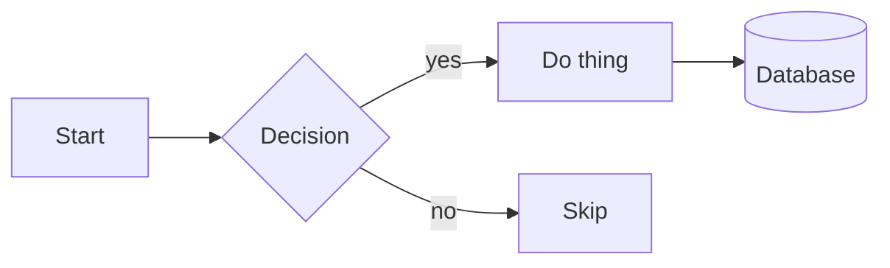
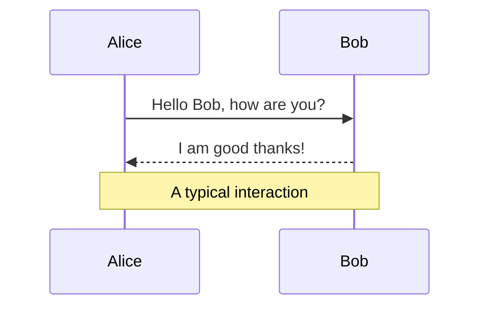
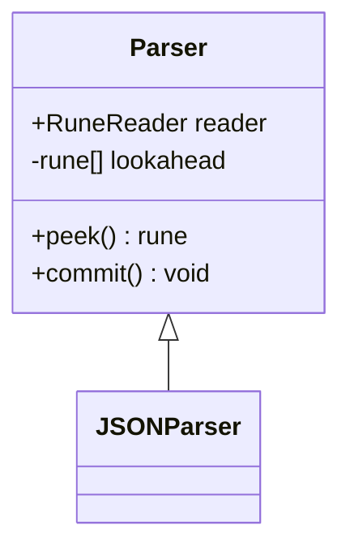
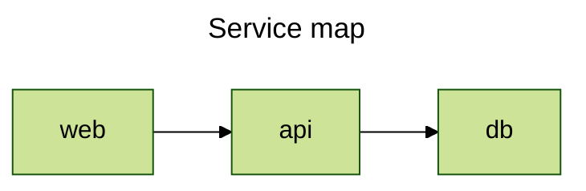
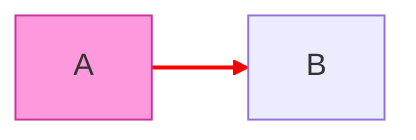
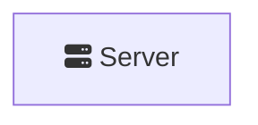

# Mermaid — External Reference

| Field             | Value                                                          |
|-------------------|----------------------------------------------------------------|
| Document ID       | REF-MERMAID-001                                               |
| Version           | 1.0                                                           |
| Issue Date        | 2026-06-03                                                    |
| Status            | Released                                                      |
| Classification    | Internal                                                      |
| Owner             | `diagrams/` project                                           |
| Audience          | Engineers evolving the `kymo` DSL, layout, or render pipeline  |
| Upstream          | [`mermaid-js/mermaid`](https://github.com/mermaid-js/mermaid) |
| License           | MIT                                                           |
| Version Reviewed  | 11.13.0                                                       |
| Access Date       | 2026-06-03                                                    |
| Related Documents | [`mermaid.comparision.md`](./a.mermaid.comparision.md), [`d2.md`](./b.d2.md), [`plantuml.md`](./a.plantuml.md), [`kroki.md`](./b.kroki.md), [`kymo-dsl/`](../formats/kymo-dsl/README.md), [`best-practices.md`](../diagrams/best-practices.md) |

This is a **reference note on prior art**, not a specification of kymo. It captures Mermaid's design choices so the team can consult them when evolving kymo's DSL, layout, and render pipeline. No code or behavior in this repository depends on Mermaid.

## 1. Overview

**Mermaid** is an open-source, JavaScript-based diagramming-and-charting tool that renders Markdown-inspired text definitions into diagrams **in the browser, at view time**. Created by Knut Sveidqvist and released under the **MIT License**, it is the de-facto standard for diagram-as-code in documentation: GitHub, GitLab, Notion, Obsidian, and most modern Markdown pipelines render fenced ` ```mermaid ` blocks natively. Its design centre is *zero-friction authoring inside Markdown* — you write a few lines next to your prose and the reader's renderer turns them into an SVG.

It occupies the same problem space as D2, Graphviz, and PlantUML — declarative source text in, diagram out — but with a distinct emphasis on (a) being embeddable as a pure client-side library, (b) a wide catalog of **chart-like** and software diagram types from one grammar, and (c) ubiquity through native Markdown integration rather than a standalone CLI.

- Repository: <https://github.com/mermaid-js/mermaid>
- Homepage / docs: <https://mermaid.js.org/>
- Live editor: <https://mermaid.live/>
- Version reviewed: **11.13.0** (as of access date 2026-06-03)
- GitHub stars at access date: **≈ 82k**

## 2. Syntax at a glance

The following snippets illustrate syntactic style, not authoritative grammar. Every diagram begins with a **type keyword** (`flowchart`, `sequenceDiagram`, `classDiagram`, …) that selects a sub-grammar — Mermaid is really a family of small languages behind one fence.

### 2.1 Flowchart



`flowchart LR` sets direction (`TB`/`TD`/`BT`/`RL`/`LR`). Node shapes are encoded by bracket style: `[]` rectangle, `()` rounded, `{}` diamond, `[()]` cylinder, `(())` circle, `>]` flag. Edges: `-->` arrow, `---` line, `-.->` dotted, `==>` thick; `|label|` puts text on an edge.

### 2.2 Sequence diagram



Order of statements is significant. `->>` solid arrow, `-->>` dashed reply; `activate`/`deactivate` (or `+`/`-` shorthand) draw activation bars; `loop`, `alt`, `opt`, `par` create labelled fragments.

### 2.3 Class diagram



Visibility prefixes (`+` public, `-` private, `#` protected, `~` package) mirror UML; relationship arrows encode inheritance (`<|--`), composition (`*--`), aggregation (`o--`), etc.

### 2.4 Config & theming via front-matter



Recent Mermaid versions accept a YAML **front-matter block** at the top of the diagram for `title`, `theme`, and per-diagram `config`. The older `%%{init: {...}}%%` *directive* form still works inline. This is the closest Mermaid has to kymo's top-level directives in `packages/python/src/kymo/dsl.py`.

### 2.5 Styling and classes



`classDef` defines a reusable style; `class` applies it; `style` targets one node inline; `linkStyle` targets edges **by index**. Edge styling addressed by ordinal index is brittle and is a known sharp edge of the language.

## 3. Diagram catalog

A single grammar family covers an unusually broad set of types — this is Mermaid's biggest scope difference vs kymo. As of 11.x:

| Category            | Diagram types |
|---------------------|---------------|
| Software / flow     | `flowchart`, `sequenceDiagram`, `classDiagram`, `stateDiagram-v2`, `erDiagram`, `C4Context` |
| Project / planning  | `gantt`, `journey` (user journey), `timeline`, `kanban`, `requirementDiagram` |
| Data / charting     | `pie`, `quadrantChart`, `xychart-beta`, `sankey-beta`, `radar`, `treemap`, `packet` |
| Knowledge           | `mindmap`, `block-beta`, `gitGraph` |
| Newer (11.x)        | `venn`, Ishikawa (fishbone), `architecture-beta`, `zenuml` |

Notes:

- Many newer types carry a `-beta` suffix until the syntax stabilises.
- `architecture-beta` and `flowchart` integrate the **Iconify** icon registry (see §5).
- By contrast, kymo draws **block / architecture diagrams only**; the breadth here (charts, Gantt, ERD, mindmaps) is out of kymo's intended scope.

## 4. Themes

Mermaid ships built-in themes: **default**, **neutral**, **dark**, **forest**, and **base** (the customisable one). Selection is via front-matter (`config.theme`) or the global `mermaid.initialize({ theme })` call. The **base** theme exposes `themeVariables` (primary colour, line colour, font, etc.) for fine control, and `themeCSS` allows raw CSS injection. Because rendering is client-side, a single document can adapt to the host page's light/dark mode if the host re-initialises Mermaid.

kymo currently has no theme system — accent colours are per-component and the palette is hand-coded in the renderer (`packages/python/src/kymo/to_svg.py`).

## 5. Icons



Two icon paths:

- **FontAwesome shorthand** — `fa:fa-name` inline in node text (requires the FA stylesheet on the host page).
- **Iconify packs** — registered via `mermaid.registerIconPacks([...])`; the `architecture-beta` and flowchart diagrams can then reference `logos:aws`, `mdi:database`, etc. from the ~200k-icon Iconify catalog.

There is **no bundled, self-contained icon set**; icons depend on external CSS/registries available at render time. kymo bundles its own SVG icon set in `packages/python/src/kymo/icons.py` and inlines it into the output — no network fetch, no host-page dependency. Different tradeoff: tighter set, zero runtime dependency, opinionated style.

## 6. Rendering model — the defining choice

Mermaid is, at heart, a **client-side renderer**. The canonical flow is: ship the `mermaid` JS bundle to the browser → it finds ` ```mermaid ` blocks (or elements you point it at) → parses, lays out (via an embedded **dagre**/cytoscape/ELK depending on diagram type), and injects an `<svg>` into the DOM.

Consequences:

- **Markdown-native ubiquity.** GitHub/GitLab/Notion render Mermaid without any build step — the single biggest reason for its adoption.
- **No owned image pipeline by default.** The "output" is DOM SVG produced at view time, not a file written by a compiler. For static artefacts you reach for the CLI (§7) or a service like Kroki (see [`kroki.md`](./b.kroki.md)).
- **Layout is per-diagram-type and embedded**, not pluggable the way D2 exposes Dagre/ELK/TALA by flag (see [`d2.md` §9](./b.d2.md)). Flowcharts can opt into an ELK renderer (`config.flowchart.defaultRenderer: elk`), but this is the exception, not a general layout-engine abstraction.

kymo takes the opposite stance: a **compiler** (`packages/python/src/kymo/`) deterministically produces SVG (and animated SVG / WebP / Figma / Excalidraw) files ahead of time, with its own layout (`layout.py`) and edge router (`to_svg.py`). The artefact is the product, not a runtime render.

## 7. CLI, library, and embedding

- **Library** — `mermaid` (npm) is the core; `mermaid.render(id, text)` returns SVG as a string in any JS runtime.
- **CLI** — `@mermaid-js/mermaid-cli` (`mmdc`) renders `.mmd` → SVG/PNG/PDF by driving a headless Chromium (Puppeteer). This is how Mermaid produces *files* outside a browser; the headless-browser dependency makes it heavier than a pure-Go/Java compiler.
- **Ports / wrappers** exist for many ecosystems (Python `mermaid-py`, Rust, etc.), but the source of truth is the JS implementation.

For kymo the practical contrast: kymo's renderer is a Python module with a JS/TS parity port (`packages/js`) and **no headless-browser dependency** — diagrams render via direct SVG emission and rasterise via `resvg` (`packages/python/src/kymo/to_webp.py`).

## 8. Output formats

- **SVG** — native, in-DOM (the default).
- **PNG / PDF** — via the `mmdc` CLI (headless Chromium).
- **Markdown embedding** — the de-facto "format": the source itself, rendered by the host.

Mermaid has **no animation model** comparable to D2's `style.animated` or kymo's animated SVG + frame-synthesised WebP (`packages/python/src/kymo/to_webp.py`). Motion, when present, is host-page CSS, not a language feature.

## 9. Ecosystem and adopters

Native Mermaid rendering ships in **GitHub**, **GitLab**, **Azure DevOps**, **Notion**, **Obsidian**, **Confluence** (via apps), and most static-site generators (Docusaurus, MkDocs Material, etc.). First-party tooling includes the **Mermaid Live Editor** (<https://mermaid.live/>), the **mermaid-cli**, and the commercial **Mermaid Chart** (hosted visual editor + AI features) that funds maintenance. This ubiquity — not language power — is Mermaid's defining strength; mention here is to signal maturity, not a dependency for kymo.

## 10. Comparison vs `kymo`

The opinionated prior-art comparison — at-a-glance matrix, headline tradeoffs, a per-category scoring of Mermaid against kymo, and open questions for kymo — lives in [`mermaid.comparision.md`](./a.mermaid.comparision.md). It is kept separate so it can evolve at a different cadence than this factual reference (kymo changes alone are enough to invalidate it, even when upstream Mermaid has not moved).

## 11. References

All accessed 2026-06-03.

- Mermaid repository — <https://github.com/mermaid-js/mermaid>
- Mermaid documentation — <https://mermaid.js.org/>
- Intro / about — <https://mermaid.js.org/intro/>
- Live editor — <https://mermaid.live/>
- mermaid-cli — <https://github.com/mermaid-js/mermaid-cli>
- Configuration & theming — <https://mermaid.js.org/config/theming.html>
- License (MIT) — <https://github.com/mermaid-js/mermaid/blob/develop/LICENSE>
- v11.13.0 release notes — <https://github.com/mermaid-js/mermaid/releases>
