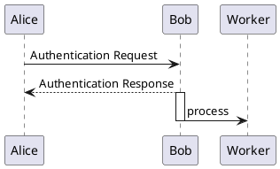
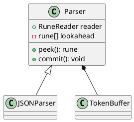
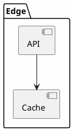

# PlantUML — External Reference

| Field             | Value                                                          |
|-------------------|----------------------------------------------------------------|
| Document ID       | REF-PLANTUML-001                                              |
| Version           | 1.0                                                          |
| Issue Date        | 2026-06-03                                                   |
| Status            | Released                                                     |
| Classification    | Internal                                                    |
| Owner             | `diagrams/` project                                          |
| Audience          | Engineers evolving the `kymo` DSL, layout, or render pipeline |
| Upstream          | [`plantuml/plantuml`](https://github.com/plantuml/plantuml)  |
| License           | GPL-3.0 (with LGPL / Apache / MIT / EPL variants)           |
| Version Reviewed  | 1.2026.5                                                     |
| Access Date       | 2026-06-03                                                   |
| Related Documents | [`plantuml.comparision.md`](./a.plantuml.comparision.md), [`mermaid.md`](./a.mermaid.md), [`d2.md`](./b.d2.md), [`kroki.md`](./b.kroki.md), `kymo-dsl/`, [`best-practices.md`](../diagrams/best-practices.md) |

This is a **reference note on prior art**, not a specification of kymo. It captures PlantUML's design choices so the team can consult them when evolving kymo's DSL, layout, and render pipeline. No code or behavior in this repository depends on PlantUML.

## 1. Overview

**PlantUML** is a long-standing, **Java**-based text-to-diagram tool whose primary heritage is **UML** — class, sequence, use-case, activity, component, state, object, deployment, and timing diagrams from a compact textual notation. Over time it has accreted a wide set of non-UML diagram families (JSON/YAML, network, wireframe, Gantt, mindmap, WBS, ArchiMate, ER). It compiles source to image **ahead of time** (PNG/SVG/EPS/LaTeX/ASCII), and for most diagram families it delegates node placement to **GraphViz (`dot`)** — sequence and a few others use PlantUML's own layout.

It occupies the same problem space as Mermaid, D2, and Graphviz — declarative source text in, diagram out — distinguished by (a) the deepest **UML** coverage of any DaC tool, (b) a real **preprocessor** (`!include`, `!define`, variables, functions, conditionals), and (c) a mature, sprawling integration ecosystem built up over more than a decade.

- Repository: <https://github.com/plantuml/plantuml>
- Homepage / docs: <https://plantuml.com/>
- Online server: <https://www.plantuml.com/plantuml/>
- Version reviewed: **1.2026.5** (year-based versioning; as of access date 2026-06-03)
- GitHub stars at access date: **≈ 13k**

## 2. Syntax at a glance

The following snippets illustrate syntactic style, not authoritative grammar. Diagrams are wrapped in `@startuml ... @enduml` (or type-specific markers like `@startmindmap`); the marker selects the sub-grammar.

### 2.1 Sequence diagram



`->` solid message, `-->` dashed reply; `activate`/`deactivate` draw execution bars; `alt`/`opt`/`loop`/`par` create combined fragments. Sequence diagrams use PlantUML's own layout, not GraphViz.

### 2.2 Class diagram



Visibility prefixes mirror UML (`+`/`-`/`#`/`~`); relationship arrows encode inheritance (`<|--`), composition (`*--`), aggregation (`o--`), dependency (`..>`). Class/component/state/etc. are laid out by GraphViz.

### 2.3 Containers and styling (`skinparam`)



`package`/`namespace`/`rectangle`/`folder` group elements; `skinparam` (the legacy styling system) and the newer **`<style>` CSS-like blocks** control appearance globally or per-type. This is more global/cascading than kymo's per-component keys in `packages/python/src/kymo/dsl.py`.

### 2.4 Preprocessor — PlantUML's distinctive feature

```plantuml
@startuml
!define PRIMARY #5563d3
!include <awslib/AWSCommon>
!include <awslib/Compute/EC2>

!function $box($name)
!return "[" + $name + "]"
!endfunction

[Client] --> EC2 : request
@enduml
```



PlantUML ships a genuine **preprocessor**: `!define`/`!function`/`!procedure`, variables, `!if`/`!while`, and `!include`/`!includeurl` for pulling in shared definitions and **icon libraries** (the bundled "stdlib" — AWS, Azure, GCP, Kubernetes, C4, etc.). No other mainstream DaC tool has this depth of textual reuse; kymo has **no** variable/include construct today.

## 3. Diagram catalog

PlantUML's breadth is its calling card. As of the 1.2026 line:

| Category          | Diagram types |
|-------------------|---------------|
| UML (core)        | sequence, use case, class, activity (beta + legacy), component, state, object, deployment, timing |
| Non-UML structural| ER (IE notation), ArchiMate, network (nwdiag), wireframe/UI (salt), Gantt, work breakdown (WBS), mindmap |
| Data / text       | JSON, YAML, EBNF, regex, math (AsciiMath/JLaTeXMath) |
| Architecture      | C4 model (via stdlib `!include`) |

Notes:

- Layout: **GraphViz `dot`** drives most structural diagrams; sequence, Gantt, mindmap, WBS, and salt have bespoke layouts. The GraphViz dependency is why the "full" distribution is GPL (see §9).
- By contrast, kymo draws **block / architecture diagrams only**; PlantUML's UML depth and the non-UML families are out of kymo's intended scope.

## 4. Theming and styling

Two overlapping systems:

- **`skinparam`** — the original, key-by-key styling (`skinparam ArrowColor`, per-element-type blocks). Vast surface, somewhat ad hoc.
- **`<style>` blocks** — a newer, CSS-like cascade (selectors, properties, nesting) intended to supersede `skinparam` for new work.

Bundled **themes** (e.g. `!theme cerulean`, `!theme spacelab`, `!theme cyborg`) set coordinated palettes in one line. kymo currently has no theme system — accent colours are per-component and the palette is hand-coded in `packages/python/src/kymo/to_svg.py`.

## 5. Icons and sprites

```plantuml
@startuml
!include <office/Servers/database_server>
!include <tupadr3/font-awesome/server>
database_server(db, "Primary DB")
FA_SERVER(web, "Web") #lightgreen
@enduml
```

PlantUML supports **sprites** (monochrome bitmaps encoded in the source) and large `!include`-able icon collections — the bundled **stdlib** (AWS, Azure, GCP, Kubernetes, C4, Office, FontAwesome, Material via `tupadr3`, etc.) and OpenIconic. Icons are pulled by include path, not from a self-contained renderer asset. kymo bundles its own SVG icon set in `packages/python/src/kymo/icons.py` and inlines it — tighter set, no include resolution, opinionated style.

## 6. Rendering model and output formats

PlantUML is a **Java compiler**: `java -jar plantuml.jar diagram.puml` writes an image file. Outputs include **PNG**, **SVG**, **EPS**, **PDF** (via extra deps), **LaTeX/TikZ**, and **ASCII art** (`-ttxt`). This output breadth is wider than most DaC peers.

Two architectural facts matter for kymo:

- **GraphViz dependency.** Most diagram families shell out to `dot` for layout. This is powerful (decades-tuned graph layout) but is an external native dependency and the reason the bundled build is GPL. kymo owns its layout (`packages/python/src/kymo/layout.py`) with **no external layout engine**.
- **No animation.** PlantUML emits static images; it has no analogue of D2's `style.animated` or kymo's animated SVG + frame-synthesized WebP (`packages/python/src/kymo/to_webp.py`).

## 7. CLI, server, and embedding

- **JAR / CLI** — `plantuml.jar` is the canonical entry point (requires a JVM, and GraphViz for most diagrams).
- **Server** — `plantuml-server` (and the hosted <https://www.plantuml.com/plantuml/>) render via HTTP, including a compact **text-encoding** scheme so a whole diagram fits in a URL. This is the integration surface Kroki uses (see [`kroki.md`](./b.kroki.md)).
- **Integrations** — first- or third-party plugins for Confluence, Jira, IntelliJ, VS Code, Eclipse, Asciidoctor, Sphinx, Doxygen, and more — one of the largest integration footprints of any DaC tool.

For kymo the practical contrast: kymo's renderer is a dependency-light Python module with a JS/TS parity port (`packages/js`), **no JVM and no GraphViz** in the loop.

## 8. Ecosystem and adopters

PlantUML is entrenched in enterprise/Java and technical-documentation workflows, with deep penetration via Confluence/IntelliJ/Asciidoctor. It is also a primary backend behind aggregators like Kroki. Mention here is to signal maturity; none of it is a dependency for kymo.

## 9. Licensing nuance

PlantUML is offered under **several licenses** so users can pick one that fits: the **full distribution bundles GraphViz and is GPL**, while builds **without embedded GraphViz** are available under more permissive terms (**LGPL**, and parts under **Apache/MIT/EPL**). If kymo ever evaluated PlantUML as a backend, the GPL coupling of the GraphViz-bundled build would be the licensing question to resolve — kymo itself is Apache-2.0.

## 10. Comparison vs `kymo`

The opinionated prior-art comparison — at-a-glance matrix, headline tradeoffs, a per-category scoring of PlantUML against kymo, and open questions for kymo — lives in [`plantuml.comparision.md`](./a.plantuml.comparision.md). It is kept separate so it can evolve at a different cadence than this factual reference (kymo changes alone are enough to invalidate it, even when upstream PlantUML has not moved).

## 11. References

All accessed 2026-06-03.

- PlantUML repository — <https://github.com/plantuml/plantuml>
- PlantUML site / docs — <https://plantuml.com/>
- Language reference (PDF/guide) — <https://plantuml.com/guide>
- Preprocessor — <https://plantuml.com/preprocessing>
- Styles / themes — <https://plantuml.com/style-evolution> · <https://plantuml.com/theme>
- Stdlib (icon sets) — <https://plantuml.com/stdlib>
- Online server / text encoding — <https://www.plantuml.com/plantuml/>
- License (multi-license) — <https://github.com/plantuml/plantuml/blob/master/license.txt>
- Changes / versions — <https://plantuml.com/changes>
