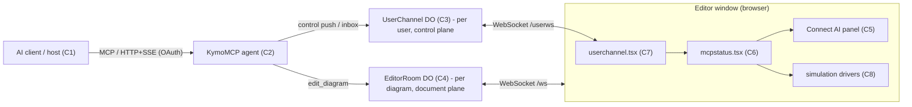
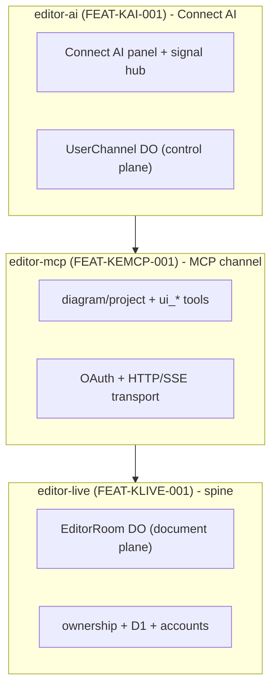
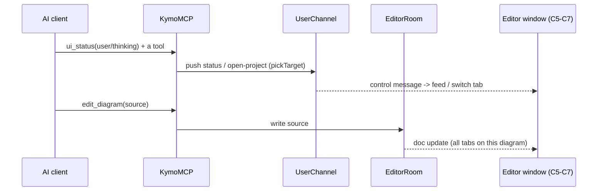
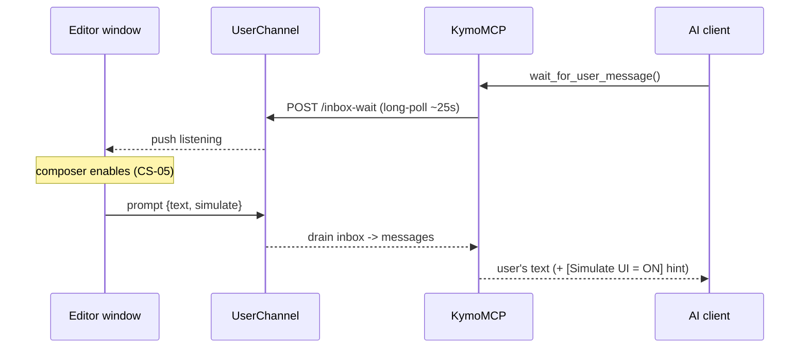

# Connect AI — Architecture overview

| Field | Value |
|-------|-------|
| Document ID | `DESIGN-KAI-003` |
| Realises | `FEAT-KAI-001` |
| Detail in | `DESIGN-KAI-001` (channel + panel + protocol), `DESIGN-KAI-002` (connection states) |

> The big picture: the components Connect AI is made of, how they connect, and how the two channels (control vs document) relate. The detailed message protocol is in `DESIGN-KAI-001`; this is the map to read first.

## 1. Components

| # | Component | Where | Responsibility |
|---|-----------|-------|----------------|
| C1 | **AI client / host** | external (Claude / Cursor / ChatGPT / Claude Code) | runs the agent loop; calls MCP tools; renders the user's chat |
| C2 | **KymoMCP** (`McpAgent`) | Worker `packages/mcp/src/index.ts` | the OAuth-gated MCP surface (`mcp.kymo.studio`): diagram/project tools + the Connect-AI tools (`ui_status`, `ui_list_sessions`/`ui_switch_session`, `wait_for_user_message`, `simulate`) |
| C3 | **UserChannel DO** | Worker (per-user, keyed by `email`) | the **control plane**: presence, window targeting, the `ui_status` feed, open/close/open-project, the reverse-channel inbox, the UI-simulation triggers — see `DESIGN-KAI-001` §2 |
| C4 | **EditorRoom DO** | Worker (per-diagram) | the **document plane**: live source/title sync + `edit_diagram` fan-out (owned by `editor-live` / `editor-mcp` — unchanged here) |
| C5 | **Connect AI panel** | editor `web/connectai.tsx` | the visible surface: Chat/Connection/Setup, feed, composer, settings gear |
| C6 | **Signal hub** | editor `web/mcpstatus.tsx` | dependency-free pub/sub for presence/pin/session/feed/prompt/simulate/listening + the `register*` registries |
| C7 | **Control-channel client** | editor `web/userchannel.tsx` | the `/userws` WebSocket; maps inbound pushes → C6 signals; sends focus/pin/ctx/prompt |
| C8 | **Simulation drivers** | editor `web/addressbar.tsx`, `web/ProjectsModal.tsx` | animate the real new-/delete-project UI when `simulate:true` |
| C9 | **MCP connection registry** | Worker (in C3 `UserChannel`) | per-user index of connected MCP **clients** — heartbeat-fed `McpConn` records; counts connected vs **outdated** (server/stale/protocol/client); read via `/api/connections` (`FR-AI-11`, `CR-KAI-001`) |

## 2. Topology

## 3. Two channels, by plane

- **Control plane — `UserChannel` (per user).** Everything Connect AI adds: who's the target window, the live feed, open/close, the web→agent inbox, the simulation triggers, the `listening` signal. Keyed by `email`, so it spans all of a user's windows; routes to one (the pinned/focused) via `pickTarget`. Detail: `DESIGN-KAI-001` §2–§6.
- **Document plane — `EditorRoom` (per diagram).** Source/title live-sync; `edit_diagram` writes here and fans out to every tab on that diagram. Owned by `editor-live`/`editor-mcp`; Connect AI does not change it. (This is why two windows on the *same* diagram both update, independent of which is the AI target.)

Connect AI is the **control plane** layered over `editor-mcp`'s tool/transport base (`FR-MC-02/03/05`); `editor-mcp` in turn builds on `editor-live` (rooms + ownership). The dependency layering (a module's box sits on what it builds on):

## 4. Key flows

**Agent acts (control):** C1 calls a tool on C2 → C2 narrates via C3 (`ui_status`) and/or pushes an `open`/`open-project` control message → C3 routes to the target window's C7 → C6 updates → C5 re-renders (feed/tab). Document edits go C2 → C4 → all tabs.

**User drives the agent (reverse):** the user types in C5 → C7 sends `{type:"prompt", text, simulate}` to C3 (queued in the inbox) → C1's `wait_for_user_message` long-poll on C2 drains it (and C3 broadcasts `listening`, which re-enables the composer in C5).

**UI simulation:** C2 (`new_project`/`delete_project` with `simulate:true`) pushes `ui-new-project`/`ui-delete-project` to C3 → C7 invokes C8, which animates the real switcher / Manage-projects flow (no reload).

**Connection registry (`FR-AI-11`, `CR-KAI-001`):** on every tool call (and each `wait_for_user_message` poll) C2 heartbeats `POST /mcp-seen` to C3, which upserts an `McpConn` record (client+protocol+server version, first/last-seen) into C9. The Connection tab in C5 fetches `/api/connections` → C3 `/mcp-connections`, which prunes dead entries and returns *N connected · M outdated* (outdated = server / stale / protocol / client). Because MCP is stateless, this is recent-activity per connection, not a live socket — see `DESIGN-KAI-002` CS-07.

## 5. Deployment

No new artefact. C2/C3/C4 are the existing `kymo-mcp` Worker + its Durable Objects (`UserChannel` is a DO binding alongside `EditorRoom`); C5–C8 ship in the existing editor Pages bundle. Per the umbrella `NFR-KE-02` (serverless) — one Worker, static page.

## 6. Key files

`packages/mcp/src/index.ts` (C2 `KymoMCP`, C3 `UserChannel`, C9 registry in `UserChannel` + `/api/connections`); `packages/editor/web/{connectai (C5), mcpstatus (C6), userchannel (C7), addressbar+ProjectsModal (C8)}.tsx`.

## Annex A — Revision History

| Version | Date | Author | Changes |
|---------|------|--------|---------|
| 0.1 | 2026-06-20 | Vũ Anh | Initial architecture overview: components C1–C8; **topology** diagram (§2), **layered dependency** diagram (§3, editor-ai→editor-mcp→editor-live), and **sequence** diagrams for the agent-acts + reverse-channel flows (§4); the control-plane (UserChannel) vs document-plane (EditorRoom) split, deployment, key files. Supplements `DESIGN-KAI-001`/`DESIGN-KAI-002`. |
| 0.2 | 2026-06-20 | Vũ Anh | Added **C9 MCP connection registry** (`FR-AI-11` / `CR-KAI-001`) to the component table, a **connection-registry** key flow in §4 (heartbeat `/mcp-seen` → registry → `/api/connections` → Connection tab; *N connected · M outdated*), and the registry to the key-files list. |
