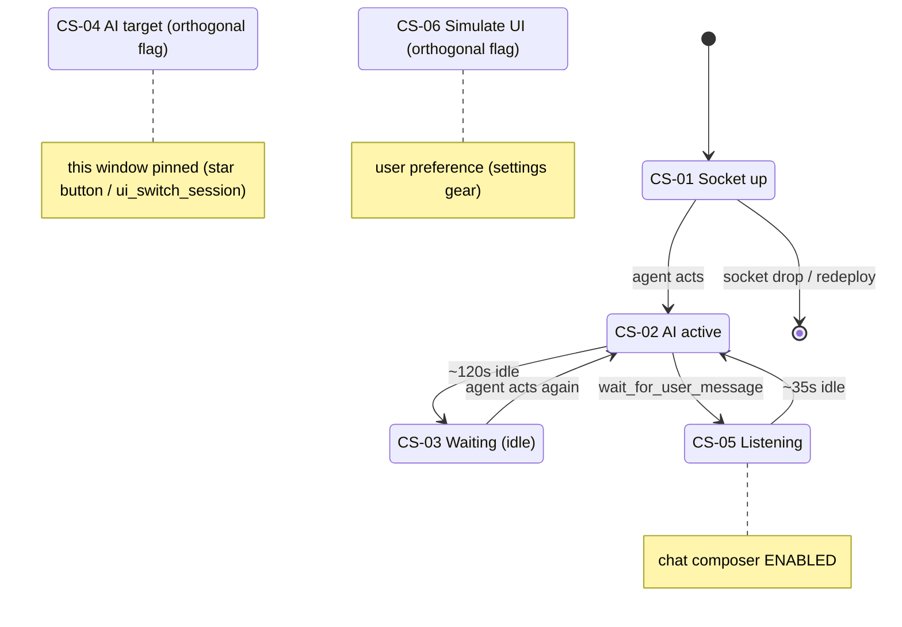

# Connect AI — MCP/AI connection states (as surfaced in the editor)

| Field | Value |
|-------|-------|
| Document ID | `DESIGN-KAI-002` |
| Realises | `FEAT-KAI-001` — `FR-AI-02` (target), `FR-AI-07` (listening/gating), `FR-AI-10` (presence) |
| Supplements | `DESIGN-KAI-001` (the channel & panel design) |

> What "connected" means inside **Connect AI**, and the states the editor shows for the MCP/AI connection. This is **not a state machine** — the editor can't observe a persistent MCP session (the remote MCP is **stateless HTTP**, with no server-held connection per editor window). Instead it infers a small set of **independent, time-windowed signals** from the *events* the agent causes, and surfaces them. This doc enumerates those states, how each is detected, and where each shows up.
>
> *(CR-KAI-001 adds **CS-07**, a server-side **per-connection registry** — still freshness-based, not a socket flag — that lets the panel count how many MCP clients are connected and how many are outdated.)*

## 1. Why there is no single "connected" flag

An MCP host (Claude/Cursor/ChatGPT/Claude Code) talks to `mcp.kymo.studio` over Streamable-HTTP/SSE (`FR-MC-03`). That connection is between the **host and the Worker** — the editor window never sees it. What the editor *can* see is the side-effects the agent produces over the per-user **`UserChannel`** (`/userws`) and the per-diagram room: a `ui_status` line, an `open`/`open-project` control message, an `edit_diagram` doc push, a `wait_for_user_message` poll. So "connection state" is **recent activity**, not a socket handshake — which is what the user actually cares about ("is an AI doing things in my editor right now?").

Therefore the state is **a set of orthogonal, freshness-based signals**, each held in `web/mcpstatus.tsx`, not one enum. A window can be *active* and *targeted* and *listening* at the same time, or any subset.

The same freshness logic can also be kept **server-side, per connection**: `CR-KAI-001`'s registry (CS-07) records each MCP client's last activity in the `UserChannel` DO, so the panel can report *how many* clients are connected and *which are outdated* — without ever observing a real socket (still recent-activity, not a handshake).

## 2. The connection-state signals

| ID | State signal | Source (what sets it) | Freshness | Meaning | Where it shows |
|----|--------------|-----------------------|-----------|---------|----------------|
| **CS-01** | **Socket up** | the `/userws` WebSocket is `OPEN` | live (no timed reconnect) | the window can send/receive control messages at all | (implicit; offline send → warning) |
| **CS-02** | **AI active** (`mcpActive`) | `pingMcp()` on **any** `/userws` control message or an `origin:"mcp"` room push | **120 s** window | an AI client acted on this account recently | ✨ button `.live` (pulse); open file-tab badge `.file-tab-ai`; Connection tab "Connected — an AI client is driving this editor right now" |
| **CS-03** | **Waiting** | `mcpActive` stale/false **and** the CS-07 registry has no connected client | — | no AI connected and none acting | Connection tab "Waiting for an AI client to connect…" — the banner shows **Connected** if *either* CS-02 (driving now) *or* CS-07 (a client is registered) holds, so a connected-but-idle client no longer reads as "Waiting" |
| **CS-04** | **AI target** (`pinned`) | the user pins via ✨ / Connection toggle / `ui_switch_session`; server echoes `{type:"ai-target"}` | sticky (until unpinned / socket drop) | **this** window is where `ui_*` control messages land | ✨ button `.target`; Connection toggle "AI is controlling THIS window" |
| **CS-05** | **Listening** (`listening`) | server pushes `{type:"listening"}` on each `wait_for_user_message` poll | **35 s** window (a poll fires ~every 25 s) | a process is waiting for the user's typed message | chat composer **enabled** (else disabled with "Waiting for a listener…") |
| **CS-06** | **Simulate UI** | user toggle (orthogonal preference, not a connection state) | persisted | typed prompts carry `simulate:true` | settings-gear "UI" badge |
| **CS-07** | **Registered connection** (per MCP client) | `KymoMCP` lifecycle → `UserChannel` registry: **connect** = `server.oninitialized`, **wake / idle-SSE** = `onStart`, **clean disconnect** = `destroy()` (MCP `DELETE`) → `/mcp-gone`; tool calls also refresh `lastSeen`. Each change **pushes** `{type:"mcp-connections"}` over `/userws`; a DO **alarm** ages out ungraceful drops | **`STALE_MS` (10 min)** = *connected*; `> HARD_TTL` (60 min) = pruned | a specific MCP **client install** (Claude / Cursor / Claude Code …) is connected to this account — **keyed by OAuth `client_id`** so a reconnect updates one row (not a ghost per session); record carries client+protocol+server version | **Connection** tab "N connected · M **outdated**" rendered **live** (push over a **self-reconnecting** `/userws` + 10 s local re-render — no freeze on redeploy, no poll); rows **collapsed per client** (freshest + "N sessions"; dimmed "Disconnected" when stale) — `FR-AI-11`, `CR-KAI-001` |

CS-02 vs CS-07: **CS-02** is the editor's own client-side, *aggregate* "an AI did
something here" (120 s, in `mcpstatus.tsx`); **CS-07** is the Worker's *per-connection*
registry — it can say *which* clients, *how many*, and which are **outdated**. Same
freshness-window idea, different vantage point (server-side, per client).

Detail on the windows/identities behind targeting and the inbox/listening mechanics is in `DESIGN-KAI-001` §2 (UserChannel) and §5 (reverse channel); the registry behind CS-07 is in `DESIGN-KAI-001` §7.

## 3. The states a user reads, by panel surface

- **✨ activity-bar button** — composite: `.live` (CS-02 AI active, 120 s), `.target` (CS-04 this window pinned), `.active` (panel open). Tooltip reflects target/live.
- **Connection tab** — **Connected** (CS-02) vs **Waiting** (CS-03), the **pin** toggle (CS-04), and this window's **session id** (`ui_list_sessions` / `ui_switch_session` reference it).
- **Chat composer** — **enabled only while Listening** (CS-05, `FR-AI-07`); otherwise disabled. Independent of CS-02/CS-04: an AI can be *active* yet not *listening* (it isn't polling `wait_for_user_message`), so the composer stays disabled until one listens.
- **Open file tab** — pulses the `.file-tab-ai` badge while AI is active (CS-02) on a diagram the agent is editing.

## 4. How a session reaches each state (connect flow)

The flow a connection moves through (informative, not a normative FSM — the §2 signals are the source of truth):

1. **Disconnected** — no client connected; nothing active (no CS-01/02). Composer disabled (no CS-05); Connection "Waiting…" (CS-03).
2. **Connecting** — the user adds the MCP client (Setup tab) and signs in with Google (OAuth). Still nothing in the editor until the agent acts.
3. **Active** — the agent runs a tool; `ui_status`/control pushes flip **CS-02** on (120 s). ✨ pulses; Connection "Connected".
4. **Targeted** — the user pins this window (optional) → **CS-04**; `ui_*` now lands here specifically.
5. **Listening** — the agent calls `wait_for_user_message`; **CS-05** goes fresh (35 s); the composer enables, so the user can drive the agent back.

A worker redeploy or connection drop returns the host to **Disconnected** (the MCP connector drops — see [[mcp-connector-drops-on-redeploy]]); the editor signals simply go stale.

One node per state (CS-01..CS-06, each appears exactly once). The lifecycle states (CS-01/02/03/05) carry the transitions; CS-04 and CS-06 are **orthogonal flags** (no transitions — they can hold in any lifecycle state):

> Informative — the **CS-01..CS-06** signals in §2 are the source of truth (orthogonal, not a single FSM): before **CS-01** the host is disconnected/connecting; **CS-04** and **CS-06** are flags that hold across any lifecycle state. The same picture also ships as the sample diagram **"Connect AI — States"** in the Kymo project.

## Annex A — Revision History

| Version | Date | Author | Changes |
|---------|------|--------|---------|
| 0.1 | 2026-06-20 | Vũ Anh | Initial note: the MCP/AI connection states Connect AI surfaces (Socket up / AI active / Waiting / AI target / Listening + the Simulate preference), how each is detected (signal + freshness window) and where it shows, plus the informative connect flow. Supplements `DESIGN-KAI-001`. |
| 0.2 | 2026-06-20 | Vũ Anh | Numbered the signals **CS-01..CS-06** (§2) and cross-referenced them from §3/§4; embedded a `stateDiagram-v2` mermaid diagram of the connect flow in §4. |
| 0.3 | 2026-06-20 | Vũ Anh | Added **CS-07** (server-side per-MCP-connection registry, `FR-AI-11` / `CR-KAI-001`): freshness-based "connected" + four outdated reasons (server / stale / protocol / client), surfaced as "N connected · M outdated" in the Connection tab; clarified CS-02 (client-side aggregate) vs CS-07 (server-side per-connection) and nuanced §1. |
| 0.7 | 2026-06-20 | Vũ Anh | Connection-tab banner reconciled CS-02 with CS-07: shows **Connected** if *either* an AI is acting (CS-02) *or* a client is registered (CS-07), so a connected-but-idle client no longer reads "Waiting" (`CR-KAI-001`). Updated CS-03. |
| 0.6 | 2026-06-20 | Vũ Anh | CS-07 reliability (`CR-KAI-001` v1.3): rendered over a **self-reconnecting `/userws`** + 10 s local re-render (no freeze after a redeploy), rows **collapsed per client** (dimmed "Disconnected" when stale). |
| 0.5 | 2026-06-20 | Vũ Anh | CS-07 **keyed by OAuth `client_id`** (per install) not the rotating session id (`CR-KAI-001` v1.2) — a reconnect updates one row instead of a ghost per session. |
| 0.4 | 2026-06-20 | Vũ Anh | CS-07 reworked to **lifecycle + live push** (`CR-KAI-001` v1.1): source is `KymoMCP` connect (`oninitialized`) / wake (`onStart`) / clean disconnect (`destroy()`→`DELETE`), each pushing `{type:"mcp-connections"}` over `/userws` (no poll), with a DO alarm for ungraceful drops — so a reconnect/disconnect shows in the editor immediately without any tool call. |
